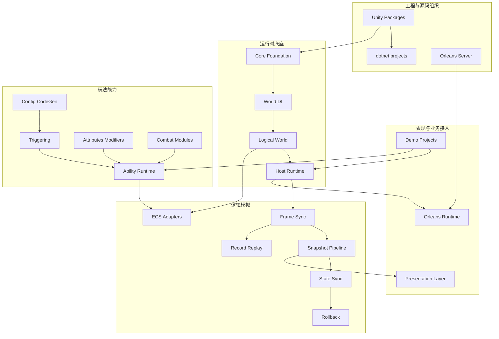

# AbilityKit 框架设计文档

> AbilityKit 是一个以“战斗能力表达”为中心的 Unity + .NET 框架。它不只提供技能系统，而是把逻辑世界、依赖注入、Host 运行时、ECS、触发器、战斗模块、网络同步、回放、表现层解耦和 Orleans 服务端串成一套可组合的能力体系。

---

## 1. 文档组织原则

本目录不再强制按已有文件夹结构解释框架，而是按“框架提供什么能力、为什么这样设计、源码如何落地、关键流程如何运行”组织阅读。

每篇设计文档应尽量包含：

| 内容 | 说明 |
|------|------|
| 能力定位 | 这个模块解决什么问题，不解决什么问题 |
| 文档类型 | 这是能力地图、Canonical 设计、接入指南、示例分析、历史审计还是演进计划 |
| 设计方案 | 抽象边界、核心对象、生命周期、扩展点 |
| 源码入口 | 对应 Unity package、.NET project、Server project |
| 运行流程 | Mermaid 流程图或时序图 |
| 使用路径 | Demo、测试、运行入口 |
| 事实状态 | 区分规范约束、当前实现、示例策略、目标设计、已知限制和历史结论 |
| 风险与约束 | 生命周期、线程、确定性、性能、跨端约束 |

---

## 2. 总体能力地图

---

## 3. 文档阅读路径

### 3.1 框架使用者路径

1. [内训 PPT 与飞书深入阅读导航](00-PresentationAndFeishuNavigation.md)
2. [序章：为什么需要 AbilityKit](00-Prologue.md)
3. [AbilityKit 能力地图](01-OverviewAndGettingStarted/00-AbilityKitCapabilityMap.md)
4. [AbilityKit 是什么](01-OverviewAndGettingStarted/01-WhatIsAbilityKit.md)
5. [核心概念](01-OverviewAndGettingStarted/02-CoreConcepts.md)
6. [逻辑世界概述](02-LogicalWorldDesign/01-WorldOverview.md)
7. [Host 运行时](03-LogicalWorldHostDesign/01-HostRuntime.md)
8. [技能系统架构](08-GameplayModules/01-SkillSystemArchitecture.md)
9. [触发器系统](08-GameplayModules/02-TriggeringSystem.md)
10. [网络同步能力地图](07-NetworkSynchronization/00-SynchronizationCapabilityMap.md)

### 3.2 框架扩展者路径

1. [服务容器](02-LogicalWorldDesign/05-ServiceContainer.md)
2. [系统设计](02-LogicalWorldDesign/04-SystemDesign.md)
3. [ECS 核心概念](06-ECSArchitecture/01-ECSCoreConcepts.md)
4. [快照分发](04-PresentationLayerDesign/02-SnapshotDispatch.md)
5. [配置系统](05-CommonModules/04-ConfigurationSystem.md)
6. [投射物系统](08-GameplayModules/04-ProjectileSystem.md)
7. [属性系统](08-GameplayModules/05-AttributeSystem.md)

### 3.3 服务端/联机路径

1. [服务端能力地图](12-ServerArchitecture/00-ServerCapabilityMap.md)
2. [Orleans 运行时与部署设计](12-ServerArchitecture/01-OrleansRuntimeAndDeployment.md)
3. [Gateway、Room 与 Battle 主链路设计](12-ServerArchitecture/02-GatewayRoomBattleFlow.md)
4. [Web 后台：Admin Console 技术选型与职责边界](12-ServerArchitecture/03-WebAdminConsoleDesign.md)
5. [网络同步能力地图](07-NetworkSynchronization/00-SynchronizationCapabilityMap.md)
6. [帧同步机制](07-NetworkSynchronization/01-FrameSync.md)
7. [状态同步](07-NetworkSynchronization/02-StateSync.md)
8. [回滚预测](07-NetworkSynchronization/03-RollbackPrediction.md)
9. [预测与表现重整](07-NetworkSynchronization/03.1-PredictionReconciliationDesign.md)
10. [回放系统](07-NetworkSynchronization/04-ReplaySystem.md)
11. [会话协调](07-NetworkSynchronization/05-SessionCoordination.md)
12. [多人联网 SDK 新示例接入指南](07-NetworkSynchronization/07-MultiplayerSdkIntegrationGuide.md)

---

## 4. 文档目录

### 00 序章

| 文档 | 定位 | 说明 |
|------|------|------|
| [00-序章：为什么需要 AbilityKit](00-Prologue.md) | 背景与边界 | 项目起因、战斗系统补丁化困境、跨项目复用诉求、GAS/EGamePlay/ET/Orleans 技术选型、Unity Package + .NET 双入口、源码证据链与测试验证路线 |
| [PPT 与飞书深入阅读导航](00-PresentationAndFeishuNavigation.md) | 内训导航 | PPT 阶段到设计文档的跳转、MOBA/Shooter 展示契约、图片选择和飞书链接规则 |

### 01 概览与入门

| 文档 | 定位 | 说明 |
|------|------|------|
| [00-AbilityKit 能力地图](01-OverviewAndGettingStarted/00-AbilityKitCapabilityMap.md) | 能力地图 | Foundation、SkillCore、BattleRuntime、SyncRuntime、ServerRuntime 能力边界、能力组合、源码入口和选型速查 |
| [01-AbilityKit 是什么](01-OverviewAndGettingStarted/01-WhatIsAbilityKit.md) | 框架定位 | 通用战斗工具集合定位、按需组合、纯 C# 复用、战斗应用层非统一化边界、适用范围和源码阅读路径 |
| [02-核心概念](01-OverviewAndGettingStarted/02-CoreConcepts.md) | 术语模型 | World、Entity、Component、System/Feature、Frame/Input/Snapshot、Skill/Pipeline/Runtime、Trigger/Effect/Context、Session/Adapter 术语地图 |
| [03-快速开始](01-OverviewAndGettingStarted/03-QuickStart.md) | 入门路径 | dotnet 构建、Console Demo CLI、SYNC_MODE、启动阶段、自动测试、测试入口和分阶段阅读路径 |
| [04-项目结构](01-OverviewAndGettingStarted/04-ProjectStructure.md) | 工程结构 | Unity/Packages 共享包权威源码、src Compile Include 与自有应用源码、Server/Orleans 工程、Demo 文档路径、配置生成和目录边界 |

### 02 逻辑世界设计

| 文档 | 定位 | 说明 |
|------|------|------|
| [01-逻辑世界概述](02-LogicalWorldDesign/01-WorldOverview.md) | 世界生命周期 | 最小 IWorld 契约、ECS/Host 分层、WorldManager 创建/Tick/释放失败矩阵、单线程与 E0-E3 证据边界 |
| [02-实体设计](02-LogicalWorldDesign/02-EntityDesign.md) | 实体模型 | IEntityId、EntityWorld 生命周期、父子/逻辑 child id，以及 Invalid、Has、容量、祖先环和双实现漂移限制 |
| [03-组件设计](02-LogicalWorldDesign/03-ComponentDesign.md) | 组件存储 | ComponentRegistry、object[] 存储、索引/查询/事件；明确 TypeId 仅进程内稳定、struct 装箱和非零分配边界 |
| [04-系统设计](02-LogicalWorldDesign/04-SystemDesign.md) | 可选 Entitas 调度 | Phase/Order/FullName 排序、显式扫描范围、构造/安装失败语义；Priority 与 MOBA order 不属于统一框架排序 |
| [05-服务容器](02-LogicalWorldDesign/05-ServiceContainer.md) | 世界级依赖注入 | 注册、Scope/Seed、模块规划与释放；补 transient 所有权、TryResolve 异常差异、单线程边界和 31 项局部 E3 |

### 03 Host 运行时设计

| 文档 | 定位 | 说明 |
|------|------|------|
| [01-Host 运行时](03-LogicalWorldHostDesign/01-HostRuntime.md) | 轻量 Host 协调 | Create/Destroy/Tick Hook 失败语义、稳定广播 snapshot、连接/Feature 所有权、Builder 顺序与 Host 8 项测试接线 |
| [02-Host 模块系统](03-LogicalWorldHostDesign/02-HostModules.md) | 模块装配 | StablePriorityList Hook、Feature 协作、Builder 与独立 ModuleHost 边界、Install 无回滚/自动 Uninstall 的当前限制 |
| [03-World 管理器](03-LogicalWorldHostDesign/03-WorldManager.md) | 多世界管理 | IWorldFactory、创建/Tick/销毁/DisposeAll 与 Blueprint；初始化失败、ID 不一致、集合修改和释放中断边界 |

### 04 表现层设计与客户端流程入口

> 第 01-03 篇属于表现层设计；第 04 篇因历史编号保留在本目录，但主题是并列的客户端游戏流程运行时，不属于表现层内部。

| 文档 | 定位 | 说明 |
|------|------|------|
| [01-视图事件抽象](04-PresentationLayerDesign/01-ViewEventAbstraction.md) | 项目表现端口设计 | MOBA ViewEvent source mode、adapter 释放令牌、Binder/Feature 所有权、Hybrid 去重责任，以及不下沉统一表现应用层的理由 |
| [02-快照分发](04-PresentationLayerDesign/02-SnapshotDispatch.md) | 通用路由与项目注册 | Dispatcher/Pipeline/Builder、OpCode 类型保护，以及空 Dispose、回调重入、非事务构建、单线程与项目 registry 边界 |
| [03-跨平台实现](04-PresentationLayerDesign/03-CrossPlatform.md) | 跨端适配原则 | Unity、Console、ET、Server/Headless 的差异化宿主；Shooter GameObject/DOTS 只证明后端切换，不代表 Headless 或跨平台完整验证 |
| [04-客户端游戏流程运行时架构](04-PresentationLayerDesign/04-ClientGameFlowAndPhaseArchitecture.md) | 客户端顶层生命周期 | Root/Battle HFSM、Feature/Scope 与静态 SessionHost 替换、subsystem reset、失败后空态和唯一 owner 边界 |

### 05 通用模块

| 文档 | 定位 | 说明 |
|------|------|------|
| [01-事件系统](05-CommonModules/01-EventSystem.md) | 事件分发 | Core/Host/项目职责、稳定 ID、优先级与 snapshot、once 重入、异常隔离、string/int 单次释放、null 所有权与 E3 契约 |
| [02-对象池](05-CommonModules/02-ObjectPool.md) | 对象复用 | Pools/Scope/Manager/ObjectPool、全构建 collection check、引用身份、锁内回调、旧句柄、PooledObject 与分层测试边界 |
| [03-定时器框架](05-CommonModules/03-TimerFramework.md) | 时间调度 | 最小时间工具定位、Scheduler 所有权、任务参数/顺序/分配/异常和终止语义，以及当前无生产消费者/专项测试的证据边界 |
| [04-配置系统](05-CommonModules/04-ConfigurationSystem.md) | 配置链路 | 通用 ConfigDatabase 的 factory-first/反射 fallback 与批次提交；MOBA 表目录、Luban、强类型门面、行为配置和业务校验归项目层 |
| [05-Flow 流程引擎](05-CommonModules/05-FlowEngine.md) | 流程编排 | 通用流程树而非 Battle Flow；Runner/Session/Pool、Context、组合节点、唤醒/pump、HFSM 边界；2026-08-17 扩至 236 项契约测试并修复 8 个缺陷（provider 池固化/重入/ParallelAll 遗忘失败等） |
| [06-HFSM 分层状态机](05-CommonModules/06-HFSMStateMachine.md) | 状态机 | 稳定状态机语义与项目状态图分层，转移/exit-time/pending、Shooter/MOBA 消费、Graph 工具和核心契约缺口 |
| [07-MOBA CodeGen 与 Luban 生产链](05-CommonModules/07-CodeGenAndLubanProductionPipeline.md) | 项目生成与发布供应链 | MOBA 十组 manifest/analyzer、Contracts 所有权、Luban 候选/权威/副本模型，以及当前 gate 失效引用与收敛顺序 |
| [08-ActionTimeline 数据协议与播放边界](05-CommonModules/08-ActionTimelineDataAndPlayback.md) | 时间线数据协议 | 公共 DTO/最小播放器与项目 handler/phase 分层，clip identity、reset、异常、确定性和无实质 E3 的边界 |
| [09-Excel 与 ScriptableObject 编辑器同步](05-CommonModules/09-ExcelScriptableObjectSync.md) | Editor 数据同步 | Editor-only 同步机制与项目 schema/发布分层，baseline 三方合并、批处理、非事务和无自动测试限制 |
| [Dataflow 处理器链与执行边界](../../Unity/Packages/com.abilitykit.dataflow/Document/Dataflow数据流处理模块开发设计文档.md) | 包内 canonical | 类型兼容回灌、Damage 异形 Context 协议、typed slot、Abort/Failure 部分输出、执行快照与 Processor 所有权、Runtime 局部 E3 |
| [HotReload Entitas 系统热替换设计](../../Unity/Packages/com.abilitykit.hotreload/Document/HotReload热更新运行时模块开发设计文档.md) | 包内 canonical | staged Apply、实例级 world 隔离、自动/显式释放、overlay/static 所有权、失败矩阵、Runtime E3 与 Editor E1 边界 |

### 06 ECS 架构

| 文档 | 定位 | 说明 |
|------|------|------|
| [01-ECS 核心概念](06-ECSArchitecture/01-ECSCoreConcepts.md) | 轻量 ECS canonical | EntityWorld/句柄/组件/层级/事件模型，Invalid、实体级 Has、初始容量、child id、装箱、单线程与双镜像限制 |
| [02-Entitas 实现](06-ECSArchitecture/02-EntitasImplementation.md) | 可选 Entitas 适配 | contexts/systems 生命周期、模块与 installer 排序、Reactive 顺序、MOBA generated contexts、初始化失败回收和第三方兼容边界 |
| [03-查询与遍历源码深潜](06-ECSArchitecture/03-QueryAndIteration.md) | 自研查询实现深潜 | T1 候选、index-only snapshot、版本/实时组件读取、同槽重建、Count/Any 成本、分配和非并发边界 |
| [04-Svelto 实现](06-ECSArchitecture/04-SveltoImplementation.md) | 可选 Svelto 适配 | World.DI 整组注册与替换、`entitiesForTesting` 查询入口风险、submission/释放、Shooter 消费与适配层证据缺口 |
| [05-查询与遍历总览](06-ECSArchitecture/05-QueryAndTraversal.md) | 跨实现选型 canonical | 轻量 ECS、Entitas、Svelto 的并列选择，稳定业务排序、结构修改、分配测量、所有权和 E0-E5 对比 |

### 07 网络同步

| 文档 | 定位 | 说明 |
|------|------|------|
| [Network SDK 组装、生命周期与 Transport 边界](../../Unity/Packages/com.abilitykit.network.sdk/README.md) | 包内 canonical | Builder factory 互斥与 owned connection、transport 延迟创建、Tick/Dispose、dispatcher、池化 payload、失败矩阵及 TCP/InMemory/LiteNet/WebSocket 证据分层 |
| [00-网络同步能力地图](07-NetworkSynchronization/00-SynchronizationCapabilityMap.md) | 能力地图 | 模板、Room 能力 Profile 与客户端 controller 三层边界；MOBA 唯一 FrameSync、Shooter 默认 StateSync/2 人/30 帧 full，以及可靠事件、回放与 E0-E5 全局解释 |
| [01-帧同步机制](07-NetworkSynchronization/01-FrameSync.md) | Canonical 设计 | 输入帧、Host/Relay、Q32.32 FrameTime 与 rollback provider；MOBA `BattleWorldWithFrameSync`、默认 smoke 路线及“帧时钟确定不等于全战斗确定”的边界 |
| [02-状态同步](07-NetworkSynchronization/02-StateSync.md) | Canonical 设计 | 元信息/实体状态双轨、快照缓存与路由生命周期、hash/diff、PredictionCoordinator 重演顺序及 store 清理缺口 |
| [03-回滚预测](07-NetworkSynchronization/03-RollbackPrediction.md) | Canonical 设计 | Provider 稳定顺序、池化捕获/恢复、非事务 Import、三层预测实现、FrameTime 恢复与 E0-E5 证据 |
| [03.1-预测与表现重整](07-NetworkSynchronization/03.1-PredictionReconciliationDesign.md) | Canonical 设计 | 逻辑校正到 View/插值/Cue 的项目桥接契约，区分底座实现、接入要求、目标设计与验收证据 |
| [04-回放系统](07-NetworkSynchronization/04-ReplaySystem.md) | Canonical 设计 | Record/FrameRecord/akrec 三层职责、v4 writer/v1-v4 reader、RecordIdHash、Smoke artifact 与 CI 分层 |
| [05-会话协调](07-NetworkSynchronization/05-SessionCoordination.md) | Canonical 设计 | 阶段化 commit、Profile/Room 能力绑定、双连接唯一订阅、断线离线保留、1 分钟遗弃清理和跨 Grain/store 非事务边界 |
| [06-FrameRecord 编码与 Smoke 证据链](07-NetworkSynchronization/06-FrameRecordCodecAndSmokeEvidence.md) | Canonical 设计 | codec 身份、StateHash schema、v1-v4 兼容、RecordIdHash、Smoke 回读与 E3/E4/E5 分层 |
| [07-多人联网 SDK 新示例接入指南](07-NetworkSynchronization/07-MultiplayerSdkIntegrationGuide.md) | 接入指南 | 通用 battle 引擎、项目 controller/codec、远端能力拒绝式绑定、可靠事件、线性/阶段化 Room 选型、双连接唯一订阅与 transport 边界 |
| [08-多人联网模块演进计划](07-NetworkSynchronization/08-NetworkOptimizationPlan.md) | 演进计划 | 当前架构裁决、同步能力/可靠事件 P0、预测清理/确定性/非 TCP P1、测试矩阵与压缩历史摘要 |

### 08 玩法模块

| 文档 | 定位 | 说明 |
|------|------|------|
| [00-玩法能力地图](08-GameplayModules/00-GameplayCapabilityMap.md) | 玩法地图 | Triggering、Ability、Combat、Record 的能力总览，以及稳定原语、项目应用层和示例策略的下沉判定 |
| [01-技能系统架构](08-GameplayModules/01-SkillSystemArchitecture.md) | MOBA 应用层参考 | Pipeline/Trigger/Effect/Combat 原语与 MOBA 施法编排边界；阶段对象复用、cleanup 异常处理、Shutdown 非中断语义及分层证据 |
| [02-触发器系统](08-GameplayModules/02-TriggeringSystem.md) | 触发器架构 | TriggerPlan/Runner/Registry 公共契约，Observer Enter/Exit 异常边界、无业务事务保证，以及 MOBA RulePlan 参考 |
| [03-触发器编辑器生产链设计](08-GameplayModules/03-TriggerEditorAuthoringDesign.md) | 编辑器生产链 | 已确认 Authoring/Source/Runtime 三层模型、Source JSON 双向反写与冲突检测、Local/Global/Payload/Context 值引用、模板引用展开，以及不兼容 Legacy JSON 的新链路 |
| [03-Buff 系统](08-GameplayModules/03-BuffSystem.md) | MOBA 应用层参考 | 公共 Effect/Continuous/Trigger/Attribute/Tag 原语与 MOBA Buff 编排；候选构建补偿、提交后不回滚和逐项恢复边界 |
| [04-投射物系统](08-GameplayModules/04-ProjectileSystem.md) | 投射物运行时 | ProjectileWorld/Service、确定性运动与事件；内建 rollback 仅覆盖 active projectile 和 ID，外围状态由项目负责 |
| [05-属性系统](08-GameplayModules/05-AttributeSystem.md) | 属性与修饰器 | Attribute/Modifier 计算内核、注册顺序生成的进程内 AttributeId、自定义 registry 责任和 MOBA ECS 门面 |
| [06-伤害计算](08-GameplayModules/06-DamageCalculation.md) | 伤害管线 | 通用 float Dataflow Damage 与 MOBA Fixed64 AttackCalcInfo/Shield 结算链的独立边界，不互相外推确定性证据 |
| [07-Targeting 系统](08-GameplayModules/07-TargetingSystem.md) | 目标查询 | Candidate/Rule/Scorer/Selector 管线、融合 Top-K 条件、去重提交顺序和项目索引/锁定责任；当次 Targeting `67/67`，不与 MOBA 主工程结果合并 |
| [08-Pipeline 与 Ability Runtime](08-GameplayModules/08-PipelineAndAbilityRuntime.md) | 通用执行运行时 | run/phase 生命周期、双失败聚合、事件/trace 清理风险、内建 run 不响应默认 InterruptAll，以及 Pipeline `3/3`、Ability `4/4` 局部证据 |
| [09-EntityManager 与 SkillLibrary 索引基础设施](08-GameplayModules/09-EntityAndSkillIndexing.md) | 战斗索引 | 主存储先提交、索引非事务更新、comparer 与 live bucket 边界；EntityManager `3/3` 只验证 Update DTO，不证明真实索引行为 |
| [10-Motion Pipeline 与约束求解](08-GameplayModules/10-MotionPipeline.md) | 移动组合内核 | source/suppression/solver、硬编码主导碰撞组、固定步长一次结算和池化所有权；当次 .NET `8/8`，Unity Editor 未重跑 |
| [11-Continuous 框架接口设计](08-GameplayModules/11-ContinuousFrameworkDesign.md) | Continuous 公共契约 | 独立 continuous 包、DefaultContinuousManager 的 owner 索引/策略/Binder/注册回滚，以及 MOBA 五类应用模型边界 |
| [GameplayTags 快速接入](../../Unity/Packages/com.abilitykit.gameplaytags/README.md) | 包内入口 | 标签目录注册、层级匹配、NetIndex 反查、Ability 服务装配、模板与 Editor 资产边界 |
| [GameplayTags 标签系统模块](../../Unity/Packages/com.abilitykit.gameplaytags/Document/GameplayTags标签系统模块开发设计文档.md) | 包内 canonical | Core/Template/Ability Service 分层、Query/Requirements、owner/source 引用、序列化与协议身份风险、E0-E3 证据边界 |
| [12-GameplayTags 层级语义与工程边界](08-GameplayModules/12-GameplayTagsHierarchyAndEngineeringBoundaries.md) | 跨模块 canonical | 层级/查询/来源计数、JSON parent 字段不对称、byte 网络计数尾数据和 live Container 边界；当次 `2/2` 仅为最小值对象测试 |

### 09 示例与验收

| 文档 | 定位 | 说明 |
|------|------|------|
| [01-Console Demo 解析](09-ImplementationExamples/01-ConsoleDemoAnalysis.md) | 纯 .NET 示例与验收 | HostRuntime 创建世界，BattleFlow/FeatureHost 组织项目生命周期，输入经 HostNetworkInputSink 和正式 SubmitFrameInput request/response 进入世界，并由测试复用 bootstrapper |
| [02-ET Demo 解析](09-ImplementationExamples/02-ET%20Demo%20Analysis.md) | ET 接入参考 | ET Scene/Component 生命周期、MOBA driver、WorldFactory、输入与 FrameSnapshotData 表现适配；当前是 E0-E2 接入样例，未发现独立 E3-E5 |
| [03-MOBA Demo 解析](09-ImplementationExamples/03-MOBA%20Demo%20Analysis.md) | 项目级组合总览 | Blueprint/Bootstrap、Entitas、玩法应用层、通用 SnapshotPipeline 加项目 registry、预测回滚和多宿主复用；示例策略不等于框架默认应用层 |
| [03.1-MOBA 专题总览](09-ImplementationExamples/MOBA/00-Overview.md) | MOBA 导航 | MOBA 示例拆分阅读入口 |
| [03.2-MOBA 世界启动与运行时装配](09-ImplementationExamples/MOBA/01-WorldAndBootstrap.md) | 世界装配 | World/Blueprint/Bootstrap/HostRuntime 装配、Strict validation 启动事务、预测模块和 Session teardown 项目边界 |
| [03.3-MOBA 输入、技能、配置与实体索引](09-ImplementationExamples/MOBA/02-InputSkillConfigEntity.md) | 输入与配置 | 输入批次、命令 Handler、技能准备、配置门面、Actor 身份和 Summon 失败补偿的分域所有权 |
| [03.4-MOBA Buff、Projectile 与 Damage 管线](09-ImplementationExamples/MOBA/03-BuffProjectileDamage.md) | 战斗管线 | Buff 恢复 retain、Projectile/Summon exactly-once 清理、Skill child capability 与 Damage 计算/落地分层 |
| [03.5-MOBA 快照、表现层与预测回滚](09-ImplementationExamples/MOBA/04-SnapshotPresentationPrediction.md) | 同步表现 | generated manifest/reflection fallback、成功后 frame guard、buffer 同帧 drain、Router/Dispatcher/Pipeline 与项目 Session 所有权 |
| [03.6-MOBA 技能执行深潜](09-ImplementationExamples/MOBA/05-SkillExecutionDeepDive.md) | 技能执行 | 权威输入、cast policy/runner、正常结束与 ForceTerminate/Clear、child capability 和 root trace exactly-once |
| [03.7-MOBA 配置、实体索引与生成深潜](09-ImplementationExamples/MOBA/06-ConfigEntitySpawnDeepDive.md) | 生成链路 | 配置 strict/reload、Actor 非事务外部副作用、Summon spawn transaction、多维索引与 Pre/PostExecute 调和 |
| [03.8-MOBA Buff 命令执行与生命周期收敛深潜](09-ImplementationExamples/MOBA/07-BuffLifecycleDeepDive.md) | Buff 执行深潜 | Immediate 队列、预算/重入、生命周期结束、事务性 parent retain 恢复及尚未重建的行为绑定 |
| [03.9-MOBA Projectile 与 Damage 深潜](09-ImplementationExamples/MOBA/08-ProjectileDamageDeepDive.md) | Projectile 深潜 | Shoot/Launch、双身份/source、Unlink/Clear retain 兜底释放、Trigger/Effect、Damage/HP/事件快照 |
| [03.10-MOBA Trace、Context 与 Effect 执行深潜](09-ImplementationExamples/MOBA/09-TraceContextEffectDeepDive.md) | Trace 与上下文 | canonical provenance 字段归一、Effect 节点推进、Action 成对生命周期、跨帧 ownership、结构校验与采样诊断 |
| [03.11-MOBA Trigger、Validation 与 Presentation Cue 深潜](09-ImplementationExamples/MOBA/10-TriggerValidationPresentationDeepDive.md) | Trigger 与表现 | Trigger gateway、owner-bound gate、BootstrapStrict 配置阻断、StageTrigger、runtime validation 和 PresentationCue |
| [03.12-MOBA PlanActions DSL 与 Continuous Runtime 深潜](09-ImplementationExamples/MOBA/11-PlanActionsAndContinuousRuntimeDeepDive.md) | DSL 与持续运行时 | ActionSchema/module、GiveDamage 属性来源、SpawnArea 事务、ContinuousRuntimeView 与 context boundary |
| [03.13-MOBA DI 与 System/Service 协作深潜](09-ImplementationExamples/MOBA/12-DIAndSystemServiceCollaborationDeepDive.md) | DI 协作 | 公共 World DI/System 原语与 MOBA namespace scan、service graph、system order 的项目所有权边界及失败证据 |
| [03.14-MOBA 持续行为能力组合设计](09-ImplementationExamples/MOBA/13-ContinuousCapabilityCompositionDesign.md) | 持续行为组合 | stack/periodic/cue/tag/modifier 组合，Buff/Projectile/Summon parent retain、恢复回滚与清理边界 |
| [03.15-MOBA 英雄技能正式实现设计](09-ImplementationExamples/MOBA/14-HeroSkillFormalDesign.md) | 英雄技能设计 | 六英雄配置组合、package 权威资源、墨子强化近战、妲己形状碰撞、嬴政 Area 严格校验与应用层边界 |
| [03.16-MOBA 联机会话与协议契约](09-ImplementationExamples/MOBA/15-OnlineSessionAndProtocolContract.md) | 联机会话 | `moba`/`battle` 身份正规化、唯一 FrameSync 模板、staged commit、断线宽限、完整 Room push、full recovery/可靠 ACK 与项目级 teardown |
| [03.17-MOBA 领域连续运行时与临时实体生命周期](09-ImplementationExamples/MOBA/16-DomainContinuousRuntimeAndTemporaryEntityLifecycle.md) | 领域运行时 | Motion source/motion.hit 与 Summon owner、trace、retain、post-spawn transaction、Clear 兜底清理 |
| [03.18-MOBA 主动、被动、Buff、Projectile 与 AOE 触发效果设计](09-ImplementationExamples/MOBA/17-ActivePassiveBuffProjectileAoeTriggerEffects.md) | 触发效果链路 | direct/owner-bound、canonical provenance、领域 retain/事务、Damage 属性来源和 exactly-once 关闭 |
| [03.19-MOBA 技能 Flow 与 Pipeline 配置设计](09-ImplementationExamples/MOBA/18-SkillFlowPipelineConfigDesign.md) | 技能 Flow 配置 | 26 个 Skill/Flow、Phase 使用矩阵、package 权威配置、Strict validation 和通用 Pipeline/MOBA schema 边界 |
| [03.20-MOBA Runtime 战斗逻辑层深潜](09-ImplementationExamples/MOBA/19-MobaRuntimeLogicLayerDeepDive.md) | 战斗逻辑层设计 | 输入输出、System/Service、DI 生命周期、测试分层，以及 runtime 作为项目应用组合而非框架默认层 |
| [03.21-MOBA Runtime 战斗逻辑层实战指南](../../local/Docs/AbilityKit战斗逻辑层设计草稿.md) | 实战指南（与 19 号互补） | 框架能力组合全景图、6 种扩展模式（0 代码到 50 行代码）、11 个实战反模式 + 修复路径、7 步上手流程 + 接入里程碑 |
| [03.22-Console Demo Bootstrap 与 FeatureHost 装配链路深潜](09-ImplementationExamples/MOBA/20-ConsoleDemoBootstrapAndFeatureDeepDive.md) | Console Demo 装配 | Bootstrap/FeatureHost、共享双连接 StateSync、真实墙钟网络 Tick、自动输入、两套 replay 与现存 attach/view/Hybrid 债务 |
| [04-Shooter Demo 与 Orleans Smoke](09-ImplementationExamples/04-Shooter%20Demo%20与%20Orleans%20Smoke.md) | 网络闭环与分层证据 | 默认 `state-sync-authority`、AuthoritativeInterpolation、2 人 Room 与 packed 1/30；区分本地模拟玩家、真实 Room 成员、E3 契约、历史 E4 artifact 和 E5 gate |
| [04.1-Shooter 专题总览](09-ImplementationExamples/Shooter/00-Overview.md) | Shooter 导航 | 项目级综合参考入口，区分模板/Profile/controller、可复用机制与 Shooter 应用编排；默认两名 Room 成员 ready，证据按 E0-E5 阅读 |
| [04.2-Shooter Runtime、Svelto 装配与恢复边界](09-ImplementationExamples/Shooter/01-RuntimeSveltoSimulation.md) | Shooter 运行时 | Blueprint/WorldModule、窄 RuntimePort、float Tick、结构提交、容量与 packed 恢复，以及 runtime 不拥有客户端表现/网络生命周期 |
| [04.3-Shooter Snapshot、Hash 与同步模型](09-ImplementationExamples/Shooter/02-SnapshotHashSync.md) | Shooter 同步 | packed/pure-state/hash、会话协商、full/delta 投影删除、缺失 Player 组件恢复与完整世界 hash 边界 |
| [04.4-Shooter Gateway、Orleans 与 Smoke 验收](09-ImplementationExamples/Shooter/03-GatewayOrleansSmoke.md) | Shooter 服务端 | staged loading 即时 commit、2 人全员 ready、严格输入、默认 StateSync/BattleWorld、模板发送节奏与 Smoke E3-E5 分层 |
| [04.5-Shooter 客户端同步策略](09-ImplementationExamples/Shooter/04-ClientSyncStrategies.md) | 客户端同步 | `NetworkSyncSessionBuilder` 协商、profile/controller 映射、预测/插值/Hybrid、可靠事件 checkpoint 与统一恢复协调 |
| [04.6-Shooter 服务端适配与 Smoke 证据深潜](09-ImplementationExamples/Shooter/05-ServerFlowAndSmokeDeepDive.md) | 服务端流程 | 默认 StateSync packed/30 帧 full、2 人开战、稳定身份、Room commit/离线清理、严格输入、AOI 24/30 与单双进程证据 |
| [04.7-Shooter 纯状态预算与兴趣范围深潜](09-ImplementationExamples/Shooter/06-PureStateBudgetAndInterest.md) | 状态预算 | Baseline/Active 双预算、AOI 稳定前缀与轮转窗口、Enter/Stay/Leave、observer state、量化和重同步边界 |
| [04.8-Shooter Smoke 验证用例深潜](09-ImplementationExamples/Shooter/07-SmokeValidationCases.md) | Smoke 验证 | staged loading、单/多进程拓扑、packed/恢复/终局断言与 runner/script/CI 分层；默认单进程仅一账号，双本地玩家不能证明两名 Room 成员 |
| [04.9-Shooter 网络模块深潜](09-ImplementationExamples/Shooter/08-NetworkModulesDeepDive.md) | 网络模块 | Room/battle 双连接、唯一 push 消费、墙钟 Tick、checkpoint flush、主线程 Drain 和释放所有权 |
| [04.10-Shooter Svelto 性能模式深潜](09-ImplementationExamples/Shooter/09-SveltoPerformanceModeDeepDive.md) | 性能模式 | struct/batch 优化、实际分配边界、ScenarioRunner、预算诊断及 performance smoke/full gate 分层 |
| [04.11-Shooter 表现会话与视图管线深潜](09-ImplementationExamples/Shooter/10-PresentationSessionAndViewDeepDive.md) | 表现会话 | SnapshotStream pooled ownership、full/delta Projection、GameObject/DOTS Binder，以及静态/PlayMode/remote 三条宿主路线的释放差异 |
| [04.12-Shooter 插值、混合预测与诊断深潜](09-ImplementationExamples/Shooter/11-InterpolationAndPredictionDeepDive.md) | 插值与预测 | profile/controller 映射、本地主控 pose 重演、远端插值、Hybrid 路由、float 时间线与恢复诊断 |
| [04.13-Shooter 逻辑层流程与单机/多人模式](09-ImplementationExamples/Shooter/12-LogicLayerFlowSingleAndMultiplayer.md) | 逻辑层流程 | 单机/客户端预测/服务端权威共享 runtime，三类停止 owner、双连接、表现与恢复组合及 remote teardown 缺口 |
| [04.14-Shooter 战斗玩法内核深潜](09-ImplementationExamples/Shooter/13-BattleGameplayKernelDeepDive.md) | 战斗内核 | 显式 step order、float 玩法、空间索引分配边界、Bot 统一输入及局部 replay/hash 证据 |
| [04.15-Shooter 多进程故障矩阵与收敛证据](09-ImplementationExamples/Shooter/14-MultiprocessFaultMatrixAndConvergenceEvidence.md) | 故障矩阵 | 历史 E4 artifact、五类双连接故障、45 秒恢复与 1 分钟 Room 宽限关系、收敛/进程清理及 gate 触发矩阵 |
| [04.16-Shooter 千单位状态同步与渲染优化](09-ImplementationExamples/Shooter/15-ThousandEntitySynchronizationAndRenderingOptimization.md) | 千单位性能 | AOI 变化抑制、零分配 codec/Mapper/Projection、GPU stable slot 与局部上传、端到端指标、2K allocation/headless 门禁和证据边界 |

### 10 工程质量与测试

| 文档 | 定位 | 说明 |
|------|------|------|
| [01-正式测试流程、单元测试与冒烟测试](10-EngineeringQuality/01-TestingWorkflow.md) | 测试门禁 | 配置/runner/workflow 三层模型、28 项配置与 15 个实际 gate、MOBA 默认 FrameSync、普通/multiprocess workflow 接线差异、validator 边界及 E0-E5 |
| [02-AI 训练数据契约与 JSONL 校验](10-EngineeringQuality/02-AiTrainingDataContract.md) | AI 数据契约 | run/episode/step JSONL、Reader 的跨行/数组/有限值校验边界、Python dataset/BC/metadata 与局部 E3 |
| [03-MOBA 与 Shooter 示例工业化流程](10-EngineeringQuality/03-MobaShooterIndustrializationFlow.md) | 示例工业化 | 高接入度参考应用层、MOBA 默认 FrameSync/双连接/恢复/ACK、Shooter 默认 StateSync 与两人 Smoke 风险，以及 gate catalog/workflow 实际接线差异 |
| [04-公司级采用与模块治理规范](10-EngineeringQuality/04-CompanyAdoptionAndModuleGovernance.md) | 采用治理 | 资产/成熟度/证据分层、实际命令与 artifact 准入记录、候选发布工具边界及应用编排不上移规则 |
| [05-跨模块性能与热路径治理](10-EngineeringQuality/05-CrossModulePerformanceAndHotPathGovernance.md) | 性能治理 | workload、测量、基线、预算，Runtime measurement-only 与 Shooter ThresholdFailure 阻断分离及环境字段边界 |
| [06-Beta 稳定化与发布检查清单](10-EngineeringQuality/06-BetaStabilizationAndReleaseChecklist.md) | 发布门禁 | `tools/publish` cohort/audit/candidate/local-tag 能力、8 包候选批次、旧 reset 风险及当前无发布 E5 的缺口 |
| [07-Analysis Artifact 与运行证据](10-EngineeringQuality/07-AnalysisArtifactAndRuntimeEvidence.md) | 分析产物契约 | `abilitykit-analysis.v1`、section 投影、严格 codec 与宽松 Gateway 展示消费者、样例漂移和统一 validator 缺口 |
| [08-AI 模型产物运行时策略](10-EngineeringQuality/08-AiModelArtifactRuntimePolicy.md) | 模型发布策略 | dataset/model/metadata、来源校验边界、每次推理数组分配、动作安全、跨语言 fixture 与 AI E5 缺口 |
| [09-帧同步与状态同步审计记录（2026-08-03）](10-EngineeringQuality/09-FrameSyncStateSyncAuditRecord-20260803.md) | 历史审计 | 保留 2026-08-03 阶段审计与 2026-08-16 复核：multiprocess 已拆 host/client 场景进程但双客户端仍同进程，gate 描述与 workflow 接线落后；当前契约仍以同步、测试与发布 canonical 为准 |
| [Ability Explain 快速接入](../../Unity/Packages/com.abilitykit.ability.explain/README.md) | Editor 可解释化入口 | 最小接入、八类扩展、Forest/Diff/Relation/Details 和已知实现边界 |
| [Ability Explain 设计](../../Unity/Packages/com.abilitykit.ability.explain/Document/AbilityExplainDesign.md) | 包内 canonical | Registry 仲裁、Presenter 生命周期、Discovery、Diff/Relation 真实语义、失败矩阵与 E0-E1 证据 |
| [Ability Explain Mock Sample](../../Unity/Packages/com.abilitykit.ability.explain/Samples~/MockIntegration/MockIntegration.md) | Editor Sample | 六类主扩展、Timeline Details 演示、操作入口和非生产边界 |
| [Ability TestKit 设计](../../Unity/Packages/com.abilitykit.ability.testkit/Document/AbilityTestKit能力测试工具模块开发设计文档.md) | 包内 canonical | Trigger World Harness 所有权、Tick/Dispose、测试动作、内存 Loader 与 Moba E3 局部测试 |
| [Analyzer 设计](../../Unity/Packages/com.abilitykit.analyzer/Document/Analyzer静态约束分析模块开发设计文档.md) | 包内 canonical | Runtime、Unity Build Checker、Roslyn 三运行面，配置 fail-open、构建阻断和 DLL 同步责任 |
| [BaseEditor 设计](../../Unity/Packages/com.abilitykit.base.editor/Document/BaseEditor基础编辑器工具模块开发设计文档.md) | 包内 canonical | 可插拔窗口、Builder 断链、Pool Monitor、Action 预览和 legacy GameplayTag 所有权 |
| [ActionEditorImpl 设计](../../Unity/Packages/com.abilitykit.actioneditor.impl/Document/ActionEditorImpl动作编辑器运行实现模块开发设计文档.md) | 包内 canonical | Authoring 类型、logic 导出、DTO、基础播放器与 MOBA 执行链分工 |

> 帧同步与状态同步的阶段性材料已归档为 [09-FrameSyncStateSyncAuditRecord-20260803.md](10-EngineeringQuality/09-FrameSyncStateSyncAuditRecord-20260803.md)。它只保留历史审计和复核记录，不替代稳定的 FrameSync、Session、FrameRecord、Smoke 或 Analysis Artifact canonical。

### 11 文档工程计划

| 文档 | 定位 | 说明 |
|------|------|------|
| [01-文档治理路线图](11-DocumentationCompletionPlan.md) | 文档治理 | 文档覆盖范围、源码验证重点、专题优先级、测试/CI 文档边界和验收顺序 |
| [02-飞书离线导出与同步指南](FeishuOfflineExportGuide.md) | 文档发布工具 | `Docs/design` 发布输入、Preview 本地产物、Board `630/630` 离线审计、增量阻断/替代页、权限和恢复；远端能力只按日期化探针声明 |

### 12 服务端架构

| 文档 | 定位 | 说明 |
|------|------|------|
| [00-服务端能力地图](12-ServerArchitecture/00-ServerCapabilityMap.md) | 服务端地图 | `battle`/`moba` 身份边界、MOBA FrameSync 与 Shooter StateSync 默认、断线保留、遗弃清理和 E0-E5 责任分层 |
| [01-Orleans 运行时与部署设计](12-ServerArchitecture/01-OrleansRuntimeAndDeployment.md) | 运行时部署 | Host/Gateway 装配、角色/profile、内存 store fallback、activation 清理 timer，以及 placement/外部存储/跨资源事务尚未闭环 |
| [02-Gateway、Room 与 Battle 主链路设计](12-ServerArchitecture/02-GatewayRoomBattleFlow.md) | 主链路设计 | staged commit、RoomType 正规化、离线 owner 迁移、1 分钟遗弃回收、Battle/FrameSync Destroy 与部分失败边界 |
| [03-Web 后台：Admin Console 技术选型与职责边界](12-ServerArchitecture/03-WebAdminConsoleDesign.md) | 开发验收控制面 | Vite/Vue 聚合门面、HTTP catalog 与 Grain 身份分层、Shooter StateSync 默认、兼容直启；当前无管理员鉴权、真实排流或浏览器 E2E |

### 13 FrameworkCore

| 文档 | 定位 | 说明 |
|------|------|------|
| [01-碰撞系统设计](13-FrameworkCore/01-CollisionSystemDesign.md) | 碰撞查询基础设施 | Naive/Grid 世界、几何查询与层协议，候选截断、负坐标 Cell Key、32/64 层冲突、Dynamic Tree 未接入及 E3/E5 边界 |
| [Behavior 行为执行模块](../../Unity/Packages/com.abilitykit.behavior/Document/Behavior行为执行模块开发设计文档.md) | 包内 canonical | Decision/Executor、帧级 Output、生命周期、Manager 所有权、异常边界与 E0-E2 采用证据 |
| [02-行为树集成设计](13-FrameworkCore/02-BehaviorTreeIntegrationDesign.md) | 跨模块集成（已归档） | BTCore 时代集成决策记录；现行行为树架构见 07，BTCore 已随 P4 退役删除 |
| [03-Trace 生命周期与导出协议](13-FrameworkCore/03-TraceLifecycleAndExportProtocol.md) | 可观测生命周期 | 通用弱约束树、scope/retain/release、MOBA runtime ownership、领域结构校验、导出协议与寄宿式 E3 证据 |
| [04-Context 流程实体、快照与 Trace 桥接](13-FrameworkCore/04-ContextFlowSnapshotAndTraceBridge.md) | 上下文传递 | 通用 Context/Flow/Snapshot 与 MOBA combat context 分层、canonical provenance 桥接、identity/ownership 边界 |
| [05-确定性网格导航](13-FrameworkCore/05-DeterministicGridNavigation.md) | 整数网格导航内核 | 固定邻居与 heap tie-break、clamp/投影/Partial 协议、未生效半径、分配/非线程安全边界和局部 E3 |
| [06-Shooter RVO 与 Jobs 加速](13-FrameworkCore/06-ShooterRvoAndJobsAcceleration.md) | Shooter 项目避障 | Managed RVO 语义基线、Jobs 仅邻居收集、同步回退、Native 生命周期、速度同步、Runtime E3/E5 与 Jobs/性能证据缺口 |
| [07-行为树包设计](13-FrameworkCore/07-BehaviorTreePackageDesign.md) | 自研行为树包 | 运行时 IR/编辑配置分离、节点描述符注册与编辑器拉取、确定性执行与快照、调试注册中心、内置节点库与 BTCore 退役路线 |
| [08-HFSM 确定性内核与渐进迁移](13-FrameworkCore/08-HfsmDeterministicRuntimeEvolution.md) | HFSM canonical 演进 | 自研 Definition/Runtime、定点 Tick、层级语义、快照协议、UnityHFSM 兼容边界与分阶段迁移路线 |

---

## 5. 源码入口索引

| 能力域 | Unity 源码入口 | .NET 构建入口 | 服务端入口 |
|--------|----------------|---------------|------------|
| Core | `Unity/Packages/com.abilitykit.core/Runtime` | `src/AbilityKit.Core` | - |
| World DI | `Unity/Packages/com.abilitykit.world.di/Runtime` | `src/AbilityKit.World.DI` | - |
| Host | `Unity/Packages/com.abilitykit.host/Runtime` | `src/AbilityKit.Host` | - |
| Host Extension | `Unity/Packages/com.abilitykit.host.extension/Runtime` | `src/AbilityKit.Host.Extension` | 客户端帧包适配与输入 single-flight 队列；不拥有 Room 或 battle 连接生命周期 |
| Coordinator | `Unity/Packages/com.abilitykit.coordinator/Runtime` | package-linked build entry | 当前仅配置、契约、DTO 与 codec；旧 SessionCoordinator、Local/Remote/Hybrid adapter 和 remote transport 实现不在当前 Package |
| Network Room | `Unity/Packages/com.abilitykit.network.room/Runtime` | package-linked build entry | `RoomGatewaySessionFlow` 提供阶段化控制面；`GatewayMultiplayerSession` 已用于 Host/Console 线性流程；Room 能力 binding 对接同步 session，但两者都不拥有玩法算法 |
| Shooter Client Network | `Unity/Packages/com.abilitykit.demo.shooter.view.runtime/Runtime/Client` | `src/AbilityKit.Demo.Shooter.Runtime.Tests` | E2 双连接业务链：Room 控制连接与独立 battle transport；push 经 receive-thread enqueue 后由主线程 Drain，E3 契约测试与 E4/E5 另行分层 |
| FrameSync | `Unity/Packages/com.abilitykit.world.framesync/Runtime` | `src/AbilityKit.World.FrameSync` | `Server/Orleans/src/AbilityKit.Orleans.Contracts/FrameSync` |
| Snapshot | `Unity/Packages/com.abilitykit.world.snapshot/Runtime` | `src/AbilityKit.World.Snapshot` | `Server/Orleans/src/AbilityKit.Orleans.Contracts/Battle` |
| StateSync | `Unity/Packages/com.abilitykit.world.statesync/Runtime` | `src/AbilityKit.World.StateSync` | Gateway state sync handlers |
| Triggering | `Unity/Packages/com.abilitykit.triggering/Runtime` | `src/AbilityKit.Triggering` | - |
| Pipeline | `Unity/Packages/com.abilitykit.pipeline/Runtime` | package-linked build entry | Demo skill runner composes phases |
| Dataflow | `Unity/Packages/com.abilitykit.dataflow/Runtime` | `src/AbilityKit.Dataflow`、`src/AbilityKit.Dataflow.Tests` | DamageCalculationPipeline 与 Samples.Logic 为 E1；Dataflow `20/20`、Damage `5/5` 建立 Runtime 局部 E3，不外推 Unity/Smoke/E5 |
| Ability | `Unity/Packages/com.abilitykit.ability/Runtime` | `src/AbilityKit.Ability` | Demo battle host loads runtime assemblies |
| Behavior | `Unity/Packages/com.abilitykit.behavior/Runtime` | `src/AbilityKit.Behavior` | Samples.Logic、BTCore 与 MOBA 有 E1/E2 调用；Manager 当前按反向注册序 Tick，普通当前项自结束可同步清理，交叉结束/创建的重入语义与统一 Shutdown 仍待补 |
| GameplayTags | `Unity/Packages/com.abilitykit.gameplaytags/Runtime` | `src/AbilityKit.GameplayTags`、`src/AbilityKit.GameplayTags.Tests` | Ability 服务与 MOBA 有 E1/E2 消费；独立测试目前仅覆盖 `GameplayTag.None` 默认值和零值 |
| HotReload | `Unity/Packages/com.abilitykit.hotreload/Runtime` | `src/AbilityKit.HotReload`、`src/AbilityKit.HotReload.Tests` | MOBA Editor 加载 HotUpdate DLL；Runtime 专项契约测试 `13/13` |
| Targeting | `Unity/Packages/com.abilitykit.combat.targeting/Runtime` | package-linked build entry | Demo battle logic composes query adapters |
| Entity / Skill Indexing | `Unity/Packages/com.abilitykit.combat.entitymanager/Runtime`、`Unity/Packages/com.abilitykit.combat.skilllibrary/Runtime` | `src/AbilityKit.Combat.EntityManager`、`src/AbilityKit.Combat.SkillLibrary` | MOBA entity indexing; SkillLibrary currently package example only |
| Motion | `Unity/Packages/com.abilitykit.combat.motion/Runtime` | `src/AbilityKit.Combat.Motion` | MOBA motion component, init system and PlanActions |
| Flow | `Unity/Packages/com.abilitykit.flow/Runtime` | `src/AbilityKit.Flow` | Samples.Logic、Unity package samples 与 Starter host |
| Svelto ECS | `Unity/Packages/com.abilitykit.world.svelto/Runtime`、`Unity/Packages/com.abilitykit.demo.shooter.runtime/Runtime/Worlds/Svelto` | `src/AbilityKit.World.Svelto`、`src/AbilityKit.Demo.Shooter.Runtime.Tests` | Shooter entity layout、structural batch、snapshot/hash 与恢复测试 |
| Client Game Flow Runtime | `Unity/Packages/com.abilitykit.game.view.runtime/Runtime/Flow` 与 MOBA App Flow | `src/AbilityKit.Game.View.Runtime.Tests` | Client phase feature binding、HFSM adapter、异步协调与 battle scope tests |
| HFSM | `Unity/Packages/com.abilitykit.hfsm/Runtime` | `src/AbilityKit.HFSM.Core`、`Unity/AbilityKit.HFSM.Tests.csproj` | Shooter Bot AI、MOBA View Flow 与 Unity Action/Graph tests |
| MOBA CodeGen / Luban | `Unity/Packages/com.abilitykit.demo.moba.codegen`、MOBA package Resources/LubanGen | `Unity/Packages/com.abilitykit.demo.moba.codegen/DotNet~/AbilityKit.Demo.Moba.CodeGen`、`LubanConfig/Moba`、`tools/sync_moba_json_configs.ps1` | 项目专用 manifest 是默认 MOBA 路径；JSON 采用候选、package 权威源和 Console 副本模型，现有 codegen gate 含失效目标 |
| Ability Explain | `Unity/Packages/com.abilitykit.ability.explain/Editor`、`Samples~/MockIntegration` | Unity Editor-only; no standalone .NET mirror | E0-E1；Mock Sample 可交互，未确认生产消费者、专项测试或门禁 |
| Ability TestKit | `Unity/Packages/com.abilitykit.ability.testkit/Editor/UnitTest` | Unity Editor test helper; no standalone .NET mirror | Moba TriggerRunnerSmokeTests 提供 E3 局部消费者，不是完整集成环境 |
| Analyzer | `Unity/Packages/com.abilitykit.analyzer/Runtime`、`Editor`、`DotNet~`、根目录插件 DLL | `src/AbilityKit.Demo.Moba.Core` 通过 AdditionalFiles 消费 | Unity 构建前置阻断与 Roslyn 诊断并存；配置 fail-open、跨平台日志和 DLL 同步仍待治理 |
| BaseEditor | `Unity/Packages/com.abilitykit.base.editor/Editor` | Unity Editor-only; no standalone .NET mirror | PlugableWindow 与 Pool Monitor 可用；Builder、Action Preview 和 legacy GameplayTag 仍有实现/所有权缺口 |
| ActionTimeline | `Unity/Packages/com.abilitykit.actioneditor.impl/Runtime`、third-party ActionEditor exporter、`com.abilitykit.actionschema/Runtime`、MOBA timeline runtime | `src/AbilityKit.ActionSchema` | ActionEditorImpl 负责 authoring；导出、DTO、基础 Player 和 MOBA Handler 分属相邻包，执行覆盖为局部 E2 |
| Excel / ScriptableObject Sync | `Unity/Packages/com.abilitykit.excel-sync/Editor` | Unity Editor-only; no standalone .NET mirror | Editor authoring tool, not a server/runtime loader |
| Combat | `Unity/Packages/com.abilitykit.combat.*` | `src/AbilityKit.Combat.*` | Demo battle logic host |
| Record | `Unity/Packages/com.abilitykit.record/Runtime` | `src/AbilityKit.Record` | Smoke/replay tools |
| Network SDK | `Unity/Packages/com.abilitykit.network.sdk/Runtime` | `src/AbilityKit.Network.Sdk.Tests` | Room/Battle/Moba/Shooter 有 E2 消费者，SDK 生命周期与请求契约有 E3 测试；生产入口主要使用 TCP |
| Network Transports | `Unity/Packages/com.abilitykit.network.runtime/Runtime/Network/Runtime/Transports`、`Unity/Packages/com.abilitykit.network.transport.*/Runtime` | `src/AbilityKit.Network.Transport.*` | TCP 是 E2/E4 主链；InMemory/LiteNet/WebSocket 为 E0 实现 + E3 局部回环，不代表生产默认、真实弱网或完整跨平台验证 |
| Orleans Contracts | - | - | `Server/Orleans/src/AbilityKit.Orleans.Contracts` |
| Orleans Gateway | - | - | `Server/Orleans/src/AbilityKit.Orleans.Gateway` |
| Orleans Grains | - | - | `Server/Orleans/src/AbilityKit.Orleans.Grains` |
| Orleans Hosting | - | - | `Server/Orleans/src/AbilityKit.Orleans.Hosting` |
| Orleans Admin Console | - | - | `Server/AdminConsole` |
| Orleans Smoke | - | - | `Server/Orleans/src/AbilityKit.Orleans.ShooterSmoke` |

---

## 6. 文档版本记录

| 日期 | 版本 | 内容范围 |
|------|------|----------|
| 2026-06-20 | 1.0 | 建立设计文档框架 |
| 2026-06-21 | 1.1 | 按功能模块组织目录结构 |
| 2026-06-23 | 2.0 | 形成能力中心文档体系，纳入源码入口和总览流程图 |
| 2026-06-23 | 2.1 | 工程质量与测试流程专题：单元测试、契约测试、DemoHarness、冒烟测试和稳定性收益 |
| 2026-06-23 | 2.2 | 序章专题：项目起因、技术选型和 Package 化方向 |
| 2026-07-03 | 2.3 | 快速开始、项目结构和 ECS 查询遍历源码深潜 |
| 2026-07-03 | 2.4 | 通用模块专题：事件系统、对象池、定时器框架、源码 API、生命周期、配置链路、状态机和 Mermaid 流程图 |
| 2026-07-03 | 2.5 | 文档治理：源码阅读路径、设计意图检查清单、流程图修复规范和验收标准 |
| 2026-07-03 | 2.6 | 逻辑世界与服务容器：World DI、世界生命周期、作用域播种、销毁顺序和逻辑世界目录流程图 |
| 2026-07-03 | 2.7 | 逻辑世界实体、组件、系统：EntityWorld、IEntityId、ComponentRegistry、组件索引、WorldSystemBase、阶段排序和自动安装流程 |
| 2026-07-03 | 2.8 | Host 运行时、Host 模块系统和 World 管理器：HostRuntime、Hook、Features、WorldHostBuilder、FrameSync/Time/AutoStart 模块与多世界生命周期 |
| 2026-07-03 | 2.9 | 表现层设计：IBattleViewEventSink、FrameSnapshotDispatcher、SnapshotPipeline、ViewEventAdapterLifecycle、BattleViewFeature、BattleViewBinder、Console 与 ET 接入流程 |
| 2026-07-03 | 2.10 | 帧同步机制：FrameIndex、PlayerInputCommand、IWorldInputSink、FrameSyncDriverModule、FramePacket、FramePacketNetAdapter、ServerFrameTimeModule、RemoteFrameAggregator 与 Orleans BattleFrameSyncGrain |
| 2026-07-03 | 2.11 | Console Demo：Program CLI、ConsoleBattleBootstrapper、BattleFlow/InMatchPhase、FeatureHost、ConsoleInputFeature、IWorldInputSink、SyncAdapter、ConsoleBattleView、自动测试与回放流程 |
| 2026-07-03 | 2.12 | ECS 核心概念：EntityWorld、IECWorld、IEntity、IEntityId、ComponentRegistry、EntityQuery、组件索引、父子层级、WorldEventBus 与 Entitas System 边界 |
| 2026-07-03 | 2.13 | 核心概念：World、Entity、Component、System/Feature、Frame/Input/Snapshot、Skill/Pipeline/Runtime、Trigger/Effect/Context、Session/Adapter 的源码边界 |
| 2026-07-03 | 2.14 | AbilityKit 框架定位：通用战斗工具集合、按需组合、纯 C# 逻辑复用、能力分层、工程目录、适用边界和行业方案差异 |
| 2026-07-03 | 2.15 | MOBA 持续行为能力组合：stack、periodic、cue、tag、modifier 与领域 runtime 的组合边界 |
| 2026-07-03 | 2.16 | 入门文档体系：能力地图组合、快速开始 Console CLI、启动阶段、项目结构源码引用关系、Demo/Server 目录边界和选型路径 |
| 2026-07-04 | 2.17 | 网络同步体系：同步能力地图、Record/FrameRecord/Console akrec 回放格式、SessionCoordinator、RemoteSyncAdapter、Gateway Flow、Room/Battle Grain、ExistingWorld 接入和端侧帧包适配 |
| 2026-07-04 | 2.18 | 示例体系：ET 宿主接入、MOBA 运行时装配、Shooter Unity/Gateway/Orleans/Smoke 端到端验收链路 |
| 2026-07-04 | 2.19 | 序章、测试流程与文档治理：源码证据链、测试项目清单、Shooter 验收矩阵、Smoke 结果字段和专题边界 |
| 2026-07-04 | 2.20 | Core 基础设施：StableStringIdRegistry、EventDispatcher snapshot 语义、PoolRegistry/PoolConfigCenter 配置仲裁、PoolConfigModule 与对象池预热裁剪细节 |
| 2026-07-04 | 2.21 | World DI、ECS System 与 MOBA Service 协作：WorldActivator 构造函数注入、WorldInject 成员注入、AutoSystemInstaller 构造约束与 Service + ECS System 组合开发模式 |
| 2026-07-04 | 2.22 | Pipeline、技能释放与 Triggering 主链路：AbilityPipelinePhaseRuntime、MOBA SkillTimelinePhase、SkillRulePlanPhase、MobaTriggerPlanExecutor 与 TriggerRunner 边界 |
| 2026-07-04 | 2.23 | CodeGen、Luban 与配置链路：ConfigDatabase 原子重载、Luban JSON/导出链路、Console cfg.Tables 加载、AutoPlanActionGenerator 注册边界与 TriggerPlan ActionSchema 启动门禁 |
| 2026-07-04 | 2.24 | MOBA 四英雄技能正式实现：廉颇、小乔、赵云、墨子的技能/被动需求映射、TriggerPlan、Buff、Projectile、Counter 与通用 predicate |
| 2026-07-04 | 2.25 | 服务端架构专题：Orleans 服务端运行面、能力地图、运行时部署、Gateway/Room/Battle 主链路与源码锚点 |
| 2026-07-04 | 2.26 | Web 后台专题：Admin Console 技术选型、页面职责、状态/API 边界、Gateway 静态托管和 /api/admin 运维诊断门面 |
| 2026-07-05 | 2.27 | 通用运行时补漏：Flow 流程引擎、HFSM 分层状态机、事件唤醒、阶段贡献、exit-time 转移、Unity Graph Asset 与导出链路 |
| 2026-07-05 | 2.28 | MOBA 联机会话与协议契约：Gateway room、EnterGame、BattleSessionFeature、RuntimePort、远程驱动世界与确认权威世界 |
| 2026-07-06 | 2.29 | MOBA 领域连续运行时与临时实体生命周期：Motion source、motion.hit、Summon owner/root-owner、容量策略、trace、despawn 与 gameplay trigger 绑定 |
| 2026-07-06 | 2.30 | Shooter 战斗玩法内核：一帧管线、敌人波次、projectile 命中、空间索引、Bot AI 与胜负状态 |
| 2026-07-06 | 2.31 | MOBA/Shooter 示例工业化流程：单元测试、Console/Orleans smoke、DSL/配置环境测试、trace/replay artifact 与 CI 分层门禁 |
| 2026-07-06 | 2.32 | 客户端游戏流程运行时架构：顶层 Root/Battle HFSM、状态 Feature Binding、异步 Flow/Task、Battle Scope、Feature Host 与内部 Module 分层 |
| 2026-07-06 | 2.33 | MOBA 主动、被动、Buff、Projectile 与 AOE 触发效果设计：触发源分类、direct/owner-bound 执行、StageTrigger、PlanAction 副作用和 source context 继承 |
| 2026-07-06 | 2.34 | MOBA 技能 Flow 与 Pipeline 配置设计：skills.json、skill_flows.json、Phase Type、Timeline、RulePlan、Sequence、WaitUntil、Pipeline 持续标签模板与废弃 Checks 治理 |
| 2026-07-14 | 2.35 | 全量薄文档审计与首批源码化补全：Buff 生命周期、Projectile/Damage、纯状态预算/AOI、Shooter Smoke；修正兴趣范围、命中转译、伤害职责、投影恢复与清理语义，并补录 AI 训练数据契约索引 |
| 2026-07-14 | 2.36 | 第二批源码化补全：重写 MOBA Buff/Projectile/Damage 总览与技能执行深潜，补齐输入阶段、准备、runner、冷却、trace/runtime 和结构化失败；重写 Shooter 客户端同步策略，修正 profile 控制器复用、packed Pipeline、pure-state baseline、插值与恢复边界 |
| 2026-07-14 | 2.37 | 第三批源码化补全：重写 MOBA 世界装配、配置实体生成与快照表现预测，补齐 Blueprint/容器/Bootstrap Flow、配置加载约束、生成与索引非事务边界、Emitter/Router、同名 Dispatcher、双路解码 Pipeline 与预测回滚职责 |
| 2026-07-14 | 2.38 | PPT 技术主张 canonical 补全：新增 Targeting、Pipeline/Ability Runtime、公司采用治理和跨模块性能治理；补充 Local/Remote/Hybrid adapter 成熟度与未完成边界 |
| 2026-07-14 | 2.39 | 第四批源码化补全：重写 Shooter 服务端适配与 Smoke 深潜，澄清 Battle runtime 和可选 FrameSync 路线，补齐玩家槽位/worldId、Room 启动非事务与 late join 补偿、packed/pure-state observer baseline、单双进程恢复、玩法终局、replay 与 cleanup 失败边界 |
| 2026-07-14 | 2.40 | 第五批源码化补全：拆分 Shooter 运行时装配与玩法内核职责，修正完整 Tick 管线和 Twin 五次穿透，补齐 Blueprint/WorldModule、结构提交、实体容量静默截断、packed full/delta 非事务恢复、终局返回值与 checkpoint 确定性证据 |
| 2026-07-15 | 2.41 | 第六批源码化补全：新增 CodeGen/Luban 生产链路专题，区分 Roslyn 与 runtime CodeGen，明确候选 JSON、package 权威源和 Console 副本，记录生成器构建阻断、注册调用缺口、Luban 失败传播和 CI 门禁现状 |
| 2026-07-15 | 2.42 | 第七批源码化补全：新增 EntityManager/SkillLibrary 索引基础设施与 Motion Pipeline 专题，修正自动索引、事务一致性、比较器传播、默认 suppression、结束重叠、事件时序、source 快照和池化所有权边界 |
| 2026-07-15 | 2.43 | 第八批源码化补全：新增 ActionTimeline 数据协议与 Excel-ScriptableObject 编辑器同步专题，区分 Triggering Schema、Luban 发布和 Editor authoring，补齐 clip identity/reset、三方冲突、baseline、批处理及测试成熟度边界 |
| 2026-07-15 | 2.44 | 第九批既有 canonical 周期复核：更新 Flow 同步执行、池化所有权、控制节点终态、资源/HFSM/线程边界；更新 Svelto DB 来源、DI 替换边界、Shooter 结构批处理、稳定 hash 与集成证据，并建立持续复核批次 |
| 2026-07-15 | 2.45 | 第十批既有 canonical 周期复核：更新 Entitas contexts/Systems/DI 生命周期、组合失败与释放缺口、自动安装和 Reactive 所有权、MOBA 生产接入；修正跨 ECS 查询的候选索引、低分配、实时状态、结构修改与确定性边界 |
| 2026-07-15 | 2.46 | 第十一批既有 canonical 周期复核：修正 Timer 参数、异常、分配、非正 period、周期 duration 与完成回调边界；补齐 HFSM 转移优先级、pending 覆盖、初始化失败、生产接入、Graph builder 缺口和测试成熟度 |
| 2026-07-15 | 2.47 | 第十二批既有 canonical 周期复核：纠正 Event 退订/Global API、snapshot/once 重入、异常与字符串释放缺陷；补齐 ObjectPool 锁内回调、失败非事务、manager 线程边界、旧 release handle、PooledObject 重复归还、配置固化及成熟度证据 |
| 2026-07-22 | 2.48 | 第十三批新增 canonical：MOBA Runtime 战斗逻辑层（职责边界、输入输出、System/Service 分工、DI、单元测试）、Console Demo Bootstrap 与 FeatureHost 链路深潜、Continuous 框架接口设计（IContinuous 五种运行时模型）；新增 03.20/03.21 专题 |
| 2026-07-22 | 2.49 | 第十四批新增 canonical：Continuous 框架接口设计（11-ContinuousFrameworkDesign.md）移入 08-GameplayModules 目录，完善 IContinuous/Manager/Policy/Binder 体系；新增 08.11 专题 |
| 2026-08-02 | 2.50 | P0-P1 canonical 专题补全：新增 Trace 生命周期、Analysis Artifact、FrameRecord/Smoke 证据、AI 模型产物、Context 快照桥接、确定性网格导航、Shooter RVO/Jobs 与 GameplayTags 工程边界；补齐 FrameworkCore 章节索引 |
| 2026-08-09 | 2.51 | 117 篇设计文档与源码能力面审计：建立 E0-E5 证据等级和 P0-P2 优化矩阵，补录多人 SDK 指南及 Dataflow、HotReload、Threading、Network SDK/transport 源码入口，记录工程质量重复编号治理决策 |
| 2026-08-09 | 2.52 | HotReload 包内 canonical 重写：补齐 MOBA Editor DLL 装载、Entry 发现、Apply/Swap 生命周期、overlay/static 所有权、非事务失败矩阵、线程与世界隔离风险、E1 证据状态和测试演进门槛 |
| 2026-08-09 | 2.53 | Dataflow 包内 canonical 重写：修正兼容类型回灌，补齐 Damage 异形 Context 协议、slot 字符串键、Abort/Failure 部分输出、Clone/Processor 并发所有权、E1 Samples 采用和专项测试缺口 |
| 2026-08-09 | 2.54 | Network SDK package canonical 重写：补齐 Builder/Client 所有权、延迟 transport、Tick/Dispose、dispatcher 与缓冲区边界；修正 InMemory/LiteNet/WebSocket 的测试、平台、服务端和生产采用证据 |
| 2026-08-09 | 2.55 | Batch D 文档基线：重写 Behavior、GameplayTags 包内设计与快速接入，补齐 Threading 限制和证据边界，完善 BehaviorTree/GameplayTags 跨模块 canonical 导航、源码入口与成熟度说明；实现、专项测试、性能预算和发布门禁缺口仍保留 |
| 2026-08-09 | 2.56 | Batch E1 Editor 可解释化与质量工具链文档基线：重写 Ability Explain README/Design/Mock Sample，以及 Ability TestKit、Analyzer、BaseEditor、ActionEditorImpl 包内 canonical；补齐静态注册、生命周期、失败矩阵、跨包消费者、测试入口和 E0-E5 边界，保留工程质量重复编号治理为后续 Batch E2 |
| 2026-08-09 | 2.57 | Batch E2 源码化复核与编号治理：将阶段性帧同步/状态同步计划归档为带日期审计记录；修订 FrameSync、Session、FrameRecord、测试流程、MOBA/Shooter 工业化、Beta 发布和 Analysis Artifact 七篇 canonical，并同步历史入口与 E0-E5/Smoke/CI 证据边界；未改源码、测试、脚本、CI 或 artifact |
| 2026-08-09 | 2.58 | Batch E3 StateSync/Prediction/Replay/Shooter 客户端源码化复核：修正元信息/实体状态双轨、hash/diff 与通用 replay/Reset 边界、FrameRecord v4 writer/v1-v4 reader、本地有限校正、Hybrid packed 双路、full snapshot/reconnect/reliable event 和 CI gate 分层；共修订 6 篇主体 canonical、总索引与治理路线图，仅修改 Markdown |
| 2026-08-09 | 2.59 | Batch E4 会话协调与 Shooter 双连接网络链复核：修正 coordinator 当前仅保留契约/配置/DTO、阶段化 Room flow、业务自有 adapter/data plane、独立 battle transport、输入与 push 线程边界，以及多进程 E3 契约/E4 artifact/E5 CI 触发分层；共修订 5 篇主体 canonical、总索引与治理路线图，仅修改 Markdown |
| 2026-08-15 | 2.60 | 设计文档正式化基线：补充文档类型、状态语言、单篇最小结构与元信息规则；明确战斗工具集不提供统一应用层的设计理由，建立框架原语、项目应用编排和 MOBA 示例策略的归属及能力下沉判定 |
| 2026-08-15 | 2.61 | 玩法模块正式化：修订 12 篇专题，逐篇区分公共契约、项目应用策略和 MOBA 参考；补 E0-E5 证据与已知限制，修正 Pipeline/EntityManager/Motion 测试现状及 Continuous 独立包和 DefaultContinuousManager 事实 |
| 2026-08-15 | 2.62 | 通用模块正式化：修订 CommonModules 全部 9 篇，统一框架机制/宿主接入/项目策略边界；修正 Event/ObjectPool/Flow/Config 测试与实现漂移，按现存 MOBA CodeGen 重写生成和 Luban 生产链，并补齐 ActionTimeline/Excel Sync 证据声明 |
| 2026-08-15 | 2.63 | 表现层与顶层示例正式化：修订 8 篇主体文档，明确通用路由、宿主生命周期、项目表现/同步策略和 Demo 验收的责任边界；校正 Console 正式网络输入链、MOBA SnapshotPipeline、Shooter E3/E4/E5 证据及 ET 成熟度声明 |
| 2026-08-15 | 2.64 | Orleans 服务端与 Shooter Smoke 正式化：修订 8 篇主体文档，校正 staged loading 即时 commit、持久化幂等/回滚、MOBA BattleWorldWithFrameSync、严格 Shooter 输入、模板优先 payload 与失败 world 清理；明确 WebSocket、内存存储 fallback、placement、Admin 安全/运维和 E0-E5 证据边界 |
| 2026-08-15 | 2.65 | 工程质量专题正式化：修订 `10-EngineeringQuality` 全部 9 篇，建立 gate 配置/执行/编排三层模型，校正未接线与失效 gate、StateSync 默认 smoke、informational/threshold 性能语义、AI/Analysis E3-E5 边界和 package 发布工具缺口；历史同步审计复核至 2026-08-15 |
| 2026-08-16 | 2.66 | 逻辑世界、基础 ECS、World DI 与 Host 生命周期正式化：修订 8 篇主体文档，补齐 World/Adapter/Host 分层、实体与组件已知限制、Entitas 可选边界、容器 transient/异常语义、Host/Module 所有权和 WorldManager 失败矩阵；记录 ECS/Entitas E2、World DI 31/31、Host 8/8 及 workflow 实际接线范围 |
| 2026-08-16 | 2.67 | Trace/Context 最新设计同步：修订 FrameworkCore Trace、Context 与 MOBA 深潜及导航，补 canonical provenance 字段状态/冲突策略、Effect/Action 真实生命周期、跨帧 retain/release、结构校验、Action 热路径指标和局部 E3 验证基线 |
| 2026-08-16 | 2.68 | ECS 适配与空间模拟基础设施正式化：修订 5 篇 ECS/查询与 3 篇碰撞/导航/RVO 文档；修正 ECS 句柄/容量、Entitas/Svelto 生命周期、查询 snapshot、Grid 截断/负坐标 key、导航半径/分配和 Jobs 加速边界，并记录 Collision 13/13、Navigation 5/5、Runtime RVO 12/12 及 workflow 实际接线 |
| 2026-08-16 | 2.69 | 网络同步体系正式化：修订 `07-NetworkSynchronization` 全部 10 篇，补同步 Profile/远端能力声明/可靠事件主干，修正 Gateway facade 消费、PredictionCoordinator 重演、Q32.32 FrameTime、快照路由和回滚事务边界；本轮 6 个聚焦工程共 192 项通过，E3/E4/E5 保持分层 |
| 2026-08-16 | 2.70 | Shooter 项目示例深潜正式化：修订剩余 11 篇 runtime/snapshot/client/AOI/network/performance/presentation/prediction/flow/gameplay/multiprocess 文档；修正 AOI 轮转、会话协商、可靠事件 checkpoint、双连接/表现所有权、float 与分配边界及 gate 触发矩阵，本轮五个聚焦工程共 515 项 E3 通过，历史 E4 日期保持不变 |
| 2026-08-16 | 2.71 | MOBA 应用组合前半闭环正式化：修订 World/Input/Buff/Projectile/Damage/Snapshot/Skill/Spawn/Trigger/Continuous 10 篇深潜；同步 retain/ForceTerminate/Clear/事务清理和 PlanAction 严格语义，记录主工程 279/305 的 SpawnArea 启动阻断、三个独立 .NET 工程 161/161 与 Unity ownership artifact 9/9 |
| 2026-08-16 | 2.72 | MOBA 应用组合后半闭环正式化：修订 DI/Continuous/六英雄/联机会话/临时实体/触发链/SkillFlow/Runtime/Console 9 篇；校正 package 权威资源、墨子第四击、Room 完整 push 与即时 commit、Session teardown、Summon 事务和共享双连接 StateSync，保持 279/305 与独立 161/161 证据分层 |
| 2026-08-16 | 2.73 | 跨域导航与 FrameworkCore 旧基线正式化：修订能力地图、QuickStart、项目结构、玩法地图、Continuous、MOBA 总览/Trace、Behavior/Trace/Context 共 10 篇；校正六英雄、Console 279/305、Behavior 反向注册序与 Q32.32 计时、Continuous 注册补偿及 Context 5/5，历史 Unity artifact 与当次测试继续分层 |
| 2026-08-16 | 2.74 | 顶层定位与核心玩法旧基线正式化：修订序章、演示导航、框架定位、核心概念及 Skill/Triggering/Buff/Projectile/Attribute/Damage 共 10 篇；补齐应用层不下沉判定、提交与恢复边界、AttributeId 稳定范围和通用 float/MOBA Fixed64 双伤害链，本轮 7 个聚焦工程共 37/37，MOBA 279/305 与历史 Unity 9/9 继续分层 |
| 2026-08-16 | 2.75 | 玩法基础设施、同步历史与文档发布工具复核：修订 Targeting、Pipeline/Ability、Entity/Skill 索引、Motion、GameplayTags、同步历史审计和飞书指南 7 篇正文，加总索引与路线图共 9 篇；修正固定步长、事件清理、索引测试强度、标签序列化、多进程拓扑和远端证据边界，本轮 6 个聚焦工程共 87/87，Mermaid/Board `630/630`，Unity 未重跑且 MOBA 主工程保持 279/305 分层 |
| 2026-08-16 | 2.76 | 工程质量与发布证据复核：修订 Testing、AI 数据/模型、MOBA/Shooter 工业化、采用、性能、Beta、Analysis 8 篇正文，加总索引与路线图共 10 篇；校正 28 gate/15 实际调用、MOBA multiprocess 恢复语义、JSONL/模型校验边界、Runtime/Shooter 性能差异及 8 包 candidate 发布工具，本轮 Python 6/6、AI C# 7/7、Diagnostics 3/3、Benchmark 24/24，gate 静态检查 166/168 并保留两个 CodeGen 缺失路径，Unity/MOBA Smoke 未重跑 |
| 2026-08-16 | 2.77 | 服务端 Room 生命周期与同步默认复核：修订 ServerArchitecture 4 篇、Session、MOBA 联机、Shooter 服务端/多进程共 8 篇正文，加总索引与路线图共 10 篇；校正 `battle`/`moba` 身份、MOBA 唯一 FrameSync、Shooter 默认 StateSync/2 人/30 帧 full、断线非 Leave 和 1 分钟遗弃清理，本轮 Gateway 162/162、Grains 232/232、Shooter Harness 33/33、`vue-tsc --noEmit` 通过，Mermaid/Board `631/631`、链接/围栏 0，真实 Smoke/浏览器未运行 |
| 2026-08-16 | 2.78 | 同步能力与 MOBA/Shooter Smoke 证据复核：修订同步地图、FrameSync、多人接入、测试流程、Shooter 顶层/总览/Gateway/Smoke 和示例工业化共 9 篇正文，加总索引与路线图共 11 篇；拆分 template/Profile/controller，确认 MOBA 默认 FrameSync 且 `moba-smoke` 有 workflow、Shooter 默认 StateSync/2 人/30 帧 full，并记录默认单进程仅一账号、双本地玩家不能替代 Room 成员的 E4 风险；本轮 Network SDK `96/96`、Network Room `36/36`，Mermaid/Board、链接/围栏与限定 diff 检查通过，真实 MOBA/Shooter Smoke、浏览器和 Unity 未运行 |
| 2026-08-16 | 2.79 | 客户端同步与恢复证据闭环：修订 StateSync、Rollback/Reconciliation、Replay/FrameRecord、Session 与 Shooter 客户端/多进程共 10 篇正文，加总索引和路线图共 12 篇；补同帧多命令重演 P0、StateSlots 浅复制、压缩标志断层、FrameRecord v1-v4 实现与 v3/v4 测试边界，记录 recovery coordinator/router/runtime 的 Shooter/MOBA 采用矩阵、Shooter 默认与 `Unspecified` 分离、handle teardown 缺口及 E4 artifact/E5 workflow 分层；StateSync `12/12`、FrameSync `18/18`、Network SDK `96/96`、Record `23/23`、Shooter 聚焦 `22/22` 通过，Shooter 全量 `481/490` 并保留 9 项旧预期漂移，真实 Smoke/Unity 未运行且不新增 E4 |
| 2026-08-16 | 2.80 | 表现投影与客户端宿主生命周期复核：修订表现层 4 篇、Shooter 4 篇与 MOBA Snapshot 共 9 篇正文，加总索引和路线图共 11 篇；补 Snapshot routing 空 Dispose/回调重入/非事务构建、adapter/Binder ownership、GameObject/DOTS/Headless 证据边界、静态宿主失败后空态、Shooter full/delta 投影与三条宿主 teardown 差异，并纠正 MOBA emitter 成功后门禁、buffer 同帧 drain 和 generated manifest 优先级；Snapshot `7/7`、Shooter projection/runner `66/66`，历史 `489/489` 与当前 `481/490` 分层，真实 Smoke、浏览器和 Unity 未运行且不新增 E4 |
| 2026-08-16 | 2.81 | 通用运行时生命周期与重入边界复核：修订 Event、ObjectPool、Timer、Flow、HFSM、HostRuntime、HostModules、WorldManager 与 ServiceContainer 共 9 篇正文，加总索引和路线图共 11 篇；补单监听者 once 重入、池回调部分提交、scheduler 延迟清理、Flow Stop/Dispose、HFSM 结构恢复、Hook live-list、模块非事务装配、World 返回 ID 入表及 DI 初始化失败所有权，并确认 null 事件 ID 不接管载荷；Core `79/79`、Flow `2/2`、Host `8/8`、World DI `31/31`，HFSM Core 与 Timer 构建通过，Timer 保留 52 个既有警告；Unity 未运行，不新增 E4 |
| 2026-08-16 | 2.82 | 可组合战斗执行基础设施的生命周期与确定性复核：修订玩法能力地图、Targeting、Pipeline/Ability、Entity/Skill 索引、Motion、Continuous、GameplayTags 与 Behavior Tree 共 8 篇正文，加总索引和路线图共 10 篇；补 Builder 值复制与池所有权、阶段/索引/运动/序列化的部分提交矩阵、live view 与重入边界、标签代际缺口、Continuous 清理语义，以及 Behavior Manager 与直接 Phase 的不同终止责任；Targeting `67/67`、Pipeline `3/3`、Ability `4/4`、EntityManager `3/3`、Motion `8/8`、Continuous `2/2`、GameplayTags `2/2`、BTCore `3/3`、Behavior lifecycle `2/2`，SkillLibrary 构建 0 错误；Unity 未运行，不新增 E4 |
| 2026-08-17 | 2.83 | 配置创作到运行时发布链复核：修订 ConfigDatabase、MOBA 输入/配置/实体、配置实体生成、MOBA SkillFlow、Triggering、MOBA CodeGen/Luban、ActionTimeline 与 Excel Sync 共 8 篇正文；补全量/增量提交与表身份、双 ConfigReloadBus/同步通知异常、SkillFlow 缓存失效与 Timeline Q32.32/顺序、TriggerPlan 派生索引与注册 handle、CodeGen 失效 gate、Luban 退出码/staging、Excel baseline/批处理非事务和 E0-E5 证据边界；未运行 Unity、浏览器或真实 Smoke，不新增 E4 |
| 2026-08-17 | 2.84 | 示例宿主与统一装配边界复核：修订 Console、ET、MOBA、Shooter 顶层示例，MOBA 总览、World/Bootstrap、Console 深潜与示例工业化共 8 篇正文；补公共 launch/Profile/Catalog/Bootstrap 与 package-owned scene/root 分层、Local/Multiplayer 双 intent、Starter 加载失败、Root/会话/World teardown、Editor 迁移生成器、拓扑与 headless 证据边界；Console/ET 保持独立组合根，当前未提交 Composition 只记 E0，本批未运行 Unity、浏览器或真实 Smoke，不新增 E4 |
| 2026-08-17 | 2.85 | StateSync 预测历史与快照所有权修复：通用 Coordinator 支持同帧命令批次并按原 Frame 重演，保留空输入帧；store Record/Get 隔离、引用槽位显式克隆、覆盖失败事务化，Reset/Dispose 清理完整时间线；删除分裂式旧预测接口并补齐帧级预测事件，StateSync `20/20` 通过，不外推为 Host/表现/跨端 E4 |
| 2026-08-17 | 2.86 | HotReload 运行时所有权与失败收敛：Apply 按候选 Install/Initialize、旧版本 Uninstall/TearDown、最终提交分阶段执行；world 状态改为实例弱键，补显式与 world TearDown 自动释放、跨 world 单飞与重入拒绝门禁；删除无效 Static Attribute 与未消费 proxy helper，新增 HotReload 专项测试 `13/13`，Editor/Unity/程序集卸载仍保持 E1/未验证边界 |
| 2026-08-17 | 2.87 | Dataflow 与 Damage 运行时语义收敛：修复末阶段 Abort、保留中止/失败部分输出与失败阶段身份，执行期采用 Processor 快照，批量追加与 Builder 改为原子校验/结构快照；Context 使用 `(name,type)` 槽位键并统一 Clear/Reset，Composite 恢复兼容回灌；移除越界通用领域槽位与 Damage Processor 共享 `_result`，新增 Dataflow `20/20`、Damage `5/5` 契约测试；仅证明 Runtime 局部 E3，Unity/Smoke/性能与集合并发仍未验证 |
| 2026-08-19 | 2.88 | Shooter 千单位性能专题：记录 AOI 未变化抑制与周期刷新、插值/输入背压、codec/Mapper/Projection 稳态零分配、GPU stable slot/局部上传、端到端指标、2K allocation gate、历史 AOI 扇出结果和真实双客户端 GPU E4 缺口 |

---

本文档作为设计文档索引维护，目录、源码入口和专题关系应随源码结构与能力边界同步演进。
