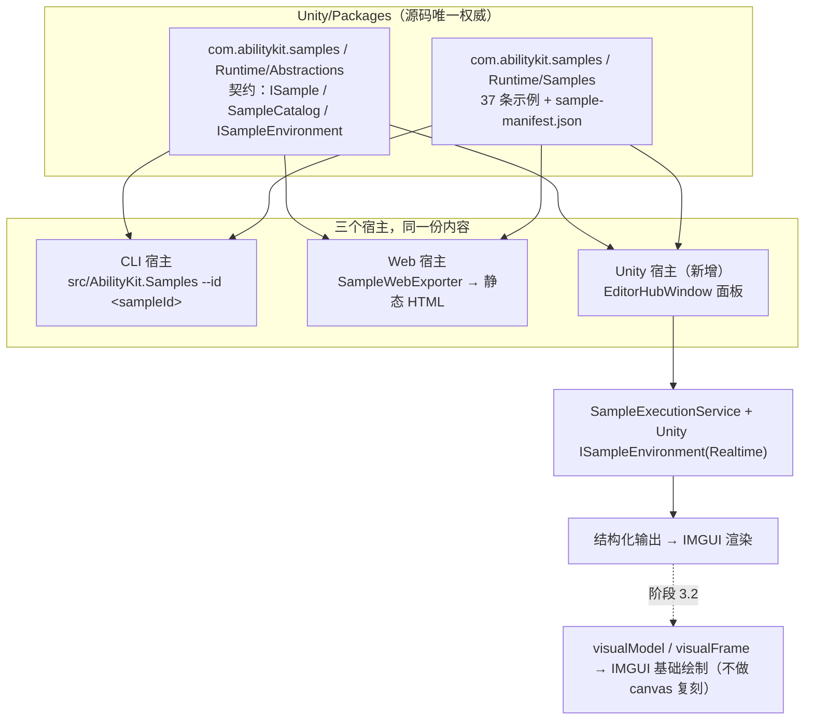

# 示例体系 Unity 化：Sample Catalog 进包与 Unity 宿主设计

> 文档类型：演进计划（**未实施**，本文全部为"目标设计"）
> 事实基线：2026-09-10（v2.0 重写）
> 证据等级：设计论证基于 E0 源码核校；文中标注"当前实现"的条目均已按当日源码逐条核实

---

## 零、结论与版本变更说明

**v2.0 结论**：新增"最基础示例"的正确做法**不是**再造一个示例包，而是**把已有的示例体系（Sample Catalog）搬进 `Unity/Packages/`，并补一个 Unity 宿主**。这样同一份示例内容在 .NET CLI、Web 静态导出、Unity 三个宿主下都能用。

**相对 v1.0（已作废）的变更**：

| v1.0 主张 | v2.0 处置 | 原因 |
|---|---|---|
| 新增 `com.abilitykit.demo.minimal` 逻辑包（core + world.di，4 张能力卡片） | **作废** | 会造出第四套并行示例体系，完全绕开既有的 37 条示例、`sample-manifest.json`、`guide`/`learningContract`、manifest 校验门禁与 Web 导出 |
| Unity 最小场景 + OnGUI 面板 | **作废，改为 Unity 宿主窗口** | 新宿主直接承载 37 条既有示例，而不是 4 张自造卡片 |
| 命名避开 "Starter"（改为 minimal） | 不再需要 | 不新增示例包，命名冲突问题改为在文档层澄清（见 §6.3） |
| `world.di` 补 `IWorldTickDriver` + `DefaultWorld` | **保留，但降级为独立可选项** | 与宿主方向正交；它解决的是"11 处手写 IWorld 装配样板"，不是"示例可见性"。见附录 A |
| 补 `03-QuickStart.md` 可见性缺口 | **保留** | 仍然是收益最高、成本最低的一步 |

**v2.1 增补（2026-09-10）**：包名决策落定为 **`com.abilitykit.samples`**（理由：这是示例体系本身，不是某个具体示例）。该命名跳出 `demo.*` 的永不发布豁免区，触发发布工具链的框架包约束，后果见 §6.4。

**v2.2 增补（2026-09-10）**：**只新增一个包**，契约层与内容层合并，不拆成 `samples.abstractions` + `samples.logic`。依据：`Samples.Abstractions` 的全部消费者只有宿主与 `Samples.Logic` 两个，没有框架包依赖它，为假想消费者多维护一个包不划算；且 24 个依赖包在 `Unity/Packages/` 下**全部已存在**，依赖闭包在仓库内是零新增成本。详见 §4.0。

**v2.3 增补（2026-09-10）**：Unity 宿主的渲染口径定案 —— **先文本后画布**（阶段 3 拆为 3.1 文本 / 3.2 语义图两步，3.1 做完即可用），且**用最基础的 IMGUI 绘制，不复刻 Web 宿主的 canvas 渲染**（`GUI.Box` / `EditorGUI.DrawRect` / `Handles.*` / `GUI.Label`，预估 150–250 行；不做 camera/材质级渲染、缓动动画、自适应布局）。详见 §3.1 / §3.2 / §3.3。

---

## 一、能力定位

解决一个具体问题：**新人与外部接入方没有一条"15 分钟从零到看见框架在跑"的路径，而框架的能力展示资产在 Unity 里完全不可见。**

关键事实是：这些资产**已经存在且质量很高**，只是被放在了 Unity 看不到的地方。当前架构是清晰的三层，但只有两个宿主：

```
Samples.Abstractions   契约层：SampleBase / ISample / SampleCatalog / SampleHostKind /
（27 文件 1715 行，零依赖）           ISampleEnvironment / SampleVisualModel / SampleLearningContract
        ▲
        │
Samples.Logic          内容层：37 条示例（24 Beginner / 6 Onboarding），18 个分类
（162 文件 22607 行）   manifest 带 guide / learningContract / visualModel / next 学习链
        ▲
        │
宿主层                 src/AbilityKit.Samples（9 文件 1904 行）
                       ├─ CLI 宿主：--list / --id <sampleId>
                       └─ Web 宿主：SampleWebExporter 生成静态 HTML
                          （canvas stage + timeline 滑条 + event card + guide + learning 面板）
```

**Unity 宿主是缺失的第三个宿主。** `SampleHostKind` 枚举定义了 `Logic` / `Console` / `File` / `Web` / `MonoGame` / `Custom` —— 六种宿主形态里**没有 Unity**，而 `MonoGame`（另一个游戏框架）赫然在列。这说明"多宿主"本来就是设计意图，Unity 只是没做。

---

## 二、事实状态（当前实现，逐条核实于 2026-09-10）

### 2.1 三层资产的可移植性

| 层 | 位置 | 规模 | Unity 可移植性 |
|---|---|---|---|
| 契约层 `Samples.Abstractions` | `src/AbilityKit.Samples.Abstractions` | 27 文件 / 1715 行 | ✅ **完全可移植**。全仓 `using` 只有 `System` / `System.Collections.Generic` / `System.Linq` / `System.Text`，**零 Unity 依赖、零外部依赖、零 ProjectReference** |
| 内容层 `Samples.Logic` | `src/AbilityKit.Samples.Logic` | 162 文件 / 22607 行 | ⚠️ 有 7 类移植阻塞，见 §2.2 |
| 宿主层 | `src/AbilityKit.Samples` | 9 文件 / 1904 行 | 保持 .NET 专属，不进包 |

内容层分类分布（18 类）：`Modifiers` 2389 行、`StateMachine` 2266 行、`Demo` 2187 行、`Triggering` 1824 行、`World` 1500 行、`Combat` 1111 行、`Pipeline` 1035 行、`Flow` 776 行、`Config` 740 行、`Tags` 591 行、`Onboarding` 528 行、`Sync` 459 行、`Foundation` 381 行、`Behavior` 343 行、`Continuous` 333 行、`Starter` 179 行、`Battle` 116 行、`Targeting` 170 行。

### 2.2 内容层的移植阻塞（逐条给数字）

| # | 阻塞 | 规模 | 处置 |
|---|---|---|---|
| 1 | `System.Text.Json`（Unity 无 STJ） | **5 个文件**：`SampleManifest.cs`、`Infrastructure/Config/ConfigHelper.cs`、`Infrastructure/Config/JsonConfigProvider.cs`、`Infrastructure/Config/Registries/PipelinePhaseRegistry.cs`、`Samples/Modifiers/DataDrivenHFSMWithOngoingBehaviors.cs` | 换 `Newtonsoft.Json`（Unity 走 `com.unity.nuget.newtonsoft-json`，仓库已用） |
| 2 | `#nullable` 项目级开启 | 162 个文件里 **0 个**带 `#nullable enable`（全靠 csproj `<Nullable>enable</Nullable>`） | 逐文件加指令，或 asmdef 配套 `csc.rsp`。这是**纯机械但量最大**的一项 |
| 3 | `ImplicitUsings` 依赖 | 约 **13 个文件**缺 `using System;` 却使用 `Action`/`Func<>`/`IDisposable` 等（启发式下界，实际以编译报错为准） | 补显式 using |
| 4 | `System.IO.File` | **4 个文件**：`FileSystemResourceProvider.cs`、`SampleManifest.cs`、`SampleConfig.cs`、`Samples/Modifiers/DataDrivenHFSMWithOngoingBehaviors.cs` | Editor 可用，WebGL/主机平台不可用。宿主应实现 `IResourceProvider`（TextAsset / Resources 实现），这正是 `SampleHostCapabilities.SupportsResourceLoading` 存在的意义 |
| 5 | `Console.` 直接输出（宿主泄漏） | **8 个文件** | 改走 `ILogger` / `SampleBase.Log` |
| 6 | csproj 死引用 | `<PackageReference Include="xunit">` —— 代码中 **零 xunit 使用**（已核实） | 直接删除 |
| 7 | 依赖闭包 | **24 个** AbilityKit 工程引用 | 全部有 Unity 对应包（唯一非同名项 `AbilityKit.HFSM.Core` → `com.abilitykit.hfsm/Runtime/HFSM/Core`，已核实投影关系）。本仓库 Unity 工程本就全量存在，成本为零；对经 UPM 引入的外部用户是重依赖 |

### 2.3 既有抽象中"已声明未实现"的部分

- `ISampleEnvironmentFactory` / `ISampleEnvironment`（含 `Instant` / `Simulated` / `Realtime` 三种 `ExecutionMode`）在全仓**零实现、零消费者**（已核实）。实际运行路径是宿主工程内的 `SampleEnvironmentFactory.Create` 与 `InstantEnvironment` / `SimulatedEnvironment`。
- 含义：**契约已经预留了"宿主自驱动 Tick、实时推进"的能力位**，这正是 Unity 宿主需要的形态——Unity 可以在每帧 `Update` 里推进 `Realtime` 模式。但这些接口尚未被任何宿主落地，Unity 宿主将是第一个真实消费者。

### 2.4 Unity 侧的既有承接点

- `com.abilitykit.base.editor/Editor/Platform/UI/EditorHubWindow.cs` —— 编辑器平台收敛产出的统一入口窗口，是新宿主面板的自然挂载点。
- `com.abilitykit.core` / `com.abilitykit.world.di` 的 asmdef 均 `autoReferenced: true`，`Assembly-CSharp` 可直接消费。
- `Unity/Assets/Scenes/StarterScene.unity` 是当前唯一注册在 `EditorBuildSettings.asset` 的场景（已核实），其 `StarterController` 是**玩法启动器**（登录 + 选 MOBA/Shooter + 加载场景），职责与示例宿主不同，不合并。

---

## 三、为什么不做 `demo.minimal`（自我修正）

v1.0 的方案会产出一个只展示 4 张自造能力卡片的独立包。它的问题不是"不好"，而是**重复**：

1. 既有 37 条示例已覆盖同一批能力，且每条都带 `guide`（purpose/observe/takeaway）、`learningContract`（audience/prerequisites/outcomes/pitfalls）、`next` 学习链与 `visualModel`。
2. 既有体系已有 manifest 校验门禁、Web 导出、`SampleBase` 的输出辅助（`Log`/`Section`/`Bullet`/`KeyValue`/`Divider`）。
3. 新包会造成两套并行的示例标准，后续每个能力都要写两遍，且新人不知道该看哪套。

**"最小依赖入门"这个需求点是否因此丢失？不会。** 它已由 `src/AbilityKit.Samples.Foundation` 满足（源码 301 行，仅依赖 `core` + `world.di`，`dotnet run` 可跑）。需要补的只是**可见性**（见 §6.3），而不是再造一个包。

---

## 四、设计方案

### 4.0 只新增一个包：`com.abilitykit.samples`

契约层与内容层**合并为同一个 Unity 包**，不拆成 `samples.abstractions` + `samples.logic` 两个包。

判断依据（已核实）：`src/AbilityKit.Samples.Abstractions.csproj` 的**全部消费者只有两个**——`src/AbilityKit.Samples`（宿主）与 `src/AbilityKit.Samples.Logic`；没有任何框架包或 demo 包依赖它。契约层单独成包的价值是"让只需要契约的消费者免于背上 24 个依赖"，但**这样的消费者今天不存在**，两个宿主本来就要内容。为一个假想的消费者多维护一个 package.json + asmdef + 发布条目，不划算。

包结构（`Runtime/` 纯逻辑 + `Editor/` 宿主，是 Unity 包的标准双 asmdef 形态）：

```
Unity/Packages/com.abilitykit.samples/
├── package.json                          # version 0.1.0；24 个依赖全部声明为 0.1.0
├── README.md
├── Runtime/
│   ├── AbilityKit.Samples.asmdef         # noEngineReferences: true —— 编译期强制纯逻辑
│   ├── Abstractions/                     # 原 Samples.Abstractions 的 27 文件
│   ├── Samples/                          # 原 Samples.Logic 的 162 文件（18 分类）
│   ├── Infrastructure/
│   └── sample-manifest.json              # 随包分发，宿主经 IResourceProvider 读取
└── Editor/
    ├── AbilityKit.Samples.Editor.asmdef  # 引用 Runtime asmdef + UnityEngine/UnityEditor
    └── SampleCatalogWindow.cs            # Unity 宿主面板，挂进既有 EditorHubWindow
```

**为什么宿主放在同一个包的 `Editor/` 里**：Unity 包的 `Runtime/` 与 `Editor/` 天然是两个程序集，`Runtime` 保持 `noEngineReferences: true` 的纯逻辑约束不受影响，同时满足"只新增一个包"。若日后宿主也要独立发布，再拆出 `com.abilitykit.samples.editor` 只是移动目录的事。

**.NET 侧保持两个工程不变**，只把 `<Compile Include>` 指到同一个包的不同子树——这是仓库既有惯例（多个 csproj 投影一个包的不同子树），改动最小：

- `src/AbilityKit.Samples.Abstractions.csproj` → 投影 `com.abilitykit.samples/Runtime/Abstractions/**/*.cs`
- `src/AbilityKit.Samples.Logic.csproj` → 投影 `com.abilitykit.samples/Runtime/{Samples,Infrastructure}/**/*.cs` + manifest

优点是 `src/` 侧的项目名、sln 条目、`Samples.Test` 的引用全部不动。

### 4.1 阶段 1：建包并归位源码

- 新建 `Unity/Packages/com.abilitykit.samples/`，按 §4.0 的目录结构迁入 189 个文件（27 + 162）。
- 两个 .NET 工程改为投影工程，源码权威归位到 `Unity/Packages/`（同时消除"`Samples.Logic` 只存在于 `src/`、违反铁律"这一既有问题）。
- `package.json` 按**框架包**标准写（`version: 0.1.0`、`author: "AbilityKit"`、keywords、无 BOM、24 个依赖均为 0.1.0），改完跑 `node tools/publish/audit-versions.js`（见 §6.4）。
- 剥离 .NET 专属代码：`System.IO.File` 系（`FileSystemResourceProvider` 等 4 处）改为 `IResourceProvider` 的宿主侧实现，`.NET` 宿主提供文件系统实现，Unity 宿主提供 `TextAsset` 实现。

### 4.2 阶段 2：清理 §2.2 的 7 类移植阻塞

建议顺序（由易到难，每步都能独立编译验证）：

1. 删 csproj 里的死 xunit 引用（#6）
2. `System.Text.Json` → `Newtonsoft.Json`（#1，5 个文件）
3. 补隐式 using（#3，~13 个文件）
4. 清 `Console.` 直接输出（#5，8 处 → `ILogger`）
5. 抽 `IResourceProvider` 宿主实现（#4）
6. 处理 nullable（#2，162 文件 0 指令 —— 优先用 `csc.rsp` 的 `-nullable:enable` 而非逐文件改）

> 注：阶段 1 与 2 交织（迁文件时顺手改比迁完再改省事），拆成两节只为说明"哪些是搬迁、哪些是改造"。

### 阶段 3：Unity 宿主（本次的真正新增物）

一个编辑器宿主面板，挂进既有 `EditorHubWindow`。**全部用最基础的 IMGUI 绘制，不复刻 Web 宿主的 canvas 渲染。**

| 组成 | 说明 |
|---|---|
| 目录视图 | 读 `SampleCatalog`，按 `SampleCategory` / `level`（Beginner·Intermediate）/ `tags` 分组与检索，展示 `title` / `description` / `guide` |
| 运行 | 调 `SampleExecutionService(catalog, environmentFactory)`，Unity 侧提供 `Realtime` 模式的 `ISampleEnvironment` 实现（挂在 `EditorApplication.update` 或 Play Mode 的 `Update` 上） |
| 学习路径 | 复用 manifest 的 `next` 链与 `learningContract`，与 Web 宿主呈现一致 |

#### 3.1 输出渲染：先文本（第一步交付）

`SampleBase` 的输出辅助（`Log` / `Warn` / `Error` / `Section` / `Bullet` / `KeyValue` / `Divider`）映射到 IMGUI 即可：

- 滚动区域 `EditorGUILayout.ScrollViewScope`
- `Section` → 加粗 `EditorGUILayout.LabelField`
- `Bullet` → `EditorGUILayout.LabelField("•  " + text)`
- `KeyValue` → 两列 `EditorGUILayout.LabelField(key, value)`
- `Divider` → `EditorGUILayout.LabelField("", GUI.skin.horizontalSlider)`

这一步不依赖任何可视化数据，做完就已经可用。

#### 3.2 可视化：IMGUI 基础绘制即可（第二步交付）

> **实施后修正（2026-09-11）**：本节原先假定"画 `visualModel` 的节点图"是主目标。实测数据是反过来的——`visualFrames` 覆盖 **37/37**，而 `nodes/edges/metrics` 只有 **15/37**。因此实现改为**帧序列为主线、节点图为增量**：帧推进控件 + 步骤进度（`guide.visualSteps`，同样 37/37）对所有示例可用，节点图仅在 `nodes` 非空时绘制。另核实 `visualModel` 里还有 `laneLabels`/`highlightMetric`/`outputHints` 三个键**在 C# 类型里并不存在**（Web 宿主直接读原始 JSON 才会用到），反序列化时被忽略。节点 `kind` 有 29 处为空、其余取值分散（output/node/phase/api…），故布局必须**纯拓扑分层**而不能按 kind 分层。


**不需要画布级复刻。** 契约层已经为此准备好了宿主中立的数据——这是本方向的又一处设计意图佐证，两个类型的 XML 注释原文就是：

- `SampleVisualModel` —— "Host-neutral semantic visual model **consumed by reusable render templates**"，含 `Nodes` / `Edges` / `Metrics` 三组语义数据；
- `SampleVisualFrame` —— "Host-neutral visual frame used by **learning hosts to animate sample behavior from semantic data**"，含 `Index` / `Title` / `VisualStep` / `Description` / `OutputHint` / `StateChanges[]` / `Highlights[]`。

绘制口径（对照 Web 宿主的实现量级）：Web 导出器共 1065 行，其中绘制层约 10 个函数（`drawRoundRect` / `drawArrow` / `drawCenteredText` / `drawFlowDiagram` / `drawStackDiagram` / `drawTimelineDiagram` 等）。**Unity 侧的等价物用 IMGUI 更短**：

| 语义元素 | IMGUI / Handles 实现 |
|---|---|
| 节点框 | `GUI.Box` 或 `EditorGUI.DrawRect` + 圆角 `GUIStyle` |
| 连线与箭头 | `Handles.DrawAAPolyLine` + `Handles.ArrowHandleCap`（Editor），或 `Handles.DrawBezier` |
| 居中/换行文本 | `GUI.Label` 配 `GUIStyle { alignment = TextAnchor.MiddleCenter, wordWrap = true }` |
| 指标表 | `Metrics` → 两列 `EditorGUILayout.LabelField`（复用 3.1 的 KeyValue 样式） |
| 帧推进 | `SampleVisualFrame.Index` → `EditorGUILayout.IntSlider` + 上/下一帧按钮；`StateChanges` / `Highlights` 以文本标注呈现 |

预估绘制层 **150–250 行**，与 Web 宿主的 draw 层同量级。**不做**：camera/材质/纹理级渲染、时间轴缓动动画、自适应画布布局。

#### 3.3 与 Web 宿主的关系

两个宿主消费**同一份** `SampleVisualModel` / `SampleVisualFrame`，但各自用本平台最自然的原语渲染——Web 用 canvas 2D，Unity 用 IMGUI。这正是契约层把数据设计成"宿主中立语义模型"而非"渲染指令"的原因。**不要求两侧像素级一致**，只要求语义一致。

**关键约束**：Unity 宿主只做**呈现与驱动**，不得把示例逻辑抄进 Unity 侧；示例内容的唯一权威仍在 `com.abilitykit.samples/Runtime/`。

### 阶段 4：既有宿主保留

`src/AbilityKit.Samples`（CLI + Web 导出）继续作为 .NET 宿主保留，与 Unity 宿主并列消费同一份契约与内容。三个宿主共用 `sample-manifest.json`，不产生分叉。

---

## 五、运行流程（目标设计）



---

## 六、验证、门禁与可见性

### 6.1 验证

| 交付物 | 验证方式 | 证据等级 |
|---|---|---|
| 阶段 1/2（进包） | 既有 `src/AbilityKit.Samples.Test` 与 manifest 校验继续跑通；新增 Unity 侧 asmdef 编译 | E3（.NET 侧）／E0（Unity 编译，需 Editor.log 人工确认） |
| 阶段 3（Unity 宿主） | 编译已由 Unity 实测通过（2026-09-11）；运行时行为仍待人工打开窗口验证；接入 Unity MCP 后可由 Editor 侧读取编译结果与 Console 日志 | 编译 **E1（已实测）**／运行行为 **未验证** |
| 回归底线 | 迁移**不得**改变任何示例的输出内容。建议迁移前先固化 `--web` 导出产物或全量 CLI 输出作为 golden 基线 | E3 |

**golden 基线是本设计建议的第一件事**：搬 162 个文件而不加输出比对，等于把"示例是否还正确"完全交给运气。

**基线的两段式比对（2026-09-10 补强）**：首次实跑暴露出基线**本身会偶发误报**——同一份二进制连跑，约 3% 的运行会 MISMATCH。追查后确认根因仍是 §9.3 缺陷②那类墙钟依赖：`sync/state-diff-apply` 有**两行**携带同一个不稳定字节数，初版只掩码了其中一行。修复方式不止于补掩码——比对逻辑改为**两段式**：

1. 首次捕获与基线一致 → 通过（绝大多数情况）。
2. 不一致时**再捕获一次**：
   - 第二次与基线一致 → 判为 **UNSTABLE**，打印两次捕获之间的漂移行，**退出 0**（不冤枉人）；
   - 两次捕获彼此一致 → 差异是确定性的，按真实回归报告并**退出 1**；
   - 两次彼此也不一致 → 既不稳定又对不上基线，打印两者并**退出 1**（无法证明无害时不放过）。

这样把"你的改动改了输出"与"这份输出本身就是不确定的"分开表达，而不是用掩码把后者藏起来。已实测两条路径：正常退出 0；故意变异基线退出 1 且仍精确报出章节与行号（未被重试吞掉）。

**遗留**：`$knownUnstableKeys` 仍是症状掩码，两行都来自 `world.statesync` 的墙钟污染。修复该缺陷后应清空该列表——真正的判据是"示例输出应当完全确定"。

### 6.2 门禁

- 阶段 1/2 完成后，`src/AbilityKit.Samples.Logic` 变为投影工程，既有门禁步骤无需改动即可继续覆盖。
- 迁移期建议临时增加一步"manifest 校验 + golden 比对"，完成后并入既有 gate，**不新建 gate**。

### 6.3 可见性（收益最高、成本最低，可立即做）

1. **`03-QuickStart.md`**（409 行）当前 `grep` Starter **零命中**，也不提 `AbilityKit.Samples`。加一条"15 分钟路径"：Step 0 = `dotnet run --project src/AbilityKit.Samples -- --list`。
2. **`Unity/Packages/README.md`** 补 Unity 宿主的入口说明。
3. **`04-ProjectStructure.md`** 增加"三套 Starter 语义对照表"——`src/AbilityKit.Samples.Foundation`（框架底座最小闭环）／`Samples.Logic/Samples/Starter/FoundationStarter.cs`（manifest 版）／`Unity/Assets/Scripts/Starter/` + `com.abilitykit.demo.starter`（MOBA/Shooter 玩法启动器）。三者在仓库里同名不同物，是新人第一个踩的坑。

### 6.4 `com.abilitykit.samples` 命名带来的发布工具链后果（已核实）

> **前提澄清**：24 个依赖包在 `Unity/Packages/` 下**全部已存在**（已逐一核实），因此**依赖闭包在仓库内部是零新增成本**——本节的约束**只影响"将来能否发布到 OpenUPM"，不影响本次实施的任何一步**。实施可以完整走完，不必等待发布侧的决策。

选择 `com.abilitykit.samples` 而非 `com.abilitykit.demo.*`，意味着这个包**跳出"永不发布"的豁免区**，被现有工具链当作框架包对待。三条已核实的硬约束：

| 工具 | 判定逻辑 | 对新包的要求 |
|---|---|---|
| `tools/publish/audit-versions.js` | `isFramework(name)` = 以 `com.abilitykit.` 开头 **且** 不含 `.thirdparty.` **且** 不以 `com.abilitykit.demo.` 开头 → **`samples.*` 判定为 true** | ① 必须处于 cohort 版本 **0.1.0**（不能像 demo 包那样用 0.0.1）；② 内部引用版本必须逐一等于被引包声明的版本；③ package.json 不得带 BOM |
| 同上，检查 1 | 内部引用需与被引包声明版本一致 | 24 个依赖**全部为 0.1.0**（已逐一核实），故 `com.abilitykit.samples/package.json` 需把 24 个依赖都声明为 `0.1.0`。**这是单包方案的唯一代价**：契约层本可零依赖，合并后整个包都要背上这 24 条 |
| `tools/publish/release-manifest.json` | `neverReleased.prefixes = ["com.abilitykit.thirdparty.", "com.abilitykit.demo."]` → **不覆盖 `samples.*`** | 新包**具备被打 tag 发布的资格**，但不在任何 `batches` 内，`release.js` 不会自动发布，除非显式加入白名单 |

**需要留意的张力（仅关乎发布，不阻塞实施）**：该包的 24 个依赖里，只有 `core` 在已发布的 batch-1 白名单内，其余 23 个（`triggering` / `pipeline` / `modifiers` / `combat.*` / `hfsm` / `behavior` / `dataflow` / `game.battle.runtime` 等）尚未发布。因此**即使命名可发布，实际发布也必须等依赖闭包先上 OpenUPM**——否则外部用户装不上。这正是 §7 决策点 2 的实质：是等全量发布，还是先拆一个只依赖已发布叶子包的轻量子集。**在此之前，本包只在仓库内使用，功能完全不受影响。**

**实施时的最低要求**：新增两个 package.json 时按框架包标准写全（`version: 0.1.0`、`author: "AbilityKit"`、keywords、无 BOM），并在改完后跑 `node tools/publish/audit-versions.js` 验证——这是 `CLAUDE.md` 明确规定的动作。

---

## 七、待决策点（需拍板后才能进入实施）

| # | 决策 | 状态 |
|---|---|---|
| 1 | **包名 = `com.abilitykit.samples`（单包）** | ✅ **已决策（2026-09-10）**。理由是这是示例体系本身，不是某个具体示例；且契约层的唯一消费者就是内容层与宿主，不拆两个包。**后果见 §4.0 与 §6.4** |
| 2 | 是否把该包发布到 OpenUPM | ⏳ 待定，**不阻塞实施**。仓库内零成本（24 个依赖包全已存在）；对外部用户是重依赖，且 23 个依赖尚未发布。若要发布，可考虑先只放 `onboarding` + `foundation` 两类的轻量子集 |
| 3 | **可视化优先级 = 先文本后画布** | ✅ **已决策（2026-09-10）**。阶段 3 拆成两步交付：3.1 结构化文本先落地（做完即可用），3.2 再做语义图。见 §3.1 / §3.2 |
| 4 | **渲染方式 = 最基础 IMGUI，不复刻 Web 宿主的 canvas** | ✅ **已决策（2026-09-10）**。用 `GUI.Box` / `EditorGUI.DrawRect` / `Handles.DrawAAPolyLine` / `GUI.Label` 画语义图，预估 150–250 行；不做 camera/材质/纹理级渲染、缓动动画、自适应画布布局。见 §3.2 / §3.3 |
| 5 | Unity 宿主形态（Editor 窗口 / Play Mode 场景） | ⏳ 待定，**不阻塞阶段 3.1**。Editor 窗口可直接复用 `EditorHubWindow` 挂载点且无需进 `EditorBuildSettings.asset`，是默认选择；若日后需要运行时演示再补 Play Mode 形态 |

---

## 八、风险与约束

| 风险 | 说明 | 缓解 |
|---|---|---|
| 迁移期长、无自动化保护 | 162 文件搬迁 + 7 类阻塞清理，任何一步失误都可能改变示例输出 | 先固化 golden 基线（§6.1），分阶段提交，每阶段跑通既有门禁 |
| nullable 改造量最大 | 162 文件 0 个带指令，需逐文件处理或引入 `csc.rsp` | 放最后做；优先用 `csc.rsp` 的 `-nullable:enable`，避免 162 处机械 diff |
| `File`/`Console` 泄漏 | 4 处 File、8 处 Console 是宿主抽象的破口 | 借这次改造一次性收敛到 `IResourceProvider` / `ILogger`，顺带提升契约层完整性 |
| 与"做减法"的收敛期方向张力 | 仓库当前方向是删死代码而非加包 | 净新增仅 **+1 个包**（`com.abilitykit.samples`），且消除的是 src 侧的源码归属违规；应向"归位"而非"扩张"表述 |
| Unity 无法自动验证 | 仓库铁律 | 如实标 E1，不外推 E4 |
| `ISampleEnvironment` 首次被真实实现 | 零消费者的接口首次落地，可能存在设计缺口 | 阶段 3 开始前先做一次最小 spike（仅跑通 1 条 `foundation/hello-world`） |

---

## 九、分阶段与成本

| 阶段 | 内容 | 规模 | 前置 |
|---|---|---|---|
| 0 | golden 基线固化 + `03-QuickStart.md` 可见性补丁 | 小 | ✅ **已完成（2026-09-10）**，见 §9.1 |
| 1 | 建 `com.abilitykit.samples` 单包，迁入 189 文件（27 + 162），两个 .NET 工程改投影 | 中 | ✅ **已完成（2026-09-10）**，见 §9.4 |
| 2 | 清理 7 类移植阻塞（纯逻辑可编译、无 Unity 依赖残留） | **大**，主体工作量 | 阶段 1（⏳ 进行中，见 §9.2） |
| 3.1 | Unity `Editor/` 宿主：目录 + 运行 + **结构化文本渲染** | 中 | ✅ **已完成（2026-09-10）**，见 §9.5 |
| 3.2 | 语义图：`SampleVisualModel` / `SampleVisualFrame` 的 **IMGUI 基础绘制** | 小～中（预估 150–250 行） | ✅ **已完成（2026-09-11）**，见 §9.6 |
| 4 | 学习链 / `learningContract` 在 Unity 侧呈现 | 小 | 阶段 3.1 |

**净新增包数：1。** 阶段 1 与 2 在实操中交织（迁文件时顺手改比迁完再改省事），拆开只为说明"哪些是搬迁、哪些是改造"。决策点 2（是否发布）与决策点 5（宿主形态）**均不阻塞任何阶段**；阶段 3.1 结束时即已达成"新人能在 Unity 里点开示例看见结果"的核心目标，3.2 是增量。

### 9.1 阶段 0 实施记录（2026-09-10）

| 产出 | 说明 |
|---|---|
| `tools/check_sample_baseline.ps1` | 跑全量示例 + manifest 校验，归一化为单一文本产物并与基线比对；支持 `-Update` 刷新、逐章节差异归因（能直接报出哪条示例的哪一行变了）、退出码 0/1 |
| `tools/samples/sample-baseline.txt` | 37 条示例输出 + manifest 校验报告，75KB，无 BOM；含 `<OUTPUT_DIR>` 与 `<unstable>` 两类归一化 |
| `foundation-units` 门禁接线 | 新增 `Build sample catalog host`（17.9s）与 `Sample catalog golden baseline`（4.7s）两步，`scope` 加 `samples` |
| `03-QuickStart.md` v3.1 | 新增 §2.1「第 0 步：跑示例目录」（补上此前 Starter / AbilityKit.Samples 零命中的可见性缺口）、§3.1 入口清单、§4.5 证据 |

验证方式：检查步骤连续 3 次通过；故意变异基线（manifest 计数、示例字段各一例）均被正确检出并按章节归因，退出码 1。

**实施中发现一个框架缺陷**（不属本设计范围，但影响基线的完备性）：`com.abilitykit.world.statesync` 的 `StateManager.CaptureState` 给 `WorldStateSnapshot.Timestamp` 打墙钟时间戳，而 `StateHashComputer.Compute` 把 Timestamp 计入哈希、`ComputeBinaryDiff` 是位置敏感的字节差异。后果是**被 StateManager 捕获的快照其 StateHash 依赖墙钟**（跨进程/跨端比对可能误报不同步），且增量差异字节数随运行变化（20 次运行中 18×56、1×61）。基线以"掩码 + 每次运行显式警告"记录该症状，**这是症状被掩盖而非修复**；修复涉及"Timestamp 是否应进入 ToBytes/ComputeHash"的语义决策，需单独拍板。

### 9.2 阶段 2 实施记录（2026-09-10，进行中）

**顺序调整及理由**：先做阶段 2（原地清理阻塞）再做阶段 1（搬包），而不是按原编号。核实当前 **Unity Editor 正在运行**（3 个 `Unity.exe` 进程），若先把源码搬进 `Unity/Packages/`，运行中的 Editor 会立刻编译一个必然报错的新包。原地清理在 `src/` 进行，不触碰 Unity，且每一步都由 golden 基线验证。§4.2 已注明阶段 1/2 本就交织，编号只是表述顺序。

**已完成**：

| 阻塞 | 处置 | 验证 |
|---|---|---|
| #6 死 xunit 引用 | 删除 `Samples.Logic.csproj` 里的 xunit + xunit.runner.visualstudio（代码零使用） | 构建 0 错误；基线不变 |
| #3 隐式 using | 两个 csproj 设 `ImplicitUsings=disable`，**让 .NET 构建成为 Unity 编译环境的忠实代理**，再按编译错误补齐：8 个文件补 `System.Collections.Generic`、2 个文件补 `System.Linq` | 构建 0 错误；基线逐字节不变 |
| **额外**（不在原 7 类内）注释乱码 | 见下 | 构建 0 错误；基线逐字节不变 |

**`#3` 的手法值得沿用**：与其用启发式猜哪些文件缺 using，不如直接把 `ImplicitUsings` 关掉让编译器精确报错——这与 Unity 的真实环境一致，且后续搬包时不会再冒出新的 using 问题。副产物：暴露了 `ProgressiveSkill_Phase1.cs` 的 `xs.Count(pred)` 在缺少 `System.Linq` 时会静默绑定到 `MemoryExtensions.Count(Span<T>, T)`，报出的是难懂的 CS0411 而非"缺少 using"。

**额外发现并修复：注释乱码（UTF-8 被按 GBK 解读）**。扫描 `src/AbilityKit.Samples.*` 的 189 个 .cs：**47 个文件含乱码**（如 `鏍囪閰嶇疆绫诲瀷` 实为 `标记配置类型`），而 `Unity/Packages` 5263 个文件里只有 4 个、`Server` 291 个里只有 1 个——**问题高度集中在待迁移的示例代码**，而框架包（质量基准）基本干净。这些字节完好可逆，故新增 `tools/fix_sample_mojibake.ps1`（默认 dry-run，`-Apply` 写入）批量还原。

该脚本的安全规则经过一次**真实事故**才定型，值得记录：

1. **只改注释行**（`//`、`///`、`/*`、`*`）——这是承重规则，保证即使启发式判错也不可能影响运行时行为。
2. 往返必须无损（GBK 编码 + 严格 UTF-8 解码，无替换字符）。
3. **还原结果必须含中日韩字符**。初版缺这一条，且允许改任意行，结果把字符串字面量 `硬直帧` 改成了 `Ӳֱ֡`——GBK 双字节恰好也是合法 UTF-8 序列，往返"无损"并不等于"原本是乱码"。**是 golden 基线抓到了这次破坏**（`HFSMTrigger Bridge` 示例输出对比失败），否则会静默改坏示例输出。
4. BOM 从原始字节判定并保留。初版用 `File.ReadAllText` 读文本判 BOM，而该方法本身会吞掉 BOM，导致重写时静默剥离了 21 个文件的 BOM。

**当前状态**：123 行注释已还原（41 文件）；剩余 **131 行注释**仍乱码（丢字节导致无法机械还原，需人工改写），另有 **7 行非注释行**含乱码，其中 5 行是 `#region` 名、1 行是行尾注释、**1 行是字符串字面量**（`Samples/StateMachine/HFSMConfig.cs:252` 的日志文本 `鎵ц鍔ㄤ綔`）——该字面量属潜在的用户可见缺陷，只是当前 37 条示例未走到该路径（基线零乱码）。

**后续完成（2026-09-10，同日继续）**：

| 阻塞 | 处置 | 净效果 |
|---|---|---|
| **#1 STJ → Newtonsoft** | 审计发现 5 个 STJ 文件中**两个是死代码**：`ConfigHelper.cs`（172 行，全仓零调用）整文件删除；`PipelinePhaseRegistry` 的 `CreateFromJson`/`TryCreateFromJson`/`ApplyJsonToObject`/`ConvertJsonValue`（86 行）零调用删除。剩余 3 处（`JsonConfigProvider`、`SampleManifest`、`DataDrivenHFSMWithOngoingBehaviors`）转 Newtonsoft。 | 内容层 `System.Text.Json` 归零；净删 258 行 |
| **#4 File → IResourceProvider** | 发现 `IResourceProvider` **有两份重复定义**（`Abstractions` 版 2 成员、`Logic` 版 4 成员），实际实现者用的是 `Logic` 版，`Abstractions` 版零实现零消费者。收敛为一份放在 `Abstractions`（宿主边界层），补齐 `TryLoadText`；`FileSystemResourceProvider` 移到宿主工程 `src/AbilityKit.Samples/Infrastructure/`；`ResourceProviders` 默认实现改为宿主无关的 `NullResourceProvider`（`LoadText` 抛 `FileNotFoundException` 以保住 `SampleConfig` 的默认回退语义）；宿主在 `Main` 起始处安装文件系统实现。`SampleManifest` 与 HFSM 示例的文件 I/O 改走提供器（路径拼接保留，故日志中的路径不变）。另删除 `JsonConfigProvider` 未使用的文件路径构造函数。 | 内容层文件 I/O 归零，仅余 `Path`/`AppContext`/异常类型 |
| **#2 nullable 策略** | 采用**逐文件 `#nullable enable`**（仓库框架包约定：首行 + 空行），186 个文件全部补齐；`.NET` 侧 csproj 保留 `<Nullable>enable</Nullable>` 作双保险。 | Unity 侧无项目级 nullable 设置，逐文件指令是唯一办法 |

**#5（Console → ILogger）尚未处理，且性质与预期不同**：8 个 Console 使用文件**全部位于 `Ability/` 子树**（27 文件 / 2308 行）。该子树是一个自包含孤岛——不在 `sample-manifest.json` 中、**无任何 Attribute 标注**（故 `MarkerScanner` 不会注册它）、外部零引用（`Samples/Config/SamplePipelines.cs` 的 `ExecutePhase`、框架的 `WorldBlueprint` 是同名不同类）、其内部 `*Tests.RunAll()` 从未被调用。仓库自己的 `Document/SamplesLogicRefactorPlan.md` 明确规定"所有旧示例必须进入**保留/重写/迁移/废弃**四类之一"，`Ability/` 尚属未归类。**因此没有擅自删除，也没打算给死代码做 Console→ILogger 的改造**——先请拍板归类。

另：`Console.WriteLine` 在 Unity 下**可以编译**，故 #5 从一开始就不是编译阻塞，而是"宿主泄漏"的设计整洁性问题。

**`Ability/` 归类裁定（2026-09-10）**：用户拍板 **Legacy（仅保留参考）**。据此不进 manifest、不打 web 标签、不进 README 学习路径、不做进一步改造。裁定与理由已登记进 `com.abilitykit.samples/Document/SamplesLogicRefactorPlan.md` §6.1 与 §6.3（该文档本身也已随源码移入包内）。

### 9.4 阶段 1 实施记录（2026-09-10，已完成）

`com.abilitykit.samples` 单包已建立，源码权威归位到 `Unity/Packages/`：

| 项 | 结果 |
|---|---|
| 包结构 | `Runtime/`（186 文件：`Abstractions/` 26 + `Ability/` 27 + `Infrastructure/` 36 + `Samples/` 93 + 5 个根文件 + `sample-manifest.json`）、`Document/`（3 篇）、`README.md`、`package.json`、`Runtime/AbilityKit.Samples.asmdef` |
| 搬迁方式 | 以 `git mv` 为主（保留文件历史），仅 `Infrastructure/` 因早先删除的 `ConfigHelper.cs` 仍留在索引里而改用普通 `mv` |
| `package.json` | `version 0.1.0`；24 个 AbilityKit 依赖全部 `0.1.0` + `com.unity.nuget.newtonsoft-json 3.2.1`；无 BOM |
| asmdef | `AbilityKit.Samples`，`noEngineReferences: true`，**29 个装配引用**（见下方修正），`precompiledReferences: ["Newtonsoft.Json.dll"]` |
| .NET 侧 | 两个 csproj 改为**投影工程**：`Abstractions.csproj` → `Runtime/Abstractions/**`；`Logic.csproj` → `Runtime/{*.cs,Ability,Infrastructure,Samples}/**` + manifest（`Abstractions` 子树不重复包含，避免两个装配各自定义同一批类型）。工程名、sln 条目、`Samples.Test` 的引用均未改动 |

**装配引用推导的事后修正（2026-09-11，重要）**：上面的 26 个引用取自 csproj 的**直接** `ProjectReference`——这对 .NET 够用（引用是传递的），**对 Unity 不够**：asmdef 必须点名每一个其类型被用到的装配。Unity 编译因此报出 `CS0012: 'Fixed64' is defined in an assembly that is not referenced`——示例用到了 `Fixed64`，而直接引用里只有 `AbilityKit.Core`，缺 `AbilityKit.Deterministic`。

改为取**传递闭包**后得到 **29 个装配 / 27 个包**（+newtonsoft 共 28 条 package.json 依赖），新增 `AbilityKit.Deterministic`、`AbilityKit.Network.Runtime`、`AbilityKit.Timer`。同时注意闭包会包含**包自身的 `AbilityKit.Samples`**，必须排除——asmdef 不能引用自己，package.json 也不能自依赖。

**装配引用的推导方式**（值得复用）：不用"包里第一个 asmdef"这种启发式——它会把子装配（`triggering.abstractions`）、兄弟变体（hfsm 同时有 `Core` 与 `Unity`）或 Editor 装配选进来。正确规则是从 .NET 工程的 `<Compile Include=".../Packages/<pkg>/<sub>/**/*.cs" />` 反推：**覆盖该子树的全部祖先 asmdef 即所需装配**。`.NET` 会把 Unity 侧嵌套的 asmdef 拍平成一个装配（`host.extension` 的 `Runtime/Client`、`Runtime/Server` 在 Unity 侧是独立装配），所以祖先要全部收进来而不是只取最近的一个。另需处理两个边界：asmdef 位于**包根目录**时（`modifiers` 如此）其目录与包目录相同，前缀剥离会失效；csproj 里也可能写**反斜杠 + `*.cs`**（`host.extension` 有 7 条这样的 include）。

**验证**：`dotnet build` 0 错误；**golden 基线逐字节不变**（搬迁零行为变化的最强证据）；`tools/publish/audit-versions.js` 报 `OK — clean`（新包被正确判为框架包、cohort 0.1.0、无 BOM、引用版本全部对得上）；`foundation-units` 门禁 10 步全绿（84.3s）。

**坐标系外的两件事**：① `noEngineReferences: true` 且引用数十个装配，在本仓库是已被广泛验证的形态——现存 42 个运行时装配采用同一设置（最多引用 15 个）。② 包内 `.meta` 文件**尚未生成**：Unity Editor 正在运行，会在导入新包时自动生成，需由使用者提交（无法用 batchmode 代劳，仓库铁律）。**因此本次未对 Unity 侧的编译做实测验证**，只做了 .NET 侧与静态一致性验证。

### 9.5 阶段 3.1 实施记录（2026-09-10，已完成）

`Unity/Packages/com.abilitykit.samples/Editor/` 建立，5 个文件 / 741 行：

| 文件 | 职责 |
|---|---|
| `AbilityKit.Samples.Editor.asmdef` | `includePlatforms: ["Editor"]`，引用 `AbilityKit.Samples` 与 `AbilityKit.Editor.Platform`；`noEngineReferences: false`（本层需要 UnityEditor） |
| `SamplePackageResourceProvider.cs` | Unity 侧的 `IResourceProvider`：按**文件名**在 `Packages/com.abilitykit.samples` 内查找 TextAsset。示例代码拼的是宿主形状路径（`AppContext.BaseDirectory` + 文件名），在 Unity 下无意义，故按文件名而非目录解析；找不到返回 false 而不抛异常，示例各走自己的回退分支 |
| `SampleHostEnvironment.cs` | 即时 `ISampleEnvironment`，与 Console 宿主同语义，因此同一份示例两边产出相同文本 |
| `SampleCatalogWindow.cs` | 主窗口：左侧按分类分组 + 搜索的目录树，右侧指南 / 运行 / 结构化输出 / `next` 学习链。输出由 `BufferedSampleLogger` 捕获的 `SampleLogEntry` **逐条用最基础 IMGUI 渲染**（无画布复刻） |
| `SamplesEditorModule.cs` + `SamplesEditorLocalization.cs` | 接进编辑器平台：`[InitializeOnLoad]` 注册模块，`context.Panels.Register(...)` 挂一个薄 Hub 面板（说明 + 打开按钮），并注册本地化字典源 |

**两处按既有约定做的取舍**：① Hub 面板只做入口、不内嵌整棵目录——面板用 `container.onGUIHandler = () => panel.DrawImGui(rect)` 渲染，放进完整浏览器会让 Hub 每次重绘都去解析 manifest。② **不注册菜单贡献**：窗口自带 `[MenuItem("Window/AbilityKit/示例目录")]`，而 Hub 的 `EditorMenuItemDiscovery.WindowRoot == "Window/AbilityKit/"` 会扫描真实 MenuItem，再注册一条同路径贡献会在 Hub 列表里重复。

**验证（受限于无法 batchmode）**：

| 手段 | 结果 |
|---|---|
| `SampleHostEnvironment.cs` 对着真实 `AbilityKit.Samples.Abstractions` 投影独立编译 | **0 错误 0 警告**——`ISampleEnvironment` 成员签名全部正确 |
| 把 `Editor/*.cs` 全部纳入编译（不提供 Unity 程序集）后按错误码分类 | 仅 `CS0246`/`CS0234` 共 44 处，**全部是 Unity 与平台类型缺失**；**无任何语法错误**，也**没有任何一处指向示例包类型或自有类型**——即对包 API 的调用与我的内部引用都解析通过 |
| 本地化键一致性 | 代码用到的 3 个键与注册字典完全对齐 |

**Unity 侧编译：已通过（2026-09-11，用户确认）**。`Runtime`（186 文件）与 `Editor`（5 文件）在 Unity 中均编译通过——这同时验证了此前无法离线校验的那一面（`EditorGUILayout` / `EditorStyles` / `GUI` / `AssetDatabase` 的成员名与重载）。`.meta` 已由 Unity 导入生成：192 个 `.cs.meta` + 52 个目录 meta + asmdef/manifest/README meta，**244 个 GUID 全部唯一**；`packages-lock.json` 已登记新包。这些文件目前**未提交**，需一并入库。

**仍未验证（如实标注）**：宿主**运行时行为**。编译通过不等于"打开窗口能列出 37 条示例、点运行能出正确输出"——需要实际在 Editor 中打开 `Window/AbilityKit/示例目录` 跑一条示例，并与 Console 宿主的输出比对（预期差异仅限宿主边界字段，例如 `HasResourceProvider` 在 Unity 下应为 true）。这是阶段 3.1 的**验收缺口**。

### 9.6 阶段 3.2 实施记录（2026-09-11，已完成）

新增 `Editor/SampleVisualRenderer.cs`（约 330 行），接进窗口详情列的输出之后。

**按实测数据定的口径**（见 §3.2 的修正说明）：帧序列是主线（37/37），节点图是增量（15/37），两者都没有时给一句明确说明而不是留白。

**刻意不用 `Handles`**：连线画成**正交折线**（若干 `EditorGUI.DrawRect` 细条），箭头用 4 层递减宽度的矩形拼出。理由很实际——`Handles` 的绘制上下文（`BeginGUI`/相机）是我无法离线验证的一面，少一个 API 面就少一处只能靠 Unity 往返发现的错误。同理，节点框用 `GUI.Box`，文本用 `GUI.Label`，全部是最基础图元。

**布局是纯拓扑分层**：层号 = 从入度为 0 的节点出发的最长路径长度，迭代上限取节点数（环上自然停住而非死循环），每层内按出现顺序排列并垂直居中。不按 `node.kind` 分层——29 个节点该字段为空，其余取值也分散，按它分层会得到读不懂的图。

**这一轮最重要的产出其实不是渲染器，而是补上了一个会静默漏报的验证工具**：写渲染器时我用了 `string[].Count`（数组没有可直接访问的 `Count`，`Count` 解析成 LINQ 方法组 → CS0019），而**原有的离线探针没报**。根因：不提供 Unity 程序集时，编译器遇到 Unity 类型就放弃周围的绑定，于是可解析类型上的真实缺陷被吞掉。改为 `tools/unity-host-probe/`——提供最小 Unity 类型桩让绑定走完。**反向验证**：把 `steps.Count` 重新塞回去，探针精确报出 3 处 CS0019；修好后归零。

该工具的能力边界写在 csproj 注释里：桩只保证绑定跑完、**不校验 Unity API 形状**（成员名写错在这里照样通过），桩不完整时会报**响亮误报**（本次补了 4 处：`GUI.backgroundColor`、`Mathf.Abs`、`EditorGUILayout.LabelField(string, GUILayoutOption[])`、`IEditorLocalization.RegisterSource`）——这与旧办法的静默漏报相反，是刻意选择的失败方向。

### 9.3 跑通验证中发现 `com.abilitykit.protocol` 的两个既有缺陷（2026-09-10）

按要求"先确定跑通"跑完整 `foundation-units` 门禁，`Protocol wire serialization tests` 红了 3 个用例。两个缺陷均已修复，**门禁现为全绿**（10 步全部通过，99.0s；Protocol 171/171）。已证明与本批改动无关：`AbilityKit.Protocol.Tests` 只引用 `AbilityKit.Protocol`，而本批只改了 `AbilityKit.Samples.*`，**无依赖路径**；工作区无 Protocol 改动；强制 `--no-incremental` 重建后仍稳定复现。门禁其余 9 步全绿。

**缺陷①（已修）：struct 的 `Default` 恒为零值。** `ProtocolCatalogAdvertisementDecodeOptions.Default => new ProtocolCatalogAdvertisementDecodeOptions()` —— 该 struct 的构造函数参数全部带默认值，但 C# 中 `new T()` 对 struct 绑定的是**隐式无参构造（全零）**，不会调用全默认参数的构造函数。于是 `Default` 四项界限全为 0，`Normalize` 的"0 就用默认值"又回退到 0，**解码界限为 0 意味着拒绝一切非空载荷**。用 .NET 10 单文件运行实测确认语义（`Default.MaxPayload = 0`，而 `new Opts(5) = 5`）。

修法：把默认值提为 `const`，`Default` 显式传参构造。测试 3 失败 → 1 失败。**这是 batch-1 目标发布包里的缺陷**，且全仓扫过同类模式（`Default => new X()`），另两处（`ExplainResolveOptions`、`ObservationContributorRegistry`）都是 class，类字段初始化器正常执行，不受影响——即此坑全仓仅此一处。

**缺陷②（已修）：advertisement 往返丢字段。** `ProtocolCatalogAdvertisementMessage.FromMessage` / `ToMessageDefinition` 只映射 `ProtocolMessageDefinition` 的 13 个字段中的 10 个，丢掉 `ResponseId`、`CaptureSampleRate`、`SensitiveFields`。重建出的远端目录因此通不过 `ProtocolCatalogValidator`，`ProtocolCatalogNegotiator.Negotiate` 返回 `InvalidCatalog`，于是**自协商（本地注册表 vs 自己生成的 advertisement）被误判为不兼容**。

修复方式（线格式 v1 → v2）：

| 项 | 处置 |
|---|---|
| message 类型 | 补 `ResponseId` / `CaptureSampleRate` / `SensitiveFields` 三个字段与映射 |
| 编码 | 每条消息追加：字符串 ResponseId、8 字节 double、uint16 敏感字段数 + 各字符串 |
| 版本 | `FormatVersion` 拆为 `CurrentFormatVersion = 2` / `MinimumSupportedFormatVersion = 1`，`Encode` 只写 v2 |
| 兼容 | 解码端接受 v1~v2；v1 载荷的三个新字段取默认值（空串 / `1d` / 空表），不因版本旧而不可解 |
| 新增上限 | 敏感字段列表需要独立边界，故 `ProtocolCatalogAdvertisementDecodeOptions` 增加 `MaximumSensitiveFieldsPerMessage`（默认 64，加在参数表末尾，源兼容） |
| 新增守卫 | double 读取后拒绝 NaN/Infinity，避免污染后续比较 |

**验证**：`AbilityKit.Protocol.Tests` 171/171 全绿（原 3 个失败全修，另补 1 个用例）。补的用例 `CatalogAdvertisementCodec_DecodesVersion1PayloadWithDefaultedFields` 手写 v1 字节布局喂给解码器——因为 `Encode` 现在只产 v2，若不复用不了编码器就必须手写，否则 v1 分支成为无覆盖的死代码。

**验证边界**：本次改动只经 .NET 侧编译与测试（`src/AbilityKit.Protocol` 投影同一份源码）。Unity 侧未编译验证（Editor 运行中不可起 batchmode，仓库铁律），但所用 API（`BinaryPrimitives.*`、`stackalloc`、`IReadOnlyList<T>`）与同文件既有用法一致，未引入新语言特性。

---

## 附录 A：`world.di` 补 `IWorldTickDriver` + `DefaultWorld`（独立可选项，保留 v1.0 判断）

与本文主线**正交**——它解决的是"最小示例看起来不够小"的根因，不是可见性。

**事实**：`world.di` 与 `core` 中不存在任何 tick / update 契约（`ITickable` / `IUpdatable` / `ITickLoop` 全空命中）；`IWorldResolver` 只有单实例解析，**没有** `ResolveAll`。后果是全仓 **11 处**生产代码各写一份同构的 `IWorld` 装配样板（`FoundationWorld` 50 行 / `MinimalWorld` ~40 / `ShooterLogicWorld` 71 / `SimpleWorld` 92，另加 `Samples.Logic/Samples/World/` 内 5 个教学实现等）。

**设计**：新增 `IWorldTickDriver : IService { void Tick(float); }` + `DefaultWorld : IWorld`（持容器；`Initialize` 建 scope 并 `TryResolve` driver，允许无 driver；`Dispose` 逆序释放）。纯新增 2 文件、约 70 行、零破坏。

**刻意的克制**：不引入 `ResolveAll` 多解析——它要动容器核心契约，且会让 tick 顺序由注册顺序隐式决定，与仓库的确定性要求（顺序即语义）冲突。改用单根驱动显式排序。

**命名约束**：不得用 `IWorldTickLoop`（`src/AbilityKit.Samples.Foundation` 已占用，会产生 CS0104 歧义——仓库此前在 `IWorldStateSnapshotProvider` 上踩过一次双定义）；注意 `com.abilitykit.host/Builder/DefaultWorldFactory.cs` 已存在且语义不同（`IWorldFactory` 转发器），需在 XML 注释中互相指明。

**能力下沉判定**：按 `design-docs` 五条，①语义冻结（新接口语义待冻结）与⑤交叉验证（`demo.moba.runtime` 的世界实现未核校）**未满足**，故定位为**"默认实现之一"而非"唯一实现"**，且不改写任何现有实现的继承关系。

---

## 十、实施状态（2026-09-14）

阶段 0、1、2 主体、3.1、3.2 与学习内容呈现均已落地；内容包 `com.abilitykit.samples`（`Runtime/` 186 文件 + `Editor/` 6 文件）是源码唯一权威，`src/` 两个工程改为投影。

| 阶段 | 状态 | 证据 |
|---|---|---|
| 0 golden 基线 + QuickStart 可见性 | 完成 | `tools/check_sample_baseline.ps1` + `tools/samples/sample-baseline.txt`，挂 `foundation-units` |
| 1 契约+内容层进包 | 完成 | Unity 侧 `Runtime`(186) + `Editor`(5) 编译通过（用户实测，2026-09-11） |
| 2 移植阻塞清理 | 完成 | #5 `Ability/` 子树经用户裁定归为 Legacy，不改造 |
| 3.1 目录窗口 | 完成 | 编译通过；**运行时行为未验收** |
| 3.2 语义图 IMGUI | 完成 | 同上 |
| 3.3 学习内容呈现 | 完成（2026-09-14） | 新增 `Editor/SampleLearningRenderer.cs`；离线自查器 0 错误 |

### 10.1 本次修复的两个搬迁遗留缺陷（均为静默数据丢失）

| # | 缺陷 | 影响面 | 修复与证据 |
|---|---|---|---|
| 1 | `SampleLearningContract` 未建模 `audience` / `prerequisites` / `outcomes` / `pitfalls`，反序列化时被整段丢弃 | 这 4 个字段在清单里覆盖 **37/37**（prerequisites 36/37），此前宿主拿到的永远是空值 | 补 4 个属性；实测 `audience`/`outcomes`/`pitfalls` 由 **0/37 → 37/37** |
| 2 | `codeWalkthrough.sourceFile` 指向搬迁前的 `src/AbilityKit.Samples.Logic/...`，**39 个唯一路径里 30 个已失效**（88 处引用） | Web 宿主 `ReadCodeExcerpt` 对不存在的文件**静默返回空串**——导出页的代码块整段为空，无任何报错 | 重写为包内路径；实测 **98/98** 个走读步骤全部可解析 |

缺陷 2 的教训值得记一笔：`SampleManifestValidator` 只校验 `sourceFile` 非空，不校验路径可达，所以清单校验一路绿灯而导出内容早就是空的。**校验器能报告的只有它检查过的维度。**

### 10.2 学习内容的呈现口径（按实测覆盖度决定）

`learningContract` 的两层字段价值差别很大，渲染器据此取舍：

| 字段 | 覆盖 | 处置 |
|---|---|---|
| `summary` / `capabilities` / `concepts` / `apiHighlights` / `inputHints` / `outputHints` / `executionHint` | 16/37（人工撰写） | 展示，是契约主体 |
| `prerequisites` | 36/37 | 展示且**可点击跳转**，是 `next` 链的反向索引 |
| `pitfalls` | 37/37，但仅 **8 种**去重取值 | 展示（同族示例复用同一组忠告） |
| `outcomes` | 37/37，三条里**有两条在全部示例中完全相同** | 展示，但置于末尾 |
| `audience` | 37/37，全部是"希望理解 **{标题}** 在 AbilityKit 学习路径中作用的开发者。" | **不展示**——标题的模板复述，无独立信息量 |

`learningCheckpoints`（37/37）与 `codeWalkthrough`（37/37，每条 2–4 步）质量最高且**逐条示例定制**，是本次呈现的主线：自查点默认折叠（先想再看），走读步骤支持内联看码与一键定位。

### 10.3 已知未决

1. **校验器对 21 条示例存在检测盲区**：这些示例的 `learningContract` 只有身份层字段，缺 tier-2。校验器的 `hasAnyLearning` 以 tier-2 为门，因此这些示例**当前完全不被审计**（校验报告显示 `Missing recommended metadata: 0`）。放宽该门会一次性暴露约 105 条建议项，需拍板。
2. **示例包仍有 87 行乱码**（39 文件，集中在 `Runtime/Infrastructure/Config`）。`tools/fix_sample_mojibake.ps1` 按设计跳过它们——GBK→UTF-8 往返在截断处不无损，强行修复会把猜出来的文字写进注释。全仓合计 105 行 / 43 文件，即 **83% 的乱码集中在示例包**。
3. **Unity 侧运行时行为仍未验收**：编译通过 ≠ 打开窗口能列出 37 条并跑对输出。这是 3.1/3.2/3.3 共同的验收缺口，需要真实 Unity 会话（E1→E4）。

---

文档类型：演进计划（部分已实施） | 事实基线：2026-09-14 | 证据等级：E3（.NET 侧构建/门禁/golden 基线）／E1（Unity 宿主，编译已过、运行时未验收）
*文档版本：v2.4 | 最后更新：2026-09-14*
