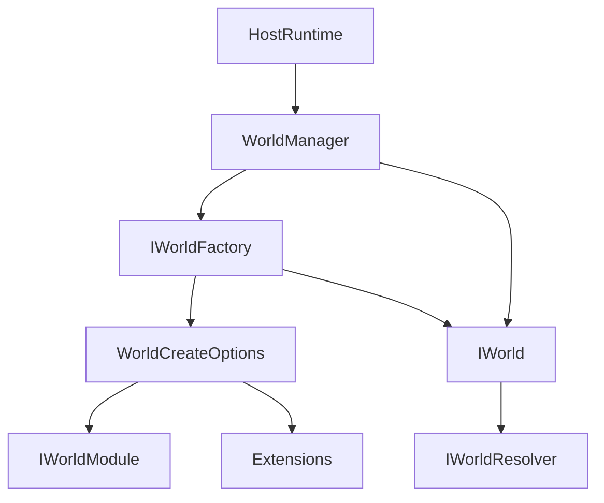
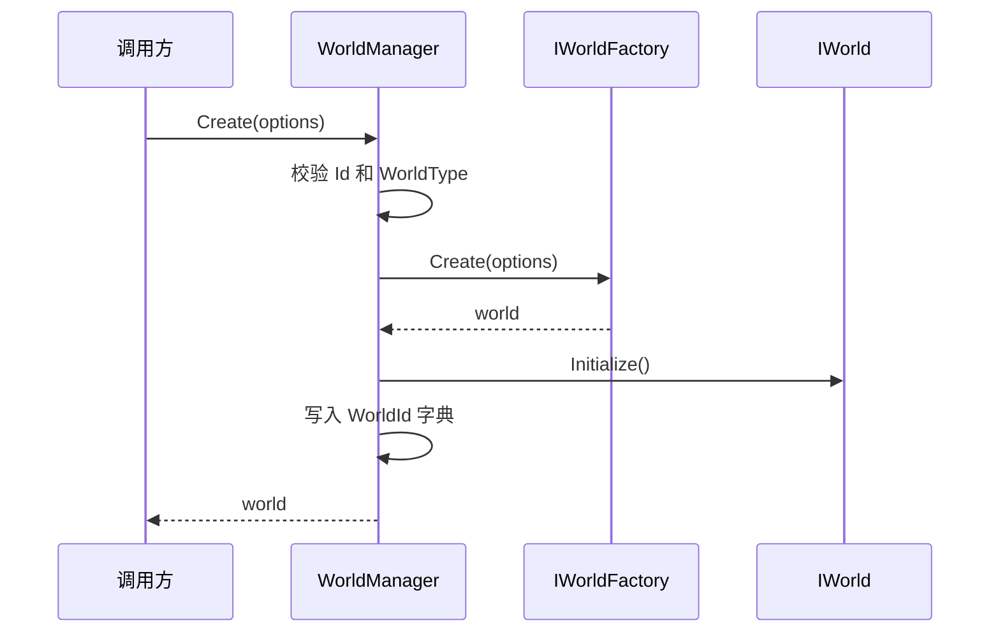
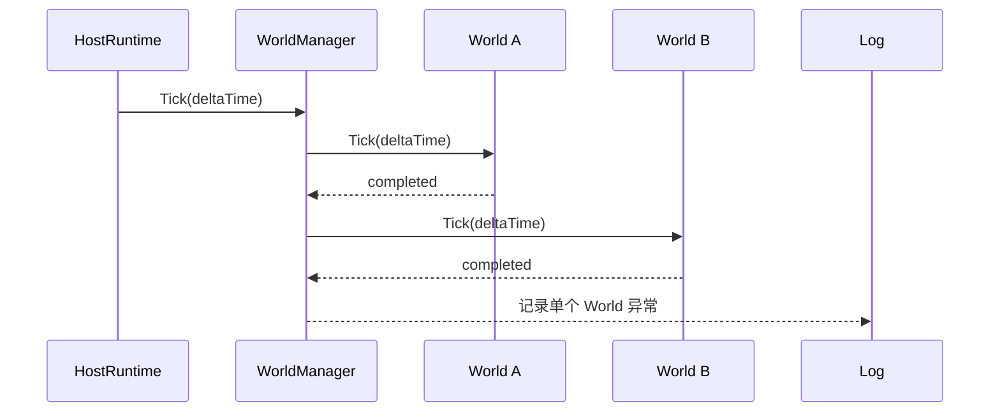
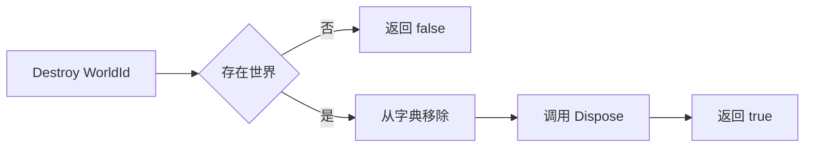

# 2.1 逻辑世界概述：IWorld、WorldManager 与世界生命周期

> 本文从源码解释 AbilityKit 的逻辑世界边界。当前实现里的 `IWorld` 不是一个“实体和系统大接口”，而是 Host 与具体世界实现之间的最小运行时契约：提供身份、服务解析器、初始化、Tick 和释放。

文档类型：Canonical 设计 | 事实基线：2026-08-16 | 适用范围：`world.di` 的世界契约与管理器，以及 `host` 对该契约的消费

---

## 1. 能力定位

逻辑世界负责把“一场战斗、一局房间、一个模拟实例”的运行上下文收口成可创建、可 Tick、可销毁的对象。它解决的是运行时边界问题，而不是把 ECS、技能、网络、表现层全部塞进同一个接口。

| 职责 | 说明 |
|------|------|
| 世界身份 | 用 `WorldId` 和 `WorldType` 区分不同实例和不同世界类型 |
| 服务访问 | 通过 `IWorldResolver Services` 访问本世界的服务容器或作用域 |
| 生命周期 | `Initialize()`、`Tick(deltaTime)`、`Dispose()` 形成最小运行时闭环 |
| 多世界管理 | `WorldManager` 持有多个 `IWorld`，统一创建、查找、Tick 和销毁 |
| 扩展装配 | `WorldCreateOptions` 携带模块、服务构建器和扩展对象 |

当前实现应按三层理解，不能把某个 ECS 或 Demo 的应用层约定反推成 `IWorld` 的统一能力：

| 层级 | 当前职责 | 不属于这一层的统一契约 |
|------|----------|------------------------|
| `IWorld` / `WorldManager` | 世界身份、服务入口、初始化、Tick、释放与多实例索引 | 实体 API、System 排序、网络连接、战斗规则 |
| ECS / System 适配 | 基础 ECS、Entitas 或项目自定义调度如何保存状态和执行系统 | Host 生命周期与所有游戏统一的应用流程 |
| Host / 项目应用层 | 驱动世界、连接、Hook、Feature，并组合具体玩法模块 | 把 MOBA、Shooter 的装配固化为框架唯一方案 |

---

## 2. 源码入口

| 源码 | 作用 |
|------|------|
| `Unity/Packages/com.abilitykit.world.di/Runtime/World/Abstractions/IWorld.cs` | 逻辑世界最小接口 |
| `Unity/Packages/com.abilitykit.world.di/Runtime/World/Abstractions/WorldCreateOptions.cs` | 创建世界时传入 ID、类型、服务构建器、模块和扩展 |
| `Unity/Packages/com.abilitykit.world.di/Runtime/World/Abstractions/IWorldFactory.cs` | `WorldManager` 通过工厂创建具体世界 |
| `Unity/Packages/com.abilitykit.world.di/Runtime/World/Management/WorldManager.cs` | 多世界创建、初始化、Tick、销毁 |
| `Unity/Packages/com.abilitykit.world.di/Runtime/World/Services/WorldClock.cs` | 世界逻辑时间服务 |
| `Unity/Packages/com.abilitykit.host/Runtime/Host/Framework/HostRuntime.cs` | Host 调用 `WorldManager.Tick(deltaTime)` 驱动所有世界 |

---

## 3. 真实 IWorld 接口

源码中的 `IWorld` 很小：

```csharp
public interface IWorld : IDisposable
{
    WorldId Id { get; }
    string WorldType { get; }
    IWorldResolver Services { get; }

    void Initialize();
    void Tick(float deltaTime);
}
```

这个设计刻意避免让 Host 知道具体世界内部是否使用 AbilityKit ECS、Entitas、Svelto、Triggering 或项目自定义系统。Host 只需要知道：这个世界是谁、属于什么类型、怎么初始化、怎么推进一帧、怎么释放。

---

## 4. 总体结构



关键依赖方向是 Host 依赖 `IWorld` 抽象，具体世界实现依赖自己的服务、系统和 ECS 适配。这样 Console Demo、Unity Demo、Orleans 服务端和测试都可以用同一套 Host 驱动模型。

---

## 5. 创建流程

`WorldManager.Create(options)` 的真实流程很短，但边界很清晰：



创建阶段有三个保护点：

| 保护点 | 源码行为 | 设计意图 |
|--------|----------|----------|
| `WorldId` 必填 | 空 ID 直接抛异常 | 避免世界无法被查找或销毁 |
| `WorldType` 必填 | 空类型直接抛异常 | 让工厂能选择具体世界实现 |
| ID 不可重复 | 已存在同 ID 直接抛异常 | 避免房间或战斗实例互相覆盖 |

这些保护不构成创建事务。当前源码还存在两个必须由工厂或上层处理的边界：工厂返回的 `world.Id` 不会与 `options.Id` 再次比对；`Initialize()` 抛异常时实例不会入表，但 `WorldManager` 也不会代为 `Dispose()`。因此工厂必须保证身份一致，并在初始化失败路径回收已经取得的资源。

---

## 6. Tick 流程

Host 的 Tick 会下沉到 `WorldManager.Tick(deltaTime)`，再逐个调用世界的 `Tick`。



`WorldManager` 会捕获单个世界 Tick 抛出的异常并记录日志，避免一个世界的失败直接中断管理器后续流程。这个行为适合多房间服务器，也适合测试环境里定位某个世界的异常。

管理器按内部字典直接枚举，没有锁也没有 snapshot。世界 Tick 内创建或销毁世界可能触发集合修改异常；多线程同时调用 Create、Tick、Destroy 也不属于当前支持范围。项目应把管理器操作收敛到同一调度线程，或在上层排队到 Tick 边界执行。

---

## 7. 销毁流程



`WorldManager.Destroy(id)` 先从字典移除，再调用 `Dispose()`。这样即使释放过程中出现外部观察，也不会再从管理器拿到这个世界。

`DisposeAll()` 用于管理器整体关闭，逐个释放当前持有的所有世界，然后清空字典。

这里的异常语义并非 best-effort：单个 `Destroy` 中 `Dispose()` 的异常会向上传播；`DisposeAll()` 也没有逐世界隔离，任一世界释放失败都会中断后续循环，并可能使最后的字典清理没有执行。生产宿主需要决定是保留该 fail-fast 行为，还是在外层实现逐世界释放、聚合错误和最终清理。

---

## 8. WorldCreateOptions 的设计意图

`WorldCreateOptions` 不是简单的参数袋，它把创建世界时的可变输入集中到一个对象里：

| 字段 | 用途 |
|------|------|
| `Id` | 世界实例 ID，通常对应房间、战斗或模拟实例 |
| `WorldType` | 世界类型，供工厂选择具体实现 |
| `ServiceBuilder` | 创建世界时使用的服务注册器 |
| `Modules` | 世界级模块列表，用于装配服务或能力 |
| `Extensions` | 临时扩展数据，给项目侧传入自定义上下文 |

这种设计解决了“Host 不知道具体玩法，但具体玩法创建世界时需要额外参数”的矛盾：Host 只传 options，世界工厂决定如何解释这些选项。

---

## 9. WorldClock 与逻辑时间

`WorldClock` 是逻辑世界常用的时间服务：

```csharp
public sealed class WorldClock : IWorldClock
{
    public float DeltaTime { get; private set; }
    public float Time { get; private set; }

    public void Tick(float deltaTime)
    {
        DeltaTime = deltaTime;
        Time += deltaTime;
    }
}
```

它和真实时间计时器不同，只记录由 Host 或世界驱动传入的逻辑 `deltaTime`。帧同步、回放和测试依赖这一边界：逻辑时间来自外部驱动，不能偷偷读取系统时间。

---

## 10. 设计取舍

| 取舍 | 说明 |
|------|------|
| `IWorld` 保持小接口 | Host 不关心实体、组件、系统细节，便于接入不同 ECS 或自定义世界 |
| `WorldManager` 不负责服务构建 | 服务装配交给世界工厂和 options，避免管理器变成上帝对象 |
| 创建时立即 Initialize | 管理器返回的世界默认已经可 Tick，减少半初始化状态 |
| Tick 捕获异常 | 多世界场景中，一个世界失败不应阻断其它世界推进 |
| 逻辑时间外部传入 | 支持确定性、测试、回放和服务端统一驱动 |

---

## 11. 源码阅读路径

1. `IWorld.cs`：世界接口只有身份、服务、初始化、Tick 和释放。
2. `WorldManager.cs`：多世界的创建、查找、Tick 和销毁。
3. `WorldCreateOptions.cs`：世界创建时如何传入模块、服务构建器和扩展对象。
4. `WorldContainer.cs` 与 `WorldScope.cs`：`Services` 背后的依赖注入模型。
5. `HostRuntime.cs`：Host 如何驱动 `WorldManager.Tick(deltaTime)`。

---

## 12. 边界判断

| 容易混淆的判断 | 设计边界 |
|----------------|----------|
| `IWorld` 应该暴露实体创建和查询 | 当前源码把世界运行时契约和 ECS 查询能力拆开，Host 不直接依赖实体接口 |
| `WorldManager` 是业务系统调度器 | 它只管理世界实例，具体系统调度在具体世界内部完成 |
| 世界时间应读取系统时钟 | 逻辑世界应由外部传入 `deltaTime`，避免破坏确定性 |
| `WorldType` 只是备注 | 它是工厂选择具体世界实现的重要输入 |

---

## 13. 和其他文档的关系

- [服务容器](05-ServiceContainer.md) 解释 `IWorldResolver`、`WorldContainer`、`WorldScope` 和生命周期。
- [系统设计](04-SystemDesign.md) 解释具体世界内部如何组织系统。
- [Host 运行时](../03-LogicalWorldHostDesign/01-HostRuntime.md) 解释 Host 如何驱动多个世界。
- [ECS 查询与遍历](../06-ECSArchitecture/03-QueryAndIteration.md) 解释具体 ECS 世界里的实体查询。

---

## 14. 失败矩阵、证据与规范目标

| 场景 | 当前实现 | 调用方责任 / 规范目标 |
|------|----------|------------------------|
| 工厂创建失败 | 异常传播，不入表 | 工厂自行回收创建中的资源 |
| `Initialize` 失败 | 异常传播，不入表，不自动释放实例 | 建议未来提供失败回收契约；当前由工厂/世界实现保证事务性 |
| `world.Id` 与请求 ID 不同 | 不校验，按请求 ID 入表 | 工厂必须保持一致；建议补显式校验与测试 |
| 单世界 Tick 失败 | 记录异常并继续其他世界 | 保持世界级故障隔离，同时由监控决定摘除策略 |
| Tick 中修改世界集合 | 直接枚举，可能失败 | 同线程、Tick 边界排队；若需重入应改为 snapshot/命令队列 |
| 单世界 Dispose 失败 | 已先移出字典，异常传播 | 上层记录失败并继续宿主关闭策略 |
| `DisposeAll` 中途失败 | 后续世界和最终 Clear 可能不执行 | 建议逐项隔离、聚合异常并保证最终清理 |

本次验证中，`AbilityKit.World.DI.Tests` 31/31 通过，但这些测试针对容器、模块规划与注入，不覆盖 `WorldManager` 生命周期。`runtime-contracts` 配置虽列出 World DI 测试，当前 `ciPolicy` 全为 false，workflow 也没有对应 job；基础世界管理器没有独立自动化测试。因此本文关于 `IWorld` 与 `WorldManager` 的证据为源码审计 E0，加上相关工程可构建 E2，尚未达到生命周期契约 E3，更不能标记为 CI 编排 E5。

规范目标是保持 `IWorld` 的最小接口和 ECS 可替换性，同时补齐创建失败回收、身份一致性、集合修改策略与批量释放语义。示例可以展示一种应用装配，但不应把具体战斗流程提升为所有世界必须实现的框架接口。

*文档版本：v3.0 | 最后更新：2026-08-16*
