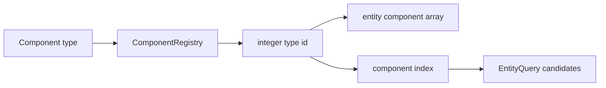
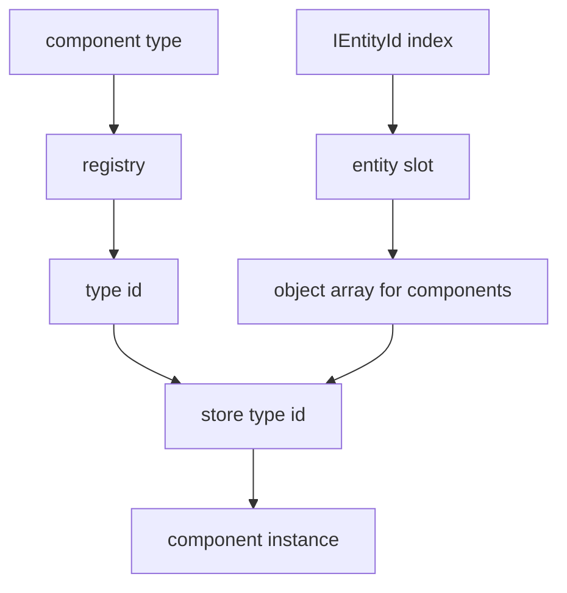
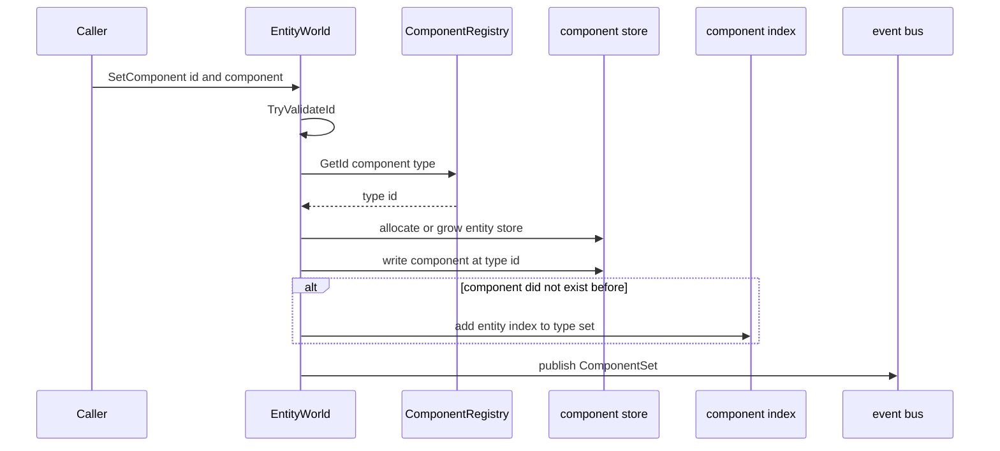
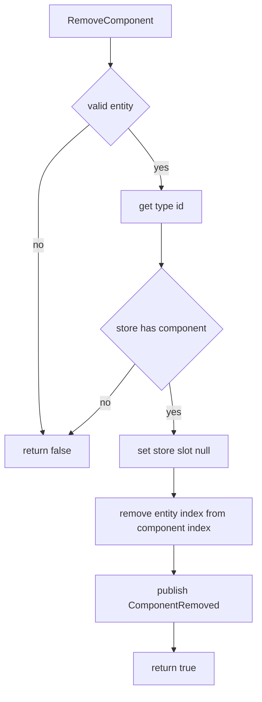
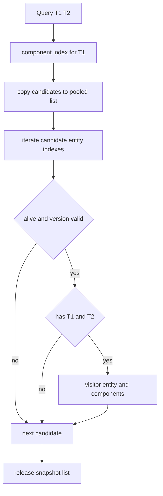

# 2.3 组件设计：ComponentRegistry、TypeId 与组件读写路径

> 本文基于 `Unity/Packages/com.abilitykit.world.ecs` 与 `src/AbilityKit.World.ECS` 的真实源码，解释 AbilityKit 基础 ECS 中组件如何定义、注册、存储、索引、查询和释放。当前源码没有 `IECComponent` 标记接口要求，组件类型由 `ComponentRegistry` 映射成整数 type id。

文档类型：Canonical 设计 | 事实基线：2026-08-16 | 适用范围：AbilityKit 基础 ECS 组件注册、存储、索引和事件路径

---

## 目录

- [2.3 组件设计：ComponentRegistry、TypeId 与组件读写路径](#23-组件设计componentregistrytypeid-与组件读写路径)
  - [目录](#目录)
  - [1. 能力定位](#1-能力定位)
  - [2. 源码入口](#2-源码入口)
  - [3. 组件类型与注册表](#3-组件类型与注册表)
  - [4. 组件存储结构](#4-组件存储结构)
  - [5. 设置组件流程](#5-设置组件流程)
  - [6. 读取与移除流程](#6-读取与移除流程)
  - [7. 组件索引与查询协作](#7-组件索引与查询协作)
  - [8. 值类型组件和引用类型组件](#8-值类型组件和引用类型组件)
  - [9. 设计意图与解决的问题](#9-设计意图与解决的问题)
    - [9.1 类型安全 API 和整数索引并存](#91-类型安全-api-和整数索引并存)
    - [9.2 共享 ComponentRegistry 保持跨世界一致](#92-共享-componentregistry-保持跨世界一致)
    - [9.3 第一个组件作为查询入口](#93-第一个组件作为查询入口)
    - [9.4 组件事件不直接驱动业务](#94-组件事件不直接驱动业务)
    - [9.5 引用组件和确定性状态分层](#95-引用组件和确定性状态分层)
  - [10. 边界判断](#10-边界判断)
  - [11. 跨 Unity 与 .NET 的实现边界](#11-跨-unity-与-net-的实现边界)
  - [12. 验证入口与证据状态](#12-验证入口与证据状态)
    - [12.1 当前可以执行的验证](#121-当前可以执行的验证)
    - [12.2 当前证据能证明什么](#122-当前证据能证明什么)
    - [12.3 优先补测契约](#123-优先补测契约)
  - [13. 源码阅读路径](#13-源码阅读路径)
  - [14. 当前实现限制与协议边界](#14-当前实现限制与协议边界)

---

## 1. 能力定位

组件是挂在实体上的状态数据，系统通过组件组合筛选实体并推进逻辑。AbilityKit 基础 ECS 的组件设计目标是：用类型安全 API 给业务层读写组件，同时在内部用整数 type id 和数组降低定位成本。

| 能力 | 源码落点 |
|------|----------|
| 类型到 id 的映射 | `ComponentRegistry.GetId(Type)` |
| 值类型组件写入 | `EntityWorld.SetComponent<T>(id, component)` |
| 引用类型组件写入 | `EntityWorld.SetComponentRef<T>(id, component)` |
| 组件读取 | `GetComponent`、`TryGetComponent`、`GetComponentRef`、`TryGetComponentRef` |
| 组件移除 | `RemoveComponent<T>` 和 `RemoveComponentById` |
| 查询候选集 | `_componentIndex : Dictionary<int, HashSet<int>>` |
| 组件变更事件 | `ComponentSet` 和 `ComponentRemoved` |

---

## 2. 源码入口

| 文件 | 作用 |
|------|------|
| `Unity/Packages/com.abilitykit.world.ecs/Runtime/AbilityKit.World.ECS/Impl/ComponentRegistry.cs` | 默认组件注册表，分配 type id |
| `Unity/Packages/com.abilitykit.world.ecs/Runtime/AbilityKit.World.ECS/Core/IComponentRegistry.cs` | 组件注册表接口 |
| `Unity/Packages/com.abilitykit.world.ecs/Runtime/AbilityKit.World.ECS/Core/IECWorld.cs` | 组件读写和查询 API |
| `Unity/Packages/com.abilitykit.world.ecs/Runtime/AbilityKit.World.ECS/Core/IEntity.cs` | 实体句柄上的链式组件 API |
| `Unity/Packages/com.abilitykit.world.ecs/Runtime/AbilityKit.World.ECS/Impl/EntityWorld.cs` | Unity 包中的组件存储、索引、事件和查询实现 |
| `src/AbilityKit.World.ECS/Impl/EntityWorld.cs` | .NET 工程使用的 `EntityWorld` 镜像实现 |
| `src/AbilityKit.World.ECS/AbilityKit.World.ECS.csproj` | .NET 编译边界：复用 Unity 包源码，但排除包内 `EntityWorld.cs` |
| `Unity/Packages/com.abilitykit.world.ecs/Runtime/AbilityKit.World.ECS/Core/EntityQuery.cs` | 查询结果封装 |

---

## 3. 组件类型与注册表

`ComponentRegistry` 将 `System.Type` 映射成自增整数 id。默认使用 `ComponentRegistry.Shared`，让多个 `EntityWorld` 实例共享一致的组件 type id。

```csharp
public sealed class ComponentRegistry : IComponentRegistry
{
    private readonly Dictionary<Type, int> _ids = new Dictionary<Type, int>();
    private readonly Dictionary<int, Type> _types = new Dictionary<int, Type>();
    private int _nextId = 1;

    public int GetId(Type type)
    {
        if (_ids.TryGetValue(type, out var id)) return id;
        id = _nextId++;
        _ids.Add(type, id);
        _types[id] = type;
        return id;
    }
}
```



组件 type id 从 1 开始分配，0 号位不会被默认组件占用。文档和业务代码不应手写 type id；应该始终通过注册表或泛型 API 获取。

---

## 4. 组件存储结构

`EntityWorld` 的组件存储是二维结构：先通过实体 index 找到该实体的组件数组，再用组件 type id 作为数组下标。



内部字段：

```csharp
private object[][] _components = Array.Empty<object[]>();
private readonly Dictionary<int, HashSet<int>> _componentIndex;
```

组件数组是延迟分配的。实体没有组件时，`_components[index]` 可以是 `null`；首次设置组件时创建默认长度为 8 的数组；当 type id 超过数组长度时按倍数扩容。

---

## 5. 设置组件流程

值类型和引用类型组件最终都会进入 `SetComponentInternal`。

```csharp
public void SetComponent<T>(IEntityId id, T component) where T : struct
{
    if (!TryValidateId(id)) return;
    var typeId = _componentRegistry.GetId<T>();
    SetComponentInternal(id.Index, typeId, component);
}

public void SetComponentRef<T>(IEntityId id, T component) where T : class
{
    if (!TryValidateId(id)) return;
    if (component == null)
    {
        RemoveComponentById(id.Index, _componentRegistry.GetId<T>());
        return;
    }
    var typeId = _componentRegistry.GetId<T>();
    SetComponentInternal(id.Index, typeId, component);
}
```



`SetComponentInternal` 会记录写入前是否已有组件。如果之前没有该组件，就把实体 index 加入 `_componentIndex[typeId]`。这一步是后续查询能快速找到候选实体的关键。

---

## 6. 读取与移除流程

读取分为直接读取和 Try 读取。

| API | 组件类型 | 未找到时行为 |
|-----|----------|--------------|
| `GetComponent<T>` | struct | 抛 `KeyNotFoundException` |
| `TryGetComponent<T>` | struct | 返回 `false` 并输出 default |
| `GetComponentRef<T>` | class | 返回 `null` 或引用 |
| `TryGetComponentRef<T>` | class | 返回 bool 和引用 |
| `IEntity.Get<T>` | struct | 转发到 `GetComponent<T>` |
| `IEntity.GetRef<T>` | class | 转发到 `GetComponentRef<T>` |

移除组件会同时清实体本地数组和组件索引。



引用类型组件还有一个额外语义：`SetComponentRef<T>(id, null)` 等价于移除该引用组件。

---

## 7. 组件索引与查询协作

组件索引按 type id 保存拥有该组件的实体 index 集合。

```csharp
private readonly Dictionary<int, HashSet<int>> _componentIndex;
```

查询时，`EntityQuery<T1, T2, T3>` 不直接保存类型，而是保存 type id 和 `EntityWorld` 引用；执行 `ForEach` 时调用 `QueryImpl`。

```csharp
public readonly struct EntityQuery<T1>
    where T1 : struct
{
    private readonly int _typeId1;
    private readonly EntityWorld _world;

    public void ForEach(Action<IEntity, T1> visitor)
    {
        _world.QueryImpl<T1>(_typeId1, visitor);
    }
}
```

查询实现会用第一个组件的索引集合作为候选集，然后逐个校验实体是否存活、组件数组是否存在、其他组件是否存在。



这里使用从对象池租借的 snapshot 列表，是为了避免遍历过程中组件集合变化导致集合枚举异常，也让查询行为更稳定。查询会执行 `snapshot.AddRange(set)`，因此“池化”减少的是列表对象反复创建，并不表示候选索引复制没有成本；文档和性能评估不应把该路径概括为严格零分配或零复制查询。

---

## 8. 值类型组件和引用类型组件

基础 ECS 同时支持 struct 组件和 class 引用组件。

| 类型 | API | 适合内容 | 注意点 |
|------|-----|----------|--------|
| 值类型组件 | `SetComponent<T>`、`GetComponent<T>` | 可复制、可快照、可序列化的逻辑状态 | 修改后要重新写回组件 |
| 引用类型组件 | `SetComponentRef<T>`、`GetComponentRef<T>` | 外部句柄、表现绑定、运行时对象 | 不适合做确定性同步核心状态 |

`IEntity` 上提供链式 API：

```csharp
var actor = world.Create("hero")
    .With(new PositionComponent { X = 10, Y = 20 })
    .With(new HealthComponent { Hp = 100 })
    .WithRef(new ViewBinding(viewId));

if (actor.TryGet<HealthComponent>(out var health))
{
    health.Hp -= 10;
    actor.With(health);
}
```

对确定性逻辑来说，核心状态优先使用值类型组件；引用组件更适合桥接表现层、调试器或非确定性外部对象。

---

## 9. 设计意图与解决的问题

### 9.1 类型安全 API 和整数索引并存

业务代码用泛型 API 保持类型安全，内部用 type id 作为数组下标和索引 key。这样避免在业务层暴露字符串 key 或手写整数 id。

### 9.2 共享 ComponentRegistry 保持跨世界一致

默认共享注册表让不同 `EntityWorld` 对同一组件类型得到相同 type id，便于调试、事件、快照和工具层解释组件类型。

这里的“一致”只限同一进程内共享同一个 registry 的世界。ID 按类型首次访问顺序递增分配，不是由类型名或生成清单确定；不同进程、不同启动路径和不同构建不能假定得到相同数字。

### 9.3 第一个组件作为查询入口

`QueryImpl` 以第一个组件的索引集合作为候选集，减少扫描范围。写查询时应把更稀疏、更能筛选目标的组件放在第一个泛型参数。

### 9.4 组件事件不直接驱动业务

`ComponentSet` 和 `ComponentRemoved` 只描述变化，不替业务做调度。系统仍应在固定 Tick 中推进逻辑，事件更适合调试、同步、表现桥接或增量追踪。

### 9.5 引用组件和确定性状态分层

支持引用组件能降低接入 Unity View、外部句柄和调试对象的成本，但它们不应进入需要跨端一致的核心模拟状态。

---

## 10. 边界判断

| 容易混淆的判断 | 设计边界 |
|----------------|----------|
| 组件必须实现 `IECComponent` | 当前基础 ECS 没有这个接口要求，struct/class 类型通过泛型 API 注册 |
| `HasComponent<T>(id)` 检查某个实体 | 源码里的 `HasComponent<T>()` 是世界级存在性检查；实体侧 `Has<T>()` 目前也转发到该方法，使用前要理解这一点 |
| 修改 struct 组件字段后自动写回 | struct 是值复制，修改后需要再次 `SetComponent` 或 `With` |
| 引用组件适合保存同步状态 | 引用组件更适合桥接外部对象，确定性状态优先使用值类型 |
| 查询会扫描全部实体 | 查询先从第一个组件的索引集拿候选，再做存活和组件校验 |
| 手写 type id 能提高性能 | type id 应由 `ComponentRegistry` 管理，手写会破坏一致性 |
| type id 可直接写入存档或网络包 | 当前 ID 依赖运行时注册顺序，只能做进程内索引；跨进程协议应使用稳定 schema/type key |
| struct 组件天然零分配 | 最终存储是 `object[]`，写入值类型会装箱；是否满足热路径预算必须用 benchmark 和分配采样证明 |

---

## 11. 跨 Unity 与 .NET 的实现边界

仓库当前维护两份 `EntityWorld.cs`。Unity 包直接编译包内实现；`src/AbilityKit.World.ECS/AbilityKit.World.ECS.csproj` 复用包内其余源码，但显式排除包内 `EntityWorld.cs`，再编译 `src/AbilityKit.World.ECS/Impl/EntityWorld.cs`。

两份实现当前的组件存储、索引、查询、父子关系和销毁逻辑一致，已观察到的差异集中在平台编译条件：

| 差异 | Unity 包实现 | .NET 实现 |
|------|--------------|-----------|
| 平台引用 | 引用 `UnityEngine` | 不引用 Unity |
| 调试名称数组 | `UNITY_EDITOR || DEBUG` 时编译 | `DEBUG` 时编译 |
| 编译入口 | Unity asmdef/package | `AbilityKit.World.ECS.csproj` 本地文件 |

这种镜像关系不是自动生成关系。修改组件语义时必须同时核对两份文件，或者补充自动同步/差异门禁；只验证其中一份不能证明另一运行面的行为没有漂移。

---

## 12. 验证入口与证据状态

### 12.1 当前可以执行的验证

.NET 工程可先执行编译验证：

```powershell
dotnet build src/AbilityKit.World.ECS/AbilityKit.World.ECS.csproj
```

该命令能验证共享源码与 .NET 镜像实现可以一起编译，但不会执行组件行为断言。Unity 包当前未发现独立 `Tests` 目录，仓库也没有与该 package 一一对应的基础 ECS 测试工程，因此不能把构建成功写成组件生命周期、查询和事件契约已经通过自动测试。

### 12.2 当前证据能证明什么

| 契约 | 当前证据 | 证据状态 |
|------|----------|----------|
| 类型经 `ComponentRegistry` 分配 id | 两端共享注册表源码 | 源码确认，缺独立行为测试 |
| struct/class 组件走不同 API | `IECWorld`、`IEntity` 与两份 `EntityWorld` | 源码确认，缺独立行为测试 |
| 新增/移除组件同步维护 `_componentIndex` | 两份 `EntityWorld` 实现 | 源码确认，缺回归测试 |
| 查询复制第一个组件候选集后逐项校验 | `EntityQuery` 与 `QueryImpl` | 源码确认，缺查询期间修改组件的测试 |
| 销毁实体会清组件索引并递增版本 | `InternalDestroy` | 源码确认，缺旧句柄与索引清理测试 |
| Unity 与 .NET 实现语义一致 | 当前文件人工对照 | 当前快照一致，缺自动差异门禁 |

这里的“源码确认”只表示文档与当前实现一致，不表示异常路径、容量边界或长期演进已有回归保护。

### 12.3 优先补测契约

建议基础 ECS 的独立测试优先覆盖以下行为：

1. 同一实体的设置、覆盖、读取、移除，以及对应 `ComponentSet`/`ComponentRemoved` 事件次数。
2. 销毁后旧 `IEntityId` 失效，复用 index 后 version 不同，查询索引不残留旧实体。
3. 查询回调中新增或移除组件时，snapshot 遍历不抛集合修改异常，且本次/下次查询边界明确。
4. `Destroy` 与 `DestroyRecursive` 对父子关系、逻辑 child id 映射和子实体存活状态的不同影响。
5. `SetComponentRef(id, null)` 的移除语义，以及非泛型引用组件 API 的类型校验。
6. `IEntity.Has<T>()` 当前转发到世界级 `HasComponent<T>()` 的行为。该行为容易被调用方误解为实体级检查，应先用测试固定现状，再决定是否调整 API。
7. 对 Unity 与 .NET 两份 `EntityWorld.cs` 增加结构差异检查，防止仅一端修复组件索引或生命周期问题。

---

## 13. 源码阅读路径

1. `ComponentRegistry.cs`：类型到 type id 的映射。
2. `IECWorld.cs` 的组件 API：值类型和引用类型两条路径。
3. Unity 与 .NET 两份 `EntityWorld.cs` 的 `SetComponentInternal` 与 `RemoveComponentById`：组件写入和移除流程。
4. `AbilityKit.World.ECS.csproj`：共享源码和 .NET 镜像的编译边界。
5. `EntityQuery.cs` 与 `EntityWorld.QueryImpl`：组件索引如何驱动查询。
6. [查询与遍历源码深潜](../06-ECSArchitecture/03-QueryAndIteration.md)：查询成本、snapshot 和存活校验细节。

---

## 14. 当前实现限制与协议边界

| 主题 | 当前实现事实 | 使用约束 |
|------|--------------|----------|
| TypeId 稳定性 | `_nextId` 按首次访问顺序递增 | 只用于当前 registry 内部索引，不可直接持久化、上网或作为跨进程确定性协议 |
| Shared 初始化 | `Shared` 首次赋值本身没有锁，后续注册表字典访问才进入锁 | 应在单线程启动期预热；不能据此宣称完整线程安全 |
| `Count` | `_nextId` 从 1 起步，`Count` 返回 `_nextId` | 它更接近下一个 ID/容量提示，不是严格的已注册类型数量 |
| 组件存储 | struct 和 class 最终都进入 `object[]` | struct 写入会装箱，当前没有“零分配组件写入”的证据 |
| Query snapshot | 池化 `List<IEntityId>` 复制候选后遍历 | 可以降低稳态临时列表压力，但没有 benchmark 证明零分配或固定复杂度 |
| 事件发布 | `WorldEventBus.Publish` 会复制订阅列表，handler 异常没有逐项隔离 | 发布路径存在分配和失败传播，不能默认用于无预算评估的高频热路径 |
| `IEntity.Has<T>` | 当前检查世界级组件存在性而非当前实体 | 实体局部判断应使用带实体 ID 的 API，直到接口语义被修正并测试固定 |

2026-08-16 的 Release 构建为 0 警告、0 错误，证据最高为 E2。基础 ECS 仍没有独立行为测试和专项 workflow gate，组件覆盖/移除、查询期间修改、事件异常、装箱与 registry 并发都未形成 E3/E4/E5 证据。规范目标是先把进程内索引与稳定协议明确分层，再以契约测试和 benchmark 约束行为与性能；示例中的快照或网络代码不得直接把运行时 TypeId 当成长期 schema。

*文档版本：v3.0 | 最后更新：2026-08-16*
