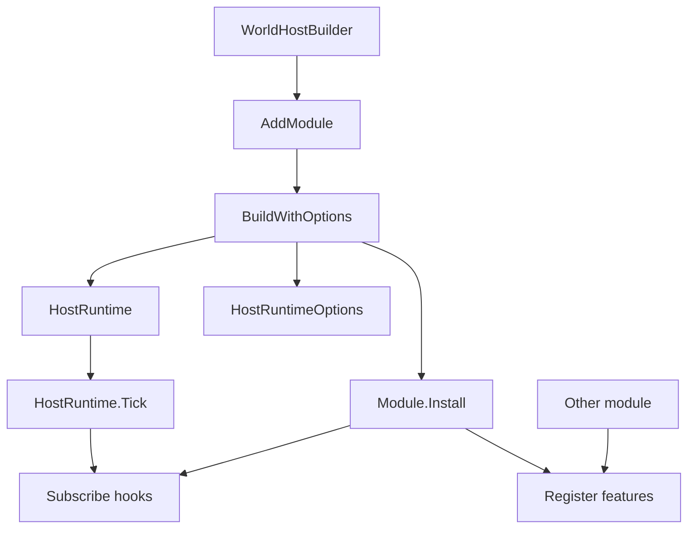
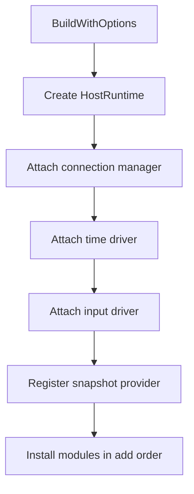
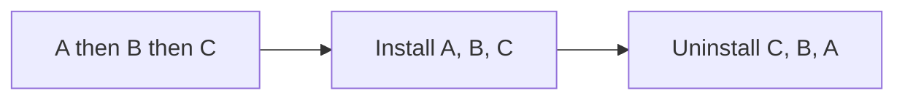
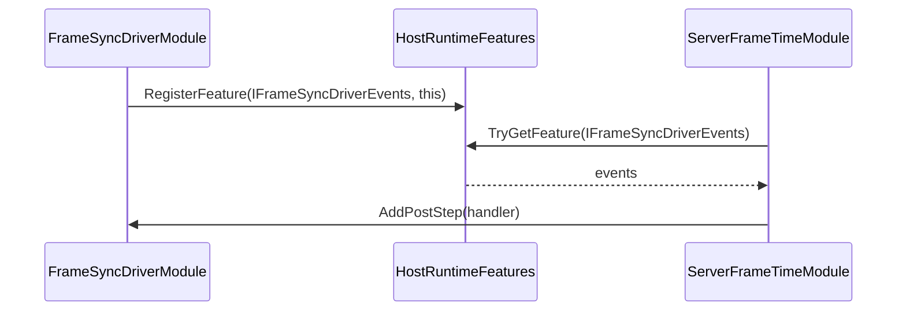
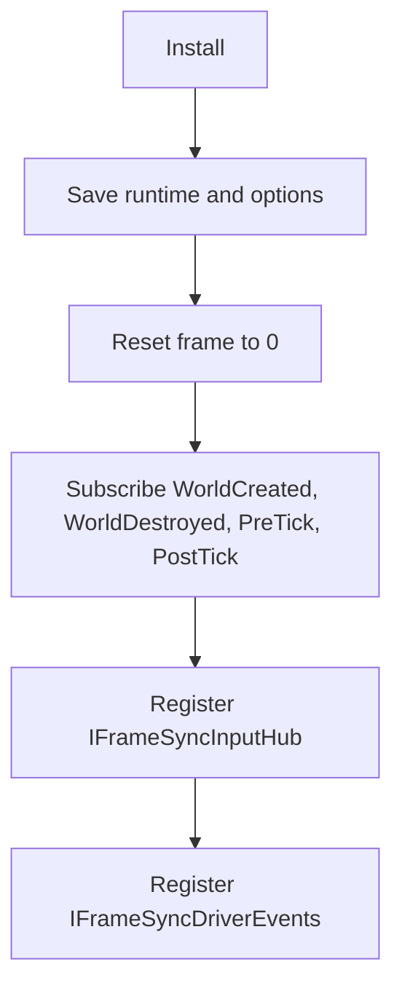
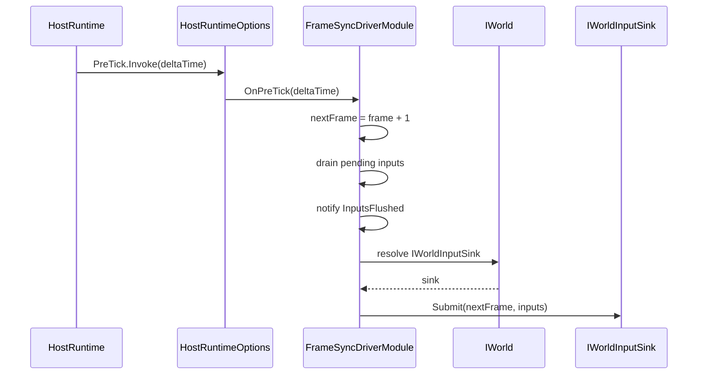
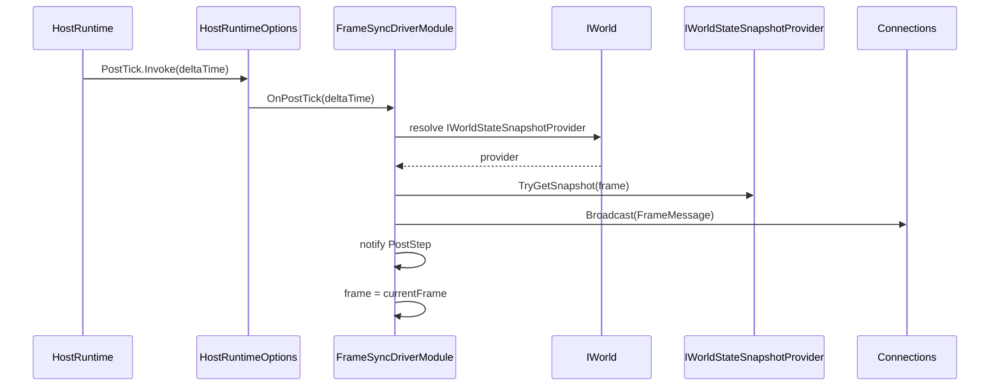
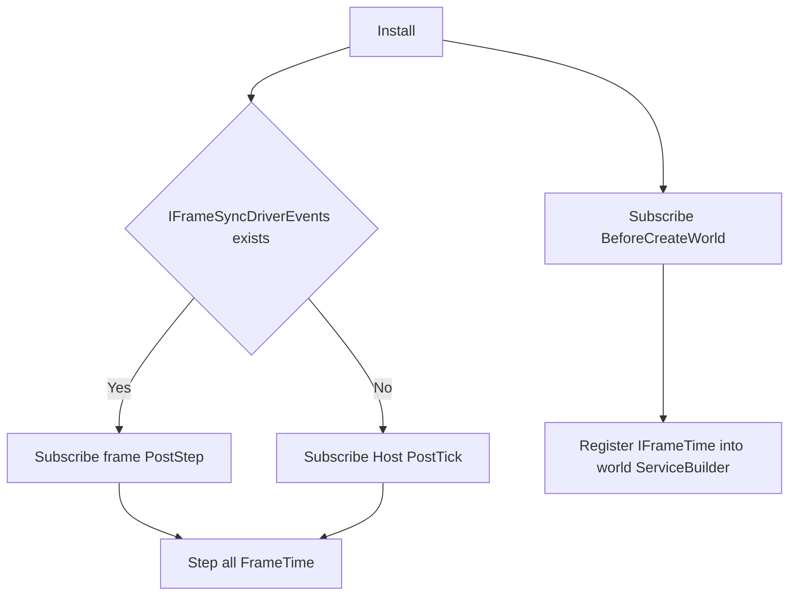
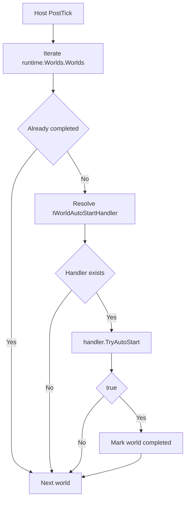

# 3.2 Host 模块系统：Install、Hook 与 Feature 协作

> 本文基于 `Unity/Packages/com.abilitykit.host` 与 `Unity/Packages/com.abilitykit.host.extension` 的真实源码，解释 Host 模块如何安装、卸载、订阅 Host 生命周期、注册共享能力，并与帧同步、时间、回滚和自动开局模块协作。

文档类型：Canonical 设计 | 事实基线：2026-08-16 | 适用范围：Host 模块底座与 extension 示例模块；具体模块组合仍由项目拥有

---

## 目录

- [3.2 Host 模块系统：Install、Hook 与 Feature 协作](#32-host-模块系统installhook-与-feature-协作)
  - [目录](#目录)
  - [1. 能力定位](#1-能力定位)
  - [2. 源码入口](#2-源码入口)
  - [3. 真实模块接口](#3-真实模块接口)
  - [4. 安装与卸载顺序](#4-安装与卸载顺序)
    - [4.1 WorldHostBuilder 安装模块](#41-worldhostbuilder-安装模块)
    - [4.2 HostRuntimeModuleHost 逆序卸载](#42-hostruntimemodulehost-逆序卸载)
  - [5. Hook 是模块的运行入口](#5-hook-是模块的运行入口)
  - [6. Feature 是模块间能力注册表](#6-feature-是模块间能力注册表)
  - [7. 真实内置模块](#7-真实内置模块)
  - [8. FrameSyncDriverModule 流程](#8-framesyncdrivermodule-流程)
    - [8.1 安装流程](#81-安装流程)
    - [8.2 Tick 前输入 flush](#82-tick-前输入-flush)
    - [8.3 Tick 后广播帧包](#83-tick-后广播帧包)
  - [9. ServerFrameTimeModule 流程](#9-serverframetimemodule-流程)
  - [10. WorldAutoStartModule 流程](#10-worldautostartmodule-流程)
  - [11. 自定义模块写法](#11-自定义模块写法)
  - [12. 设计意图与解决的问题](#12-设计意图与解决的问题)
  - [13. 边界判断](#13-边界判断)
  - [14. 验证入口与证据状态](#14-验证入口与证据状态)
    - [14.1 当前测试入口](#141-当前测试入口)
    - [14.2 FrameSyncDriverModule 的现有证据](#142-framesyncdrivermodule-的现有证据)
    - [14.3 模块系统的覆盖缺口](#143-模块系统的覆盖缺口)
  - [15. 源码阅读路径](#15-源码阅读路径)

---

## 1. 能力定位

Host 模块是 HostRuntime 的可插拔扩展单元。它的目标不是让 HostRuntime 内部维护一个“每帧模块调度器”，而是让模块在安装时把自己挂到 Host 的生命周期 Hook、Feature 注册表和世界服务上。

| 模块可以做什么 | 典型例子 |
|----------------|----------|
| 订阅世界创建前事件 | `ServerFrameTimeModule` 在 `BeforeCreateWorld` 给世界注册 `IFrameTime` |
| 订阅世界创建后事件 | `FrameSyncDriverModule` 为每个世界创建帧同步 session |
| 订阅 Tick 前后事件 | 帧同步模块在 PreTick flush 输入，在 PostTick 广播帧包 |
| 注册共享能力 | 帧同步模块注册 `IFrameSyncInputHub` 和 `IFrameSyncDriverEvents` |
| 读取其他模块能力 | 时间模块读取 `IFrameSyncDriverEvents`，跟随帧同步 PostStep 更新时间 |
| 清理订阅和状态 | `Uninstall` 移除 Hook、Feature、缓存和引用 |

模块系统的主线如下：



---

## 2. 源码入口

| 源码 | 说明 |
|------|------|
| `Unity/Packages/com.abilitykit.host/Runtime/Host/Framework/IHostRuntimeModule.cs` | 模块最小接口，只有 `Install` 和 `Uninstall` |
| `Unity/Packages/com.abilitykit.host/Runtime/Host/Framework/HostRuntimeModuleHost.cs` | 独立模块宿主，支持正序安装、逆序卸载 |
| `Unity/Packages/com.abilitykit.host/Runtime/Host/Builder/WorldHostBuilder.cs` | Builder 收集模块并在 Build 时安装 |
| `Unity/Packages/com.abilitykit.host/Runtime/Host/Framework/HostRuntimeOptions.cs` | 模块订阅生命周期的 Hook 集合 |
| `Unity/Packages/com.abilitykit.host/Runtime/Host/Framework/HostRuntimeFeatures.cs` | 模块共享能力注册表 |
| `Unity/Packages/com.abilitykit.host.extension/Runtime/FrameSync/FrameSyncDriverModule.cs` | 帧同步驱动模块，最完整的 Hook 和 Feature 示例 |
| `Unity/Packages/com.abilitykit.host.extension/Runtime/Time/ServerFrameTimeModule.cs` | 世界帧时间模块，演示模块依赖另一个模块 Feature |
| `Unity/Packages/com.abilitykit.host.extension/Runtime/WorldStart/WorldAutoStartModule.cs` | 自动开局模块，演示 PostTick 扫描世界服务 |
| `Unity/Packages/com.abilitykit.host.extension/Runtime/Rollback/ServerRollbackModule.cs` | 服务端回滚模块，演示依赖帧同步事件能力 |
| `src/AbilityKit.Host.Tests/WorldHostBuilderTests.cs` | 当前 Host 独立测试，只覆盖 Builder 的少量参数边界 |
| `src/AbilityKit.Demo.Shooter.Runtime.Tests/HostExtension/FrameSyncDriverModuleHeadlessTests.cs` | `FrameSyncDriverModule` 的 headless 与 world-backed 集成测试 |

---

## 3. 真实模块接口

当前源码中的模块接口是：

```csharp
public interface IHostRuntimeModule
{
    void Install(HostRuntime runtime, HostRuntimeOptions options);
    void Uninstall(HostRuntime runtime, HostRuntimeOptions options);
}
```

当前模块接口不包含名称、优先级或直接 Tick 成员：

| 非接口成员 | 当前源码事实 |
|------------|--------------|
| `Name` | 模块没有统一名称属性 |
| `Priority` | 模块没有统一优先级属性 |
| `OnAttach` | 用 `Install` 替代 |
| `OnDetach` | 用 `Uninstall` 替代 |
| `OnTick` | 用 `PreTick`、`PostTick` 等 Hook 替代 |

这样设计后，模块不需要被 HostRuntime 主循环逐个调度，而是在安装时声明自己关心哪些生命周期点。

---

## 4. 安装与卸载顺序

### 4.1 WorldHostBuilder 安装模块

`WorldHostBuilder.BuildWithOptions()` 在完成世界工厂、连接管理、时间驱动、输入驱动、快照提供器装配后，按添加顺序安装模块：



安装顺序会影响 Feature 依赖解析：部分模块会读取前置模块注册的 Feature。

`WorldHostBuilder` 这里只直接调用 `module.Install(runtime, options)`，不会保存 `HostRuntimeModuleHost` 或返回模块释放句柄。安装中途抛异常也没有事务回滚：此前已经安装的模块、Hook 和 Feature 会保留，必须由调用方按项目策略清理。

| 例子 | 原因 |
|------|------|
| 先装 `FrameSyncDriverModule`，再装 `ServerFrameTimeModule` | 时间模块会尝试读取 `IFrameSyncDriverEvents` |
| 先装 `FrameSyncDriverModule`，再装 `ServerRollbackModule` | 回滚模块要求存在 `IFrameSyncDriverEvents` |
| 自动开局模块通常可后装 | 它主要订阅 `PostTick` 并扫描世界服务 |

### 4.2 HostRuntimeModuleHost 逆序卸载

`HostRuntimeModuleHost` 提供了一个独立模块宿主：



逆序卸载符合资源依赖直觉：后安装的模块可能依赖先安装模块注册的能力，卸载时应该先释放后安装模块。

必须区分“存在独立 ModuleHost 类型”和“Builder 已自动接入卸载”：当前 Builder 没有使用 `HostRuntimeModuleHost`。只有调用方显式创建并持有该宿主时，才获得逆序 `Uninstall`；通过 Builder 添加模块并不自动获得该关闭路径。

两条路径都没有安装事务。`InstallAll` 或 Builder 的任一 Attach/Register/Install 抛错时，之前成功的驱动、Feature、Hook 和模块不会自动撤销；Builder 也不会返回部分构建结果，因此调用方可能无法完整定位已安装对象。`UninstallAll` 虽按逆序调用，却没有逐模块异常隔离：一个 `Uninstall` 抛错会阻止更早安装模块继续卸载。

---

## 5. Hook 是模块的运行入口

`HostRuntimeOptions` 暴露了 Host 生命周期 Hook：

| Hook | 触发时机 | 常见用途 |
|------|----------|----------|
| `BeforeCreateWorld` | `HostRuntime.CreateWorld` 调用 `WorldManager.Create` 之前 | 修改 `WorldCreateOptions`、注册世界服务 |
| `WorldCreated` | 世界创建并初始化后 | 建立模块内部 world session |
| `WorldDestroyed` | 世界被销毁后 | 清理模块缓存 |
| `PreTick` | `WorldManager.Tick` 之前 | flush 输入、准备帧数据 |
| `PostTick` | `WorldManager.Tick` 之后 | 广播快照、推进帧时间、自动开局 |
| `BeforeSendMessage` | `IServerConnection.Send` 前 | 统计、过滤、编码前处理 |
| `AfterSendMessage` | `IServerConnection.Send` 后 | 统计、追踪、诊断 |

Hook 内部按 `order` 排序：

```csharp
private readonly StablePriorityList<Action<T>> _handlers =
    new StablePriorityList<Action<T>>(capacity: 8);

public void Add(Action<T> handler, int order = 0)
{
    if (handler == null) throw new ArgumentNullException(nameof(handler));
    _handlers.Add(handler, order);
}
```

因此模块如果确实需要同一 Hook 内的先后顺序，可以在 `Add(handler, order)` 时指定 order，而不是依赖模块接口上的 Priority。

---

## 6. Feature 是模块间能力注册表

`HostRuntimeFeatures` 是 Type 到 object 的映射，带类型校验：

```csharp
public bool RegisterFeature(Type featureType, object feature)
{
    if (featureType == null) return false;
    if (feature == null) return false;
    if (!featureType.IsAssignableFrom(feature.GetType())) return false;

    _map[featureType] = feature;
    return true;
}
```

Feature 的典型使用方式：



Feature 和 World DI 的区别：

| 对比项 | HostRuntimeFeatures | World DI |
|--------|---------------------|----------|
| 作用域 | Host 级别 | World 或 Scope 级别 |
| 主要用途 | 模块之间共享能力 | 世界内部服务解析 |
| 生命周期管理 | 调用方自己负责注册/注销 | Container/Scope 负责部分生命周期 |
| 构造注入 | 不支持 | 支持 factory、lifetime、module |

---

## 7. 真实内置模块

| 模块 | 接口 | 关键行为 |
|------|------|----------|
| `FrameSyncDriverModule` | `IHostRuntimeModule`, `IFrameSyncInputHub`, `IFrameSyncDriverEvents` | 收集输入、PreTick 提交给世界、PostTick 广播 `FrameMessage` |
| `ServerFrameTimeModule` | `IHostRuntimeModule` | 给每个世界注册 `IFrameTime`，跟随帧同步或 Host PostTick 更新时间 |
| `WorldAutoStartModule` | `IHostRuntimeModule` | 每次 PostTick 扫描世界服务，找到 `IWorldAutoStartHandler` 后尝试自动开局 |
| `ServerRollbackModule` | `IHostRuntimeModule` | 依赖 `IFrameSyncDriverEvents`，记录输入历史并按帧捕获回滚快照 |
| `ClientPredictionDriverModule` | `IHostRuntimeModule` 与多个预测诊断接口 | 客户端预测、对账和调优能力 |

---

## 8. FrameSyncDriverModule 流程

`FrameSyncDriverModule` 是 Host 模块系统中最关键的例子。

### 8.1 安装流程



安装后，它既是模块，也是其他模块可发现的能力：

| Feature | 能力 |
|---------|------|
| `IFrameSyncInputHub` | 外部可调用 `SubmitInput` 提交某个世界的玩家输入 |
| `IFrameSyncDriverEvents` | 其他模块可订阅 `InputsFlushed` 和 `PostStep` |

### 8.2 Tick 前输入 flush



### 8.3 Tick 后广播帧包



---

## 9. ServerFrameTimeModule 流程

`ServerFrameTimeModule` 解决的是世界内 `IFrameTime` 服务和 Host 帧推进的同步问题。



关键源码行为：

| 时机 | 行为 |
|------|------|
| `BeforeCreateWorld` | 确保 `WorldCreateOptions.ServiceBuilder` 存在，并注册 `IFrameTime` 实例 |
| `WorldDestroyed` | 删除对应世界的 `FrameTime` 缓存 |
| `PostStep` 或 `PostTick` | 调用 `FrameTime.StepTo(frame, deltaTime)` |

它优先跟随帧同步模块的 `PostStep`，如果没有安装帧同步模块，就退回 Host 的 `PostTick`。

---

## 10. WorldAutoStartModule 流程

`WorldAutoStartModule` 的职责是让世界在服务准备好后自动开始。



这个模块没有直接假设某个游戏规则，而是只依赖世界服务 `IWorldAutoStartHandler`。因此不同游戏可以在自己的 World DI 中提供不同的自动开始策略。

---

## 11. 自定义模块写法

下面是符合当前源码模型的模块骨架。它用于说明接入约束，不是仓库中已编译或已执行的测试样例：

```csharp
public sealed class DiagnosticsHostModule : IHostRuntimeModule
{
    private readonly Action<float> _onPostTick;
    private HostRuntime _runtime;

    public DiagnosticsHostModule()
    {
        _onPostTick = OnPostTick;
    }

    public void Install(HostRuntime runtime, HostRuntimeOptions options)
    {
        if (runtime == null) throw new ArgumentNullException(nameof(runtime));
        if (options == null) throw new ArgumentNullException(nameof(options));

        _runtime = runtime;
        options.PostTick.Add(_onPostTick, order: 1000);
        runtime.Features.RegisterFeature<IDiagnosticsFeature>(new DiagnosticsFeature());
    }

    public void Uninstall(HostRuntime runtime, HostRuntimeOptions options)
    {
        if (options != null)
        {
            options.PostTick.Remove(_onPostTick);
        }

        runtime?.Features.UnregisterFeature<IDiagnosticsFeature>();
        _runtime = null;
    }

    private void OnPostTick(float deltaTime)
    {
        var count = _runtime?.Worlds?.Worlds?.Count ?? 0;
        // collect diagnostics
    }
}
```

自定义模块应遵循以下约束：

| 约束 | 原因 |
|------|------|
| 构造函数里缓存委托字段 | `Remove` 依赖同一个委托引用 |
| `Install` 校验 runtime/options | 和内置模块行为一致 |
| `Uninstall` 必须移除 Hook | 避免模块卸载后继续收到回调 |
| 注册 Feature 时使用接口类型 | 降低模块之间的具体类型耦合 |
| 不在模块里直接创建业务世界服务 | 世界内服务应通过 `WorldCreateOptions.ServiceBuilder` 注入 |

---

## 12. 设计意图与解决的问题

| 设计 | 解决的问题 |
|------|------------|
| 模块只有 `Install`/`Uninstall` | 接口稳定、扩展自由，不强迫所有模块拥有相同生命周期方法 |
| Hook 作为运行入口 | 让模块只订阅自己关心的 Host 阶段 |
| Feature 注册表 | 让模块能发现彼此能力，但避免直接依赖具体模块类 |
| Builder 按顺序安装 | 使用者可以明确控制依赖顺序 |
| 逆序卸载宿主 | 释放资源时符合依赖栈顺序 |
| World 服务与 Host Feature 分离 | Host 扩展和世界内部服务互不混淆 |

---

## 13. 边界判断

| 容易混淆的判断 | 设计边界 |
|----------------|----------|
| 模块会自动每帧调用 `OnTick` | 当前没有 `OnTick`；模块通过 `PreTick` 或 `PostTick` Hook 运行 |
| `Priority` 决定模块顺序 | 当前模块接口没有 `Priority`；安装顺序由 Builder 决定，Hook 内顺序由 `order` 决定 |
| Feature 能替代 World DI | Feature 是 Host 级能力注册表，不负责世界服务生命周期 |
| 安装模块后不需要卸载 | 长生命周期服务器或测试中必须清理 Hook 和 Feature |
| 任意顺序安装模块都安全 | 依赖 Feature 的模块需要排在提供 Feature 的模块之后 |
| Builder 会在退出时自动 Uninstall | Builder 不接入 `HostRuntimeModuleHost`，也不返回模块释放句柄 |
| Install 失败会回滚已安装模块 | 当前安装是顺序调用，失败后没有自动逆序补偿 |
| Feature 重复注册会拒绝或释放旧值 | 同类型会覆盖，Feature 注册表不管理新旧对象生命周期 |
| `UninstallAll` 会尽力卸载全部模块 | 当前逆序循环是 fail-fast；一个模块抛错会跳过剩余模块 |
| Hook 可以在回调中自由注册/退订 | Hook 遍历 live list，无 snapshot；增删会影响本轮索引与执行集合，且异常会中断后续 handler |

Feature 覆盖和注销只修改字典，不调用旧值或新值的 `Dispose`。因此 Feature 注册者必须保留所有权：覆盖前显式关闭旧对象，卸载时只移除自己仍拥有的映射，并避免误删后续模块已经替换的实例。当前接口没有 compare-and-remove，存在共享 Feature 时应由项目层建立 owner token 或禁止同契约覆盖。

---

## 14. 验证入口与证据状态

### 14.1 当前测试入口

Host 独立测试和 Shooter 模块集成测试分别通过以下命令执行：

```powershell
dotnet test src/AbilityKit.Host.Tests/AbilityKit.Host.Tests.csproj

dotnet test src/AbilityKit.Demo.Shooter.Runtime.Tests/AbilityKit.Demo.Shooter.Runtime.Tests.csproj --filter FrameSyncDriverModuleHeadlessTests
```

两组测试的责任不同：2026-08-16 的 `AbilityKit.Host.Tests` 为 8/8 通过，其中只有 `HookTests` 的 1 项直接覆盖稳定 order 与同一 registration 的 Remove，4 项 Builder 测试仍停留在参数边界；其余 3 项覆盖 Host 广播/发送与 fixed-step。Shooter Runtime Tests 验证具体示例装配，不应被解释为所有内置模块已经有独立测试。

### 14.2 FrameSyncDriverModule 的现有证据

`FrameSyncDriverModuleHeadlessTests` 当前覆盖三个场景：

| 场景 | 对模块设计的证明范围 |
|------|----------------------|
| headless session Tick | 安装后的 InputHub 可接收输入，PreTick/PostTick 路径能 flush 并广播帧消息 |
| 注销 session 后提交输入 | session 生命周期结束后输入被拒绝 |
| world-backed session Tick | 有真实 World 时仍能沿现有 InputHub 路径提交并广播 |

这些测试提供了 Hook、Feature、session 和广播的协作证据。它们没有直接断言每一个 Hook 的注册次数、模块 `Uninstall` 后的残留回调、Feature 注销、多个模块的相对顺序，也没有覆盖 `ServerFrameTimeModule`、`WorldAutoStartModule` 和 `ServerRollbackModule` 的完整生命周期。

### 14.3 模块系统的覆盖缺口

建议按底座契约补充以下独立测试：

1. `WorldHostBuilder` 按添加顺序调用模块 `Install`，安装失败时已安装模块和 Host 的处置策略明确。
2. `HostRuntimeModuleHost` 按安装逆序调用 `Uninstall`，明确单个卸载异常后的续处理和重复卸载语义。
3. `Hook.Add(order)` 的排序稳定性、`Remove` 的同一委托引用要求，以及回调期间增删 handler 的行为。
4. `HostRuntimeFeatures` 对空值、类型不兼容、同类型覆盖、注销和重复注销的返回值契约。
5. `FrameSyncDriverModule.Uninstall` 后 Hook 与 Feature 都被移除，旧 session 和输入入口不再工作。
6. `ServerFrameTimeModule` 在存在/不存在 `IFrameSyncDriverEvents` 时分别选择 PostStep/PostTick，且世界销毁后清除时间缓存。
7. `WorldAutoStartModule` 只在 handler 返回成功后标记完成，世界销毁或 id 复用时不残留完成状态。
8. `ServerRollbackModule` 缺少前置 Feature 时的失败方式，以及卸载后取消事件订阅的行为。

其中 1 至 4 属于 Host 模块底座，应放在 Host 独立测试工程；5 至 8 属于扩展模块，可放在 Host Extension 对应测试工程或现有跨包测试工程，但测试命名和文档应明确其归属。

---

## 15. 源码阅读路径

1. `IHostRuntimeModule`：真实模块接口。
2. `HostRuntimeOptions` 与 `Hook`：模块如何挂入生命周期。
3. `HostRuntimeFeatures`：模块间能力发现。
4. `WorldHostBuilder.BuildWithOptions`：模块安装顺序。
5. `HostRuntimeModuleHost`：独立宿主的逆序卸载。
6. `FrameSyncDriverModule`：完整模块实现。
7. `FrameSyncDriverModuleHeadlessTests`：当前已有的集成证据和覆盖边界。
8. `ServerFrameTimeModule`：依赖 Feature 的模块实现。
9. `WorldAutoStartModule`：通过世界服务扩展 Host 行为。

---

当前 Hook 排序有局部 E3，且 Host 测试由 `core-stability` workflow 实际编排，可对该断言标记 E5；模块 Install/Uninstall、Builder 失败回滚和 Feature 所有权仍主要是 E0 源码证据。FrameSyncDriver 的 Shooter 测试只提供该具体模块的跨包 E3，不能外推全部模块。规范目标应让模块安装返回可释放所有权或由 Builder 统一托管，同时保留模块组合由项目决定，不把 Shooter/MOBA 应用套件固化成框架必选层。

*文档版本：v3.2 | 最后更新：2026-08-16*
