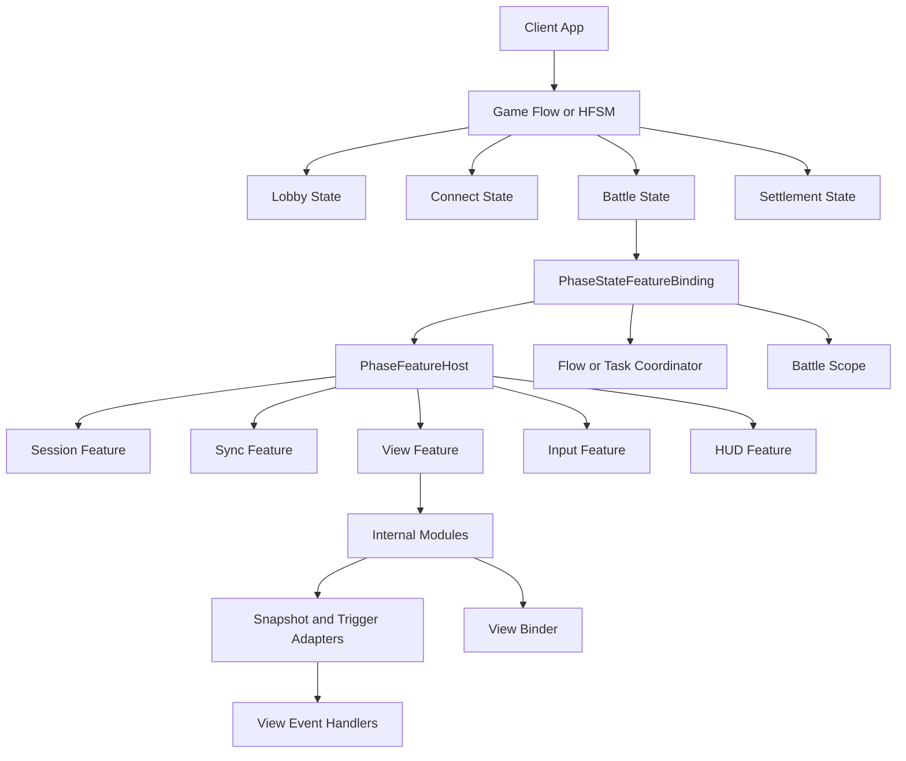
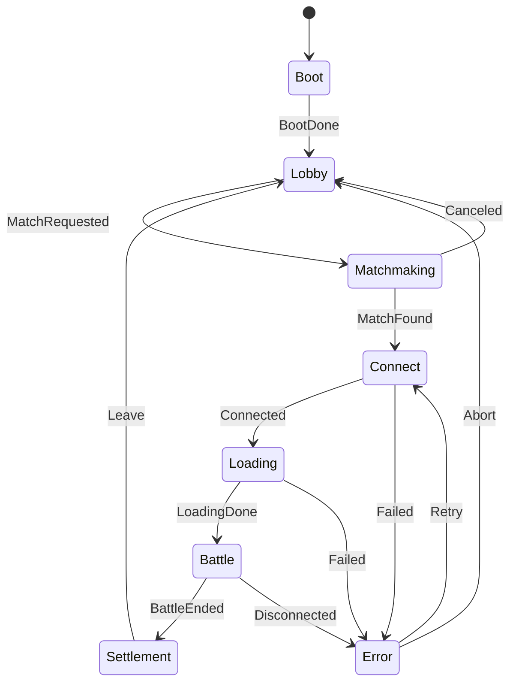
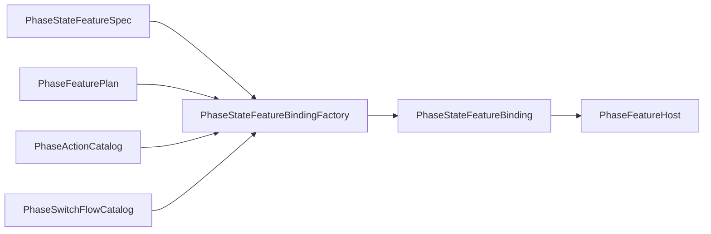
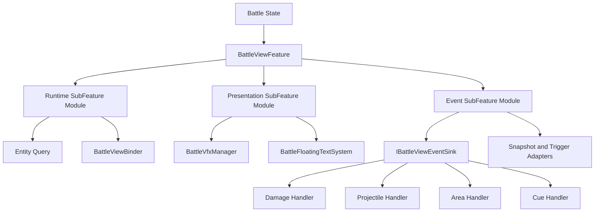
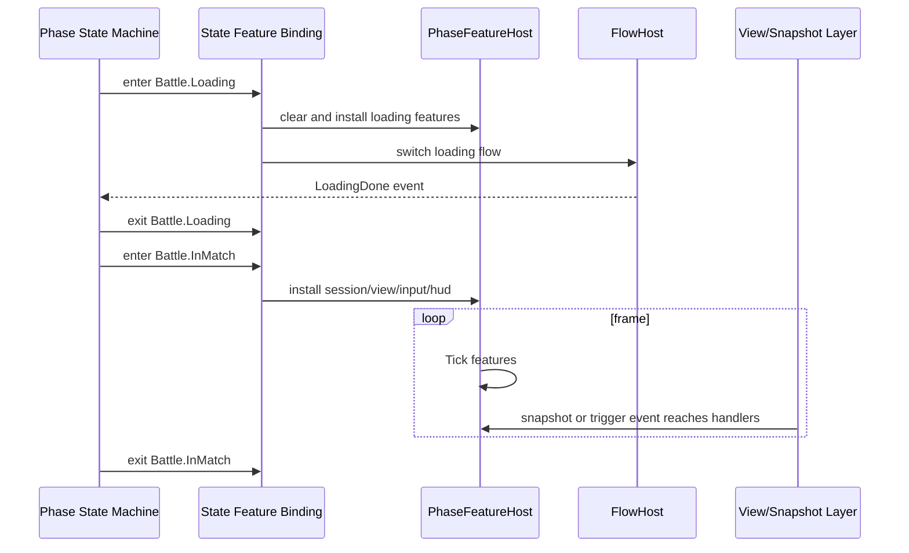

# 4.4 客户端游戏流程运行时架构

> 本文讨论从应用启动、大厅、进入战斗、战斗内阶段推进到退出战斗的客户端顶层运行骨架。它统一治理状态、能力装配、异步过程和作用域生命周期，但不接管项目内部的 MVC、MVVM、ECS、网络协议或视图实现。本文暂时保留在当前目录以维持文档编号和链接稳定；概念上，客户端游戏流程运行时与表现契约是并列能力，不属于表现层内部。

---

## 1. 定位与缺口

| 已有能力 | 已覆盖 | 不负责 |
| --- | --- | --- |
| [01-视图事件抽象](01-ViewEventAbstraction.md) | Trigger/Snapshot 如何进入表现副作用边界 | Lobby、Connect、Battle、Settlement 等宏观状态 |
| [02-快照分发](02-SnapshotDispatch.md) | OpCode 解码、订阅、有序 SnapshotPipeline | 状态期间应启用哪些会话、同步、输入或视图能力 |
| [03-跨平台实现](03-CrossPlatform.md) | Unity View Feature、Console、ET、Headless 的适配边界 | 整个客户端游戏段的生命周期 |
| [05-Flow 流程引擎](../05-CommonModules/05-FlowEngine.md) | 可组合流程树、等待、超时和 finally | 长期驻留状态与合法转移 |
| [06-HFSM 分层状态机](../05-CommonModules/06-HFSMStateMachine.md) | 分层状态、转移、exit time、图编辑 | 状态进入后如何装配和卸载项目能力 |

客户端游戏流程运行时把这些通用能力组合为一段完整生命周期。它回答四个顶层问题：客户端现在处于什么状态，状态期间启用哪些能力，连接与加载等异步过程如何结束或取消，以及一局战斗的对象与资源何时创建和释放。

它是整个客户端的顶层生命周期治理层，不是整个客户端项目框架。Session、Sync、Input、View、HUD 和 Diagnostics 都可以被它装配，但各能力内部仍由项目自行选择 ECS、MVC、MVVM、MonoBehaviour 或其他实现。

| 层级 | 应负责 | 不应由该层统一规定 |
|------|--------|--------------------|
| `game.view.runtime` 公共包 | Phase spec/validator、Feature binding/host、presentation primitives 等稳定生命周期机制 | MOBA 大厅、Shooter 连接步骤、项目 UI 与网络策略 |
| 客户端宿主 | 驱动状态机、绑定 feature、拥有 scope/CTS/run identity 和退出闭环 | 把异步回调直接写入已换代的战斗状态 |
| 项目应用层 | Root/Battle 状态目录、条件、Action/Flow、Session/Sync/Input/View 组合与失败恢复 | 要求其他游戏复用自己的阶段枚举和配置 |
| MOBA/Shooter 示例 | 提供高接入程度的完整组装参考 | 被解释为框架统一客户端应用运行时 |

---

## 2. 运行时职责

客户端游戏流程运行时由六类职责协作，不应收缩成一个万能 Manager：

| 职责 | 回答的问题 | 典型对象 | 生命周期 |
| --- | --- | --- | --- |
| Root / Battle HFSM | 当前处于什么状态，哪些转移合法 | `PhaseStateMachineSpec<TKey,TEvent>`、`MobaRootState`、`MobaBattleState` | 应用或玩法会话级 |
| State Feature Binding | 进入或退出状态时装卸哪些能力、执行哪些动作 | `PhaseStateFeatureSpec`、`PhaseStateFeatureBinding` | 状态级 |
| Feature Host | 状态驻留期间哪些能力参与 Attach、Detach、Tick | `IPhaseFeature<TContext>`、`PhaseFeatureHost` | 状态驻留期 |
| Flow / Task Coordinator | 连接、加载、等待、重试如何完成、失败或取消 | AbilityKit.Flow、项目侧异步协调器 | 单次异步运行 |
| Battle Scope | 一局战斗的服务和资源何时创建、隔离与释放 | `BattleWorldScopeHost`、`WorldScope` | 单局战斗级 |
| Feature Internal Modules | Feature 内部如何排序依赖、分解局部职责 | `ModuleHost`、SubFeature、Handler、Binder | Feature 内部 |

这张图的关键边界是：HFSM 只回答“现在在哪个状态、能否转移”；State Feature Binding 把状态生命周期转换为能力装配；Flow/Task 处理有终点的异步过程；Battle Scope 隔离每局对象；Feature 及其内部 Module 处理状态驻留期间的业务。表现投影与视图只是 InMatch 等状态可能启用的一类 Feature。

---

## 3. 顶层状态机：管理宏观状态

客户端顶层状态不应该散落在 MonoBehaviour bool、网络回调和 UI 按钮里，而应收敛为显式状态机。MOBA 当前已经出现这样的雏形：`MobaBattleAdvanceDecider` 把 Prepare、Connect、CreateOrJoinWorld、LoadAssets、InMatch、End 的推进决策抽成纯逻辑；`BattleWorldScopeHost` 把 per-battle scope 生命周期从流程域里拆出来。

推荐状态模型：

| 状态 | 进入动作 | 驻留功能 | 退出动作 |
| --- | --- | --- | --- |
| Boot | 初始化 SDK、配置、基础服务 | 启动画面、日志、版本检查 | 切到 Lobby 或 Login |
| Lobby | 加载大厅 UI、房间列表、账号信息 | UI、匹配、社交、资源预热 | 清理大厅临时订阅 |
| Matchmaking | 发起匹配或建房 | 网络请求、取消按钮、超时处理 | 停止匹配请求 |
| Connect | 连接 Gateway/Room/Battle | reconnect、握手、首帧等待 | 释放连接阶段临时对象 |
| Loading | 创建/加入 world，加载战斗资源 | loading UI、资源句柄、进度 | 交接资源给 Battle scope |
| Battle | 输入、表现、同步、HUD、诊断 | session、snapshot、view、input、prediction | 停输入、停表现、停同步、写回结算数据 |
| Settlement | 展示结果、上传统计、回大厅 | 结算 UI、replay 保存 | 释放 battle scope |
| Error/Recover | 错误展示、重试或回退 | retry、fallback、report | 根据策略回到 Connect/Lobby |

如果状态层级继续变大，外层可以用 HFSM：例如 App 层是 Boot/Login/Lobby/BattleShell，BattleShell 内部再有 Connect/Loading/InMatch/Settlement。这样全局转移和战斗内转移不会互相污染。

---

## 4. 状态内 feature 绑定

`Game.View.Flow` 中的 `PhaseStateFeatureSpec` 和 `PhaseStateFeatureBindingFactory` 已经提供了状态到 feature 的声明式绑定能力：

| 能力 | 含义 | 适用场景 |
| --- | --- | --- |
| `AddFeature` | 状态进入时按 id 安装 feature | Battle 状态安装 session/view/input/hud |
| `ClearBeforeEnter` | 进入前清空旧 feature host | 从 Loading 切 Battle 时替换功能集合 |
| `AddEnterBeforeAction` | feature 安装前执行动作 | begin scope、播种 bootstrapper、记录埋点 |
| `AddEnterAfterAction` | feature 安装后执行动作 | 首帧补判、打开 UI、启动诊断 |
| `AddExitAction` | 状态退出时执行动作 | end scope、停止网络订阅、写回结算 |
| `AddSwitchFlow` | 状态进入后触发另一个长流程 | connect 完成后启动 loading flow |

推荐把状态声明写成“状态 spec + feature plan + action catalog”三件事：

这样状态配置可以被验证、测试和导出。`PhaseStateMachineValidator` 负责检查状态、起点和转移引用；`PhaseStateFeatureValidator` 可以继续检查 feature/action/switch flow id 是否存在。相比把所有逻辑写在 `OnEnterBattle()`，这种模型更容易做自动化测试和可视化。

---

## 5. Feature 与内部模块的拆分规则

Feature 是顶层流程可装配的能力边界；SubFeature、Module、Handler 和 Binder 都是 Feature 内部组织方式，不与顶层状态机处于同一层。状态内不建议只有一个巨型 Feature，建议按以下边界拆分：

| 单元 | 应该包含 | 不应该包含 |
| --- | --- | --- |
| Module | 一组 feature 的装配规则或默认组合 | 具体业务事件处理细节 |
| Feature | 状态内可独立 attach/detach/tick 的能力，如 BattleSession、BattleView、BattleInput、BattleHud | 过多平台对象创建细节、每种事件的具体表现逻辑 |
| SubFeature | 某个 feature 内的子能力，如 View runtime、Presentation、Event adapter、Interpolation | 顶层状态转移和跨 feature 协调 |
| Handler | 处理单类输入到单类副作用，如 Damage、Projectile、Area、Cue | 生命周期装配、状态跳转、跨模块 orchestration |

MOBA View Runtime 的 `BattleViewFeature` 是当前最接近的例子：feature 挂到 battle phase；内部通过 view subfeature module 创建 runtime、presentation、event adapter；事件进入 `IBattleViewEventSink` 后再分给 `BattleDamageViewEventHandler`、`BattleProjectileViewEventHandler`、`BattleAreaViewEventHandler` 和 cue handler。

拆分判断标准：如果一个类同时决定状态跳转、创建资源、订阅快照、处理伤害表现、更新 UI，它就跨越了至少三层，应该拆成 state action、feature/subfeature 和 handler。

---

## 6. HFSM、Binding、Flow 与 Scope 的分工

这三类能力容易混用，需要明确边界：

| 能力 | 最适合 | 不适合 |
| --- | --- | --- |
| HFSM / Phase State Machine | 长期驻留状态、合法转移、全局打断、状态层级 | 顺序等待很多异步步骤的细节 |
| Phase Feature Binding | 状态进入/退出时安装功能、执行动作、切换附属 Flow | 复杂条件转移和每帧行为逻辑 |
| Feature Host | 调用 Attach、Detach、Tick，保持能力集合顺序 | 判断是否从 Battle 切到 End |
| Flow / Task Coordinator | 有开始和结束的连接、加载、等待、重试、超时和清理 | 表达整个客户端长期状态 |
| Battle Scope | 隔离一局战斗的服务、资源和释放顺序 | 决定状态转移或承载跨局服务 |
| ViewEvent / Snapshot | 把逻辑输出转成表现输入 | 管理游戏状态和 Battle Scope |

推荐组合方式是：

这个组合让状态机保持干净：它接收事件并转移；Binding 负责状态边界装配；Flow/Task 处理短生命周期异步过程；Feature Host 管状态内功能；Battle Scope 管一局对象；Snapshot/ViewEvent 只管表现数据输入。

---

## 7. 与 ET、GameFramework 风格的对比

AbilityKit 不需要完整复制 ET 或 GameFramework，但可以吸收它们对流程治理的经验。

| 维度 | ET 常见做法 | GameFramework 常见做法 | AbilityKit 推荐 |
| --- | --- | --- | --- |
| 顶层流程 | Scene/Component/System 和事件驱动，流程常散在组件系统中 | Procedure/Fsm 明确表达启动、登录、大厅、战斗等状态 | 用 Phase/HFSM 显式表达客户端宏观状态 |
| 状态职责 | Component 保存状态，System 响应事件推进 | Procedure.OnEnter/OnUpdate/OnLeave 承载状态逻辑 | 状态只做 feature binding 和 action 调度，重逻辑下沉 feature/flow |
| 功能装配 | 依赖 Entity/Component 生命周期和 EventSystem | 依赖 GameEntry 组件、Procedure 内启停模块 | 用 `PhaseFeatureHost` 管 attach/detach/tick，用 DI scope 管 per-battle 生命周期 |
| 异步流程 | 协程/Task/事件组合，项目约定较多 | Procedure 内部调用资源/网络模块并等待回调 | 长流程用 Flow 节点，支持等待、超时、finally 和诊断 |
| 表现适配 | ETUnit、缓存组件、事件系统桥接 | Unity GameObject/UI 模块强绑定 | ViewEvent/Snapshot 作为平台边界，Unity/Console/ET 各自适配 |
| 可测试性 | 取决于是否把决策抽成纯逻辑 | Procedure 往往依赖 Unity 运行环境 | 推进决策、状态 spec、feature binding 都可纯 C# 测试 |

ET 的价值在于“业务对象和事件系统统一”，GameFramework 的价值在于“Procedure/Fsm 管游戏流程很直观”。AbilityKit 应采用后者的显式流程表达，同时保留自身的纯 C# 测试、跨平台快照边界和 feature 组合能力。

---

## 8. 工程契约与当前完善项

1. 客户端必须有显式顶层状态机。禁止把 Lobby、Connect、Battle、Settlement 只保存在多个 bool 或 UI 页面显隐里。
2. 状态事件来自网络、资源、用户操作或错误恢复时，应先进入 decider 或 condition catalog，再触发状态机。
3. 状态进入只做装配和动作调度。长期业务进入 Feature，局部职责进入 Module/Handler，有终点的异步过程进入 Flow/Task。
4. 每个长期状态应有可验证的 `PhaseStateFeatureSpec`；Feature ID、Action ID、Flow ID、重复注册和未知引用应在启动前失败。
5. Feature Host 的 Attach 必须具备异常回滚：中途失败时只逆序 Detach 已成功项，且不得发布半初始化 Feature。
6. Feature Host 和 Module Host 的 Detach 必须尽力清理：单项失败不能阻断剩余项，最终应复位宿主状态并聚合或记录异常。
7. Battle 必须拥有独立 Scope。正常结算、失败、取消、手动返回和应用销毁都必须走同一个幂等释放闭环，而不只依赖重入时覆盖旧 Scope。
8. Session 回调和异步协调器必须绑定运行代次。CancellationToken 只发出取消请求；迟到完成还要用 ScopeGeneration、RunId 或 current-run identity 拒绝写回新一局状态。
9. 异步连接、加载、等待和房间操作应由拥有 CTS 与 RunId 的协调器管理，避免共享回调、Lease 或 CTS 被旧任务覆盖。
10. Feature 按 session、sync、input、view、hud、diagnostics 拆分；ModuleHost 只管理 Feature 内部依赖，不参与顶层状态转移。
11. Snapshot/Trigger 事件处理不能直接接管顶层状态推进；表现结果需要推进流程时，应转换为明确事件并经过 decider。
12. 新增状态、Feature 或异步协调器时，应补生命周期故障注入测试，覆盖 Attach 失败、Detach 失败、取消后迟到完成、Battle End 和快速重入。
13. ET、Console、Headless 接入可以替换 Feature 或 View Boundary 实现，但不应改变顶层状态语义与作用域契约。

当前源码已经为 `PhaseFeatureHost` 与 `ModuleHost` 补齐 Attach 失败逆序回滚、回滚失败聚合、Detach 尽力清理和失败后状态复位测试；`BattleWorldScopeHostTests` 也覆盖正常 End、重入替换、Dispose 与 scope generation。房间控制器和 Formal Lobby command coordinator 已有取消/迟到完成的局部契约。

剩余重点不再是“Host 完全没有异常安全”，而是跨层闭环：真实 Battle End 是否在所有入口释放 scope，资源/网络任务是否统一绑定 run identity，旧 session push 是否会穿透新一局，以及 Unity 场景销毁、网络恢复和快速重入能否留下可诊断 artifact。这些仍不需要新增万能 Manager，而需要沿现有 ownership 边界补集成和故障测试。

---

## 9. 源码阅读路径

| 主题 | 源码/文档 |
| --- | --- |
| Phase 契约 | `Unity/Packages/com.abilitykit.game.view.runtime/Runtime/Flow/PhaseContracts.cs` |
| 状态机 spec 与校验 | `Unity/Packages/com.abilitykit.game.view.runtime/Runtime/Flow/PhaseStateMachineSpec.cs`、`PhaseStateMachineValidator.cs` |
| 状态 feature 声明 | `Unity/Packages/com.abilitykit.game.view.runtime/Runtime/Flow/PhaseStateFeatureSpec.cs` |
| 状态 feature 绑定 | `Unity/Packages/com.abilitykit.game.view.runtime/Runtime/Flow/PhaseStateFeatureBinding.cs`、`PhaseStateFeatureBindingFactory.cs` |
| feature host | `Unity/Packages/com.abilitykit.game.view.runtime/Runtime/Flow/PhaseFeatureHost.cs` |
| per-battle scope | `Unity/Packages/com.abilitykit.demo.moba.view.runtime/Runtime/Game/App/Flow/Core/BattleWorldScopeHost.cs` |
| battle 推进决策 | `Unity/Packages/com.abilitykit.demo.moba.view.runtime/Runtime/Game/App/Flow/Core/MobaBattleAdvanceDecider.cs` |
| MOBA 联机会话 | `Docs/design/09-ImplementationExamples/MOBA/15-OnlineSessionAndProtocolContract.md` |
| MOBA 快照表现 | `Docs/design/09-ImplementationExamples/MOBA/04-SnapshotPresentationPrediction.md` |
| Shooter 表现会话 | `Docs/design/09-ImplementationExamples/Shooter/10-PresentationSessionAndViewDeepDive.md` |
| ET 宿主 | `Docs/design/09-ImplementationExamples/02-ET Demo Analysis.md` |

---

## 10. 与其他文档的关系

- 本文是客户端顶层游戏流程运行时总览；[客户端表现层框架契约设计](../../客户端表现层框架契约设计.md) 是并列的表现数据与视图消费契约。
- [01-视图事件抽象](01-ViewEventAbstraction.md)、[02-快照分发](02-SnapshotDispatch.md) 和 [03-跨平台实现](03-CrossPlatform.md) 只解释 View Feature 内部或下游边界，不负责顶层流程。
- 本文组合 Flow/HFSM；[05-Flow 流程引擎](../05-CommonModules/05-FlowEngine.md) 和 [06-HFSM 分层状态机](../05-CommonModules/06-HFSMStateMachine.md) 说明底层通用机制。
- [客户端流程编排框架演进设计](../../客户端流程编排框架演进设计.md) 记录目标边界与包演进；[客户端流程编排阶段性复盘](../../客户端流程编排阶段性复盘.md) 记录实现审计和修正优先级。
- MOBA/Shooter 示例文档应引用本文作为客户端流程治理原则，再说明各自的 Feature、Session、Sync 和 View Pipeline。

---

## 11. 验证证据与已知限制

| 证据 | 等级与结论 |
|------|------------|
| `AbilityKit.Game.View.Runtime.Tests` | E3：覆盖 Phase spec/validator、Feature registry/binding/host、ModuleHost、scope、loading、decider、presentation facade/sink 等纯逻辑契约 |
| `PhaseFeatureHostTests` / `ModuleHostTests` | E3：直接覆盖 attach rollback、聚合异常、detach 尽力清理、重试和稳定顺序 |
| `BattleWorldScopeHostTests` | E3：直接覆盖单局 scope、generation、正常 End、重复 End、重入和 Dispose |
| MOBA View Runtime 与 Formal Lobby tests | E2 + 局部 E3：证明项目层阶段/房间/命令协调接入，但不把 MOBA 枚举提升为公共契约 |
| Unity/多人 smoke | 分散 E4/E5：必须按具体 gate 和 artifact 日期声明，不能由测试工程存在概括为整个客户端流程已验收 |

当前主要缺口是状态机、网络、资源、Scene 和 battle scope 跨边界的真实故障矩阵，以及长期运行中的订阅/任务/资源泄漏预算。公共包提供机制和测试支点，项目仍必须定义自己的状态图、恢复策略和最终验收。

## 4.4.15 静态会话宿主的替换与失败边界

Shooter 当前提供两类有代表性的宿主。`ShooterPresentationSessionHost.Start` 先 `Stop` 旧 session，再构造并发布新 session；`Stop` 在 `finally` 中清空 `Current` 并发布 `SessionChanged(null)`。`ShooterPlayModeSessionHost` 则在 `SubsystemRegistration` 时调用 `Uninstall`，并显式拆除 runner、网络 profile hook、PlayerLoop 节点和 host registry。

这些实现展示了项目应用层应如何承接 Unity 生命周期，但不是公共 Flow 自动提供的保证：

| 场景 | 当前结果 | 设计要求 |
|------|----------|----------|
| 替换已运行 presentation session | 旧 session 先被 Dispose，再创建新 session | 调用方必须接受“替换失败后旧会话已不存在” |
| 新 session 构造或 Connect 抛错 | 没有事务恢复旧 session；`Current` 保持空 | 启动失败应由项目阶段机记录并进入可重试/退出状态 |
| 静态事件订阅 | SessionHost 不自动识别外部订阅 owner | domain reload、测试 teardown 与应用退出必须显式解绑或统一 reset |
| PlayMode domain/subsystem reset | `ResetStatics -> Uninstall` 清静态宿主资源 | 自定义静态宿主应提供同等 reset 入口 |
| 多线程 Start/Stop/Tick | 静态字段没有锁 | 由主线程/唯一调度器串行化 |

阶段宿主的核心不变量是“同一资源只有一个最终 owner，阶段替换要么完成新图，要么进入明确空/失败态”。是否保留旧会话、是否重试 Connect、是否加载 Scene 和资源，都是项目状态机策略；公共框架适合提供 attach/detach、rollback hook 与 scope 原语，不适合规定所有游戏相同的 Lobby/Battle 状态图。

文档类型：Canonical 设计 | 事实基线：2026-08-16 | 证据等级：E0 公共/项目实现、E2 MOBA/Shooter 消费、较完整 E3 生命周期契约；E4/E5 按场景分散

*文档版本：v3.2 | 最后更新：2026-08-16*
