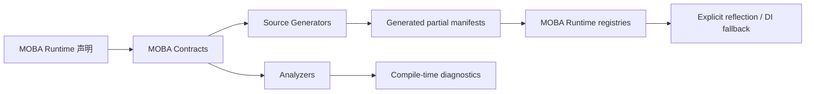
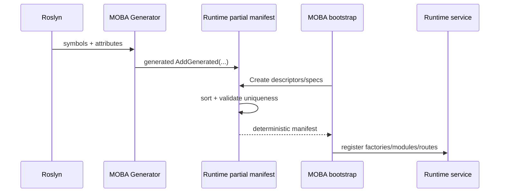
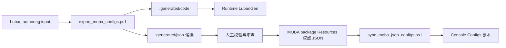

# 5.7 MOBA CodeGen 与 Luban 生产链：项目清单、候选数据和发布边界

> 本文说明当前仓库真实存在的编译期与导表链路。MOBA CodeGen 是示例项目的应用层编译资产，Luban 脚本是项目内容生产工具；二者都不构成 AbilityKit 框架默认的战斗应用套件。

---

## 1. 能力定位

这条生产链解决两类问题：

1. 将 MOBA 项目中可静态发现的配置表、动作、事件、查询、发射器和路由编译为确定性 manifest，减少手写目录与运行时扫描。
2. 将 Luban authoring 数据导出为候选 JSON 和 C#，经审查后把权威 JSON 发布到 Console 等消费副本。

当前仓库不存在 `Unity/Packages/com.abilitykit.codegen`，也不存在 `src/AbilityKit.CodeGen.Tests`。因此不能继续把旧通用 Source Generator、运行时 GeneratorRegistry 或对应测试工程描述为现行框架能力。

| 层级 | 应负责 | 不应由该层统一规定 |
|------|--------|--------------------|
| 通用框架包 | 提供稳定的运行时扩展契约及必要 fallback | 预设每个游戏的类型目录、命名规则和生成清单 |
| MOBA CodeGen 包 | 根据 MOBA Contracts 生成项目 manifest，并由 Analyzer 诊断无效声明 | 作为所有 AbilityKit 游戏必须引用的生成器 |
| MOBA Runtime | 消费生成 manifest，保留明确的外部/legacy fallback | 让生成器决定业务数据和失败补偿语义 |
| Luban/发布工具 | 生成候选数据、维护权威源与副本一致性、提供人工或门禁入口 | 自动把未审查候选直接晋升为生产数据 |
| 项目团队 | 拥有 schema、ID、内容审查、版本、回滚和 gate 修复 | 把“生成成功”当作业务配置正确 |

这一边界适合战斗工具集：编译期技术可以复用，但清单内容天然依赖游戏。其他项目应复用模式和契约思想，按需建立自己的生成包，而不是继承 MOBA 的应用目录。

---

## 2. 当前源码与工具入口

### 2.1 MOBA 编译期组件

| 入口 | 作用 |
|------|------|
| [CodeGen README](../../../Unity/Packages/com.abilitykit.demo.moba.codegen/README.md) | 包级能力、诊断编号、构建与 gate 入口 |
| [CodeGen 工程](../../../Unity/Packages/com.abilitykit.demo.moba.codegen/DotNet~/AbilityKit.Demo.Moba.CodeGen/AbilityKit.Demo.Moba.CodeGen.csproj) | Roslyn Generator/Analyzer 构建工程 |
| [Generators](../../../Unity/Packages/com.abilitykit.demo.moba.codegen/DotNet~/AbilityKit.Demo.Moba.CodeGen/Generators) | 十组 MOBA manifest/字段生成器 |
| [Analyzers](../../../Unity/Packages/com.abilitykit.demo.moba.codegen/DotNet~/AbilityKit.Demo.Moba.CodeGen/Analyzers) | 对应编译期诊断 |
| [Contracts](../../../Unity/Packages/com.abilitykit.demo.moba.codegen/DotNet~/AbilityKit.Demo.Moba.CodeGen/Contracts) | Generator 与 Analyzer 共享的项目契约 |
| [生成配置表 manifest 壳](../../../Unity/Packages/com.abilitykit.demo.moba.runtime/Runtime/Infrastructure/Config/Core/MobaGeneratedConfigTableManifest.cs) | 消费生成 specs，并控制反射 fallback |
| [MOBA 配置 registry](../../../Unity/Packages/com.abilitykit.demo.moba.runtime/Runtime/Infrastructure/Config/BattleDemo/MobaConfigRegistry.cs) | 从生成 manifest 创建运行时表目录 |

包根 DLL 通过 Unity importer 标记为 `RoslynAnalyzer`，所以 Unity 编译消费的是已构建 DLL，而不是直接执行包内 csproj。工程可构建、DLL 存在、DLL 与当前源码一致是三项不同证据。包 README 当前仍称框架级 `com.abilitykit.codegen` generator 存在，与仓库实际文件树矛盾；生产判断应以 csproj、package import 设置和真实构建结果为准，README 需要随 gate 一起修正。

当前生成域包括：

- 配置表。
- PlanAction 模块。
- Payload 字段 ID。
- 事件映射。
- 目标查询工厂。
- 投射物发射器。
- Bootstrap stage。
- 行为树节点。
- 快照发射器。
- 战斗路由。

### 2.2 Luban 与发布

| 入口 | 作用 |
|------|------|
| [export_moba_configs.ps1](../../../LubanConfig/Moba/export_moba_configs.ps1) | 调用 Luban 生成候选 JSON 与 staged C#，再复制 C# 到 Runtime `LubanGen` |
| [sync_moba_json_configs.ps1](../../../tools/sync_moba_json_configs.ps1) | 以 package Resources 为唯一权威源，检查或发布 Console JSON 副本 |
| [test-gates.json](../../../tools/test-gates.json) | 声明 `moba-codegen` 与 `moba-content-contracts` 等门禁 |
| [CI workflow](../../../.github/workflows/abilitykit-test-gates.yml) | PR/push 上调用 `moba-codegen` gate |
| [ownership validator](../../../tools/validate_moba_codegen_ownership.ps1) | 检查框架与 MOBA 编译期所有权，但当前仍含失效路径 |

---

## 3. 生成资产所有权

生成器和分析器使用同一组 Contracts，但职责不同：

- Generator 只为有效声明生成确定性源码，不应自行发出另一套业务诊断。
- Analyzer 报告无效形态、重复键、不可访问类型和不满足构造契约等问题。
- Runtime partial 壳定义消费 API、排序、唯一性检查和 fallback；生成代码只填充清单。
- 外部程序集或 legacy 注册项是否允许反射/DI fallback，由具体运行时显式决定。

配置表 manifest 的默认路径包含强类型 `DtoTableFactory`、`EntryTableFactory` 和 `ChangedIdCollector`。只有生成 specs 为空时，`MobaGeneratedConfigTableManifest` 才反射读取程序集特性；AppContext switch `AbilityKit.Moba.DisableConfigTableReflectionFallback` 可以禁止该兼容路径。

生成代码是派生产物，不是独立权威源。其权威输入是项目声明、共享 Contracts、生成器版本和编译配置；DLL 也应由对应 csproj 重建，不能仅凭文件存在就宣称与源码一致。

---

## 4. 运行时装配边界

编译期清单降低的是发现和装配成本，不替代运行时职责：

- 配置 DTO 到 MO 的字段转换仍由 `MO(DTO)` 或显式 factory 负责。
- PlanAction 参数解析与业务校验仍由模块和 Schema 负责。
- 事件、查询、发射器和路由的运行期副作用及失败策略仍属于消费者。
- 生成清单为空时是否失败、回退或允许外部扩展，必须在各 manifest 壳中明确。

因此“有 generator”不能外推为“业务模块自动正确注册”，更不能外推为“所有游戏已经有统一应用层”。

---

## 5. Luban 候选与发布模型

JSON 与 C# 当前是非对称链路：

- JSON 留在 `.generated/json` 作为候选，不会被导出脚本直接晋升。
- 审查后的生产 JSON 由 `com.abilitykit.demo.moba.view.runtime/Resources` 持有唯一权威副本。
- 同步脚本默认是 Check；只有显式 `-Apply` 才写 Console 副本，`-DryRun` 用于预览。
- staged C# 会由导出脚本直接复制到 MOBA Runtime 的 `LubanGen`。

非对称设计保护了内容审查，但也意味着 C# 生成物和 JSON 权威数据可能来自不同一次导出。生产评审应同时记录 authoring input、Luban 版本、生成批次和两类产物 hash。

---

## 6. 失败传播与已知限制

| 环节 | 当前事实 | 工程含义 |
|------|----------|----------|
| Luban 原生调用 | 脚本设置 `$ErrorActionPreference = "Stop"`，但两次 `dotnet` 后未显式检查 `$LASTEXITCODE` | PowerShell 的 Stop 策略不会自动把所有原生非零退出码变成异常；前一次失败后仍可能继续生成/复制，需补逐步退出码阻断 |
| staging | 只确保目录存在，导出前不预清理 | 已删除或改名输出可能残留并被复制 |
| JSON 晋升 | 候选不自动写权威目录 | 需要人工审查或独立晋升步骤，这是设计保护也是操作责任 |
| C# 发布 | staged code 直接递归覆盖 `LubanGen` | 没有 manifest、完整性校验或原子替换 |
| 副本同步 | Check/DryRun/Apply 权限清晰，支持语义化 JSON 比较 | 只能证明目录副本一致，不能证明业务引用正确 |
| 运行时 fallback | 部分 manifest 保留 reflection/DI 兼容路径 | 可能掩盖 Analyzer DLL 未生效或生成清单为空 |
| `moba-codegen` gate | CI workflow 已配置在 PR/push 运行 | gate catalog 仍引用两个不存在目标，当前会在进入完整验证前失败，不能声明为有效 E5 阻断 |
| `moba-content-contracts` | gate 已定义 | PR/push/schedule 均为 false，属于手动 gate |

`moba-codegen` 当前失效引用为：

- `Unity/Packages/com.abilitykit.codegen/DotNet~/AbilityKit.SourceGenerator/AbilityKit.SourceGenerator.csproj`
- `src/AbilityKit.CodeGen.Tests/AbilityKit.CodeGen.Tests.csproj`

`validate_moba_codegen_ownership.ps1` 也枚举了不存在的通用 CodeGen 源码根。在 `$ErrorActionPreference = 'Stop'` 下，`Get-ChildItem` 会先因缺失 `Unity/Packages/com.abilitykit.codegen` 中止，脚本来不及输出其余 ownership contract 结果。因此“validator 失败”目前主要证明入口陈旧，不能证明 MOBA 十组 Generator/Analyzer 的所有权规则被完整执行。它们是待修 gate 配置，不是当前包缺失某个构建错误的历史基线；文档不保留旧 `SyntaxReceiver` 冲突或固定错误数字。

---

## 7. 验证矩阵

| 证据 | 当前等级 | 可声明范围 |
|------|----------|------------|
| MOBA CodeGen、Contracts、Analyzer 源码 | E0 | 当前生成域、共享契约和诊断设计可审计 |
| Runtime manifest/registry 消费 | E2 | 生成清单是 MOBA 默认运行路径，部分域保留 fallback |
| 生成器工程及 DLL | E1 候选 | 存在可构建工程和包根 RoslynAnalyzer DLL；只有直接构建能证明源码可编译，仍需 hash/版本记录证明 DLL 对应当前源码 |
| MOBA 配置/清单相关测试 | 局部 E3 | 可覆盖具体运行时清单契约，不能替代完整 Generator/Analyzer compilation tests |
| `moba-codegen` | E5 入口存在但不可闭环 | workflow 会触发，但 gate 引用缺失项目，ownership validator 也会在缺失目录处提前中止；不能计为有效 E5 |
| `moba-content-contracts` | 手动 E5 入口 | 未配置自动触发，不是持续 CI 保护 |

生产声明应限定为：“MOBA 已建立项目专用生成清单与候选/权威/副本数据模型；现有运行时有真实消费，但编译期 gate 和 Luban 失败传播仍需收敛。”

---

## 8. 推荐收敛顺序

1. 从 `moba-codegen` gate 和 ownership validator 移除或替换不存在的通用 CodeGen 目标。
2. 为十组 Generator/Analyzer 增加 compilation contract tests，验证生成源码、诊断、排序、重复项和空清单策略。
3. 验证包根 Analyzer DLL 确由当前 csproj 重建，并记录可比较版本/hash。
4. 在 `export_moba_configs.ps1` 每次 `dotnet` 后检查退出码，导出前清理 staging，并生成输出 manifest。
5. 保持 JSON 候选审查模式，为 candidate 到 package authority 建立显式晋升记录。
6. 根据内容变更频率决定是否将 `moba-content-contracts` 加入 PR/push；在此之前继续称其为手动 gate。
7. 新游戏按自己的应用目录建立生成清单，不把 MOBA Contracts 下沉为框架公共契约。

---

## 9. 关联文档

- [配置系统](04-ConfigurationSystem.md)：通用数据库、MOBA 强类型 factory 与热重载提交语义。
- [ActionTimeline 数据与播放](08-ActionTimelineDataAndPlayback.md)：另一条编辑器数据协议，不属于 Luban 表目录。
- [Excel 与 ScriptableObject 同步](09-ExcelScriptableObjectSync.md)：Editor authoring 工具，不是运行时发布链。
- [Triggering 系统](../08-GameplayModules/02-TriggeringSystem.md)：PlanAction 与 Schema 的运行时执行边界。
- [工程测试流程](../10-EngineeringQuality/01-TestingWorkflow.md)：gate、artifact 与证据等级的通用要求。

---

文档类型：Canonical 设计与生产链审计 | 事实基线：2026-08-17 | 证据等级：E0 编译期/脚本源码、E2 MOBA Runtime 消费、局部 E3；E5 入口存在但当前不可完整执行

*文档版本：v3.1 | 最后更新：2026-08-17*
