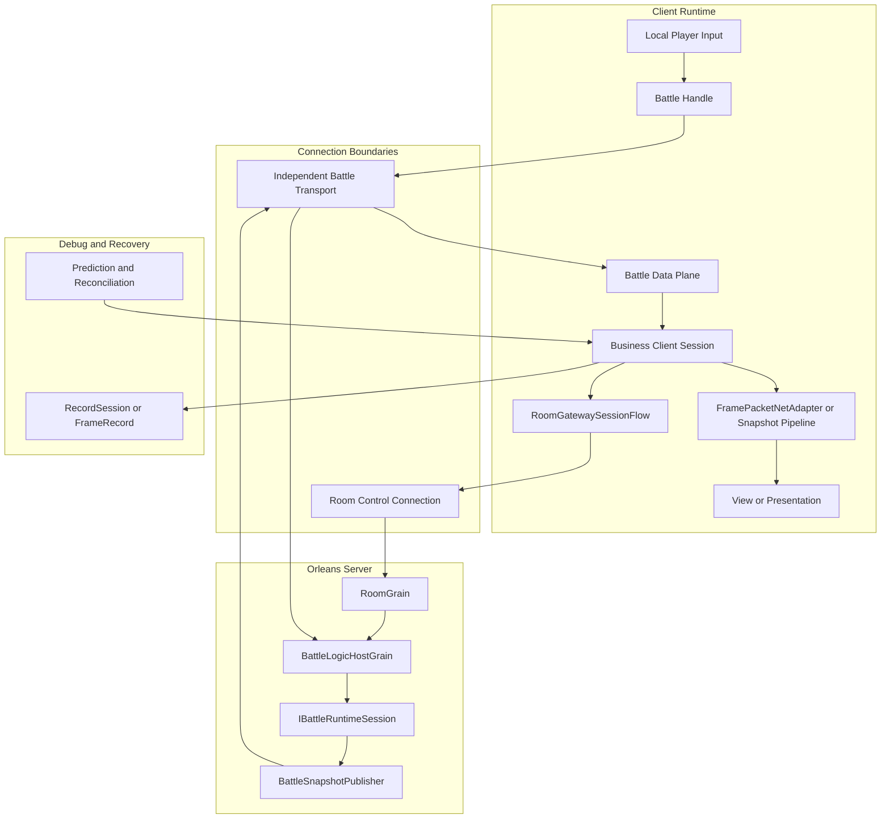
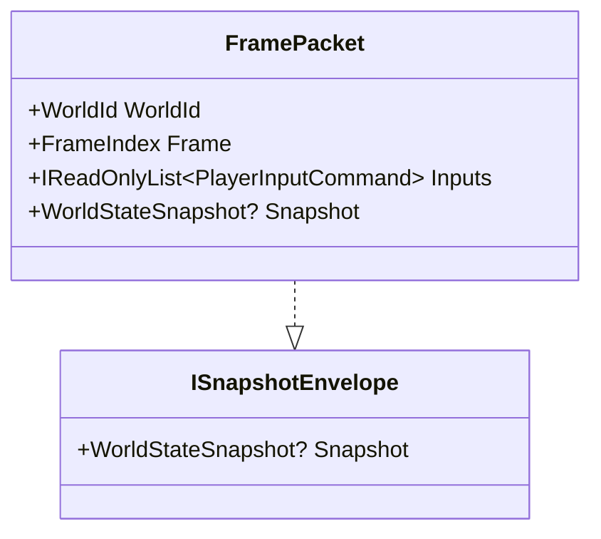
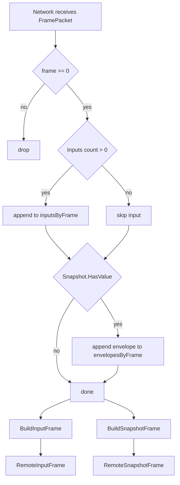
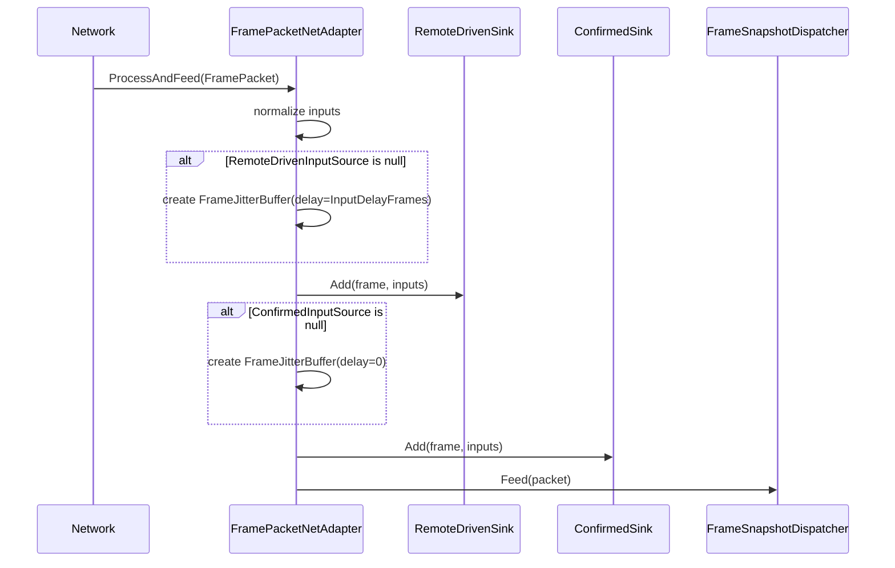
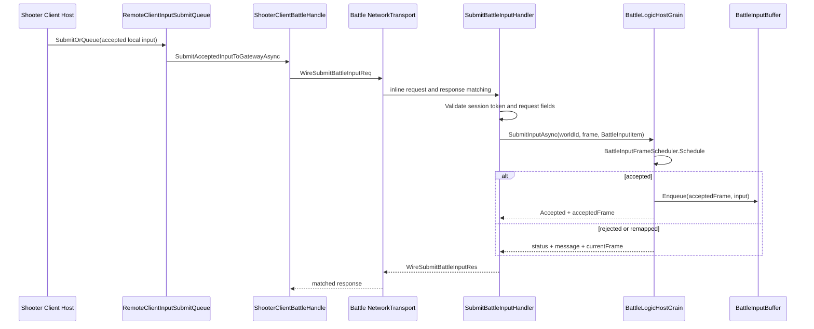
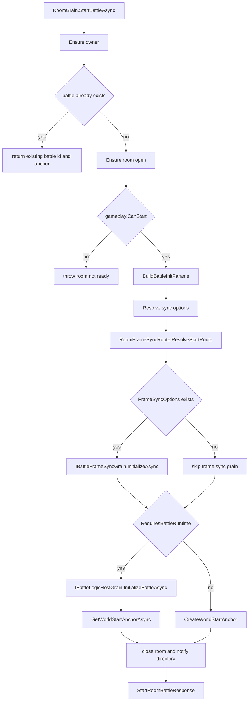
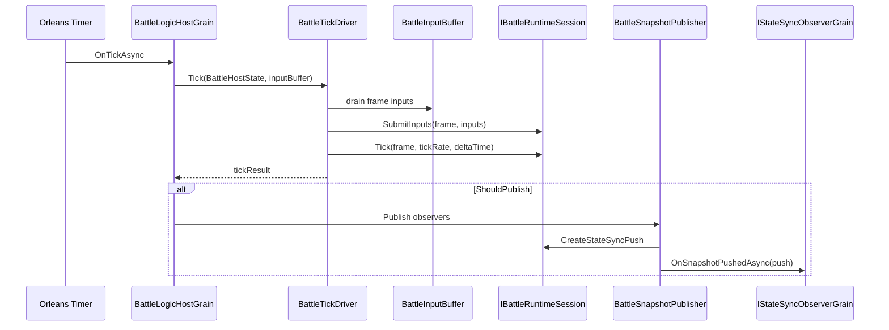

# 网络同步能力地图

> **文档类型：能力地图**
>
> **事实基线：2026-08-16**
>
> **适用范围：** 同步 Profile、帧/状态同步、预测回滚、会话协调、可靠事件与回放能力的选型入口。

> 本文从源码角度梳理 AbilityKit 的网络同步能力边界。它不是单一“帧同步类”或“状态同步类”，而是由输入帧、快照信封、阶段化 Room 控制面、业务数据面、Room/Battle 服务端 Grain、回放记录和 Demo 接入层共同组成。源码入口以 `Unity/Packages` 为准，`src` 中还包含 Console Demo 的实验性同步实现，不能反推为通用 Package 能力。

---

## 目录

1. [能力定位](#1-能力定位)
2. [同步能力分层](#2-同步能力分层)
3. [源码入口](#3-源码入口)
4. [核心对象关系](#4-核心对象关系)
5. [端到端同步链路](#5-端到端同步链路)
6. [能力选型](#6-能力选型)
7. [设计意图](#7-设计意图)
8. [风险与检查点](#8-风险与检查点)
9. [源码阅读路径](#9-源码阅读路径)

---

## 1. 能力定位

AbilityKit 网络同步层解决的是“多人战斗怎么从本地输入变成可验证、可恢复、可回放的远端会话”的问题。源码中可以拆成七类能力：

| 能力 | 解决的问题 | 关键源码 |
|------|------------|----------|
| 帧值对象 | 用稳定帧号描述输入、快照、回滚点 | `Unity/Packages/com.abilitykit.world.framesync/Runtime` |
| 网络帧信封 | 用一个对象同时承载输入和可选快照 | `Unity/Packages/com.abilitykit.world.networkfragments/Runtime/Frames/FramePacket.cs` |
| 远端帧聚合 | 接收端按帧聚合输入和快照，抵抗乱序/批量到达 | `Unity/Packages/com.abilitykit.world.networkfragments/Runtime/Frames/RemoteFrameAggregator.cs` |
| 会话与控制面 | 按阶段执行登录、create/join/restore、ready/loading/start、subscribe | `Unity/Packages/com.abilitykit.network.room/Runtime/RoomGatewaySessionFlow.cs` |
| 网络适配 | 把 `FramePacket` 写入 remote-driven/confirmed 双输入源并路由快照 | `Unity/Packages/com.abilitykit.host.extension/Runtime/Session/FramePacketNetAdapter.cs` |
| 服务端承载 | Room 管理成员和开战，Battle Host 管理权威 Tick、输入缓冲和快照推送 | `Server/Orleans/src/AbilityKit.Orleans.Grains` |
| 记录回放 | 记录输入、状态 hash、快照，用于复盘、调试、回归 | `Unity/Packages/com.abilitykit.record/Runtime/Record` |

这组能力的边界很清晰：

- `FramePacket` 和 `RemoteFrameAggregator` 只关心帧数据，不关心 TCP、HTTP、Orleans 或 Unity。
- `com.abilitykit.coordinator` 当前只保留配置、契约和值对象；仓库中没有 `SessionCoordinator`、Local/Remote/Hybrid adapter 或远端 transport 端口实现，不能将历史设计当作当前 API。
- `RoomGatewaySessionFlow` 位于 `com.abilitykit.network.room`，只编排 Room 控制面阶段，不拥有业务战斗数据面。
- Shooter 当前采用双连接：Room Gateway 连接负责控制面和恢复 RPC，独立 `NetworkTransport` 负责 battle 输入请求与 push。
- Console Demo 的 `SyncAdapterFactory` 和 `HybridSyncAdapter` 属于该 Demo 的实验实现，不是 coordinator Package 的通用 adapter。
- `RoomGrain` 管成员、准备、晚加入、恢复和开战入口；`BattleLogicHostGrain` 管权威战斗推进。
- `Record` 不绑定某个 Demo。Console/MOBA 可以有自己的文件格式，但通用记录系统仍然按 frame/track/event 组织。
- 服务端最终解析出的 template、runtime mode 和 `SyncCapabilities` 才是联网会话事实源；客户端本地默认值、模板名字或 HTTP catalog 展示名都不能替代 Room snapshot 中的权威声明。

### 1.1 三层事实边界

| 层级 | 本文如何描述 | 不应外推的结论 |
|------|--------------|----------------|
| 当前实现 | Package、Server 与真实消费者中已经存在的类型、分支和生命周期 | 类型存在不等于完整生产链已经闭环 |
| 规范目标 | Profile、能力协商、可靠事件、恢复与证据分层应保持的稳定契约 | 规范目标不等于框架必须提供统一同步算法 |
| 项目策略 | MOBA、Shooter、Console 对通用零件的具体装配 | 示例应用层不是所有游戏都应复用的框架层默认实现 |

AbilityKit 的开箱能力位于“稳定协议、装配器、生命周期与诊断边界”，同步算法仍由项目注册。`NetworkSyncSessionBuilder<TController,TContext>` 会解析稳定 Profile、冻结 Catalog 与 options、校验本地能力和控制器注册，并按 `Ignore`、`NegotiateWhenAvailable` 或 `Require` 处理远端声明；它返回 controller 与不可变 descriptor，但不替项目决定预测、插值、回滚或权威模拟算法。

Room 侧把最终模板/Profile 的 `SyncCapabilities` 写入 commit、持久化状态和 wire snapshot。客户端 `RoomGatewayNetworkSyncSessionBinding` 对 metadata version、策略位和 Profile 做拒绝式校验，并区分 `Ignored`、`LegacyFallback`、`RemoteDeclared`、`MissingRequired`。旧服务端不带声明时仍可显式走 legacy fallback；要求远端能力时则必须失败，而不是静默采用本地假设。

### 1.2 服务端目录、能力声明与运行策略不是同一层

当前服务端源码给出了两个有意不同的项目策略。它们共享 Room/Battle 和能力协商契约，但不共享默认同步算法：

| 玩法 | 服务端默认模板 | Runtime mode | 对外 Profile | 当前默认发送/人数策略 |
|------|----------------|--------------|--------------|----------------------|
| MOBA | 仅 `frame-sync-authority` | `BattleWorldWithFrameSync` | `Lockstep`，schema `0..1` | 同时启动 FrameSync route 与权威 Battle runtime；没有可选 StateSync 模板 |
| Shooter | `state-sync-authority` | `BattleWorld` | `AuthoritativeInterpolation` | packed 每帧推送、每 30 帧 full；默认至少 2 名玩家且所有成员 ready |

这里有四个必须分开的概念：

1. `ServerGameplayModuleCatalog` 决定某玩法支持哪些服务端模板以及默认 runtime mode。
2. `ShooterServerSyncTemplateCatalog` 决定 Shooter 各模板的快照节奏、payload、弱网配置和 AOI；默认模板不是 `predict-rollback-authority`。
3. `RoomNetworkSyncCapabilityResolver` 把最终模板映射为客户端可协商的 Profile；模板名和 Profile 名不要求相同。
4. MOBA 的规范 RoomType 是 `battle`，`moba` 是兼容/展示身份；身份别名不能被解释成第二套 gameplay module 或第二种同步模式。

因此，“Shooter 代码包含预测回滚控制器”不等于默认房间使用 PredictRollback；“MOBA 客户端还能消费恢复快照”也不等于服务端 catalog 提供 StateSync 模板。项目能力可以比默认路线更丰富，但开战时必须以服务端最终 commit 的模板和能力声明为准。

---

## 2. 同步能力分层

这张图里的关键点是：

1. Room 控制连接与 battle 数据连接是不同生命周期；业务 session 负责把两者绑定到同一组 room/battle/world/player 身份。
2. Gateway 把输入转发到 `BattleLogicHostGrain.SubmitInputAsync`，服务端通过调度器决定输入落在哪一帧。
3. Shooter battle transport 在接收线程只入队，主线程 `Drain` 后才把 push 交给客户端 session，避免网络线程与本地 Tick 竞争。
4. Shooter 输入请求在 battle transport 上做 inline response matching；可靠事件 ack 和 full-state baseline/resync 仍通过 Room 控制面 RPC。
5. `FramePacketNetAdapter` 是通用帧包桥，但 Shooter 正式链使用自己的 snapshot pipeline，不能把一种 Demo 路径外推为全部客户端路径。

---

## 3. 源码入口

### 3.1 Unity/Package 侧

| 模块 | 源码 | 阅读重点 |
|------|------|----------|
| FrameSync | `Unity/Packages/com.abilitykit.world.framesync/Runtime` | `FrameIndex`、输入命令、远端帧源、回滚快照 |
| NetworkFragments | `Unity/Packages/com.abilitykit.world.networkfragments/Runtime/Frames` | `FramePacket`、`RemoteFrameAggregator`、`RemoteInputFrame`、`RemoteSnapshotFrame` |
| Snapshot | `Unity/Packages/com.abilitykit.world.snapshot/Runtime/SnapshotRouting` | `FrameSnapshotDispatcher` 的 opCode 路由与 typed handler |
| StateSync | `Unity/Packages/com.abilitykit.world.statesync/Runtime/StateSync` | 预测、服务器修正、状态槽、快照应用 |
| Coordinator | `Unity/Packages/com.abilitykit.coordinator/Runtime` | 当前仅有会话配置、host/policy 契约和数据 DTO；不含 coordinator/adapter/transport 实现 |
| Network Room | `Unity/Packages/com.abilitykit.network.room/Runtime` | 阶段化 `RoomGatewaySessionFlow`、线性 `GatewayMultiplayerSession`，以及 Room 远端同步能力绑定 |
| Network SDK | `Unity/Packages/com.abilitykit.network.sdk/Runtime` | `NetworkSyncSessionBuilder`、`ReliableEventSessionBuilder` 与恢复策略；装配通用契约，不内置玩法同步算法 |
| Host Extension | `Unity/Packages/com.abilitykit.host.extension/Runtime/Session`、`Runtime/Client/StateSync` | `FramePacketNetAdapter`、远端输入提交队列 |
| Record | `Unity/Packages/com.abilitykit.record/Runtime/Record` | 通用容器、事件轨道、固定步长回放、按帧记录文件 |
| Demo View | `Unity/Packages/com.abilitykit.demo.moba.view.runtime/Runtime/Game/Battle/Client/Session` | `BattleSessionNetAdapter` 如何复用通用 `FramePacketNetAdapter` |
| Shooter View | `Unity/Packages/com.abilitykit.demo.shooter.view.runtime/Runtime/Client`、`Runtime/Unity/PlayMode` | 已有完整 session 如何组合 Gateway flow、预测回滚和 `RemoteClientInputSubmitQueue` |

### 3.2 Server/Orleans 侧

| 模块 | 源码 | 阅读重点 |
|------|------|----------|
| Room | `Server/Orleans/src/AbilityKit.Orleans.Grains/Rooms/RoomGrain.cs` | 加入、准备、恢复、晚加入、开战 |
| Battle Host | `Server/Orleans/src/AbilityKit.Orleans.Grains/Battle/BattleLogicHostGrain.cs` | 初始化运行时、输入调度、Tick、快照推送 |
| FrameSync Grain | `Server/Orleans/src/AbilityKit.Orleans.Grains/FrameSync/BattleFrameSyncGrain.cs` | 纯帧同步广播、输入按帧缓存、catch-up tick |
| Gateway Handler | `Server/Orleans/src/AbilityKit.Orleans.Gateway/Gateway/Handlers/SubmitBattleInputHandler.cs` | 请求校验、session token、输入转发 |
| Contracts | `Server/Orleans/src/AbilityKit.Orleans.Contracts` | Room/Battle/FrameSync/StateSync 契约 |

### 3.3 Console/回放侧

| 模块 | 源码 | 阅读重点 |
|------|------|----------|
| Console Replay Controller | `src/AbilityKit.Demo.Moba.Console/Replay/ReplayController.cs` | 录制/回放状态切换、writer/driver 生命周期 |
| Console Record Writer | `src/AbilityKit.Demo.Moba.Console/Replay/ConsoleRecordWriter.cs` | `.akrec` 文件写出、命令和快照收集 |
| Console Replay Driver | `src/AbilityKit.Demo.Moba.Console/Replay/ConsoleReplayDriver.cs` | 文件加载、按帧索引、播放/暂停/寻址 |
| Console Record Types | `src/AbilityKit.Demo.Moba.Console/Replay/RecordTypes.cs` | `AKRC` 文件头、MemoryPack 命令/快照序列化 |
| Console Sync Adapters | `src/AbilityKit.Demo.Moba.Console/Battle/Sync` | Demo 自有 Local/Remote/Hybrid adapter 与工厂；不是 coordinator Package 能力 |

---

## 4. 核心对象关系

### 4.1 `FramePacket` 是输入和快照的统一信封

`FramePacket` 的源码字段只有四个：

| 字段 | 含义 |
|------|------|
| `WorldId` | 目标逻辑世界 |
| `Frame` | 输入或快照所属帧 |
| `Inputs` | 当前帧的玩家输入列表，空时为 `Array.Empty<PlayerInputCommand>()` |
| `Snapshot` | 可选 `WorldStateSnapshot` |

`FramePacket` 同时实现 `ISnapshotEnvelope`，所以快照路由层可以只认 `ISnapshotEnvelope`，不用依赖具体网络消息类型。

### 4.2 `RemoteFrameAggregator` 把网络到达顺序改成逻辑帧读取顺序

`RemoteFrameAggregator.AddPacket` 做三件事：

1. 忽略空包和负帧号。
2. 有输入时追加到 `_inputsByFrame[frame]`。
3. 有快照时把 `FramePacket` 当作 `ISnapshotEnvelope` 追加到 `_envelopesByFrame[frame]`。

之后消费者按帧调用：

- `BuildInputFrame(FrameIndex frame)` 得到 `RemoteInputFrame`。
- `BuildSnapshotFrame(FrameIndex frame)` 得到 `RemoteSnapshotFrame`。
- `TrimBefore(int minFrameInclusive)` 清掉旧帧，避免长连接无限增长。

### 4.3 `FramePacketNetAdapter` 把同一份输入写入两条语义不同的输入源

`FramePacketNetAdapter.ProcessAndFeed` 的真实流程是：

1. 调用 `ProcessInput(packet)`。
2. 如果上下文有 world，就把 `packet.Inputs` 转成数组。
3. 如果 `RemoteDrivenInputSource` 为空，创建带 `InputDelayFrames` 的 `FrameJitterBuffer`。
4. 把输入写入 `RemoteDrivenSink`。
5. 如果 `ConfirmedInputSource` 为空，创建 0 延迟 `FrameJitterBuffer`。
6. 把同一份输入写入 `ConfirmedSink`。
7. 用 `Snapshots.Feed(packet)` 路由可选快照。

双输入源的设计意义：

| 输入源 | 延迟 | 用途 |
|--------|------|------|
| `RemoteDriven` | `InputDelayFrames` | 给远端驱动、插值、预测前平滑消费 |
| `Confirmed` | 0 | 给服务器确认输入、对账、回滚修正 |

### 4.4 Coordinator Package 的当前源码基线

`com.abilitykit.coordinator/Runtime` 当前只包含三类内容：

- `SessionConfig`、`SessionEnums`、`SessionId` 等配置和值对象。
- `ISessionCoordinatorHost`、`ISessionCoordinatorConfigPolicy`、`ILogicWorldDriveGate` 等契约。
- `CoordinatorPayloadCodec`、`EntityState`、`FrameSnapshotData`、`NetworkEndpoint`、`PlayerInput` 等数据对象。

仓库当前没有 `SessionCoordinator`、`ExistingWorldSessionCoordinatorHost`、`SyncAdapterFactory`、Local/Remote/Hybrid adapter、`IRemoteBattleSyncTransport` 或对应 Null transport。旧文档中的初始化、attach 和 Tick 时序只能作为历史设计背景，不能作为当前可调用 API、迁移入口或生产能力。

`MobaSessionCoordinatorHost` 仍实现残留 host/policy 契约，这只能证明契约有业务实现，不能证明已删除的 coordinator 装配器仍存在。

### 4.5 当前三条客户端采用路径

| 路径 | 当前实现 | 证据边界 |
|------|----------|----------|
| Room 阶段编排 | `com.abilitykit.network.room` 的 `RoomGatewaySessionFlow` | Package API 存在并被 Shooter/MOBA 业务组合；只负责控制面阶段 |
| Shooter 远端会话 | `ShooterClientSession`、`ShooterClientNetworkLauncher`、`ShooterClientBattleHandle`、`ShooterBattleDataPlane` | 业务运行链、测试和多进程 Smoke 均有证据；采用双连接 |
| Console adapter 实验 | `src/AbilityKit.Demo.Moba.Console/Battle/Sync` | Demo 自有实现；不能声明为通用 coordinator adapter |

`GatewayMultiplayerSession` 是 `network.room` 中面向线性/最小房间流程的高层门面。`GatewayBattleClientHost.EnterAsync` 与 Console `StateSyncAdapter` 已形成真实采用；Shooter 使用同一 Host 的原语构造路径，MOBA 则只复用 `BuildBattleOptions` 并保留自己的阶段化 Room flow。后者不是接入缺失，而是 hero-pick、loading、恢复等事件驱动阶段不适合被压成一次线性调用。

该门面是一次性 host：`Dispose` 不代替 `LeaveRoom`，重连应新建门面或由项目驱动 staged restore。两连接拓扑必须关闭 Room 连接上的 battle push 订阅，让独立数据面成为唯一订阅者；`Tick` 接收真实墙钟 delta，不能传加速后的游戏时间。

---

## 5. 端到端同步链路

### 5.1 Shooter 客户端输入到服务端权威帧

服务端调度不是“客户端说第几帧就是第几帧”。`BattleLogicHostGrain.SubmitInputAsync` 会检查：

- battle 是否初始化。
- `worldId` 是否匹配。
- input 是否为空。
- `BattleInputFrameScheduler.Schedule` 是否接受、重映射或拒绝该帧。
- `BattleInputBuffer.Enqueue` 是否成功。

### 5.2 Room 到 Battle 的开战链路

Room 的职责是会话域：成员、玩法房间状态、准备、恢复、晚加入、目录通知。Battle 的职责是战斗域：运行时 session、输入缓冲、权威 Tick、快照推送。

`gameplay.CanStart` 不是通用的“至少一人 ready”。Shooter adapter 从房间 tag 读取 `minPlayers`，默认值是 `ShooterGameplay.DefaultMinPlayers = 2`，并要求当前全部玩家 ready；MOBA 则还要满足自己的 loadout 约束。Room 只调用玩法 adapter，不在框架层统一这些产品规则。

### 5.3 Battle Host 的权威 Tick

`BattleLogicHostGrain` 只知道 `IBattleRuntimeSession` 接口。具体 MOBA、Shooter 或其他玩法运行时通过 `BattleRuntimeAdapter` 注册和创建，这保持了服务端 Host 与玩法实现的解耦。

### 5.4 Gateway Session Flow 是客户端入场脚本，不是底层网络协议

`RoomGatewaySessionFlow` 面向 `IRoomGatewaySessionClient`，提供可组合的阶段 API，不再维护 create/join/restore 的旧聚合入口：

| 方法 | 场景 | 步骤 |
|------|------|------|
| `CreateRoomAsync` / `JoinRoomAsync` / `SetReadyAsync` | 创建、加入和准备 | 每一步独立返回结果，由示例会话决定后续分支 |
| `BeginLoadingAsync` / `ReportAssetsLoadedAsync` / `WaitForBattleStartAsync` | 资源加载和等待开战 | 支持从 Loading 或 Starting 阶段继续，而不重复已完成阶段 |
| `SubscribeStateSyncAsync` | 订阅运行中战斗 | 可携带 `eventEpoch` 和 `lastEventAck` 恢复可靠事件游标 |
| `RestoreAsync` | 恢复任意房间阶段 | restore -> get snapshot -> 输出 `NextStep`，覆盖 Lobby/Loading/Starting/InBattle |

恢复结果保留 `RestoreStatus`、`RestoreErrorCode` 与 `CanRetry`。无活动房间、成员失效、房间关闭/过期、会话失效、请求超时和内部错误不再被压成同一种异常；其中请求超时和内部错误可重试，其余结果由业务回到登录或大厅。MOBA 通过自己的恢复 DTO 消费该契约，Shooter 也把相同诊断投影到启动结果。

MOBA 的协议适配器只转换 DTO，不直接写 `ClientRoomStore`。`GatewayMultiplayerRoomSession` 是唯一快照写入者，负责将框架合并后的恢复快照提交到 store，避免同 revision 的中间快照抢先写入后阻止权威元数据更新。

框架只负责阶段请求、校验入口和恢复阶段判定。Shooter、MOBA 等业务会话负责组合这些阶段并构造自己的最终启动结果，避免框架固化某一种房间玩法顺序。

---

## 6. 能力选型

| 目标 | 推荐能力 | 不建议一开始引入的能力 |
|------|----------|--------------------------|
| 单机或本地验证战斗逻辑 | `FrameIndex`、Console Demo 或业务本地 session | Orleans Gateway、Room/Battle Grain |
| 本地模拟远端输入 | `FramePacket`、`RemoteFrameAggregator`、`FramePacketNetAdapter` | 真实 Gateway 协议 |
| 客户端接入权威服 | `RoomGatewaySessionFlow` + 业务 session/transport；Shooter 可参考双连接链 | 已删除的 coordinator/adapter API；同时维护两套 Tick 生命周期 |
| 已有 world 接入远端会话 | 由业务 session 明确拥有 world、连接、订阅、恢复和 Tick | 假定 `ExistingWorldSessionCoordinatorHost` 仍存在 |
| 状态同步表现 | `FrameSnapshotDispatcher`、StateSync snapshot handler | 把快照解析写死在 transport 层 |
| 服务端房间和战斗 | `RoomGrain`、`BattleLogicHostGrain`、contracts | 把准备/晚加入/恢复塞进 Battle runtime |
| 回放和问题复现 | `RecordSession`、`FrameRecordFile`、Console `.akrec` | 只保存日志文本 |

---

## 7. 设计意图

### 7.1 连接所有权不穿透到战斗逻辑

当前没有通用 `IRemoteBattleSyncTransport` 实现面。可复用的边界来自阶段化 Room client 契约、业务 battle client 和协议中立的 runtime/快照接口。Shooter 明确由 launcher/session 拥有连接生命周期，逻辑 runtime 不直接依赖 TCP、Gateway handler 或 Orleans Grain。

### 7.2 输入和快照共享帧信封

`FramePacket` 既可纯输入、纯快照，也可两者同时携带。这样网络层只需要传输“某个 world 的某一帧发生了什么”，消费层再决定是否构造成输入帧、快照帧或表现事件。

### 7.3 Room 和 Battle 分层

Room 维护成员身份、在线状态、准备、恢复、晚加入和开战入口。Battle Host 维护权威帧推进、输入缓冲、运行时 session 和状态推送。这个分层避免大厅逻辑影响战斗 Tick，也避免战斗 runtime 直接承担账号/房间生命周期。

### 7.4 回放按帧组织历史，而不是复制运行时对象

通用 Record 用 track/event/payload 组织历史数据；FrameRecord 用 frame/input/hash/snapshot 组织调试数据；Console `.akrec` 用二进制命令和快照快速落地。三者目标不同，但共同点是帧索引必须稳定。

---

## 8. 风险与检查点

| 风险 | 表现 | 检查点 |
|------|------|--------|
| 输入帧语义混乱 | 客户端输入落点和服务端接受帧不一致 | 检查 `BattleInputFrameScheduler` 返回的 `AcceptedFrame` 和 `Status` |
| 双输入源混用 | 预测、确认、远端驱动互相污染 | 区分 `RemoteDriven` 和 `Confirmed` 的消费方 |
| 聚合器不裁剪 | 长连接内存增长 | 定期调用 `RemoteFrameAggregator.TrimBefore` |
| 使用已删除实现 | 集成代码引用 coordinator、adapter 或 transport 历史类型 | 以当前 Package 文件清单和编译结果为准，不从旧文档复制 API |
| 会话生命周期重复 | Shooter/View 层出现两个 world、重复连接或双 Tick | 明确业务 session 是唯一所有者；Room 控制面与 battle 数据面各自只创建一次 |
| 模板、Profile 与控制器混写 | 把 `state-sync-authority` 写成 PredictRollback，或把 MOBA 恢复快照写成 StateSync 模板 | 同时核对服务端 template catalog、`RoomNetworkSyncCapabilityResolver` 和客户端 controller 注册 |
| 快照 handler 耦合协议 | 表现层依赖 Gateway DTO | 让 transport 产出 `FramePacket`、`SnapshotEntityState[]` 或 envelope，再交给 dispatcher |
| 回放格式分裂 | 通用 Record 和 Demo `.akrec` 混用 | 在文档/工具中标清使用哪种格式和适用场景 |

### 8.1 证据等级

| 等级 | 本目录中的含义 | 当前示例 |
|------|----------------|----------|
| E0 | 类型、配置或协议存在 | Profile、builder、codec、策略枚举 |
| E1 | 有明确装配点或消费者 | Shooter/MOBA 同步 session builder，Console/Host 会话门面 |
| E2 | 进入可运行的项目主链 | Room 能力声明、两连接数据面、业务预测/回滚控制器 |
| E3 | 单元或契约测试 | 本轮 FrameSync 18、StateSync 12、Snapshot 7、Record 23、Network SDK 96、Network Room 36 |
| E4 | 可留档的 Smoke/多进程 artifact | Shooter/MOBA/Console 对应 smoke 产物；需逐次核对日期与配置 |
| E5 | CI 发布或合并门禁 | `tools/test-gates.json` 与 workflow 实际接线；不能由本地测试通过反推 |

---

## 9. 源码阅读路径

1. `07-NetworkSynchronization/01-FrameSync.md`：帧号、输入源和基础帧同步。
2. `07-NetworkSynchronization/02-StateSync.md`：快照和状态修正。
3. `07-NetworkSynchronization/03-RollbackPrediction.md`：预测、回滚和确认帧。
4. `07-NetworkSynchronization/05-SessionCoordination.md`：客户端会话和 Orleans Room/Battle。
5. `07-NetworkSynchronization/04-ReplaySystem.md`：同步过程的记录和复现。
6. `09-ImplementationExamples/Shooter/03-GatewayOrleansSmoke.md` 与 `09-ImplementationExamples/Shooter/08-NetworkModulesDeepDive.md`：Shooter 远端闭环验收。

---

*文档版本：v3.1 | 最后更新：2026-08-16 | 文档类型：能力地图*
