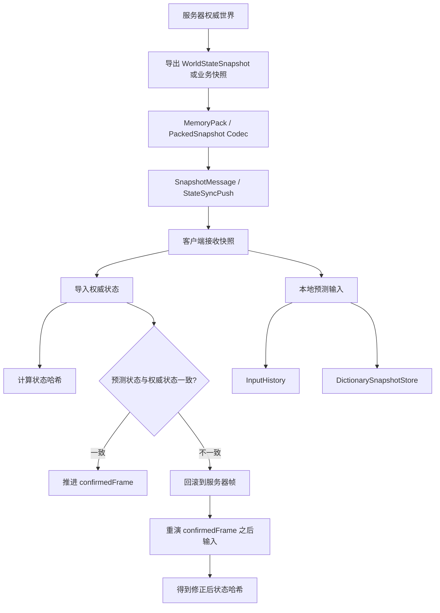
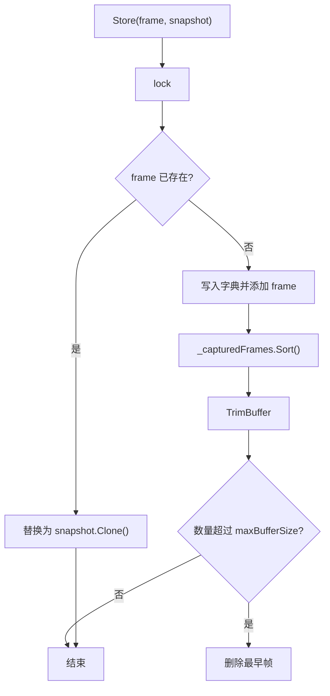
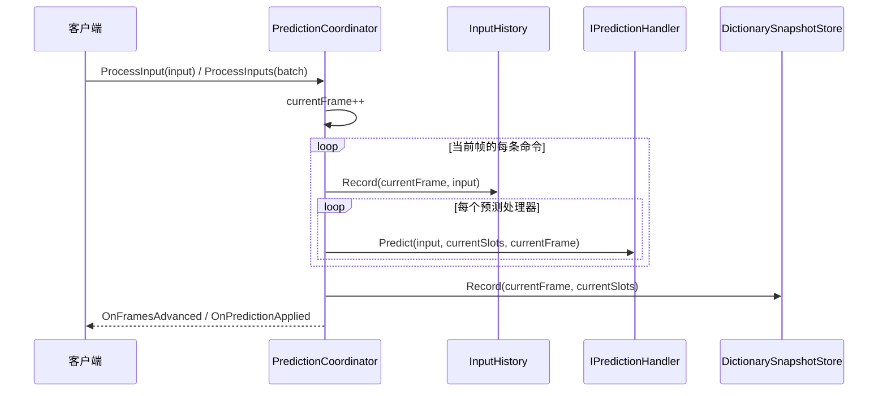
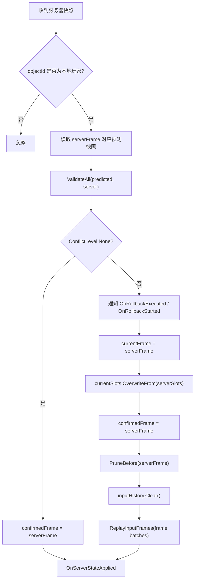
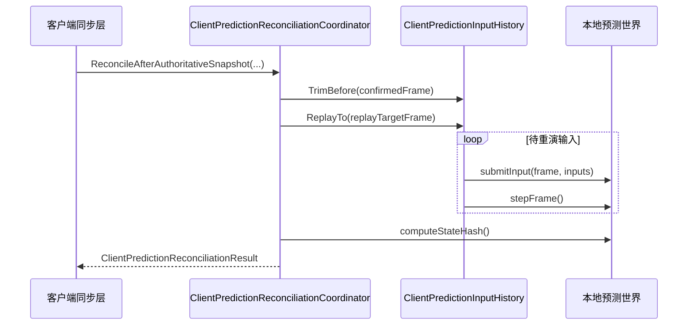
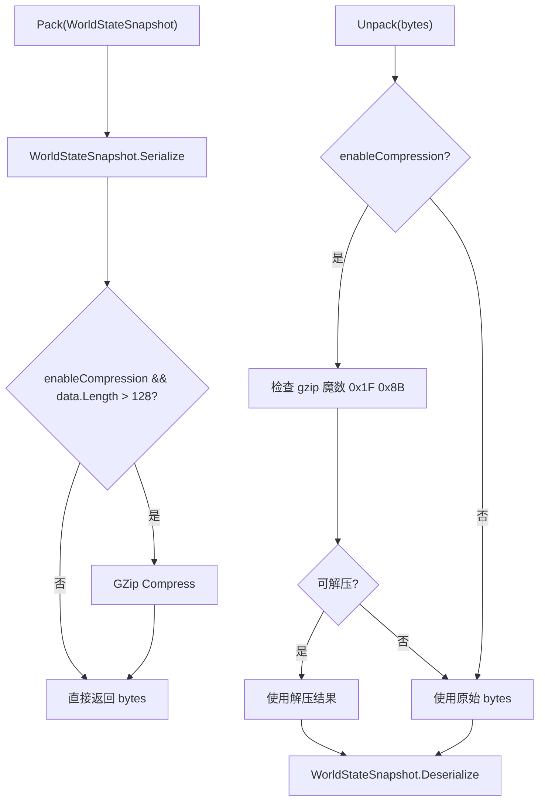
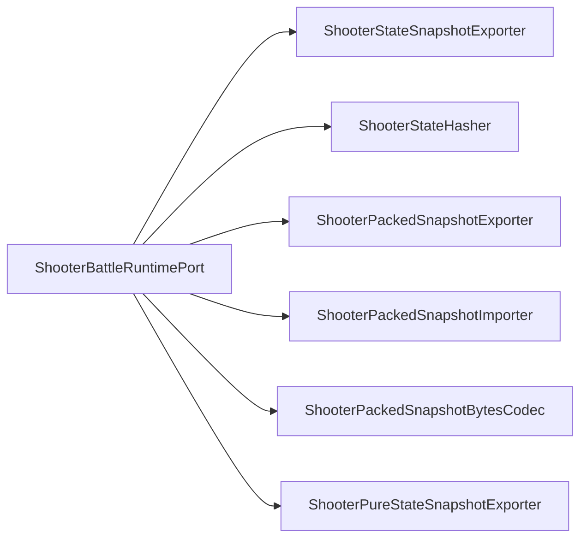
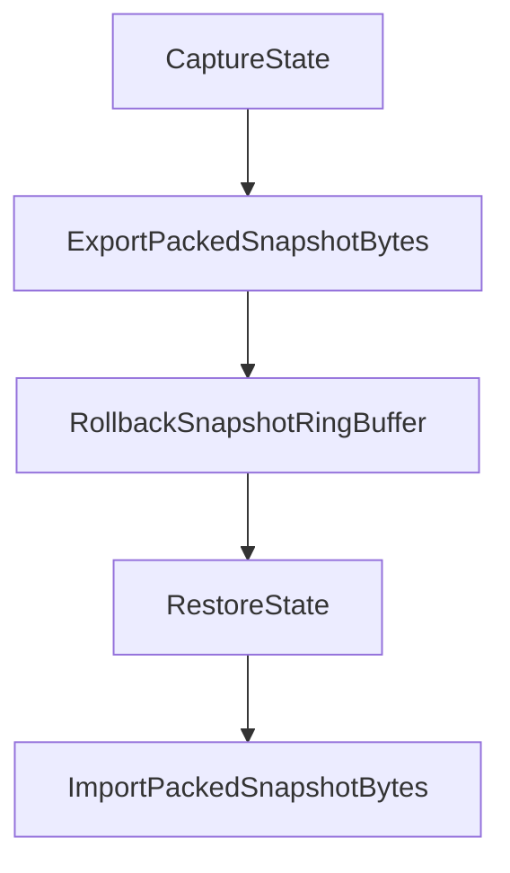

# 7.2 状态同步

> **文档类型：Canonical 设计**
>
> **事实基线：2026-08-16**
>
> **规范范围：** 快照模型、缓存、路由、差分、预测校正与业务状态同步接入；不把示例专用状态模型提升为框架协议。

> 基于真实源码说明 AbilityKit 的状态同步能力：通用 `WorldStateSnapshot`、快照缓存、网络快照消息、MemoryPack 打包、客户端预测协调，以及 Demo Shooter 中权威快照与预测重演的落地路径。

---

## 目录

1. [能力定位](#1-能力定位)
2. [源码入口](#2-源码入口)
3. [总体结构](#3-总体结构)
4. [核心数据结构](#4-核心数据结构)
5. [快照缓存](#5-快照缓存)
6. [预测协调与服务器修正](#6-预测协调与服务器修正)
7. [网络快照消息与打包](#7-网络快照消息与打包)
8. [Shooter 状态同步落地](#8-shooter-状态同步落地)
9. [设计约束与查漏补缺](#9-设计约束与查漏补缺)

---

## 1. 能力定位

AbilityKit 的状态同步不是一个独立网络协议，而是围绕“权威状态修正客户端”的一组能力：

| 能力 | 作用 | 代表类型 |
|------|------|----------|
| 通用快照 | 用跨端可序列化的数据结构描述世界状态元信息 | `WorldStateSnapshot`、`Vec3`、`Quat` |
| 快照缓存 | 按帧保存最近若干帧快照，支持读取、裁剪、清理 | `SnapshotBuffer` |
| 网络消息 | 将快照、快照请求、状态哈希封装为网络传输对象 | `SnapshotMessage`、`SnapshotRequestMessage`、`StateHashMessage` |
| 快照打包 | 将快照序列化为字节，必要时压缩 | `ISnapshotPacker`、`MemoryPackSnapshotPacker` |
| 客户端预测 | 本地先执行输入，并保存预测状态与输入历史 | `PredictionCoordinator`、`InputHistory`、`StateSlots` |
| 冲突修正 | 收到服务器快照后校验预测状态，必要时回滚并重演 | `IPredictionHandler`、`PredictionResult`、`ConflictLevel` |
| Demo 落地 | Shooter 通过专用 packed/pure-state 快照和状态哈希实现权威推送 | `ShooterPackedSnapshotExporter`、`ShooterPackedSnapshotImporter`、`ShooterStateHasher` |

状态同步与帧同步的差异：

- 帧同步要求所有端以相同输入推进相同逻辑。
- 状态同步允许客户端本地预测，但服务器快照拥有最终权威。
- 状态同步需要处理乱序、旧帧、哈希不一致、快照压缩、增量快照和重演成本。

---

## 2. 源码入口

### 2.1 通用 StateSync 包

| 文件 | 说明 |
|------|------|
| [WorldStateSnapshot.cs](../../../Unity/Packages/com.abilitykit.world.statesync/Runtime/StateSync/Snapshot/WorldStateSnapshot.cs) | 通用世界状态快照，包含世界 ID、版本、帧号、时间戳、标志位、完整/增量标记、序列化、克隆、哈希。 |
| [SnapshotBuffer.cs](../../../Unity/Packages/com.abilitykit.world.statesync/Runtime/StateSync/Buffer/SnapshotBuffer.cs) | 线程安全的帧快照缓存，内部按帧号索引并维护有序帧列表。 |
| [SnapshotMessage.cs](../../../Unity/Packages/com.abilitykit.world.statesync/Runtime/StateSync/Network/SnapshotMessage.cs) | 网络传输用快照消息、快照请求消息和状态哈希消息。 |
| [ISnapshotPacker.cs](../../../Unity/Packages/com.abilitykit.world.statesync/Runtime/StateSync/Network/ISnapshotPacker.cs) | 快照打包器接口与 `MemoryPackSnapshotPacker` 默认实现。 |
| [PredictionCoordinator.cs](../../../Unity/Packages/com.abilitykit.world.statesync/Runtime/StateSync/Prediction/Core/PredictionCoordinator.cs) | 通用预测协调器，管理处理器、输入历史、快照存储和服务器确认帧。 |
| [StateSlots.cs](../../../Unity/Packages/com.abilitykit.world.statesync/Runtime/StateSync/Prediction/Core/StateSlots.cs) | 预测状态槽位、预测处理器、监听器、快照存储和输入历史。 |

### 2.2 Host Extension 与 Shooter 落地

| 文件 | 说明 |
|------|------|
| [ClientPredictionReconciliationCoordinator.cs](../../../Unity/Packages/com.abilitykit.host.extension/Runtime/Client/FrameSync/ClientPredictionReconciliationCoordinator.cs) | 客户端收到权威快照后裁剪输入历史，并重演确认帧之后的本地输入。 |
| [ShooterBattleRuntimePort.cs](../../../Unity/Packages/com.abilitykit.demo.shooter.runtime/Runtime/Application/Runtime/ShooterBattleRuntimePort.cs) | Shooter 战斗运行时端口，提供快照导出、导入、状态哈希、纯状态快照等能力。 |
| [ShooterPackedSnapshotExporter.cs](../../../Unity/Packages/com.abilitykit.demo.shooter.runtime/Runtime/Application/Synchronization/ShooterPackedSnapshotExporter.cs) | Shooter packed 快照导出，构造带实体 chunk 的快照载荷。 |
| [ShooterPackedSnapshotImporter.cs](../../../Unity/Packages/com.abilitykit.demo.shooter.runtime/Runtime/Application/Synchronization/ShooterPackedSnapshotImporter.cs) | Shooter packed 快照导入，将权威实体状态写回运行时。 |
| [ShooterStateHasher.cs](../../../Unity/Packages/com.abilitykit.demo.shooter.runtime/Runtime/Application/Synchronization/ShooterStateHasher.cs) | 对玩家、子弹、敌人等状态按稳定顺序计算哈希。 |
| [ShooterPackedSnapshotRollbackProvider.cs](../../../Unity/Packages/com.abilitykit.demo.shooter.runtime/Runtime/Application/Rollback/ShooterPackedSnapshotRollbackProvider.cs) | 将 Shooter packed 快照接入回滚状态提供器。 |

---

## 3. 总体结构

这张图对应两层实现：

1. 通用层提供快照、缓存、预测、打包抽象。
2. 业务层决定实际快照内容、实体排序、压缩格式、哈希规则和如何把快照写回世界。

---

## 4. 核心数据结构

### 4.1 `WorldStateSnapshot`

`WorldStateSnapshot` 是框架级快照元信息结构：

| 字段 | 含义 |
|------|------|
| `WorldId` | 世界 ID，用于区分房间/战斗实例。 |
| `Version` | 快照结构版本，默认 `CurrentVersion = 1`。 |
| `Frame` | 快照所属逻辑帧。 |
| `Timestamp` | 生成时间戳。 |
| `WorldFlags` | 世界状态标志位。 |
| `IsFullSnapshot` | 是否为完整快照；`false` 表示增量快照。 |

它提供四类基础能力：

- `Serialize` / `Deserialize`：通过 MemoryPack 转字节。
- `ToBytes` / `FromBytes`：实例级和静态字节转换。
- `ComputeHash`：委托 `StateHashComputer` 计算状态哈希。
- `Clone`：通过序列化再反序列化复制快照。

这里的“完整快照”只表示该元信息对象的 `IsFullSnapshot` 标记，不表示对象内含全部业务实体。`StateManager` 将 `WorldStateSnapshot` 与实体 `IRollbackStateProvider` 导出的字节分开保存；其 `GetFullState(frame)` 只序列化元信息快照。需要恢复完整世界时，调用方必须同时维护业务快照或实体回滚数据。

`StateHashComputer.Compute` 当前只组合 `Version`、`Frame`、`Timestamp` 和 `WorldFlags`，不包含 `WorldId` 与 `IsFullSnapshot`。由于时间戳参与哈希，客户端和服务器若没有复用完全相同的时间戳，即使业务状态一致也会得到不同结果。业务确定性校验应优先使用 `ComputeWithBusinessData` 接入 `IBusinessHashProvider`，或采用业务专用稳定哈希。

### 4.2 序列化向量类型

`WorldStateSnapshot.cs` 中还定义了独立于引擎的 `Vec3` 和 `Quat`：

- 它们是 `MemoryPackable` 类型，适合网络传输。
- 它们不是 `AbilityKit.Core.Mathematics.Vec3` / `Quat` 本体。
- 代码提供 `FromCoreVec3`、`ToCoreVec3`、`FromCoreQuat`、`ToCoreQuat` 显式转换，避免业务层误把运行时数学结构直接当网络结构使用。

---

## 5. 快照缓存

`SnapshotBuffer` 是一个按帧缓存 `WorldStateSnapshot` 的线程安全容器：

关键行为：

- `Store` 总是保存 `snapshot.Clone()`，避免外部继续修改同一对象。
- `TryGet` 返回 clone，调用方拿到的是副本。
- `GetCapturedFrames` 返回数组副本。
- 字典、有序帧列表及其读写均由同一把锁保护。
- 默认容量为 128；构造参数必须大于 0。
- `RemoveBefore` / `RemoveAfter` 可用于确认帧之前裁剪或回滚后清理未来帧。
- `TrimBuffer` 通过删除最早帧控制内存上限。

clone 隔离了缓存所有权，但 `WorldStateSnapshot.Clone()` 经过序列化往返，频繁存取会带来分配和编码成本。容量、写入频率与读取频率应纳入业务预算，当前源码没有对应的性能门禁。

---

## 6. 预测协调与服务器修正

### 6.1 `StateSlots` 与 `IPredictionHandler`

`StateSlots` 是通用预测状态容器，按字符串槽位保存状态值。它支持：

- `Set` / `Remove` 修改槽位并增加版本。
- `GetFloat`、`GetInt`、`GetBool`、`GetPosition`、`GetQuaternion` 等常用读取。
- `Clone` 按快照契约复制槽位字典和值。
- `OverwriteFrom` 先完成全部值复制，再事务式覆盖当前状态。
- `Clear` 清空当前状态并推进版本。

当前 `StateSlots` 不提供状态哈希 API。需要确定性对账时，应由业务实现稳定字段顺序和序列化规则，不应假定槽位字典可以直接作为跨端哈希协议。

`Clone()` 与 `OverwriteFrom()` 对值类型和字符串直接复制；集合、业务状态对象等引用类型必须由构造时传入的 `IStateSlotValueCloner` 生成独立副本。未提供策略时遇到可变引用会快速失败，不再静默共享对象。`OverwriteFrom()` 先构造完整 replacement，再提交到当前槽位，因此克隆失败不会留下部分覆盖状态。

`IPredictionHandler` 负责把输入作用到槽位：

| 方法 | 作用 |
|------|------|
| `Predict` | 根据输入预测本地状态。 |
| `Validate` | 比较预测状态与服务器状态。 |
| `ApplyServerState` | 将服务器状态写入当前状态。 |

### 6.2 `PredictionCoordinator.ProcessInput`

本地输入处理的核心是：先推进一次本地预测帧，再记录并执行该帧的一条或多条输入，最后只保存一次帧末快照。正式 `IPredictionCoordinator` 接口已经收敛为 `ProcessInput`、`ProcessInputs`、`ApplyServerSnapshot` 与 `Reset`；旧的 `RecordInput + AdvancePrediction` 分裂入口和空 `ExecuteRollback` 已删除。

### 6.3 `PredictionCoordinator.ApplyServerSnapshot`

需要注意三个源码事实：

1. 冲突分支先通过 `GetFrameBatches` 捕获从服务器确认帧到原预测帧的完整帧区间，再清空旧输入历史并按原始 `Frame` 重演；同帧命令保持顺序，空输入帧也不会被压缩，帧末只记录一次快照。
2. `DictionarySnapshotStore.Record` 保存独立 clone，`Get` 也返回新的独立 clone；调用方修改读取结果不会回写 store。引用型槽位的复制责任由 `IStateSlotValueCloner` 显式承担。
3. `Reset()` 与 `Dispose()` 现在清理 snapshot store、输入历史和当前槽位；`Dispose()` 还解除事件引用并清理 listener/handler。重置仍保留已注册 handler/listener，释放则不保留。

具体业务若需要完整 reconciliation，应使用或扩展 Host Extension 里的 `ClientPredictionReconciliationCoordinator<TInput>`，或使用具备明确历史裁剪、恢复与重演约束的正式预测驱动。

### 6.4 客户端预测重整

`ClientPredictionReconciliationCoordinator<TInput>` 的职责更聚焦：收到权威快照后裁剪已确认输入，再重演剩余本地输入。

返回结果中包含：

- 修正前预测帧和预测哈希。
- 权威帧、权威哈希和导入后哈希。
- 权威哈希是否匹配导入后哈希。
- 重演 tick 数、最终帧和最终哈希。
- 修正前、裁剪后、重演后的待处理输入数量。

---

## 7. 网络快照消息与打包

### 7.1 `SnapshotMessage`

`SnapshotMessage` 是通用网络消息：

| 字段 | 含义 |
|------|------|
| `WorldId` | 世界 ID。 |
| `Frame` | 快照帧。 |
| `Timestamp` | 消息时间戳。 |
| `IsFullSnapshot` | 是否完整快照。 |
| `IsCompressed` | 是否压缩。 |
| `SnapshotData` | 快照字节。 |
| `StateHash` | 状态哈希。 |

它提供：

- `Create<T>`：用 MemoryPack 序列化任意快照对象。
- `ParseSnapshot<T>`：解析 `SnapshotData`。
- `Pack` / `Unpack`：把整个 `SnapshotMessage` 打成网络字节或从字节恢复。

`IsCompressed` 当前只是随消息序列化的协议字段，`ParseSnapshot<T>` 不会依据该字段自动解压 `SnapshotData`。`MemoryPackSnapshotPacker` 是另一条独立的 GZip 打包路径，也不会自动设置或消费 `SnapshotMessage.IsCompressed`。项目若把两者组合成网络协议，必须由同一 codec/route 同时负责标志、压缩和解压，并用压缩/未压缩往返测试锁定；仅设置标志不会让 payload 可解析。

### 7.2 请求和哈希消息

- `SnapshotRequestMessage`：请求某个世界从 `FromFrame` 到 `ToFrame` 的快照，可指定是否请求完整快照。
- `StateHashMessage`：传输某帧状态哈希和可选状态数据，用于检测分歧。

`StateHashValidator.Validate(frame, clientState, serverState)` 在任一快照为 `null` 时返回有效结果；这表示“缺少可比较证据”，不能解释为两端状态已经一致。另一个边界是：对象快照重载可在不匹配时触发验证事件，直接 `StateHash` 重载不触发该事件，消费者不能依赖两种重载产生相同观测行为。

### 7.3 差分、压缩与关键帧边界

`StateManager.ComputeDiff(fromFrame, toFrame)` 以 `toSnapshot` 为 current、`fromSnapshot` 为 previous 调用 `StateDiffProvider`，差分方向是正确的。但 `StateDiffProvider` 返回的 `fromFrame` 与 `toFrame` 当前固定为 0，因此产物不是自描述网络协议；发送方和接收方必须在协议外维护基线帧与目标帧。

差分提供器对非 `None` 压缩级别统一使用 Deflate。独立 `DeltaCompressor` 中 `Medium` 使用 GZip，`Light`/LZ4 与 `Heavy`/Zstd 会抛出 `NotSupportedException`，`EstimateCompressedSize` 也只是固定比例估算。当前没有发现该压缩器的生产消费者。`KeyFrameStrategy` 同样只有类型和策略实现，尚未发现运行主链消费者或专项测试。这两项应记为 E0 或占位能力，而不是已接入的关键帧/多算法压缩协议。

### 7.4 `MemoryPackSnapshotPacker`

默认打包器只负责通用 `WorldStateSnapshot`。Shooter 等业务模块因为需要实体 chunk、兴趣管理和更紧凑的结构，会实现自己的 packed/pure-state 快照编码。

---

## 8. Shooter 状态同步落地

Shooter Demo 展示了比通用 `WorldStateSnapshot` 更完整的业务状态同步实现。

### 8.1 运行时端口

`ShooterBattleRuntimePort` 同时实现多个端口：

- `IShooterSimulationClock`：帧推进。
- `IShooterSnapshotReadPort`：导出完整业务快照。
- `IShooterStateHashProvider`：计算状态哈希。
- `IShooterPackedSnapshotPort`：导出/导入 packed 快照与字节。
- `IShooterPureStateSnapshotPort`：导出纯状态快照。
- `IShooterBotAiPort`：Bot AI 输入。

### 8.2 Packed 快照

`ShooterPackedSnapshotExporter` 会导出：

- 版本、世界 ID、当前帧。
- 完整/增量/keyframe/authorityOverride 标志。
- `StateHash`。
- 玩家、子弹、敌人等实体 chunk。
- 按稳定顺序排序后的实体数据。

`ShooterPackedSnapshotImporter` 根据 chunk 写回实体状态：

- full 快照可重建基线。
- delta 快照可更新实体位置、血量、分数、剩余帧等字段。
- 导入后再计算状态哈希，可与权威哈希比较。

### 8.3 Pure State 快照

`ShooterPureStateSnapshotExporter` 面向状态同步推送和兴趣管理，支持：

- full baseline、delta、low frequency 三类快照。
- `MaxEntityCount`、`ActiveSyncBudget` 等预算控制。
- `ShooterPureStateInterestScope` 按观察者位置和半径裁剪实体。
- `VisibilityHint` 和实体优先级，帮助客户端选择重要实体。

### 8.4 回滚接入

`ShooterPackedSnapshotRollbackProvider` 将 packed 快照包装为 `IRollbackStateProvider`：

这说明状态同步和回滚不是互斥能力：状态同步用于网络权威修正，回滚用同一种快照字节实现恢复点。

---

## 9. 设计约束与查漏补缺

### 9.1 已有设计约束

- 通用 `WorldStateSnapshot` 只保存框架级元信息；`StateManager` 的实体回滚字节是另一条状态轨道，业务也可采用专用快照。
- `SnapshotBuffer` 返回 clone，降低外部误修改缓存的风险，但也带来序列化复制成本。
- `StateSlots` 当前没有通用哈希 API；Shooter 使用专用 `ShooterStateHasher` 对业务实体按稳定顺序计算。
- `StateSlots.Clone/OverwriteFrom` 对引用值要求显式 `IStateSlotValueCloner`；未知引用快速失败。该策略解决容器快照隔离，不替业务定义跨端 codec 或稳定哈希。
- 通用 `PredictionCoordinator` 按原帧分组重演同帧多输入和空输入帧，store 的 Record/Get 均隔离副本，Reset/Dispose 清理预测时间线；输入命令实例本身仍要求在历史保留期间保持不可变。
- 通用状态哈希只覆盖部分元信息并包含时间戳；空快照验证返回 Valid，调用方必须区分“一致”和“没有比较证据”。
- 当前状态差分缺少有效帧元数据，LZ4/Zstd 和关键帧策略没有运行主链采用证据。
- MemoryPack 打包器只处理通用快照对象；跨语言或 Web 端需要额外协议映射。
- `SnapshotMessage.IsCompressed` 与 `MemoryPackSnapshotPacker` 没有自动协议联动；压缩标志和 payload codec 必须由项目 route 成对维护。

快照路由还存在独立的生命周期约束：`FrameSnapshotDispatcher.Dispose()` 当前不清 route/handler，`SnapshotPipeline.Dispose()` 只解除 dispatcher 事件绑定；同 order stage 保持插入顺序。handler 异常会记录后继续，但遍历时不会先复制 handler 列表，因此回调中退订或修改同一路由可能改变本次迭代。项目应在 owner 停止分发后统一解绑，不能依赖 `Dispose()` 自动清空所有路由。

### 9.2 证据成熟度

| 能力 | 当前证据 | 结论 |
|------|----------|------|
| 通用快照、缓存、哈希、差分与预测类型 | E0 源码实现；`StateManagerTests`、`StateDiffProviderTests` 提供局部 E3 | 不能由局部测试外推为完整网络状态同步协议 |
| Host reconciliation | E0 实现，存在业务运行时接入 | 采用深度应按具体 Host/Demo 入口单独核验 |
| Shooter packed/pure-state、稳定哈希与回滚 Provider | E2 业务运行链，另有专项测试与 Smoke/CI 分层 | Shooter 证据不自动提升通用 `PredictionCoordinator` 或 `KeyFrameStrategy` 的成熟度 |
| 通用 LZ4/Zstd、关键帧网络协议 | 仅 E0 占位或策略类型 | 未建立 E2 消费、E3 专项契约、E4 artifact 或 E5 发布门禁 |
| 聚焦验证 | 2026-08-17 StateSync `20/20`；Batch M 历史 Snapshot `7/7` | 新增同帧批次、帧级事件、空输入帧、Reset/Clear、store 读写隔离、显式引用克隆和覆盖事务测试；不等于真实 Gateway Smoke 或发布 gate 已执行 |

### 9.3 关联专题边界

- [回滚预测](03-RollbackPrediction.md) 负责说明 `RollbackCoordinator`、`RollbackSnapshotRingBuffer` 与 `IRollbackStateProvider`。
- [会话协调](05-SessionCoordination.md) 负责说明 Orleans `StateSyncObserverGrain` 如何把 `StateSyncPush` 通过 Gateway 推给账号连接。
- Shooter Demo 文档负责说明 packed snapshot、pure state、兴趣管理和 smoke 测试闭环。

---

## 10. 关联文档

- [帧同步机制](01-FrameSync.md) - 理解输入帧如何推进逻辑。
- [回滚预测](03-RollbackPrediction.md) - 理解快照恢复与输入重演。
- [网络同步能力地图](00-SynchronizationCapabilityMap.md) - 回到同步能力总览。

---

*文档版本：v3.2 | 最后更新：2026-08-16 | 文档类型：Canonical 设计*
