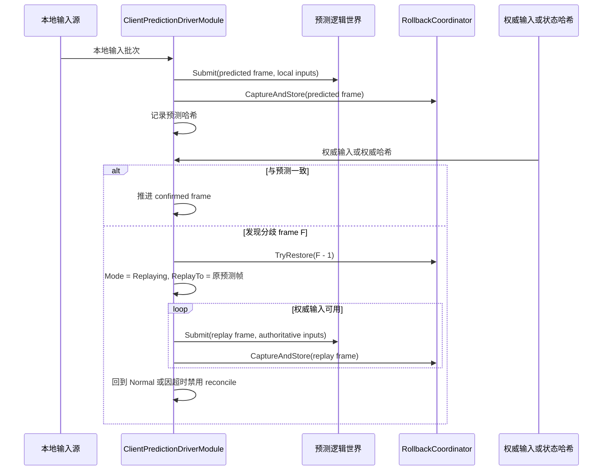
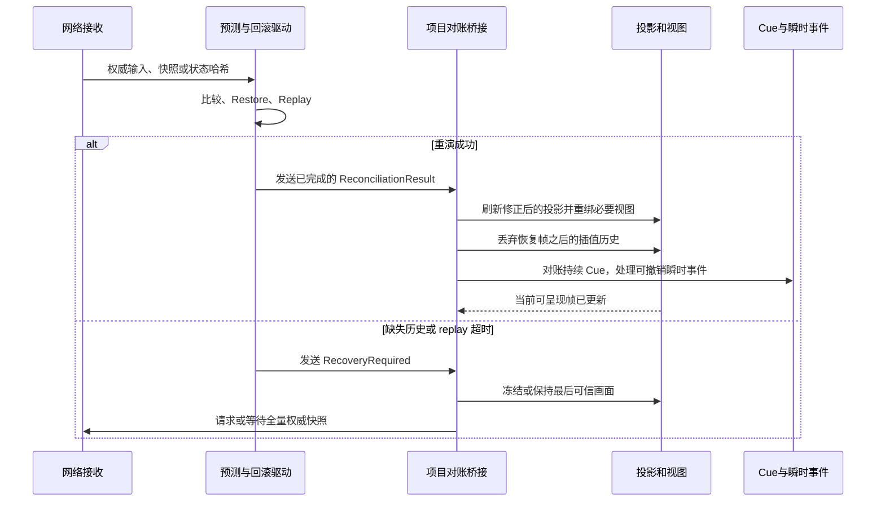
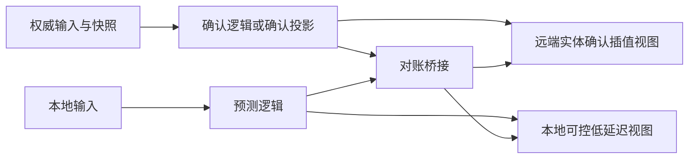
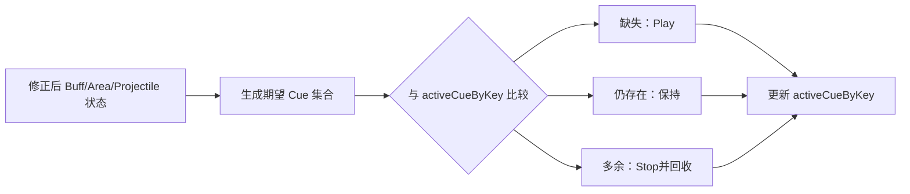

# 7.3.1 预测回滚与表现重整设计

> **文档类型：Canonical 设计**
>
> **事实基线：2026-08-16**
>
> **规范范围：** 逻辑校正如何转化为 View、插值、Cue 与瞬时反馈的可信重整；具体视觉策略属于项目层。

> 本文讨论客户端预测在游戏层和表现层的接入边界：什么输入可以提前响应，何时接受权威结果，发生分歧后怎样让视图、插值、持续效果与瞬时反馈回到可信状态。
>
> 快照捕获、Provider、恢复和输入重演的基础设施见 [回滚预测](03-RollbackPrediction.md)；通用状态快照与 `PredictionCoordinator` 的抽象见 [状态同步](02-StateSync.md)；会话、Transport 和通用 Hybrid adapter 的成熟度见 [会话协调](05-SessionCoordination.md)。本文不把这些基础设施重复解释为一套通用的、已经完成的表现回滚方案。

---

## 目录

1. [问题定义与阅读方式](#1-问题定义与阅读方式)
2. [能力边界与事实分级](#2-能力边界与事实分级)
3. [游戏层预测决策](#3-游戏层预测决策)
4. [一次可信的对账流程](#4-一次可信的对账流程)
5. [预测与确认的视图组织](#5-预测与确认的视图组织)
6. [表现重整契约](#6-表现重整契约)
7. [事件、Cue 与插值的回退规则](#7-事件cue-与插值的回退规则)
8. [参数、观测与降级](#8-参数观测与降级)
9. [当前缺口与落地路线](#9-当前缺口与落地路线)
10. [验收矩阵](#10-验收矩阵)

---

## 1. 问题定义与阅读方式

预测的目标是缩短本地输入到可见反馈之间的时间，不是让客户端成为第二个权威服务器。客户端可以先用自己持有的输入和历史状态推进世界，但服务器输入、服务器快照和服务器状态哈希始终决定最终事实。

因此，一次预测功能至少包含四条不同的链路：

| 链路 | 回答的问题 | 不可省略的结果 |
|---|---|---|
| 输入链路 | 本地操作能否立即被模拟？ | 帧号明确的待确认输入历史 |
| 状态链路 | 如何知道预测是否偏离？ | 权威输入比较、权威快照导入或稳定状态哈希比较 |
| 恢复链路 | 偏离后如何回到正确状态？ | 可恢复的历史状态和可重演的输入 |
| 表现链路 | 纠正后的状态怎样进入画面？ | 视图刷新、插值失效、持续效果对账和瞬时效果策略 |

只实现前两条链路，玩家会看到“本地立即响应”；只实现前三条链路，逻辑状态可能正确但画面仍保留旧轨迹或旧特效。本文的重点是第四条链路，并把它明确为项目接入责任。

### 1.1 本文的事实标记

| 标记 | 含义 |
|---|---|
| **已实现** | 当前源码已有可调用行为，文中给出对应源码入口。 |
| **项目接入要求** | 基础能力存在，但项目必须明确连接、配置或实现接口后才成立。 |
| **目标设计** | 推荐的落地形态，不表示当前所有 Demo 已自动具备。 |
| **未闭环** | 当前没有足够代码证据证明从触发到表现恢复已完整运行。 |

这种区分很重要：类型名、Factory 分支或 Debug 按钮的存在，不等同于可在生产路径宣称“自动预测、自动对账、自动表现回滚”。

---

## 2. 能力边界与事实分级

### 2.1 当前可复用的基础能力

| 层级 | 当前能力 | 事实边界 |
|---|---|---|
| 回滚底座 | **已实现**：`IRollbackStateProvider`、`RollbackCoordinator` 和环形历史缓存可捕获并恢复业务状态。 | Provider 必须自行覆盖会影响未来模拟的完整状态；只保存 Transform 不能保证技能、随机数、冷却或命令历史可重演。 |
| Host Extension 预测驱动 | **已实现**：`ClientPredictionDriverModule` 保存已应用输入，消费权威输入，比较状态哈希，按分歧帧前一帧恢复并等待权威输入重演。 | 模块只处理逻辑世界和回滚统计；它不调用 View、Binder、Cue 或 Unity 插值器。 |
| 通用状态同步 | **已实现**：`PredictionCoordinator` 提供单命令/同帧批命令预测、校验、服务器状态覆盖和按原帧重演。 | store Record/Get 已隔离副本，Reset/Dispose 清理时间线；引用型槽位必须提供 `IStateSlotValueCloner`，输入命令在历史保留期间必须不可变。它仍不自动桥接 View/Cue。 |
| Coordinator Hybrid adapter | **未闭环**：已有 transport、输入缓冲、确认状态和 reconciliation bookkeeping。 | 尚未提供通用预测模拟、状态比较、纠正和重放，不能作为生产默认的通用预测方案。 |
| MOBA 远端驱动运行时 | **已实现**：预测开启时安装 `ClientPredictionDriverModule`，每帧捕获回滚状态，并可注入 Provider 与状态哈希。 | 逻辑回退完成后，表现层重整尚没有由该模块自动触发的回调链。 |
| Shooter 预测回滚控制器 | **已实现**：导入权威 packed snapshot、裁剪本地输入、重演并发布修正后的运行时快照。 | 这是 Shooter 专用 recovery 链，不应反推通用 Hybrid adapter 已完成同样能力。 |
| Shooter 权威插值控制器 | **已实现**：本地主控保存有限 pending input，按命令序列或 accepted frame 裁剪，做局部 pose 校正和有界重演；远端 actor 只进入插值缓冲。 | 它不是“客户端完全不预测”，也不会为远端 actor 导入本地模拟或触发整世界回滚。 |

相关源码入口：

- [RollbackCoordinator.cs](../../../Unity/Packages/com.abilitykit.world.framesync/Runtime/FrameSync/Rollback/RollbackCoordinator.cs)
- [ClientPredictionDriverModule.cs](../../../Unity/Packages/com.abilitykit.host.extension/Runtime/FrameSync/ClientPredictionDriverModule.cs)
- [HybridSyncAdapter.cs](../../../src/AbilityKit.Demo.Moba.Console/Battle/Sync/HybridSyncAdapter.cs)
- [RemoteDrivenRuntimeModuleFactory.cs](../../../Unity/Packages/com.abilitykit.demo.moba.view.runtime/Runtime/Game/Battle/Client/Session/Features/Sim/RemoteDrivenRuntimeModuleFactory.cs)
- [ShooterClientFrameSyncController.cs](../../../Unity/Packages/com.abilitykit.demo.shooter.view.runtime/Runtime/Client/Synchronization/ShooterClientFrameSyncController.cs)

### 2.2 逻辑回滚的实际时序

`ClientPredictionDriverModule` 的分歧处理有两个入口：收到同帧权威输入且与已应用输入不同，或收到权威状态哈希且与预测哈希不同。二者都会恢复到分歧帧的前一帧，然后进入 replay 状态。回放优先使用已缓存或新到达的**权威输入**；缺失权威输入时暂停，超时后会退出回放并禁用 reconcile，避免无限等待。



这里的“回放完成”只说明逻辑状态已经恢复到某个结果，不等于 Unity 视图已同步。项目必须在该边界上补上第 6 节定义的表现重整动作。

### 2.3 不应混淆的三个概念

| 概念 | 含义 | 不能替代什么 |
|---|---|---|
| 输入确认 | 权威端接受并消费了某帧输入。 | 不证明当前世界状态哈希相同。 |
| 状态确认 | 客户端导入或比较到某帧权威状态。 | 不自动刷新已有 Shell、插值样本和 Cue。 |
| 表现确认 | 视图已按修正后的状态重新绑定并完成必要的效果对账。 | 不决定战斗逻辑的权威性。 |

---

## 3. 游戏层预测决策

预测应以“本地输入是否足够决定结果”和“错了以后是否能用低成本视觉语言纠正”为判断标准，而不是按技能名称一刀切。

### 3.1 四类预测对象

| 对象 | 推荐 | 原因 | 失败后的主要成本 |
|---|---|---|---|
| 本地输入采样 | 立即记录并提交 | 输入由本地玩家产生，天然可用。 | 仅裁剪或标记已确认输入。 |
| 本地角色常规移动 | 通常预测 | 输入、速度和碰撞规则已被完整同步时确定性较高。 | 位置校正、镜头/HUD 与逻辑坐标短暂不一致。 |
| 施法起手与前摇 | 通常预测表现 | 玩家需要即时按键反馈；最终施法是否合法仍由权威端决定。 | 取消或收敛施法表现。 |
| 命中、伤害、Buff 生效 | 按来源分级 | 依赖目标状态、碰撞、同时发生事件和服务端排序。 | 错目标、错误飘字、错误持续特效、错误状态感知。 |

### 3.2 MOBA 的默认边界

| 事件 | 默认策略 | 说明 |
|---|---|---|
| 本地英雄移动 | 可预测 | 前提是所有影响移动的状态已进入回滚 Provider 与哈希。眩晕、击退、冲锋中断等必须参与状态恢复。 |
| 本地施法起手 | 可预测表现 | 可以立即播放起手动画、范围预览或发射前特效；不应把它当作命中确认。 |
| 指向性或近距离命中反馈 | 有条件预测 | 仅在目标身份、命中时间窗和撤销策略可追踪时开启。优先预测低价值、可淡出的反馈。 |
| 弹道、范围、多目标选择 | 谨慎预测 | 权威端对碰撞、目标列表和事件排序的差异会被放大；默认等待确认结果或只显示不结算的预览。 |
| 被动触发、条件 Buff、随机效果 | 不预测最终结果 | 没有确定的本地原因链，应该由权威快照或确认事件驱动。 |
| 远端角色 | 不进行输入预测 | 以确认状态加插值显示；本地对远端做输入预测会与权威快照竞争。 |

“预测伤害数字”必须尤其保守。最终数值、目标死亡和 Buff 层数属于权威结论；若为了手感提前显示，应使用可替换的预测样式，并有稳定的事件身份来取消或确认，不能把预测数字写入权威 HUD 状态。

### 3.3 预测策略不应由表现层反向裁决

表现层可以选择忽略、小幅平滑或立即重置视觉结果，但不能根据画面是否平滑决定逻辑世界是否接受权威状态。推荐顺序是：

1. 逻辑层先完成权威输入比较或状态哈希比较。
2. 逻辑层恢复并重演，产出明确的对账结果。
3. 表现层根据结果的偏差类型选择视觉策略。
4. 所有最终战斗数据继续从修正后的逻辑状态或权威快照读取。

---

## 4. 一次可信的对账流程

### 4.1 项目应拥有的对账结果

基础 `ClientPredictionDriverModule` 对外暴露帧、回放状态和统计，但不发布完整的表现回退事件。项目层应在不修改模拟规则的前提下封装一个对账通知，至少包含以下信息：

| 字段 | 用途 |
|---|---|
| `WorldId` | 避免多个 battle world 的回退互相影响。 |
| `MismatchFrame` 与 `RestoreFrame` | 决定哪些插值样本、瞬时事件和 Cue 需要重新判断。 |
| `ReplayTargetFrame` 与 `FinalFrame` | 标记逻辑世界最终推进到哪里。 |
| `Cause` | 区分权威输入不一致、状态哈希不一致、权威快照导入或人工强制恢复。 |
| `Completed` 与 `RecoveryRequired` | 区分一次成功重演、等待权威输入超时、历史快照缺失和需要全量重同步。 |
| `BeforeHash`、`AuthoritativeHash`、`AfterHash` | 支持诊断与自动化验收；不是表现层的显示数据。 |

### 4.2 目标接入时序



这是一份**目标设计**。当前 MOBA 的 `ClientPredictionDriverModule` 没有直接调用这条 Bridge；任何接入都必须明确事件在何处生成，以及为何不会在同一分歧上重复执行。

### 4.3 失败时不能“继续假装预测成功”

以下任一情况都应进入恢复路径，而不是继续用陈旧预测状态驱动画面：

- 找不到 `RestoreFrame` 的历史快照。
- 回滚 Provider 导入失败，或 Provider 覆盖范围无法证明完整。
- 回放等待权威输入超过项目定义上限。
- 导入后的权威哈希与权威哈希不一致。
- WorldId、版本或快照基线不匹配。

Shooter 专用控制器已经展示了这种模式：导入 packed snapshot 后重演剩余输入，比较权威 hash 与导入后 runtime hash，再发布修正后的运行时快照；不满足条件时进入 `CatchUp`、`AwaitingFullSnapshot`、`ApplyingFullSnapshot` 或 `Recovered` 恢复状态。`ShooterClientBattleHandle` 根据 runtime、reliable event 和 pure-state baseline 三类状态构造请求 key，去重相同请求并合并 in-flight task；`ShooterBattleDataPlane` 在 push、连接建立和 reliable event ack 失败后触发检查。服务端 full snapshot 应用后还会恢复 reliable event baseline。该闭环是 Shooter 业务实现，不是通用回滚底座自动具备的行为。

当前通用恢复原语已经把决策和动作执行拆开：`NetworkSessionRecoveryCoordinator` 只归并信号并选择 directive，`NetworkSessionRecoveryActionRouter<TResult>` 注册项目 handler，`NetworkSessionRecoveryRuntime<TResult>` 管 Automatic/Manual 执行、generation、取消和 stale completion。Shooter 的 handle 使用 Manual 模式，把 full snapshot 与 reliable baseline 两类动作路由到项目 full-state RPC；MOBA 的 Room 恢复与权威状态恢复则使用各自的 handler。表现桥接、Room restore 和 full-state 协议都不能因共享 runtime 而上移成统一框架策略。

---

## 5. 预测与确认的视图组织

### 5.1 双视图是呈现策略，不是逻辑必须复制两次

理想的混合呈现会让本地可控对象优先读取预测状态，让远端对象读取确认状态并插值。是否为全部实体维护两套完整 View，取决于项目是否需要调试对照、同屏对比或复杂的本地预测物。



MOBA View runtime 中存在预测 `BattleViewFeature` 和确认 `ConfirmedBattleViewFeature`，两者分别取得共享场景层级的独立租约，并都提供 `RebindAll()` 入口。这说明双 View 的组织和重绑入口已具备；它不等于所有预测/确认事件、所有实体和所有 Cue 已经自动完成双路隔离。

Shooter 当前提供另一种已实现形态：权威插值控制器只对本地主控做局部 pose 校正和最多 `MaxReplayFrames` 个 pending input 的有界重演，远端 actor 则按 `serverTicks` 进入 `RemoteInterpolationPlayback`。Hybrid 对 packed push 先走本地主控 rollback，再把同一 decoded packed snapshot 缓冲为远端插值样本；pure-state 分支直接返回 rollback 应用结果，不进入 Hybrid 插值缓冲。该实现可作为职责分离的业务证据，但不替代本节针对 MOBA 的项目层表现桥接要求。

相关入口：

- [BattleViewFeature.Lifecycle.cs](../../../Unity/Packages/com.abilitykit.demo.moba.view.runtime/Runtime/Game/Battle/Presentation/Features/View/BattleViewFeature/BattleViewFeature.Lifecycle.cs)
- [ConfirmedBattleViewFeature.Lifecycle.cs](../../../Unity/Packages/com.abilitykit.demo.moba.view.runtime/Runtime/Game/Battle/Presentation/Features/View/ConfirmedBattleViewFeature/ConfirmedBattleViewFeature.Lifecycle.cs)
- [BattleViewBinder.cs](../../../Unity/Packages/com.abilitykit.demo.moba.view.runtime/Runtime/Game/Battle/Presentation/View/BattleViewBinder.cs)

### 5.2 单视图也必须有来源规则

项目暂时只使用单一路径时，仍须规定每个对象的状态来源：

| 对象类别 | 建议来源 | 规则 |
|---|---|---|
| 本地英雄 Shell 与镜头跟随 | 预测状态 | 对账后立即使用修正后的预测最终帧；不要继续读取回退前缓存。 |
| 远端英雄和非本地投射物 | 确认状态 | 用确认帧样本插值，禁止写入本地未确认输入。 |
| HUD 的生命、Buff、冷却 | 确认状态或标记为预测态的局部副本 | 不能把预测数据与权威数值无标识混写。 |
| 施法预览、瞄准线、点击反馈 | 本地输入和预测状态 | 属于可撤销提示，不能作为最终命中证据。 |

单视图的关键不是“覆盖写入快照”，而是每个消费者都能回答它当前读取的是预测、确认还是经过对账的最终状态。

---

## 6. 表现重整契约

### 6.1 回退后必须发生的动作

逻辑状态恢复后，项目对账桥接必须按依赖顺序处理表现对象：

1. **确认逻辑结果**：只有 Restore 和 Replay 成功才进入表现重整；失败先走全量重同步或冻结策略。
2. **刷新投影数据**：把修正后的逻辑状态写入预测投影或确认投影，并标记变更实体。当前 `BattleSnapshotEntityApplier` 只提供状态哈希、Transform 和 Spawn 的增量应用；它没有 `RebuildProjection()` API，不能在文档或接入代码中假定存在该调用。
3. **重绑受影响的视图**：实体创建、销毁、模型类型或绑定关系可能因回退变化时，调用对应 View Feature 的 `RebindAll()` 或更细粒度的 dirty refresh。
4. **使插值历史失效**：丢弃恢复帧之后的预测样本，避免插值器继续沿旧轨迹外推。
5. **对账持续表现**：以修正后的 Buff、Aura、投射物或 Area 状态重建持续 Cue 的集合。
6. **处理瞬时表现**：依据事件身份确认、替换、淡出或不重复播放，不把已经过去的短音效机械重演。
7. **恢复正常消费**：新的输入、快照和事件只进入修正后的帧轨道。

### 6.2 可执行接口形态

以下接口是**建议的项目层契约**，用于把逻辑重演与表现层解耦；它不是当前框架已有的公共 API：

```csharp
public interface IPredictionPresentationReconciler
{
    void OnReconciliationCompleted(in PredictionPresentationReconciliation result);
    void OnRecoveryRequired(in PredictionPresentationRecoveryRequired failure);
}
```

`OnReconciliationCompleted` 的实现应是无副作用可重复的：同一 `WorldId + RestoreFrame + FinalFrame + Generation` 被重复送达时，不能多次创建 Shell、叠加 Cue 或二次清空正确样本。网络重试、调试强制回退和重复快照都会触发这类情形。

### 6.3 全量重建不是默认路径

当回退跨度很小且实体集合不变，优先使用投影刷新、必要的重绑和插值样本重置。只有满足下列条件之一时才考虑全量重建某个投影 Context：

- 无法可靠判断受影响实体集合。
- 回退改变了大量 Spawn/Despawn、实体种类或模型归属。
- 收到新的全量基线快照。
- 局部投影导入失败，但确认世界仍可作为可信基线。

全量重建应带 generation token。异步资源加载、对象池归还与延迟 Cue 回调都必须检查 generation，防止回退前的回调重新写入已修正的视图。

---

## 7. 事件、Cue 与插值的回退规则

### 7.1 瞬时事件必须有可对账身份

伤害飘字、命中特效、受击动画、音效等不是可从最终状态完整推导的对象。要让它们可撤销或可去重，事件需要至少具备稳定键：

| 键组成 | 目的 |
|---|---|
| `WorldId` | 避免多局战斗事件冲突。 |
| `SourceFrame` | 判断事件是否位于恢复帧之后。 |
| `SourceActorId` 与目标标识 | 区分同帧多个施法者或目标。 |
| `CastSequence`、命令序号或权威事件序号 | 区分同一实体的重复施法和重复命中。 |
| `Origin` 与 `PredictionGeneration` | 区分预测事件、确认事件和一次回退前后的旧事件。 |

没有稳定身份时，系统只能按时间或视觉对象猜测去重，遇到同帧多目标、连击和重复命中会不可靠。此时更安全的策略是只提前显示弱提示，最终命中和伤害反馈等待权威事件。

### 7.2 持续 Cue 以“期望集合”对账

护盾光环、持续区域、Buff 绑定特效等应由修正后的状态导出期望集合，而不是只依赖某次 `Play`/`Stop` 事件：



Cue key 至少应包含实体身份、Cue 类型、Buff/Area 实例或施法序号。仅用模板 ID 会把同模板的多个实例错误合并。当前 MOBA 是否在逻辑回退后完整导出并消费此类 Cue 基线，尚无自动闭环证据，应作为项目接入任务验证。

### 7.3 插值样本不能跨回退边界复用

插值器保存的是某条历史轨迹，不是权威状态。发生回退时：

- 删除 `RestoreFrame` 之后由旧预测产生的所有样本。
- 将当前修正位置作为新的锚点或重新写入确认样本。
- 远端实体继续走确认样本的延迟插值，不混入本地预测轨迹。
- 本地实体可在阈值内做视觉平滑，但逻辑坐标、碰撞、选取和 HUD 结算仍读取修正后的状态。

“平滑校正”只能平滑显示层误差，不能延后逻辑纠正。对无法解释的大位移、死亡、传送、目标切换和实体销毁，应立即切换到权威状态，并由动画或镜头语言缓和视觉跳变。

### 7.4 事件策略表

| 表现类型 | 预测时可做什么 | 权威确认后 | 回退后 |
|---|---|---|---|
| 移动 Shell | 显示预测位置 | 小误差保留或平滑收敛 | 清空旧样本；大误差直接锚定权威位置。 |
| 施法起手 | 播放可取消前摇/预览 | 确认后自然衔接 | 若施法未成立，取消或收束，不伪造命中。 |
| 命中特效 | 仅在事件键可追踪时播放预测版本 | 将预测版本确认、替换或补播 | 移除错误目标上的可撤销效果，不重播已无意义反馈。 |
| 伤害飘字 | 优先等待权威数值 | 按权威数值显示 | 预测数字只能替换，不能修改权威 HUD。 |
| 持续 Buff/Cue | 可显示低风险预览 | 以权威实例状态建立期望集合 | 对账期望集合并清理多余实例。 |
| Spawn/Despawn | 仅在本地确定性对象上谨慎预测 | 以权威实体存在性为准 | 回收错误 Shell，重绑新实体，检查异步 generation。 |

---

## 8. 参数、观测与降级

### 8.1 区分框架参数与游戏手感参数

| 参数类别 | 示例 | 所属层 | 说明 |
|---|---|---|---|
| 回滚历史 | `rollbackHistoryFrames`、capture interval | 逻辑与内存预算 | 决定能否恢复到目标帧；应覆盖最大预测窗口、网络抖动和快照延迟。 |
| 预测窗口 | 最大领先帧、最小窗口、理想帧限制 | 预测调度 | 决定本地可领先多少；过大增加错误跨度，过小增加输入迟滞。 |
| 判定阈值 | 哈希字段、位置/速度误差阈值 | 对账协议 | 应用于项目协议，不由 Unity 插值器替代。 |
| 视觉校正 | 平滑时长、位置阈值、淡出时长 | 表现层 | 只影响如何展示已确认的逻辑纠正。 |
| 恢复策略 | replay 等待上限、全量快照阈值 | 会话与恢复 | 防止缺失历史或断线时无限重演。 |

MOBA 的 `RemoteDrivenRuntimeModuleFactory` 当前预测模块配置为最大领先 30 帧、最小窗口 1 帧、回滚历史 600 帧、每帧捕获一次。这是当前 Demo 装配值，不是适用于所有 TickRate、RTT 或业务负载的通用推荐值。

### 8.2 必须观测的指标

| 指标 | 用途 |
|---|---|
| `ConfirmedFrame`、`PredictedFrame`、预测窗口与积压 | 识别客户端是否长期领先、停滞或追赶失败。 |
| 回滚次数、恢复失败次数、最近分歧帧 | 识别输入协议或 Provider 覆盖问题。 |
| 哈希收到但缺少同帧预测哈希的次数 | 识别时序、缓存容量或帧对齐问题。 |
| replay 等待时长与自动禁用次数 | 识别权威输入缺失和恢复策略风险。 |
| 插值重置次数与校正距离分布 | 识别玩家真正可见的抖动，而不是只看逻辑 hash。 |
| Cue 新增、保留、移除与陈旧回调丢弃数 | 验证持续效果在回退后没有泄漏或重复。 |
| 全量重同步次数与原因 | 防止把不可恢复问题伪装成正常预测波动。 |

### 8.3 降级优先级

当网络质量或恢复完整性下降时，推荐按下列顺序降低风险：

1. 停止预测高不确定命中和伤害数字，只保留本地输入与移动反馈。
2. 缩小预测窗口，减少可见回退跨度。
3. 对本地英雄保留低风险预览，对远端对象完全使用确认插值。
4. replay 超时、Provider 不完整或全量基线缺失时停止继续预测，等待全量权威快照。
5. 恢复后重新建立历史快照与事件 generation，再开放预测。

---

## 9. 当前缺口与落地路线

### 9.1 已确认的缺口

| 优先级 | 缺口 | 当前依据 | 建议动作 |
|---|---|---|---|
| P0 | 逻辑回退到表现重整没有自动桥接 | `ClientPredictionDriverModule` 只维护逻辑、帧与统计；未引用 MOBA View Feature。 | 在 MOBA 项目层增加一次性对账结果桥接，并提供 replay 成功/失败通知。 |
| 已关闭 | 通用 `PredictionCoordinator` 的同帧多命令重演曾改变帧号 | 2026-08-17 已改为 `ProcessInputs` + `GetFrameBatches` + `ReplayInputFrames`，并覆盖同帧两命令和空输入帧。 | 保持命令不可变约束；复杂业务仍使用 Host 的按帧输入数组与完整 Provider。 |
| P0 | 回滚 Provider 的完整性需要按业务状态审计 | 回滚框架不理解业务 payload。 | 覆盖角色、投射物、技能运行时、冷却、Buff、随机状态及影响未来结果的命令/事件日志。 |
| P0 | 当前文档不能假定投影全量重建 API | `BattleSnapshotEntityApplier` 只有增量 ApplyStateHash/ApplyTransform/ApplySpawn。 | 基于实际投影生命周期设计局部刷新或新增明确的重建入口，禁止调用不存在的 `RebuildProjection()`。 |
| P1 | 持续 Cue 的回退后基线和跨来源去重未验证闭环 | View 侧有独立事件路径，但未证明逻辑回退后自动重建 active cue 集合。 | 建立期望 Cue 集合与稳定实例键，补回退后 Play/Keep/Stop 测试。 |
| P1 | 预测与确认 View 的选择策略需按实体和 HUD 明确 | 两类 View Feature 与 `RebindAll()` 已存在，但并不代表所有消费者已隔离。 | 写入实体分类、状态来源和事件来源矩阵；调试态可并排显示两种来源。 |
| P1 | 回放等待超时后的用户可见策略缺失 | Driver 会禁用 reconcile 并退出回放，但表现层未自动响应。 | 收到 `RecoveryRequired` 后冻结易错预测、请求全量快照并展示可信确认态。 |
| P2 | 视觉参数尚未以对象类型分层 | 本地英雄、远端英雄、投射物和区域效果的容错不同。 | 将视觉阈值配置到 View Handle 或实体类别，而非全局一个常量。 |

### 9.2 推荐实施顺序

1. 为当前 MOBA rollback registry 建立状态覆盖清单，并为每个 Provider 添加恢复后一致性测试。
2. 将 `ClientPredictionDriverModule` 的帧、回放状态和失败状态转换为项目层对账结果；保证该结果有 `WorldId`、帧区间和 generation。
3. 先接入本地英雄位置、视图重绑和插值样本清理，验证最小表现回退路径。
4. 接入 Spawn/Despawn 与持续 Cue 期望集合对账。
5. 最后才为可追踪的低风险命中反馈增加预测版本；伤害数值、被动和复杂多目标效果默认保持权威驱动。
6. 在高抖动、迟到输入、重复快照、回放超时和断线恢复下执行验收，达到门槛后再扩大预测覆盖范围。

---

## 10. 验收矩阵

| 场景 | 逻辑验收 | 表现验收 |
|---|---|---|
| 权威输入与预测输入一致 | 不回退，confirmed frame 单调推进。 | 不重绑、不清空插值；无重复 Cue。 |
| 权威输入不一致 | 恢复到分歧帧前一帧，以权威输入重演到目标帧。 | 本地 Shell 读取修正状态；旧预测插值样本不再影响画面。 |
| 状态哈希不一致 | 记录分歧帧、哈希证据与恢复结果。 | 只在成功重演后刷新；失败时进入恢复 UI/全量快照路径。 |
| 回退改变 Spawn/Despawn | 实体存在性与修正状态一致。 | 错误 Shell 被回收，新增实体正确绑定；陈旧异步回调被 generation 拒绝。 |
| 回退改变 Buff/Area | Buff/Area 实例状态与权威结果一致。 | Cue 集合无泄漏、无重复、无错误目标残留。 |
| 同一事件重复到达 | 逻辑不重复结算。 | 瞬时事件不重复飘字或播音；持续 Cue 幂等。 |
| replay 缺少权威输入 | 在上限内等待；超时后明确标记不可恢复。 | 不继续显示为可信预测；转为确认态或等待全量快照。 |
| 多 World 并行 | 一个 World 的恢复不影响另一个 World。 | 视图、Cue、插值和 diagnostics 按 WorldId 隔离。 |
| 高 RTT 与抖动 | 窗口、历史容量、回退次数符合预算。 | 校正距离与闪烁频率在体验阈值内，远端无本地预测拉扯。 |

建议把上述场景拆成三类测试：纯逻辑确定性测试、投影/事件身份测试，以及 Unity 表现集成测试。只有三类都通过，才能将某类对象从“仅权威显示”提升为“允许预测”。

### 10.1 证据解释

| 证据层 | 本文允许得出的结论 | 不能得出的结论 |
|--------|--------------------|----------------|
| E0/E1 | rollback、replay、View hook 或配置入口存在 | 表现已经在分歧后正确重整 |
| E2 | MOBA/Shooter 业务链已实际调用专用控制器 | 通用 Coordinator 已覆盖所有玩法 |
| E3 | 逻辑、快照或事件身份的专项测试通过 | 高 RTT、抖动、断线下玩家体验达标 |
| E4/E5 | 指定配置的 Smoke artifact 或 CI gate | 其它同步 Profile、其它对象类型自动具备同等成熟度 |

Batch W 执行 FrameSync `18/18` 与 StateSync `12/12`；Snapshot `7/7` 是 Batch M 的历史 E3。它们支持底层契约判断，不是本页表现重整目标的完整验收结果。

---

*文档版本：v3.2 | 最后更新：2026-08-16 | 文档类型：Canonical 设计 | 状态：表现对账桥仍由项目实现并验收*
