# 7.5 会话协调

> **文档类型：Canonical 设计**
>
> **事实基线：2026-08-16**
>
> **规范范围：** Room 控制面、battle 数据面、同步能力绑定、可靠事件恢复和客户端所有权；不替项目定义房间交互状态机。

> 本文从源码角度说明 AbilityKit 如何把阶段化 Gateway 入场、业务客户端会话、Room 生命周期、Battle Host 权威推进、端侧数据面、帧包适配和状态恢复串成一次可恢复、可重连、可观测的联机会话。当前 `com.abilitykit.coordinator` 只保留配置、契约和值对象；历史 `SessionCoordinator`、同步 adapter 与远端 transport 实现不在当前 Package 中，不能再作为现役主链。

---

## 目录

1. [能力定位](#1-能力定位)
2. [源码入口](#2-源码入口)
3. [会话协调的分层边界](#3-会话协调的分层边界)
4. [Coordinator Package 当前基线](#4-coordinator-package-当前基线)
5. [当前客户端采用路径](#5-当前客户端采用路径)
6. [Gateway 入场流程](#6-gateway-入场流程)
7. [Room 与 Battle 服务端协调](#7-room-与-battle-服务端协调)
8. [端侧帧包适配](#8-端侧帧包适配)
9. [完整会话时序](#9-完整会话时序)
10. [恢复、晚加入与已有 world 接入](#10-恢复晚加入与已有-world-接入)
11. [设计意图](#11-设计意图)
12. [风险与检查点](#12-风险与检查点)
13. [源码阅读路径](#13-源码阅读路径)

---

## 1. 能力定位

会话协调解决的是跨层问题：玩家从“我要加入一局游戏”到“本地 world 跟随服务器帧和快照稳定推进”之间，需要经过身份、房间、准备、开战、世界锚点、输入提交、快照订阅、重连恢复等步骤。

AbilityKit 当前把这些职责拆成几层：

| 层级 | 责任 | 关键类型 |
|------|------|----------|
| Coordinator 契约 | 保存会话配置、host/policy 契约和跨层 DTO | `SessionConfig`、`ISessionCoordinatorHost`、`ISessionCoordinatorConfigPolicy` |
| Gateway Flow | 按 create/join/ready/loading/start/subscribe/restore 编排控制面 | `RoomGatewaySessionFlow`、`IRoomGatewaySessionClient` |
| 业务客户端会话 | 拥有 world、同步策略、连接、输入队列、push 应用和恢复 | Shooter/MOBA 各自的 session、launcher 与 battle handle |
| 房间域 | 成员、准备、玩法房间状态、恢复、晚加入、开战入口 | `RoomGrain`、`RoomMemberTracker`、`IRoomGameplayAdapter` |
| 战斗域 | 权威 Tick、输入调度、运行时 session、快照推送 | `BattleLogicHostGrain`、`BattleInputBuffer`、`BattleTickDriver` |
| 帧同步广播 | 纯 frame push 场景下按帧广播输入 | `BattleFrameSyncGrain` |
| 端侧消费 | 通用帧包双写，或由业务数据面排队并路由 packed/pure-state push | `FramePacketNetAdapter`、`ShooterBattleDataPlane` |

设计目标：

- 业务逻辑 runtime 不直接依赖 Gateway handler、Orleans Grain 或 Socket 类型。
- Room 和 Battle 分层，避免大厅/成员生命周期污染权威 Tick。
- 客户端会话所有权由业务入口明确承担，避免重复 world、连接和 Tick。
- 控制面请求与 battle 数据面可以独立连接，但必须绑定同一组会话身份。
- 断线恢复和晚加入都能拿到 `WorldStartAnchor`、`BattleId`、`WorldId` 等会话锚点。

---

## 2. 源码入口

### 2.1 客户端/Unity Package

| 能力 | 源码 | 说明 |
|------|------|------|
| Coordinator 配置与契约 | `Unity/Packages/com.abilitykit.coordinator/Runtime/Core` | `SessionConfig`、枚举、host/policy、drive gate、spawn service 等；不含 coordinator 实现 |
| Coordinator 数据对象 | `Unity/Packages/com.abilitykit.coordinator/Runtime/Data` | payload codec、实体状态、帧快照、端点、输入和 spawn DTO |
| Gateway flow | `Unity/Packages/com.abilitykit.network.room/Runtime/RoomGatewaySessionFlow.cs` | create/join/ready/loading/start/subscribe/restore 阶段编排 |
| Gateway 高层门面 | `Unity/Packages/com.abilitykit.network.room/Runtime/GatewayMultiplayerSession.cs` | 线性/最小房间流程入口；已由 Gateway Host/Console 路径采用，复杂阶段仍用原子 Flow |
| 同步会话装配 | `Unity/Packages/com.abilitykit.network.sdk/Runtime/NetworkSyncSessionBuilder.cs` | Profile 解析、本地校验、远端能力协商、controller 工厂与不可变 descriptor |
| 可靠事件会话 | `Unity/Packages/com.abilitykit.network.sdk/Runtime/ReliableEventSessionBuilder.cs` | cursor、checkpoint store、权威 baseline、flush/retry/circuit 与生命周期诊断 |
| Room 能力绑定 | `Unity/Packages/com.abilitykit.network.room/Runtime/RoomGatewayNetworkSyncSessionBinding.cs` | 把 wire capability metadata 转换并绑定到同步 session |
| 帧包适配 | `Unity/Packages/com.abilitykit.host.extension/Runtime/Session/FramePacketNetAdapter.cs` | 输入双写和快照路由 |
| 远端输入队列 | `Unity/Packages/com.abilitykit.host.extension/Runtime/Client/StateSync/RemoteClientInputSubmitQueue.cs` | 一个在途请求加一个最新等待输入；不拥有连接生命周期 |
| MOBA view adapter | `Unity/Packages/com.abilitykit.demo.moba.view.runtime/Runtime/Game/Battle/Client/Session/BattleSessionNetAdapter.cs` | Demo View 包对通用帧包适配器的封装 |
| Shooter 客户端会话 | `Unity/Packages/com.abilitykit.demo.shooter.view.runtime/Runtime/Client` | 业务 session、Room 控制面、独立 battle 数据面、输入和恢复 |
| Console adapter 实验 | `src/AbilityKit.Demo.Moba.Console/Battle/Sync` | Demo 自有 factory 和 adapter；不是 coordinator Package 通用实现 |

### 2.2 Server/Orleans

| 能力 | 源码 | 说明 |
|------|------|------|
| 房间 Grain | `Server/Orleans/src/AbilityKit.Orleans.Grains/Rooms/RoomGrain.cs` | 加入、准备、恢复、晚加入、开战 |
| 战斗 Host Grain | `Server/Orleans/src/AbilityKit.Orleans.Grains/Battle/BattleLogicHostGrain.cs` | 初始化 runtime、输入调度、Tick、状态推送 |
| 帧同步 Grain | `Server/Orleans/src/AbilityKit.Orleans.Grains/FrameSync/BattleFrameSyncGrain.cs` | 按帧广播输入事件 |
| 输入 Gateway handler | `Server/Orleans/src/AbilityKit.Orleans.Gateway/Gateway/Handlers/SubmitBattleInputHandler.cs` | 校验 request/session token 并转发输入 |
| Battle 契约 | `Server/Orleans/src/AbilityKit.Orleans.Contracts/Battle/IBattleLogicHostGrain.cs` | Battle Host Grain API |
| FrameSync 契约 | `Server/Orleans/src/AbilityKit.Orleans.Contracts/FrameSync/IBattleFrameSyncGrain.cs` | 帧同步 Grain API |

---

## 3. 会话协调的分层边界

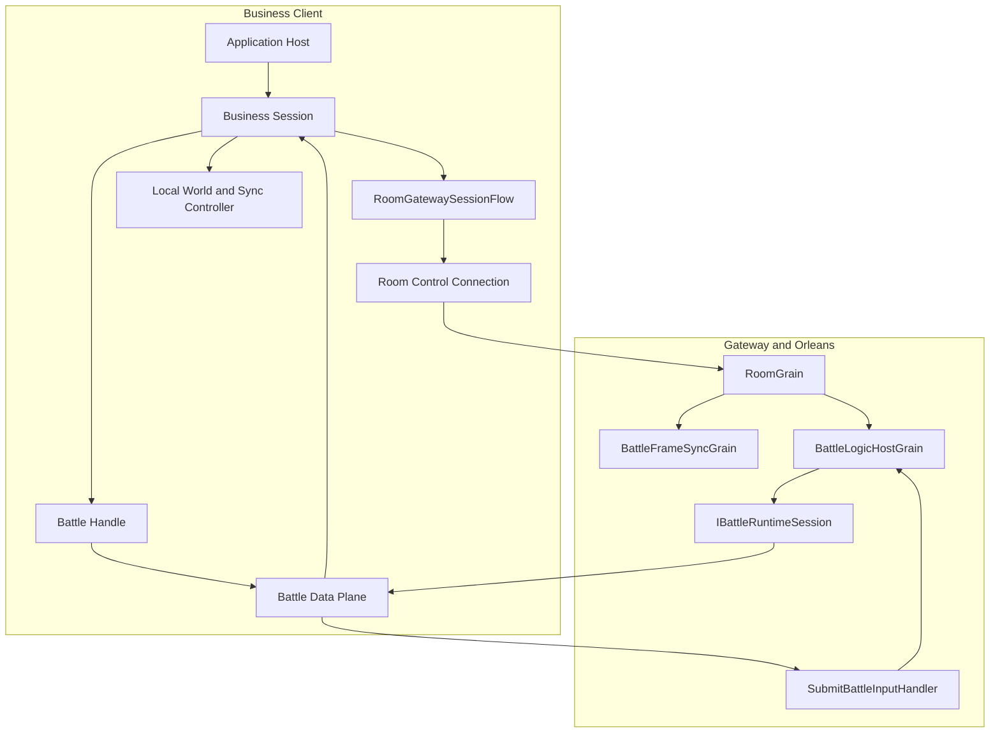

这张图强调三个边界：

1. `RoomGatewaySessionFlow` 是控制面编排工具，不是每帧 battle transport。
2. 业务 session 是 world、同步策略、连接和恢复的唯一所有者；coordinator Package 当前不提供总装器。
3. Shooter 使用独立 battle 数据面处理输入 request/response 和 push，可靠事件 ack/full-state 请求则经 Room 控制面 RPC 返回。

---

## 4. Coordinator Package 当前基线

### 4.1 当前保留内容与缺失实现面

当前 Package 可用于共享配置、host/policy 契约和数据边界，但不能直接创建或驱动一次客户端会话。已核验的 Runtime 文件集中在 `Core` 和 `Data`：

- Core：`ILogicWorldDriveGate`、`ILogicWorldDriverBridge`、`ISessionCoordinatorHost`、`ISessionCoordinatorConfigPolicy`、`ISpawnService`、会话配置与 ID。
- Data：payload codec、实体状态、帧快照、网络端点、玩家输入和 spawn data。

以下历史实现当前不存在：

- `SessionCoordinator`
- `ExistingWorldSessionCoordinatorHost`
- `SyncAdapterFactory`
- `LocalSyncAdapter`、`RemoteSyncAdapter`、`HybridSyncAdapter`
- `IRemoteBattleSyncTransport`、`NullRemoteBattleSyncTransport`

因此旧版初始化、attach、drive gate 和 adapter Tick 时序不是当前可执行链。`MobaSessionCoordinatorHost` 实现 host/policy 契约，只证明残留契约仍有消费者，不证明总装器仍存在。

### 4.2 证据成熟度

| 声明 | 证据 | 成熟度 |
|------|------|--------|
| Coordinator 配置、契约和值对象存在 | Package 源码 | E0 |
| MOBA host 实现残留契约 | 业务源码消费者 | E1/E2，限契约采用 |
| 历史 coordinator/adapter 可直接使用 | 当前无实现文件 | 不成立 |
| Console Demo 有 Local/Remote/Hybrid adapter | Console Demo 源码 | E1，限 Demo 实验路径 |
| 同步 Profile 与远端能力协商 | SDK/Room 源码、Shooter/MOBA 消费者与专项测试 | E1-E3；不代表框架提供统一同步算法 |

---

## 5. 当前客户端采用路径

### 5.1 阶段化 Room 控制面

`RoomGatewaySessionFlow` 位于 `com.abilitykit.network.room`。它面向 `IRoomGatewaySessionClient` 提供原子阶段，由业务会话决定 create、join、restore、ready、loading、start 和 subscribe 的组合顺序。它不拥有本地 world，也不驱动每帧输入或 battle push。

`GatewayMultiplayerSession.CreateAsync` 与 `RunRoomFlowAsync` 已覆盖 create/join、join 失败或异常时 fallback create、ready 前后 hook、可选 battle-start 等待和可选 Room 连接订阅。`GatewayBattleClientHost.EnterAsync` 实际消费该流程，Console `StateSyncAdapter` 又通过 Host 进入；因此“零消费者/E0”结论已经失效。

它仍只适合线性/最小流程。MOBA 的 hero-pick、loading、恢复和阶段化交互继续由 `RoomGatewaySessionFlow` 与项目状态机驱动；强行迁移到 facade 会丢失表达力。facade 是一次性 host，`Dispose` 不主动 `LeaveRoom`，重连需新建或由项目运行 staged restore。`Tick` 必须使用真实墙钟 delta。

### 5.2 Shooter 双连接业务链

Shooter 由 `ShooterClientNetworkLauncher` 先使用 Room Gateway 连接完成控制面，再根据启动结果中的 battle/world/session 身份创建新的 `NetworkTransport`：

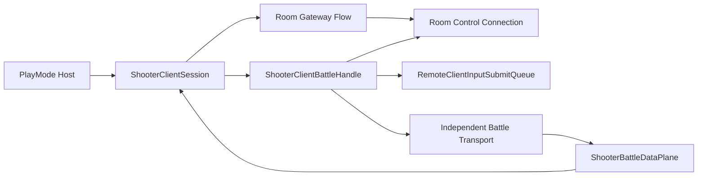

- battle transport 的 request/response 采用 inline matching，避免 awaited 输入请求依赖主线程 pump。
- battle push 在接收线程只入队；主线程 `Drain` 后才调用 session 应用，避免与本地 Tick 竞争。
- reliable event ack 和 full-state baseline/resync 通过 battle handle 使用 Room client RPC。
- `RemoteClientInputSubmitQueue` 最多保留一个在途请求和一个最新等待输入；它不拥有连接、pause、reconnect 或 dispose 生命周期，`Reset` 也不会取消底层异步请求。

### 5.3 Console Demo adapter 的所有权

`src/AbilityKit.Demo.Moba.Console/Battle/Sync` 有自己的 factory 和 Hybrid adapter。这些实现可以支持 Console 演示与实验，但命名相似不代表它们属于 `com.abilitykit.coordinator`，也不能据此声明 Unity 通用 Package 已提供完整 adapter 套件。

### 5.4 选型速查

| 场景 | 建议起点 | 采用前必须确认 |
|------|----------|----------------|
| 单机、离线验证、同进程逻辑 | 业务本地 session 或 Console Demo | world 和 Tick 唯一所有者 |
| Room 入场与恢复 | `RoomGatewaySessionFlow` 原子阶段 | snapshot 阶段、`NextStep`、可靠事件 cursor |
| 权威状态客户端 | 业务 session + 明确 transport + snapshot pipeline | 输入确认、baseline、reconnect、线程切换 |
| Shooter 双连接 | launcher、battle handle、data plane、输入队列 | 控制面与数据面身份一致；连接各自只创建一次 |
| 通用 Local/Remote/Hybrid adapter | 当前不可直接选用 | Package 中实现面缺失，需先恢复设计与验证 |

### 5.5 Profile、远端能力与可靠事件

同步会话创建顺序应固定为：解析稳定 Profile，冻结 Catalog/options，校验本地能力，再根据 Room 声明执行 schema/能力交集，最后解析 controller 并产生 descriptor。`Ignore`、`NegotiateWhenAvailable`、`Require` 是兼容策略，不是同步算法。controller factory 抛出的异常原样传播，项目应在会话入口把它转成明确的入场失败，而不是静默回退到另一套玩法。

服务端 `RoomNetworkSyncCapabilityResolver` 根据最终 template/profile 产生 metadata version 1 的 `SyncCapabilities`，并随 commit、persistent state 与 wire snapshot 流动。客户端拒绝未知 metadata version、未知策略位和 Profile 不匹配；旧服务器的空/0 metadata 转成 `null`，由 binding 明确标为 `LegacyFallback` 或 `MissingRequired`。

当前服务端投影有意隐藏部分模板字符串差异：MOBA 的规范 RoomType 是 `battle`，`moba` 是兼容别名，两者都固定声明 `Lockstep` 和 schema `0..1`；MOBA profile 只支持 `frame-sync-authority`。Shooter 默认 `state-sync-authority`，其余模板按 sync options 或最终 template 映射到 PredictRollback、AuthoritativeInterpolation、BatchStateSync、MassBattleLodSync 或 HybridHeroPrediction；pure-state 模板使用 pure-state schema 范围，其余使用 packed schema 范围。客户端应协商 capability metadata，不能把 template 名称直接当作完整能力位集合。

可靠事件的 checkpoint、权威 baseline 与重连必须由同一个会话 owner 串联。`ReliableEventSessionBuilder` 可以从显式 checkpoint 或 store 恢复，按 Profile 决定持久化和 baseline recovery，并提供 flush failure policy、retry、circuit breaker 与 diagnostics；但 store 的持久化位置、application pause/quit 调用时机、baseline RPC 和订阅连接仍由项目接线。两连接拓扑中 battle 数据面应是唯一 push 订阅者，Room 侧订阅必须关闭，否则 last-writer-wins 绑定可能把 push 抢回控制连接。

成熟度采用公司治理定义，详见[公司级采用与模块治理规范](../10-EngineeringQuality/04-CompanyAdoptionAndModuleGovernance.md)。

---

## 6. Gateway 入场流程

`RoomGatewaySessionFlow` 是依赖 `IRoomGatewaySessionClient` 的阶段化会话工具。框架公开 create/join/ready/loading/wait/subscribe/restore 原子阶段；具体示例在自己的会话层组合阶段。未稳定的 create/join/restore 聚合入口已经删除，不再维护两套流程。

### 6.1 创建房间并开战

Shooter 创建房间的业务用例按以下阶段组合：

1. 校验 `sessionToken` 和 `playerId`。
2. `CreateRoomAsync`。
3. `JoinRoomAsync`。
4. `SetReadyAsync`。
5. `BeginLoadingAsync`。
6. `ReportAssetsLoadedAsync`。
7. `WaitForBattleStartAsync`。
8. `SubscribeStateSyncAsync`。
9. 示例会话构造包含 room、battle、world、player、anchor、server ticks、entry kind 的最终结果。

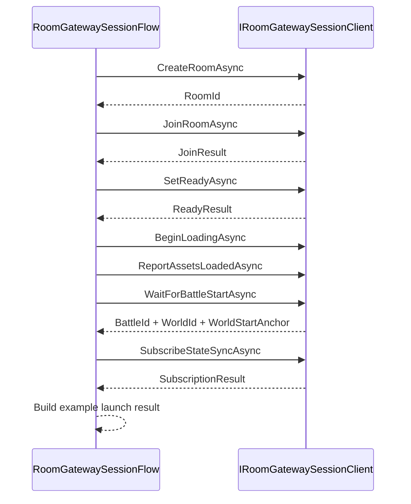

### 6.2 加入房间或运行中战斗

示例会话先调用 `JoinRoomAsync`。如果 join 结果不是 `TeamLobby`，且带 `BattleId`，说明已经是 reconnect 或 late join 到运行中战斗：

- 直接 `SubscribeStateSyncAsync`。
- 返回 `started: true`。
- 使用 join 结果中的 `WorldStartAnchor`、`WorldId`、`JoinKind`。

否则才进入 ready/loading/report/wait/subscribe。

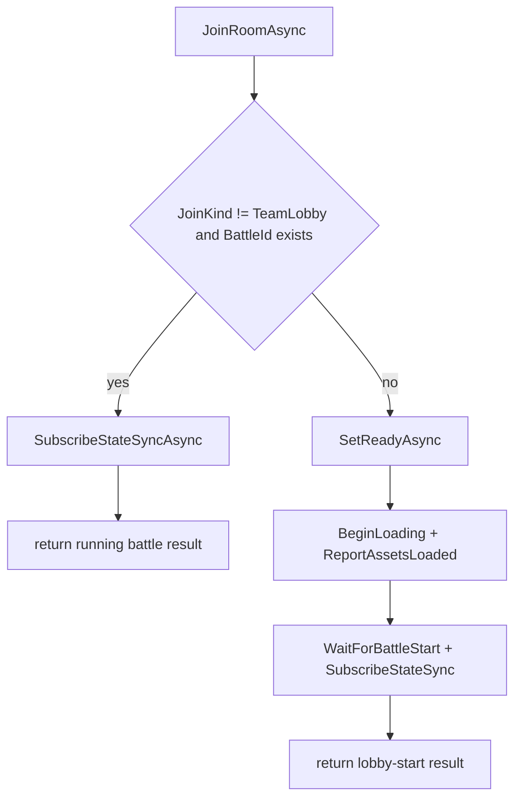

### 6.3 从任意房间阶段恢复

`RestoreAsync` 的源码步骤：

1. 校验 session token、region、serverId、playerId。
2. 调用底层 `RestoreRoomAsync(sessionToken, region, serverId)` 恢复成员关系。
3. active room 存在时读取一次 `GetSnapshotAsync`；请求失败时用 restore 响应合成最小快照。
4. 根据快照阶段返回 `RoomGatewayStagedRestoreNextStep`。
5. 结果同时保留 snapshot、entry kind、can start、restore status/error code 和服务器时间。

示例会话根据 `NextStep` 从正确位置继续：Lobby 从 ready/loading 开始，Loading 只补资源上报，Starting 只等待开战，InBattle 直接订阅。最终订阅携带 `eventEpoch` 和 `lastEventAck`，不会因阶段恢复丢失可靠事件游标。

---

## 7. Room 与 Battle 服务端协调

### 7.1 `RoomGrain` 的职责

`RoomGrain` 持有：

- `RoomPersistentState`：summary、phase、members、launch generation、gameplay state、BattleCommit、revision 和 event sequence 的持久化事实。
- `IRoomGameplayAdapter` 与恢复后的玩法状态：只承接 Room 阶段的项目差异。
- `RoomMemberTracker` 及 `_battleId/_worldId/_worldStartAnchor` 的 activation 投影：服务运行缓存，不替代持久化事实。
- Room push binding 与遗弃清理 timer：分别负责在线状态传播和全部客户端离线后的收敛。

关键 API：

| API | 行为 |
|-----|------|
| `JoinMemberAsync` | 加入房间；如果已在战斗中，区分 reconnect 和 late join |
| `RestoreAsync` | 根据账号恢复 active room/battle 状态 |
| `SetReadyAsync` | 设置准备状态 |
| `SubmitGameplayCommandAsync` | 提交房间玩法命令 |
| `BeginLoadingWithResultAsync` / `ReportAssetsLoadedWithResultAsync` | 正式客户端 staged loading；最后一名成员上报后立即尝试 commit |
| `StartBattleAsync` | HTTP/Admin/Sandbox 兼容直启；写入 `LegacyStartBattle` 后复用同一 commit，不是正式 TCP 协议入口 |
| `GetSnapshotAsync` | 返回 RoomSnapshot |
| `MarkOfflineWithResultAsync` / `LeaveWithResultAsync` | 分别表达暂时断线与显式离场 |
| `TickAsync` | 遗弃清理、Loading 超时、局部离线淘汰和 Pending commit 恢复 |
| `CloseAsync` | owner 显式关闭房间并清理映射 |

### 7.2 开战时 Room 做什么

正式客户端先由 owner `BeginLoading` 冻结 roster 并递增 `Launch.Generation`，所有成员携带同一 generation 上报 manifest 已加载。最后一名成员上报时，Room 在同一次调用内进入 `Starting` 并执行持久化 commit；`TickAsync` 只为超时和 activation 恢复提供补偿。

commit 顺序：

1. 由 adapter 构造 `BattleInitParams`，解析最终 sync options/template。
2. 生成稳定 `CommitId=roomId:generation` 和 `InitSpecHash`，先持久化 `Pending`。
3. `RoomFrameSyncRoute` 决定是否初始化 FrameSync Grain、Battle runtime 或两者。
4. Battle 以 CommitId/InitSpecHash 幂等初始化；相同提交可重放，冲突或 hash mismatch 被拒绝。
5. 成功后持久化 `Committed/InBattle`、battleId、worldId、anchor 与 sync capabilities，再发布完整 Room snapshot。
6. 普通失败累计 attempt，最多 3 次；hash mismatch 强制进入新 generation，避免旧初始化参数被覆盖。

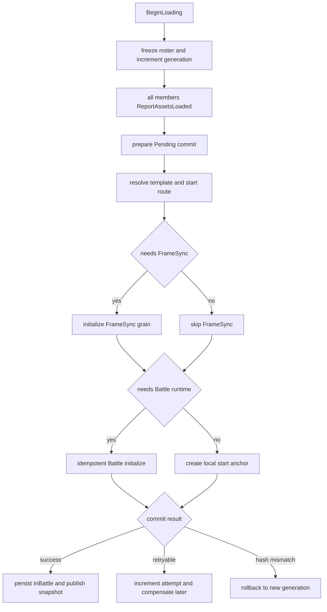

`StartBattleAsync` 仍供 HTTP/Admin/Sandbox 使用，但只是在 `LegacyStartBattle` 阶段原因下进入上述 commit；它绕过 roster loading barrier，不能作为客户端集成捷径。

### 7.3 `BattleLogicHostGrain` 的职责

`BattleLogicHostGrain` 是权威战斗主机。它持有：

- `ServerGameplayModuleCatalog`
- `BattleRuntimeRegistry`
- `BattleHostState`
- `BattleInputBuffer<BattleInputItem>`
- `BattleTickDriver<BattleInputItem>`
- `BattleObserverRegistry<IStateSyncObserverGrain>`
- `BattleSnapshotPublisher`
- `IBattleRuntimeSession`
- `WorldStartAnchor`
- sync profile/template

`InitializeBattleAsync` 的源码顺序：

1. 校验 initParams。
2. 如果已初始化，忽略重复初始化。
3. 解析 room type 对应 gameplay module。
4. 解析 sync profile/template。
5. 归一化 `BattleSyncStartOptions`。
6. 保存 worldId、tickRate、inputDelayFrames。
7. 创建 `WorldStartAnchor`。
8. 初始化 `BattleHostState`。
9. 通过 runtime registry 创建 `IBattleRuntimeSession`。
10. 调用 runtime session `Start(initParams)`。
11. 成功后置 `_initialized = true`。
12. 发布初始快照。
13. 启动 Orleans timer。

### 7.4 服务端输入调度

`SubmitInputAsync` 不直接把输入塞给 runtime，而是经过调度：

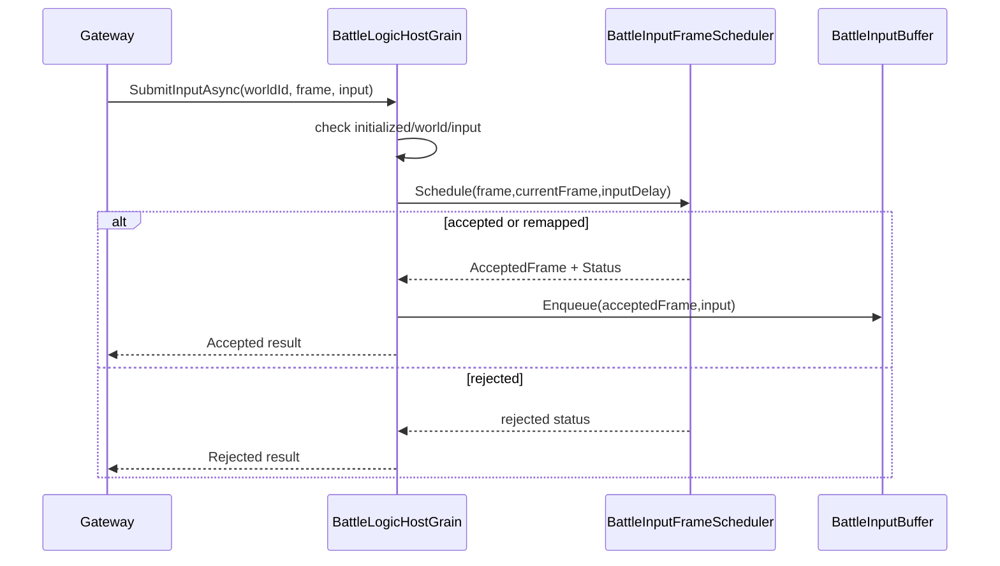

拒绝/重映射原因包括：

- battle 未初始化。
- world mismatch。
- null input。
- invalid frame。
- too far future。
- late input remapped。
- too early input remapped。
- input buffer 拒绝。

### 7.5 Battle Tick 和快照推送

`OnTickAsync` 的源码逻辑：

1. `_tickDriver.Tick(_battleHostState, _inputBuffer)`。
2. tick driver drain 输入、提交给 runtime、tick runtime。
3. 根据 `BattleSnapshotSyncPolicy.ShouldPublish` 判断是否推送。
4. 如果 runtime 支持 observer-aware，按 observer 构造状态推送。
5. 否则构造普通 `StateSyncPush`。
6. 通过 `IStateSyncObserverGrain.OnSnapshotPushedAsync` 推送。

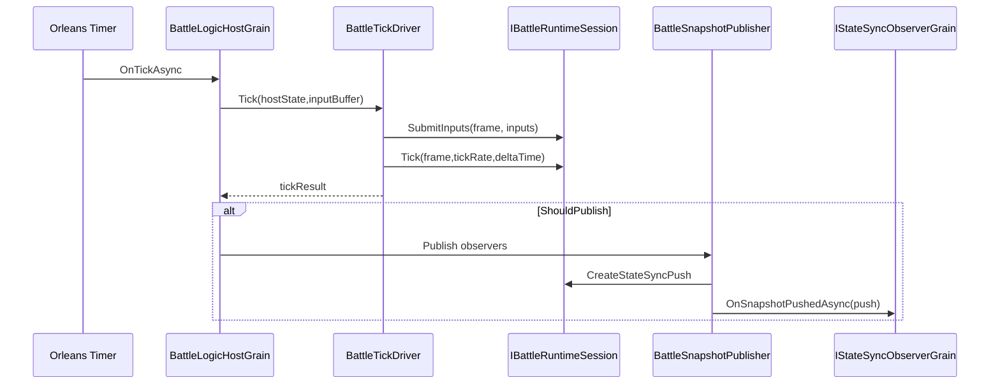

### 7.6 `BattleFrameSyncGrain`

`BattleFrameSyncGrain` 适合纯帧同步广播路线。它维护：

- `_inputsByFrame`：frame -> inputs。
- `_frame`：当前服务器帧。
- `_observers`：订阅者。
- `_tickInterval` 与 catch-up 控制。

每个 timer tick 会：

1. 计算当前是否到下一帧。
2. 最多 catch up `MaxCatchUpFramesPerTimer`。
3. 取出当前帧输入，没有则空列表。
4. 构造 `FramePushedEvent`。
5. 调用所有 observer 的 `OnFramePushed`。
6. `_frame++`。

MOBA 默认 `frame-sync-authority` 路线会同时创建 FrameSync Grain 与 Battle runtime，并由 FrameSync 驱动权威 world；Shooter 默认 `state-sync-authority` 不创建独立 FrameSync Grain。`DestroyAsync()` 会停止 timer，清 observer、输入、历史与录制状态并请求 deactivate，因此最终房间清理可以显式释放该运行时。

### 7.7 断线不是 Leave：恢复窗口与最终清理

`GatewayTransportHandler.OnClosed()` 会取消旧连接请求队列并解除三类 push 订阅，但房间成员清理通过后台队列执行，且先检查账号是否已 rebound 到新连接。`GatewayRoomMembershipService` 再校验 account-room mapping，确认仍属于旧 room 后只调用 `MarkOfflineWithResultAsync()`；只有返回 `NotMember` 时才清陈旧 mapping。

这形成两级收敛：

| 场景 | Room 行为 | 会话含义 |
|------|-----------|----------|
| 单连接短暂断开 | 成员和 mapping 保留，记录 `OfflineSinceTicks` | 客户端可在宽限期内 Restore/Reconnect |
| 离线 owner 仍有在线 peer | owner 转移给最早在线成员，离线成员仍保留 | 大厅控制权连续，旧 owner 仍可重连 |
| 仍有在线客户端且某成员超期 | `TickAsync` 按 offline grace 清局部离线成员 | 活跃房间继续运行 |
| 所有真实客户端都离线 1 分钟 | 遗弃策略优先清整个房间；Bot 不阻止 | Battle、FrameSync、mapping、directory、store 最终释放 |

遗弃 deadline 取最后一名真实客户端的离线时间加 1 分钟。Room 在 activation 恢复和每次持久化后重算一次性 timer，`TickAsync` 使用相同 policy 兜底；任一真实客户端重连会让条件失效。清理跨多个 Grain/store，按 Battle Destroy、FrameSync Destroy、mapping、directory、runtime state 顺序执行，失败 30 秒后重试但不回滚已完成步骤。因此 session 恢复必须把“宽限期内可重连”和“到期后 RoomExpired”作为显式分支，不能无限重试同一个 roomId。

---

## 8. 端侧帧包适配

### 8.1 `FramePacketNetAdapter`

端侧收到 `FramePacket` 或聚合后的 `RemoteInputFrame`/`RemoteSnapshotFrame` 后，通过 `FramePacketNetAdapter` 进入本地输入源和快照 dispatcher。

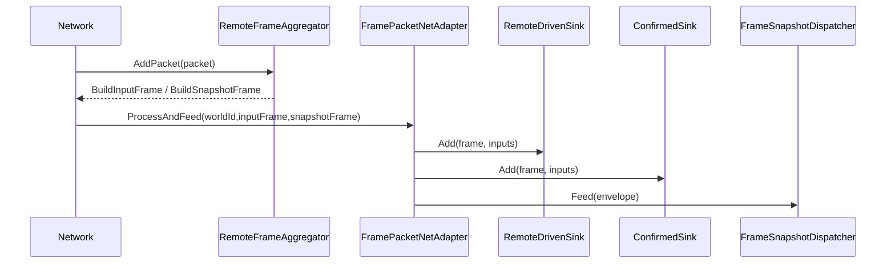

`ProcessInput` 内部会懒创建两个 `FrameJitterBuffer`：

| Buffer | delay | 用途 |
|--------|-------|------|
| `RemoteDriven` | `InputDelayFrames` | 网络驱动、插值、预测前平滑消费 |
| `Confirmed` | 0 | 服务器确认输入、对账、回滚修正 |

### 8.2 MOBA View 的封装

`BattleSessionNetAdapter` 在 MOBA View 包中包装通用 `FramePacketNetAdapter`。它的 `AdapterContext` 把 Demo 自己的 `IBattleSessionNetAdapterContext` 映射到通用 `IFramePacketNetAdapterContext`。

额外行为是更新 jitter buffer 调试统计：

- delay frames
- missing mode
- target frame
- max received frame
- last consumed frame
- buffered count
- duplicate/late/consumed/default-filled count

这说明通用 adapter 不负责 UI 诊断，Demo view 可以在外层读取 buffer 统计并展示。

---

## 9. 完整会话时序

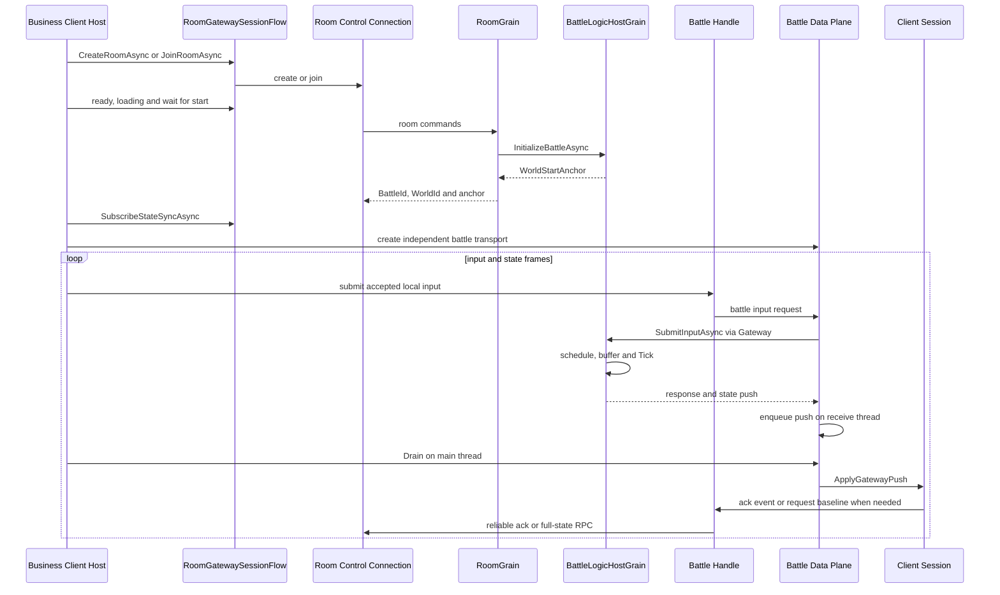

这个时序把“控制面”和“数据面”分开：

- Room 控制面由 create/join、ready、loading、wait-for-start、subscribe 和 restore 原子阶段组成。
- Shooter 在获得 room/battle/world/anchor 后建立独立 battle transport；它不是 `RoomGatewaySessionFlow` 内部连接的别名。
- push 先跨线程入队，再由主线程 `Drain` 应用；输入 response inline 匹配，不等待主线程 pump。
- ack 与 baseline/resync 使用控制面 RPC，使恢复动作仍受 room session 身份约束。

---

## 10. 恢复、晚加入与已有 world 接入

### 10.1 Reconnect 和 LateJoin

`RoomGrain.JoinMemberAsync` 在房间已经处于 InBattle 时：

- 如果成员已存在，返回 `RoomJoinKind.Reconnect`。
- 如果不是成员但房间未满，会加入成员、调用 gameplay join、执行 `JoinRunningBattleAsync`，成功后返回 `RoomJoinKind.LateJoin`。
- `JoinRunningBattleAsync` 会通过 gameplay 构造 late join player，再调用 `BattleLogicHostGrain.JoinPlayerAsync`。
- 如果 battle 拒绝 late join，会回滚 Room 成员和玩法状态。

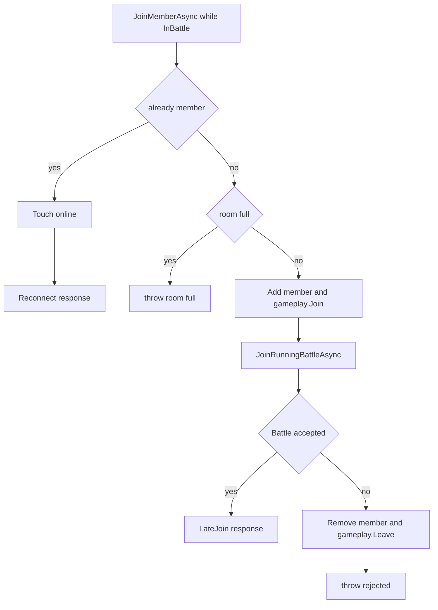

### 10.2 Restore

`RoomGrain.RestoreAsync` 先确认账号是成员，再 touch online，返回 `RestoreRoomResponse`：

- 如果没有 `_battleId`，join kind 是 `TeamLobby`。
- 如果已有 `_battleId`，join kind 是 `Reconnect`，`IsInBattle` 为 true。

`RoomGatewaySessionFlow.RestoreAsync` 会再读取房间快照并返回阶段化 `NextStep`。因此客户端既能恢复运行中战斗，也能从 Lobby、Loading、Starting 继续，不需要回退到整条聚合启动流程。

MOBA 的 `MultiplayerRoomFlowController.RestoreAsync` 只根据 `NextStep` 定位业务状态：Lobby 对应 `InLobby`，Loading 对应 `LoadingAssets`，Starting 对应 `WaitingForBattle`，InBattle 对应 `InBattle`。恢复本身不会重放 ready、begin-loading、assets-loaded 或 wait 请求；后续动作仍由各状态的显式入口触发。状态同步订阅继续由 `BattleSessionFeature` 持有，房间恢复层不会建立第二套订阅生命周期。

恢复失败使用结构化诊断而不是统一抛出 `InvalidOperationException`。`NoActiveRoom`、`NotMember`、`RoomClosed`、`RoomExpired`、`InvalidSession`、`Timeout` 和 `Failed/InternalError` 会保留到示例结果；`Timeout` 与内部错误标记为可重试，调用者取消仍保持取消语义并直接抛出。

### 10.3 通用恢复原语与项目动作

`NetworkSessionRecoveryCoordinator`、`NetworkSessionRecoveryActionRouter<TResult>` 和 `NetworkSessionRecoveryRuntime<TResult>` 已形成可复用的“信号 -> 决策 -> 动作执行”链。runtime 支持 Automatic/Manual 两种模式，重置或新决策可取消旧执行，并以 generation 阻止 superseded/reset 后的陈旧完成覆盖新会话；诊断会分别记录当前决策、执行状态和 generation。

| 消费者 | 执行模式 | 注册动作 | 项目所有权 |
|--------|----------|----------|------------|
| Shooter `ShooterClientBattleHandle` | Manual | `RequestFullSnapshot`、`RestoreReliableEventBaseline` | 两类动作都进入 Shooter full-state RPC，并保留 single-flight/timeout/request key 语义 |
| MOBA `MultiplayerGatewayRecoveryRuntime` | Automatic | `WaitForReconnect`、`RebuildSession` | 重连后恢复 Room，解释 `NextStep`，不恢复战斗 world 状态 |
| MOBA `AuthoritativeStateRecoveryRuntime` | coordinator + action router 手动执行 | full snapshot、reliable baseline | 按项目 generation 重置权威快照、插值和可靠事件，再请求全量状态 |

共享的是决策、路由、取消和诊断机制，不是业务恢复脚本。Room restore、full-state RPC、reliable baseline 的协议映射以及表现重整都依赖具体游戏的状态机和 payload，必须留在项目 handler；框架不应提供一个假定所有战斗相同的开箱恢复应用层。

### 10.4 已有 world 的唯一所有权

当前没有 `ExistingWorldSessionCoordinatorHost`。已有 world 的客户端必须由业务 session 明确承担创建、Tick、销毁和网络恢复责任，不能从旧文档复制 overlay host 接法。

Shooter 当前由 `ShooterClientSession`、`ShooterClientNetworkLauncher`、Room 控制连接和独立 battle 数据面共同持有 world、房间、快照订阅、预测与重连生命周期：

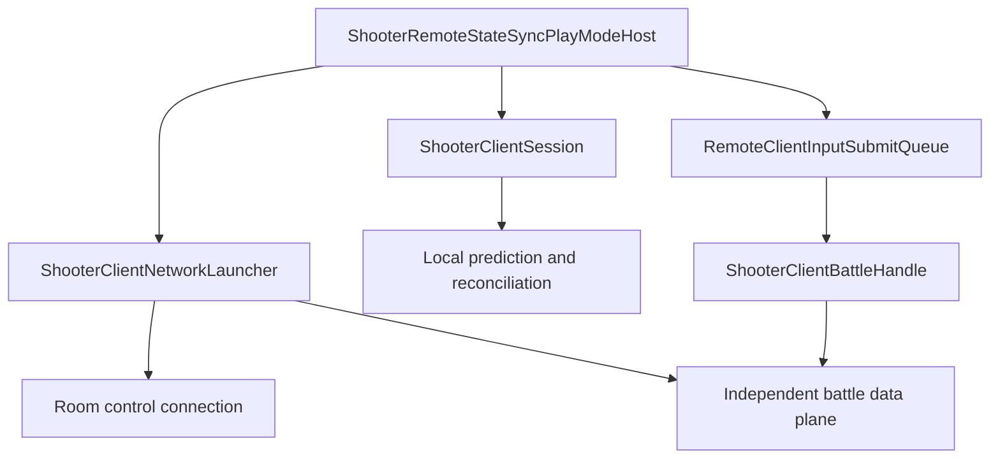

该边界避免为了转发一次已接受输入而创建第二套 world、连接和 Tick。Shooter 仍复用框架 `RemoteClientInputSubmitQueue` 的背压、最新值替换和诊断能力；协议提交、ack 与 full-state 恢复留在 `ShooterClientBattleHandle`。

当前 `ShooterClientBattleHandle` 内部持有 recovery runtime，但 handle 本身未实现 `IDisposable`，launcher teardown 也没有对该 runtime 执行显式 reset/dispose。现有 runtime 能抑制被新决策取代的完成，但 session/launcher 结束时缺少清晰的 handle 生命周期边界；在补齐所有权前，应避免让 teardown 与在途 full-state recovery 并发，并以专项测试锁定取消和代次收口。这里是生命周期契约缺口，不直接等同于已经发生资源泄漏。

---

## 11. 设计意图

### 11.1 业务 Session 管本地装配，连接对象管外部通信

当前 coordinator Package 不提供会话总装器。现役客户端应由业务 session 统一拥有 world 与同步控制器，并把 Room 控制连接和 battle 数据连接限制在各自协议边界内。

### 11.2 Gateway Flow 管入场脚本，不管每帧输入

`RoomGatewaySessionFlow` 适合 create/join/ready/loading/start/subscribe/restore 这种阶段性操作。每帧输入的出口由业务会话所有者决定；Shooter 走框架提交队列到 `ShooterClientBattleHandle`，再进入独立 battle transport。每种连接和 world 都只能有一个生命周期所有者。

### 11.3 Room 管成员和恢复，Battle 管权威模拟

Room 如果直接 Tick 战斗，会混入成员清理、目录通知、玩法房间状态等非战斗职责。Battle 如果直接管理成员映射和大厅恢复，会污染权威 Tick。拆成两个 Grain 能让生命周期更清晰。

### 11.4 FramePacket 让端侧消费协议中立

客户端最终需要的是某一帧的输入和快照，而不是某个 Gateway DTO。`FramePacketNetAdapter` 消费 `FramePacket`/`RemoteInputFrame`/`RemoteSnapshotFrame`，保持输入源、快照 dispatcher 和传输协议分离。

### 11.5 已有 world 必须由业务会话显式接管

真实项目经常先有自己的 world 或 runtime bootstrap。当前没有通用 existing-world coordinator host；集成方必须在业务 session 中明确 world 的创建、推进、恢复和释放，并用测试防止双 Tick 或重复销毁。

---

## 12. 风险与检查点

| 风险 | 表现 | 检查点 |
|------|------|--------|
| 把历史 adapter 当作当前实现 | 集成代码引用不存在的 Local/Remote/Hybrid adapter | 对照当前 coordinator Package 文件清单；Console Demo 实现单独标注 |
| 继续调用已删除聚合入口 | 文档或业务代码假定 create/join/restore 一次完成所有阶段 | 只使用阶段化原子入口，并按 room snapshot 或 `NextStep` 推进 |
| 重复创建会话协调层 | 只为输入转发又启动一套 Coordinator、transport 和 Tick | 先确认现有 session 是否已经拥有连接、预测、快照与重连生命周期 |
| 控制面/数据面身份不一致 | battle 请求使用错误 token、battle、world 或 player | `ShooterClientBattleHandle` 创建时校验四类身份 |
| 已有 world 被重复创建 | 客户端出现两个逻辑世界或双 Tick | 业务 session 是 world 唯一所有者，并覆盖启动/恢复/释放测试 |
| Room/Battle 边界混乱 | 晚加入、恢复、权威 Tick 互相影响 | Room 只管成员/生命周期，Battle 只管 runtime/Tick |
| 恢复 cursor 丢失 | 重连后可靠事件重复或遗漏 | InBattle restore/subscribe 保留 `eventEpoch` 与 `lastEventAck`，由唯一订阅所有者推进确认 |
| 恢复 runtime 跨 session 存活 | 旧 full-state/Room restore 在新 generation 完成 | owner 在切换时 reset/dispose，保留 generation/stale completion 诊断；Shooter handle teardown 仍需补显式边界 |
| 把房间恢复等同 FrameSync CatchUp | Room 已恢复但本地预测世界仍缺帧 | 分别验证 room/session restore、StateSync baseline 和 FrameSync CatchUp；`FrameSyncCatchUpClientModule` 当前仍未接入 reconnect 主链 |
| 输入帧落点不一致 | 客户端请求帧与服务端接受帧不同步 | 检查 `BattleInputSubmitResult.AcceptedFrame` 和 `Status` |
| 快照订阅缺失 | 战斗开始后客户端没有状态推送 | Gateway flow 是否调用 `SubscribeStateSyncAsync` |
| RemoteDriven/Confirmed 混用 | 预测和确认状态互相污染 | 消费者明确读取对应输入源 |
| 聚合器内存增长 | 长连接后 `_inputsByFrame` 和 `_envelopesByFrame` 变大 | 定期 `TrimBefore` |

---

## 13. 源码阅读路径

1. `Unity/Packages/com.abilitykit.coordinator/Runtime/Core`：当前保留的配置和 host/policy 契约。
2. `Unity/Packages/com.abilitykit.coordinator/Runtime/Data`：当前保留的数据对象和 codec。
3. `Unity/Packages/com.abilitykit.network.room/Runtime/RoomGatewaySessionFlow.cs`：阶段化 create/join/ready/loading/start/restore 编排。
4. `Unity/Packages/com.abilitykit.network.room/Runtime/GatewayMultiplayerSession.cs`：线性流程门面、hook、订阅开关与一次性 host 边界。
5. `Unity/Packages/com.abilitykit.demo.shooter.view.runtime/Runtime/Client/ShooterClientNetworkLauncher.cs`：Room 控制面与 battle 数据面的装配。
6. `Unity/Packages/com.abilitykit.demo.shooter.view.runtime/Runtime/Client/ShooterBattleDataPlane.cs`：push 排队和主线程 Drain。
7. `Unity/Packages/com.abilitykit.host.extension/Runtime/Client/StateSync/RemoteClientInputSubmitQueue.cs`：远端输入背压和最新值替换。
8. `Server/Orleans/src/AbilityKit.Orleans.Grains/Rooms/RoomGrain.cs`：房间和恢复语义。
9. `Server/Orleans/src/AbilityKit.Orleans.Grains/Battle/BattleLogicHostGrain.cs`：权威 Tick 和输入调度。
10. `Unity/Packages/com.abilitykit.host.extension/Runtime/Session/FramePacketNetAdapter.cs`：通用帧包如何落到输入源和快照路由。
11. `Unity/Packages/com.abilitykit.network.sdk/Runtime/NetworkSyncSessionBuilder.cs`：Profile 与远端能力协商。
12. `Unity/Packages/com.abilitykit.network.sdk/Runtime/ReliableEventSessionBuilder.cs`：checkpoint、baseline 与 flush 生命周期。
13. `Server/Orleans/src/AbilityKit.Orleans.Grains/Rooms/RoomNetworkSyncCapabilityResolver.cs`：服务端能力声明来源。
14. `Unity/Packages/com.abilitykit.network.sdk/Runtime/NetworkSyncSessionBuilder.cs`：恢复 coordinator、action router 与 runtime 的统一实现。
15. `Unity/Packages/com.abilitykit.demo.moba.view.runtime/Runtime/Game/App/Entry/MultiplayerGatewayEntryModule.cs`：MOBA Automatic Room 恢复消费者。
16. `Unity/Packages/com.abilitykit.demo.moba.view.runtime/Runtime/Game/Battle/Client/Session/Features/Net/AuthoritativeStateRecoveryRuntime.cs`：MOBA 权威状态恢复消费者。

Batch W 的 Network SDK E3 为 `96/96`；Network Room `36/36` 来自 Batch V，Gateway `162/162`、Grains `232/232`、Shooter Smoke Harness `33/33` 来自 Batch U，覆盖断线标记、rebound 防护、遗弃清理、Room metadata 和脚本契约。这些结果都没有运行 Batch W 的真实双连接抢订阅、长期持久化故障或多进程 Smoke，不能合并成新的 E4。

---

*文档版本：v3.2 | 最后更新：2026-08-16 | 文档类型：Canonical 设计*
