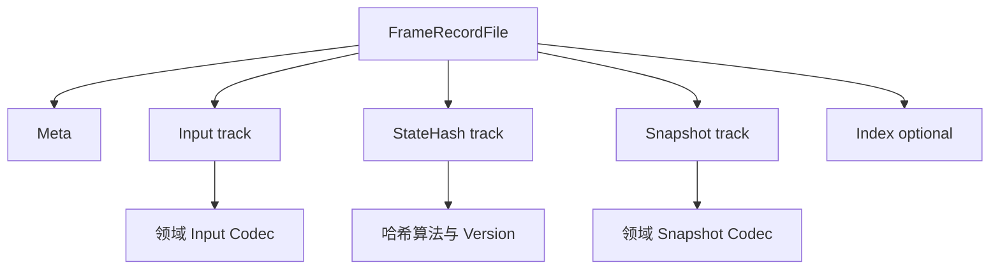
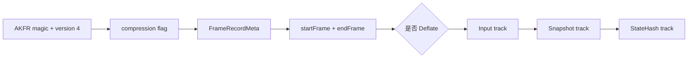
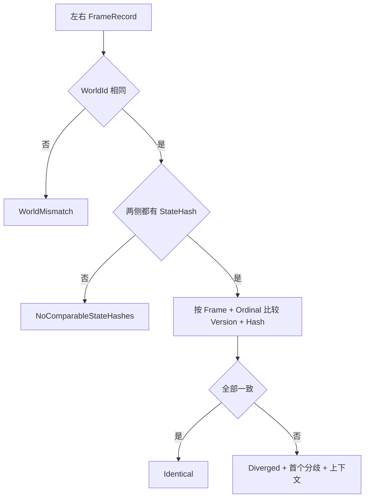
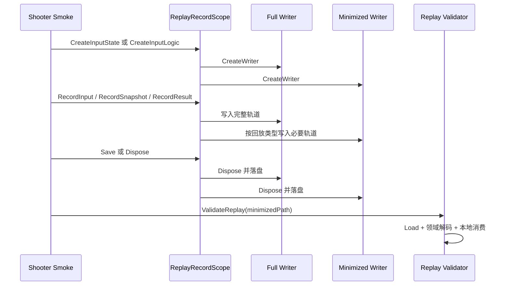

# FrameRecord 编码与 Smoke 证据链

> **文档类型：Canonical 设计**
>
> **事实基线：2026-08-16**
>
> **规范范围：** FrameRecord 内存模型、codec 兼容、diff 与 Smoke 证据分层；不把某次 artifact 当作长期协议认证。

## 一、文档定位

FrameRecord 用统一内存模型保存按帧输入、状态哈希和快照。它既可以作为回放输入，也可以在同步故障后提供首个分歧帧及其上下文。Shooter Smoke 已把记录生成、最小化、回读验证、状态哈希比较和诊断产物引用串成一条实际证据链。

本文聚焦 FrameRecord 的数据契约、编码实现和 Shooter Smoke 接入。回放系统的整体职责见 `07-NetworkSynchronization/04-ReplaySystem.md`；测试门禁和 Smoke 分层见 `10-EngineeringQuality/01-TestingWorkflow.md`。

当前实现可以支持工程诊断。Optimized Binary v4 已保留 state-hash version；reader 源码接受 v1-v4，现有 E3 fixture 则只锁定 v3 legacy 与 v4 round-trip，并拒绝未来版本和多类损坏输入。多个二进制格式仍缺少统一 codec 标识与全字段兼容矩阵，因此不能仅凭 `.bin` 扩展名或 `AKFR` magic 把文件视为同一种稳定格式。

## 二、统一内存模型

### 2.1 Meta 与三条轨道

`FrameRecordFile` 包含 Meta、Inputs、StateHashes、Snapshots 和可选 Index：

| 数据 | 关键字段 | 作用 |
|---|---|---|
| `Meta` | WorldId、WorldType、TickRate、RandomSeed、PlayerId、StartedAtUnixMs | 确定记录来源和重放环境 |
| `Inputs` | Frame、PlayerId、OpCode、PayloadBase64 | 重建确定性输入流 |
| `StateHashes` | Frame、Version、Hash | 判断同帧状态是否一致 |
| `Snapshots` | Frame、OpCode、PayloadBase64 | 恢复或验证状态同步输出 |
| `Index` | 各轨道在帧区间内的起止位置 | 预留分块读取信息，当前主要 codec 不填充 |

FrameRecord 只约束轨道外壳。输入和快照 payload 的真实结构由 OpCode 对应的领域 codec 决定，StateHash 的 Version 也由哈希生产者定义。记录可被成功解析，不代表 payload 可被当前运行时消费。

### 2.2 Writer 的提交时机

`IFrameRecordWriter` 提供 `Append()`、`AppendStateHash()` 和 `AppendSnapshot()`。现有 writer 都先在内存中积累数据，在 `Dispose()` 时创建目录并写出完整文件。

这意味着：

- 未 Dispose 的记录不能视为已经落盘。
- 进程崩溃时，当前 writer 没有增量 flush、临时文件恢复或原子 rename 保证。
- 长时间运行会让轨道持续占用内存；optimized writer 使用池化数组，但仍会按数量扩容并持有 payload 副本。
- Dispose 后继续 Append 会静默忽略，不会提示调用错误。

## 三、Codec 选择

### 3.1 默认分派

`FrameRecordCodecs.Current` 是进程级可替换入口。未显式安装 codec 时，默认实现按扩展名分派：

- `.bin` 使用 `FrameRecordOptimizedBinaryCodec`。
- 其他扩展名全部使用 JSON codec。

该分派只看文件扩展名，不探测 magic，也不回退尝试其他 codec。一个 MemoryPack 文件即使改名为 `.bin`，默认 loader 也会交给 optimized reader 并失败；JSON 文件使用非 `.bin` 扩展名则仍按 JSON 读取。

`FrameRecordCodecs.Current` 允许全局替换，但 setter 可以写入 null，下一次访问会恢复默认 codec。它没有线程同步或按文件独立选择的注册表，启动阶段应一次性安装，运行期间不应切换。

### 3.2 当前实现矩阵

| Codec | 识别方式 | 版本 | 特点 | 默认使用 |
|---|---|---:|---|---|
| JSON | 文件扩展名非 `.bin` | DTO 形态，无独立根版本 | 可读、便于样例与排障，payload 使用 Base64 | 是 |
| 基础 Binary | magic `AKFR` | 1 | 逐字段写入，保留 StateHash Version | 否，需显式实例化 |
| Optimized Binary | magic `AKFR` | writer 当前为 4；reader 实现接受 1-4，E3 仅锁定 3/4 | Deflate、帧/OpCode/Hash/Version delta、VarInt、PlayerId 表 | `.bin` 默认 |
| MemoryPack | magic `PMLR` | 1 | 整个 `FrameRecordFile` 交给 MemoryPack 序列化 | 否，需安装可选 package |

基础 Binary 与 Optimized Binary 共用 `AKFR` magic，但头部布局不同：基础格式在版本后直接写 Meta，optimized 格式在版本后先写 compression bool、Meta 和帧区间。magic 本身不足以选择 reader。

MemoryPack 通过反射查找 `MemoryPackSerializer`，依赖不可用时在首次序列化或反序列化抛出异常。`FrameRecordMemoryPackCodecInstaller.InstallAsCurrent()` 会替换全局 codec，此后扩展名不再参与选择。

## 四、Optimized Binary v4

### 4.1 文件布局

默认使用 `CompressionLevel.Fastest` 的 Deflate。压缩只包裹三条轨道，头部、Meta 和帧区间保持未压缩。

Input track 先写数量和 PlayerId 字符串表，然后依次写：

- 相对上一条记录的 frame delta。
- 相对上一条记录的 OpCode delta。
- PlayerId 表索引。
- VarInt 长度和 payload。

Snapshot track 对 frame 与 OpCode 做相同 delta 编码。StateHash track 写 frame delta、version delta 和相对上一 hash 的 delta，因此 v4 可以完整往返 `FrameRecordStateHashFrame.Version`。Signed VarInt 使用 ZigZag，payload 长度使用 unsigned VarInt。

Writer 不排序轨道。若调用方乱序 Append，负 frame delta 仍能编码和还原，但回放器是否接受乱序取决于领域校验；Shooter validator 会拒绝帧回退。

### 4.2 版本兼容与拒绝边界

Optimized reader 的源码版本分支接受 v1-v4；当前 writer 只写 v4。读取 v3 时无法从旧布局恢复当时未显式保存的 StateHash Version。v1/v2 虽位于接受范围内，但仓库没有对应 legacy fixture，因此只能声明为实现范围，不能声明为已验证兼容。reader 会拒绝未来 v5、非法版本、负 track count、越界 PlayerId index、截断 payload 和异常长度，避免在错误布局上继续解释数据。

这些防护已有 `FrameRecordOptimizedBinaryCodecTests` 覆盖，包括 v4 Version 往返、v3 兼容、未来版本、负 count、越界索引和截断输入。它们证明 v3/v4 与拒绝路径的已知格式边界，不证明 v1/v2，也不等同于 JSON、基础 Binary、Optimized Binary、MemoryPack 四种 codec 的全字段参数化兼容矩阵。

此外，基础 Binary v1 和 optimized v3/v4 共享 magic 与版本空间，却不是同一头部协议。版本号必须结合具体 codec 才有意义。

## 五、Diff 协议

### 5.1 比较键与结果

`FrameRecordDiffAnalyzer` 先检查两侧 WorldId，再将每条 StateHash 按 `(Frame, Ordinal)` 排序。Ordinal 表示同一帧内第几条哈希。比较内容包括 Version 和 Hash。

结果状态：

| 状态 | 含义 |
|---|---|
| `Identical` | 两侧存在可比较哈希，所有 `(Frame, Ordinal)` 的 Version 与 Hash 相同 |
| `Diverged` | 首个键缺失，或 Version/Hash 不同 |
| `WorldMismatch` | WorldId 不同，未进入哈希比较 |
| `NoComparableStateHashes` | 至少一侧没有哈希轨道 |

发生分歧时，报告附带首个分歧帧前后指定窗口内的 inputs、snapshots 和 hashes。Payload 不直接展开，而是输出字节数、Base64 是否有效和 SHA-256。当前 report SchemaVersion 为 `2`。

### 5.2 工具门禁

`AbilityKit.Record.Tools diff` 已有端到端测试：

- 一致返回退出码 `0` 并输出 `identical`。
- 分歧返回退出码 `1`，输出机器可读 JSON 和上下文。
- 参数错误返回退出码 `2`。

测试使用 optimized writer 生成文件并由工具加载，证明当前默认 `.bin` 路径可被 diff 工具消费。它没有验证 Inputs、Snapshots、Meta 和 StateHash Version 的 codec 全字段往返。

## 六、Shooter Smoke 记录模型

### 6.1 两类记录

Shooter 根据 `Meta.WorldType` 区分两种回放：

| 类型 | WorldType | 主要证据 | 最小记录保留内容 |
|---|---|---|---|
| InputState | `shooter.input-state-replay/{mode}` | 客户端收到的 packed 或 pure-state wire snapshots | snapshots |
| InputLogic | `shooter.input-logic-replay` | 服务端接受的 PlayerCommand 输入 | inputs |

代码仍兼容旧名称 `shooter.client-state-replay/*` 和 `shooter.server-frame-replay`。类型无法识别时，validator 拒绝回放。

`ShooterSmokeReplayRecordScope` 同时创建 full writer 和 minimized writer。它不是通用内容压缩器，而是在 Append 时按类型选择轨道：

- InputState 的最小记录写 snapshots，不写 inputs。
- InputLogic 的最小记录写 inputs，不写 snapshots。
- StateHash 只进入 full writer，当前最小记录不包含 hashes。

因此 minimized record 的目标是保留重现某类问题所需的最少轨道，不适合直接参与通用 state-hash diff。

### 6.2 生命周期

`Save()` 幂等，并通过 Dispose 两个 writer 提交文件。未配置输出路径时 Scope 返回 null，回放验证记为 skipped；Smoke 门禁是否允许 skipped 由上层场景断言决定。

## 七、Shooter 回读证据

### 7.1 InputState 验证

InputState validator 要求最小记录至少包含一个 snapshot，并逐条执行：

1. Base64 解码 wire payload。
2. 反序列化 `WireStateSyncSnapshotPush`。
3. 拒绝空 payload 和帧回退。
4. PackedState/PackedStateDelta 导入 `ShooterBattleRuntimePort`。
5. PureState/PureStateDelta 交给 pure-state controller 应用。
6. 要求至少存在可导入的 packed snapshot 或可应用的 pure-state snapshot。
7. Pure-state 链必须包含 full baseline，结束时不能仍等待 baseline resync。

最终输出消费数量、回放帧和本地状态哈希。这里的 `ReplayRoundTripMatched = true` 表示记录被完整消费并满足上述契约，不是把该哈希与另一份 FrameRecord 做通用 diff 后得到的结论。

### 7.2 InputLogic 验证

InputLogic validator 要求至少一个 input，并验证：

- 帧不回退。
- OpCode 必须是 Shooter PlayerCommand。
- payload 能解码出至少一个 command。
- 按帧聚合命令，排序玩家并构造本地 determinism spec。
- 使用固定 `1/30` 秒步长运行 `ShooterDeterminismSpecRunner`。
- Full record 中若有 server battle snapshots，则 payload 帧与记录帧一致，最后本地帧落在最后快照帧或前一帧。

结果中的 `ReplayRoundTripMatched` 来自 Shooter determinism runner，而不是 FrameRecord codec 的逐字段 round-trip 断言。

### 7.3 同帧 authoritative/client diff

Shooter 诊断产物 writer 会加载 full replay，并从同一份记录复制 inputs 与 snapshots，随后分别构造只含一条 state hash 的 authoritative 和 client 投影。

只有以下条件同时成立才保留哈希：

- 两侧 frame 都大于零。
- 两侧 frame 相同。
- 两侧 hash 都非零。

否则清空两侧哈希，让 diff 明确返回 `NoComparableStateHashes`，而不是把不同帧状态误判为同步分歧。生成的 `.diff.json`、Replay 和 minimized Replay 都以相对路径与 SHA-256 写入 Shooter 诊断产物。

这条 diff 证明的是“某次采样中，同帧 authoritative 与 client 状态是否一致”。由于两侧共享同一份上下文轨道，它不是两次独立运行的全轨道比较，也不能单独证明整场战斗确定性。

## 八、证据层级

Shooter Smoke 当前形成四层证据：

| 层级 | 产物或结果 | 能证明什么 |
|---|---|---|
| L1 结构 | FrameRecord 可加载、轨道计数和帧范围 | 文件存在且外壳可读 |
| L2 领域消费 | InputState 或 InputLogic validator 成功 | payload 可由当前 Shooter 运行时消费 |
| L3 本地重放 | replay frame、state hash、round-trip matched | 最小记录可驱动指定本地流程 |
| L4 同帧比较 | diff status、首个分歧、上下文和 SHA-256 | 一次 authoritative/client 同帧采样是否一致且产物可追溯 |

不能把 L1 成功表述为 L3 或 L4。Smoke 结果应至少同时记录 replay kind、输入/快照/哈希数量、首尾帧、领域 OpCode 分布、消费状态、round-trip 状态、diff status 和产物 SHA-256。

## 九、当前风险与待补测试

| 优先级 | 问题或测试 |
|---|---|
| P0 | 为 JSON、基础 Binary、Optimized Binary 和 MemoryPack 建立 Meta、Inputs、Snapshots、StateHashes 全字段 round-trip 参数化测试 |
| P0 | 明确基础 Binary 与 Optimized Binary 共用 `AKFR` 的探测规则，或分配不同 magic/format id |
| P1 | 增加崩溃写入、临时文件和原子提交策略，避免留下看似存在但不可读的记录 |
| P1 | 锁定 Shooter minimized record 的轨道选择和 skipped 门禁语义 |
| P1 | 增加 Shooter 回放 fixture，覆盖 packed、pure-state baseline/delta、帧回退和未知 OpCode |
| P2 | 测量长局内存峰值、Deflate 耗时、文件尺寸与回读延迟 |
| P2 | 若启用 Index，定义 chunk 生成、范围查询和 codec 一致性测试 |

还需注意：

- JSON DTO 没有独立 SchemaVersion，字段兼容依赖序列化器行为。
- MemoryPack 通过反射调用 serializer，API 版本变化可能在运行时才暴露。
- 记录 payload 没有通用校验和；当前完整性主要依赖外层 artifact SHA-256。
- StateHash 为零在 Shooter 中常被用作“不可比较”占位，不能当作真实状态值参与收敛结论。

## 十、源码入口

| 职责 | 文件 |
|---|---|
| FrameRecord DTO | `Unity/Packages/com.abilitykit.record/Runtime/Record/FrameRecord/FrameRecordFile.cs` |
| Codec 接口与默认分派 | `Unity/Packages/com.abilitykit.record/Runtime/Record/FrameRecord/IFrameRecordCodec.cs`、`Unity/Packages/com.abilitykit.record/Runtime/Record/FrameRecord/FrameRecordCodecs.cs` |
| JSON codec | `Unity/Packages/com.abilitykit.record/Runtime/Record/FrameRecord/FrameRecordJsonCodec.cs` |
| 基础 Binary reader/writer | `Unity/Packages/com.abilitykit.record/Runtime/Record/FrameRecord/FrameRecordBinaryReader.cs`、`FrameRecordBinaryWriter.cs` |
| Optimized Binary | `Unity/Packages/com.abilitykit.record/Runtime/Record/FrameRecord/FrameRecordOptimizedBinaryDataCodec.cs` |
| Optimized Binary 版本与损坏输入测试 | `src/AbilityKit.Record.Tests/FrameRecordOptimizedBinaryCodecTests.cs` |
| Optimized DTO 适配 | `Unity/Packages/com.abilitykit.record/Runtime/Record/FrameRecord/FrameRecordOptimizedBinaryCodec.cs` |
| MemoryPack 可选 codec | `Unity/Packages/com.abilitykit.record.memorypack/Runtime/FrameRecord/FrameRecordMemoryPackCodec.cs` |
| Diff analyzer | `Unity/Packages/com.abilitykit.record/Runtime/Record/FrameRecord/Analysis/FrameRecordDiffAnalyzer.cs` |
| Diff 与工具测试 | `src/AbilityKit.Record.Tests/FrameRecordDiffAnalyzerTests.cs` |
| Shooter 记录 Scope | `Server/Orleans/src/AbilityKit.Orleans.ShooterSmoke/Runner/ShooterSmokeReplayRecordScope.cs` |
| Shooter 回放类型 | `Server/Orleans/src/AbilityKit.Orleans.ShooterSmoke/Runner/ShooterSmokeReplayTypes.cs` |
| Shooter 回读验证 | `Server/Orleans/src/AbilityKit.Orleans.ShooterSmoke/Runner/ShooterSmokeReplayValidation.cs` |
| Shooter 诊断与 diff 产物 | `Server/Orleans/src/AbilityKit.Orleans.ShooterSmoke/Runner/ShooterSmokeDiagnosticArtifact.cs` |

## 十一、结论

FrameRecord 已提供统一轨道模型、多个 codec、状态哈希 diff 工具和 Shooter Smoke 的实际回放证据链。Shooter 的 InputState 与 InputLogic 最小记录分别服务状态消费和逻辑重放，诊断产物再用同帧 authoritative/client hash 生成可追溯 diff。

Optimized Binary v4 已修复 StateHash Version 往返，并建立 v3 兼容及未来版本、负 count、越界索引、截断数据的拒绝测试；v1/v2 仍只有 reader 实现分支，没有 legacy fixture。当前主要协议风险转为格式身份、跨 codec 全字段矩阵和写入原子性：两个 `AKFR` 布局仍并存，默认分派仍依赖扩展名，writer 仍在 Dispose 时一次性提交。完成这些 P0/P1 项后，才能把 `.bin` FrameRecord 提升为稳定的长期回归协议。

本轮 `AbilityKit.Record.Tests` 23/23 通过，覆盖当前 codec/diff/标识等 E3 契约；其中 `RecordIdHash` 有专项测试。该结果没有执行 Shooter Smoke，也不提升 artifact 到 E4 或 workflow 到 E5。writer 当前写 v4、reader 支持 v1-v4，兼容声明必须同时写明容器版本、state hash schema version 和领域 payload codec。

---

*文档版本：v3.2 | 最后更新：2026-08-16 | 文档类型：Canonical 设计*
