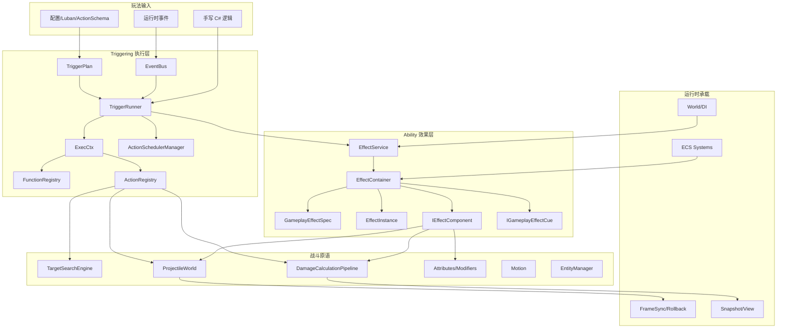
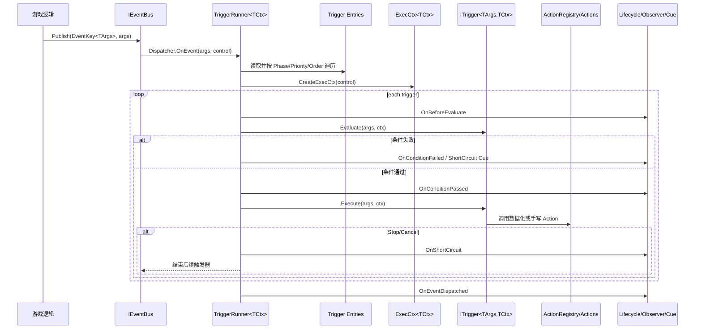
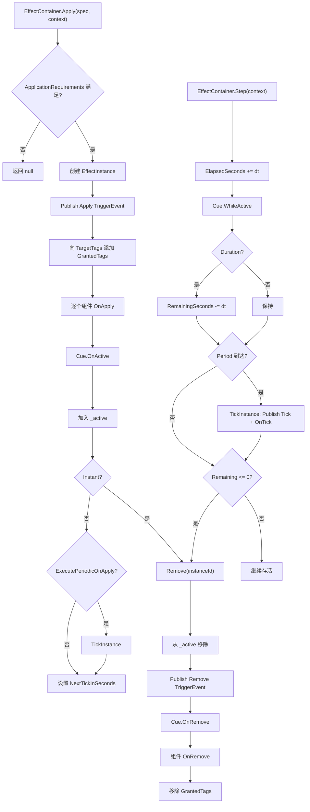
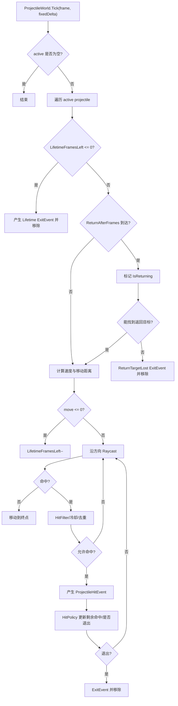
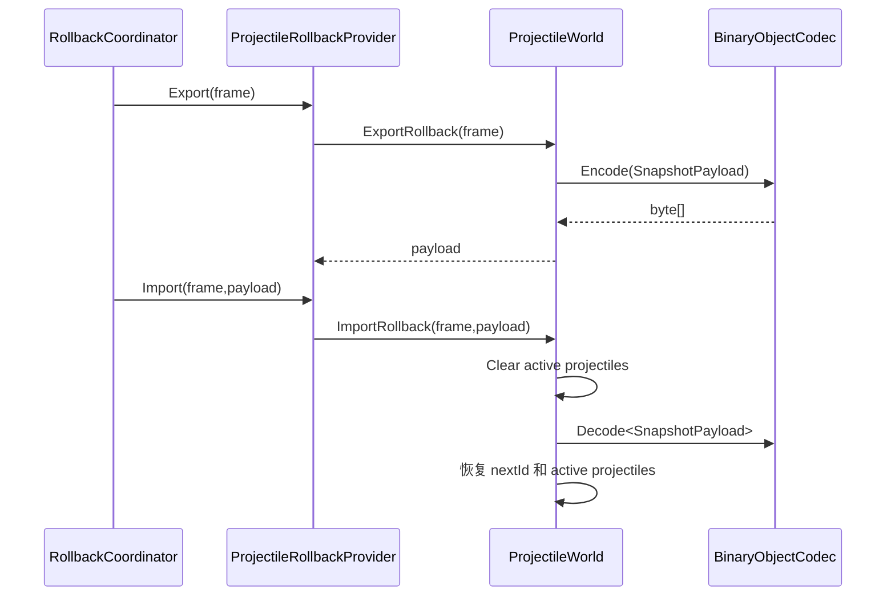
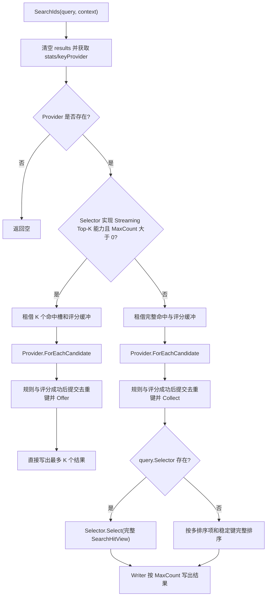
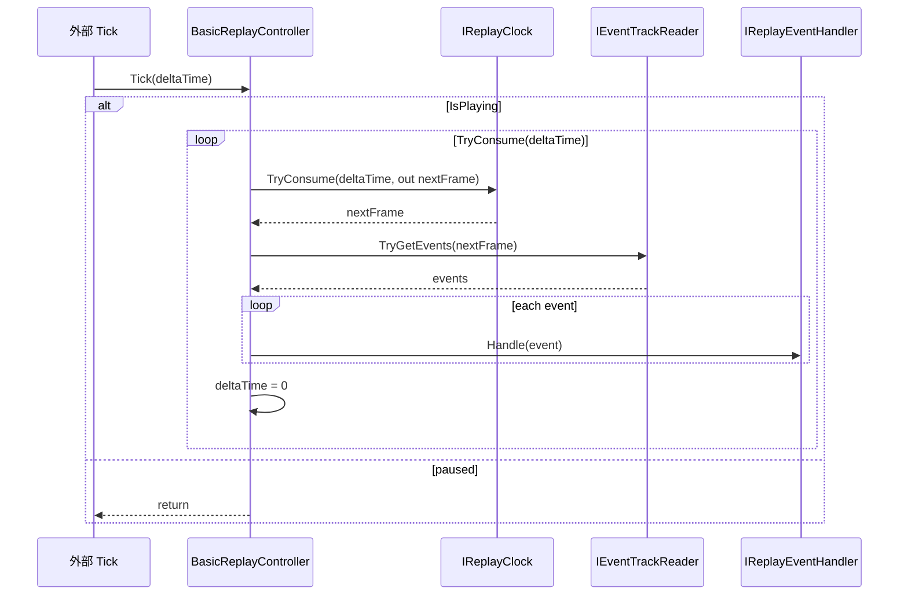
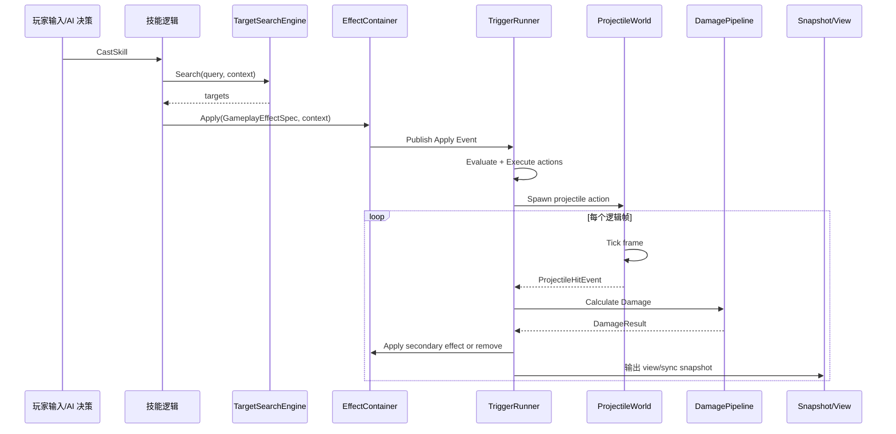

# 玩法能力地图

> 文档类型：玩法能力导航与组合边界
> 事实基线：2026-08-16
> 文档版本：v3.2
>
AbilityKit 的玩法层不是一个单体技能系统，而是一组可组合的战斗表达原语：Triggering 负责“事件-条件-动作”执行，Ability 负责 GameplayEffect 生命周期，Combat 包提供投射物、目标搜索、伤害、运动和实体管理等领域原语，Config/CodeGen 负责把配置转为可执行计划。

---

## 1. 玩法层总体结构

### 1.1 框架原语与项目应用层

玩法层采用“稳定原语下沉、易变策略上留”的边界。复杂战斗不是通过一个公共 `BattleApplication` 类解决，而是由项目应用层组合 Triggering、Ability、Continuous 和 `combat.*` 原语完成。

| 责任 | 框架层提供 | 项目应用层负责 | MOBA 示例中的代表实现 |
|------|------------|----------------|------------------------|
| 输入语义 | Pipeline 的阶段、暂停、中断和终态 | Press/Hold/Release 如何映射技能、输入失败如何反馈 | `SkillCastCoordinator`、技能输入处理器 |
| 规则执行 | EventBus、TriggerPlan、Action/Function Registry、ExecCtx | 事件 ID、payload、条件、动作注册和失败政策 | `MobaTriggerExecutionGateway`、PlanAction modules |
| 持续生命周期 | `IContinuous`、Manager、Policy、暂停/恢复/终止契约 | Buff、引导、光环、位移等领域对象怎样绑定生命周期 | Buff/Passive/Motion continuous runtimes |
| 目标与结算 | Targeting、Damage、Projectile、Motion 等原语 | 阵营、免疫、命中、护盾、资源、死亡和复活规则 | `MobaTargetQueryFactories`、`MobaDamageService` |
| 上下文与诊断 | Context、Trace、Record、Snapshot 端口 | 业务来源类型、Actor 身份、归因字段和展示粒度 | `MobaTraceRegistry`、snapshot emitters |
| 装配与驱动 | World.DI、Host、System、固定 Tick | 服务注册、System 顺序、World profile 和 readiness gate | `MobaBattleWorldBlueprint`、Bootstrap module |

上表中的 MOBA 类型不是框架缺失实现的临时替代品。它们包含技能资源、阵营、Actor、Entitas、配置表和表现协议等项目决策，默认归示例应用层所有。其他项目可以复用其组织思路，但应重新建立自己的领域入口和失败语义。

### 1.2 能力下沉判定

一段示例应用代码只有同时满足以下条件，才适合从 Demo 晋升为框架能力：

1. **语义稳定**：不同类型游戏对它的状态、终态和失败有相同理解。
2. **依赖可反转**：不依赖具体 Actor、配置表、ECS 组件、资源或表现协议。
3. **所有权明确**：创建、Tick、取消、销毁、回滚和异常清理能够形成闭合契约。
4. **扩展成本受控**：不需要大量布尔开关、回调和服务定位来覆盖项目差异。
5. **交叉验证**：至少由第二类非同构示例或真实项目证明可复用。

若只满足“多个项目大概都有这段代码”，但控制流和策略需要被大幅修改，更适合保留为 Recipe、Starter 或示例源码，而不是发布为运行时依赖。

### 1.3 专题覆盖矩阵

本地图后续章节只展开最具代表性的执行链，不意味着未单列章节的能力缺失。玩法专题的完整导航如下：

| 能力 | 公共包或核心入口 | 专题 | 当前成熟度边界 |
|------|------------------|------|----------------|
| 技能组织 | `pipeline`、`ability`、项目 cast coordinator | [01-SkillSystemArchitecture](01-SkillSystemArchitecture.md) | 公共阶段/Pipeline 可复用；施法事务与技能槽属于项目层 |
| 触发规则 | `triggering` | [02-TriggeringSystem](02-TriggeringSystem.md) | 公共执行器有专项测试；事件目录和 Action 语义由项目提供 |
| Buff | `ability`、`continuous` 与项目 runtime | [03-BuffSystem](03-BuffSystem.md) | 没有统一跨游戏 Buff 应用层 |
| Projectile | `combat.projectile` | [04-ProjectileSystem](04-ProjectileSystem.md) | 公共运动/命中/回滚原语与项目命中结算分离 |
| Attribute/Modifier | `attributes`、`modifiers` | [05-AttributeSystem](05-AttributeSystem.md) | 数值容器可复用；属性目录和刷新策略由项目拥有 |
| Damage | `combat.damage`、`dataflow` | [06-DamageCalculation](06-DamageCalculation.md) | 公共 processor 链不定义 MOBA 护盾、死亡和归因规则 |
| Targeting | `combat.targeting` | [07-TargetingSystem](07-TargetingSystem.md) | 候选/规则/评分/选择稳定；阵营和空间查询由项目注入 |
| Ability Runtime | `pipeline`、`ability`、`triggering` | [08-PipelineAndAbilityRuntime](08-PipelineAndAbilityRuntime.md) | 组合契约可复用，不提供统一 Battle Application |
| Entity/Skill Index | `combat.entitymanager`、`combat.skilllibrary` | [09-EntityAndSkillIndexing](09-EntityAndSkillIndexing.md) | 索引原语与具体 Actor/技能身份分离 |
| Motion | `combat.motion` | [10-MotionPipeline](10-MotionPipeline.md) | 求解与生命周期原语可复用；命中/优先级属于项目策略 |
| Continuous | `continuous` | [11-ContinuousFrameworkDesign](11-ContinuousFrameworkDesign.md) | 公共生命周期 Manager；五类 MOBA runtime 是参考组合 |
| GameplayTags | `gameplaytags` | [12-GameplayTagsHierarchyAndEngineeringBoundaries](12-GameplayTagsHierarchyAndEngineeringBoundaries.md) | 层级标签与查询可复用；目录、复制和序列化仍需治理 |

### 1.4 可组合基础设施的闭环边界

公共包已经把复杂战斗需要的“执行原语”拆到了可单独组合的粒度，但这些原语并不共同承诺一次跨模块事务。本批源码复核得到的关闭边界如下：

| 基础设施 | 已提供的低成本能力 | 宿主仍必须补齐的闭环 |
|----------|--------------------|----------------------|
| Targeting | Provider/Rule/Score/Selector、稳定 Top-K、池化 Context/Result | Builder 唯一租约、失败结果不提交、自定义 Selector 子集/唯一性校验 |
| Pipeline | 跨帧阶段、组合、暂停/中断、Registry/Trace | 启动与终态回调异常隔离、活跃 run 显式关闭、context 与阶段列表最终归还 |
| Entity/Skill Index | 主表与单键/多键派生查询 | 聚合写入口、比较器统一、回填/更新失败后的重建或整体切换 |
| Motion | Source 合成、约束求解、固定步长辅助、局部快照 | Collision world、命中副作用去重、source 进度与领域 token 的完整回滚 |
| Continuous | Owner 索引、准入、状态操作、Binder | Tick/到期、Clear 前终止、批量关闭异常汇总、领域 Buff/周期/投影语义 |
| GameplayTags | 名称层级、Container/Query/Stack | 稳定目录版本、受检反序列化、Owner 来源租约快照和 Reset 句柄隔离 |
| Behavior | Decision/Executor、Manager（BTCore 适配已随第三方包退役删除） | 重入调度、Paused/全量 Shutdown、Pipeline Phase 的 Decision/Runtime 释放 |

这张表解释了为什么“工具集可以低成本组合复杂战斗”与“不提供统一应用套件”并不矛盾：框架减少的是算法、数据结构和生命周期原语的重复实现；项目仍拥有跨原语的提交顺序、失败补偿、稳定身份和关闭协议。只有这些语义在第二类非同构游戏中也保持一致时，才适合继续下沉。

---

## 2. Triggering：通用事件条件动作执行器

### 2.1 设计定位

Triggering 解决的是“玩法逻辑如何被数据化、可排序、可观察、可中断地执行”。它不内置 Buff、投射物或伤害语义，而是提供通用执行主线：

1. 订阅事件。
2. 将多个触发器按 `Phase -> Priority -> Order` 排序。
3. 为每次事件创建 `ExecCtx`。
4. 评估条件。
5. 执行动作。
6. 处理中断、生命周期回调、观察者、Cue 和延迟 ActionScheduler。

关键源码：

| 类型 | 源码 | 职责 |
|------|------|------|
| TriggerRunner | `Unity/Packages/com.abilitykit.triggering/Runtime/Triggering/Runner/TriggerRunner.cs` | 运行时主线编排器 |
| TriggerRunnerRuntimeServices | `Unity/Packages/com.abilitykit.triggering/Runtime/Triggering/Runner/TriggerRunnerRuntimeServices.cs` | 创建 ExecCtx 所需的 registry 和 resolver |
| TriggerRunnerEntry | `Unity/Packages/com.abilitykit.triggering/Runtime/Triggering/Runner/TriggerRunnerEntry.cs` | 保存 phase/priority/order 和 trigger |
| TriggerPlan | `Unity/Packages/com.abilitykit.triggering/Runtime/Plans` | 数据化触发器计划 |
| ActionSchedulerManager | `Unity/Packages/com.abilitykit.triggering/Runtime/Runtime/ActionScheduler` | 延迟动作/计划内调度 |

### 2.2 执行流程

### 2.3 设计边界

- Triggering 管“何时执行、是否执行、按什么顺序执行”。
- Ability/Combat 管“执行的业务含义是什么”。
- `ExecCtx` 是扩展点聚合对象，承载上下文、函数注册表、动作注册表、黑板、数值域和执行控制。
- `ExecutionControl` 把 StopPropagation/Cancel 等控制语义从具体 Action 中抽出，避免 Action 直接操作 Runner 内部结构。

---

## 3. Ability：GameplayEffect 生命周期

### 3.1 设计定位

Ability 包把 Triggering 和战斗原语组合成“可施加、可持续、可周期触发、可移除”的 GameplayEffect 体系。

关键源码：

| 类型 | 源码 | 职责 |
|------|------|------|
| EffectService | `Unity/Packages/com.abilitykit.ability/Runtime/Ability/Effect/EffectService.cs` | 对外发布 Effect 事件、一次性评估/执行 Trigger |
| EffectContainer | `Unity/Packages/com.abilitykit.ability/Runtime/Ability/Effect/EffectContainer.cs` | 管理 active effects、Apply/Step/Remove 生命周期 |
| GameplayEffectSpec | `Unity/Packages/com.abilitykit.ability/Runtime/Ability/Effect/GameplayEffectSpec.cs` | 效果配置规格：时长、周期、Tag、组件、Cue |
| EffectInstance | `Unity/Packages/com.abilitykit.ability/Runtime/Ability/Effect/EffectInstance.cs` | 效果运行时实例状态 |
| IEffectComponent | `Unity/Packages/com.abilitykit.ability/Runtime/Ability/Effect/IEffectComponent.cs` | OnApply/OnTick/OnRemove 组件扩展点 |

### 3.2 Apply/Step/Remove 生命周期

### 3.3 设计要点

- Apply 前先检查 Tag 需求，避免无效效果进入 active 列表。
- Apply、Tick、Remove 都会发布默认 TriggerEvent，使效果生命周期可以继续驱动 Triggering。
- 组件模型把属性修改、触发事件、投射物联动等能力从 EffectContainer 中剥离。
- `IEffectTriggeringSwitch` 允许在特定上下文关闭默认触发事件，避免递归或测试噪音。

---

## 4. Projectile：确定性投射物世界

### 4.1 设计定位

Projectile 模块提供逻辑层投射物模拟：生成、飞行、碰撞、穿透/命中策略、返回施法者、退出事件、回滚导入导出。

关键源码：

| 类型 | 源码 | 职责 |
|------|------|------|
| ProjectileWorld | `Unity/Packages/com.abilitykit.combat.projectile/Runtime/Projectile/Runtime/ProjectileWorld.cs` | 投射物集合、Tick、碰撞、回滚 |
| ProjectileSpawnParams | `Unity/Packages/com.abilitykit.combat.projectile/Runtime/Projectile/Runtime/ProjectileSpawnParams.cs` | 生成参数 |
| IProjectileHitPolicy | `Unity/Packages/com.abilitykit.combat.projectile/Runtime/Projectile/Policies/IProjectileHitPolicy.cs` | 命中后是否退出、剩余命中次数等策略 |
| IProjectileHitFilter | `Unity/Packages/com.abilitykit.combat.projectile/Runtime/Projectile/Filters/IProjectileHitFilter.cs` | 命中过滤 |
| ProjectileRollbackProvider | `Unity/Packages/com.abilitykit.combat.projectile/Runtime/Projectile/Rollback/ProjectileRollbackProvider.cs` | 接入 RollbackCoordinator |

### 4.2 Tick 流程

### 4.3 回滚设计

ProjectileWorld 自身支持 `ExportRollback(frame)` 与 `ImportRollback(frame,payload)`，导出内容包含 active projectile 列表和 `_nextId`。这使投射物可以参与帧同步回滚：

---

## 5. Targeting：候选-过滤-评分-选择流水线

Targeting 模块用于把“找目标”拆成可组合流水线：候选来源、规则过滤、评分器、选择器、结果映射。

关键源码：

| 类型 | 源码 | 职责 |
|------|------|------|
| TargetSearchEngine | `Unity/Packages/com.abilitykit.combat.targeting/Runtime/SearchTarget/Execution/TargetSearchEngine.cs` | 搜索主流程 |
| SearchQuery | `Unity/Packages/com.abilitykit.combat.targeting/Runtime/SearchTarget/Queries/SearchQuery.cs` | 查询描述 |
| SearchContext | `Unity/Packages/com.abilitykit.combat.targeting/Runtime/SearchTarget/Execution/SearchContext.cs` | 框架能力属性与包外强类型扩展数据租约 |
| ICandidateProvider | `Unity/Packages/com.abilitykit.combat.targeting/Runtime/SearchTarget/Providers/ICandidateProvider.cs` | 候选目标来源 |
| ITargetRule | `Unity/Packages/com.abilitykit.combat.targeting/Runtime/SearchTarget/Rules/ITargetRule.cs` | 过滤规则 |
| ITargetScorer | `Unity/Packages/com.abilitykit.combat.targeting/Runtime/SearchTarget/Scorers/ITargetScorer.cs` | 评分规则 |
| ITargetSelector | `Unity/Packages/com.abilitykit.combat.targeting/Runtime/SearchTarget/Selectors/ITargetSelector.cs` | 完整命中选择策略 |
| IStreamingTopKByScoreSelector | `Unity/Packages/com.abilitykit.combat.targeting/Runtime/SearchTarget/Selectors/ITargetSelector.cs` | 声明接受引擎严格 Top-K 语义的融合能力接口 |

设计要点：

- 位置、稳定键和统计是 `SearchContext` 的显式强类型属性；位置由具体 Rule 或 Scorer 按需读取，引擎不做全局 `RequiresPosition` 预检。
- 包外单次查询数据使用静态 `SearchContextKey<T>` 并由业务 facade 管理；上下文不提供通用服务定位器或整数键黑板。
- `ClearData()` 只清扩展数据，完整清理和池化归还还会清空框架能力引用，避免跨租约残留。普通构造的 Context 在 Dispose 时只清理自身，池化 Context 才归还全局池。
- 两条执行路径都只消费一次 Provider 最终推送的候选流。复合 Provider 仍可能为集合语义遍历多个来源。
- Selector 实现 `IStreamingTopKByScoreSelector` 且 `MaxCount > 0` 时，Rule、Scorer 与固定 Top-K 维护融合在候选回调中，不保存完整命中。
- 自定义 Selector 保留完整只读命中视图，用额外的 `O(H × M)` 评分存储换取加权随机、分组、采样等全局后处理能力；所有输出路径都由 Writer 强制 `MaxCount` 硬上限。
- 查询级去重键只在规则通过且全部评分有效后提交，失败候选不会抑制后续同键候选。
- 融合路径当前使用有序小数组插入，最坏约 `O(H × K × M)`，适合 K 远小于命中数的场景；并非堆式 `O(H log K)`。
- 多个排序项按声明顺序严格字典序比较，每项独立升降序，全部同分时按稳定键升序决胜。
- 池保留常规峰值容量，超阈值列表缩回初始容量，超阈值命中与评分数组释放底层存储。

---

## 6. Damage：Dataflow 伤害计算管线

Damage 模块把伤害计算拆成 Dataflow processor 链。默认管线顺序是：验证、暴击、基础伤害、加成、护甲、魔抗、最终伤害、溢出。

关键源码：

| 类型 | 源码 | 职责 |
|------|------|------|
| DamageCalculationPipeline | `Unity/Packages/com.abilitykit.combat.damage/Runtime/Damage/Processor/DamageProcessors.cs` | 默认伤害 processor 链 |
| DamageSlots | `Unity/Packages/com.abilitykit.combat.damage/Runtime/Damage/Processor/DamageProcessors.cs` | 强类型 DataflowSlot，避免魔法字符串 |
| DamageCalculationContext | `Unity/Packages/com.abilitykit.combat.damage/Runtime/Damage/Data/DamageCalculationContext.cs` | 伤害上下文与中间结果 |
| DamageData/DamageRequest/DamageResult | `Unity/Packages/com.abilitykit.combat.damage/Runtime/Damage/Data/DamageData.cs` | 输入输出数据结构 |

设计要点：

- 暴击随机值通过 `DamageSlots.CritRoll` 从上层注入，便于确定性、回放和测试。
- Processor 之间通过 `DamageCalculationContext.Result` 传递中间结果。
- `context.Abort()` 能在请求无效时停止后续计算。

---

## 7. Record/Replay 与玩法验证

Record 模块不是玩法层的一部分，但它是玩法问题复现和确定性验证的重要支撑。

关键源码：

| 类型 | 源码 | 职责 |
|------|------|------|
| BasicReplayController | `Unity/Packages/com.abilitykit.record/Runtime/Record/Core/Replay/BasicReplayController.cs` | 按 ReplayClock 消费指定帧事件并交给 handler |
| RecordContainer | `Unity/Packages/com.abilitykit.record/Runtime/Record/Core/Container/RecordContainer.cs` | 记录容器 |
| EventTrack | `Unity/Packages/com.abilitykit.record/Runtime/Record/Core/Tracks/EventTrack.cs` | 事件轨道 |
| FrameRecordSink | `Unity/Packages/com.abilitykit.record/Runtime/Record/FrameRecord/FrameRecordSink.cs` | 按帧输入记录 |

回放 Tick 流程：

---

## 8. 从一次技能释放看模块协作

这条链路说明：AbilityKit 的技能能力来自多个小模块协作，而不是由单个 Skill 类承担所有职责。这样设计的收益是：每个战斗原语都可以独立测试、独立替换，并接入帧同步、回滚和服务端运行。

*文档版本：v3.2 | 最后更新：2026-08-16 | 证据说明：当前实现与测试范围以各玩法专题和 MOBA/Shooter 示例专题为准*
