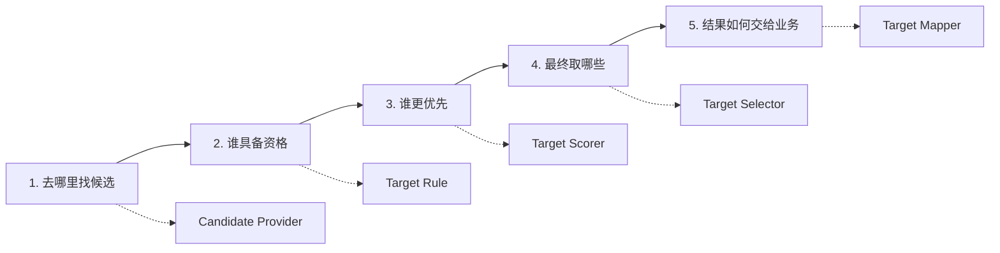
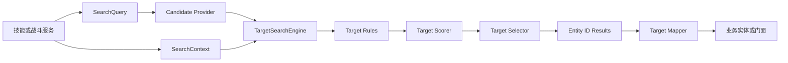
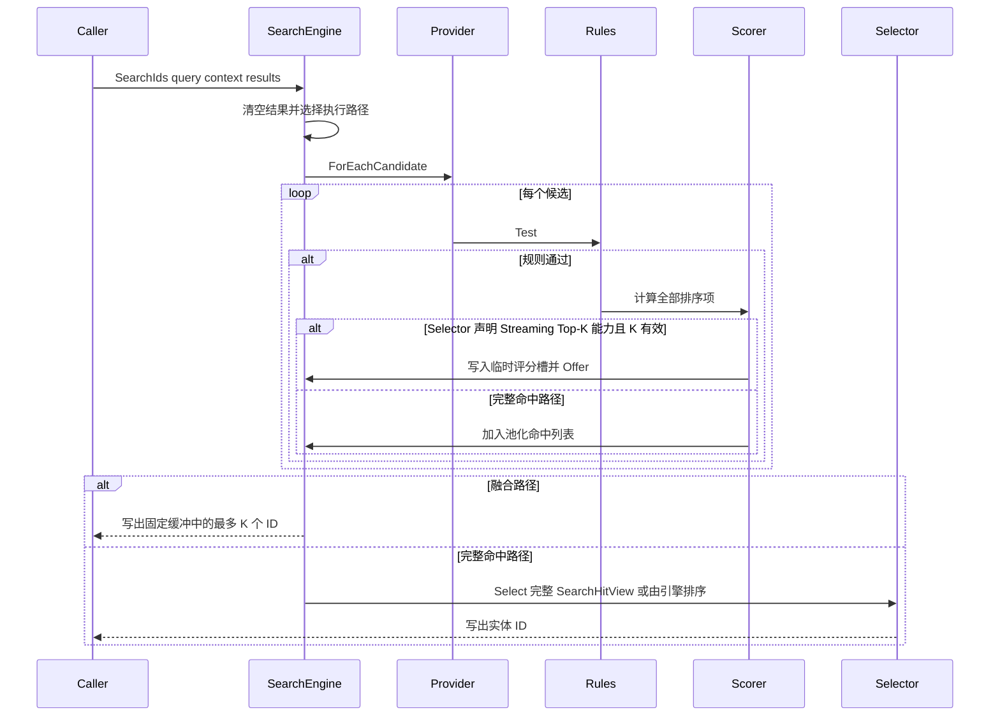
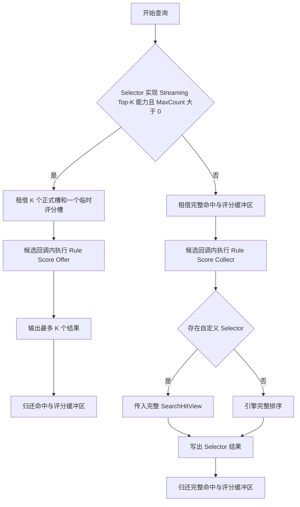
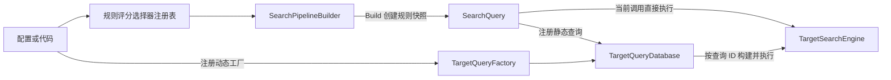

# 8.7 Targeting 目标搜索：查询管线、确定性与扩展边界

> 文档类型：Canonical 设计（Targeting 跨模块边界）
> 事实基线：2026-08-16
> 文档版本：v3.2
>
> 本文面向技能系统接入者、战斗逻辑开发者和 Targeting 扩展维护者，说明 `com.abilitykit.combat.targeting` 解决什么问题、如何把业务需求拆成查询，以及各扩展点的职责和运行边界。阅读使用部分不要求了解引擎内部池化实现；开发自定义 Provider、Rule、Scorer 或 Selector 时，再继续阅读执行、所有权和性能章节。

---

## 1. 能力定位

### 1.1 它解决什么问题

战斗中的“找目标”通常不是一个单独的距离判断，而是一组可变化的决策：

- 从哪些实体中找，例如敌方英雄、范围内单位、锁定列表或多个索引的并集。
- 哪些候选有资格，例如存活、敌对、未隐身、位于扇形内且不是施法者。
- 多个合格目标如何比较，例如先距离升序，再威胁值降序，同分时仍需稳定。
- 最终取哪些目标，例如最近 3 个、全部目标、加权随机目标或按业务分组选择。
- 调用方需要实体 ID，还是需要映射后的单位门面。

Targeting 把这些决策组织成一条可组合查询。技能不必把“遍历世界、判断资格、计算优先级、排序截断”重复写成一段专用循环；它只声明每个阶段采用哪个组件，引擎负责按统一契约执行、统计、限制结果数并清理临时资源。

典型用途包括：

| 业务需求 | 查询表达 |
|----------|----------|
| 普攻选择攻击距离内最近的敌人 | 敌方索引 Provider + 距离 Rule + 最近优先 Scorer + `Take(1)` |
| 治疗技能选择血量比例最低的 3 名友军 | 友方索引 Provider + 存活/可治疗 Rule + 血量比例升序 Scorer + `Take(3)` |
| 扇形技能命中全部合法敌人 | 可见敌人 Provider + 扇形 Rule + 无 Selector + 不限制数量 |
| 弹射技能排除已经命中的单位 | 邻近单位 Provider + 合法目标 Rule + 已命中集合的 NOT Rule |
| 在多个候选池中统一选目标 | Provider 拼接或稳定键并/交/差 + 后续统一过滤和排序 |
| 同步战斗中可重放的随机选取 | 确定种子 Scorer + 稳定实体键 + Top-K Selector |

### 1.2 一个查询的五个阶段

可以把一次目标搜索理解为依次回答五个问题：



| 阶段 | 核心协议 | 输入与输出 | 适合承载的逻辑 | 不应承载的逻辑 |
|------|----------|------------|----------------|----------------|
| 候选 | `ICandidateProvider` | 世界或索引 -> 实体 ID 流 | 遍历空间索引、阵营索引、显式列表，组合多个候选来源 | 伤害结算、复杂目标优先级 |
| 过滤 | `ITargetRule` | 单个候选 -> 通过/拒绝 | 存活、阵营、形状、黑名单、技能合法性；AND/OR/NOT 组合 | 对全部候选排序 |
| 评分 | `ITargetScorer` | 单个合格候选 -> 可比较分数 | 距离、血量、威胁、仇恨和确定性随机值 | 决定输出数量、修改实体 |
| 选择 | `ITargetSelector` | 完整命中或 Top-K 能力 -> 结果 ID | 排序截断、随机、采样、分组等集合级决策 | 重新访问或修改实体世界 |
| 映射 | `ITargetMapper<T>` | 实体 ID -> 业务对象 | 把中立 ID 解析为单位、门面或只读视图 | 延长池化结果租约、执行技能效果 |

`SearchQuery` 保存前四个阶段的声明和 `MaxCount`、排序方向、重复策略等执行选项；`SearchContext` 提供本次调用所需的位置、稳定键、统计及包外动态数据；`TargetSearchEngine` 执行查询。Mapper 是可选的输出适配器，不参与候选资格和排序。

### 1.3 从需求到组件的选择顺序

设计一条查询时，按以下顺序判断通常更清晰：

1. 先缩小候选来源。能查空间或复合业务索引时，不要先遍历全世界再靠 Rule 淘汰。
2. 再写资格规则。逐候选布尔条件使用 Rule；多个来源的成员关系才使用 Provider 并、交、差。
3. 决定是否需要优先级。只要求“全部合法目标”时可以不配置 Scorer；需要最近、最低血量等顺序时再添加一个或多个排序项。
4. 决定选择策略。普通稳定排序可不配置 Selector；小 K 且只需严格 Top-K 时使用 Streaming Top-K；需要观察全部命中的随机、分组或采样算法使用自定义 Selector。
5. 最后决定输出形态。热路径优先保留实体 ID，在真正需要业务对象的边界再 Mapper，并在执行效果前重新校验实体存活。

功能速查：

| 需求 | 首选能力 | 说明 |
|------|----------|------|
| 多个条件必须同时成立 | 顶层 Rule 列表或 `AndRule` | 按声明顺序短路 |
| 多个条件满足任意一个 | `OrRule` | 适合资格条件，不合并候选来源 |
| 排除一个逐候选条件 | `NotRule`、`BlacklistRule` 或 `ExcludeEntityRule` | 与 Provider 差集不是同一层语义 |
| 合并多个候选来源并保留重复 | `ConcatCandidateProvider` | 成本最低，保持来源顺序 |
| 对候选来源求集合关系 | `UnionDistinctCandidateProvider`、`IntersectCandidateProvider`、`ExceptCandidateProvider` | 按稳定实体键判断成员 |
| 严格多字段优先级 | `ScoreBy` + `ThenScoreBy` | 字典序比较，不是加权求和 |
| 只取很少的前 K 个 | `StreamingTopKByScoreSelector` + 正数 `MaxCount` | 减少完整命中存储，适合小 K |
| 需要全局命中后处理 | 自定义 `ITargetSelector` | 可读完整命中视图，输出仍受硬上限约束 |
| 配置用整数 ID 创建策略 | Rule/Scorer/Selector Registry | Attribute 或 Factory 创建组件 |
| 配置用整数 ID 执行整条查询 | `TargetQueryDatabase` | 可注册静态或按 Context 动态构建的查询 |

### 1.4 框架边界

模块以具体只读值类型 `EntityId` 和 `Vec2` 表达跨后端身份与二维坐标，并通过 `SearchContext` 的强类型能力属性按需读取世界能力，不绑定 AbilityKit 自有 ECS、Entitas 或 Svelto。项目通过 Provider、Position Provider、Key Provider 和 Mapper 接入自己的实体模型；业务 ID 的收窄或扩展只发生在包外适配边界。

| 范围 | Targeting 负责 | 业务或其他模块负责 |
|------|----------------|--------------------|
| 候选 | 定义遍历协议、组合语义和消费回调 | 空间索引、实体组、存活集合、AOI 数据及索引更新 |
| 过滤 | 顺序执行规则、短路和布尔组合 | 敌我、无敌、隐身、技能合法性等具体规则定义 |
| 评分 | 执行单项或多项严格排序分数 | 距离、血量、威胁、仇恨等业务公式及数据来源 |
| 选择 | 完整命中选择、默认排序和流式 Top-K | 技能目标数、随机/分组等特殊选择策略 |
| 结果 | ID 列表、池化结果和映射入口 | 实体生命周期复验、命令执行、伤害和效果结算 |
| 配置 | 组件 ID 注册表和查询目录 | 配置加载、版本迁移、整批热更事务和内容校验 |
| 运行保障 | 确定性决胜规则、结果硬上限、统计接口和临时资源回收 | 提供稳定输入、线程隔离、规模预算和性能验收标准 |

Targeting 的输出是“在某次世界状态与查询配置下选出的目标”，不是目标锁定生命周期。持续锁定、丢失目标、自动重选、仇恨状态、技能命中处理和效果执行应由上层战斗状态机或技能流程管理。

从资产归属看，Provider/Rule/Scorer/Selector/Mapper 的执行协议属于框架；空间索引、阵营与可见性、稳定实体键、查询目录内容和目标锁定状态属于项目；MOBA 的配置查询服务只是其中一种领域接法。新增通用组件前应先证明它不依赖项目实体模型或配置词汇，否则应留在应用层工厂中。

---

## 2. 源码入口

| 类型 | 路径 | 作用 |
|------|------|------|
| 查询执行 | `Unity/Packages/com.abilitykit.combat.targeting/Runtime/SearchTarget/Execution/TargetSearchEngine.cs` | 串联候选、规则、评分、选择和结果统计 |
| 查询定义 | `Unity/Packages/com.abilitykit.combat.targeting/Runtime/SearchTarget/Queries/SearchQuery.cs` | 保存 provider、rules 快照、scorer、selector、数量、排序方向和重复策略 |
| 上下文 | `Unity/Packages/com.abilitykit.combat.targeting/Runtime/SearchTarget/Execution/SearchContext.cs` | 提供框架能力属性与包外强类型扩展键 |
| 构建器 | `Unity/Packages/com.abilitykit.combat.targeting/Runtime/SearchTarget/Pipeline/SearchPipelineBuilder.cs` | 以链式 API 组装查询并管理规则列表租约 |
| 选择器 | `Unity/Packages/com.abilitykit.combat.targeting/Runtime/SearchTarget/Selectors/TopKSelectors.cs` | 全量排序 Top-K 与流式 Top-K |
| 查询目录 | `Unity/Packages/com.abilitykit.combat.targeting/Runtime/SearchTarget/Queries/TargetQueryDatabase.cs` | 按整数 ID 注册静态或动态查询工厂 |
| 池化 | `Unity/Packages/com.abilitykit.combat.targeting/Runtime/SearchTarget/Execution/TargetingPool.cs` | 复用上下文、命中列表、ID 列表、规则列表和命中缓冲区 |
| 注册表 | `Unity/Packages/com.abilitykit.combat.targeting/Runtime/SearchTarget/Registry/TargetRegistries.cs` | 按稳定整数 ID 创建规则、评分器和选择器 |
| MOBA 接入 | `Unity/Packages/com.abilitykit.demo.moba.runtime/Runtime/Application/Services/Search` | 配置查询构建、实体索引 provider 与技能搜索服务 |
| 纯 C# 示例 | `src/AbilityKit.Samples.Logic/Samples/Targeting/TargetingBasics.cs` | 最小搜索示例 |

包内 `Documentation~/Manual.md` 是当前运行时手册，`Documentation~/Examples.md` 提供组合示例，`Documentation~/Design/` 保存历史设计材料；本文仍以当前源码为准，接口或语义冲突时应同步修正文档。

---

## 3. 总体结构



`SearchQuery` 是只读结构，并在构造时复制规则集合，因此不会引用 Builder 的池化规则列表。策略对象本身仍可能是可变引用；只读结构和规则快照不等于线程安全，长期缓存查询时仍需保证组件生命周期稳定。

---

## 4. 查询执行流程



位置不是核心协议的全局依赖。形状规则和距离评分器在自身执行时按需读取 `SearchContext.PositionProvider`；缺少能力属性或位置数据时，由具体组件返回局部失败结果。引擎不再预检位置，也不理解某种具体世界能力。

候选处理遵循以下顺序：

1. 统计 Provider 实际产出的候选。
2. 丢弃无效 `EntityId`。
3. 从 `SearchContext.EntityKeyProvider` 获取稳定键；属性为空时使用 `EntityId.Value`。
4. 查询显式要求去重且该稳定键已由先前合格候选提交时，快速跳过当前候选。
5. 按规则列表顺序测试，第一个失败即短路。
6. 计算所有排序项；没有排序项时分数为 `0`，任一项为 `NaN` 的候选被排除。
7. 规则和全部评分成功后才提交稳定键，避免失败候选抑制后续同键候选。
8. 统计可进入选择阶段的命中。
9. Selector 实现 `IStreamingTopKByScoreSelector` 且 `MaxCount > 0` 时，在同一候选回调内维护固定 Top-K；其他情况加入池化命中列表，遍历结束后再选择。

这里的“管线分层”不等于引擎会为每条 Rule 或 Scorer 重新遍历候选。Provider 产出的最终候选流只被 Consumer 消费一次，Rule 与 Scorer 都在当前候选的回调内执行。额外工作来自三处：复合 Provider 为实现并、交、差语义而遍历多个来源；每个候选依次执行多条 Rule 与多个排序项；完整命中路径在候选遍历结束后继续扫描或排序 H 个命中。

没有 selector 时，引擎按查询的排序方向和稳定键升序排序。默认是分数降序；查询也可以明确请求分数升序。正负无穷按标准浮点比较保留在排序中。`MaxCount` 是所有输出路径的硬上限：自定义 Selector 可以读取完整命中视图，但 `SearchResultWriter` 不允许写出超过预算；`MaxCount == 0` 表示不限数量，负值在查询构造和 Builder 边界抛出 `ArgumentOutOfRangeException`。首命中短路和结果缓存不属于当前协议。

---

## 5. 完整命中与融合 Streaming Top-K



| 策略 | 空间特征 | 适用条件 | 约束 |
|------|----------|----------|------|
| `TopKByScoreSelector` | 保存 H 个命中及 H × M 个评分后排序 | 需要普通完整排序行为 | 排序约 `O(H log H × M)` |
| `IStreamingTopKByScoreSelector` 融合路径 | 只保留 K 个命中、K × M 个正式评分和 M 个临时评分 | `MaxCount > 0`、K 较小且只需引擎定义的严格 Top-K | 当前使用有序小数组插入，最坏约 `O(H × K × M)`；不是堆式 `O(H log K)` |
| 自定义 selector | 保存完整 H 个命中及评分 | 加权随机、分组、采样或其他需要全局命中视图的策略 | 在 Provider 完成后调用，获得完整只读 `SearchHitView`，输出仍受 `MaxCount` 硬限制 |
| 无 selector | 保存完整命中并由引擎排序 | 需要稳定全量结果或默认截断 | 遵守每个排序项的独立方向 |

其中 C 是 Provider 最终推送的候选数，H 是通过规则且评分有效的命中数，K 是结果上限，M 是排序项数。两条路径都只消费一次 Provider 的最终候选流，差异在于是否保留完整 H 并进行后处理。融合路径以更小空间和更少命中集合遍历换取通用性限制，适合常见的小 K；完整路径以 `O(H × M)` 评分存储换取自定义 Selector 对全局命中的观察和任意后处理能力。K 增大时应以基准数据决定继续使用有序数组，还是引入堆式 Top-K，而不能仅凭“流式”名称推断更快。

两种内置 Top-K 都使用同一字典序比较规则：逐项遵守独立升降序，全部同分时稳定键小者优先。确定性依赖 scorer、规则、provider 和 key provider 本身也是确定的；如果评分读取本地时间、非确定随机数或非权威浮点状态，Targeting 无法替调用方恢复确定性。

---

## 6. 构建、注册与查询目录

`SearchPipelineBuilder` 是 `ref struct`，用于短生命周期的栈上构建流程。第一次添加规则时会从 `TargetingPool` 租借规则列表，调用方必须在作用域结束时执行 `Dispose`。`Build` 会把规则复制进查询，因此查询可以越过 builder 生命周期保存；`BuildCopy` 保留为 obsolete 兼容入口并转发到 `Build`。Builder 还提供保留重复候选和按实体键去重的显式入口，默认选择兼容性的保留策略。

### 6.1 贯穿示例：选择范围内最近的 3 个敌人

假设一个技能的需求是：“以施法者为圆心，在可见敌人中排除施法者自身，选择距离最近的 3 个目标。”先把需求拆成查询阶段：

| 需求片段 | 组件 | 原因 |
|----------|------|------|
| 只从可见敌人中搜索 | 项目层 `visibleEnemyProvider` | 候选阶段先利用已有索引缩小规模 |
| 目标必须在技能半径内 | `CircleShapeRule` | 对每个候选做资格判断 |
| 不允许选择施法者 | `ExcludeEntityRule` | 这是逐候选排除条件 |
| 距离越近越优先 | `DistanceToEntityScorer` | 内置实现返回负距离平方，默认高分优先即最近优先 |
| 最多选择 3 个 | `StreamingTopKByScoreSelector` + `Take(3)` | K 很小，只需要严格 Top-K |

下面的代码展示从装配到执行的完整形态：

```csharp
var engine = new TargetSearchEngine();
var results = new List<EntityId>(3);

using var context = new SearchContext
{
    PositionProvider = positionProvider,
    EntityKeyProvider = entityKeyProvider
};

using var builder = SearchPipelineBuilder.Create();
builder.From(visibleEnemyProvider);
builder.Filter(new CircleShapeRule(casterPosition, skillRadius));
builder.Filter(new ExcludeEntityRule(casterId));
builder.ScoreBy(new DistanceToEntityScorer(casterId));
builder.Select(new StreamingTopKByScoreSelector());
builder.Take(3);
var query = builder.Build();

engine.SearchIds(in query, context, results);
ApplySkillToLiveTargets(results);
```

这段查询的执行含义是：Provider 推送可见敌人；每个候选依次通过圆形范围和自身排除规则；通过者计算相对施法者的负距离平方；引擎在遍历期间只保留当前最优的 3 个目标；全部同分时按 `EntityKeyProvider` 给出的稳定键升序决胜。`ApplySkillToLiveTargets` 属于项目层，执行技能前仍应重新校验 ID 对应实体是否存活及版本是否有效。

示例中的 `visibleEnemyProvider` 是项目对阵营、可见性或空间索引的适配，不由 Targeting 创建或维护。若项目只能提供全量实体，查询仍能工作，但 Rule 需要处理更多候选；生产接入应优先建立合适索引，而不是依赖过滤阶段弥补候选过宽。

查询可注册到 `TargetQueryDatabase`、跨帧保存或在 builder 释放后执行；`Build()` 已经完成规则快照。若改用返回 `SearchResult` 的重载，调用方还必须在消费完结果后释放该结果。数据库在 query ID 未注册、工厂构建失败或查询缺少 provider 时返回 `false`；空 context 或空调用方结果列表属于编程错误并抛出 `ArgumentNullException`，列表重载在查找前会先清空结果。位置服务由具体规则或评分器按需验证，生产接入仍应在启动阶段检查自己的组件装配。

仓库中的完整可运行参考位于 `src/AbilityKit.Samples.Logic/Samples/Targeting/TargetingBasics.cs`。



`TargetQueryDatabase` 为轻量并发目录：单条注册、替换、移除、清空和读取操作受锁保护，注册相同 ID 会覆盖旧工厂，传入空 factory 会移除条目。读取方在锁内取得 Factory 快照后，于锁外执行动态构建和搜索，因此正在执行的查询不受后续替换影响，用户 Factory 也不会阻塞目录写锁。目录不提供多条配置的热更事务；需要整组 query ID 原子切换时仍由项目层提供版本化目录或发布边界。动态工厂可以根据 `SearchContext` 构造查询，适合包外根据运行数据生成规则；静态工厂适合策略对象生命周期稳定的固定查询。

`SearchPipelineBuilder` 虽然是 `ref struct`，但当前 fluent 方法返回的是按值复制的 Builder，而不是 `ref this`。因此 Builder 本身也有租约别名风险：先声明 `using var builder`，再用 `builder.From(...).Filter(...).ScoreBy(...).Build()` 长链时，后续方法可能在临时副本上租借规则或排序列表，作用域结束只会 Dispose 原变量；反过来，复制一个已经拥有列表的 Builder 并分别 Dispose，又可能重复归还同一列表。推荐像上例一样始终对同一个局部变量逐句调用，禁止复制、赋值或从辅助方法返回一个已持有池化列表的 Builder。也可以把完整链的最终值直接赋给唯一的 `using var` 变量，但不能同时保留链中间副本。`Build` 只复制 Query 内容，不会转移或结束 Builder 租约。

Rule、Scorer 和 Selector Registry 支持两种通用创建方式：Attribute 类型注册适合公开无参构造组件，`RegisterFactory(id, Func<T>)` 适合参数化组件。类型与工厂共享一个整数 ID 命名空间，同一实现类型只能绑定一个 Attribute ID，并遵循首次注册生效。注册、创建和扫描状态受实例锁保护；锁内只读取 Factory 或 Type 快照，用户 Factory 和反射构造在锁外执行。扫描只在完整成功后标记完成，异常后可重试，但已完成的部分注册不会事务性回滚。工厂不接收项目配置 DTO 或具体实体世界。无公开无参构造且未注册工厂时，`Create(id)` 返回 `null`；用户 Factory 返回 null 时也原样返回，Factory 或构造函数异常则向调用方传播。调用方应在装配或配置校验阶段给出诊断；Builder 的 ID 查找失败会保持已有配置，不隐式清空排序或 Selector。

---

### 6.2 上下文边界与扩展键

`SearchContext` 不是通用服务定位器或任意业务黑板。Targeting 已知且参与核心执行的能力固定为三个强类型属性：`PositionProvider`、`EntityKeyProvider` 和 `SearchStats`。包外业务数据使用静态持有的 `SearchContextKey<T>` 读写，并应通过业务 facade 隐藏键实例；键按对象实例身份隔离，名称只用于日志诊断，因此两个同名键不会碰撞。包外长期依赖优先使用构造注入，不应把业务服务塞入上下文。

`ClearData()` 只清理包外扩展数据，适合查询工厂在保留位置、稳定键或统计能力时重置本次查询状态。`Clear()` 以及 `TargetingPool` 的 Rent/Release 生命周期会同时清空三项框架能力属性和扩展数据，确保池化上下文不会把引用或业务值带入下一次租约。强类型键约束了键身份和读写类型，但值类型存入扩展字典仍可能装箱，不代表所有访问零分配。

## 7. 生命周期与所有权

| 对象 | 建议所有者 | 生命周期要求 |
|------|------------|--------------|
| `TargetSearchEngine` | 世界级或战斗服务 | 本身无运行态，可复用 |
| 池化 `SearchContext` | 单次搜索 | 由 `TargetingPool.RentContext()` 获取；`Dispose` 或 `Release` 归还池，之后公开访问抛 `ObjectDisposedException`，旧引用不得跨线程或跨租约保存 |
| 普通 `SearchContext` | 单次搜索或串行搜索服务 | 直接构造时 `Dispose` 只清理自身，不进入全局池；允许重新配置后串行复用 |
| `SearchResult` | 调用方 | 用完必须释放或 Dispose；归还后公开访问抛 `ObjectDisposedException`，`Ids` 只读视图仅在当前租约内有效 |
| `SearchPipelineBuilder` | 当前方法作用域 | 添加规则后必须 Dispose；`Build` 已创建规则快照 |
| 普通 rule/scorer/selector | 查询定义或配置库 | 无状态实现可复用；有状态实现必须按运行隔离 |
| Streaming Top-K 能力 selector | 查询定义或策略库 | 实例不持有单次执行缓冲；融合缓冲区由引擎按查询租还 |
| `TargetQueryDatabase` | 世界级配置服务 | 单条目录操作线程安全；多条配置的事务发布和版本切换由上层负责 |

池化 Context 和 Result 使用原子租约状态，重复或并发 Release 幂等，但这不授权释放后继续使用对象。对象池复用同一实例，因此框架无法让已经保存的旧对象引用在该实例下一次租出后继续代表独立租约；调用方必须把对象及 `SearchResult.Ids` 视图限制在当前同步消费作用域。搜索结果、完整命中和 Top-K 缓冲区都在异常路径释放。Provider、rule、scorer 或 selector 仍不应把可预期的业务否决建模为异常；异常清理应由回归测试持续覆盖。

调用方提供的结果列表不具备提交事务。所有列表重载会在入口先 `Clear()`，但失败时不会恢复旧内容：普通 Provider、Rule 或 Scorer 在结果写入前失败时通常留下空列表；自定义 Selector 可以先写入若干 ID 再抛错；泛型 `Search<T>` 的 Mapper 也可以在已映射部分对象后抛错。只有返回池化 `SearchResult` 的重载会在内部搜索失败时 Dispose 临时结果，失败对象不会返回给调用方。业务层必须把异常视为“本次输出无效”，需要强提交语义时先写临时列表，成功后再替换正式结果。

---

## 8. 扩展点设计

### 8.1 Candidate Provider

Provider 应尽量利用现有实体索引或空间索引，通过 `ForEachCandidate` 推送 ID，避免先构造一个全量临时集合。它不应在遍历期间修改底层实体集合；若业务允许增删实体，应提供稳定快照或延迟结构变更。

### 8.2 Rule 与 Scorer

Rule 只做判定，Scorer 只做排序度量。昂贵且所有候选通用的计算应先写入包外强类型上下文数据，或通过组件构造注入复用长期能力，避免每条规则重复求值。规则顺序应从低成本、高淘汰率到高成本排列。

#### 8.2.1 AND、OR、NOT 组合语义

顶层 Rule 列表按声明顺序执行，任一规则返回 `false` 即停止，因此其语义严格等价于 `A AND B AND C`。空列表全部通过，空 Rule 项被跳过。运行时同时提供可嵌套的 `AndRule`、`OrRule`、`NotRule`，用于显式表达括号结构。

| 组合需求 | 内置表达方式 | 契约 |
|---|---|---|
| `A AND B AND C` | 顶层 Rule 列表，或 `new AndRule(A, B, C)` | 声明顺序求值，首个失败短路；空 AND 为 `true` |
| `A OR B` | `new OrRule(A, B)` | 声明顺序求值，首个成功短路；空 OR 为 `false` |
| `NOT A` | `new NotRule(A)` | 反转单个非空 Rule；构造时拒绝空操作数 |
| `A AND (B OR C) AND NOT D` | 嵌套 `AndRule`、`OrRule`、`NotRule` | 复合 Rule 可继续作为任意子节点或顶层 Rule |
| Provider 顺序拼接 | `ConcatCandidateProvider` | 按来源声明顺序推送，保留重复 |
| Provider 并集、交集、差集 | `UnionDistinctCandidateProvider`、`IntersectCandidateProvider`、`ExceptCandidateProvider` | 按实体稳定键执行集合运算 |

数据库类比是 `WHERE A AND (B OR C) AND NOT D`：顶层 Rule 列表只提供隐式 AND，不解析字符串表达式或运算符优先级；括号由复合 Rule 的对象嵌套显式表达。AND 和 OR 在构造时复制子规则数组，调用方后续修改原数组不会改变组合语义。热路径直接逐候选短路，不创建委托或中间候选列表，仍应把低成本、高淘汰率分支放在前面。

逐候选否定与集合差集不能混为一谈。`BlacklistRule`、`ExcludeEntityRule` 判断当前候选是否被排除；`ExceptCandidateProvider` 则先收集排除来源的稳定键，再过滤主来源。查询的 `DistinctByEntityKey` 只消除最终 Provider 已推送的重复稳定键，也不替代来源级交集或差集。

集合型 Provider 优先读取 Context 中的 `IEntityKeyProvider`，缺失时与搜索引擎一致使用 `EntityId.Value`。并集保留所有来源中的首次代表项和顺序；交集结果唯一并保留第一来源中的首次代表项和顺序；差集结果唯一并保留主来源中的首次代表项和顺序。空拼接、空并集和空交集均不输出候选，交集中的空来源使结果为空；差集跳过空排除源。高频路径能直接遍历复合索引时仍优先单一项目 Provider。

### 8.3 Selector

Selector 通过 `SearchHitView` 只读访问引擎拥有的完整命中序列，并通过 `SearchResultWriter` 追加实体 ID。扩展实现不能清空、重排或替换引擎内部列表；若算法需要工作缓冲区，应自行租借并在当前调用内释放。Writer 统一强制 `MaxCount`，扩展实现不承担数量越界防护。

`IStreamingTopKByScoreSelector` 是公开的无成员能力接口。Selector 实现该接口且 `MaxCount > 0` 时，引擎使用统一的融合 Top-K 执行，并继续负责缓冲区生命周期、统计、提交后去重、NaN 排除与严格字典序语义。实现该接口表示 Selector 接受引擎定义的 Top-K 语义；需要完整命中后处理的 Selector 不应实现它，也不会进入融合路径。该 marker 不暴露 `Begin`、`Offer`、`End` 等执行态协议，避免把引擎缓冲和租约交给扩展实现。

普通 Selector 是受信任扩展点。`SearchResultWriter` 只拒绝无效 ID 并限制 `MaxCount`，不会验证写入 ID 一定来自 `SearchHitView`，也不会自动去重；自定义 Selector 可以重复写入同一 ID，甚至写入未命中的其他有效 ID。`DuplicatePolicy` 只约束候选进入命中集前的去重，不约束 Selector 输出。需要“结果必为合格命中子集且唯一”的项目，应以 Selector 契约测试固定这一条件。

自定义 selector 必须明确：

- 是否要求位置服务。
- 是否保留状态以及能否并发复用。
- 排序相同时如何稳定决策。
- 是否需要完整命中视图，还是接受 Streaming Top-K 能力契约。
- 异常时如何释放内部租约。

### 8.4 Mapper

Mapper 是搜索 ID 与业务对象之间的最后适配层。映射失败只跳过该 ID，不会使整个搜索失败。命令执行前仍应再次校验实体存活版本，避免搜索后、执行前实体已被销毁或复用。

---

## 9. 性能与确定性约束

| 维度 | 当前机制 | 接入要求 |
|------|----------|----------|
| 临时分配 | 命中列表、评分缓冲、ID 列表、规则列表、组合 Provider 集合、查询去重集合和 Top-K 缓冲区池化；完整排序 comparer 按线程复用 | 所有租借结果按契约释放；不得把池化集合引用带出租约；排序后清空 comparer 保存的查询引用 |
| 候选规模 | provider 回调式遍历 | 大规模战斗必须接空间或分组索引，禁止先复制全量候选 |
| Top-K | 实现 `IStreamingTopKByScoreSelector` 的 Selector 可进入融合路径 | K 远小于命中量时优先使用；K 较大时比较有序数组插入与完整排序的实测成本 |
| 查询装配 | Query 保存规则快照，组件接口可复用 | 无状态组件和复合 Rule 长期复用，热路径避免反射、LINQ、捕获 lambda、临时委托及中间集合 |
| 上下文与输出 | Context、SearchResult 可池化，也可写入调用方列表 | 高频调用复用输出列表；值类型上下文数据仍需关注装箱 |
| 稳定排序与去重 | 显式升降序、同分 key 升序；查询与集合型 Provider 按 key 去重 | 提供跨端稳定 key；Provider 已唯一时不要额外启用查询级去重 |
| 统计 | `ISearchStats` 记录 candidate/hit/result | 诊断实现不得在热路径制造字符串或事件对象分配 |
| 线程 | Registry 与 Query Database 的目录操作受锁保护；Factory/反射构造和查询执行在锁外；Context、结果容器和有状态策略不支持跨调用并发共享 | 每次搜索使用独立 Context 和结果容器；共享策略对象必须由实现自行保证无状态或线程安全；完整排序 comparer 使用线程静态实例 |
| 回放同步 | 查询对象不自动序列化 | 配置 ID、输入状态和依赖数据必须可重建 |

### 9.1 低 GC 获取目标的推荐路径

1. Provider 直接遍历空间、阵营、类型或可见集合索引，并通过结构体 Consumer 推送实体 ID。优化优先级首先是降低 candidate 数量，因为它会同步减少规则、评分、选择和扩容成本。
2. 无状态 Provider、Rule、Scorer、Selector、Mapper 和已构建 Query 由配置库或世界服务复用。每次查询变化的数据写入上下文，不在实体 Tick 内反射创建组件。
3. 高频调用复用调用方的 `List<EntityId>`；搜索入口会执行 `Clear()`。若使用池化 `SearchResult` 或 `SearchContext`，必须通过 `using` 或 `finally` 在当前作用域释放。
4. 只取少量目标时选择实现 `IStreamingTopKByScoreSelector` 的策略并设置正数 `MaxCount`，才能进入不构建完整命中列表的融合路径。Provider 已保证唯一时保持 `Preserve`，避免无必要的查询级 `HashSet<ulong>` 填充。
5. 高频路径优先直接查询复合索引。并、交、差组合 Provider 会填充池化稳定键集合，交集还会暂存第一来源的唯一候选，应按候选规模决定是否值得使用。
6. 热路径优先消费实体 ID。Mapper 应解析并返回已有业务对象，避免为每个结果创建包装对象；多个规则共用的昂贵数据应预计算一次并放入复用服务。
7. 池保留常规峰值容量以减少稳态扩容；超阈值列表归还时缩回初始容量，超阈值稳定键集合收缩内部容量，超阈值命中和评分数组归还时释放底层存储。容量治理不能替代业务规模约束，仍应限制异常候选和排序项上界。

推荐调用形态是复用引擎、查询和输出列表，只把上下文作为当前调用租约：

```csharp
private readonly TargetSearchEngine _engine = new TargetSearchEngine();
private readonly List<EntityId> _targetIds = new List<EntityId>(8);
private readonly SearchQuery _query;

public void CollectTargets(IPositionProvider positions)
{
    var context = TargetingPool.RentContext();
    try
    {
        context.PositionProvider = positions;
        _engine.SearchIds(in _query, context, _targetIds);
        ConsumeImmediately(_targetIds);
    }
    finally
    {
        TargetingPool.Release(context);
    }
}
```

该列表不能被并发查询共享，消费方也不能跨下一次查询保存其内容视图。需要并发时，应为每个执行上下文提供独立结果容器和上下文租约。

### 9.2 分配验收方法

性能门禁应先预热 JIT、静态初始化和对象池，再在固定候选规模、命中率、K 和重复策略下批量执行查询。至少记录单次分配字节、GC 次数、查询耗时分位数，以及 `ISearchStats` 的 candidate、hit、result；Unity 使用 Profiler `GC Alloc` 与 Allocation Call Stacks，纯 .NET 可用 `GC.GetAllocatedBytesForCurrentThread()` 比较批次前后差值。

验收目标必须量化，例如“预热后 1000 次固定查询不发生托管分配”或“每次查询分配不超过预算”，并分别覆盖无 Selector、普通 Top-K、流式 Top-K 和可选去重路径。首次池扩容应单独记录，诊断日志和测试框架自身分配不得混入被测区间。

---

## 10. 验证现状与建议用例

仓库提供纯 C# 示例、MOBA 集成调用和独立 Targeting 测试项目。2026-08-16 当次 `AbilityKit.Combat.Targeting.Tests` 为 `67/67`；`CompositeTargetingTests`、`SearchHitTests` 覆盖组合规则/Provider、命中值、稳定排序、Top-K、池化租约、Registry/Query Database 并发访问、异常容量回收和失败边界。构建仍产生测试代码可空性 warning，因此该结果不是“零警告”声明。MOBA 消费者证明配置查询和技能接线存在，但当前主工程 `279/305` 的启动配置阻断不能合并为 Targeting 项目级完整通过证据。

最低应补的契约测试包括：

1. 顶层与复合规则的顺序、空组合、嵌套和短路行为。
2. 候选源拼接、并集、交集、差集的稳定键、首次代表项、顺序和异常清理。
3. 缺少位置服务时，由依赖位置的具体 Rule 或 Scorer 局部排除候选。
4. 无 selector、普通 Top-K、融合流式 Top-K 的结果一致性。
5. 同分时稳定键排序。
6. 无 scorer 时的稳定结果。
7. `Build` 的规则快照生命周期，以及 obsolete `BuildCopy` 与 `Build` 的兼容等价性。
8. 上下文和结果重复租借时数据已清空。
9. 动态查询工厂失败、缺失 provider 和未知 query ID。
10. 流式 selector 的串行复用与异常清理。
11. MOBA 实体销毁或 ID 复用后的二次存活校验。

这些用例在进入公司级公共资产门禁前，应落入可由 .NET 或 Unity EditMode 稳定执行的测试工程，并在 `tools/test-gates.json` 中按影响范围接入 P1 runtime contract 或 P2 regression。

证据分层为：E0 查询内核与注册表实现；E1 纯 C# Sample；E2 MOBA 配置与技能消费者；E3 独立 Targeting 契约测试；尚无覆盖空间索引宿主、完整目标锁定、跨端回放和性能预算的统一 E4/E5 证据。E3 只证明公共查询语义，不替项目保证候选数据正确或目标在效果执行时仍然有效。

---

## 11. 源码阅读路径

1. 从 `SearchQuery.cs` 理解查询字段、规则快照和排序方向。
2. 阅读 `TargetSearchEngine.cs`，确认规则短路、评分、完整命中路径和融合 Top-K 分支。
3. 阅读 `TopKSelectors.cs`，核对两个 Top-K 选择器的比较规则与完整命中回退行为。
4. 阅读 `SearchPipelineBuilder.cs` 与 `TargetingPool.cs`，理解规则快照和临时容器所有权。
5. 阅读 `TargetQueryDatabase.cs` 与注册表，理解配置 ID 到运行对象的边界。
6. 阅读 MOBA `Application/Services/Search`，观察实体索引、配置和技能服务如何接入。
7. 运行或阅读 `TargetingBasics.cs`，验证最小纯 C# 用法。

---

## 12. 关联文档

- [玩法能力地图](00-GameplayCapabilityMap.md)
- [技能系统架构](01-SkillSystemArchitecture.md)
- [投射物系统](04-ProjectileSystem.md)
- [伤害计算](06-DamageCalculation.md)
- [MOBA 输入、技能、配置与实体索引](../09-ImplementationExamples/MOBA/02-InputSkillConfigEntity.md)
- [查询与遍历源码深潜](../06-ECSArchitecture/03-QueryAndIteration.md)
- [跨模块性能与热路径治理](../10-EngineeringQuality/05-CrossModulePerformanceAndHotPathGovernance.md)

---

## 13. 边界结论

Targeting 已具备顶层 Rule 顺序 AND、可嵌套且短路的 AND/OR/NOT Rule、候选源顺序拼接与稳定键并/交/差、双向稳定排序、完整命中后处理与能力声明式融合 Top-K 双执行路径、池化容器与容量治理、强类型上下文键、Attribute 与委托工厂两类组件创建方式、注册表与查询目录的并发保护，以及显式的数量、提交后去重、特殊分数和租约失效契约。框架保持通用：键只约束数据类型，工厂只创建通用组件接口，组合和去重只依据抽象实体稳定键，不理解阵营、技能或项目配置。性能路径限制为实现 `IStreamingTopKByScoreSelector` 且具有有效 K 的策略；需要全局后处理的自定义 Selector 保留完整命中视图，而引擎对两类路径统一强制结果预算。这组限制与灵活性的交换应继续通过基准和契约测试演进。其余成熟度边界主要是扫描与多条配置发布的事务性、策略对象自身线程安全、查询描述序列化、通用空间索引 Provider、Top-K 算法阈值和更广的性能/调用方异常门禁；这些能力应按所有权分别留在框架后续治理或项目接入层。

---

*文档类型：Canonical 设计（Targeting 跨模块边界） | 事实基线：2026-08-16 | 证据等级：E0-E3 | 文档版本：v3.2*
