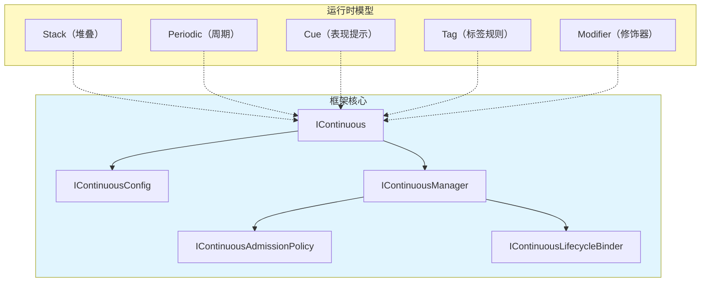
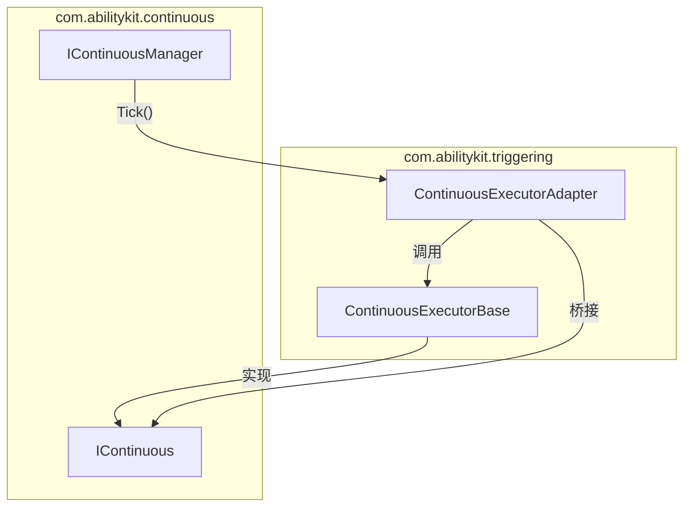
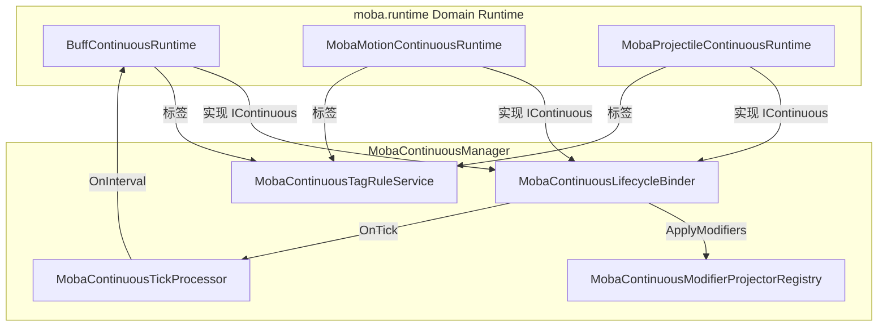

# Continuous 框架接口设计：IContinuous、IContinuousManager 与运行时模型

> 文档类型：Canonical 设计（Continuous 公共契约与应用组合边界）
> 事实基线：2026-08-16
> 文档版本：v3.2
>
> 本文以独立包 `Unity/Packages/com.abilitykit.continuous/Runtime/` 为事实基线，解释 Continuous 的最小接口、默认管理器、准入与生命周期扩展点，并说明 MOBA 应用层如何在其上组合 stack/periodic/cue/tag/modifier 等领域模型。五种模型是参考应用组合，不是公共包强制提供的统一业务运行时。

---

## 1. 设计目标

Continuous 框架解决的核心问题是：**如何统一管理所有具有"持续时间、可中断/可暂停"特征的游戏对象**。

这类对象在 MOBA 中大量存在：Buff、被动技能、移动增益、光环效果、持续伤害、召唤物等。它们有共同的生命周期外壳，但具体行为差异巨大。Continuous 公共包不实现具体 Buff、技能或运动规则，但已经提供通用管理逻辑：

- **生命周期管理**：注册、激活、暂停、恢复、结束、中断与注销。
- **通用索引**：按 owner 保存持续体，维护注册顺序和活跃集合，提供批量操作与快照查询。
- **横切扩展**：准入策略和生命周期 Binder；注册阶段 Binder 失败时回滚管理器状态并执行补偿通知。
- **配置能力**：最小配置和 tag/mutex/duration/hierarchy/stack 可选接口。

Tick、周期处理、Modifier 投影、表现 Cue、标签驱动暂停/终止和具体 runtime 状态同步不由默认管理器自动完成，仍需领域宿主实现。

### 1.1 职责归属

| 层级 | 稳定职责 | 不承诺的内容 |
|------|----------|--------------|
| Continuous 框架 | 生命周期协议、最小配置、owner 索引、默认管理器、准入策略和 Binder | Buff 叠层、周期伤害、属性投影、表现、领域 Tick 和完整回滚 |
| 项目应用层 | runtime 类型、固定 Tick、配置目录、投影/间隔处理、标签规则、同步和销毁顺序 | 应为领域副作用与失败补偿负责 |
| MOBA 示例 | `MobaContinuousManager` 及 Buff/Motion/Projectile 等 runtime 组合 | 是高接入参考，不是所有项目必须继承的 Battle Application Runtime |

---

## 2. 源码入口

公共表项均相对 `Unity/Packages/com.abilitykit.continuous/`；MOBA 表项均相对 `Unity/Packages/com.abilitykit.demo.moba.runtime/Runtime/`。

| 类型 | 源码 | 说明 |
|---|---|---|
| 核心接口 | `Runtime/Continuous/IContinuous.cs` | 持续体接口 |
| 配置接口 | `Runtime/Continuous/IContinuousConfig.cs` | 最小配置 + 可选扩展 |
| 管理器接口 | `Runtime/Continuous/IContinuousManager.cs` | 生命周期管理器接口 |
| 核心类型 | `Runtime/Continuous/ContinuousState.cs`、`ContinuousEndReason.cs` | 状态与结束原因枚举 |
| 策略与钩子 | `Runtime/Continuous/ContinuousPolicies.cs` | 准入策略与生命周期钩子 |
| 默认实现 | `Runtime/Continuous/DefaultContinuousManager.cs` | 管理器默认实现 |
| moba.manager | `Application/Services/Continuous/MobaContinuousManager.cs` | MOBA 业务实现 |
| moba.运行时基类 | `Application/Services/Continuous/MobaContinuousRuntimeBase.cs` | MOBA 运行时基类 |
| moba.配置基类 | `Application/Services/Continuous/MobaContinuousConfigBase.cs` | MOBA 配置基类 |
| 生命周期钩子 | `Application/Services/Continuous/MobaContinuousLifecycleBinder.cs` | 绑定修改器到生命周期 |
| 间隔处理器 | `Application/Services/Continuous/MobaContinuousTickProcessor.cs` | 驱动间隔效果 |
| 标签规则 | `Application/Services/Continuous/MobaContinuousTagRuleService.cs` | 标签驱动的激活/暂停/终止 |
| 修饰器投影 | `Application/Services/Continuous/MobaAttributeContinuousModifierProjector.cs` | 属性修改器 |
| Buff 运行时 | `Application/Services/Buffs/Runtime/BuffContinuousRuntime.cs` | Buff 的 Continuous 实现 |
| 移动运行时 | `Application/Services/Motion/MobaMotionContinuousRuntime.cs` | 移动源的 Continuous 实现 |
| Triggering 集成 | `Runtime/RuntimeServices/Continuous/ContinuousExecutorBase.cs` | 旧版 Continuous 与 IContinuous 桥接 |
| Behavior 集成 | `Runtime/Runtime/BehaviorRuntime.cs` | BehaviorRuntime 实现 IContinuous |

---

## 3. 核心接口设计

### 3.1 IContinuous：最小生命周期接口

```csharp
public interface IContinuous
{
    // 配置（只读）
    IContinuousConfig Config { get; }

    // 状态查询
    ContinuousState State { get; }
    bool IsActive { get; }
    bool IsTerminated { get; }
    bool IsPaused { get; }
    float ElapsedSeconds { get; }

    // 生命周期操作
    void Activate();
    void Pause();
    void Resume();
    void End(ContinuousEndReason reason);
    void Abort(string reason);

    // 事件
    event Action<IContinuous, ContinuousEndReason> OnEnded;
}
```

**设计意图：** 这个接口尽可能薄，只包含"生命周期"相关的最小操作。任何对象只要实现了这组接口，就可以被 `IContinuousManager` 统一管理。

### 3.2 IContinuousConfig：配置接口

```csharp
public interface IContinuousConfig
{
    string Id { get; }
    long OwnerId { get; }
    bool CanBeInterrupted { get; }
}
```

**可选扩展接口（按需实现）：**

```csharp
// 时长配置
public interface IDurationConfig
{
    float? DurationSeconds { get; }
}

// 堆叠配置
public interface IStackConfig
{
    int Stack { get; set; }
    int MaxStack { get; }
}

// 标签配置
public interface ITagConfig
{
    ITagContainer Tags { get; }               // 自身标签
    ITagContainer PauseByTags { get; }       // 导致暂停的标签
    ITagContainer BlockByTags { get; }         // 导致激活失败的标签
}

// 互斥组配置
public interface IMutexConfig
{
    string MutexGroup { get; }
    int Priority { get; }
}

// 层级配置（父子关系）
public interface IHierarchyConfig
{
    string ParentId { get; }
    bool CascadeOnExpire { get; }
}

// 标签容器抽象
public interface ITagContainer
{
    bool HasTag(string tag);
    bool HasAny(ITagContainer other);
    int Count { get; }
}
```

**设计意图：** 使用组合模式，而不是继承树。每个持续体只实现它需要的扩展接口，框架通过 `as` 转换检查可选能力。

公共包当前没有 `IPeriodicConfig`。周期处理属于 MOBA 应用组合，其接口是 `IMobaContinuousPeriodicConfig`，字段为 `IntervalSeconds` 与 `IntervalEffectIds`，由 `MobaContinuousTickProcessor` 消费。其他项目可以定义不同的周期模型，无需兼容 MOBA 配置 DTO。

### 3.3 ContinuousState 与 ContinuousEndReason

```csharp
public enum ContinuousState
{
    Inactive,   // 未激活或已销毁
    Activating, // 激活中
    Active,     // 运行中
    Paused,     // 已暂停
    Expired,    // 正常结束（时长到期）
    Aborted,    // 非正常结束（被中断）
}

public enum ContinuousEndReason
{
    Completed,   // 正常完成
    Interrupted,  // 被中断
    SourceEnded, // 来源结束（如技能被取消）
    CleanedUp,   // 被清理
}
```

---

## 4. IContinuousManager：生命周期管理器

### 4.1 管理器接口

```csharp
public interface IContinuousManager
{
    // 注册与注销
    bool Register(IContinuous continuous);
    void Unregister(IContinuous continuous, ContinuousEndReason reason = ContinuousEndReason.CleanedUp);

    // 状态转换
    bool TryActivate(IContinuous continuous);
    bool TryPause(IContinuous continuous);
    bool TryResume(IContinuous continuous);
    bool TryEnd(IContinuous continuous, ContinuousEndReason reason = ContinuousEndReason.Completed);
    bool TryInterrupt(IContinuous continuous, string reason);

    // 批量操作
    void InterruptAll(long ownerId, string reason);
    void PauseAll(long ownerId);
    void ResumeAll(long ownerId);

    // 查询
    IReadOnlyList<IContinuous> GetOwnerContinuous(long ownerId);
    IReadOnlyList<IContinuous> GetOwnerActiveContinuous(long ownerId);

    // 统计
    int ActiveCount { get; }
    int TotalCount { get; }
}
```

### 4.2 准入策略（IContinuousAdmissionPolicy）

```csharp
public interface IContinuousAdmissionPolicy
{
    bool CanRegister(IContinuous continuous, IContinuousManager manager, out string? reason);
    bool CanActivate(IContinuous continuous, IContinuousManager manager, out string? reason);
}

// 已有实现：
// - AllowAllContinuousAdmissionPolicy：允许所有注册和激活
// - BlockByOwnerActiveTagsPolicy：检查标签互斥
```

### 4.3 生命周期钩子（IContinuousLifecycleBinder）

```csharp
public interface IContinuousLifecycleBinder
{
    void OnRegistered(IContinuous continuous, IContinuousManager manager);
    void OnActivated(IContinuous continuous, IContinuousManager manager);
    void OnPaused(IContinuous continuous, IContinuousManager manager);
    void OnResumed(IContinuous continuous, IContinuousManager manager);
    void OnEnded(IContinuous continuous, ContinuousEndReason reason, IContinuousManager manager);
    void OnUnregistered(IContinuous continuous, ContinuousEndReason reason, IContinuousManager manager);
}
```

### 4.4 注册、结束与补偿边界

`DefaultContinuousManager` 维护 registered set、active set、注册顺序和 owner 索引。`TryActivate()` 会在对象尚未注册时先调用 `Register()`；对象通过 `OnEnded` 回调结束后，Manager 先移出 active set，通知 `OnEnded`，并在 `finally` 中执行 `Unregister()`。

注册阶段具有局部事务语义：Manager 先建立索引和事件订阅，再按 binder 快照执行 `OnRegistered`。任一 binder 抛出时，会撤销索引/订阅，并对已经尝试过的 binder 逆序调用 `OnUnregistered(CleanedUp)`；补偿异常被吞掉，以保留原始注册异常。这个保证只覆盖 Manager 自身注册阶段，不覆盖 `OnActivated`、`OnEnded`、领域 runtime 创建或 binder 内任意外部副作用。

`Unregister()` 会先移除 Manager 内部状态，再调用 binder 和公开事件；这些回调抛错时，内部移除不会回滚。项目若在 binder 中操作属性、Trace、Cue 或外部实体，仍需定义幂等收尾和自己的补偿顺序。

### 4.5 查询租约、清理与失败矩阵

Manager 的不同查询返回值不是同一种所有权：`GetOwnerContinuous` 返回内部 owner list 的 `AsReadOnly` 包装，属于随 Manager 写入变化的 live view；`GetOwnerActiveContinuous`、`GetAllContinuous` 和 `GetAllActiveContinuous` 会创建快照列表。live view 不能跨 Manager 写入长期保存，也不能在枚举期间触发同 owner 注册或注销。Config 的 `OwnerId` 还必须在注册期间保持不可变；注销时 Manager 会读取当前 OwnerId，若配置已改值，旧 owner bucket 中的引用可能无法移除。

`Clear(CleanedUp)` 的语义只是逐个 `Unregister`。它不会调用 `End` 或 `Abort`，因此对象自身仍可能保持 Active，且 Manager 已经不再订阅其 `OnEnded`。它适合“外部已经终止对象后的索引清空”，不是统一 Shutdown。需要战局关闭时，应先按快照结束或中断对象，再确认终态，最后清理残留注册。

| 失败点 | Manager 已提交 | 未保证内容 |
|--------|----------------|------------|
| admission policy 抛错 | 无新注册或激活提交 | 后续 policy 不执行，异常向外传播 |
| Binder `OnRegistered` 抛错 | Manager 索引会回滚，并逆序尽力补偿已尝试 Binder | Binder 外部副作用不保证撤销；失败 Binder 自身也会收到补偿 |
| 公开 `OnRegistered` 抛错 | 注册、owner 索引与事件订阅已经生效 | 不回滚，也不执行 Binder 补偿 |
| `Activate/Pause/Resume` 或对应 Binder/事件抛错 | runtime 状态与 active set 可能已经改变 | 后续 Binder/事件、状态恢复与对外成功确认 |
| runtime `End/Abort` 抛错 | 取决于 runtime 自身实现 | Manager 不做补偿 |
| Binder `OnEnded` 抛错 | active set 已移除；finally 仍尝试 Unregister | 后续 ended Binder；Unregister 异常还可能覆盖原异常 |
| Binder/事件 `OnUnregistered` 抛错 | registered、active、owner 和顺序索引已移除 | 后续 Binder/公开事件不保证执行 |
| `Clear` 中一次 Unregister 抛错 | 当前对象可能已从 Manager 移除 | 后续对象不会继续清理 |

批量 `InterruptAll/PauseAll/ResumeAll` 使用 owner 快照，可承受当前项同步注销，但不会逐项隔离异常；任一 runtime、Binder 或事件抛错都会停止剩余对象处理。生产宿主若要求 best-effort 全量关闭，应自行逐项捕获并汇总异常，同时最终核对 `TotalCount`、`ActiveCount` 和外部资源租约。

---

## 5. 运行时模型

本节五种模型总结 MOBA 当前如何组合公共接口。公共包只识别 `IContinuous`、配置扩展、策略和 Binder，不会自动发现或执行下述投影、周期与 Cue 语义。

### 5.1 五种模型总览



### 5.2 Stack（堆叠模型）

**解决的问题：** 同一个 Buff 被多次施加时，如何管理层数。

```csharp
// IStackConfig
public interface IStackConfig
{
    int Stack { get; set; }      // 当前层数
    int MaxStack { get; }        // 最大层数上限
}

// MOBA 中的应用：
// - 廉颇一技能命中后获得"战意"Buff
// - 每次命中 +1 层，最高 5 层
// - 每层提供 +5% 伤害
// - 层数刷新时：Duration 重置，但 Stack 不叠加

// MobaBuffService 处理逻辑：
// - ApplyBuff 时检查 IStackConfig
// - 如果 Buff 已存在且允许叠加 → Stack++
// - 如果 Stack 超过 MaxStack → 截断或拒绝
```

### 5.3 Periodic（周期模型）

**解决的问题：** 间隔执行效果（如每秒伤害、周期回复）。

```csharp
// IMobaContinuousPeriodicConfig
public interface IMobaContinuousPeriodicConfig
{
    float IntervalSeconds { get; }
    IReadOnlyList<int> IntervalEffectIds { get; }
}

// 间隔处理器：MobaContinuousTickProcessor
public void Tick(IContinuous continuous, float deltaTimeSeconds)
{
    // 1. 检查是否有 IMobaContinuousPeriodicConfig
    // 2. 递减 IntervalRemaining
    // 3. 到达 0 时：
    //    - 获取执行上下文
    //    - 调用 IMobaContinuousIntervalHandler.OnInterval()
    //    - 重置 IntervalRemaining
}

// MOBA 中的应用：
// - 灼烧效果：按固定间隔执行配置的效果计划
// - 回血效果：每 3 秒回复 100 点 HP
```

### 5.4 Cue（表现提示模型）

**解决的问题：** 持续效果如何在特定时机触发视觉/音效提示。

```csharp
// IMobaContinuousCueConfig
public interface IMobaContinuousCueConfig
{
    // 由 MobaContinuousCueReporter 在适当时机调用
}

// 在 MOBA 中的应用：
// - Buff 激活时播放特效
// - 每 2 秒播放一次环境音
// - Buff 即将结束时播放警告特效
// - Buff 结束时播放消散特效

// MobaBuffPresentationCueReporter 集成到 MobaContinuousLifecycleBinder：
// OnActivated → ReportCue("buff_start")
// 每个 Interval → ReportCue("buff_tick")
// OnEnded → ReportCue("buff_end")
```

### 5.5 Tag（标签规则模型）

**解决的问题：** 基于标签的激活/暂停/终止规则（如沉默期间不能激活某些效果）。

```csharp
// ITagConfig
public interface ITagConfig
{
    ITagContainer Tags { get; }           // 自身携带的标签
    ITagContainer PauseByTags { get; }    // 持有这些标签时暂停
    ITagContainer BlockByTags { get; }   // 存在这些标签时无法激活
}

// MobaContinuousTagRuleService
public MobaContinuousTagRuleResult Explain(IContinuous continuous)
{
    // 遍历所有活跃 Continuous
    // 检查标签冲突：
    // - 如果存在 BlockByTags 中的标签 → BlockActivate
    // - 如果满足 PauseByTags 中的标签 → Pause
    // - 如果满足 OngoingRequired 标签缺失 → Remove
}

// MOBA 中的应用：
// - 英雄被"眩晕"标签命中 → 暂停所有移动类 Continuous
// - 英雄拥有"免疫控制"标签 → 阻止"减速"/"眩晕" Continuous 激活
// - Buff 持有"物理"标签 → 受到"魔法护盾"保护时无效
```

### 5.6 Modifier（修饰器模型）

**解决的问题：** 持续效果如何修改属性或技能参数。

```csharp
// IMobaContinuousModifierConfig
public interface IMobaContinuousModifierConfig
{
    IReadOnlyList<IMobaContinuousModifierSpec> Modifiers { get; }
}

public interface IMobaContinuousModifierSpec
{
    int TargetKind { get; }      // 目标类型：Attribute / SkillParam / MotionSource
    string ModifierId { get; }  // 修饰符 ID
    float Value { get; }         // 修饰值
    ModifierOp Op { get; }      // 操作：Add / Multiply / Override
}

// 修饰器投影注册表
public interface IMobaContinuousModifierProjector
{
    int TargetKind { get; }
    void Apply(IContinuous continuous, IMobaContinuousProjectionConfig projection,
               IReadOnlyList<IMobaContinuousModifierSpec> modifiers);
    void Clear(IMobaContinuousProjectionConfig projection);
}

// 已有的投影实现：
// - MobaAttributeContinuousModifierProjector：修改 AttributeGroup（+10 攻击力）
// - MobaSkillParamContinuousModifierProjector：修改技能参数（冷却 -20%）
```

---

## 6. moba.runtime 中的实现

### 6.1 MobaContinuousManager：业务层管理器

```csharp
[WorldService(typeof(IContinuousManager), WorldLifetime.Scoped)]
[WorldService(typeof(MobaContinuousManager), WorldLifetime.Scoped)]
public sealed class MobaContinuousManager : DefaultContinuousManager,
    IWorldInitializable, IDisposable
{
    // 修饰器投影
    private MobaContinuousModifierProjectorRegistry _modifierProjectors;

    // 间隔处理器
    private MobaContinuousTickProcessor _tickProcessor;
    private List<IMobaContinuousIntervalHandler> _intervalHandlers;
    // 预设：BuffContinuousIntervalHandler, MobaTriggerIntervalContinuousHandler

    // 生命周期钩子
    private MobaContinuousLifecycleBinder _lifecycleBinder;
    private MobaContinuousContextLifecycleBinder _contextLifecycleBinder;
    private MobaContinuousOwnerBoundTriggerLifecycleBinder _ownerBoundTriggerBinder;

    // 标签规则
    private MobaContinuousTagRuleService _tagRuleService;

    public void OnInit(IWorldResolver services) { /* 初始化各组件 */ }
    public void Reproject(IContinuous continuous) { /* 重新投影修饰器 */ }
    public void Tick(float deltaTimeSeconds) { /* 驱动所有活跃 Continuous 的 Tick */ }
}
```

### 6.2 MobaContinuousRuntimeBase：运行时基类

```csharp
public abstract class MobaContinuousRuntimeBase : IContinuous
{
    // IContinuous 实现
    public abstract IContinuousConfig Config { get; }
    public ContinuousState State { get; private set; }
    public bool IsActive => State == ContinuousState.Active;
    public float ElapsedSeconds { get; private set; }

    // 子类覆盖的生命周期钩子
    protected virtual bool OnActivating() => true;
    protected virtual void OnActivated() { }
    protected virtual void OnPaused() { }
    protected virtual void OnResumed() { }
    protected virtual void OnEnding(ContinuousEndReason reason) { }

    // 辅助方法
    protected void AdvanceElapsed(float deltaTimeSeconds);
    protected void ResetElapsed();
}
```

### 6.3 BuffContinuousRuntime：Buff 的运行时

```csharp
public sealed class BuffContinuousRuntime :
    MobaContinuousRuntimeBase,
    IMobaTickableContinuous,              // 支持 Tick 驱动
    IMobaContinuousIntervalState,          // 周期状态
    IMobaContinuousRuntimeStateSync,       // 状态同步
    IMobaContinuousExecutionContextProvider // 执行上下文
{
    public int BuffId { get; }
    public int SourceActorId { get; }
    public int TargetActorId { get; }

    // 绑定到 BuffRuntime
    public void BindRuntime(BuffRuntime runtime);
    public void BindSourceContext(long sourceContextId);

    // 刷新（叠加时调用）
    public void Refresh(
        int sourceActorId,
        float remainingSeconds,
        int stackCount,
        int maxStack,
        ContinuousTagRequirements tagRequirements);
}
```

### 6.4 MobaContinuousTickSystem：帧驱动

```csharp
[WorldSystem(order: MobaSystemOrder.ContinuousTick, Phase = WorldSystemPhase.Execute)]
public sealed class MobaContinuousTickSystem : WorldSystemBase
{
    protected override void OnExecute()
    {
        if (_continuous is MobaContinuousManager mobaContinuous)
        {
            mobaContinuous.Tick(dt);
        }
    }
}
```

---

## 7. 与其他包的协作

### 7.1 与 Triggering 包的协作



**ContinuousExecutorAdapter** 桥接旧版 Triggering 的 `ContinuousExecutorBase` 与新框架的 `IContinuous`：

```csharp
public abstract class ContinuousExecutorAdapter<TCtx> :
    ContinuousExecutorBase<TCtx>, IContinuous
{
    // IContinuous.State → 映射自 Phase
    // Activate() → Start()
    // Pause() / Resume() / End() → 映射 Phase 转换
    // InternalTick() → 调用 OnUpdate()
}
```

### 7.2 与 Behavior 包的协作

`BehaviorRuntime` 直接实现 `IContinuous`，允许行为树被 `ContinuousManager` 统一管理：

```csharp
public class BehaviorRuntime : IContinuous
{
    // IContinuous 实现（显式接口）
    IContinuousConfig IContinuous.Config => _config;
    ContinuousState IContinuous.State => Phase switch {
        BehaviorPhase.Running => ContinuousState.Active,
        BehaviorPhase.Completed => ContinuousState.Expired,
        _ => ContinuousState.Inactive,
    };

    // 内部行为树状态
    public BehaviorPhase Phase { get; private set; }
    public float ElapsedSeconds { get; private set; }
    public IBehaviorDecision Decision { get; }
    public IBehaviorExecutor Executor { get; }
}
```

### 7.3 与 Buff/Projectile/Motion 的协作



---

## 8. 设计约束与扩展点

### 8.1 约束

| 约束 | 说明 |
|---|---|
| 公共包只实现领域无关的管理逻辑 | `DefaultContinuousManager` 可以维护 owner 索引、状态操作、策略与 Binder；Buff 叠层、周期、投影和标签规则留在业务层 |
| 禁止在 Continuous 包中定义具体游戏配置类 | 公共包只保留最小配置与能力接口，配置 DTO、目录和默认值由 moba.runtime 等项目层定义 |
| Manager 不直接持有 Entity 引用 | 只通过 OwnerId 关联，不侵入 ECS |
| 默认 Manager 不拥有 Tick | 时间推进、到期检查和领域 runtime 更新由宿主按固定系统顺序驱动 |
| 回调不等于完整事务 | 注册阶段 Binder 异常有回滚/补偿；其他领域副作用仍需项目定义异常与补偿策略 |
| Clear 不等于 Shutdown | Clear 只解除 Manager 注册，不终止仍活跃的 runtime；宿主必须先结束对象再清残留 |
| OwnerId 在租约内不可变 | Manager 建立和移除 owner 索引时都读取 Config.OwnerId，运行中变更会破坏反向清理 |

### 8.2 扩展点

| 扩展点 | 用法 |
|---|---|
| 新运行时模型 | 继承 `MobaContinuousRuntimeBase`，实现可选接口组合 |
| 新修饰器投影 | 实现 `IMobaContinuousModifierProjector`，注册到 Registry |
| 新间隔处理器 | 实现 `IMobaContinuousIntervalHandler` |
| 新生命周期钩子 | 实现 `IContinuousLifecycleBinder`，注册到 Manager |
| 新准入策略 | 实现 `IContinuousAdmissionPolicy` |

---

## 9. 证据与关联文档

### 9.1 证据状态与已知限制

- **E0 实现**：`com.abilitykit.continuous` 提供接口、配置扩展、状态/结束原因、策略、Binder 和 `DefaultContinuousManager`。
- **E1 示例**：MOBA 提供 Manager、runtime 基类、Tick processor、Modifier projector 和标签规则等组合实现。
- **E2 集成**：MOBA Buff、Motion、Projectile、Triggering 与 Behavior runtime 消费 Continuous 契约。
- **E3 契约**：2026-08-16 当次 `AbilityKit.Continuous.Tests` 为 `2/2`，覆盖 owner 索引、Activate/Pause/Resume/End 顺序和不可中断拒绝；MOBA 测试另覆盖部分上下文、事务与领域 runtime。
- **E4/E5**：尚无跨项目 runtime、完整恢复、异常补偿、长局容量和性能预算的统一场景或发布门禁。

默认管理器未声明线程安全，也不提供时间源、序列化或完整 snapshot。OwnerId 只是关联键，稳定性、World 隔离和跨端映射由宿主保证。五类 MOBA runtime 的通过不能替代其他游戏对自身持续规则的契约测试。

当前最小测试还没有覆盖公开事件异常、激活/暂停 Binder 异常、live owner view 重入、OwnerId 变化、Clear 后对象仍 Active，以及批量操作中途失败。采用默认 Manager 作为统一战局关闭入口前，这些都应进入直接契约测试。

| 文档 | 关系 |
|---|---|
| [11-PlanActions DSL 与 Continuous Runtime 深潜](../09-ImplementationExamples/MOBA/11-PlanActionsAndContinuousRuntimeDeepDive.md) | 深入理解 PlanAction 如何驱动 Continuous Runtime |
| [13-持续行为能力组合设计](../09-ImplementationExamples/MOBA/13-ContinuousCapabilityCompositionDesign.md) | 五种 runtime model 的能力组合边界 |
| [16-领域连续运行时与临时实体生命周期](../09-ImplementationExamples/MOBA/16-DomainContinuousRuntimeAndTemporaryEntityLifecycle.md) | Motion source、Summon 与 Continuous 的生命周期协作 |
| [13-FrameworkCore/02-BehaviorTreeIntegrationDesign.md](../13-FrameworkCore/02-BehaviorTreeIntegrationDesign.md) | BehaviorRuntime 与 IContinuous 的集成 |

---

*文档版本：v3.2 | 最后更新：2026-08-16 | 证据等级：E0-E3（包级 2/2，仅覆盖最小 Manager 契约）*
