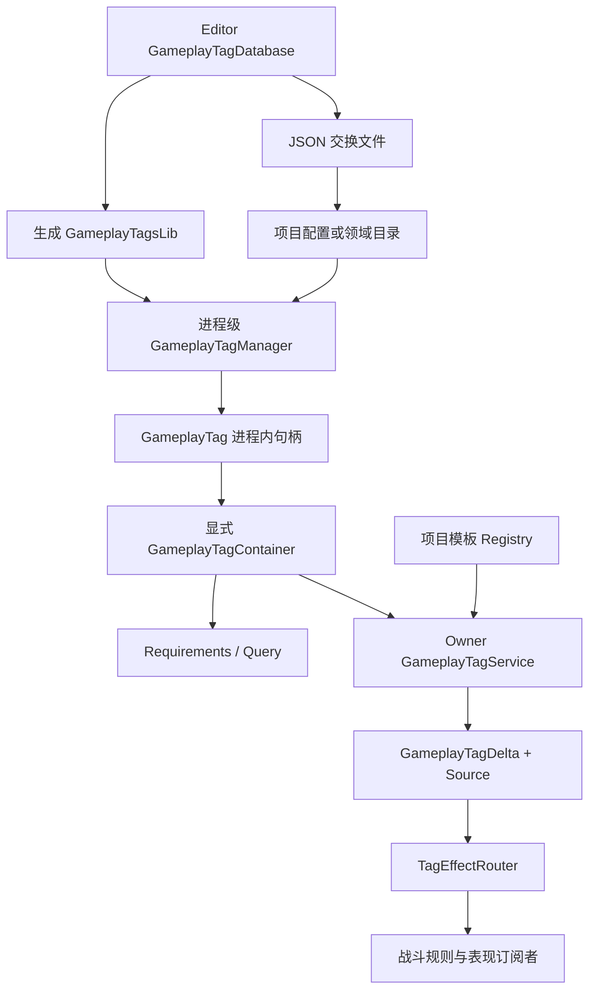
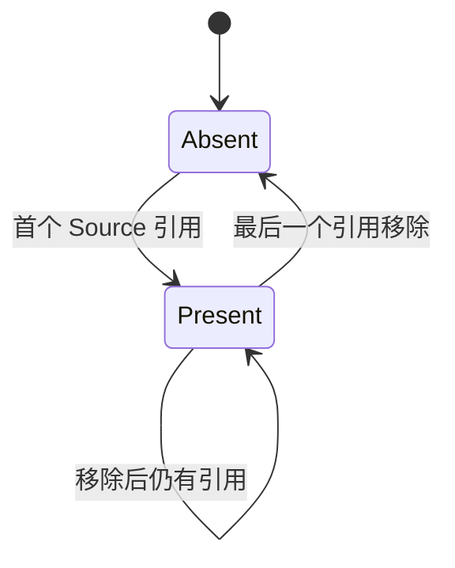

# GameplayTags 层级语义与工程边界

> **文档类型**：Canonical 设计（GameplayTags 跨模块工程边界）
> **事实基线**：2026-08-16
> **文档版本**：v3.2
> **证据范围**：Core/Ability/MOBA 源码、包内文档与当次 .NET `2/2` 最小值对象测试
> **不覆盖**：稳定跨进程目录协议、完整查询/租约测试、并发安全与 E4/E5 发布门禁

## 一、文档定位

GameplayTags 包提供名称注册、层级匹配、标签容器、条件查询、计数栈、模板和持久化等基础能力。Ability 包在其上实现按 Owner 保存标签状态、按来源计数和事件路由；MOBA Demo 再用领域目录、配置模板和战斗规则完成接入。

这三层不能合并理解：

- GameplayTags 核心包定义标签值和查询语义；
- Ability 包拥有实体运行时标签状态；
- MOBA Demo 决定哪些名称代表不可选中、沉默、控制免疫等领域规则。

正式所有权进一步约束如下：框架拥有标签值、层级匹配、Container/Query/Requirements 和来源计数等稳定语义；项目拥有稳定名称目录、协议身份、领域含义、目录版本与生成发布流程；MOBA 目录及其兼容别名只属于示例。即使多个项目使用相似标签名称，也不能据此把业务目录固化到公共包。

本文记录当前源码已经实现的语义及其工程边界。它不是对 Unreal GAS GameplayTags 的等价性声明，也不把尚无测试证据的接口视为生产级协议。

## 二、职责分层

| 层 | 核心类型 | 当前职责 |
|---|---|---|
| 名称目录 | `GameplayTagManager` | 注册标签名称、创建父节点、分配进程内 Id 和 NetIndex、保存层级关系 |
| 值对象 | `GameplayTag` | 保存 Id/NetIndex，提供精确比较和层级匹配入口 |
| 显式集合 | `GameplayTagContainer` | 保存显式标签 Id，提供 exact/non-exact 查询和集合运算 |
| 条件表达 | `GameplayTagRequirements`、`GameplayTagQuery` | Required/Blocked 条件与表达式树求值 |
| 计数集合 | `GameplayTagStackContainer` | 保存标签到计数的映射 |
| 模板 | `GameplayTagTemplate`、`ITagTemplateRegistry` | 描述授予、移除和前置标签，按项目配置解析模板 |
| Owner 状态 | `IGameplayTagService`、Ability `GameplayTagService` | 按 Owner 保存标签和来源引用计数，发布状态变化 |
| 事件路由 | `TagEffectRouter` | 将 Owner 标签变化分发给 World 内订阅者 |
| 编辑器生产链 | `GameplayTagDatabase`、JSON/代码导出器 | 维护名称、说明和分类，导出 JSON 或强类型访问代码 |
| 领域目录 | `MobaGameplayTagCatalog` | 注册 MOBA 名称和兼容别名，将配置字符串解析为标签 |



## 三、名称、Id 与层级目录

### 3.1 注册会自动创建父标签

`GameplayTagManager.RequestTag` 先校验并保留大小写，再按点分路径递归创建父节点。例如首次请求 `State.Control.Stunned` 时，管理器会依次保证以下节点存在：

```text
State
State.Control
State.Control.Stunned
```

名称比较使用 Ordinal 规则。`State.Stunned`、`state.stunned` 和 `Stunned` 是三个不同标签；MOBA 中的小写和短名称兼容依赖 `MobaGameplayTagCatalog` 显式注册别名，不是核心包的自动规范化能力。

名称校验当前只拒绝空白、首尾点、连续点和名称内部空白。其他标点可以通过 Runtime 校验；Editor `GameplayTagValidator` 可能有更严格规则，因此生产链必须统一采用同一份名称规范，不能假设 Editor 与 Runtime 对任意输入都等价。

### 3.2 Id 是进程内句柄

标签 Id 取当前节点数组下标，NetIndex 也在创建时递增分配。两者都受以下因素影响：

- 标签注册顺序；
- 父标签是否由子标签请求隐式创建；
- 进程启动时加载了哪些目录；
- 是否调用过 `Reset`；
- 是否从外部目录反序列化。

因此 `GameplayTag.Value` 和 NetIndex 目前只能作为当前注册表生命周期内的高效句柄。除非协议先固定目录版本和映射表，否则不能把它们直接写入长期存档、跨版本配置、回放或独立进程消息。

`GameplayTag.FromId` 只构造带 Id 的值对象，不验证该 Id 是否已注册。任意正数都会使 `IsValid` 为 true；`GetName` 对越界 Id 返回空字符串，但 `GetParent`、`GetRootTag`、子节点枚举等部分 Manager API 会直接按 Id 索引节点数组并可能抛 `ArgumentOutOfRangeException`。因此 `IsValid` 只表示“Id 非零”，不表示“已在当前目录解析”。外部数值输入必须先通过 Manager 的受检映射入口。

`GameplayTag.FromNetIndex` 构造 Id 为零、只带 NetIndex 的值；由于 `IsValid`、相等和 hash 都只看 Id，它会表现得与 `None` 相同，不会自动解析成已注册标签。网络读取应使用 `GameplayTagManager.GetTagFromNetIndex`，并在目录版本一致的前提下处理未命中；不能把 `FromNetIndex` 当作完整反序列化。

### 3.3 Manager 是进程级可变单例

`GameplayTagManager.Instance` 跨 World 共享，内部集合没有锁。它适合在单线程启动阶段构建目录，不适合多个 World 在运行中并发注册、重置或导入目录。

`Reset` 会清空所有自定义节点，但已经存在的 `GameplayTag`、Container、模板和静态领域目录不会收到失效通知。尤其是含静态 `GameplayTag` 字段的生成代码或领域类，在 Reset 后可能继续持有指向新目录中其他节点的旧 Id。生产运行时不应调用 Reset；测试若必须调用，需要隔离测试进程或完整重建所有静态缓存。

这里不存在 generation 或 catalog identity。Reset 后若以不同顺序重新注册，旧句柄不仅可能失效，还可能静默别名到另一个新标签；此时 `IsValid`、相等和 Container 查询都无法识别跨目录租约。持久对象、静态字段和缓存必须与完整 Manager 生命周期同生共死。

## 四、层级匹配方向

`GameplayTag.Matches(other)` 的方向是：当前标签等于 `other`，或者当前标签是 `other` 的后代。

```text
State.Control.Stunned.Matches(State.Control) == true
State.Control.Matches(State.Control.Stunned) == false
```

`IsChildOf` 不把自身视为子节点，而 `Matches` 会先处理精确相等。Container 的非精确查询沿用同一方向：遍历容器内显式持有的标签，判断该标签能否匹配查询标签。

```text
Container = { State.Control.Stunned }
HasTag(State.Control) == true
HasTagExact(State.Control) == false
HasTag(State.Control.Stunned) == true
```

反方向不会自动成立：

```text
Container = { State.Control }
HasTag(State.Control.Stunned) == false
```

这个方向适合用父标签查询一类状态，例如持有任意 `State.Control.*` 子标签都能满足 `HasTag(State.Control)`。如果业务要表达“父标签意味着拥有全部子能力”，必须另建规则，不能依赖当前层级匹配。

## 五、Container 保存显式事实

`GameplayTagContainer` 内部只保存传入标签的 Id，不展开祖先，不记录来源，也不维护计数。层级关系只在查询时由 Manager 解释。

| 操作 | 语义 |
|---|---|
| `Add` / `Remove` | 只操作一个精确 Id |
| `HasTagExact` | 只检查显式 Id |
| `HasTag` | 显式持有标签可以向上匹配查询父标签 |
| `HasAny` / `HasAll` | 对查询容器逐项执行 exact 或 non-exact 判断 |
| `Union` / `Intersect` / `Except` | 仅按显式 Id 做集合运算 |
| `ToArray` / 枚举 / `First` | 顺序来自 HashSet，不是稳定协议顺序 |

空集规则为：`HasAny(empty)` 返回 false，`HasAll(empty)` 返回 true。`GameplayTagRequirements` 先判断 Blocked 的 Any，再判断 Required 的 All；没有要求或禁止项时通过。

`GameplayTagContainer.Empty` 是公开的可变静态实例。任何调用方都能向它添加标签，从而污染其他使用者。当前代码应优先创建新空容器，不应把 `Empty` 作为可共享只读值。

Container 的网络写入还有三个边界：

1. 数量被转换为 byte，但 writer 仍遍历并写入全部 int Id；超过 255 个标签时 reader 只按截断后的数量读取，尾部字节会遗留在流中并污染后续字段；
2. 写入的是进程内 int Id，而不是名称或目录版本；
3. HashSet 枚举顺序未稳定排序。

所以 `NetSerialize` 目前是简化工具，不是已版本化的跨进程协议。

## 六、Requirements、Query 与 Stack

### 6.1 Requirements

`GameplayTagRequirements` 的 Container 重载尊重 `Exact`：Blocked 使用 HasAny，Required 使用 HasAll。单标签重载没有传递 `Exact`，并且从 Required/Blocked 容器一侧调用 `HasTag(tag)`，匹配方向与 Container 重载不完全相同。需要 exact 语义或多个条件时，应使用 Container 重载并为两种入口补一致性测试。

### 6.2 Query

`GameplayTagQuery` 支持 IncludeTags、ExcludeTags、And、Or 和 Not 节点。当前 IncludeTags 的求值固定为 `container.HasAny(node.Tags)`，所以一个 Include 节点内的多个标签表达“任意一个”，不是“全部”。

这会直接影响构建器 API：

- `RequireTags(a, b)` 当前只要求 a 或 b 任意一个；
- `And(a, b)` 当前也先生成一个 Any Include 节点；
- 连续调用 `RequireTags(a).RequireTags(b)` 才会被包装成两个节点的 And；
- `Or(a, b)` 创建 Or 节点，但它的单个子节点本身已经是 Any，外层 Or 在该用法中没有增加表达能力；
- `Not(a, b)` 表达“不是任意一个”，等价于两者都不存在。

在修正 API 或补齐语义测试前，不应把 `RequireTags(params)` 当作 All 契约用于技能门禁。复杂生产规则可以直接构建明确的多个子节点，或使用 `GameplayTagRequirements` 表达 Required-All/Blocked-Any。

空 Container 会在根节点求值前直接返回 false，因此纯 Exclude 查询对空集合也返回 false，而从布尔表达式直觉看“没有任何被排除标签”通常应为 true。这也是需要固定的查询协议决策。

### 6.3 Stack

`GameplayTagStackContainer` 按精确 Id 保存正计数。`HasTag` 不执行层级匹配，`ToContainer` 只导出计数大于零的显式标签。它适合表达层数，但不是 Owner 来源租约：不同施加者的计数不会分开保存，移除时也不能按来源撤销。

## 七、Owner 状态与来源引用

Ability 包的 `GameplayTagService` 为每个 Owner 保存：

```text
Tags: GameplayTagContainer
Refs: TagId -> SourceId -> Count
```

同一来源可以重复添加同一标签，不同来源也可以共同持有。只有第一个引用出现时才把标签加入 Container 并发出 Added；只有最后一个引用消失时才从 Container 移除并发出 Removed。



`GameplayTagSource` 只是一个非零 long 值，服务不会检查它代表 Effect、Buff、装备还是系统。上层必须保证来源身份在 Owner 生命周期内唯一且可重复定位，否则撤销会命中错误租约。

### 7.1 模板应用

模板应用按以下顺序执行：

1. 可选地检查 Required/Blocked；
2. 处理 RemoveTags；
3. 处理 GrantTags；
4. 把本次实际显隐变化合并为一次 Delta 事件。

当前 RemoveTags 调用 `TryRemoveAllRefs`，会删除该标签的全部来源，而不是只删除当前 `GameplayTagSource` 的引用。`RemoveTemplate` 同样忽略传入 source，只按模板 RemoveTags 清空全部来源；它也不会撤销模板 GrantTags。由此可见，当前方法名和行为还没有形成“应用模板后按同一来源精确撤销”的对称契约。

在生产 Buff/装备租约中，应优先使用成对的 `AddTag` / `RemoveTag`，或在模板服务修正为按来源撤销并有回归测试后再依赖模板移除。

### 7.2 可变状态暴露

`GetTags(ownerId)` 会为不存在的 Owner 创建状态，并直接返回内部可变 Container。调用方可以绕过来源计数和 TagsChanged 事件直接 Add、Remove 或 Clear，造成 Tags 与 Refs 不一致。`TagEffectRouter` 也把同一个当前 Container 引用传给订阅者。

生产契约应返回只读视图或快照，并把所有写入收敛到服务方法。修正前，调用方必须把返回值视为只读借用。

### 7.3 事件和清理

`GameplayTagDelta` 只表示从不存在到存在、或从存在到不存在的显式状态变化，不报告引用计数变化。Delta 合并只是分别求 Added 和 Removed 的并集，不会抵消同一标签先加后删的净变化。

`ClearOwner` 和 Service Dispose 直接删除状态，不发布 Removed 事件。依赖事件释放表现 Cue 或派生效果的系统，需要在 Owner 销毁流程中另有清理协议。

`TagEffectRouter` 在初始化时订阅 Service，在 Dispose 时解绑；单个订阅者异常会被吞掉，后续订阅者继续执行。这提供运行连续性，但没有内建错误诊断。订阅者列表在分发期间可被修改，也没有线程保护，约定应是 World 单线程调用并避免回调内改动注册关系。

## 八、编辑器生产链与领域接入

### 8.1 Database、JSON 和生成代码

Editor `GameplayTagDatabase` 保存名称、说明和分类，支持排序、去重、前缀重命名和删除。JSON 导出包含版本 `1.0`、名称、说明和分类；导入采用合并语义，不会删除 Database 中 JSON 已不存在的条目。

代码导出器按名称 Ordinal 排序生成：

- 名称常量；
- 静态 GameplayTag 字段；
- 分类访问器；
- `RegisterAll`；
- AllNames 和 AllTags。

团队需要为每个项目指定唯一真源。推荐以受版本控制的 Database 或配置目录为编辑真源，以 JSON 为交换/构建产物，以生成代码为只读编译产物；不要同时手改三份内容。

生成代码中的静态标签字段会在类型初始化时调用 `RequestTag`。虽然排序可以稳定该文件内部的注册顺序，但其他模块更早注册标签仍会改变 Id 和 NetIndex。因此代码生成提升的是名称安全，不自动产生跨进程稳定数值协议。

Core Manager 自带的 JSON 接口当前也不能作为目录往返协议：`SerializeToJson()` 输出 `parentId`，而 `DeserializeFromJson()` 的简化 parser 查找 `parentName`。把导出结果直接导回时，父子层级不会按原结构恢复。反序列化还采用 merge 语义并吞掉解析异常，因此调用方无法从返回值判断目录是否完整载入。生产链应使用结构化 JSON parser、统一 schema 与显式 replace/merge 结果，而不是依赖这组接口做权威目录迁移。

### 8.2 Runtime 字符串持久化

`DefaultTagSerializer` 按名称保存标签，反序列化未知名称时会调用 `RequestTag` 并扩展全局目录。名称比数值 Id 更适合长期数据，但当前容器格式通过字符串拼接和逗号 Split 解析，不是完整 JSON parser；标签名称若包含逗号、引号或反斜杠，往返语义不可靠。

生产导入应选择以下策略之一：

- 严格模式：未知名称失败并报告目录版本；
- 迁移模式：通过显式 alias/rename 表转换后再解析；
- 开发模式：允许动态注册，但输出新增目录诊断。

不能让正式存档或远端输入静默修改进程级目录。

### 8.3 MOBA 接入

MOBA 的 `TagsStage` 在 World 配置阶段调用 `MobaGameplayTagCatalog.RegisterAll`，随后注册项目模板 Registry、Scoped GameplayTagService 和 TagEffectRouter。领域目录同时保留规范名称与历史别名，战斗规则通过预构建 Container 查询不可选中、无法移动、无法释放和控制免疫等状态。

这是 Demo 的兼容策略，不是核心包要求。新项目应优先迁移旧名称到单一规范路径，避免长期让 `Stunned`、`stunned`、`State.Stunned` 三个独立标签同时存在。配置 DTO 转换应在启动校验阶段报告未知名称，而不是战斗中临时注册。

## 九、持久化、同步与确定性

### 9.1 推荐的协议身份

跨进程和长期协议应至少包含：

```text
CatalogId
CatalogVersion
TagName 或由该版本显式定义的 StableIndex
```

如果使用紧凑 StableIndex，映射必须由构建产物生成并进入协议版本，客户端、服务端、回放和工具共同校验。当前 Manager 的 Id/NetIndex 不能直接替代 StableIndex。

Manager 的二进制 `NetworkDeserialize` 同样是 merge，不会先 Reset 当前目录；它接受流中的 `parentId` 和 `netIndex`，但没有验证父节点拓扑、重复 NetIndex、目录版本或全量完整性。它适合受控同版本启动数据的实验性装载，不构成不可信输入边界或重连时的原子目录替换。

目录导入的失败语义需要按格式区分：

| 入口 | 当前提交方式 | 失败与尾数据边界 |
|------|--------------|------------------|
| Manager JSON | 解析后逐条 merge，外层吞异常 | writer 输出 `parentId`、reader 查 `parentName`；解析或注册中途失败时调用方无返回值，可能只导入前缀 |
| Manager binary | 从 reader 逐条直接写 Manager | 截断流会抛异常但保留已写前缀；不校验重复 NetIndex、非法/前向 parentId、名称规范或剩余尾数据 |
| Container binary | 先清空当前 Id，再按 byte count 读取 int | 截断流会留下部分新集合；超过 255 项时 count 截断而 writer 仍写全部项，后续字段错位 |
| DefaultTagSerializer | 按名称动态 RequestTag | 简化逗号拆分不是完整 JSON；未知名称会修改全局目录，失败没有严格/迁移模式 |

这些入口都不是先验证完整输入、再一次性替换的事务导入。权威同步或存档恢复应先反序列化到独立 DTO，校验目录版本、数量、唯一性、父拓扑、名称和完整消费长度，再构造新目录或在明确发布点切换。

### 9.2 稳定顺序

Manager 的 Dictionary 枚举、Container 的 HashSet 枚举和 Stack 的 Dictionary 枚举都未定义协议顺序。用于 hash、快照、回放、网络或 diff artifact 时必须先按稳定身份排序。若目录版本固定，可以按 StableIndex；长期可读产物优先按标签名称 Ordinal 排序。

### 9.3 恢复 Owner 状态

仅恢复显式 Container 不足以恢复 `GameplayTagService`：下一次按来源移除时还需要 Refs。若权威战斗把来源租约纳入回滚或重连，应快照：

- OwnerId；
- 显式标签稳定身份；
- 每个标签的 SourceId 和计数；
- 目录版本；
- 必要的模板/效果实例身份。

当前 GameplayTagService 没有导入导出接口，也没有状态 hash。项目若只把标签当作可由 Buff/Effect 重建的派生状态，需要明确重建顺序和事件抑制；不能默认 Container 恢复等价于完整租约恢复。

## 十、验证现状

当次执行 `AbilityKit.GameplayTags.Tests` 为 `2/2`，只验证 `GameplayTag.None` 等于默认值且 Value 为零。样例项目演示了层级、Container、Requirements 和 Stack 的常见调用，MOBA 验收也会间接使用领域标签，但这些不能替代核心契约的自动化测试。

现有证据不足以声明以下能力已生产验证：

- 注册顺序变化下的目录兼容；
- exact/non-exact 全矩阵；
- Query builder 的 All/Any/Not 组合；
- Owner 多来源引用和模板撤销；
- Reset 后静态标签安全性；
- 名称持久化转义和未知标签策略；
- Container 网络格式的容量、顺序与跨进程兼容；
- 多 World 或并发访问隔离；
- Owner 清理与事件订阅生命周期。

### 10.1 P0 测试与修正

| 项目 | 目的 |
|---|---|
| 三层以上父子关系 fixture | 固化 Matches、IsChildOf、HasTag 和 exact 方向 |
| Container 空集与 Any/All 矩阵 | 固化门禁的布尔恒等规则 |
| Query builder 语义测试 | 暴露并修正 `RequireTags(a,b)` 的 Any/All 歧义 |
| 纯 Exclude 查询对空 Container | 明确空集合是否应通过 |
| Requirements 单标签与 Container 重载对照 | 消除 Exact 和匹配方向差异 |
| 同源重复、异源共同持有和最后引用移除 | 固化 Owner 引用租约 |
| 模板 Apply/Remove 对称测试 | 决定 RemoveTags 是强制清除还是按来源撤销 |
| GetTags 只读边界 | 防止外部修改破坏 Tags/Refs/事件一致性 |
| Manager Reset 与静态字段测试 | 明确测试隔离和运行时禁用策略 |
| 名称序列化特殊字符与未知标签 | 修正 parser，并区分严格/迁移/开发模式 |
| Stable catalog fixture | 证明客户端、服务端和回放使用同一版本映射 |

### 10.2 P1 工程补强

| 项目 | 目的 |
|---|---|
| Owner 状态导入导出与 hash | 支持回滚、重连和确定性核验 |
| 目录 manifest 与内容 hash | 让构建、握手、存档和回放校验标签目录 |
| 显式 StableIndex 生成 | 将协议身份与运行时注册顺序解耦 |
| Editor/Runtime 共用 Validator fixture | 避免生产链和运行时接受不同名称 |
| JSON 导入 replace/merge 模式 | 让唯一真源更新具有明确删除语义 |
| 目录和服务诊断 | 记录未知标签、动态注册、来源泄漏和订阅者异常 |
| 多 World 生命周期测试 | 界定全局目录与 Scoped Owner 状态的隔离 |
| 大规模 Owner/Tag 基准 | 测量查询、模板应用、事件和快照分配 |

## 十一、生产接入清单

1. 在 World 启动前完成标签目录注册，战斗 Tick 中只查询，不动态扩展目录。
2. 把标签名称及目录版本作为持久协议身份，不直接持久化当前 Id。
3. 明确非精确匹配方向：持有子标签可以满足父标签查询，反向不成立。
4. 把 Container 视为显式事实集合，不把父标签查询结果误认为显式持有。
5. 复杂门禁优先使用经过测试的 Requirements 或明确表达式树，不依赖当前有歧义的 Query builder 批量参数。
6. 所有 Owner 写入经过 GameplayTagService，并把 `GetTags` 返回值视为只读。
7. 为每类 SourceId 定义稳定身份和生命周期，确保添加与移除使用同一来源。
8. 在采用模板移除前决定“清除全部来源”还是“撤销当前来源”，并以测试固定。
9. Owner 销毁时同时清理标签派生效果；当前 ClearOwner 不发布 Removed 事件。
10. 为 Database、JSON、生成代码和领域目录指定唯一真源与单向生成关系。
11. 同步、hash 和 artifact 输出先稳定排序，不能依赖 HashSet/Dictionary 枚举顺序。
12. 回滚权威标签状态时同时保存来源引用计数，或证明可以从其他权威效果状态无歧义重建。

## 十二、当前边界

- `GameplayTagManager` 是进程级可变单例，不按 World 隔离，也没有并发保护。
- Id、NetIndex 和模板自增 Id 都依赖运行时注册顺序，不是天然稳定协议身份。
- `FromNetIndex` 不会解析为有效 Id，当前 NetIndex API 尚未形成闭环。
- `FromId` 的正数只满足非零检查，越界句柄在部分 Manager API 中会抛错；句柄没有 catalog generation，Reset 后可能静默别名。
- Container 只保存显式标签；非精确查询是持有子标签向查询父标签匹配。
- Container/Stack 枚举顺序不稳定，简化网络格式未版本化且 Container 计数受 byte 限制。
- Manager JSON 的 writer/reader 分别使用 `parentId`/`parentName`，当前不能保持层级往返；二进制目录导入是缺少完整校验的 merge。
- `GameplayTagContainer.Empty` 是可变共享实例。
- Query builder 的批量 Require/And 当前执行 Any 语义，纯 Exclude 对空 Container 返回 false。
- Requirements 的单标签重载没有完整遵循 Exact，并与 Container 重载存在匹配方向差异。
- Ability GameplayTagService 能按来源计数，但模板移除会清空标签全部来源，Apply/Remove 不对称。
- `GetTags` 暴露内部可变 Container，调用方可以绕过引用计数和事件。
- ClearOwner 和 Dispose 不发布 Removed Delta；Delta 合并也不计算净变化。
- DefaultTagSerializer 按名称保存是正确方向，但 parser、转义和未知标签动态注册策略尚不足以承载不可信或长期数据。
- Editor Database、JSON 和生成代码都存在，仓库没有强制唯一真源和目录 manifest。
- 核心包自动化测试目前只有 None 的最小断言，层级、查询、服务、持久化和协议边界尚缺专项证据。

## 十三、包内入口、构建与证据

包内快速接入见 [`README.md`](../../../Unity/Packages/com.abilitykit.gameplaytags/README.md)，Core、Template、序列化和所有权语义见 [`GameplayTags标签系统模块开发设计文档.md`](../../../Unity/Packages/com.abilitykit.gameplaytags/Document/GameplayTags标签系统模块开发设计文档.md)。本文作为跨模块 canonical，负责目录生产链、Ability owner 状态、MOBA 规则边界和长期协议决策。

源码阅读路径：

1. `Unity/Packages/com.abilitykit.gameplaytags/Runtime/GameplayTags/Core/GameplayTag.cs`
2. `Unity/Packages/com.abilitykit.gameplaytags/Runtime/GameplayTags/Core/GameplayTagManager.cs`
3. `Unity/Packages/com.abilitykit.gameplaytags/Runtime/GameplayTags/Core/GameplayTagContainer.cs`
4. `Unity/Packages/com.abilitykit.gameplaytags/Runtime/GameplayTags/Core/GameplayTagQuery.cs` 与 `GameplayTagRequirements.cs`
5. `Unity/Packages/com.abilitykit.ability/Runtime/Ability/Tags/GameplayTagService.cs`
6. `Unity/Packages/com.abilitykit.gameplaytags/Editor/GameplayTags/GameplayTagDatabase.cs` 与 `GameplayTagJsonExporter.cs`
7. `Unity/Packages/com.abilitykit.demo.moba.runtime/Runtime/Application/Services/Tags/MobaGameplayTagCatalog.cs`

当前 .NET 测试入口为 `src/AbilityKit.GameplayTags.Tests`；本轮执行 `2/2`，只覆盖 `GameplayTag.None` 默认值和零值，不能替代 Query、引用计数、目录一致性和序列化契约测试。证据等级为 E0 Core/Service/Editor 实现、E1 MOBA 注册装配、E2 业务消费者、E3 最小值对象测试，尚无 E4/E5 专项验收或发布门禁。

---

*文档类型：Canonical 设计（GameplayTags 跨模块工程边界） | 事实基线：2026-08-16 | 证据等级：E0-E3（E3 仅为最小值对象测试） | 文档版本：v3.2*
