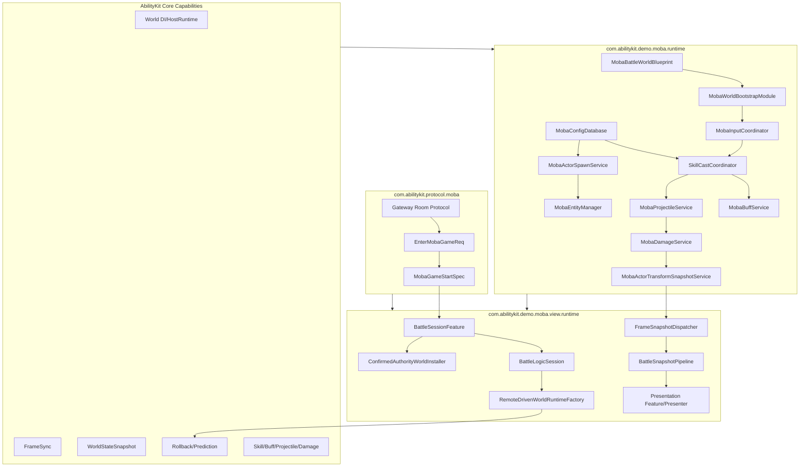
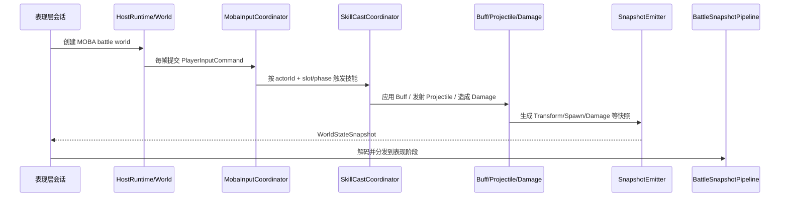
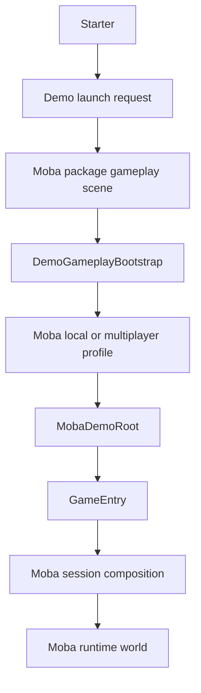

# MOBA Demo 专题总览

> 文档类型：MOBA 项目应用组合导航与证据地图
> 事实基线：2026-08-17
> 文档版本：v3.1
>
> 本目录按运行边界拆解 MOBA 示例，说明逻辑世界、Entitas、配置、输入、技能、Buff、Projectile、Damage、Snapshot、表现层与预测回滚当前怎样协作。各专题分别标明源码事实、验证证据和未完成项；目录中的接口或示例入口不自动代表联机、表现或生产部署能力已经完成。

## 1. 拆分理由

MOBA Demo 是接入程度较高的项目应用层参考，不是待整体抽入框架的默认实现。阅读本目录时应先区分三类内容：

| 内容属性 | 代表内容 | 复用方式 |
|----------|----------|----------|
| 框架契约的实际消费者 | Triggering、Pipeline、Continuous、Targeting、Projectile、Trace、World.DI | 其他项目直接依赖对应 framework package，并遵守其生命周期和失败契约 |
| 可参考的应用层组织 | Cast preparation、领域 Service/System 分工、Context 传播、Snapshot emitter、严格启动校验 | 参考结构后由项目实现和拥有，不承诺与 Demo 同步升级 |
| MOBA 专用策略 | 英雄技能槽、阵营与 Actor 模型、Buff/伤害规则、配置表、Entitas 组件、表现和协议字段 | 仅作为 MOBA 示例事实，不应外推为框架标准 |

判断一段代码属于哪一类时，以语义稳定性和所有权为准，而不是以代码量或复用次数为准。应用层编排即使在多个 MOBA 英雄之间复用，也可能仍然只是 MOBA 领域能力；只有摆脱具体实体、配置和结算规则，并经过非同构玩法验证后，才具备向框架层下沉的条件。

MOBA 示例已经进一步拆成更细专题，便于单独阅读每个设计点：

| 专题 | 关注点 | 文档 |
|------|--------|------|
| 世界启动 | WorldBlueprint、WorldProfile、Module、服务注册、生命周期 | [01-世界启动与运行时装配](01-WorldAndBootstrap.md) |
| DI 与 System/Service 协作 | MobaServicesAutoModule、WorldService、WorldInject、System 调度、测试友好协作 | [12-DI 与 System/Service 协作深潜](12-DIAndSystemServiceCollaborationDeepDive.md) |
| 输入、技能准备与实体身份 | 输入批次门禁、命令路由、slot 解析、技能准备、Actor 注册与索引的所有权边界 | [02-输入、技能准备、配置门面与实体索引](02-InputSkillConfigEntity.md) |
| 技能执行 | Cast 上下文、Pipeline、阶段、运行时 retain 与结束语义 | [05-技能执行深潜](05-SkillExecutionDeepDive.md) |
| 配置、实体索引与生成 | 配置来源和校验、实体索引、Spawn 编排与失败清理 | [06-配置、实体索引与生成深潜](06-ConfigEntitySpawnDeepDive.md) |
| 战斗服务总览 | Buff、Projectile、Damage 的协作入口和领域边界 | [03-Buff、Projectile 与 Damage 管线](03-BuffProjectileDamage.md) |
| Buff 命令与生命周期收敛 | Immediate 入队语义、drain 预算、拒绝、结束顺序与持续状态调和 | [07-Buff 命令执行与生命周期收敛深潜](07-BuffLifecycleDeepDive.md) |
| Projectile 与 Damage | 投射物运行时、命中、伤害请求和结果发布 | [08-Projectile 与 Damage 深潜](08-ProjectileDamageDeepDive.md) |
| Trace/Context/Effect | canonical provenance、Effect/Action trace lifecycle、跨帧 ownership、结构校验与 Action 诊断指标 | [09-Trace、Context 与 Effect 执行深潜](09-TraceContextEffectDeepDive.md) |
| Trigger/Validation/Presentation Cue | TriggerExecutionGateway、Owner-bound Subscription、RuntimeValidation、StageTrigger、PresentationCue | [10-Trigger、Validation 与 Presentation Cue 深潜](10-TriggerValidationPresentationDeepDive.md) |
| PlanActions/Continuous Runtime | ActionSchema、PlanActionModule、ContinuousRuntimeView、LifecycleBinder、ContextSourceBoundary | [11-PlanActions DSL 与 Continuous Runtime 深潜](11-PlanActionsAndContinuousRuntimeDeepDive.md) |
| 工业化流程 | 单元测试、Console smoke、trace artifact、DSL/配置环境测试、CI 分层门禁 | [工程质量：MOBA 与 Shooter 示例工业化流程](../../10-EngineeringQuality/03-MobaShooterIndustrializationFlow.md) |
| Continuous 能力组合设计 | stack、periodic、cue、tag、modifier 与领域 runtime 的组合边界 | [13-持续行为能力组合设计](13-ContinuousCapabilityCompositionDesign.md) |
| 六英雄技能正式实现 | 廉颇、小乔、赵云、墨子、妲己、嬴政的技能/被动需求映射、TriggerPlan、Buff、Projectile、Area、Counter 与验证路径 | [14-六英雄技能正式实现设计](14-HeroSkillFormalDesign.md) |
| 技能 Flow 与 Pipeline 配置 | skills.json、skill_flows.json、Phase Type、Timeline、RulePlan、Sequence、WaitUntil 与 Pipeline 持续标签模板 | [18-技能 Flow 与 Pipeline 配置设计](18-SkillFlowPipelineConfigDesign.md) |
| 联机会话与协议契约 | Gateway room、EnterGame、BattleSessionFeature、RuntimePort、远程/确认辅助世界 | [15-联机会话与协议契约](15-OnlineSessionAndProtocolContract.md) |
| 领域连续运行时与临时实体生命周期 | Motion source、motion.hit、Summon owner/root-owner、容量策略、trace、despawn、gameplay trigger 绑定 | [16-领域连续运行时与临时实体生命周期](16-DomainContinuousRuntimeAndTemporaryEntityLifecycle.md) |
| 主动/被动/Buff/Projectile/AOE 触发效果 | 主动技能、被动 owner-bound、Buff 生命周期、Projectile stage 与 AOE stage 进入 TriggerPlan 和领域服务的当前实现 | [17-主动、被动、Buff、Projectile 与 AOE 触发效果设计](17-ActivePassiveBuffProjectileAoeTriggerEffects.md) |
| Runtime 逻辑层 | 输入输出边界、System/Service 分工、World DI 与轻量测试环境 | [19-Runtime 战斗逻辑层深潜](19-MobaRuntimeLogicLayerDeepDive.md) |
| Console Demo 装配 | Bootstrapper、FeatureHost、同步适配器、自动测试与录制入口 | [20-Console Demo 装配链路深潜](20-ConsoleDemoBootstrapAndFeatureDeepDive.md) |
| Unity 示例宿主 | Starter、package scene、Profile/Catalog、Root 与战斗会话所有权 | [01-世界启动与运行时装配](01-WorldAndBootstrap.md)、[MOBA Demo 顶层解析](../03-MOBA%20Demo%20Analysis.md) |
| 快照与表现 | WorldStateSnapshot、SnapshotBuffer、FrameSnapshotDispatcher、BattleSnapshotPipeline | [04-快照、表现层与预测回滚](04-SnapshotPresentationPrediction.md) |
| 远程驱动 | RemoteDrivenWorldRuntimeFactory、ClientPredictionDriverModule、RollbackRegistry | [04-快照、表现层与预测回滚](04-SnapshotPresentationPrediction.md) |

## 2. 源码分层

## 3. 端到端主流程

## 4. Unity 示例宿主与包内装配边界

MOBA 专题需要区分三层“启动”，它们名称相似但所有者不同：

| 层次 | 入口 | 负责 | 不负责 |
|------|------|------|--------|
| 示例导航 | `StarterController` | 登录、本地/多人选择、写入 launch intent、加载游戏专用 scene | 创建 MOBA World、拥有战斗会话 |
| Scene Composition | `DemoGameplayBootstrap` | 从 MOBA Catalog 选择 Profile，实例化 `MobaDemoRoot` 并绑定到当前 scene | 解释英雄/房间规则、销毁账号或网络会话 |
| MOBA 应用与 World | `GameEntry`、`MobaSessionCoordinatorHost`、`MobaWorldBootstrapModule` | 解释多人 intent/preset，创建应用 Flow、会话、World，安装服务和 System | 成为 Shooter、ET 或 Console 的统一应用层 |

公共 Composition 层只稳定 `gameplay + mode + optional profileId` 的选择协议。当前 `DemoLaunchIntent` 是进程静态、加锁、一次性单槽：后写覆盖前写，没有 generation；Bootstrap 在消费后若 Profile、多人意图或实例化失败，会清空两类 intent。Local 与 Multiplayer 的网络差异不藏在 Catalog 中，而由 Root 入口继续消费 `DemoMultiplayerLaunchIntent`。这让包内资产可开箱运行，同时保留项目应用层自由度。

当前 package 资产事实是：MOBA Local/Multiplayer Profile 均指向同一个 `MobaDemoRoot`；Shooter 则用两个 Root。两种形式都符合公共装配协议，说明 Profile/Catalog 是选择机制，不是强制的应用套件。`DemoGameplayCompositionBuilder` 只在 Editor 中生成/迁移 Profile、Catalog、Bootstrap Prefab、package scene 和 Build Settings，不是 Player runtime 依赖。

---

## 5. 源码阅读路径

1. [01-世界启动与运行时装配](01-WorldAndBootstrap.md)：MOBA world 的创建、模块装配和生命周期入口。
2. [12-DI 与 System/Service 协作深潜](12-DIAndSystemServiceCollaborationDeepDive.md)：服务注册、System 调度和业务服务分层。
3. [15-联机会话与协议契约](15-OnlineSessionAndProtocolContract.md)：Gateway room、EnterGame、BattleSessionFeature、RuntimePort 与辅助世界安装。
4. [02-输入、技能准备、配置门面与实体索引](02-InputSkillConfigEntity.md)：先建立输入批次、命令路由、技能准备和实体身份的边界。
5. [05-技能执行深潜](05-SkillExecutionDeepDive.md)：继续跟踪一次 Cast 怎样进入 Pipeline、阶段运行时和结束流程。
6. [06-配置、实体索引与生成深潜](06-ConfigEntitySpawnDeepDive.md)：查看配置加载、实体索引、Spawn 编排与失败清理。
7. [03-Buff、Projectile 与 Damage 管线](03-BuffProjectileDamage.md)：先阅读三个战斗领域服务的协作总览。
8. [07-Buff 命令执行与生命周期收敛深潜](07-BuffLifecycleDeepDive.md) 与 [08-Projectile 与 Damage 深潜](08-ProjectileDamageDeepDive.md)：再进入各领域的命令、运行时和失败语义。
9. [09-Trace、Context 与 Effect 执行深潜](09-TraceContextEffectDeepDive.md)：canonical provenance、Effect 节点推进、Action 成对生命周期、runtime retain/release、结构校验与诊断证据。
10. [10-Trigger、Validation 与 Presentation Cue 深潜](10-TriggerValidationPresentationDeepDive.md)：触发器订阅、运行时校验、阶段触发与表现 Cue。
11. [11-PlanActions DSL 与 Continuous Runtime 深潜](11-PlanActionsAndContinuousRuntimeDeepDive.md)：配置动作 DSL、强类型 action module、持续运行时查询与上下文边界。
12. [19-Runtime 战斗逻辑层深潜](19-MobaRuntimeLogicLayerDeepDive.md)：从整体上核对输入输出、System/Service 分工、World DI 与测试策略。
13. [20-Console Demo 装配链路深潜](20-ConsoleDemoBootstrapAndFeatureDeepDive.md)：查看 Console 宿主怎样装配 Runtime、同步适配器和自动测试入口。
14. [工程质量：MOBA 与 Shooter 示例工业化流程](../../10-EngineeringQuality/03-MobaShooterIndustrializationFlow.md)：按证据层级理解单元测试、Console smoke、Unity acceptance、artifact 与 CI 门禁。
15. [13-持续行为能力组合设计](13-ContinuousCapabilityCompositionDesign.md)：stack、periodic、cue、tag、modifier 与领域 runtime 的组合边界。
16. [14-六英雄技能正式实现设计](14-HeroSkillFormalDesign.md)：廉颇、小乔、赵云、墨子、妲己、嬴政如何通过 TriggerPlan、Buff、Projectile、Area、Counter 与通用 predicate 落地。
17. [18-技能 Flow 与 Pipeline 配置设计](18-SkillFlowPipelineConfigDesign.md)：skills.json、skill_flows.json、Phase Type、Timeline、RulePlan、Sequence、WaitUntil 与 Pipeline 持续标签模板的当前映射。
18. [16-领域连续运行时与临时实体生命周期](16-DomainContinuousRuntimeAndTemporaryEntityLifecycle.md)：Motion source、motion.hit、Summon 生命周期与 gameplay trigger 绑定的当前实现。
19. [17-主动、被动、Buff、Projectile 与 AOE 触发效果设计](17-ActivePassiveBuffProjectileAoeTriggerEffects.md)：主动技能、被动 owner-bound、Buff、Projectile stage 与 AOE stage 如何进入 TriggerPlan 并落到领域服务。
20. [04-快照、表现层与预测回滚](04-SnapshotPresentationPrediction.md)：逻辑结果怎样进入客户端表现，以及远程驱动和预测回滚目前覆盖到哪里。

## 6. 单局验收范围

当前示例有一条可重复执行的死亡、复活、再次战斗和结算测试旅程。`MobaUnitLifecycleService` 只执行已经由玩法规则批准的复活状态转换：校验死亡状态、恢复生命、应用可选复活位置、重置死亡去重状态、发布 `unit.respawn`，并同步恢复结果快照。复活时机、出生点选择和次数限制仍属于上层 gameplay rule。

验收分为两个执行环境：

| 证据层级 | 验收入口 | 已验证范围 | 不能据此推断 |
|---|---|---|---|
| Console World 生命周期 smoke | `MobaCompleteBattleLifecycleSmokeTests.ConsoleWorldCompletesDeathRespawnRedeathAndSettlement` | 正式 World DI 装配下的死亡、复活、再次死亡、再次复活和终局 | Unity 表现、网络消息、多人一致性 |
| Unity EditMode 单局 journey acceptance | `MobaCompleteBattleJourneyAcceptanceTests.DajiBattleJourney_ShouldCoverCombatDeathRespawnAndSettlement` | 进场、移动、技能、Effect trace、Projectile、Buff、伤害、死亡、异地半血复活、再次战斗和终局 | 多客户端联机、自动复活规则、正式死亡/复活表现接线 |

P1 门禁 `moba-complete-battle-journey` 组合运行这两个测试。仓库证据显示该门禁于 2026-07-27 通过；这是一次已执行验证记录，不是持续通过保证。修改死亡、复活、技能事件链或相关装配后仍需重新运行门禁。

2026-08-16 当次 `.NET` 主工程结果为 `279/305`。26 项共同在 World 启动前被 `trigger 10060201 / action[2]` 的 SpawnArea 严格校验阻断：Trigger action 覆盖 `duration_ms=300`，Console 配置中的 Area `40060201` 仍解析为 `delay_ms=400`。这不会推翻 2026-07-27 的历史 journey artifact，但说明当前工作区不能把 Console World、AI、Summon 或生命周期 Smoke 写成持续通过。独立 View Runtime、Host、Acceptance 和 Unity ownership 结果必须继续与主 World 分层陈述。

尚未闭合的范围包括自动复活倒计时、出生点配置、复活次数规则、独立的死亡/复活网络表现事件，以及 `BattleActorDeathViewEventHandler`、`BattleActorRespawnViewEventHandler` 到正式 runtime/network event sink 的接线。因此本节只描述单局测试旅程，不将其扩展为多人网络战局或生产玩法完成度。

## 7. 关键源码入口

| 主题 | 源码 |
|------|------|
| Battle Blueprint | `Unity/Packages/com.abilitykit.demo.moba.runtime/Runtime/Worlds/Blueprints/MobaBattleWorldBlueprint.cs` |
| World Bootstrap | `Unity/Packages/com.abilitykit.demo.moba.runtime/Runtime/Application/Systems/MobaWorldBootstrapModule.cs` |
| 服务自动注册 | `Unity/Packages/com.abilitykit.demo.moba.runtime/Runtime/Application/Systems/Bootstrap/MobaServicesAutoModule.cs` |
| System 顺序与协作 | `Unity/Packages/com.abilitykit.demo.moba.runtime/Runtime/Application/Systems/MobaSystemOrder.cs`、`Unity/Packages/com.abilitykit.demo.moba.runtime/Runtime/Application/Systems/MobaWorldSystemExecution.cs` |
| 服务基类 | `Unity/Packages/com.abilitykit.demo.moba.runtime/Runtime/Application/Services/Templates/GameServiceBase.cs` |
| 输入协调 | `Unity/Packages/com.abilitykit.demo.moba.runtime/Runtime/Application/Services/Input/MobaInputCoordinator.cs` |
| 技能释放 | `Unity/Packages/com.abilitykit.demo.moba.runtime/Runtime/Application/Services/Skill/Cast/SkillCastCoordinator.cs` |
| 技能 Flow Pipeline | `Unity/Packages/com.abilitykit.demo.moba.runtime/Runtime/Application/Services/Skill/Pipeline/TableDrivenMobaSkillPipelineLibrary.cs` |
| 技能 Flow DTO | `Unity/Packages/com.abilitykit.demo.moba.share/Runtime/Game/Config/Dto/SkillDtos.cs` |
| 配置门面 | `Unity/Packages/com.abilitykit.demo.moba.runtime/Runtime/Infrastructure/Config/Core/MobaConfigDatabase.cs` |
| 实体索引 | `Unity/Packages/com.abilitykit.demo.moba.runtime/Runtime/Application/Services/EntityManager/MobaEntityManager.cs` |
| Actor 生成 | `Unity/Packages/com.abilitykit.demo.moba.runtime/Runtime/Application/Services/EntityConstruction/MobaActorSpawnService.cs` |
| Buff 服务 | `Unity/Packages/com.abilitykit.demo.moba.runtime/Runtime/Application/Services/Buffs/MobaBuffService.cs` |
| Projectile 服务 | `Unity/Packages/com.abilitykit.demo.moba.runtime/Runtime/Application/Services/Projectile/MobaProjectileService.cs` |
| Damage 服务 | `Unity/Packages/com.abilitykit.demo.moba.runtime/Runtime/Application/Services/Combat/MobaDamageService.cs` |
| Unit 生命周期 | `Unity/Packages/com.abilitykit.demo.moba.runtime/Runtime/Application/Services/Unit/MobaUnitLifecycleService.cs` |
| Trace Registry | `Unity/Packages/com.abilitykit.demo.moba.runtime/Runtime/Application/Services/Trace/MobaTraceRegistry.cs` |
| Trace retention / validation | `Unity/Packages/com.abilitykit.demo.moba.runtime/Runtime/Application/Services/Trace/MobaTraceRetention.cs`、`Unity/Packages/com.abilitykit.demo.moba.runtime/Runtime/Application/Services/Trace/MobaTraceRuntimeServices.cs` |
| Effect Lineage | `Unity/Packages/com.abilitykit.demo.moba.runtime/Runtime/Application/Services/Context/Lineage/MobaEffectLineageInput.cs` |
| Canonical provenance | `Unity/Packages/com.abilitykit.demo.moba.runtime/Runtime/Application/Services/Context/Providers/MobaTriggerContextResolveExtensions.cs` |
| Combat Context | `Unity/Packages/com.abilitykit.demo.moba.runtime/Runtime/Application/Services/Context/Execution/MobaCombatExecutionContext.cs` |
| Effect Invoker | `Unity/Packages/com.abilitykit.demo.moba.runtime/Runtime/Application/Services/Effect/MobaEffectInvokerService.cs` |
| Effect/Action lifecycle | `Unity/Packages/com.abilitykit.demo.moba.runtime/Runtime/Application/Services/Skill/Effects/MobaEffectExecutionService.cs` |
| Transform Snapshot | `Unity/Packages/com.abilitykit.demo.moba.runtime/Runtime/Application/Services/Actor/MobaActorTransformSnapshotService.cs` |
| Trigger Execution Gateway | `Unity/Packages/com.abilitykit.demo.moba.runtime/Runtime/Application/Services/Triggering/MobaTriggerExecutionGateway.cs` |
| Stage Trigger Service | `Unity/Packages/com.abilitykit.demo.moba.runtime/Runtime/Application/Services/Triggering/MobaStageTriggerService.cs` |
| Trigger Subscription | `Unity/Packages/com.abilitykit.demo.moba.runtime/Runtime/Application/Services/Triggering/MobaTriggerPlanSubscriptionService.cs` |
| Runtime Validation | `Unity/Packages/com.abilitykit.demo.moba.runtime/Runtime/Application/Services/Validation/MobaRuntimeValidation.cs` |
| Presentation Cue | `Unity/Packages/com.abilitykit.demo.moba.runtime/Runtime/Application/Services/Triggering/Cue/MobaPresentationTriggerCue.cs` |
| PlanAction Schema | `Unity/Packages/com.abilitykit.demo.moba.runtime/Runtime/Application/Services/Triggering/PlanActions/Core/MobaPlanActionSchemaBase.cs` |
| PlanAction Module | `Unity/Packages/com.abilitykit.demo.moba.runtime/Runtime/Application/Services/Triggering/PlanActions/Core/MobaPlanActionModuleBase.cs` |
| Area Sync | `Unity/Packages/com.abilitykit.demo.moba.runtime/Runtime/Application/Systems/Area/MobaAreaSyncSystem.cs` |
| Continuous Query | `Unity/Packages/com.abilitykit.demo.moba.runtime/Runtime/Application/Services/Continuous/MobaContinuousRuntimeQueryService.cs` |
| Continuous View | `Unity/Packages/com.abilitykit.demo.moba.runtime/Runtime/Application/Services/Continuous/MobaContinuousRuntimeViews.cs` |
| Motion Continuous Runtime | `Unity/Packages/com.abilitykit.demo.moba.runtime/Runtime/Application/Services/Motion/MobaMotionContinuousRuntime.cs` |
| Motion Tick | `Unity/Packages/com.abilitykit.demo.moba.runtime/Runtime/Application/Systems/Motion/MobaMotionTickSystem.cs` |
| Motion Hit Trigger | `Unity/Packages/com.abilitykit.demo.moba.runtime/Runtime/Application/Services/Motion/MobaMotionHitTriggerService.cs` |
| Summon Service | `Unity/Packages/com.abilitykit.demo.moba.runtime/Runtime/Application/Services/Summon/MobaSummonService.cs` |
| Summon Lifecycle | `Unity/Packages/com.abilitykit.demo.moba.runtime/Runtime/Application/Systems/Summon/MobaSummonLifecycleSystem.cs` |
| Summon Source Context | `Unity/Packages/com.abilitykit.demo.moba.runtime/Runtime/Application/Services/Summon/SummonSourceContext.cs` |
| Gameplay Trigger Binding | `Unity/Packages/com.abilitykit.demo.moba.runtime/Runtime/Application/Gameplay/Triggering/MobaGameplayTriggerBindingService.cs` |
| MOBA Tests | [`AbilityKit.Demo.Moba.Tests.csproj`](../../../../src/AbilityKit.Demo.Moba.Tests/AbilityKit.Demo.Moba.Tests.csproj)、[`ConsoleMobaSmokeFlowTests.cs`](../../../../src/AbilityKit.Demo.Moba.Tests/Smoke/ConsoleMobaSmokeFlowTests.cs) |
| 单局生命周期 Console Smoke | [`MobaCompleteBattleLifecycleSmokeTests.cs`](../../../../src/AbilityKit.Demo.Moba.Tests/Smoke/MobaCompleteBattleLifecycleSmokeTests.cs) |
| 单局旅程 Unity Acceptance | [`MobaCompleteBattleJourneyAcceptanceTests.cs`](../../../../Unity/Packages/com.abilitykit.demo.moba.view.runtime/Runtime/Game/Test/UnitTest/Acceptance/MobaCompleteBattleJourneyAcceptanceTests.cs) |
| MOBA Smoke Artifact | `src/AbilityKit.Demo.Moba.Tests/Smoke/ConsoleSmokeTraceArtifactExporter.cs` |
| 会话门面 | `Unity/Packages/com.abilitykit.demo.moba.view.runtime/Runtime/Game/Battle/Client/Session/Features/Core/BattleSessionFeature.cs` |
| Gateway 房间协议 | `Unity/Packages/com.abilitykit.protocol.moba/Runtime/Room/WireRoomGatewayTypes.cs` |
| 进场协议 | `Unity/Packages/com.abilitykit.protocol.moba/Runtime/EnterGame/EnterMobaGameStructs.cs` |
| 运行时端口 | `Unity/Packages/com.abilitykit.demo.moba.runtime/Runtime/Application/Services/IO/IMobaBattleRuntimePort.cs` |
| 远程驱动 | `Unity/Packages/com.abilitykit.demo.moba.view.runtime/Runtime/Game/Battle/Client/Session/Features/Sim/RemoteDrivenWorldRuntimeFactory.cs` |
| 快照路由 | `Unity/Packages/com.abilitykit.demo.moba.view.runtime/Runtime/Game/Battle/Client/SnapshotRouting/FrameSnapshotDispatcher.cs` |
| 统一启动请求 | `Unity/Packages/com.abilitykit.demo.common/Runtime/Gameplay/DemoLaunchIntent.cs` |
| Scene Composition Bootstrap | `Unity/Packages/com.abilitykit.demo.common/Runtime/Composition/DemoGameplayBootstrap.cs` |
| MOBA package scene | `Unity/Packages/com.abilitykit.demo.moba.view.runtime/Scenes/MobaDemoGameplayScene.unity` |
| MOBA Root 入口 | `Unity/Packages/com.abilitykit.demo.moba.view.runtime/Runtime/Game/App/Entry/GameEntry.cs` |
| Composition 生成与迁移 | `Unity/Packages/com.abilitykit.demo.moba.editor/Editor/Composition/DemoGameplayCompositionBuilder.cs` |

*文档版本：v3.1 | 最后更新：2026-08-17 | 当前主工程：279/305；历史 journey：2026-07-27 通过；聚焦 Unity：canonical 14/14、ownership 9/9、Trace 15/15、Action diagnostics 15/15*
