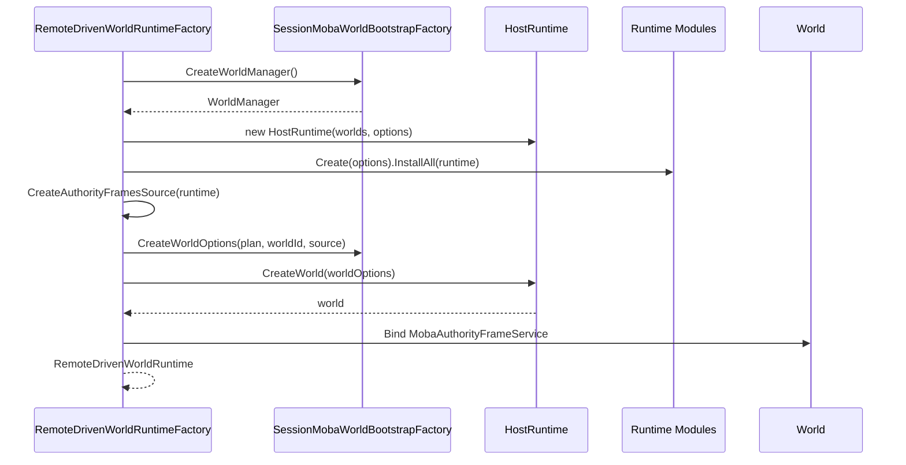

# MOBA 世界启动与运行时装配

> 文档类型：MOBA 项目应用组合深潜
> 事实基线：2026-08-17
>
> 本文以当前 MOBA runtime 与 view runtime 源码为准，说明 battle world 如何完成类型注册、Blueprint 配置、服务容器构建、Entitas 系统安装、远程帧驱动和会话释放。本文只描述已有实现，不把可替换能力当作已实现能力。

## 1. 责任边界

MOBA 世界启动不是单个 Bootstrap 类完成的，而是由五层协作：

| 层级 | 当前责任 | 不负责 |
|------|----------|--------|
| `WorldTypeRegistry` / `WorldBlueprintRegistry` | 注册 world type 与 Blueprint | 创建战斗服务实例 |
| `MobaBattleWorldBlueprint` | 声明 battle profile、feature 位集，并确保服务扫描与 Bootstrap 两个 Module | 解析战斗计划、安装客户端预测 |
| `WorldContainerBuilder` | 注册按 Attribute 扫描出的服务、配置模块和会话实例 | 决定 Entitas system 执行顺序 |
| `MobaWorldBootstrapModule` | 配置 Bootstrap Flow，扫描并安装 MOBA/Projectile systems | 创建 HostRuntime |
| `RemoteDrivenWorldRuntimeFactory` | 组装 HostRuntime modules、world options、world 和 authority frame 绑定 | 管理整个 BattleSession 的所有表现资源 |

因此，“创建一个 battle world”至少包含两次装配：

1. 会话侧先构造世界工厂、服务容器和 HostRuntime modules；
2. Blueprint 再补充世界级扩展选项、碰撞服务、Entitas context factory 与 Bootstrap Module。

## 2. 世界类型与 Blueprint 注册

`SessionMobaWorldBootstrapFactory.CreateWorldManager()` 同时建立两类注册表：

```text
WorldTypeRegistry
  lobby  -> Entitas world
  battle -> Entitas world

WorldBlueprintRegistry
  lobby  -> MobaLobbyWorldBlueprint
  battle -> MobaBattleWorldBlueprint
```

之后用 `WorldBlueprintWorldFactory` 包装 `RegistryWorldFactory`，最终交给 `WorldManager`。外部创建 `WorldCreateOptions(worldId, worldType)` 时，world type 用于选择 Blueprint；Blueprint 本身并不再写一个通用 `WorldType` 字段。

`MobaBattleWorldBlueprint` 的声明为：

```text
WorldType = "battle"
Profile   = Battle
Features  = EntitasContexts | BattleRuntime
Modules   = MobaServicesAutoModule
            MobaWorldBootstrapModule
```

其中 `BattleRuntime` 是组合位集：

```text
BootstrapFlow
| InputPort
| SnapshotOutput
| StateSync
| Config
| Skills
| Projectiles
| Triggering
```

这些 feature 当前作为 `MobaLogicWorldBlueprintOptions` 写入 `WorldCreateOptions.Extensions`，供后续组件查询。feature 位本身不会自动注册服务；实际服务仍来自容器扫描、显式模块和 Bootstrap Flow。

## 3. Blueprint 配置顺序

`MobaLogicWorldBlueprintBase.Configure()` 固定执行三个步骤：


### 3.1 Common 配置

`ConfigureCommon()` 执行：

1. 如果调用方没有提供 `ServiceBuilder`，创建 default-only 容器；
2. 注册 singleton `ICollisionService -> CollisionService`；
3. feature 包含 `EntitasContexts` 时，写入 `MobaEntitasContextsFactory`。

调用方已经提供 `ServiceBuilder` 时，Blueprint 会继续在同一 builder 上注册碰撞服务。具体重复注册行为由 builder 的注册语义决定，调用方不应依赖 Blueprint 替换既有服务。

### 3.2 扩展选项

`ConfigureBlueprintOptions()` 创建 `MobaLogicWorldBlueprintOptions` 并按类型键写入 `WorldCreateOptions.Extensions`。消费者通过 `TryGetMobaLogicWorldBlueprintOptions()` 读取，不依赖字符串键。

### 3.3 Module 去重

`EnsureModule<TModule>()` 按运行时精确类型扫描 `options.Modules`：

- 已有同类型实例时不重复添加；
- 子类或其他实现类型不视为同一个 module；
- factory 和 options 为空时立即抛出参数异常。

battle Blueprint 分别确保存在一个 `MobaServicesAutoModule` 和一个 `MobaWorldBootstrapModule`。前者继续按 application services、systems services 和 infrastructure services 三组命名空间安装 Attribute service modules；后者配置 Bootstrap Flow 并参与 Entitas system 安装。Blueprint 仍不逐项列举全部战斗服务。

## 4. 会话侧服务容器

远程会话通过 `SessionMobaWorldBootstrapFactory.CreateWorldOptions()` 创建 options。其 service builder 使用 Attribute 扫描，程序集包括：

- World service 基础程序集；
- `BattleLogicSession` 所在程序集；
- MOBA runtime / Bootstrap Module 程序集；
- view runtime 的 `BattleSessionFeature` 程序集。

扫描命名空间前缀为 `AbilityKit`。随后显式执行：

1. 将同一个 `ResourcesTextAssetLoader` 注册为 `ITextAssetLoader` 与 `ITextAssetDirectoryLoader`；
2. 添加 `MobaConfigWorldModule`；
3. 可选注册 `WorldInitData`，内容来自启动计划的 create-world opcode/payload；
4. 缺失时注册 singleton `IFrameTime -> FrameTime`；
5. 缺失时注册 singleton `ICollisionService -> CollisionService`；
6. authority frame source 非空时注册该实例。

`registerWorldInitData = false` 只跳过 `WorldInitData`，不会跳过配置、时间或碰撞服务。

## 5. Bootstrap Module 与系统安装

`MobaWorldBootstrapModule` 同时实现 `IWorldModule` 和 `IEntitasSystemsInstaller`。

### 5.1 静态初始化

首次触发类型初始化时：

1. 调用 `MobaBootstrapFlowModule.EnsureInitialized()`，确保 Flow stages 已完成静态注册；
2. 创建共享的 `MobaBootstrapFlow`。

该 Flow 保存在静态只读字段中，因此 module 实例本身不是 Flow 状态的所有者。

### 5.2 服务配置

`Configure(WorldContainerBuilder)` 只委托给 `_flowBootstrap.Configure(builder)`。服务并非在 Blueprint 里逐项手工注册。

### 5.3 Entitas system 安装

`Install(contexts, systems, services)` 先校验三个参数，再执行：

```text
AutoSystemInstaller.Install
  assemblies:
    MobaWorldBootstrapModule assembly
    ProjectileTickSystem assembly
  namespace prefixes:
    AbilityKit.Demo.Moba
    AbilityKit.Combat.Projectile
```

之后调用 `_flowBootstrap.Install(...)`。如果传入的 `IContexts` 不是生成的全局 `Contexts`，当前实现只记录 warning，仍继续自动安装；warning 不代表安装已经失败，也不保证所有依赖生成 Context 的系统可正常工作。

## 6. 远程驱动 HostRuntime

`RemoteDrivenWorldRuntimeFactory.Create()` 的实际顺序如下：



WorldId 直接来自 `options.Plan.World.WorldId`，world type 则来自启动计划。工厂没有把 world type 强制改为 `battle`，因此启动计划必须与已注册类型一致。

## 7. 预测模式与纯远程模式

两种模式都安装同一个 `ClientPredictionDriverModule` 类型，以及：

- `ServerFrameTimeModule(FixedDelta)`；
- `WorldAutoStartModule`。

差异来自参数：

| 参数 | 客户端预测 | 纯远程驱动 |
|------|------------|------------|
| local input source | 使用 options resolver | 固定返回 null |
| input delay | `max(0, InputDelayFrames)` | 0 |
| max prediction ahead | 30 | 0 |
| min prediction window | 1 | 0 |
| rollback | 开启 | 关闭 |
| rollback history | 600 | 0 |
| capture interval | 每帧 | 0 |
| rollback registry | 调用方 builder | 新建空 registry |
| state hash | 调用方 builder | null |

所以“关闭客户端预测”不是移除 prediction driver，而是以零预测窗口、无本地输入、无 rollback 的方式复用同一驱动模块。

## 8. Authority frame 绑定

创建 world 前，工厂尝试从 HostRuntime feature 中获取 `IClientPredictionDriverStats`，成功时包装成 `ClientPredictionDriverStatsFramesSource` 并注册到世界容器。

创建 world 后，再尝试解析 `MobaAuthorityFrameService` 并调用 `BindWorld(world.Id)`。

这两步都是 best-effort：

- feature 查询异常只记录日志并返回 null；
- authority service 缺失不会使创建失败；
- bind 异常也只记录日志。

因此 world 创建成功不等于 authority frame 诊断已经可用。需要通过 readiness/diagnostics 单独验证。

## 9. 生命周期与失败边界

### 9.1 正常释放

`RemoteDrivenWorldRuntime.DestroyWorld()` 委托给 `HostRuntime.DestroyWorld(WorldId)`。BattleSession 的释放链还会通过 `SessionSimRuntimeDisposer` 和 handles 执行 fallback destroy，避免只保存了 runtime、没有保存 wrapper 时无法销毁。

销毁 world 与释放快照路由、表现订阅、confirmed world 是不同动作，由上层 session orchestrator 分别管理。

### 9.2 创建失败

`RemoteDrivenWorldRuntimeFactory.Create()` 当前没有 `try/finally`：

- module 安装失败；
- world options 构造失败；
- `CreateWorld()` 抛出；

这些异常会直接向调用方传播，工厂内部不会自动销毁已经创建的 HostRuntime 或部分 world。调用方若在更外层添加资源，必须在自身失败路径中负责清理。

### 9.3 参数校验边界

`RemoteDrivenWorldRuntimeFactoryOptions` 只归一化负数 `InputDelayFrames`。它不主动校验：

- `Plan` 是否为空；
- remote/local input resolver 是否为空；
- rollback/hash builder 是否与预测开关匹配；
- `FixedDelta` 是否为正数。

最终失败点可能落在 module 构造、world options 构造或运行阶段，集成层应提前验证启动计划。

## 10. Scene Bootstrap 与 World Bootstrap 不是同一层

当前 Unity 示例同时存在 `DemoGameplayBootstrap` 和 `MobaWorldBootstrapModule`。前者是 Scene Composition owner，后者是 MOBA runtime World Module；二者不应因为名称接近而合并。

```mermaid
flowchart LR
    Scene[Package gameplay scene] --> Composition[DemoGameplayBootstrap]
    Composition --> Root[MobaDemoRoot]
    Root --> Entry[GameEntry]
    Entry --> Session[Moba session and host composition]
    Session --> Manager[WorldManager]
    Manager --> Blueprint[MobaBattleWorldBlueprint]
    Blueprint --> Module[MobaWorldBootstrapModule]
    Module --> Services[MOBA services and Entitas systems]
```



| 对象 | 创建/持有者 | 生命周期终点 | 失败责任 |
|------|-------------|--------------|----------|
| launch request | Starter 或 Editor menu | `DemoGameplayBootstrap` 调用 `DemoLaunchIntent.TryConsume` 一次性消费 | Scene launch 失败清空两类 intent |
| Gameplay Root | `DemoGameplayBootstrap` | `Shutdown` / Bootstrap `OnDestroy` 销毁实例 | 只补偿 Root 实例化，不回滚外部登录或 Room |
| `GameEntry` 应用 Root | `MobaDemoRoot` Prefab | `GameEntry.OnDestroy` 关闭 Flow、Detach Entry Modules | 应用入口负责自身模块与多人会话资源 |
| Host/World | Session/World factory | Session disposer、WorldManager/HostRuntime teardown | 各创建阶段需要项目侧补偿与聚合异常策略 |
| World services/systems | Blueprint + `MobaWorldBootstrapModule` | 随 World teardown | 由 World 生命周期管理，不由 Scene Bootstrap 逐项销毁 |

Scene Bootstrap 成功只表示正确 Root 已进入正确 scene，不等于 World 已创建、配置严格校验已通过、多人 Room 已进入 InBattle，或网络资源已具备 teardown。反过来，纯 .NET Console 与 ET 可以直接组合 Host/World 而完全不消费 Scene Bootstrap。这个分层保证开箱入口不会污染战斗工具包的跨宿主边界。

`DemoLaunchIntent` 当前是无 generation 的静态单槽，`ReturnToStarter` 和 Starter 的 `LoadSceneAsync` 都不观测异步加载结果。若产品需要并发请求、取消、加载重试或跨进程恢复，应在项目层引入带 request id/generation 的状态机；不应把这些应用策略塞进 `MobaWorldBootstrapModule`。

## 11. 扩展准则

| 需求 | 推荐接入点 |
|------|------------|
| 新增 world 类型 | type registry + Blueprint registry |
| 新增 battle feature 声明 | `MobaLogicWorldFeatures` 与 Blueprint options 消费方 |
| 新增可注入服务 | `WorldService` Attribute 或专用 world module |
| 新增 Entitas system | system Attribute、安装程序集和命名空间范围 |
| 修改启动 Flow | `MobaBootstrapFlow` stage/module |
| 注入网络帧、时间或预测策略 | HostRuntime module / factory options |
| 新增会话资源 | session handles 与 disposer，不放入 Blueprint |

不要只向 feature 位集中增加枚举值并假设能力自动生效；必须同时提供实际服务、系统或 Flow stage，并补充 readiness 验证。

## 12. 自动测试证据与补测边界

本节不把类型存在、测试 Harness 能创建 world 或其他示例的相似启动路径扩大为 MOBA view 生产装配证据。结论按当前能定位到的实际断言分层。

### 12.1 已有直接证据

| 证据 | 当前直接证明 | 不能据此证明 |
|------|--------------|--------------|
| `BattleRuntimeOptimizationTests.RemoteDrivenRuntimeModuleFactory_RetainsSixHundredPredictionFrames` | MOBA 工厂当前将预测回滚历史常量固定为 600 | 不证明运行时实际捕获 600 帧，也不覆盖 remote-only 参数组合 |
| `SessionOrchestratorLifecycleTests.StartSession_FailureAtEveryHostPhase_CleansUpAndFaults` | orchestrator 在多个启动阶段注入失败时按预期执行清理并进入 Faulted，且不保留测试 Host 声明的活动资源 | 使用 `FailureInjectingHost`，不执行真实 `RemoteDrivenWorldRuntimeFactory`、world 容器或 Blueprint |
| `SessionOrchestratorLifecycleTests.StopSession_WhenCleanupStepThrows_ContinuesAndResumesOnlyFailedWork` | 单个清理步骤失败后继续执行其余步骤；再次 Stop 只重试失败工作，成功后重复 Stop 幂等 | 不证明每个生产资源的 Dispose/Destroy 内部都已正确解除订阅 |
| `SessionOrchestratorLifecycleTests.DestroyBattleWorlds_WhenRemoteDestroyFails_StillDestroysConfirmedAndPropagates` | remote world 销毁失败时仍尝试 confirmed world，并传播原异常 | 委托顺序测试不等于两个真实 world 已完整销毁 |
| `SessionOrchestratorLifecycleTests.DestroyBattleWorlds_WhenBothDestroyOperationsFail_AggregatesBothFailures` | 两个 world 销毁都失败时按执行顺序聚合异常 | 不覆盖 HostRuntime 部分创建失败后的补偿清理 |
| `BattleHudInputEventBridgeTests` 中 `CreateWorldOptions(..., registerWorldInitData: false)` 路径 | HUD 输入桥接测试实际使用会话工厂构造不含 `WorldInitData` 的 world options | 该测试目的不是审计 service builder，不能据此宣称配置、快照、技能和 projectile 服务全部可解析 |

### 12.2 当前由源码固定的装配契约

| 契约 | 源码事实 | 待固定的回归边界 |
|------|----------|------------------|
| world 与 Blueprint 注册 | 会话工厂为 lobby/battle 注册 Entitas world type，并向 Blueprint registry 注册对应 Blueprint | 直接创建两类 world，验证未知 world type 的失败语义和 registry 覆盖行为 |
| battle Blueprint | profile 为 Battle，features 为 `EntitasContexts | BattleRuntime`；确保 `MobaServicesAutoModule` 与 `MobaWorldBootstrapModule` 各一个 | 预置同类型 Module 后验证精确类型去重；同时固定子类不参与去重的现有语义 |
| Common 配置 | 缺失时创建 service builder，注册 Grid broadphase collision service，并写入 `MobaEntitasContextsFactory` | 调用方已有 builder、重复 collision 注册和非生成 `IContexts` warning 路径 |
| 会话 service builder | 扫描四个程序集，显式注册 Resources loader、config module、可选 init data、frame time、collision 和可选 authority source | 分别解析关键服务并验证 `registerWorldInitData=false` 只影响 init data |
| Bootstrap 安装 | 自动系统安装范围包含 MOBA runtime 与 Projectile assembly/namespace，随后安装 Bootstrap Flow | 安装顺序、重复安装、错误 `IContexts` 对具体系统的影响 |
| remote-driven 创建 | 依次创建 manager/runtime、安装 modules、构造 authority source、创建 world 并 best-effort 绑定 authority service | module 安装、options 构造、`CreateWorld` 和 bind 各阶段失败时的真实资源状态 |
| prediction/remote-only | prediction 使用 ahead=30、history=600、capture=1、rollback=true；remote-only 使用 null local input、ahead=0、history=0、rollback=false、hash=null | 两种工厂组合的直接构造测试，以及 driver feature、registry 和 hash calculator 的实际解析 |

### 12.3 优先补测

1. 为 `MobaBattleWorldBlueprint.Configure` 增加直接测试，固定 profile、feature、双 Module 和精确类型去重。
2. 为 `SessionMobaWorldBootstrapFactory` 增加 service resolution 测试，分别覆盖 init data 开关和 authority source 可选注册。
3. 为 `RemoteDrivenRuntimeModuleFactory` 增加 prediction 与 remote-only 参数组合测试，不再只固定 600 常量。
4. 对 `RemoteDrivenWorldRuntimeFactory.Create` 注入 module 安装、world 创建和 authority bind 故障，验证调用方补偿清理责任。
5. 使用真实 session resources 验证 teardown 后 remote world、confirmed world、snapshot routing 和表现订阅均不再活动；现有 `FailureInjectingHost` 只固定编排状态机。

## 13. 源码索引

| 主题 | 源码 |
|------|------|
| Blueprint 基类与 feature 位集 | `Unity/Packages/com.abilitykit.demo.moba.runtime/Runtime/Worlds/Blueprints/MobaLogicWorldBlueprintBase.cs` |
| Battle Blueprint | `Unity/Packages/com.abilitykit.demo.moba.runtime/Runtime/Worlds/Blueprints/MobaBattleWorldBlueprint.cs` |
| Blueprint 注册 | `Unity/Packages/com.abilitykit.demo.moba.runtime/Runtime/Worlds/Blueprints/MobaWorldBlueprintsRegistration.cs` |
| 服务自动注册 Module | `Unity/Packages/com.abilitykit.demo.moba.runtime/Runtime/Application/Systems/Bootstrap/MobaServicesAutoModule.cs` |
| Bootstrap Module | `Unity/Packages/com.abilitykit.demo.moba.runtime/Runtime/Application/Systems/MobaWorldBootstrapModule.cs` |
| 会话世界工厂与服务容器 | `Unity/Packages/com.abilitykit.demo.moba.view.runtime/Runtime/Game/Battle/Client/Session/Features/Controllers/SessionMobaWorldBootstrapFactory.cs` |
| 远程 world runtime 工厂 | `Unity/Packages/com.abilitykit.demo.moba.view.runtime/Runtime/Game/Battle/Client/Session/Features/Sim/RemoteDrivenWorldRuntimeFactory.cs` |
| 远程 HostRuntime modules | `Unity/Packages/com.abilitykit.demo.moba.view.runtime/Runtime/Game/Battle/Client/Session/Features/Sim/RemoteDrivenRuntimeModuleFactory.cs` |
| 远程 world 安装 | `Unity/Packages/com.abilitykit.demo.moba.view.runtime/Runtime/Game/Battle/Client/Session/Features/Sim/RemoteDrivenWorldInstaller.cs` |
| 会话模拟释放 | `Unity/Packages/com.abilitykit.demo.moba.view.runtime/Runtime/Game/Battle/Client/Session/Features/Sim/SessionSimRuntimeDisposer.cs` |
| 远程 handles | `Unity/Packages/com.abilitykit.demo.moba.view.runtime/Runtime/Game/Battle/Client/Session/Features/Core/BattleSessionHandles.RemoteDriven.cs` |
| Session 生命周期测试 | `Unity/Packages/com.abilitykit.demo.moba.view.runtime/Runtime/Game/Test/UnitTest/SessionOrchestratorLifecycleTests.cs` |
| 预测历史常量测试 | `Unity/Packages/com.abilitykit.demo.moba.view.runtime/Runtime/Game/Test/UnitTest/BattleRuntimeOptimizationTests.cs` |
| Scene Composition Bootstrap | `Unity/Packages/com.abilitykit.demo.common/Runtime/Composition/DemoGameplayBootstrap.cs` |
| Gameplay Profile/Catalog | `Unity/Packages/com.abilitykit.demo.common/Runtime/Composition/DemoGameplayProfileSO.cs`、`DemoGameplayCatalogSO.cs` |
| MOBA Unity Entry | `Unity/Packages/com.abilitykit.demo.moba.view.runtime/Runtime/Game/App/Entry/GameEntry.cs` |

## 14. 版本与验证基线

- 当前事实仍是 battle Blueprint 同时安装服务扫描与 Bootstrap 两个 Module，prediction rollback history 为 600；框架 World/Host 提供装配机制，具体 Blueprint、Bootstrap Stage、Entitas system order 和 Session disposer 均由 MOBA 项目拥有。
- `PlanTriggeringStage` 在 World 创建期执行严格 runtime validation。2026-08-16 `AbilityKit.Demo.Moba.Tests` 共 305 项，279 通过、26 失败；共同阻断是 trigger `10060201` 的 SpawnArea 有效持续时间 300ms 小于延迟 400ms。失败说明启动门禁生效，不应通过跳过校验把配置错误伪装成 World 可用。
- 同日独立通过：MOBA View Runtime 147/147、Host 6/6、Acceptance 8/8。它们分别证明 view/session、host adapter 和离线 acceptance 契约，不替代正式 World 启动成功。
- 本地 Unity ownership artifact 记录 9/9 通过，覆盖 Buff/Projectile/Summon/Skill runtime 所有权；它不是本轮重新执行的完整 Unity EditMode/PlayMode，也不是发布 gate 运行记录。
- 构建与测试仍有依赖漏洞、Entitas/DesperateDevs 兼容性、nullable 等既有警告，不能记为零警告基线。

*文档版本：v3.1 | 最后更新：2026-08-17*
