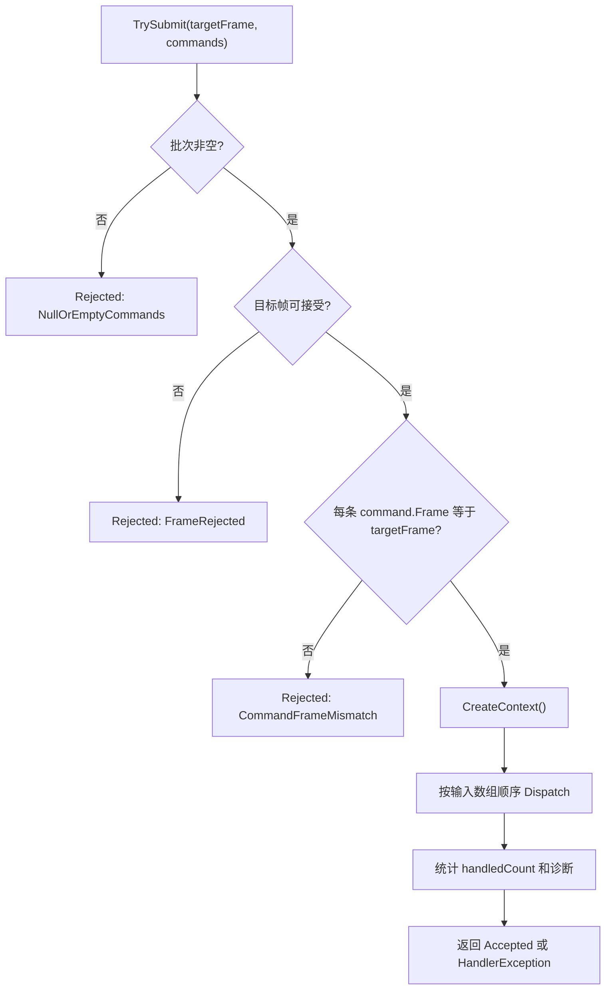
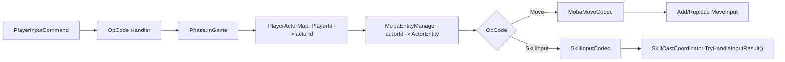
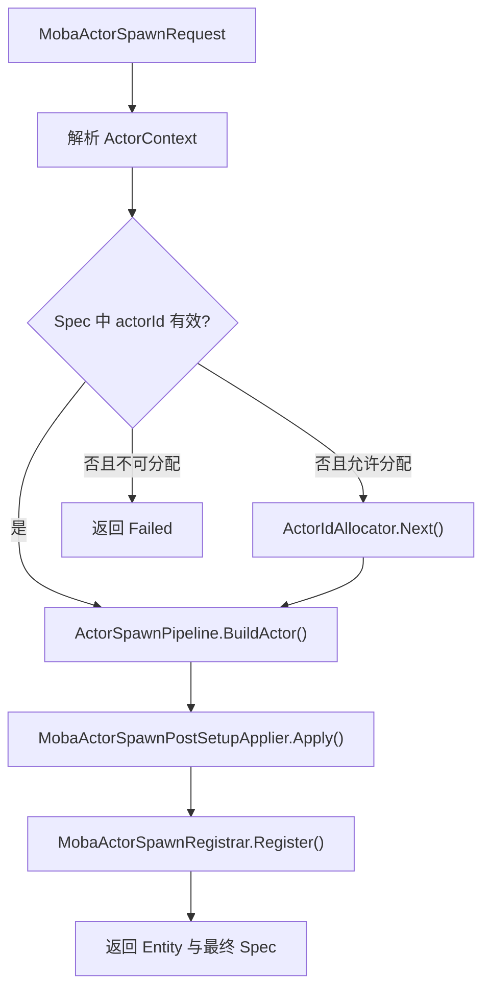
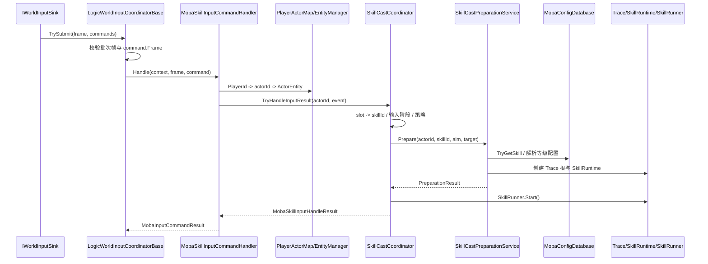

# MOBA 输入、技能准备、配置门面与实体索引

> 文档类型：MOBA 项目应用组合深潜
> 事实基线：2026-08-17
>
> 本文说明 MOBA Runtime 中一批帧输入如何被校验和路由，技能输入如何进入正式运行时，以及 Actor 生成后如何进入注册表和二级索引。输入、技能、配置和实体管理彼此协作，但并不由同一个协调器拥有。

## 1. 范围与证据边界

本文描述当前源码中的四个所有权域：

| 所有权域 | 主要所有者 | 不负责什么 |
|---|---|---|
| 输入批次 | `LogicWorldInputCoordinatorBase<TContext>`、`MobaInputCoordinator` | 不解释具体 payload，不直接执行技能 Pipeline |
| 命令语义 | `MobaInputCommandHandlerRegistry` 与各 Handler | 不拥有帧推进，不自行创建 Actor |
| 技能释放 | `SkillCastCoordinator`、`SkillCastPreparationService` | 不直接维护配置存储，不把 slot 当作 skillId |
| 实体身份 | `MobaActorSpawnService`、`MobaActorRegistry`、`MobaEntityManager` | 不负责网络 NetId 分配或表现对象生命周期 |

`PlayerInputCommand` 带有 `Frame`、`Player`、`OpCode` 和 payload。该契约支持确定性的帧校验和命令排序，但类型存在本身不能证明远程帧同步、预测或回滚已经闭合；这些能力需分别由同步模式和回归证据确认。

## 2. 输入批次先校验，再分发

### 2.1 基类拥有批处理语义

`MobaInputCoordinator` 继承 `LogicWorldInputCoordinatorBase<MobaInputCommandContext>`，并同时注册为 `IWorldInputSink`。基类固定批次处理顺序：

帧门禁依赖 `IFrameTime`：负帧、过去帧和缺失时钟会被拒绝；大于当前帧加一的未来帧会记录一次警告，但当前实现仍接受。批次目标帧还必须与每条 `PlayerInputCommand.Frame` 完全一致。

需要注意返回语义：只要批次通过前置校验，即使没有命令被 Handler 接受，结果仍可能是 `Accepted`，并通过 `HandledCount`、消息和诊断区分“全部处理”“部分处理”和“零处理”。调用方不能只检查 `Succeeded` 就推断所有业务命令已生效。Handler 抛出异常则整批返回 `HandlerException`，之前已经执行的命令不会自动回滚。

### 2.2 MOBA 协调器只装配上下文与路由

`MobaInputCoordinator.OnServicesReady()` 绑定契约注册表中的 Handler，并解析 `SkillCastCoordinator`。每批输入只创建一次 `MobaInputCommandContext`，其中保存：

- `MobaLogicWorldRunGateService`，用于检查是否已进入战斗。
- `MobaPlayerActorMapService`，用于把 `PlayerId` 映射到 actorId。
- `MobaEntityManager`，用于从 actorId 获取 Entitas `ActorEntity`。
- `SkillCastCoordinator`，供技能 Handler 调用。
- `IWorldResolver`，供扩展 Handler 解析世界服务。

命令最终按 `OpCode` 交给 `MobaInputCommandHandlerRegistry`。注册表优先从 World Resolver 取得 Handler；解析不到时，当前兼容路径会通过无参构造创建实例。缺失 Handler 或 Handler 主动拒绝都会生成 `MobaInputCommandResult` 和诊断日志。

## 3. 移动与技能命令的分叉

移动和技能共享玩家、Actor 和 Transform 前置校验，之后进入不同所有者：

`MobaMoveInputCommandHandler` 只把 payload 解码为 `dx/dz`，然后写入实体的 `MoveInput` 组件。它不直接修改 Transform，移动系统在后续 World Tick 中消费该组件。

`MobaSkillInputCommandHandler` 把 payload 解码为 `SkillInputEvent`。事件携带 slot、Press/Hold/Release/Cancel 阶段、瞄准信息和可选目标；Handler 不读取技能配置，而是把 actorId 和事件交给 `SkillCastCoordinator`。

## 4. 技能释放不是一次配置查询

### 4.1 slot、输入阶段与策略

`SkillCastCoordinator.TryCastBySlot()` 先通过 `MobaSkillLoadoutService` 将 `(actorId, slot)` 解析为 skillId。输入阶段处理规则为：

| 输入阶段 | 当前行为 |
|---|---|
| `Press` | 优先更新同槽运行实例；不存在时启动释放 |
| `Hold` | 只更新已运行实例；没有运行实例则拒绝 |
| `Release` | 优先更新并释放已运行实例；不存在时尝试启动释放 |
| `Cancel` | 取消同 Actor、同 slot 的运行实例 |

`SkillCastPolicy` 提供 `AllowParallel` 和 `InterruptRunning` 默认策略，`SkillCastPolicyResolver` 还可以按技能解析最终策略。因此这两个布尔值是运行策略入口，不足以单独说明某个蓄力或引导技能已经具备完整玩法实现。

### 4.2 准备阶段拥有配置和运行时租约

正式释放由 `SkillCastPreparationService.Prepare()` 构建，顺序包括：

1. 校验 caster、skillId 和显式目标。
2. 从 `MobaConfigDatabase` 读取 `SkillMO`。
3. 必要时通过 `SearchTargetService` 解析普通攻击或配置目标查询。
4. 从 `IMobaSkillPipelineLibrary` 获取 PreCast/Cast 配置与阶段。
5. 根据 Actor 技能槽读取等级，并生成 `ResolvedSkillCastConfiguration`。
6. 创建 `SkillCastContext`、根 Trace Context 和 `MobaSkillCastRuntime`。
7. 返回可交给 `SkillRunner` 启动的准备结果。

配置门面并不是由输入协调器直接查询；它位于技能准备及其他玩法服务内部。准备后若战斗规则再次拒绝、Runner 启动失败或准备过程抛出异常，当前实现会通过 `ForceTerminate(...RollbackCleanup)` 或结束 Trace 清理已经创建的运行时租约。这是技能释放的局部失败收敛，不代表整个输入批次具备事务回滚。

## 5. 配置门面负责来源适配和类型化查询

`MobaConfigDatabase` 包装通用 `ConfigDatabase`，默认使用 MOBA 表注册表和 JSON DTO 反序列化器。当前公开入口覆盖：

- Text Sink 和 Resources。
- 通用 `IConfigSource`。
- DTO Provider 与 DTO 数组。
- JSON 文本字典。
- Bytes 与 JSON/Bytes 混合来源。
- 有序 `IConfigGroup`。

Bytes 路径要求显式提供 `IMobaConfigDtoBytesDeserializer`，否则重载返回失败。成功或失败的正常结果会发布到全局 `ConfigReloadBus`；当前 MOBA 成功包装结果固定按 `fullReload: true` 发布，`changedIds` 为 `null`。内部通用库会先同步发布自己的 `config` 结果，随后门面才发布 `moba.config`；任一订阅者抛错都可能打断后续通知，而此时配置提交可能已经完成。因此不能据此声称已经具备表级增量热更新、可靠广播和运行中对象迁移。

门面提供 `Get/TryGet` 类型化查询，覆盖 Character、Skill、Buff、Projectile、Aoe、Summon、组件模板、标签模板、地图和玩法等表。业务服务依赖该门面可以隔离来源差异，但仍需自己决定缺失配置、版本变化和运行中缓存失效语义。例如 `TableDrivenMobaSkillPipelineLibrary` 按 skillId 缓存已构建 Flow，却不跟踪 `MobaConfigDatabase.Version`、也不订阅 reload；热重载后已有缓存会继续使用旧 DTO/MO 引用和事件数组，直到显式 `Dispose` 或重建该 Library。

## 6. Actor 生成与注册是两个步骤

### 6.1 Spawn 请求控制生成后的归属

`MobaActorSpawnService.TrySpawn()` 的执行顺序是：

请求中的 `RegisterActor`、`RegisterEntityManager` 和 `RegisterEntityManagerFromEntity` 分别控制注册行为；`Initializer`、`OnActorBuilt` 和 `PostSetup` 负责构造扩展及 Owner、Lifetime、Summon、Model、Brain、Projectile 等运行时元数据。

英雄调试生成、英雄替换、状态导入、投射物、发射器和召唤物都已有调用方使用这条服务。共享的是 Actor 构建和注册入口，不表示这些实体共享相同生命周期：投射物和召唤物的销毁、Owner 联动与超时仍由各自玩法服务和临时实体生命周期服务负责。

若 Build、PostSetup 或注册阶段抛出异常，服务会尝试从 `MobaEntityManager`、`MobaActorRegistry` 注销 actorId，并销毁已构建实体。返回 `false` 只表示本次 Spawn 未完成；跨服务回调产生的其他副作用仍需调用方按自己的事务边界处理。

### 6.2 EntityManager 是查询索引，不是唯一身份源

`MobaEntityManager` 同时维护 Entitas 实体映射和通用战斗索引：

| 索引 | 读取入口 | 注册要求 |
|---|---|---|
| actorId → `ActorEntity` | `TryGetActorEntity()` | actorId 为正且实体非空 |
| Team | `GetTeam()` | Team 组件或显式参数 |
| EntityMainType | `GetMainType()` | MainType 组件或显式参数 |
| UnitSubType | `GetUnitSubType()` | UnitSubType 组件或显式参数 |
| OwnerPlayer | `GetOwner()` | OwnerPlayerId 组件或显式参数 |

`TryRegisterFromEntity()` 要求 ActorId、Team、EntityMainType、UnitSubType 和 OwnerPlayerId 五类组件齐全，缺一即返回 `false`。首次注册发布 Spawn 事件，重复注册只更新索引；注销会在移除前发布 Despawn 事件。`MobaActorRegistry` 与 `MobaEntityManager` 是不同的数据结构，调用方不能只更新其中一个并假设另一个自动同步。

## 7. 当前端到端调用链

这条图只描述技能输入；Ready、调试生成、英雄替换等 OpCode 由同一注册表中的其他 Handler 处理，不应全部解释成技能调用。

## 8. 验证证据与未覆盖范围

| 证据 | 当前基线能证明什么 | 不能证明什么 |
|---|---|---|
| 2026-08-16 MOBA .NET tests 279/305 | 279 项局部契约仍通过；26 项在 World 启动期被同一 SpawnArea 配置校验阻断 | 不能宣称主测试程序集当前整体通过，也不能把 26 个失败误归因于各自业务断言 |
| `MobaRuntimeFirstFrameSnapshotAcceptanceTests` | 输入端口拒绝空批次、非法帧，并区分零处理、部分处理和完整处理 | 使用测试协调器的部分用例不等于所有真实 OpCode Handler 均已覆盖 |
| `MobaSkillCastLifecycleSmokeTests` | 测试资产覆盖技能创建、死亡/销毁清理等路径 | 本轮相关用例被启动配置错误提前阻断，未产生新的业务通过证据 |
| `MobaSkillConfigurationContractTests` | Resources/DTO 配置的关键技能契约可校验 | 不证明生产热更发布、回滚和运行对象迁移已闭合 |
| Unity `MobaRuntimeOwnershipLifecycleTests` 9/9 artifact | Summon retain 失败回滚 Actor/trace；Clear/Dispose 释放 retain 并 exactly-once 结束 trace | 不是本轮完整 Unity 回归或真实多人运行 |

独立的 MOBA View Runtime `174/174` 在 2026-08-17 通过；Host 6/6、Acceptance 8/8 是既有 2026-08-16 证据。测试仍有依赖漏洞、Entitas 兼容性、可空性等警告；这些工程不包含完整 MOBA World 业务链，不能合并成“全部通过”。

## 9. 源码入口

| 模块 | 源码 |
|---|---|
| 输入批处理基类 | `Unity/Packages/com.abilitykit.demo.moba.runtime/Runtime/Application/Services/LogicWorld/Input/LogicWorldInputCoordinatorBase.cs` |
| MOBA 输入协调与上下文 | `Unity/Packages/com.abilitykit.demo.moba.runtime/Runtime/Application/Services/Input/MobaInputCoordinator.cs`、`MobaInputCommandContext.cs` |
| Handler 注册与移动/技能实现 | `Unity/Packages/com.abilitykit.demo.moba.runtime/Runtime/Application/Services/Input/MobaInputCommandHandlerRegistry.cs`、`MobaMoveInputCommandHandler.cs`、`MobaSkillInputCommandHandler.cs` |
| 技能释放与准备 | `Unity/Packages/com.abilitykit.demo.moba.runtime/Runtime/Application/Services/Skill/Cast/SkillCastCoordinator.cs`、`SkillCastPreparationService.cs` |
| 配置门面 | `Unity/Packages/com.abilitykit.demo.moba.runtime/Runtime/Infrastructure/Config/Core/MobaConfigDatabase.cs` |
| Actor 生成 | `Unity/Packages/com.abilitykit.demo.moba.runtime/Runtime/Application/Services/EntityConstruction/MobaActorSpawnService.cs` |
| 实体索引 | `Unity/Packages/com.abilitykit.demo.moba.runtime/Runtime/Application/Services/EntityManager/MobaEntityManager.cs` |

---

*文档版本：v3.1 | 最后更新：2026-08-17*
