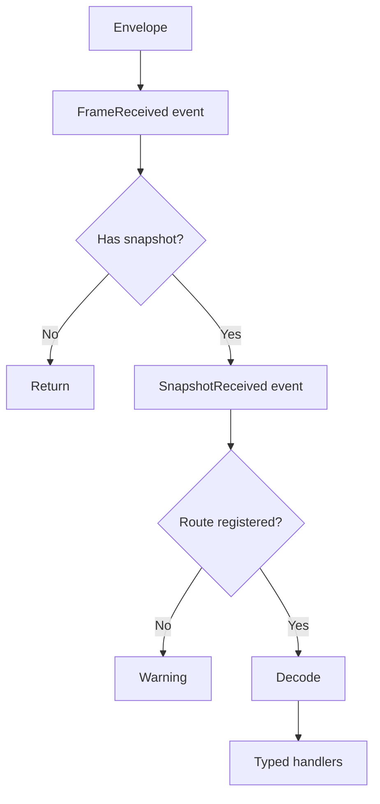

# MOBA 快照、表现层与预测回滚

> 文档类型：MOBA 项目应用组合深潜
> 事实基线：2026-08-16
>
> 本文以当前 MOBA runtime、通用 snapshot package 和 MOBA view runtime 为准，拆分逻辑快照输出、客户端分发/表现 Pipeline、远程输入驱动与预测回滚。仓库中存在多个同名 `FrameSnapshotDispatcher`，本文会明确每一处所指类型。

## 1. 四条链路不能混用

MOBA 客户端同步由四条相关但独立的链路组成：

| 链路 | 主要数据 | 目的 | 失败影响 |
|------|----------|------|----------|
| 逻辑推进 | remote/local input、frame time | 推进本地逻辑 world | 影响确定性状态 |
| 预测回滚 | rollback state、state hash、authority frame | 校正预测逻辑 | 影响重放与一致性 |
| 快照输出 | `WorldStateSnapshot` | 从逻辑 world 投影表现数据 | 可出现空输出或部分输出 |
| 表现分发 | envelope、opcode、decoded payload | 更新 cache、presenter、VFX/HUD | 不应反向修改权威逻辑 |

Snapshot 不是 rollback state。能够播放表现快照，不代表本地逻辑 hash 一致；发生 rollback，也不意味着所有表现事件都应再次播放。

## 2. 逻辑侧 Emitter 契约

MOBA emitter 实现 `IMobaSnapshotEmitter.TryGetSnapshot(frame, out snapshot)`。继承 `LogicWorldSnapshotEmitterBase<T>` 且保留默认 `UseFrameGuard` 的 emitter 获得成功输出门禁：

```text
CanEmit(frame) == false -> no snapshot
frame == lastFrame      -> no snapshot
otherwise               -> build snapshot; success 后 update lastFrame
```

普通 emitter 在同一 frame 最多成功输出一次。`_lastFrame` 只在 `TryBuildSnapshot()` 返回 true 后更新；首次因数据未就绪或缓冲为空返回 false 时不会消费 frame，同帧后续可以再次尝试。

Buffer emitter 使用 `MobaSnapshotBuffer<TEntry>`，并通过 `LogicWorldSnapshotBufferEmitterBase.UseFrameGuard => false` 关闭帧门禁。成功编码后调用 `ToArrayClearAndTrim()` 清空缓冲；若同一 frame 随后又写入新事件，可以再次 drain。Dispose 时也会清空并按容量策略收缩。

## 3. Emitter 注册与排序

Emitter 类型通过 `MobaSnapshotEmitterAttribute(priority)` 标记。`MobaSnapshotEmitterRegistry.CreateDefault()` 优先读取 generated manifest 并合并外部程序集提供项；只有 generated 结果为零时才回退到已加载程序集反射扫描。可以通过 `AbilityKit.Moba.DisableSnapshotEmitterReflectionFallback` 禁止回退，此时 manifest 为空会直接抛错。最终目录按 priority 排序，再从 world services 解析实例。

当前常见优先级示例：

```text
10 EnterGame
20 ActorSpawn
30 ActorDespawn
40 ProjectileEvent
50 AreaEvent
60 DamageEvent
65 PresentationCue
70 StateHash
80 ActorTransform
85 SkillState
```

priority 决定 Router 遍历顺序，不是网络可靠性等级。标记出的类型如果没有注册到 world services，会在 resolve 阶段被跳过。

## 4. `MobaSnapshotRouter`

Router 同时注册为：

- `MobaSnapshotRouter`；
- `IWorldStateSnapshotProvider`；
- `IWorldStateSnapshotBatchProvider`；
- `IMobaSnapshotHealthProvider`。

初始化时它：

1. 可选解析 diagnostics；
2. 加载 generated manifest 与外部目录，必要时才执行 Attribute 反射回退；
3. 按 priority 解析 emitter 实例；
4. 重建 emitter health entries；
5. 对照默认 output contract 记录缺失的必需 emitter；
6. 上报 emitter count，零 emitter 时发 warning。

### 4.1 单快照读取

`TryGetSnapshot()` 按顺序找到第一个成功 emitter 后立即返回。普通 emitter 成功后有同帧门禁，buffer emitter 没有；多次调用可能依次取出不同 emitter 的快照，也可能 drain 同一 buffer emitter 在调用间新写入的数据。调用方不能依赖无限轮询；更明确的批量出口是 `CollectSnapshots()`。

### 4.2 批量读取

`CollectSnapshots(frame, snapshots, maxSnapshots)`：

- destination 为 null 时抛异常；
- `maxSnapshots <= 0` 时抛异常；
- 按 emitter priority 遍历；
- 单次 `CollectSnapshots` 调用中，每个 emitter 最多调用一次并追加一个 snapshot；
- 达到上限立即停止；
- 不清空调用方传入的 destination。

`maxSnapshots` 小于本帧可输出 emitter 数量时，后续 emitter 本轮不会被调用。若调用方随后在同帧再次收集，已成功输出的普通 emitter 会被 frame guard 跳过，未成功或未调用的普通 emitter 仍可尝试；buffer emitter 若又积累了数据也可再次输出。因此“每个 emitter 每帧最多一条”不是 Router 的统一契约。

### 4.3 健康数据

Router 记录 single/batch request、hit/empty、last frame、last opcode、last batch size、emitter 列表和必需 emitter 缺失项。缺失必需 emitter 进入 health，不会在 `OnInit()` 直接抛异常阻止 world 运行；readiness validator 才负责把健康状态提升为启动判断。

## 5. Transform Snapshot 的真实采样范围

`MobaActorTransformSnapshotService` 的门禁与采样条件为：

```text
MobaLogicWorldRunGateService.InGame == true
registry entry entity != null
entity.hasTransform == true
```

输出字段为 actorId、position XYZ、forward XYZ，opcode 是 `Snapshot.ActorTransform`。

当前实现不检查：

- entity `isEnabled`；
- HP/存活状态；
- visibility/AOI；
- actorId 是否大于零；
- entity 自身 ActorId 是否与 registry key 一致。

它直接遍历 `MobaActorRegistry.Entries`，没有显式排序。因此该快照适合作为表现投影，不应单独用来推导确定性状态 hash 或承诺跨运行时稳定顺序。空 registry 或全部 entity 缺 Transform 时，本帧不输出 Transform snapshot。

## 6. 三个同名 Dispatcher

仓库当前至少存在三套 `FrameSnapshotDispatcher`：

| 命名空间/位置 | 特征 | 本文用途 |
|---------------|------|----------|
| `AbilityKit.Core.Snapshots.Routing` | 通用、无 session，外部调用 `Feed()` | confirmed-view 快照装配的唯一 dispatcher 类型 |
| `AbilityKit.Game.Flow.Snapshot` | 持有 `BattleLogicSession`，可自动订阅 session frame | 旧 MOBA 客户端 Battle Pipeline；不可传给 confirmed-view 工厂 |
| MOBA share flow snapshot | 面向 share 层接口 | 旧/共享流程适配，不与前两者视为同一实例 |

阅读源码和日志时必须同时确认命名空间与构造函数。仅写“FrameSnapshotDispatcher”不足以说明实际管线。

## 7. MOBA View Dispatcher

`AbilityKit.Game.Flow.Snapshot.FrameSnapshotDispatcher` 可以在构造时订阅 `BattleLogicSession.FrameReceived`，也可以通过 `subscribeToSession=false` 禁用自动订阅，再由外部调用 `Feed()`。

处理 envelope 的顺序为：



### 7.1 注册约束

- 同 opcode、同 payload type 再注册会替换 decoder；
- 同 opcode、不同 payload type 会抛 type mismatch；
- route 尚未注册时订阅 handler 会抛异常；
- subscription Dispose 只移除对应 handler，可重复 Dispose。

### 7.2 异常隔离

Typed handler 逐个 `try/catch`，某个 handler 异常不会阻止后续 handler。

但以下顶层事件直接 Invoke，没有逐订阅者异常隔离：

```text
FrameReceived
SnapshotReceived
```

其中任一订阅者抛异常，会中断当前 envelope 后续处理，甚至阻止 opcode route dispatch。顶层订阅者必须自行保证不抛异常，或在 handler 内部隔离。

Decoder 返回 false 时静默停止当前 route，不调用 handler；当前 dispatcher 不记录 decode failure 指标。

## 8. 通用 `SnapshotPipeline`

Pipeline 订阅 dispatcher 的 `SnapshotReceived`，维护自己的 opcode route、decoder 和有序 stages。

这意味着 dispatcher route 与 pipeline route 是两套独立注册：

```text
SnapshotReceived
  -> Pipeline decoder -> ordered stages

Dispatcher route
  -> Dispatcher decoder -> typed handlers
```

同一 snapshot 可能被解码两次。注册 dispatcher decoder 不会自动注册 pipeline decoder，反之亦然。

### 8.1 Stage 顺序

`AddStage(opCode, order, handler)` 按 order 升序插入；相同 order 的新 stage 插入在已有同 order stages 之后，因此同 order 保持注册先后顺序。

典型约定可以是：

```text
10 cache/state projection
20 actor presenter
30 HUD/VFX/audio event
```

这是调用方约定，不是 Pipeline 内置 stage 类型。

### 8.2 Pipeline 失败语义

- route 未注册时 AddStage 抛异常；
- payload type 不匹配时抛异常；
- decoder 为空或返回 false 时不执行 stage；
- stage handler 逐个异常隔离并继续后续 stage；
- 未注册 opcode 时 Pipeline 静默忽略，由 dispatcher 自身 route 缺失逻辑决定是否 warning。

Pipeline Dispose 只取消其 `SnapshotReceived` 订阅；各 stage subscription 仍应由所属 feature 按生命周期释放，避免持有无效 handler。

## 9. 通用 Dispatcher 的差异

`AbilityKit.Core.Snapshots.Routing.FrameSnapshotDispatcher` 不持有 `BattleLogicSession`，只接受显式 `Feed()`。它同样公开 `FrameReceived`、`SnapshotReceived`、decoder 和 typed subscriptions，但：

- 缺 route 时静默跳过，不写 MOBA dispatcher 的 warning；
- `Dispose()` 当前为空，因为没有外部 session 订阅；
- typed handler 仍有逐个异常隔离；
- 顶层事件仍没有隔离。

在 confirmed view 或框架级 snapshot pipeline 中，应以通用 dispatcher 的行为为准，不能套用 MOBA view dispatcher 的自动订阅与日志语义。`ConfirmedViewSnapshotRuntime`、其 factory 和调用方字段必须统一声明为 `AbilityKit.Core.Snapshots.Routing.FrameSnapshotDispatcher`；同名的 `AbilityKit.Game.Flow.Snapshot.FrameSnapshotDispatcher` 不是兼容替代，即使二者都公开 `Feed()`。

## 10. 远程驱动与预测模块

`RemoteDrivenWorldRuntimeFactory` 安装：

```text
ClientPredictionDriverModule
ServerFrameTimeModule
WorldAutoStartModule
```

无论是否开启客户端预测，都存在 `ClientPredictionDriverModule`。模式差异来自参数：

| 能力 | 预测开启 | 预测关闭 |
|------|----------|----------|
| remote input | 启用 | 启用 |
| local input | 启用 | null |
| input delay | 配置值，最小 0 | 0 |
| prediction ahead | 30 | 0 |
| rollback | true | false |
| history | 600 frames | 0 |
| capture interval | 1 | 0 |
| rollback registry | 调用方构造 | 空 registry |
| compute hash | 调用方构造 | null |

所以“remote only”仍通过 prediction driver 消费远程帧和推进目标，只是不进行本地超前预测与 rollback。

## 11. Rollback 与表现的边界

预测开启后，逻辑校正依赖：

- remote frame source；
- local input source；
- ideal frame limit；
- rollback registry；
- per-frame state hash；
- authority frame stats/source。

这些对象属于逻辑 world 和 HostRuntime。客户端 snapshot Pipeline 属于表现投影，不能作为 rollback provider。

发生 rollback/replay 时应区分：

| 数据 | 建议行为 |
|------|----------|
| Actor transform/state projection | 以最新确认或重放结果覆盖 |
| 一次性 damage/VFX/audio cue | 通过 context/cue key 去重，避免重播 |
| local predicted action | 在确认、拒绝或 rollback 后调和 |
| state hash | 只参与逻辑一致性，不驱动美术状态 |
| HUD aggregate | 从确认投影重建或幂等更新 |

具体 cue 去重由表现事件管线负责，不由通用 `SnapshotPipeline` 自动完成。

## 12. Authority Frame 可用性

远程 world 创建前，工厂尝试从 `IClientPredictionDriverStats` 构造 `ClientPredictionDriverStatsFramesSource`；创建后尝试绑定 `MobaAuthorityFrameService`。

两步均为 best-effort，异常只记录日志。结果是：

- world 可以创建成功但 authority frame source 缺失；
- snapshot 可以正常显示但 prediction diagnostics 不完整；
- 不能以“收到 Transform snapshot”判断 rollback/authority 链已准备好。

应通过 `MobaBattleRuntimeReadinessValidator`、snapshot health 和 prediction stats 分别验证。

## 13. 清理顺序

典型客户端 teardown 至少包含：

1. 停止继续接收/Feed 新 envelope；
2. 释放 Pipeline stage 和 typed route subscriptions；
3. Dispose `SnapshotPipeline`，取消 `SnapshotReceived`；
4. 若使用旧 MOBA Battle Pipeline，Dispose MOBA view dispatcher 并取消 session `FrameReceived`；
5. 释放使用 Core dispatcher 的 confirmed-view runtime；
6. 销毁 remote-driven world 与其他 session resources。

只销毁 world 不会自动解除旧 MOBA view dispatcher 对 `BattleLogicSession` 的事件订阅；只 Dispose dispatcher 也不会销毁逻辑 world。confirmed-view 的 Core dispatcher 不持有 session 订阅，其 teardown 不应假设存在 MOBA dispatcher 的自动解绑行为。`MobaSnapshotRouter.Dispose()` 会清引用和 emitter/health 列表，但没有 `_disposed` 状态防护；Dispose 后继续调用不保证统一抛 `ObjectDisposedException`，宿主必须先停止采集再释放 Router。

## 14. 失败诊断矩阵

| 现象 | 优先检查 |
|------|----------|
| 完全没有 snapshot | Router emitter count、InGame gate、world snapshot provider |
| 某 opcode 永远缺失 | emitter 是否被 Attribute 扫描并能从 services 解析、output contract missing list |
| 同帧第二次读取为空 | 普通 emitter 是否已成功输出并消费 frame；首次空构建不会消费，buffer emitter 则无 frame guard |
| Transform 缺 Actor | actor registry 是否注册、entity 是否有 Transform |
| 客户端 warning no route | MOBA view dispatcher 是否注册对应 opcode route |
| Pipeline stage 不执行 | Pipeline 自己的 decoder/route 是否注册，而非只注册 dispatcher |
| 一个顶层订阅异常后全部停止 | `FrameReceived` / `SnapshotReceived` handler 是否抛异常 |
| 画面正常但 hash 不一致 | rollback registry、compute hash、remote/local input 与 authority frame |
| rollback 后特效重复 | 表现 cue 是否有稳定 key/context 去重 |
| session 退出后仍收到回调 | dispatcher、pipeline 和 stage subscriptions 是否按序释放 |

## 15. 自动测试证据与补测边界

本节只记录当前能定位到具体被测对象、调用和断言的证据。源码中存在某个分支、测试类名包含 Snapshot，或其他示例验证过相似能力，都不等同于 MOBA 生产链已经覆盖。

### 15.1 逻辑快照输出

| 证据 | 当前直接证明 | 不能据此证明 |
|------|--------------|--------------|
| `MobaRuntimeFirstFrameSnapshotAcceptanceTests.Runtime_start_can_collect_first_frame_enter_game_and_spawn_snapshots` | runtime 启动后首帧可批量取得 EnterGame 与 ActorSpawn；同帧再次读取为空 | 测试使用内部 `FirstFrameSnapshotOutputPort`，不经过 `MobaSnapshotRouter`，不能证明 Attribute 扫描、priority、health 或 `maxSnapshots` |
| `MobaBattleRuntimePortAcceptanceTests.Collect_snapshots_uses_caller_buffer_and_returns_sink_count` | `MobaBattleRuntimePort.CollectSnapshots` 使用调用方 buffer，并返回 output port 的实际追加数量 | Fake output port 的截断行为不能替代 Router 本体测试 |
| 大乔、小乔、嬴政、墨子技能验收中的移动 Projectile Transform 断言 | 指定业务路径创建的移动 Projectile 会进入 Actor Transform snapshot，供 view 查找 | 不覆盖 InGame=false、空 registry、缺 Transform、registry key 不一致或枚举顺序 |
| `MobaSynchronizationCompositionTests.AuthoritativeStateHash_IsStableAndSharedBySnapshotService` | authority hash 不依赖 rollback provider 注册顺序；state hash snapshot service 与预测组合共享 calculator | Transform snapshot 自身没有稳定排序保证，不能作为确定性 hash 输入 |

仍需补充 `MobaSnapshotRouter` 专项测试，直接覆盖 generated manifest/reflection fallback、emitter priority、必需 emitter health、普通 emitter 成功后门禁、空构建同帧重试、buffer emitter 同帧再次 drain、destination 保留语义和 `maxSnapshots` 截断后的续读；还需为 `MobaActorTransformSnapshotService` 覆盖 InGame、空 registry、缺 Transform 与有效实体采样。

### 15.2 Dispatcher 与 Pipeline

| 证据 | 当前直接证明 | 不能据此证明 |
|------|--------------|--------------|
| `MobaViewSnapshotConsumptionContractTests` | view 侧公开接口保留 caller-buffer `CollectSnapshots`，`MobaTransformSnapshotDispatcher.TryDispatch` 的签名存在 | 主要断言是反射契约，没有执行生产 dispatcher、decoder、typed handler 或 Pipeline stage |
| 通用 `FrameSnapshotDispatcher` 源码 | route payload type 冲突会抛异常；decoder false 时停止 route；typed handler 逐个隔离异常；顶层事件直接 Invoke | 这是实现分支核对，不是自动回归结果 |
| 通用 `SnapshotPipeline` 源码 | stage 按 order 升序；同 order 保持注册顺序；stage 异常隔离；Dispose 解除 `SnapshotReceived` | 尚无专项测试固定 decoder false、类型冲突、同 order、异常继续和 Dispose 后不再接收 |
| MOBA view `FrameSnapshotDispatcher` 源码 | session 自动订阅可关闭；Dispose 会解除 `BattleLogicSession.FrameReceived` | 尚无直接测试证明 teardown 后不再收到 session frame |
| confirmed-view 编译契约 | confirmed-view runtime、factory 与调用方统一接收 Core routing dispatcher；相关项目编译通过 | 不证明 decoder、handler、stage 和视觉结果的运行时组合 |

这里不能引用 Shooter 的 snapshot 导入、恢复或表现测试作为 MOBA 证据。通用 package 的行为可以作为底层契约来源，但 MOBA 包装器的 session 绑定、warning 和生命周期仍需自己的测试。

建议补测顺序：先固定通用 dispatcher/Pipeline 的类型冲突、decoder false、handler/stage exception 和同 order；再验证 MOBA view dispatcher 的自动订阅、显式 `Feed()` 与 Dispose；最后补一条真实 `CollectSnapshots -> Feed -> Pipeline stage` 的 MOBA 组合测试。

### 15.3 预测、Hash 与恢复

| 证据 | 当前直接证明 | 不能据此证明 |
|------|--------------|--------------|
| `BattleRuntimeOptimizationTests.RemoteDrivenRuntimeModuleFactory_RetainsSixHundredPredictionFrames` | 当前 MOBA 工厂保留 600 帧预测回滚历史 | 只固定常量，不证明运行中实际捕获 600 帧或内存预算 |
| `MobaSynchronizationCompositionTests.RollbackRegistryBuilder_RegistersCompleteAvailableStateSet` | 当前 registry/factory 注册 Transform、HP、Buff timer、Skill cooldown、Random、Passive trigger log 与 FrameTime provider | “当前可用集合”不等于完整 world 恢复；Buff timer provider 不重建 Buff 行为关系 |
| `MobaSynchronizationCompositionTests.AuthoritativeStateHash_IsStableAndSharedBySnapshotService` | run gate、Transform、HP 进入共享 hash；注册顺序变化不改变结果 | 不证明所有影响战斗结果的状态都已进入 hash 或 rollback registry |
| `MobaSynchronizationCompositionTests` 中 reconciliation reporter 与 replication health 测试 | mismatch、replay completion、recovered 及 InputAccepted、SnapshotGap、SnapshotStale、RollbackStarted 等诊断投影 | 不执行完整 MOBA rollback/replay，也不验证表现覆盖和一次性 Cue 去重 |
| `FrameSyncDriverModuleHeadlessTests` 的确认帧与 hash mismatch replay 用例 | 通用 `ClientPredictionDriverModule` 能避免已确认预测帧重复模拟，并能在 mismatch 后 replay | 属于通用 Host Extension 行为，不证明 MOBA 工厂参数、provider 组合或 authority frame 绑定 |
| `RemoteDrivenRuntimeModuleFactory` 源码 | prediction 模式使用 ahead=30、history=600、capture interval=1、rollback=true；remote-only 使用 null local input、ahead=0、history=0、rollback=false、hash=null | remote-only 参数组合目前缺少直接构造测试；源码核对不能代替回归测试 |

优先补充 remote-only 与 prediction 两种工厂组合测试、authority frame source/service best-effort 绑定诊断、真实 MOBA hash mismatch 回滚，以及 rollback 后状态投影覆盖与一次性 Cue 稳定去重。teardown 测试还应同时确认 world、dispatcher、Pipeline 和 stage subscription 不再持有会话回调。

## 16. 源码索引

| 主题 | 源码 |
|------|------|
| Snapshot emitter 基类 | `Unity/Packages/com.abilitykit.demo.moba.runtime/Runtime/Application/Services/Snapshot/GameSnapshotTemplates.cs` |
| Emitter Attribute | `Unity/Packages/com.abilitykit.demo.moba.runtime/Runtime/Application/Services/Snapshot/MobaSnapshotEmitterAttribute.cs` |
| Emitter registry | `Unity/Packages/com.abilitykit.demo.moba.runtime/Runtime/Application/Services/Snapshot/MobaSnapshotEmitterRegistry.cs` |
| Snapshot Router 与 health | `Unity/Packages/com.abilitykit.demo.moba.runtime/Runtime/Application/Services/Snapshot/MobaSnapshotRouter.cs` |
| Snapshot 输出契约 | `Unity/Packages/com.abilitykit.demo.moba.runtime/Runtime/Application/Services/Snapshot/IMobaSnapshotEmitter.cs` |
| Transform emitter | `Unity/Packages/com.abilitykit.demo.moba.runtime/Runtime/Application/Services/Actor/MobaActorTransformSnapshotService.cs` |
| 通用/Core Dispatcher（confirmed view 使用） | `Unity/Packages/com.abilitykit.world.snapshot/Runtime/SnapshotRouting/FrameSnapshotDispatcher.cs` |
| 旧 MOBA session Dispatcher（Battle Pipeline 使用） | `Unity/Packages/com.abilitykit.demo.moba.view.runtime/Runtime/Game/Battle/Client/Session/Features/Snapshot/FrameSnapshotDispatcher.cs` |
| 通用 Snapshot Pipeline | `Unity/Packages/com.abilitykit.world.snapshot/Runtime/SnapshotRouting/SnapshotPipeline.cs` |
| MOBA confirmed-view 快照装配 | `Unity/Packages/com.abilitykit.demo.moba.view.runtime/Runtime/Game/Battle/Client/Session/Features/Sim/ConfirmedViewSnapshotRuntime.cs` |
| Share 层 Dispatcher | `Unity/Packages/com.abilitykit.demo.moba.share/Runtime/Game/Flow/Battle/Snapshot/FrameSnapshotDispatcher.cs` |
| 远程 world 工厂 | `Unity/Packages/com.abilitykit.demo.moba.view.runtime/Runtime/Game/Battle/Client/Session/Features/Sim/RemoteDrivenWorldRuntimeFactory.cs` |
| 预测/远程 modules | `Unity/Packages/com.abilitykit.demo.moba.view.runtime/Runtime/Game/Battle/Client/Session/Features/Sim/RemoteDrivenRuntimeModuleFactory.cs` |
| Readiness validator | `Unity/Packages/com.abilitykit.demo.moba.runtime/Runtime/Application/Services/Validation/MobaBattleRuntimeReadinessValidator.cs` |
| Transform snapshot 验收示例 | `Unity/Packages/com.abilitykit.demo.moba.view.runtime/Runtime/Game/Test/UnitTest/Acceptance/Heroes/XiaoQiao/XiaoQiaoSkillAcceptanceTests.cs` |
| 回滚预测设计 | [Rollback 与预测](../../07-NetworkSynchronization/03-RollbackPrediction.md) |
| 状态同步设计 | [状态同步](../../07-NetworkSynchronization/02-StateSync.md) |

## 17. 版本与验证基线

- prediction history 仍以 `RemoteDrivenRuntimeModuleFactory.PredictionRollbackHistoryFrames = 600` 为准。Snapshot、rollback state、表现事件和 authority frame 是四条不同契约，不能因共享 frame 编号而合并所有权。
- 2026-08-16 MOBA View Runtime 147/147 通过，是本篇最直接的 .NET E3；Host 6/6 与 Acceptance 8/8 分别补充 adapter 和离线 verdict。主 MOBA 工程 279/305，26 项因 World 启动期 SpawnArea 配置错误被 strict validation 阻断，不是快照/预测断言的集中失败。
- 本地 Unity ownership fixture 9/9 只覆盖运行时子对象清理，不覆盖 emitter、dispatcher、rollback、表现去重和 PlayMode 渲染的完整矩阵。
- 本批未运行 Unity PlayMode、真实双端同步、弱网或回滚 artifact，不新增 E4；`moba-smoke` 的 workflow 接线也不能由本地 E3 结果替代。
- 通用 `SnapshotPipeline`、dispatcher 和 rollback 原语属于框架；MOBA emitter registry、opcode、View dispatcher、预测历史与 Session teardown 是项目组合，不应下沉为统一战斗表现应用层。

*文档版本：v3.2 | 最后更新：2026-08-16*
