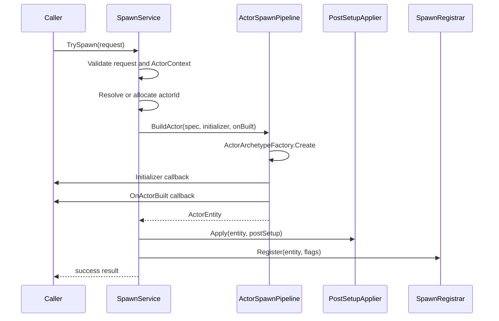
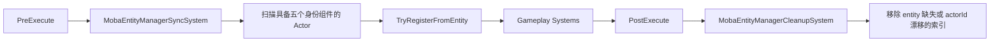

# MOBA 配置、实体索引与生成深潜

> 文档类型：MOBA 项目应用组合深潜
> 事实基线：2026-08-17
>
> 本文基于当前 MOBA runtime 源码，说明配置数据如何进入统一门面、Actor 如何构造和注册，以及 `MobaActorRegistry`、`MobaEntityManager` 与 Entitas entity 之间如何维持一致性。重点覆盖失败语义和非事务性边界。

## 1. 三条相互独立的链路

配置、生成和索引经常同时出现，但职责不同：

| 链路 | 输入 | 输出 | 核心责任 |
|------|------|------|----------|
| 配置加载 | text、DTO、bytes、group、resource | `ConfigDatabase` 中的 typed tables | 反序列化、版本、reload result 与通知 |
| Actor 生成 | `MobaActorSpawnRequest` | Entitas `ActorEntity` | 分配 ID、构造 archetype、回调和 post-setup |
| 索引注册 | entity + identity fields | registry 与多维 index | actorId 查找、分类查询和 spawn/despawn 事件 |

它们不是一个原子事务。配置加载失败不会进入 Actor 生成；Actor 生成失败时，当前实现会补偿框架掌握的 registry、entity manager 和已构造 entity，但不会撤销回调、事件订阅者或其他外部服务已经产生的副作用。

## 2. 配置门面结构

`MobaConfigDatabase` 持有五个关键依赖：

```text
IMobaConfigTableRegistry
IMobaConfigDtoDeserializer
IMobaConfigDtoBytesDeserializer (optional)
ITextAssetLoader
ConfigDatabase (inner)
```

默认值为：

- table registry：`MobaConfigRegistry.Instance`；
- JSON/DTO deserializer：`JsonNetMobaConfigDtoDeserializer.Instance`；
- bytes deserializer：默认 null；
- text asset loader：`NullTextAssetLoader.Instance`。

门面通过内部 `MobaDeserializerAdapter` 把 MOBA DTO deserializer 适配到通用 `IConfigDeserializer`，实际 table storage、版本递增和 reload 由 `_innerDb` 管理。

## 3. 加载入口与失败语义

### 3.1 支持的入口

| 入口 | 非 Reload 方法 | Reload 方法 | 关键约束 |
|------|----------------|-------------|----------|
| Text sink | `LoadFromTextSink` | `ReloadFromTextSink` | sink 必须非空 |
| Resources | `LoadFromResources` | `ReloadFromResources` | resourcesDir 必须非空 |
| Generic source | `LoadFromSource` | `ReloadFromSource` | source 必须非空 |
| DTO provider | `LoadFromDtoProvider` | `ReloadFromDtoProvider` | strict 时每个注册 DTO type 都必须返回数组 |
| DTO arrays | `LoadFromDtoArrays` | `ReloadFromDtoArrays` | dictionary 必须非空引用 |
| Bytes | `LoadFromBytes` | `ReloadFromBytes` | 必须配置 bytes deserializer |
| Bytes + JSON | `LoadFromMixed` | `ReloadFromMixed` | 两个 dictionary 均必须非空，且必须配置 bytes deserializer |
| Ordered groups | `LoadFromGroups` | `ReloadFromGroups` | groups 至少一个 |
| JSON texts | `LoadFromJsonTexts` | `ReloadFromJsonTexts` | dictionary 必须非空引用 |

`Load*` 通常把失败结果转换为 `InvalidOperationException`；`Reload*` 返回 `ConfigReloadResult`。参数为空等编程错误仍直接抛 `ArgumentNullException` 或 `ArgumentException`。

### 3.2 Reload 通知

reload 成功或失败都会通过 `ConfigReloadBus` 发布，固定 config key 为：

```text
moba.config
```

成功结果包含当前 `_innerDb.Version`，并标记为 full reload；当前门面不提供 changed IDs。失败结果保留当前版本与错误字符串。

内部 `ConfigDatabase` 提交后先同步发布 `AbilityKit.Ability.HotReload.ConfigReloadBus` 的 `config` 结果，MOBA 门面收到正常返回后再发布 `moba.config` 包装结果。仓库还存在 `AbilityKit.Ability.Config` 命名空间下的同名 result/bus，二者并不互通。订阅者异常没有隔离：它可以在表和版本已经提交后逃逸，并阻止 MOBA 包装事件发布。因此通知只能作为缓存刷新信号，不能当作配置事务的提交确认。

### 3.3 Strict 边界

DTO provider 路径明确使用 `strict`：

- strict 为 true，任一注册 DTO type 缺失立即失败；
- strict 为 false，缺失 type 被替换为空数组。

需要注意当前 `ReloadFromJsonTexts(..., strict)` 实现调用 `_innerDb.ReloadFromTexts(jsonByKey, resourcesDir)`，没有把 `strict` 参数继续传给底层。调用方不能仅凭该重载签名推断 strict 已生效，应以底层实际结果和测试为准。

`ReloadFromJsonTexts(texts, basePath, strict)` 当前忽略传入的 `strict`，直接调用始终 strict 的内部 `ReloadFromTexts`。这不是可选兼容策略，而是 API 签名与实现漂移；依赖宽松加载的测试或工具必须改用语义明确的 DTO/Source 入口，或先修复并用契约测试固定该参数。

### 3.4 Bytes 边界

默认构造不会提供 `IMobaConfigDtoBytesDeserializer`。因此 bytes/mixed 路径不是开箱即用：

```text
bytes deserializer == null
  -> Reload 返回失败并发布 reload failure
  -> Load 包装方法抛 InvalidOperationException
```

这与 JSON 默认 deserializer 的行为不同。

### 3.5 表身份、live view 与线程边界

全量 reload 替换表对象；增量 reload 则将候选内容写回现有表实例以保留引用。缓存表引用的消费者会因入口不同得到不同身份语义。增量写回逐表发生，若替换逻辑意外抛错，没有跨表回滚；`All()` 返回底层字典的 live values 视图，门面和内核也没有读写同步。MOBA 宿主必须定义 reload 安全点，并在同一串行域内刷新或重建项目缓存。

## 4. Typed table 访问

加载完成后，业务系统通过两类 API 访问：

1. 通用入口：`GetTable<TMO>()`、`GetDto<TDto>()`、`TryGetDto<TDto>()`；
2. MOBA convenience API：`GetSkill()`、`TryGetBuff()`、`GetProjectile()` 等。

`Get*` 适合配置必须存在的启动或执行链路；`TryGet*` 适合输入校验和可选配置。按名称查询 tag 的方法当前通过遍历全部 table entries 实现，不是独立名称索引，频繁热路径应缓存结果或使用 ID。

配置门面没有线程同步语义。reload 与运行时读取如何调度，必须由宿主保证不会观察到不期望的中间状态。

## 5. Actor 生成请求

`MobaActorSpawnRequest` 是 class，包含：

| 字段 | 默认值 | 作用 |
|------|--------|------|
| `Spec` | default | identity、transform、分类、来源和 owner |
| `AllocateActorIdIfMissing` | false | actorId 缺失时是否使用 allocator |
| `RegisterActor` | true | 是否写入 `MobaActorRegistry` |
| `RegisterEntityManager` | true | 是否写入 `MobaEntityManager` |
| `RegisterEntityManagerFromEntity` | true | 优先从 entity components 读取索引键 |
| `Initializer` | null | archetype 创建后立即回调 |
| `OnActorBuilt` | null | initializer 后、post-setup 前回调 |
| `PostSetup` | default | owner、lifetime、summon、model、brain、projectile 等附加组件 |

`FromSpec()` 只设置 `Spec`，其他字段沿用上述字段初始化值。

## 6. 单 Actor 生成顺序

`MobaActorSpawnService.TrySpawn()` 的顺序为：



具体门禁：

1. request 为 null，返回 `request is required`；
2. 无法从注入的 `IContexts` 解析全局 `Contexts.actor`，返回 `ActorContext is required`；
3. actorId 小于等于 0 时，只有显式开启自动分配且 allocator 非空才分配；
4. pipeline 返回 null entity 时返回失败；
5. 构造、回调、post-setup 或注册抛出的异常都会被捕获、记录并转换为失败结果。

## 7. 回调语义与非事务性

`ActorSpawnPipeline.BuildActor()` 的回调顺序固定为：

```text
Create archetype
-> Initializer
-> OnActorBuilt
-> return built result
```

生成服务随后才执行 post-setup 和注册。因此：

- `Initializer` 不是“生成前修改 spec”，它拿到的 entity 已经创建；
- `OnActorBuilt` 发生时 entity 尚未经过 post-setup，也未由 spawn service 注册；
- 回调可以修改 entity，`RegisterEntityManagerFromEntity=true` 时这些组件值会成为索引键；
- `Initializer` 或 `OnActorBuilt` 抛异常时，`BuildActor()` 会销毁刚创建的 entity，再把异常交给生成服务转换为失败结果；
- post-setup 或注册抛异常时，生成服务依次尝试注销 entity manager、注销 actor registry，并销毁已经返回的 entity。

这些动作是失败补偿，不是具备隔离性的事务：

- callback 和 post-setup 对其他服务、静态状态或外部资源造成的副作用不会自动撤销；
- allocator 已经发出的 actorId 不会回退；
- registry 与 entity manager 都允许相同 actorId 覆盖既有对象，失败清理按 actorId 注销，可能同时移除原有索引，不能把重复 ID 场景理解为隔离写入；
- entity manager 的注销会在删除索引前同步发布 despawn。当前事件总线 immediate dispatch 不吞订阅者异常；若订阅者抛异常，后续 actor registry 注销、entity 销毁和失败结果转换都可能被中断。

因此 `TrySpawn()` 是“异常转结果 + 框架内尽力补偿”的边界，不是事务边界。回调应保持短小、可重复推理，避免执行不可撤销的外部操作；调用方还应保证 actorId 唯一，并约束生命周期事件订阅者不得向发布链路传播异常。

## 8. 两类 Actor 索引

### 8.1 `MobaActorRegistry`

这是轻量 `actorId -> ActorEntity` 字典：

- `Register()` 覆盖相同 actorId；
- `TryGet()` 只返回非空且 `isEnabled` 的 entity；
- `Entries` 暴露底层枚举；
- `Unregister()` 和 `Clear()` 不发布事件。

Transform snapshot emitter 等服务直接遍历该 registry。

### 8.2 `MobaEntityManager`

它同时维护：

```text
_byActorId
BattleEntityManager<int> Index
ByTeam
ByMainType
ByUnitSubType
ByOwnerPlayer
```

`TryGetActorEntity()` 只做字典查找，不检查 `isEnabled`。这与 `MobaActorRegistry.TryGet()` 的可用性语义不同，调用方不能互换假设。

`Register()` 对已有 actorId 更新 entity 和所有 keyed index；只有首次加入 `Index.Registry` 时才发布 unit spawn event。`Unregister()` 在能够读取旧 entity 时先发布 despawn event，然后删除 `_byActorId` 和主 Index；keyed index 的清理由 `BattleEntityManager` 的 remove 语义负责。

## 9. Registrar 的 fallback 行为

`MobaActorSpawnRegistrar.Register()` 先可选写入 actor registry，再处理 entity manager：

```text
registerActor
  -> registry.Register(spec actorId, entity)

registerEntityManager
  -> registerFromEntity ? TryRegisterFromEntity(entity) : skip
  -> 如果失败或返回 false，使用 spec 中的 team/main/subtype/owner fallback Register
```

`TryRegisterFromEntity()` 要求 entity 同时具有：

- ActorId；
- Team；
- EntityMainType；
- UnitSubType；
- OwnerPlayerId；
- actorId 大于 0。

它抛异常时 registrar 记录日志，然后继续 fallback。若 fallback `Register()` 再抛异常，生成服务进入统一补偿并注销 entity manager、actor registry 与已建 entity。该补偿仍受第 7 节所述重复 actorId 和事件订阅者异常边界约束。

## 10. 每帧索引调和

索引一致性不只依赖 spawn service，还有两个自动系统：



### 10.1 PreExecute 补注册

SyncSystem 获取同时包含五个身份组件的 group，每帧把全部 entity 交给 `TryRegisterFromEntity()`。已有 actorId 会刷新 keyed index，但不会重复发布 spawn event。

这意味着即使某条构造链没有显式注册 entity manager，只要组件完整，下一次 PreExecute 仍可能被纳入索引。

### 10.2 PostExecute 清理

CleanupSystem 复制当前注册 actorId，再移除：

- `_byActorId` 中找不到或 entity 为 null；
- entity 不再含 ActorId；
- entity 当前 ActorId 与索引键不同。

它不显式检查 entity enabled，也不检查 Team 等分类组件是否被移除。分类组件缺失后的旧 keyed index 可能持续到其他注册/销毁路径修正，业务不应把 cleanup system 理解为完整组件一致性验证器。

## 11. 批量玩家生成边界

`ActorSpawnPipeline` 还提供从 loadouts/specs 批量生成玩家 Actor 的静态入口。它会：

1. 要求每个 loadout 有出生点；
2. 预先为所有 loadout 分配 actorId 和 spec；
3. 逐个 build and register，并记录本批次已完成结果；
4. 记录 player 与 actor 映射；
5. 确认 localPlayerId 出现在 loadouts 中。

任一后续 Actor 构造失败，或全部构造后发现 localPlayerId 缺失时，方法会逆序处理本批次已完成结果：从 entity manager 和 actor registry 注销 actorId，再销毁 entity，最后重新抛出原异常。直接测试已覆盖“第二个 Actor initializer 失败”场景，并断言两个 actorId 均不在两类索引中且 ActorContext 不保留 entity。

批量回滚仍只是框架内补偿：它不撤销 initializer 对外部状态的写入，不回收预分配 actorId，也受注销事件异常与重复 actorId 覆盖语义影响。高层启动 Flow 仍应把失败视为启动失败，并负责该 Pipeline 之外的资源释放。

## 12. Spawn、Despawn 与事件边界

`MobaEntityManager` 只在主 Index 首次出现 actorId 时发布 spawn；重复注册用于刷新索引，不产生重复 spawn。

Despawn 事件只由显式 `Unregister()` 发布，且 payload 从当时 entity 组件读取，缺失时使用默认分类。`Clear()` / `Dispose()` 直接清空索引，不逐个发布 despawn。因此：

- world teardown 不能依赖收到每个单位的 despawn event；
- 临时实体正常结束应走明确的 despawn/unregister 生命周期；
- snapshot despawn、trigger despawn 和 index removal 需要由上层生命周期服务协调。

## 13. 与战斗能力的关系

| 能力 | 使用方式 |
|------|----------|
| Skill/Buff | 通过配置门面解析 skill、flow、buff 和 template |
| Projectile/Summon | 通过 spawn service 创建临时 Actor，并写入来源与生命周期组件 |
| Targeting | 通过 entity manager 的 team/type/owner index 缩小候选集 |
| Damage | 通过 actor/entity 服务定位攻击者和目标 |
| Snapshot | Transform emitter 遍历 actor registry；其他 emitter 可读取 entity manager 或事件缓冲 |
| Trigger | entity manager 首次注册/注销时发布 unit spawn/despawn event |

稳定 actorId 是这些链路的共同连接键，但 ActorEntity 引用是否仍有效需要按具体 registry 的语义再次判断。

## 14. 证据矩阵

本节区分源码契约、直接自动测试和仍需补齐的回归责任。源码分支存在不等于已有自动回归；Harness 或英雄 Acceptance 经过真实生成服务，只能证明其覆盖场景中的成功业务路径。

### 14.1 配置证据

| 行为 | 当前源码契约 | 直接自动测试 | 结论与补测责任 |
|------|--------------|--------------|----------------|
| JSON/DTO 默认加载 | 默认注册 JSON DTO deserializer，typed table 由内部 `ConfigDatabase` 保存 | 本轮未发现以 `MobaConfigDatabase` 为入口的专项测试 | 当前只能记为源码能力；应覆盖成功加载、版本递增和 typed table 读取 |
| Reload 通知 | 成功、失败均向 `ConfigReloadBus` 发布 `moba.config`，结果携带当前版本 | 本轮未发现直接订阅并断言 key、版本、full reload 和 error 的测试 | 静态事件还存在跨测试清理责任，应增加成对订阅/退订测试 |
| DTO provider strict | strict 缺 type 失败，non-strict 注入对应 DTO type 的空数组 | 本轮未发现直接测试 | 应分别锁定缺失 type 的失败与空表行为 |
| JSON text strict | `ReloadFromJsonTexts(..., strict)` 当前未把 `strict` 传给底层；底层 `ReloadFromTexts` 也没有 strict 参数 | 本轮未发现直接测试 | 这是签名与实现漂移，不能宣称 strict 生效；应修复签名/实现或用测试固定兼容语义 |
| bytes/mixed | 未注入 `IMobaConfigDtoBytesDeserializer` 时，Reload 发布失败，Load 包装方法抛异常 | 本轮未发现直接测试 | 应覆盖缺依赖失败和注入实现后的成功路径 |
| reload/read 调度 | 门面本身不提供线程同步 | 未发现并发或宿主串行化契约测试 | 宿主必须定义串行化点，不能把线程安全归因于配置门面 |

### 14.2 生成证据

| 行为 | 当前源码契约 | 直接自动测试 | 结论与补测责任 |
|------|--------------|--------------|----------------|
| 单 entity initializer 失败 | `BuildActor()` 销毁部分 entity 后重新抛异常 | `BuildActor_InitializerFailureDestroysPartialEntity` 断言 ActorContext entity 数量为 0 | 已有 Pipeline 级直接证据；尚未覆盖 `OnActorBuilt` 异常 |
| 单 Actor 服务输入失败 | request、ActorContext、actorId 缺失返回结构化失败；actorId 仅在开关开启且 allocator 可用时分配 | 本轮未发现直接构造 `MobaActorSpawnService` 的专项测试 | 应覆盖错误文本、分配开关和 allocator 缺失 |
| post-setup/注册失败补偿 | service catch 注销两类索引并销毁已建 entity | 本轮未发现生产服务级直接测试 | 应分别注入 post-setup、registrar、entity manager 失败，并检查索引与 entity；还需覆盖注销事件再次抛异常 |
| 批量后项失败 | 逆序注销并销毁本批次已完成 Actor | `BuildActorsFromSpecs_LaterFailureRollsBackEarlierRegistrationsAndEntities` 断言 actorId 201/202 均不在两类索引，ActorContext entity 数量为 0 | 已有直接 Pipeline 回归；测试未证明外部 callback 副作用可撤销 |
| local player 缺失 | 全部构造后进入同一 catch 并回滚 | 本轮未发现直接测试 | 应增加 localPlayerId 缺失回归 |
| 业务成功生成 | Test Harness 通过真实 `IMobaActorSpawnService.TrySpawn()` 生成场景 Actor | Harness 及英雄 Acceptance 间接经过成功路径 | 属于场景证据，不替代失败补偿和调用顺序的专项测试 |

### 14.3 索引证据

| 行为 | 当前源码契约 | 直接自动测试 | 结论与补测责任 |
|------|--------------|--------------|----------------|
| disabled entity 查询 | actor registry 拒绝 disabled entity；entity manager 仅按字典查询 | 本轮未发现直接对照测试 | 调用方必须选择正确入口；应增加 disabled/destroyed entity 测试 |
| 首次与重复注册 | 首次进入主 Index 发布 spawn；重复注册刷新 entity 与四类 keyed index，不重复发布 spawn | 本轮未发现专项事件/index 测试 | 应断言事件次数及 team/type/subtype/owner 旧键移除、新键加入 |
| PreExecute 调和 | SyncSystem 扫描五个身份组件完整的 entity 并调用 `TryRegisterFromEntity()` | 本轮未发现系统级直接测试 | 应覆盖补注册、分类键刷新和组件不完整时跳过 |
| PostExecute 清理 | CleanupSystem 只处理 entity 缺失、ActorId 缺失或漂移 | 本轮未发现系统级直接测试 | 应覆盖三个清理分支，并固定“不检查 enabled/分类组件”的边界 |
| Unregister/Clear | Unregister 先同步发布 despawn 再删除；Clear/Dispose 不逐项发布 despawn | 本轮未发现直接测试 | 应锁定事件 payload、异常传播顺序及 teardown 不发事件的语义 |

## 15. 源码与测试索引

| 主题 | 源码 |
|------|------|
| 配置门面 | `Unity/Packages/com.abilitykit.demo.moba.runtime/Runtime/Infrastructure/Config/Core/MobaConfigDatabase.cs` |
| 表注册契约 | `Unity/Packages/com.abilitykit.demo.moba.runtime/Runtime/Infrastructure/Config/Core/IMobaConfigTableRegistry.cs` |
| DTO 反序列化契约 | `Unity/Packages/com.abilitykit.demo.moba.runtime/Runtime/Infrastructure/Config/Core/IMobaConfigDtoDeserializer.cs` |
| Bytes 反序列化契约 | `Unity/Packages/com.abilitykit.demo.moba.runtime/Runtime/Infrastructure/Config/Core/IMobaConfigDtoBytesDeserializer.cs` |
| Actor 生成服务与请求 | `Unity/Packages/com.abilitykit.demo.moba.runtime/Runtime/Application/Services/EntityConstruction/MobaActorSpawnService.cs` |
| Actor 构造 Pipeline 与 BuildSpec | `Unity/Packages/com.abilitykit.demo.moba.runtime/Runtime/Application/Services/EntityConstruction/ActorSpawnPipeline.cs` |
| 生成注册器 | `Unity/Packages/com.abilitykit.demo.moba.runtime/Runtime/Application/Services/EntityConstruction/MobaActorSpawnRegistrar.cs` |
| Post-setup 应用 | `Unity/Packages/com.abilitykit.demo.moba.runtime/Runtime/Application/Services/EntityConstruction/MobaActorSpawnPostSetupApplier.cs` |
| Actor registry | `Unity/Packages/com.abilitykit.demo.moba.runtime/Runtime/Application/Services/Actor/MobaActorRegistry.cs` |
| 多维 entity manager | `Unity/Packages/com.abilitykit.demo.moba.runtime/Runtime/Application/Services/EntityManager/MobaEntityManager.cs` |
| PreExecute 索引同步 | `Unity/Packages/com.abilitykit.demo.moba.runtime/Runtime/Application/Systems/EntityManager/MobaEntityManagerSyncSystem.cs` |
| PostExecute 索引清理 | `Unity/Packages/com.abilitykit.demo.moba.runtime/Runtime/Application/Systems/EntityManager/MobaEntityManagerCleanupSystem.cs` |
| Pipeline 失败补偿直接测试 | `Unity/Packages/com.abilitykit.demo.moba.view.runtime/Runtime/Game/Test/UnitTest/MobaHeroLoadoutResolverTests.cs` |
| 成功业务场景 Harness | `Unity/Packages/com.abilitykit.demo.moba.view.runtime/Runtime/Game/Test/UnitTest/MobaSkillConfigTestHarness.cs` |
| 通用事件总线异常传播 | `Unity/Packages/com.abilitykit.triggering/Runtime/Events/EventBus.cs` |

## 16. 版本与验证基线

| 项目 | 当前基线 |
|------|----------|
| 文档版本 | v3.1 / 2026-08-17 |
| 审计范围 | MOBA 配置门面、Actor 构造/生成、两类索引及 Sync/Cleanup 系统 |
| 证据来源 | 当前工作区源码、四个 .NET 聚焦工程和本地 Unity ownership 9/9 artifact |
| 本轮实际执行 | MOBA 主工程 279/305 为既有 SpawnArea strict validation 阻断基线；本轮 View Runtime `174/174` 通过，Host 6/6、Acceptance 8/8 沿用既有证据 |
| 已确认所有权 | Summon spawn retain 失败会事务性补偿 Actor、trace、owner/source tracking 与 retain；Clear/Dispose 释放全部 retain 并结束 active spawn trace |
| 仍有缺口 | 配置门面、通用生产 spawn、索引事件与 Sync/Cleanup 缺完整专项回归；JSON text strict 参数仍未下传；reload 同步通知、增量逐表替换和外部 callback/订阅副作用不在统一 transaction 内 |

Summon 的项目级 `MobaTemporaryEntitySpawnTransaction` 是对通用 Actor spawn 补偿的扩展，不表示所有 Actor 类型自动具备相同事务。框架适合提供 spawn/registry/transaction 原语；archetype、post-setup、Summon owner/source/trace 与配置门禁仍由 MOBA 项目定义。

后续修改这些链路时，应先更新第 14 节中对应证据行，再根据实际测试执行结果更新本节。历史测试名称或场景存在不能替代本轮执行记录。

*文档版本：v3.1 | 最后更新：2026-08-17*
