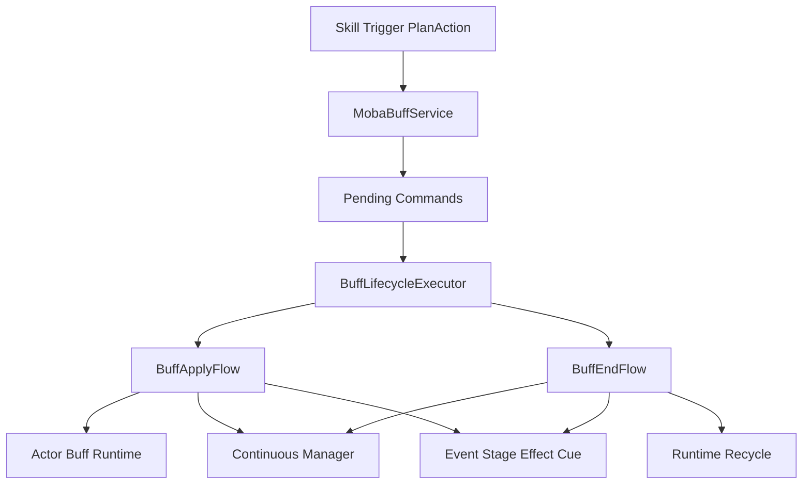
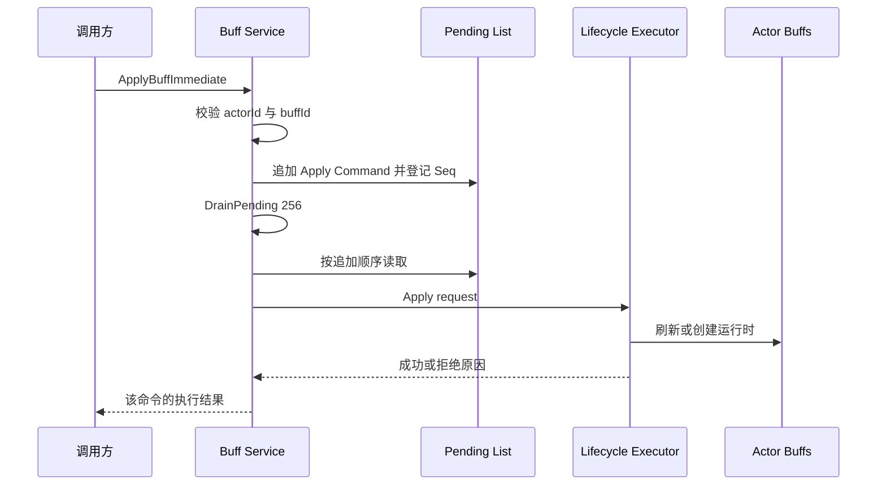
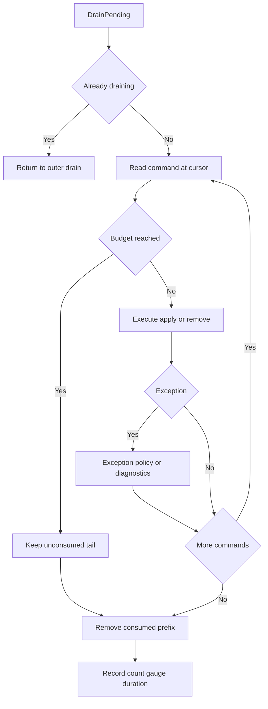
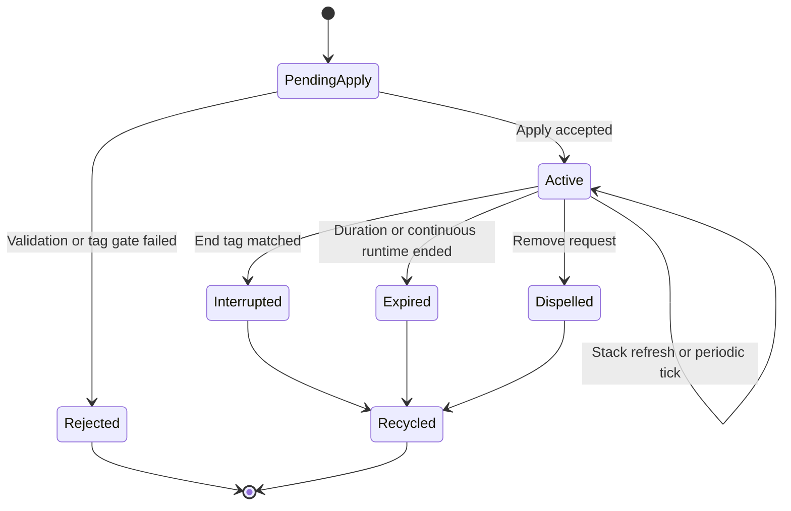

# MOBA Buff 命令执行与生命周期收敛深潜

> 文档类型：MOBA 项目应用组合深潜
> 事实基线：2026-08-17
>
> 本文只讨论 MOBA 示例中 Buff 命令怎样排队、消费、拒绝和结束，以及持续行为状态怎样与 Actor 上的运行时列表对账。配置字段、叠层策略、Triggering、Modifier 与表现协作的系统总览见 [Buff 系统](../../08-GameplayModules/03-BuffSystem.md)。

## 1. 文档职责与实现边界

玩法模块文档负责回答“Buff 系统有哪些能力”，本文负责回答“一个请求进入 `MobaBuffService` 后按什么顺序执行，失败后留下什么证据，运行时何时回收”。两篇文档共享源码，但不重复展开配置模型和效果类型。

Buff 可以承载属性修改、周期效果、标签门禁、表现 Cue 和触发器联动。入口服务不直接实现这些规则，而是把外部请求收敛到统一生命周期：

| 对象 | 负责 | 不负责 |
|------|------|--------|
| `MobaBuffService` | 参数初筛、命令排队、批量消费、调和入口、诊断 | 叠层策略、上下文创建、阶段效果细节 |
| `BuffLifecycleExecutor` | 编排 apply/remove，保存最近拒绝原因 | 直接持有世界 Tick |
| `BuffApplyFlow` | 配置和标签校验、刷新或新建运行时、绑定持续行为 | 对外排队和重入控制 |
| `BuffEndFlow` | 停止绑定、派发结束事件、移除并回收运行时 | 判断何时到期 |
| `IContinuousManager` | 推进持续行为和周期时间 | 决定 Buff 的业务叠层语义 |

因此，技能、触发器和 PlanAction 应调用 Buff 服务，而不应直接修改 Actor 的 `BuffsComponent.Active` 列表。

## 2. 源码入口与依赖

| 入口 | 源码 | 阅读重点 |
|------|------|----------|
| 对外入口 | [`MobaBuffService.cs`](../../../../Unity/Packages/com.abilitykit.demo.moba.runtime/Runtime/Application/Services/Buffs/MobaBuffService.cs:27) | 即时 API、命令队列、调和与诊断 |
| 生命周期编排 | [`BuffLifecycleExecutor.cs`](../../../../Unity/Packages/com.abilitykit.demo.moba.runtime/Runtime/Application/Services/Buffs/Lifecycle/BuffLifecycleExecutor.cs:57) | apply/remove 分流、拒绝结果、结束顺序 |
| 请求模型 | [`BuffRuntimeContexts.cs`](../../../../Unity/Packages/com.abilitykit.demo.moba.runtime/Runtime/Application/Services/Buffs/Core/BuffRuntimeContexts.cs) | `BuffApplyRequest`、`BuffRemoveRequest` |
| 应用流程 | [`BuffApplyFlow.cs`](../../../../Unity/Packages/com.abilitykit.demo.moba.runtime/Runtime/Application/Services/Buffs/Lifecycle/BuffApplyFlow.cs:17) | 配置门禁、叠层、新实例创建 |
| 结束流程 | [`BuffEndFlow.cs`](../../../../Unity/Packages/com.abilitykit.demo.moba.runtime/Runtime/Application/Services/Buffs/Lifecycle/BuffEndFlow.cs:16) | 解绑、通知、移除和回收 |
| 命令消费系统 | [`MobaBuffCommandDrainSystem.cs`](../../../../Unity/Packages/com.abilitykit.demo.moba.runtime/Runtime/Application/Systems/Buffs/MobaBuffCommandDrainSystem.cs:9) | 每帧 256 条命令预算 |
| 生命周期调和系统 | [`MobaBuffLifecycleReconcileSystem.cs`](../../../../Unity/Packages/com.abilitykit.demo.moba.runtime/Runtime/Application/Systems/Buffs/MobaBuffLifecycleReconcileSystem.cs:10) | 遍历 Actor 并执行运行时对账 |
| Continuous Tick 系统 | [`MobaContinuousTickSystem.cs`](../../../../Unity/Packages/com.abilitykit.demo.moba.runtime/Runtime/Application/Systems/Continuous/MobaContinuousTickSystem.cs:9) | 读取 World Clock，推进 MOBA Continuous Manager |
| 状态恢复 | [`MobaBuffStateRecoveryProvider.cs`](../../../../Unity/Packages/com.abilitykit.demo.moba.runtime/Runtime/Application/Services/Buffs/MobaBuffStateRecoveryProvider.cs:18) | 版本与依赖预校验、事务导入、失败回滚及行为关系重建 |
| 运行时仓储 | [`BuffRepository.cs`](../../../../Unity/Packages/com.abilitykit.demo.moba.runtime/Runtime/Application/Services/Buffs/Core/BuffRepository.cs:26) | 列表级首项索引、脏标记、对象池释放 |
| 计时回滚 | [`MobaBuffTimerRollbackProvider.cs`](../../../../Unity/Packages/com.abilitykit.demo.moba.runtime/Runtime/Application/Rollback/MobaBuffTimerRollbackProvider.cs:26) | 只更新已有 Buff 的计时、周期剩余和层数 |

`MobaBuffService` 是 World Service。`OnInit` 通过当前 World 的 `IWorldResolver` 构建生命周期执行器，确保配置、Actor 查询、事件总线、Trace、持续行为和表现快照都来自同一战斗作用域；`Dispose` 只清空尚未消费的命令，不负责重建或清理 Actor 上已有的 Buff 运行时。



## 3. 请求与命令模型

入口层内部使用 `BuffCommand` 保存单调递增的 `Seq`、`Apply` 或 `Remove` 类型及对应请求。当前列表按追加顺序消费，`Seq` 不参与 drain 重排；Immediate 路径用它关联本次等待的命令与执行结果，但它仍没有进入公开回执或录制协议。

应用请求的关键字段包括目标 Actor、Buff ID、来源 Actor、持续时间覆盖、来源上下文、是否强制新实例和 `BuffOriginContext`。实例级 API 要求 `sourceContextId` 非零，用它区分同一来源链上的独立运行实例。移除请求还携带 `TraceLifecycleReason`；普通移除请求若传入 `None`，执行器会规范化为 `Dispelled`。

入口只接受正数目标 ID 和 Buff ID。单项 `ApplyBuffImmediate`、`RemoveBuffImmediate` 及实例级重载先入队并主动 drain，再返回该命令的生命周期执行结果；生命周期拒绝返回 `false`。批量移除 API 返回实际执行成功数量。结构化拒绝详情仍由 `BuffLifecycleExecutor.LastReject` 转换成日志和诊断计数，公开 API 只返回布尔值或数量，不返回完整拒绝对象。效果回调中的重入 Immediate 为避免形成嵌套 drain 会直接返回失败；派生请求应通过普通入队路径交给外层 drain。

## 4. 即时调用仍走统一队列

所有 Immediate API 都遵循“先入队，再主动 drain”，没有绕过队列直接修改运行时：



即时调用、系统 Tick 中尚未消费的命令和效果执行期间派生的新请求共享同一个 pending 列表。`RemoveBuffsImmediate` 会倒序扫描当前运行时，按 Buff ID 和来源筛选，可只移除一个或全部；它先为匹配项建命令，再以 `max(256, queued + 32)` 作为本轮预算，并返回这些命令中实际成功移除的数量。按 ID 移除是内部强制结束入口，不套用驱散策略；正式驱散入口是带可选类别的 `RemoveBuffsWithTagImmediate`。

## 5. Drain、重入与命令预算

`DrainPending(maxCommands)` 的行为具有明确约束：

1. `maxCommands <= 0` 时不执行；
2. `_draining > 0` 时内层调用直接返回，阻止效果回调递归进入第二层 drain；
3. 内层 Immediate 调用仍会先追加命令；外层 drain 的循环条件读取实时列表长度，所以新增命令通常会在同一轮继续消费；
4. 达到预算后停止，将未消费尾部保留给后续 drain，通常由同帧后续入口或下一帧命令系统继续推进；
5. 单条命令异常被捕获并上报，后续命令继续执行；
6. 最后统一移除游标已经读取的前缀并记录诊断数据。



默认即时 API 和每帧命令系统都使用 256 条预算，作用是阻断错误配置或循环触发造成的单轮无限增长。超过预算会产生 `buff.drain.maxCommands` 警告和 `moba.buff.drain.maxCommandsExceeded` 计数，剩余命令不会被丢弃。预算会改变派生命令在哪一次 drain 中执行；若同步方案要求严格同帧语义，预算必须成为固定协议，而不是运行时可随意调整的参数。

## 6. Apply 的执行边界

`BuffLifecycleExecutor.Apply` 将请求交给 `BuffApplyFlow`。本专题只保留与执行语义相关的四个分支：

1. 配置、目标或标签门禁失败时，返回结构化 `BuffLifecycleRejectResult`；
2. 已有匹配运行时且未强制新实例时，进入叠层或刷新；
3. 新建运行时只有在 Continuous 激活成功后才加入 Actor 的 Active 列表；
4. Continuous 激活失败时取消上下文、释放技能运行时 retain、发送失败生命周期通知并回收新运行时。

运行时匹配不是只看 Buff ID，而是由 `BuffRuntimeKey` 结合请求类型和来源身份决定。实例级申请和移除必须保留非零 `sourceContextId`，否则同名 Buff 的独立来源链无法稳定区分。具体配置、叠层和持续修饰语义由 [Buff 系统](../../08-GameplayModules/03-BuffSystem.md) 统一说明。

拒绝结果包含枚举类型、稳定字符串 code 和详细 message。入口服务立即消费内部 `LastReject`，生成 `moba.buff.command.rejected`、按拒绝 code、Buff ID 和来源 Actor 拆分的计数；Immediate API 返回成功与否，但不把完整拒绝对象作为回执返回。

### 6.1 驱散策略与免疫门禁

`RemoveBuffsWithTagImmediate` 在标签和来源筛选后执行驱散策略。`BuffDispelPolicy.LegacyTag` 保持旧配置可驱散，`Dispellable` 明确允许驱散，`Undispellable` 拒绝驱散。请求类别或 Buff 类别为 0 时表示通配；两者都大于 0 时必须一致。`DispelBlockedByTags` 命中目标有效 Tag 时阻断驱散；配置了阻断 Tag 但有效 Tag 查询服务缺失时采用 fail-closed，不移除运行时。

驱散拒绝使用稳定诊断 code：`buff.dispel.undispellable`、`buff.dispel.categoryMismatch`、`buff.dispel.immunityBlocked` 和 `buff.dispel.tagQueryUnavailable`。扫描会跳过被拒绝候选并继续处理其他匹配项。配置验收同时固定 `moba.buff.dispel.invalid_policy`、`moba.buff.dispel.negative_category`、`moba.buff.dispel.redundant_category` 和 `moba.buff.dispel.redundant_blocked_tags`；前两项阻断非法配置，后两项报告不可驱散 Buff 上的冗余字段。

## 7. Remove 与结束顺序

移除流程先确认请求、目标和 Buff 列表有效，再通过 `BuffRuntimeKey.MatchRemoveRequest` 倒序匹配运行时。倒序遍历避免移除列表项后破坏后续索引。`EndRuntime` 的顺序是生命周期正确性的关键：


先通知后回收，保证事件、阶段效果和表现 Cue 仍能读取尚未清空的运行时；先停止持续行为，避免后续 Continuous Tick 继续投影 Modifier 或执行 interval。找不到匹配运行时会形成内部拒绝码和诊断，单项 Immediate API 返回 `false`，但调用方仍需从诊断获取完整拒绝原因。

## 8. 生命周期调和

`ReconcileActorBuffLifecycles` 负责把持续行为状态和 Actor Buff 列表对账。它倒序遍历运行时并执行：

1. 删除空引用并标记仓储 dirty；
2. 延迟解析标签生命周期要求；
3. 标签要求触发结束时把剩余时间置零；
4. 有连续运行时则同步剩余时间和周期剩余时间；
5. 根据标签中断、连续运行时终止或普通倒计时归零决定结束；
6. 标签导致结束使用 `Interrupted`，自然结束使用 `Expired`。



原有提纲把“目标死亡、阵营变化”列为调和职责，但当前方法没有直接检查死亡或阵营字段；这类语义必须通过标签、显式 remove、持续运行时终止或其他生命周期系统转换后进入本流程。

## 9. 确定性、恢复与诊断

### 9.1 执行顺序基线

当前 MOBA `Execute/Normal` 阶段的关键顺序是：

```text
EffectsStep -> BuffCommandsDrain -> ContinuousTick -> BuffLifecycleReconcile
                 -> OngoingTriggerPlansReconcile -> GameplayTick
```

这个顺序由 [`MobaSystemOrder.ValidateKeyDependencies()`](../../../../Unity/Packages/com.abilitykit.demo.moba.runtime/Runtime/Application/Systems/MobaSystemOrder.cs:102) 做静态关系检查；具体系统分别以 [`MobaBuffCommandDrainSystem`](../../../../Unity/Packages/com.abilitykit.demo.moba.runtime/Runtime/Application/Systems/Buffs/MobaBuffCommandDrainSystem.cs:8)、[`MobaContinuousTickSystem`](../../../../Unity/Packages/com.abilitykit.demo.moba.runtime/Runtime/Application/Systems/Continuous/MobaContinuousTickSystem.cs:9) 和 [`MobaBuffLifecycleReconcileSystem`](../../../../Unity/Packages/com.abilitykit.demo.moba.runtime/Runtime/Application/Systems/Buffs/MobaBuffLifecycleReconcileSystem.cs:9) 声明顺序。它保证本轮已排队命令先于 Continuous 推进，Continuous 状态再被 Buff 调和读取；这仍是执行顺序契约，不等于完整的回放或跨 World 确定性证明。

### 9.2 运行时确定性与诊断

| 维度 | 当前实现与边界 |
|------|----------------|
| 顺序 | 同一 World 内按单线程追加顺序执行；`Seq` 未用于重排，也没有线程安全写入协议 |
| 重入 | 内层 drain 返回，新增命令由外层游标继续处理，不形成递归调用栈 |
| 预算 | 每轮有限命令数，剩余命令延后；预算变化可能改变派生命令的执行批次 |
| GC | pending list 复用；成功结束的运行时由结束流程回收；诊断消息支持延迟工厂 |
| 仓储索引 | `BuffRepository` 以列表身份维护 Buff、Buff+Source、Buff+Context 和完整实例四类首项哈希索引；`MarkDirty(list)` 只失效该列表，列表回池前移除索引。查询保持“列表中第一个匹配项”及 `SourceActorId=0` 的通配语义 |
| 异常 | 单命令异常按可恢复域错误上报，不中断整个队列，也不回滚该命令异常前已产生的副作用；诊断采集异常单独被吞掉，不影响主流程 |
| Trace | Apply、Continuous 和 End 保存来源上下文，但本文没有把 Trace 存在性等同于所有链路都已通过回放验证 |
| 状态恢复 | payload v2 在清空现态前校验版本、身份唯一性、目标 Actor、父运行时及 Continuous 依赖；导入失败使用导入前快照恢复旧状态。条目恢复会重获 skill retain，重建 `Continuous` 与 `TagRequirements`，并重新创建 Buff context；依赖缺失或激活失败时 fail-fast，清理候选资源。Modifier 与 owner-bound Trigger 不由该 Provider 独立重建，必须由当前已装配的生命周期绑定契约提供或在预校验阶段拒绝 |
| 计时回滚 | `MobaBuffTimerRollbackProvider` v3 不清空、不创建、不删除运行时，按 ActorId + BuffId + SourceActorId + SourceContextId 定位实例并恢复计时、周期剩余和层数；找不到唯一身份时零写入 |

可观察指标包括 `moba.buff.drain.pending`、`moba.buff.drain.executed`、`moba.buff.pending`、`moba.buff.command.exceptions`、`moba.buff.command.rejected` 及按拒绝原因拆分的计数。排查“Buff 没生效”时，应先区分入口参数拒绝、生命周期拒绝、命令预算延后和执行异常四类原因。

## 10. 验证证据与缺口

证据按“源码契约、直接单元测试、间接业务/诊断证据、补测责任”分层；测试类名或 Release 总数本身不扩大覆盖范围。

| 证据层 | 入口 | 能证明什么 | 不能证明什么 |
|----------|------|------------|--------------|
| 源码契约 | [`MobaBuffService.cs`](../../../../Unity/Packages/com.abilitykit.demo.moba.runtime/Runtime/Application/Services/Buffs/MobaBuffService.cs:75)、[`BuffApplyFlow.cs`](../../../../Unity/Packages/com.abilitykit.demo.moba.runtime/Runtime/Application/Services/Buffs/Lifecycle/BuffApplyFlow.cs:56)、[`BuffEndFlow.cs`](../../../../Unity/Packages/com.abilitykit.demo.moba.runtime/Runtime/Application/Services/Buffs/Lifecycle/BuffEndFlow.cs:35) | Immediate 执行回执、队列预算、驱散门禁、新实例提交时机和结束补偿顺序 | 所有玩法配置组合和跨 World 回放均已覆盖 |
| 源码契约 | [`MobaBuffStateRecoveryProvider.cs`](../../../../Unity/Packages/com.abilitykit.demo.moba.runtime/Runtime/Application/Services/Buffs/MobaBuffStateRecoveryProvider.cs:69)、[`MobaBuffTimerRollbackProvider.cs`](../../../../Unity/Packages/com.abilitykit.demo.moba.runtime/Runtime/Application/Rollback/MobaBuffTimerRollbackProvider.cs:47) | 全量恢复的预校验/回滚/重装配边界，以及 timer rollback v3 的完整实例身份与零写入边界 | 外部订阅者的任意自定义副作用都可自动恢复 |
| Unity 生命周期 fixture | [`MobaBuffLifecycleTransactionTests.cs`](../../../../Unity/Packages/com.abilitykit.demo.moba.editor/Tests/MobaBuffLifecycleTransactionTests.cs:21) | Repository 首项索引和列表级失效、Drain 预算/重入/异常隔离、Immediate 回执、EndFlow 补偿、驱散及 fail-closed 诊断 | 生产配置全集和网络重放的组合覆盖 |
| Unity 配置 fixture | [`MobaProductionConfigReferenceValidationTests.cs`](../../../../Unity/Packages/com.abilitykit.demo.moba.view.runtime/Runtime/Game/Test/UnitTest/MobaProductionConfigReferenceValidationTests.cs) | 驱散非法枚举、负类别和冗余配置使用稳定 code 验收 | 自定义运行时注入的配置绕过校验后仍然安全 |
| 直接单元测试 | `BuffStackingPolicyApplierTests`、`MobaContinuousLifecycleTests` | 叠层策略及通用 Continuous runtime 的激活、拒绝、暂停、结束与注销 | Buff 在全部技能组合中的业务正确性 |
| 间接诊断测试 | `MobaBuffDiagnosticProducerTests`、Actor Buff diagnostic store tests | Buff 诊断 draft、collector、snapshot 字段和实例键投影 | 真实 Apply/Remove/End 生命周期已经成功执行 |
| 顺序源码/检查 | [`MobaSystemOrder.cs`](../../../../Unity/Packages/com.abilitykit.demo.moba.runtime/Runtime/Application/Systems/MobaSystemOrder.cs:102) | `EffectsStep < BuffCommandsDrain < ContinuousTick < BuffLifecycleReconcile < OngoingTriggerPlansReconcile < GameplayTick` 的关系检查 | 每个系统组合和多 World 调度都已运行时验证 |

2026-08-17 的聚焦证据为：Unity 生命周期 fixture 18/18，通过 Repository、Drain、Immediate、EndFlow、恢复和驱散专项；Unity 配置验收 fixture 5/5，通过驱散配置稳定 code；Runtime、Diagnostics Core Tests 和 Game UnitTests 三个 .NET 构建均为 0 error。构建仍分别保留 111、148、162 条既有 warning，本轮没有把 warning 基线误报成零。

剩余验证责任集中在更大组合面：生产配置全集、跨 World 调度与网络重放；自定义 owner-bound Trigger/Modifier 扩展必须继续遵守恢复预装配或 fail-fast 契约；系统顺序仍需保留独立回归门禁。

## 11. 设计结论

这条实现链的核心是把 Buff 请求顺序、执行回执、失败诊断、结束清理与父技能 retain 集中到 World 作用域内。命令队列限制递归重入和单轮工作量，生命周期执行器维护 Apply/Remove，恢复 Provider 以预校验、事务导入和失败回滚重建 capability，列表级 Repository 索引支撑稳定首项查找，调和系统再把 Continuous 与 Active 列表对齐。它仍是 MOBA 对公共 Buff/Continuous/Modifier/Tag 原语的项目组合；完整回放和外部自定义绑定等价性不能仅凭聚焦 fixture 或 Trace 推导。

---

*文档版本：v4.0 | 最后更新：2026-08-17*
