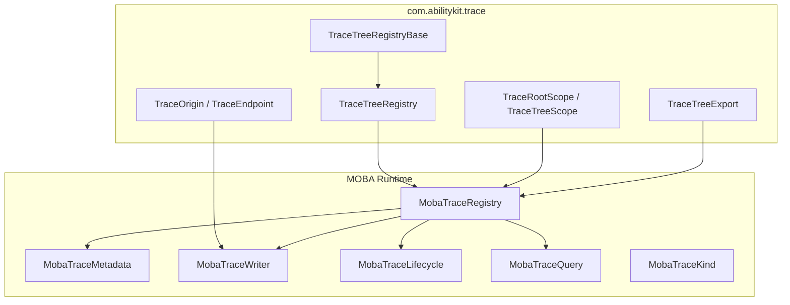
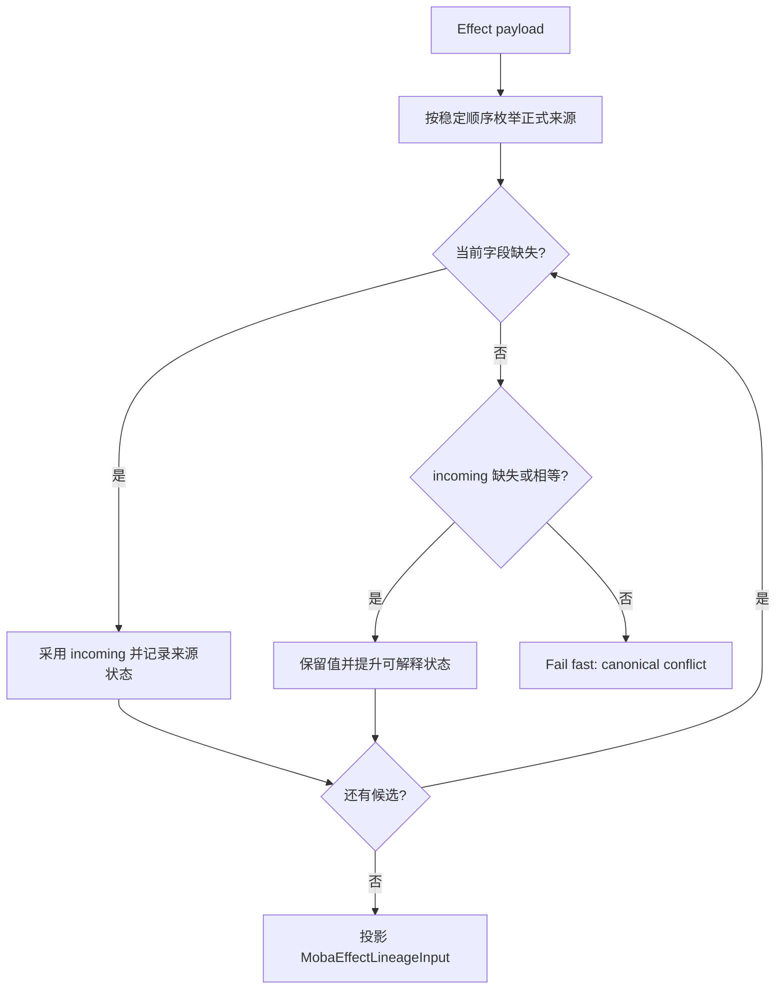
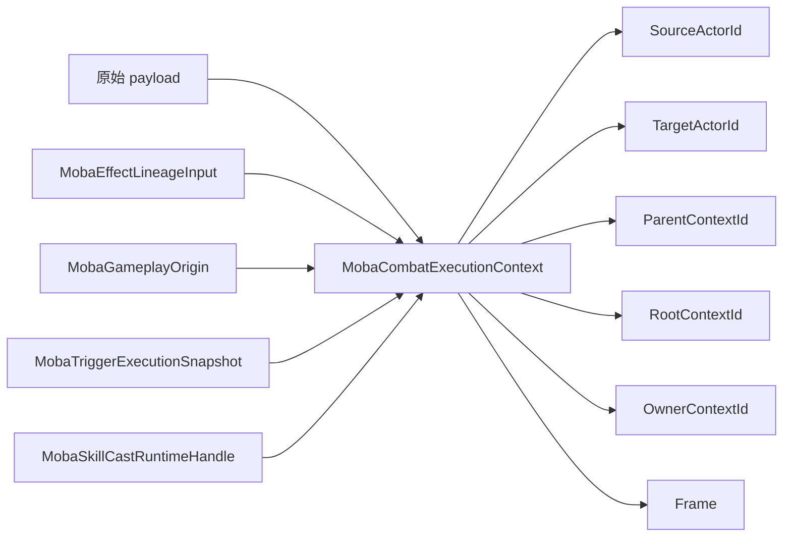
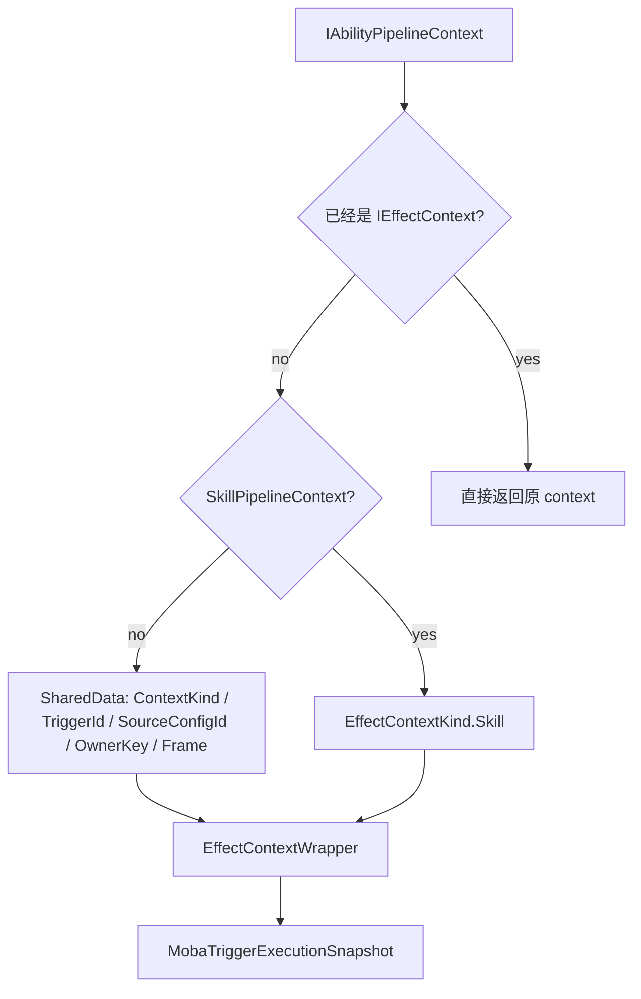
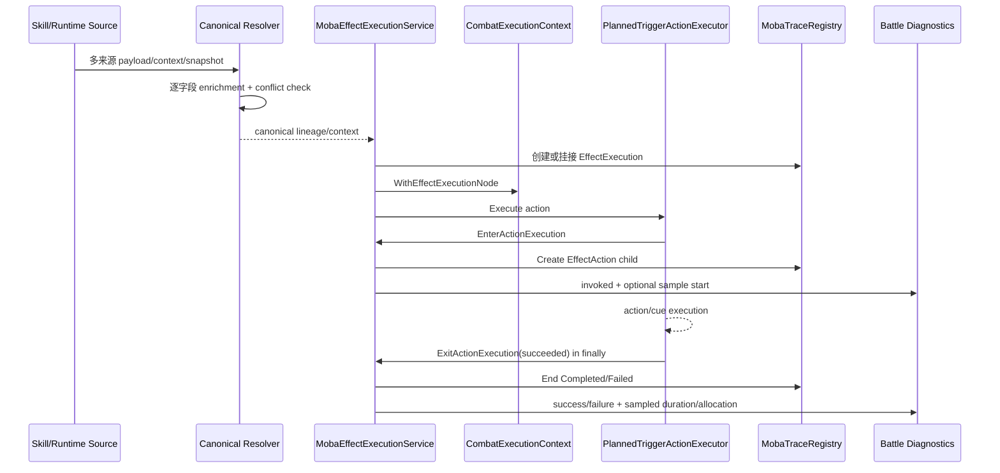

# MOBA Trace、Context 与 Effect 执行深潜

> 文档类型：MOBA 项目应用组合深潜
> 事实基线：2026-08-16
> 文档版本：v3.0
>
> 本文补充 MOBA 示例中 Trace、Context、Effect 三条链路的设计。它们解决的不是单个技能如何执行，而是“效果为什么被执行、由谁触发、挂在哪个父节点下、验收时如何证明动作确实发生”。

## 1. 设计目标

MOBA 示例把技能、Buff、Projectile、Damage 都纳入同一套可追踪上下文：

| 目标 | 说明 | 代表源码 |
|------|------|----------|
| 可解释 | 每次效果执行都能还原来源、目标、配置、父子关系 | `MobaTraceRegistry`、`MobaTraceMetadata` |
| 可传递 | Skill、Buff、Trigger、Effect 之间传递统一 lineage input | `MobaEffectLineageInput`、`MobaTriggerLineageContext` |
| 可归一 | 多个正式来源按字段补齐 provenance，非缺失冲突立即失败 | `MobaCanonicalProvenance`、`MobaTriggerContextResolveExtensions` |
| 可拥有 | 跨帧 runtime 明确 retain/release，identity 不冒充 lifecycle ownership | `MobaTraceRetentionHandle`、`MobaRuntimeTraceRetentionService` |
| 可校验 | 缺少 source/context 时失败，并能返回稳定树结构错误 | `MobaEffectLineageInputResolver`、`MobaTraceQuery.ValidateChainDetailed` |
| 可观测 | Action 成功/失败无条件计数，耗时与线程分配按 channel 采样 | `MobaEffectExecutionService`、`MobaAnalysisMetricCatalog` |
| 可验收 | 单测断言 EffectExecution、EffectAction、ownership 与结构校验 | `MobaCanonicalProvenanceTests`、`MobaTraceDiagnosticProducerTests` |

## 2. Trace 注册表分层

`com.abilitykit.trace` 提供通用树结构，MOBA 只补充玩法语义。



核心关系：

1. `TraceTreeRegistryBase` 保存内部节点、根节点、父子表和叶子数据；
2. `TraceTreeRegistry<TMetadata>` 负责创建 root/child、快照查询、按 root 或 kind 枚举；
3. `MobaTraceRegistry` 继承泛型注册表，把 `int kind` 映射为 `MobaTraceKind`；
4. `MobaTraceMetadata` 保存 source actor、target actor、config id、origin display 等 MOBA 字段；
5. `TraceRootScope` / `TraceTreeScope` 用 `IDisposable` 模式保证 begin/end 成对。

## 3. MOBA Trace 节点模型

`MobaTraceRegistry` 的 `CreateMetadata` 会把通用 trace origin 转成 MOBA metadata：

| 字段 | 来源 | 用途 |
|------|------|------|
| `RootId` | 注册表创建 root 时生成 | 标识整条执行链 |
| `TraceKind` | `MobaTraceKind` | 区分 SkillCast、EffectExecution、EffectAction 等 |
| `ConfigId` | 技能、效果、动作、Buff 配置 id | 用于验收断言和回放定位 |
| `SourceActorId` | lineage/source context | 说明谁触发 |
| `TargetActorId` | lineage/target context | 说明作用于谁 |
| `OriginSource` | `TraceEndpoint` display | 人类可读来源 |
| `OriginTarget` | `TraceEndpoint` display | 人类可读目标 |

`MobaRuntimeKindNames` 则统一了 actor、skill、effect、action、buff、projectile、damage 等运行时分类字符串，便于诊断和上下文分类复用。

## 4. Effect Lineage 输入

`MobaEffectLineageInput` 是效果执行挂接到既有链路的正式输入：

| 属性 | 语义 |
|------|------|
| `ContextKind` | 当前执行来自 Skill、Buff、Projectile 等哪类上下文 |
| `OriginKind` | 创建 trace 时采用的来源 kind，效果通常是 `EffectExecution` |
| `SourceActorId` / `TargetActorId` | 执行源与执行目标 |
| `ParentContextId` | 新效果应挂接到哪个父 trace 节点 |
| `RootContextId` | 已知根节点；缺省时使用 parent 作为有效 root |
| `OwnerContextId` | 传播、订阅与取消使用的路由身份；它本身不授予结束 trace 的生命周期权限 |
| `OriginConfigId` | 导致执行的配置 id |

已有 trace lineage 的输入通过 `HasExecutionSource` 要求 `SourceActorId > 0` 且 `ParentContextId != 0`。actor-only payload 是受控例外：Actor ID 与 trace context ID 属于不同命名空间，resolver 只保留 source/target actor，并令 parent/root/owner context 为零；effect service 创建新的 trace root 后，再把 execution frame 提升到该真实 root。实现不会把 Actor ID 伪装成 trace parent。

## 5. Context Source 解析与 canonical provenance

`MobaEffectLineageInputResolver` 先通过 `TryResolveContextSource` 收集 payload 暴露的正式来源，再生成 lineage input。候选仍按稳定顺序发现，但顺序只决定确定性扫描和来源标签，不再意味着“第一个对象整体覆盖后续对象”：

```text
MobaContextSourceView
-> MobaPersistentContextSourceSnapshot
-> MobaCombatExecutionContext
-> IMobaCombatContextSource
-> IMobaCombatExecutionContextProvider
-> IMobaPersistentContextSourceProvider
-> IMobaContextSourceProvider
-> IMobaOriginContextProvider
-> IMobaTriggerLineageContextProvider
-> IMobaTriggerTraceContextProvider
-> IMobaTriggerExecutionSnapshotProvider
```

### 5.1 字段状态与合并规则

`MobaCanonicalProvenance` 对正式 identity 逐字段保存值和来源状态：

| 状态 | 含义 |
|------|------|
| `Missing` | 当前来源没有该字段，可由后续候选补齐 |
| `Synthesized` | 从 live runtime/debug 投影得到 |
| `Inherited` | 从 snapshot 或既有执行上下文继承 |
| `Explicit` | direct provider 显式提供 |

canonical identity 包含 `SourceActorId`、`TargetActorId`、`SourceContextId`、`ParentContextId`、`RootContextId`、`OwnerContextId` 和 `SkillRuntimeHandle`。合并遵循两个规则：当前缺失时接受 incoming；双方均非缺失时必须相等，否则抛出包含 field、current/incoming 和双方来源的 `InvalidOperationException`。状态只用于说明 provenance 质量，不允许高等级来源静默覆盖一个不同的非缺失值。

`ContextKind`、`TriggerId`、`Frame` 等 execution metadata 也执行“缺失补齐、非缺失冲突失败”。`ConfigId` 没有并入 canonical identity，因为来源配置与当前 Effect/Action 执行配置属于不同语义字段。



actor-only payload 仍是受控例外：只保留 actor identity，parent/root/owner 保持零；Effect service 创建真实 root 后再推进执行上下文。实现不会把 Actor ID 伪装成 Trace ID。

## 6. CombatExecutionContext：统一读模型与 Effect 节点推进

`MobaCombatExecutionContext` 是战斗执行期统一上下文。它不要求业务代码直接理解所有 payload 类型，而是统一读取 source、target、root、parent、owner、frame、skill runtime handle。跨边界数据继续使用职责不同的投影，而不是把 live runtime 引用塞入持久 DTO：`MobaCombatContextSource` 表达执行来源，`MobaTriggerExecutionSnapshot` 表达触发时快照，`MobaPersistentContextSourceSnapshot` 表达可持久化来源，`MobaContextSourceView` 作为统一只读解析结果。



构造执行上下文时会从 canonical source、lineage、origin 与 execution snapshot 做确定性投影。payload provider 解析先完成字段级 enrichment 与冲突检查，工厂只消费已经归一化的正式来源，不能重新用隐式优先级覆盖 identity。

| 字段 | 显式输入投影优先级 |
|------|--------------------|
| `SourceActorId` | Lineage → Origin → ExecutionSnapshot |
| `TargetActorId` | Lineage → Origin → ExecutionSnapshot |
| `ParentContextId` | Lineage → Origin.EffectiveParentContextId → Snapshot.SourceContextId |
| `RootContextId` | Lineage.EffectiveRootContextId → Origin.EffectiveRootContextId → Snapshot.EffectiveRootContextId |
| `ContextKind` | Lineage.ContextKind → Snapshot.Kind |

Effect trace 建立后，`WithEffectExecutionNode(effectContextId, effectConfigId, isRoot)` 会推进当前执行节点：`SourceContextId` 和 `ParentContextId` 指向真实 `EffectExecution` 节点；新建 root 时 `RootContextId` 指向自身，挂接 child 时保留既有 root；缺失 owner 才回退到 root。这样嵌套 Effect 和后续 Action 从当前执行节点继续派生，而不是反复挂到原始 Skill/Buff 来源。

## 7. Effect 调用入口

`MobaEffectInvokerService` 提供两个入口：

| 入口 | 适用场景 | 行为 |
|------|----------|------|
| `Execute(effectId, sourceActorId, targetActorId, contextKind, sourceContextId, ...)` | 代码只知道基础执行参数 | 创建 `MobaEffectPipelineContext`，写入 source/target/context/sourceContextId |
| `Execute(effectId, IAbilityPipelineContext context)` | 已经处在技能或效果管线上 | 直接复用上下文执行 |

缺少 `MobaEffectExecutionService` 时不会静默失败，而是通过 `MobaRuntimeGuard.ThrowRequired` 抛出带 domain、operation、service、effectId 的错误。这种设计保证配置问题能在验收阶段暴露。

## 8. Pipeline Context 与 IEffectContext 兼容

`EffectContextWrapper` 解决通用 Ability Pipeline 与 MOBA Effect Context 之间的适配：



它会从 `AbilityContextKeys` 中读取 `ContextKind`、`TriggerId`、`SourceConfigId`、`OwnerKey`、`Frame`，并把 `SourceContextId` 映射到 `IAbilityPipelineContext` 的 shared data。这样 Skill Pipeline、Trigger Action 和 Effect Service 可以共享一套上下文字段。

## 9. Effect 与 Action 的真实执行生命周期

Triggering 公共层通过 `ITriggerActionExecutionScopeObserver` 暴露宿主观察边界。`PlannedTriggerActionExecutor` 在正式 action 调用前执行 `EnterActionExecution(index, actionId)`，并在 `finally` 中执行 `ExitActionExecution(index, actionId, succeeded)`；Action 本身、before/executed cue 或参数绑定抛错时，Exit 仍会收到 `succeeded=false`。

`MobaEffectExecutionService` 实现该 observer：Enter 在当前 Effect 下创建 `EffectAction` child，保存 action identity 并开始诊断；Exit 先清空当前 identity，再以 `Completed` 或 `Failed` 结束节点并提交一次诊断。Effect 异常 cleanup 复用同一收尾逻辑，迟到或重复 Exit 因 identity 已清空而不重复结束和计数。



## 10. 跨帧 ownership 与清理

Trace identity 与 ownership 分离。`RootContextId`、`SourceContextId` 和 `OwnerContextId` 说明链路关系或路由身份，不代表调用方已经持有根引用。Buff、Projectile、Summon 和 Skill runtime 需要跨帧保存来源时，通过 `MobaRuntimeTraceRetentionService` 取得 `MobaTraceRetentionHandle`；handle 只在成功 retain 后有效，`Dispose()` exactly-once release。

| 路径 | 必须完成的动作 |
|------|----------------|
| 正常结束/命中/完成 | 结束领域 runtime，释放其 retention handle |
| 强制终止/取消 | 使用同一收尾入口释放，不依赖正常事件补偿 |
| `Clear()` / `Dispose()` | 遍历仍存 runtime 并释放全部持有 |
| 创建或恢复失败 | 逆序回滚已建立状态并释放已取得 handle |
| stale 检查 | `ScanRetention()` 上报 retained/ended/stale root gauge 与 warning |

通用 `TraceRootScope.Dispose()` 只 release、不结束树；MOBA 长生命周期 runtime 因此不把 scope 当作完整业务终态。Action 是同步执行边界，使用显式 `End()`；跨帧对象使用 retention handle。

## 11. 结构校验与诊断指标

`MobaTraceQuery.ValidateChainDetailed(rootId)` 返回稳定的 `MobaTraceValidationResult`，当前错误包括 `RootNotFound`、`InvalidRoot`、`DuplicateContext`、`RootMismatch`、`ParentNotFound`、`ParentRootMismatch`、`CycleDetected` 和 `ChildCountMismatch`。校验用于验收、诊断导出和恢复检查，不是通用 Trace 注册表的自动写入门禁。

Action 热路径指标分两层：

| 指标 | 采集策略 |
|------|----------|
| `moba.effect.action.invoked` | 无条件 counter |
| `moba.effect.action.succeeded` | 无条件 counter，exactly-once |
| `moba.effect.action.failed` | 无条件 counter，exactly-once |
| `moba.effect.action.durationMs` | `TriggerHook` channel 采样 |
| `moba.effect.action.allocatedBytes` | 采样时使用当前线程分配字节差值 |

Effect scope 复用当前 Action 字段，不为每次 Action 创建额外 instrumentation 对象。采样开关只影响 duration/allocation，不能隐藏调用量和失败量。

## 12. 验收视角

验收不是只看伤害数值，还要看 trace 结构：

| 验收点 | 说明 |
|--------|------|
| SkillCast trace | 技能是否进入释放链路 |
| EffectExecution trace | 指定 effectId 是否创建 root |
| EffectAction trace | 指定 actionId 是否挂在 effect root 下 |
| root/child 关系 | 动作不是孤儿节点，能回溯到效果根 |
| config id | 验收能精确定位技能、效果、动作配置 |

`MobaSkillConfigTestHarness` 中的 `AssertEffectExecutionTrace` 与 `AssertActionExecutedUnderEffect` 表明：MOBA 示例把 trace 当成配置化技能验收的一等结果，而不是辅助日志。

结构断言不只检查节点存在，还应先调用 `ValidateChainDetailed()` 确认根和父子表一致，再检查 kind/configId/end reason。当前聚焦证据覆盖 valid tree、missing root、child used as root，以及 Action 成功、失败、重复退出和异常 cleanup。

## 13. 设计边界

| 边界 | 说明 |
|------|------|
| Trace 不负责执行业务 | 只记录根、父子、kind、metadata、生命周期 |
| Context 不负责修改战斗状态 | 只提供稳定读模型与 source/root/parent 推导 |
| 通用 Context 不等于 MOBA combat context | `com.abilitykit.context` 管实体/Flow/Snapshot；canonical provenance 是 MOBA 应用层策略 |
| EffectInvoker 不负责解释配置 | 只把 effectId 与 context 交给执行服务 |
| Resolver 不做静默覆盖 | 缺失字段允许 enrichment，双方非缺失 identity/metadata 冲突 fail-fast |
| Owner identity 不等于 lifecycle ownership | `OwnerContextId` 用于传播、订阅和取消；实际持有 runtime 的服务负责 retain/release |
| Action observer 是执行边界 | Triggering 只发 Enter/Exit；MOBA 决定 Trace kind、结束原因和诊断指标 |
| 结构校验不是写入门禁 | `ValidateChainDetailed()` 是 MOBA 查询层能力，通用注册表仍允许弱约束写入 |
| 验收基于结构而不是日志文本 | 断言 trace node、root、configId、kind、end reason 和 validation result |

## 14. 源码入口

| 主题 | 源码 |
|------|------|
| 通用 trace registry | `Unity/Packages/com.abilitykit.trace/Runtime/TraceTreeRegistry.Core.cs` |
| trace scope | `Unity/Packages/com.abilitykit.trace/Runtime/TraceTreeScope.cs` |
| trace origin | `Unity/Packages/com.abilitykit.trace/Runtime/TraceOrigin.cs` |
| trace export | `Unity/Packages/com.abilitykit.trace/Runtime/TraceTreeExport.cs` |
| MOBA registry | `Unity/Packages/com.abilitykit.demo.moba.runtime/Runtime/Application/Services/Trace/MobaTraceRegistry.cs` |
| MOBA metadata | `Unity/Packages/com.abilitykit.demo.moba.runtime/Runtime/Application/Services/Trace/MobaTraceMetadata.cs` |
| lineage input | `Unity/Packages/com.abilitykit.demo.moba.runtime/Runtime/Application/Services/Context/Lineage/MobaEffectLineageInput.cs` |
| lineage resolver | `Unity/Packages/com.abilitykit.demo.moba.runtime/Runtime/Application/Services/Context/Lineage/MobaEffectLineageInputResolver.cs` |
| canonical provenance / provider resolver | `Unity/Packages/com.abilitykit.demo.moba.runtime/Runtime/Application/Services/Context/Providers/MobaTriggerContextResolveExtensions.cs` |
| context source view | `Unity/Packages/com.abilitykit.demo.moba.runtime/Runtime/Application/Services/Context/Providers/MobaTriggerContextProviders.cs` |
| combat execution context | `Unity/Packages/com.abilitykit.demo.moba.runtime/Runtime/Application/Services/Context/Execution/MobaCombatExecutionContext.cs` |
| effect invoker | `Unity/Packages/com.abilitykit.demo.moba.runtime/Runtime/Application/Services/Effect/MobaEffectInvokerService.cs` |
| Effect/Action lifecycle | `Unity/Packages/com.abilitykit.demo.moba.runtime/Runtime/Application/Services/Skill/Effects/MobaEffectExecutionService.cs` |
| Action observer contract | `Unity/Packages/com.abilitykit.triggering/Runtime/Context/IServiceProvider.cs` |
| Action observer invocation | `Unity/Packages/com.abilitykit.triggering/Runtime/Plans/Execution/PlannedTriggerActionExecutor.cs` |
| runtime retention | `Unity/Packages/com.abilitykit.demo.moba.runtime/Runtime/Application/Services/Trace/MobaTraceRetention.cs` |
| 结构校验 | `Unity/Packages/com.abilitykit.demo.moba.runtime/Runtime/Application/Services/Trace/MobaTraceRuntimeServices.cs` |
| Action 指标目录 | `Unity/Packages/com.abilitykit.demo.moba.runtime/Runtime/Application/Services/Diagnostics/MobaAnalysisMetricCatalog.cs` |
| context wrapper | `Unity/Packages/com.abilitykit.demo.moba.runtime/Runtime/Application/Services/Effect/EffectContextWrapper.cs` |
| canonical provenance 测试 | `Unity/Packages/com.abilitykit.demo.moba.editor/Tests/MobaCanonicalProvenanceTests.cs` |
| ownership 测试 | `Unity/Packages/com.abilitykit.demo.moba.editor/Tests/MobaRuntimeOwnershipLifecycleTests.cs` |
| Trace 结构测试 | `Unity/Packages/com.abilitykit.demo.moba.editor/Tests/MobaTraceDiagnosticProducerTests.cs` |
| Action diagnostics 测试 | `Unity/Packages/com.abilitykit.demo.moba.editor/Tests/MobaEffectDiagnosticProducerTests.cs` |

## 15. 验证基线

以下 Unity EditMode 聚焦结果于 2026-08-15 实际执行，并在 2026-08-16 文档复核时作为历史 artifact 使用；本批没有重新运行 Unity：

| Fixture | 结果 | 覆盖重点 |
|---------|------|----------|
| `MobaCanonicalProvenanceTests` | 14/14 | 多来源 enrichment、identity/metadata 冲突、Effect node 推进 |
| `MobaRuntimeOwnershipLifecycleTests` | 9/9 | Buff/Projectile/Summon/Skill 正常、强制、clear/dispose 与回滚 |
| `MobaTraceDiagnosticProducerTests` | 15/15 | Trace 诊断与结构校验稳定错误 |
| `MobaEffectDiagnosticProducerTests` | 15/15 | Action 成功/失败、采样、重复退出和异常 cleanup |

`AbilityKit.Demo.Moba.Runtime.csproj` 与 diagnostics core tests 工程均为 0 error；warning 为既有 Unity assembly 引用冲突和弃用项。上述证据是局部 E3，不代表多人网络、长期 soak 或统一发布 E5 已覆盖。

---

*文档版本：v3.0 | 最后更新：2026-08-16 | 验证基线：canonical 14/14、ownership 9/9、Trace 15/15、Action diagnostics 15/15（均为 2026-08-15 artifact）*
