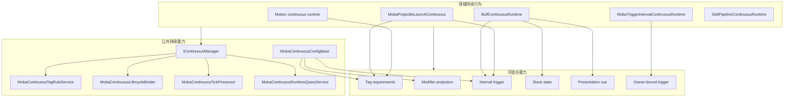
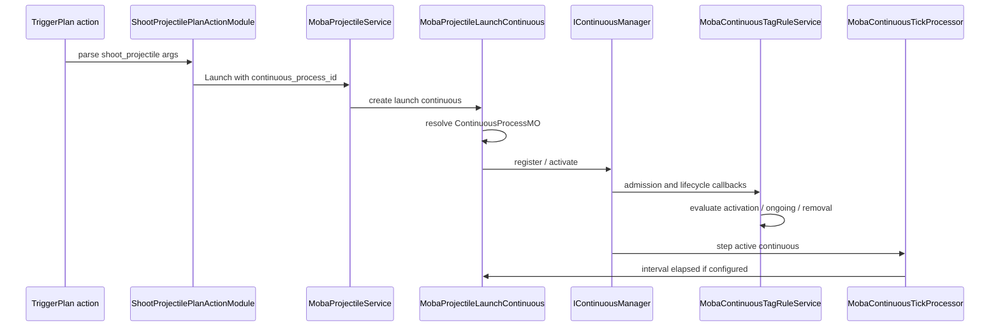
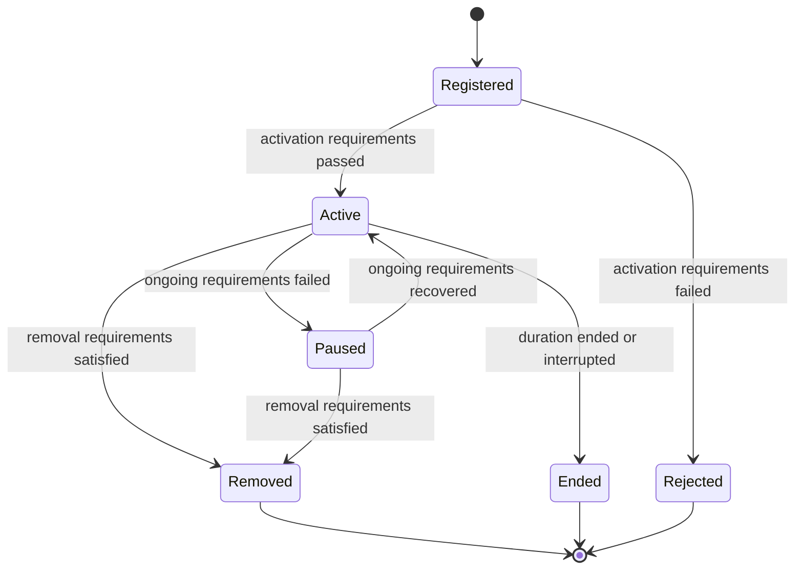

# MOBA 持续行为能力组合设计

> 文档类型：MOBA 项目应用组合深潜
> 事实基线：2026-08-16
>
> 本文说明 MOBA 示例为什么把 stack、periodic、cue、tag、modifier、trigger 等能力拆成可组合能力，而不是照搬 GAS 把它们强制收进一个单体 GameplayEffect 资产。它补充持续行为在强定制项目中的配置边界、生命周期治理、领域行为接入和长期演进规则。

## 1. 能力定位

MOBA 示例中的持续行为不是单独的 Buff 系统，也不是单独的 Projectile 或 Motion 系统，而是一组被 `IContinuous` 生命周期统一治理的运行时对象。

它要解决的问题是：

| 问题 | 设计回答 |
|------|----------|
| 位移、发射子弹、召唤物、光环、被动 tick 是否都需要生命周期 | 需要，但不要求都变成 Buff |
| stack、periodic、cue、tag、modifier 是否都应放进同一个配置资产 | 不强制；它们是可组合能力 |
| 公共生命周期是否统一 | 统一由 `IContinuousManager`、tag rule、lifecycle binder、tick processor 管理 |
| 领域语义是否保留 | 保留；Buff 仍是 Buff，Projectile launch 仍是 Projectile launch，Motion 仍进入 motion pipeline 仲裁 |
| 项目定制如何落地 | 通过领域 runtime 组合公共能力，而不是扩展一个万能效果类型 |

这套模型可以概括为：公共持续生命周期集中治理，领域行为按需组合能力。

## 2. 解决的问题

### 2.1 避免万能效果资产膨胀

GAS 的 GameplayEffect 很强，因为它把 duration、stack、modifier、periodic、cue、tag requirements 等能力收敛到同一个标准资产。这个模型适合需要强标准化工具链的 Unreal 项目，但在 AbilityKit 的 MOBA 示例里，所有持续行为并不共享同一种业务语义。

例如：

| 持续行为 | 核心语义 | 不适合被强行 Buff 化的原因 |
|----------|----------|----------------------------|
| Buff | 对单位施加状态、叠层、周期效果、表现提示 | 本来就是状态型持续效果 |
| 位移/击退/牵引 | 移动源、优先级、互斥、位置碰撞监听 | 必须进入 motion pipeline 做位移仲裁 |
| 发射子弹 | 发射序列、弹体配置、发射源上下文 | Projectile 物理和命中仍属于 projectile 领域 |
| 召唤物 | 生成实体、绑定生命周期、死亡清理 | 生成物是 actor/entity 生命周期问题 |
| 光环/被动 tick | owner-bound 触发、周期执行、门控 | 更接近 trigger interval 或 owner-bound runtime |

如果把这些全部强制变成一个“大 Buff/大 GameplayEffect”，配置表会失去领域可读性，业务规则也会被迫塞进通用字段。

### 2.2 保持数据和行为分离

当前设计把配置拆成两类：

| 配置类型 | 内容 | 示例 |
|----------|------|------|
| 公共持续过程配置 | duration、interval、tag requirements、modifiers、trigger ids、owner-bound triggers | `ContinuousProcessMO` |
| 领域配置 | projectile 物理、launcher 发射模式、motion 参数、buff 叠层策略、summon actor 配置 | `ProjectileMO`、`ProjectileLauncherMO`、Buff 配置、Motion 配置 |

这样做的结果是：

1. 生命周期策略可以统一复用；
2. 领域参数不会被通用持续表污染；
3. 同一个领域行为可以选择是否接入 tag、modifier、periodic、cue；
4. 后续项目可以扩展领域配置，而不需要修改通用 continuous 核心。

## 3. 源码入口

| 主题 | 源码 |
|------|------|
| Continuous manager | `Unity/Packages/com.abilitykit.core/Runtime/Continuous/DefaultContinuousManager.cs` |
| MOBA continuous config base | `Unity/Packages/com.abilitykit.demo.moba.runtime/Runtime/Application/Services/Continuous/MobaContinuousConfigBase.cs` |
| Tag rule service | `Unity/Packages/com.abilitykit.demo.moba.runtime/Runtime/Application/Services/Continuous/MobaContinuousTagRuleService.cs` |
| Effective tag query | `Unity/Packages/com.abilitykit.demo.moba.runtime/Runtime/Application/Services/Continuous/MobaEffectiveTagQueryService.cs` |
| Tag rule evaluator | `Unity/Packages/com.abilitykit.demo.moba.runtime/Runtime/Application/Services/Continuous/MobaContinuousTagRuleEvaluator.cs` |
| Lifecycle binder | `Unity/Packages/com.abilitykit.demo.moba.runtime/Runtime/Application/Services/Continuous/MobaContinuousLifecycleBinder.cs` |
| Tick processor | `Unity/Packages/com.abilitykit.demo.moba.runtime/Runtime/Application/Services/Continuous/MobaContinuousTickProcessor.cs` |
| Trigger interval handler | `Unity/Packages/com.abilitykit.demo.moba.runtime/Runtime/Application/Services/Continuous/MobaTriggerIntervalContinuousHandler.cs` |
| Runtime query/view | `Unity/Packages/com.abilitykit.demo.moba.runtime/Runtime/Application/Services/Continuous/MobaContinuousRuntimeQueryService.cs` |
| Buff continuous runtime | `Unity/Packages/com.abilitykit.demo.moba.runtime/Runtime/Application/Services/Buffs/Runtime/BuffContinuousRuntime.cs` |
| Buff stack policy | `Unity/Packages/com.abilitykit.demo.moba.runtime/Runtime/Application/Services/Buffs/Core/BuffStackingPolicyApplier.cs` |
| Buff interval handler | `Unity/Packages/com.abilitykit.demo.moba.runtime/Runtime/Application/Services/Buffs/Runtime/BuffContinuousIntervalHandler.cs` |
| Buff cue reporter | `Unity/Packages/com.abilitykit.demo.moba.runtime/Runtime/Application/Services/Buffs/Presentation/MobaBuffPresentationCueReporter.cs` |
| Presentation cue snapshot | `Unity/Packages/com.abilitykit.demo.moba.runtime/Runtime/Application/Services/Snapshot/MobaPresentationCueSnapshotService.cs` |
| Buff timer rollback | `Unity/Packages/com.abilitykit.demo.moba.runtime/Runtime/Application/Rollback/MobaBuffTimerRollbackProvider.cs` |
| Projectile launch continuous | `Unity/Packages/com.abilitykit.demo.moba.runtime/Runtime/Application/Services/Projectile/Launch/MobaProjectileLaunchContinuous.cs` |
| Projectile service | `Unity/Packages/com.abilitykit.demo.moba.runtime/Runtime/Application/Services/Projectile/MobaProjectileService.cs` |
| ShootProjectile action | `Unity/Packages/com.abilitykit.demo.moba.runtime/Runtime/Application/Services/Triggering/PlanActions/Skill/ShootProjectilePlanActionModule.cs` |
| Continuous process config | `Unity/Packages/com.abilitykit.demo.moba.view.runtime/Resources/moba/continuous_processes.json` |

## 4. 总体结构图

这张图的重点是：公共能力不是某一个领域的私有逻辑，领域 runtime 也不是公共能力的简单数据载体。两者通过 small interface 和生命周期 binder 组合。

## 5. 关键运行流程

以一次带 `continuous_process_id` 的 projectile launch 为例，运行流程如下：

这个流程说明 projectile launch 并没有变成 Buff，也没有绕过持续生命周期。它保留 projectile 领域的发射行为，同时接入 continuous 的 tag、duration、interval、modifier、debug 和 query 能力。

## 6. 生命周期与标签状态机

持续行为的生命周期由 `DefaultContinuousManager` 和 MOBA tag rule 服务共同推进。

关键规则：

| 阶段 | 责任 |
|------|------|
| 注册/激活 | 校验 activation requirements，记录 lifecycle reason |
| Active | application tags 进入 effective tag query，modifier projection 生效 |
| Pause | 从 active 集合移除，modifier 清理，application tags 不再贡献 |
| Resume | 重新进入 active，modifier 重新投射，tag rule 重新解释 |
| Remove/End | 清理 modifier、context、owner-bound trigger 和诊断状态 |

当一个持续行为新增、激活、恢复、结束或移除时，同 owner 下的其他持续行为会被重新解释。这样霸体、免控、沉默、禁用位移、脱战等标签规则不是写死在某个 motion 或 buff 代码里，而是通过持续行为携带的 application tags 和 tag requirements 统一触发生命周期变化。

## 7. stack、periodic、cue 的组合方式

在持续生命周期这一限定范围内，当前 MOBA 实现分别提供 duration、Buff stack、periodic、tag rule、modifier projection、presentation cue 和 owner-bound trigger 接点。其中部分职责与 GAS GameplayEffect 重叠，但这些分散实现不能替代 GameplayEffect、Ability System Component、Replication、Prediction 或编辑器工具链对应的系统能力。

| 能力 | 当前实现落点 | 直接证据 | 领域与能力边界 |
|------|--------------|----------|----------------|
| Duration | `IDurationConfig`、`MobaContinuousConfigBase.DurationSeconds`、`DefaultContinuousManager` | `MobaContinuousLifecycleTests` 覆盖激活、暂停、恢复和结束 | 证明公共生命周期推进，不证明所有领域 runtime 都有完整恢复与网络语义 |
| Stack | `IStackConfig`、`BuffStackingPolicyApplier`、`BuffContinuousRuntime.Refresh` | `BuffStackingPolicyApplierTests` 覆盖 Replace、AddStack、RefreshDuration、IgnoreIfExists 和新建 runtime | 当前直接证据集中在 Buff；不能据此推断任意 continuous 都有统一叠层协议 |
| Periodic | `IMobaContinuousPeriodicConfig`、`MobaContinuousTickProcessor`、领域 interval handler | Buff、Projectile、Motion 和 TriggerInterval runtime 提供 interval 状态或处理入口 | 处理分支存在不等于所有组合都经过配置加载、重入和失败语义验收 |
| Tags | `IMobaContinuousTagConfig`、`MobaContinuousTagRuleService` | `MobaContinuousLifecycleTests` 覆盖 owner active tag 冲突；`MobaPassiveSkillLifecycleServiceTests` 覆盖脱战过程被战斗状态中断 | 当前证据针对生命周期门控，不等于 GAS tag replication 或 prediction contract |
| Modifiers | `IMobaContinuousModifierConfig`、`MobaContinuousLifecycleBinder`、Attribute/SkillParameter projector | Binder 在激活和恢复时投射，在暂停、结束和移除时清理；配置校验区分两类 target | 源码链路存在，但没有一个专项测试同时覆盖配置加载、叠层重投射、清理、恢复和网络状态 |
| Cue | `MobaPresentationCueSnapshotService`、`MobaBuffPresentationCueReporter`、trigger cue | `MobaPresentationCueRuntimeTests` 覆盖 active store、生命周期 helper、codec、复制/预测元数据和 trigger cue | 验证的是 Cue 快照协议与本地运行时；不证明正式 VFX 接线或多客户端一致性 |
| Owner-bound trigger | `MobaTriggerExecutionGateway`、`MobaTriggerPlanSubscriptionService`、被动技能生命周期服务 | `MobaPassiveSkillLifecycleServiceTests` 覆盖独立绑定、移除和冷却门控 | 当前覆盖集中在被动技能场景，不代表所有领域 runtime 已接入同一订阅模板 |

因此，准确结论是这些能力已有独立实现和局部测试证据，但没有被强制打包成一张固定表。项目仍需为每类持续行为明确选择、配置并验收所需能力：

| 领域行为 | 推荐组合 |
|----------|----------|
| 普通 Buff | duration + stack + tags + modifiers + periodic + buff cue |
| 光环 | duration 或 infinite + owner-bound trigger + tags + periodic |
| 位移 | motion config + continuous tags + interruption rules + context/debug |
| 发射子弹 | projectile launcher config + continuous process + interval trigger + context/debug |
| 引导技能 | skill pipeline runtime + tags + modifiers + owner-bound trigger + cue |
| 脱战效果 | trigger interval continuous + tag requirements + interval trigger |

## 8. 和 GAS GameplayEffect 的差异

这里比较的是持续效果的建模方式，不比较两套框架的整体成熟度或功能数量。

| 维度 | GAS GameplayEffect | MOBA continuous capability composition |
|------|--------------------|----------------------------------------|
| 生命周期聚合点 | GameplayEffect 与 Ability System Component 提供标准承载 | `IContinuousManager` 统一生命周期，领域 runtime 保留状态 |
| 配置入口 | GameplayEffect 资产及其标准扩展点 | continuous process、领域配置和 trigger plan 共同组成 |
| 领域行为 | 通过 GE、Execution、MMC、Cue 等标准扩展点表达 | 通过领域 runtime、handler、projector、validator 和 cue reporter 表达 |
| 叠层范围 | GE 提供统一的 stacking 模型 | 当前直接实现和测试集中在 Buff stacking policy |
| Modifier 目标 | Attribute 等能力进入 GAS 标准模型 | 当前 projector 明确支持 Attribute 与 SkillParameter 两类目标 |
| 网络与预测 | 由 GAS/ASC 的复制和预测模型共同约束 | 本文涉及的 continuous 接口本身没有定义整体复制、预测或校正协议 |
| 工具链 | Unreal 资产编辑、调试和网络工具围绕 GAS 集成 | 当前依赖 JSON、validator、runtime view、diagnostic 和项目级模板，覆盖范围需分别核对 |

因此这不是 GAS 的简化复制，也不能按本文列出的局部能力推断两者等价。MOBA 示例采用的是项目级组合模型：公共层统一持续生命周期，各领域自行拥有业务状态和接入验收。

### 8.1 当前自动测试证据

| 测试入口 | 直接覆盖范围 | 本文不据此声明的范围 |
|----------|--------------|----------------------|
| `src/AbilityKit.Demo.Moba.Tests/Continuous/MobaContinuousLifecycleTests.cs` | runtime 和 manager 的激活、暂停、恢复、结束、激活拒绝与 owner tag 冲突 | 领域配置、周期效果、Modifier、Cue 的完整组合 |
| `MobaRollbackProviderTests.BuffStateRecoveryEntry_RestoresCapabilityHandleWithoutClaimingLiveRuntime` | Buff 状态恢复保留 capability handle，同时不恢复 retain/live runtime | Continuous、Modifier、Tag requirement 与订阅自动重建 |
| `src/AbilityKit.Demo.Moba.Tests/Buff/BuffStackingPolicyApplierTests.cs` | Buff 叠层策略、持续时间与 interval 初始值 | 非 Buff runtime 的统一 stack 语义 |
| `src/AbilityKit.Demo.Moba.Tests/Triggering/MobaPresentationCueRuntimeTests.cs` | Cue registry、active store、快照、codec、生命周期 helper 与 trigger cue | 正式表现资源、多客户端播放一致性 |
| `src/AbilityKit.Demo.Moba.Tests/Passive/MobaPassiveSkillLifecycleServiceTests.cs` | 被动技能独立绑定、冷却、移除、持续过程激活与脱战中断 | 任意 owner-bound trigger 的通用组合验收 |

这些测试按职责分散，没有一个专项测试同时覆盖 duration、stack、periodic、tags、modifier、cue 和 owner-bound trigger。本文据此确认的是各接点及其局部行为，不是整套组合已完成端到端验收。2026-08-11 定向执行 `MobaRollbackProviderTests` 5/5 通过；本次文档治理没有重新运行 MOBA 全量测试集。

### 8.2 恢复、回滚与网络边界

`MobaBuffStateRecoveryProvider` 提供 Buff 状态恢复入口。它会恢复 generation-checked `SkillRuntimeHandle` 这一 capability value，但把 context 标记为 `Boundary = Snapshot`、`HasLiveRuntime = false`，并清空 `SkillRuntimeRetainHandle`、`Continuous`、`ModifierBindings` 与 `TagRequirements`。有效 handle 只允许后续在 generation 校验通过时尝试解析能力，不表示恢复载荷持有真实 runtime backing 或生命周期 retain。

预测回滚使用的 `MobaBuffTimerRollbackProvider` 边界更窄：只导出和恢复已有 Buff 的 `Remaining`、`IntervalRemainingSeconds` 与 `StackCount`。它不会重建 Buff 列表，也不恢复上述行为绑定、skill runtime handle 或 Cue active store。

因此，计时器回滚不能作为完整 Continuous 状态回滚的证据，状态恢复中的 capability handle 也不能被解释为 live runtime 已恢复。Presentation Cue 快照带有复制和预测元数据，同样不能单独证明持续行为的 authoritative replication、客户端预测、误差校正和重模拟已经形成统一协议；这些能力必须在同步与预测专题中按具体状态提供者和验收入口分别确认。

## 9. 设计意图与取舍

### 9.1 不强制组合的边界

不强制组合的原因不是为了减少功能，而是为了避免公共抽象吞掉领域边界。

持续行为的共同点是生命周期，而不是业务含义。Buff 的 stack、Projectile 的发射模式、Motion 的位移仲裁、Skill Pipeline 的阶段控制，都是不同层面的领域问题。公共 continuous 只应该负责：

1. 生命周期注册、激活、暂停、恢复、终止；
2. duration 和 interval 推进；
3. tag requirements 判定；
4. modifier 投射和清理；
5. owner-bound trigger 绑定和释放；
6. query/debug/context source 输出。

领域 runtime 负责解释自己的业务：

| 领域 | 自己负责 |
|------|----------|
| Buff | stack policy、refresh、buff stage effect、buff cue |
| Projectile | launch sequence、spawn position、projectile config、hit source context |
| Motion | movement source、priority、互斥、碰撞监听窗口 |
| Skill Pipeline | cast phase、channel、wait condition、pipeline interruption |
| Summon | actor spawn、owner link、death cleanup、snapshot |

### 9.2 什么时候应该接入 continuous

判断标准不是“这个行为持续超过一帧”，而是它是否需要被统一治理。

| 需要接入 | 可以不接入 |
|----------|------------|
| 需要 tag rule 影响生命周期 | 单帧纯数值结算 |
| 需要 modifier 随生命周期应用/清理 | 一次性 projectile hit damage |
| 需要 interval trigger | 单次触发动作 |
| 需要 runtime query/debug/validation | 只在局部函数内完成的临时计算 |
| 需要被 pause/resume/interruption 管理 | 不存在运行时持有状态 |
| 需要绑定 owner-bound trigger 或 context source | 不参与 trace/replay/debug 的纯工具函数 |

## 10. 治理规则

组合式设计的风险是灵活性过高，因此必须用治理规则兜住。

| 规则 | 原因 |
|------|------|
| 公共生命周期只放在 continuous 层 | 避免 Buff、Projectile、Motion 各自实现 pause/resume/remove |
| 领域配置保留在领域表 | 避免 `ContinuousProcessMO` 变成万能业务配置 |
| tag requirements 不写死在领域代码中 | 霸体、沉默、免控、禁位移等应由配置表达 |
| periodic 必须经过统一 tick processor 或明确 handler | 避免多个系统重复 tick 同一个 runtime |
| cue 只输出表现快照 | 逻辑层不直接驱动 UI 或 VFX |
| modifier 必须通过 lifecycle binder 投射和清理 | 避免暂停/移除后残留属性或技能参数修改 |
| 新 runtime 必须提供 query/debug 信息 | 便于 validation、trace、回放和线上诊断 |
| 新配置字段必须进入 validator | 避免配置错误拖到战斗中才暴露 |

## 11. 源码阅读路径

1. `Docs/design/09-ImplementationExamples/MOBA/11-PlanActionsAndContinuousRuntimeDeepDive.md`：PlanAction 如何创建 continuous runtime。
2. `Unity/Packages/com.abilitykit.core/Runtime/Continuous/DefaultContinuousManager.cs`：注册、激活、暂停、恢复、结束的基础语义。
3. `Unity/Packages/com.abilitykit.demo.moba.runtime/Runtime/Application/Services/Continuous/MobaContinuousTagRuleService.cs`：tag 如何影响生命周期。
4. `Unity/Packages/com.abilitykit.demo.moba.runtime/Runtime/Application/Services/Continuous/MobaContinuousTickProcessor.cs`：periodic 如何统一推进。
5. `Unity/Packages/com.abilitykit.demo.moba.runtime/Runtime/Application/Services/Buffs/Runtime/BuffContinuousRuntime.cs` 与 `Unity/Packages/com.abilitykit.demo.moba.runtime/Runtime/Application/Services/Buffs/Core/BuffStackingPolicyApplier.cs`：stack 与 buff 生命周期。
6. `Unity/Packages/com.abilitykit.demo.moba.runtime/Runtime/Application/Services/Projectile/Launch/MobaProjectileLaunchContinuous.cs`：非 Buff 领域如何组合 continuous 能力。
7. `Unity/Packages/com.abilitykit.demo.moba.runtime/Runtime/Application/Services/Snapshot/MobaPresentationCueSnapshotService.cs`：cue 如何从逻辑转成表现快照。
8. `Docs/design/09-ImplementationExamples/MOBA/16-DomainContinuousRuntimeAndTemporaryEntityLifecycle.md`：Motion source、motion.hit、Summon 生命周期与 gameplay trigger 绑定的源码级落地。

## 12. 边界判断

| 容易混淆的判断 | 设计边界 |
|----------------|----------|
| continuous 与 Buff 等价 | Buff 只是 continuous 的一种领域 runtime |
| 所有持续行为都进入 Buff 表 | 只有状态型效果适合 Buff 表，位移、投射物和召唤物应保留领域配置 |
| 能力没有集中到 GAS 形态就是缺失 | 需要逐项核对实现、配置和测试；已有接点按能力组合，但局部存在不代表整体等价或端到端完成 |
| tag 打断属于 motion 私有代码 | motion 行为携带 tag requirements，由 continuous tag rule 统一判定 |
| periodic 只属于 Buff | periodic 是公共 continuous 能力，Buff 只是有自己的 interval handler |
| cue 由逻辑系统直接播放特效 | cue 输出 snapshot，由表现层消费 |
| 组合灵活性可以替代校验 | 强定制项目更需要 validator、模板、debug view 和源码锚点 |

## 13. 和其他模块的关系

| 模块 | 关系 |
|------|------|
| Triggering | PlanAction 创建或刷新领域 runtime，interval/owner-bound trigger 回到 trigger gateway 执行 |
| Buff | 使用 continuous 生命周期承载 duration、stack、periodic、cue、tag、modifier |
| Projectile | 发射过程接入 continuous，但弹体飞行、命中和物理仍归 projectile 领域 |
| Motion | 位移过程可接入 continuous tag/lifecycle，但位移合成、优先级和 motion.hit 触发仍归 motion pipeline 与 Motion 领域服务 |
| Attribute/Skill Param | modifier 通过 projector 投射到属性或技能参数，生命周期由 binder 管理 |
| Presentation | cue 和 snapshot 把逻辑事件转成表现层可消费数据 |
| Validation | 检查 trigger plan、context integrity、continuous runtime 和配置引用 |
| Snapshot/Replay | runtime view、context source、cue snapshot 提供稳定观测面 |
| Domain Runtime Deep Dive | `16-DomainContinuousRuntimeAndTemporaryEntityLifecycle.md` 展开 Motion 与 Summon 的源码链路，避免本文承载过多领域细节 |

## 14. 工程治理边界

组合式设计的长期可维护性依赖以下工程约束：

| 方向 | 治理要求 |
|------|----------|
| 配置模板 | Buff、ProjectileLaunch、Motion、TriggerInterval 分别维护 continuous process 模板 |
| Validator | 校验 continuous process 引用、interval trigger、tag template、modifier projector 是否存在 |
| Debug view | 在 continuous runtime view 中清晰展示 stack、interval、tag rule、modifier source、context source |
| 文档约束 | 新增领域 runtime 时必须说明是否接入 tags、modifiers、periodic、cue、owner-bound trigger |
| 工具链 | 配置导出时标记领域配置与 common continuous config 的引用关系 |
| 测试 | 覆盖 tag rule pause/resume/remove、periodic trigger、modifier cleanup、cue snapshot 的验收用例 |

最终目标不是把 AbilityKit 变成 GAS 的形状，而是保留 AbilityKit 的组合式能力边界：框架提供统一生命周期和通用玩法能力，MOBA 项目按自己的战斗模型决定如何组合。

## 15. 恢复、所有权与证据边界

持续运行时的“可组合”不能弱化跨帧所有权。当前工作区补强了三条闭环：

| 运行时 | 当前所有权要求 | 失败或清理语义 |
|--------|----------------|----------------|
| Buff | 恢复时重新取得 parent skill-runtime child retain | parent runtime 无效时整条恢复项回滚，不留下 Buff、context 或 retain |
| Projectile/launcher | link service 显式持有 projectile/launcher retain | `Unlink`、`Clear`、`Dispose` 都承担兜底释放责任 |
| Summon | spawn 后记录 owner/source/trace，并按需 retain parent runtime | retain 或后置初始化失败时补偿 actor、trace、owner/source tracking 和 retain；`Clear` 释放剩余所有权 |

这些规则属于 MOBA 对通用 `IContinuous` 生命周期的应用编排。公共 Continuous 包可以规定注册、激活、暂停、结束和 manager 索引，但不能推断某个游戏的 Buff 恢复策略、Projectile link 身份或 Summon 事务边界。

2026-08-16 本地 Unity ownership artifact 中相关 fixture 为 9/9；它覆盖 Buff、Projectile、Summon 与 Skill runtime 清理，不等于 stack、periodic、cue、tag、modifier 的完整端到端组合验收。主 MOBA .NET 工程仍因独立的 SpawnArea 严格配置错误得到 279/305，不能写成整体通过。

*文档版本：v3.0 | 最后更新：2026-08-16*
