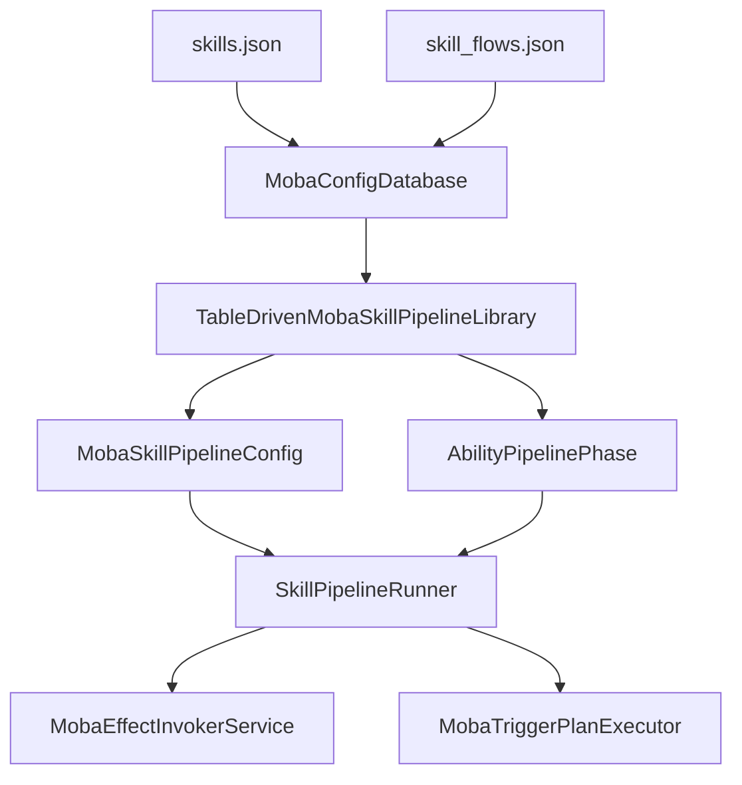
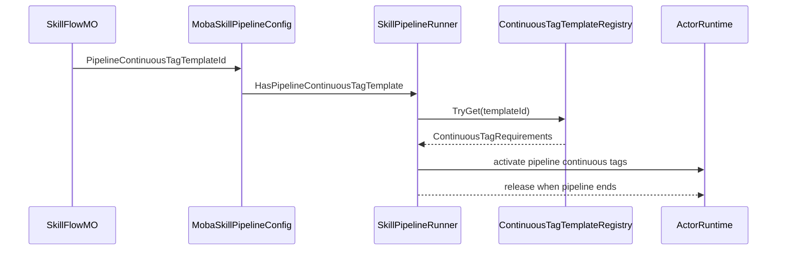

# MOBA 技能 Flow 与 Pipeline 配置设计

> 文档类型：MOBA 项目应用组合深潜
> 事实基线：2026-08-17
>
> 现有 MOBA 文档已经说明技能输入、技能释放和 TriggerPlan 执行，但还缺少一篇专门解释 `skills.json`、`skill_flows.json` 如何被表驱动 Pipeline 消费的文档。本文按源码补齐配置字段、Phase 类型、运行时构建、校验规则和当前配置治理点。

## 1. 能力定位

MOBA 技能释放不是在代码里为每个英雄手写 Pipeline，而是由技能表指向技能 Flow 表：

| 配置 | 关键字段 | 运行时含义 | 源码入口 |
|------|----------|------------|----------|
| `skills.json` | `PreCastFlowId`、`CastFlowId` | 技能是否有预释放 Flow，以及正式释放使用哪个 Flow | `SkillDTO`、`SkillMO` |
| `skill_flows.json` | `PipelineContinuousTagTemplateId`、`Phases` | Pipeline 持续标签模板和 phase 编排 | `SkillFlowDTO`、`SkillFlowMO` |
| `trigger_plans.json` | TriggerPlan actions / conditions | RulePlan phase 和 Timeline effect 最终执行的计划 | `MobaTriggerPlanExecutor`、`MobaEffectExecutionService` |
| `continuous_tag_templates.json` | tag requirements | Pipeline 运行期间持续占用/打断/门禁标签 | `MobaSkillPipelineConfig`、`SkillPipelineRunner` |

截至 2026-08-16，package 权威源中的 `skills.json` 有 26 个技能条目，全部配置了可解析的 `CastFlowId`，且当前值与 skillId 相同；26 个 `PreCastFlowId` 均为 0。这个配置快照说明示例正在使用 cast pipeline，而 precast pipeline 目前只有 DTO、构建分支和引用校验，不能视为已有配置场景验证。

## 2. 从技能表到 Pipeline



运行时链路如下：

1. `MobaConfigDatabase` 加载 `skills.json` 和 `skill_flows.json`，通过 `GetSkillFlow` / `TryGetSkillFlow` 暴露 Flow。
2. `TableDrivenMobaSkillPipelineLibrary.TryGet` 根据 skillId 取 `SkillMO`，再通过 `CastFlowId` 和可选 `PreCastFlowId` 构建 Pipeline 配置。Library 按 skillId 缓存构建结果，但当前不记录 `MobaConfigDatabase.Version`，也不订阅 reload；热重载后必须由应用层显式 Dispose/重建，否则缓存继续持有旧 Flow DTO/MO 与复制的事件数组。
3. `CreatePipelineConfig` 把 `SkillFlowMO.PipelineContinuousTagTemplateId` 包装进 `MobaSkillPipelineConfig`。
4. `BuildFlowDefinitions` 遍历 `SkillFlowMO.Phases`，按 `SkillPhaseType` 转成可实例化的 phase definition。
5. `SkillPipelineRunner` 运行 phase，并在 pipeline 启动时按 `PipelineContinuousTagTemplateId` 激活持续标签模板。

## 3. Phase 类型映射

`SkillPhaseType` 的数字由 DTO 枚举定义。下表先列出构建器可识别的类型；“源码有分支”与“当前配置正在使用”是两个不同结论：

| Type | 名称 | 配置节点 | 运行时 Phase | 说明 |
|------|------|----------|--------------|------|
| 1 | Checks | `Checks` | 不再构建 | 已废弃，校验器报错，建议迁移到 RulePlan conditions |
| 2 | Timeline | `Timeline` | `SkillTimelinePhase` | 按 `AtMs` 执行 effect/trigger，并按 `DurationMs` 完成 phase |
| 3 | Handlers | `Handlers` | 不再构建 | 已废弃，校验器报错，建议迁移到 RulePlan actions |
| 4 | RulePlan | `RulePlan` | `SkillRulePlanPhase` | 即时执行一组 TriggerPlan，可按失败中断技能 |
| 10 | Sequence | `Children` | `AbilitySequencePhase` | 子 phase 顺序执行 |
| 11 | Parallel | `Children` | `AbilityParallelPhase` | 子 phase 并行执行 |
| 12 | Repeat | `Repeat` | `AbilityRepeatPhase` | 重复执行一个显式子 phase |
| 13 | Delay | `Delay` | `AbilityDelayPhase` | 等待固定毫秒数 |
| 14 | WaitUntil | `WaitUntil` | `AbilityWaitUntilPhase` | 等待运行时条件成立或超时 |

截至 2026-08-16，递归统计 `skill_flows.json` 的 26 个 Flow，实际配置为 Timeline 28 个、RulePlan 36 个、Sequence 1 个、WaitUntil 2 个；没有 Checks、Handlers、Parallel、Repeat 或 Delay 节点。配置治理上要注意：

- `Checks` 和 `Handlers` 仍保留在 DTO 中，只用于识别旧结构；`TableDrivenMobaSkillPipelineLibrary` 遇到它们会抛异常，`MobaBattleConfigReferenceValidator` 也会报错。
- Parallel、Repeat 和 Delay 已有构建与校验分支，但当前权威 JSON 没有对应样例，类型存在不能替代配置加载和运行时验收。
- 新配置应使用 `RulePlan` 表达释放条件、资源扣除、提交检查和失败原因，用 `Timeline` 触发按时间编排的效果。

### 3.1 Unity Editor 树形创作

`SkillFlowSO.dataList` 已使用正式树形编辑模型承载运行时 Phase：

- 根节点和 `Sequence`、`Parallel` 子节点的新增菜单支持 `RulePlan`、`Timeline`、`Sequence`、`Parallel`、`Repeat`、`Delay` 和 `WaitUntil`。
- `Repeat` 显式持有唯一子 Phase；组合节点递归导出 `Children`，不会退化为非结构化 JSON 字段。
- 每个节点提供稳定 `PhaseId`，导出时去除首尾空白，为后续运行时节点回跳配置提供稳定键。
- Flow 顶层可编辑并导出 `PipelineContinuousTagTemplateId`。
- `Checks` 编辑类型仅为已有 SerializeReference 资产的反序列化和迁移保留，不再出现在新增菜单中；`Handlers` 没有新的编辑类型。
- `MinValue`、`Required` 和废弃阶段提示用于即时暴露基础结构错误，正式引用完整性仍以 `MobaBattleConfigReferenceValidator` 为权威。

当前采用 Inspector 树而不是 GraphView。这个选择先保证 DTO、运行时构建器和编辑模型同构；Battle Debug 已在这棵正式编辑树上增加运行节点选中、递归展开和高亮，后续即使增加节点画布也不应再复制一套技能数据模型。

Battle Debug 已增加统一配置源索引和 `Open Config`：Skill Runtime、Event、Trace、Buff、Projectile 与 Area 面板通过类型化引用定位 `Resources/moba` 或 `Resources/ability` 下的权威 JSON 条目。索引使用 JSON Token 行号而不是文本搜索，TriggerPlan 按 `Triggers/TriggerId` 查找，SkillFlow 还支持在指定 Flow 内递归查找稳定 `PhaseId`。SkillFlow 索引校验通过后会选中正式 `SkillFlowSO` 资产并展开对应编辑节点；缺失条目不会退回同号或相似文本结果。

Cast Pipeline 的正式 Phase 事件会在阶段 Trace 容器下生成真实 Phase 子节点，并将 `SkillId`、`CastFlowId`、`PhaseId` 写入 Trace DTO、ReadStore 和离线 Artifact。编辑器按 `SkillId -> CastFlowId -> PhaseId` 稳定身份直接定位 Inspector 树节点，不从 Summary 或 EndReason 解析字符串。PreCast 在启用独立 Flow 契约前不写入 CastFlowId，避免错误跳转到 Cast 配置。

## 4. Timeline Phase

`Timeline` 是当前大多数技能的主路径。配置示例：

```json
{
  "Type": 2,
  "Timeline": {
    "DurationMs": 650,
    "Events": [
      { "AtMs": 0, "EffectId": 10010101, "ExecuteMode": 0, "EventTag": "lp_skill_1_cast" }
    ]
  }
}
```

运行规则：

| 字段 | 运行时含义 |
|------|------------|
| `DurationMs` | phase 持续时间；大于 0 时达到该时间后完成 |
| `Events[].AtMs` | phase 进入后第几毫秒触发 |
| `Events[].EffectId` | 实际会作为 TriggerPlan/effect ID 执行，校验器要求能在 TriggerPlan 库找到 |
| `Events[].ExecuteMode` | 当前只支持 `EffectExecuteMode.InternalOnly`，非 0 会抛异常 |
| `Events[].EventTag` | 配置可读性和诊断标签，当前 `SkillTimelinePhase` 不以它驱动逻辑 |

`SkillTimelinePhase` 在 `OnEnter` 重置 Q32.32 `_elapsedRaw` 和 `_nextEventIndex`，在 `OnUpdate` 中按 raw 时间推进事件。每个事件通过 `MobaEffectInvokerService.Execute(effectId, context)` 进入后续 effect/TriggerPlan 链路。定点累计只约束 phase 内的时间加法，不会自动使 DTO 顺序、handler、Effect 副作用或跨端结果确定。

事件按 `Events` 数组顺序消费，校验器没有强制 `AtMs` 升序；如果配置把较晚事件放在前面，尚未到期的前项会阻塞后项更早时间的事件。运行时也没有通用的部分 effect 回滚：只有 effect 成功后才递增 `_nextEventIndex`，effect 已产生的外部副作用仍由领域服务自行补偿。

## 5. RulePlan Phase

`RulePlan` 用来在技能 Flow 内直接执行一组 TriggerPlan，适合表达释放门禁、提交检查、资源消耗或多段技能前置规则。廉颇三技能目前在 Timeline 前有两个 RulePlan phase：

```json
{
  "Type": 4,
  "RulePlan": {
    "TriggerIds": [900101011],
    "AbortOnFailure": true,
    "FailReason": "skill_release_failed"
  }
}
```

运行规则：

| 字段 | 运行时含义 |
|------|------------|
| `TriggerIds` | 逐个调用 `MobaTriggerPlanExecutor.ExecuteRulePlan(triggerId, context)` |
| `AbortOnFailure` | 任一计划失败时是否中断当前技能 Flow |
| `FailReason` | 中断时写入 `SkillPipelineContext.FailReason` |

与 `Timeline` 不同，`RulePlan` 是即时 phase，不等待时间流逝。它和普通 owner-bound trigger 不同：RulePlan phase 的 payload 是当前 `SkillPipelineContext`，执行发生在技能 Pipeline 内部。

## 6. Sequence 与 WaitUntil

廉颇三技能展示了复合 phase 的设计：先执行释放/提交 RulePlan，再进入一个 `Sequence`，其中每段 Timeline 后插入 `WaitUntil`：

```json
{
  "Type": 14,
  "PhaseId": "lp_skill_3_wait_after_stage_1",
  "WaitUntil": {
    "Condition": "ObservedSlotsIdle",
    "TimeoutMs": 0,
    "CompleteOnTimeout": true,
    "ObservedSlots": [1, 2]
  }
}
```

`ObservedSlotsIdle` 是当前唯一支持的 WaitUntil 条件。运行时会解析 `SkillCastCoordinator`，检查同一 caster 的 `ObservedSlots` 是否还有运行中的技能：

- `ObservedSlots` 为空时直接视为满足。
- slot 小于等于 0 或等于当前技能 slot 时忽略。
- 任一被观察 slot 仍在运行，则 WaitUntil 继续等待。
- `TimeoutMs` 为 0 会被转换为 `-1f`，表示不使用超时完成逻辑。

这个机制适合多段大招：既允许一段技能内部按顺序推进，又能等待其他槽位释放结束，避免互相覆盖关键动作窗口。

## 7. Pipeline 持续标签模板

`PipelineContinuousTagTemplateId` 位于 `SkillFlowDTO` 上，而不是单个 phase 上。它的语义是“整个技能 Pipeline 运行期间需要绑定的持续 tag requirements”。

当前廉颇 1/2/3 技能都配置了 `10010001`，运行时路径是：



设计上它解决的是技能 Pipeline 级别的占用、霸体、不可打断、施法状态等持续状态，不适合塞到单个 Timeline event 里临时处理。单个效果触发仍应由 Timeline/RulePlan 进入 TriggerPlan。

## 8. 配置校验与当前边界

`MobaBattleConfigReferenceValidator` 对 skill flow 做了静态引用和结构校验：

| 校验点 | 结果 |
|--------|------|
| `CastFlowId` | 必须引用存在的 SkillFlow |
| `PreCastFlowId` | 大于 0 时必须引用存在的 SkillFlow |
| `PipelineContinuousTagTemplateId` | 大于 0 时必须引用存在的 ContinuousTagTemplate |
| `Timeline.Events[].EffectId` | 必须引用存在的 TriggerPlan |
| `RulePlan.TriggerIds` | 必须引用存在的 TriggerPlan |
| `Checks` / `Handlers` | 明确报错，提示迁移到 RulePlan |
| `Repeat` / `Delay` / `WaitUntil` | 校验必需字段和非负时间 |

赵云和墨子曾使用的 `Type: 1` Checks 已迁移；当前 `skill_flows.json` 中没有 Checks 或 Handlers。废弃门禁仍应保留，防止旧资产或手工 JSON 再次进入运行时：

- 校验器对 Checks 报告 `checks skill phase is deprecated; use RulePlan trigger conditions instead.`；
- Pipeline 构建器遇到 Checks 直接抛出 `Skill Checks phase is deprecated. Use RulePlan trigger conditions instead.`；
- Handlers 具有对应的校验错误和构建异常。

当前仍有三项需要独立验证：

1. PreCast 构建分支没有权威配置样例，不能只根据 `PreCastFlowId` 字段和源码分支认定可用。
2. Parallel、Repeat 和 Delay 没有进入当前 `skill_flows.json`，新增配置时应补充加载、构建、推进和失败语义测试。
3. `MobaBattleConfigReferenceValidator` 能检查引用与基础结构，但不能替代技能时序、资源提交原子性和领域效果结果的场景验收。

校验器当前没有把 `ExecuteMode == InternalOnly`、`AtMs <= DurationMs`、PhaseId 唯一/稳定性和未知 phase 类型全部提升为错误；未知类型、空 Composite phase 等情况可能先作为 warning，随后在运行时 builder 抛异常。`Prewarm`/`PrewarmAll` 也不捕获 build exception，坏 Flow 会中止整批预热，返回的 failed 计数只覆盖返回 false 的情况。

### 8.1 自动测试证据

| 测试 | 直接覆盖 | 未覆盖 |
|---|---|---|
| `MobaSkillConfigurationContractTests` | 技能资源契约、负消耗门禁、非零消耗技能的 release/commit 要求、冻结配置快照 | 当前 26 个 Flow 的逐项时序和效果结果 |
| `MobaSkillPipelinePrewarmTests` | 已加载技能的 Pipeline 预热、缺失技能诊断、缓存读取 | PreCast 以及 Parallel、Repeat、Delay 的运行语义 |
| `SkillCommitAtomicityTests` | commit 失败时资源、冷却回滚 | 任意 TriggerPlan action 的通用事务回滚 |

这些测试类存在于 .NET 测试工程中。2026-08-16 的实际主工程结果为 279/305：26 项并非 Pipeline phase 构建错误，而是 trigger `10060201 / action[2]` 的 SpawnArea `duration_ms=300 < delay_ms=400` 被 BootstrapStrict 拒绝。该事实同时说明“26 个 Skill/Flow 都可解析”和“完整 World 可启动”是两个不同证据层级。

## 9. 与其他文档的关系

| 文档 | 关系 |
|------|------|
| `05-SkillExecutionDeepDive.md` | 说明输入、技能槽、释放策略和 runner 生命周期；本文补充配置如何变成 phase |
| `10-TriggerValidationPresentationDeepDive.md` | 说明 TriggerGateway、Validation 和 Presentation Cue；本文聚焦 Pipeline 内 RulePlan phase |
| `11-PlanActionsAndContinuousRuntimeDeepDive.md` | 说明 PlanAction DSL 和 Continuous runtime；本文说明 Timeline/RulePlan 如何进入这些能力 |
| `14-HeroSkillFormalDesign.md` | 说明六英雄技能需求映射；本文解释这些技能配置的 Flow 编排结构 |
| `17-ActivePassiveBuffProjectileAoeTriggerEffects.md` | 说明主动/被动/Buff/Projectile/AOE 触发效果链路；本文补足主动技能触发前的 Flow 配置层 |

## 10. 源码阅读路径

1. `Unity/Packages/com.abilitykit.demo.moba.view.runtime/Resources/moba/skills.json`：技能到 `CastFlowId` / `PreCastFlowId` 的绑定。
2. `Unity/Packages/com.abilitykit.demo.moba.view.runtime/Resources/moba/skill_flows.json`：Flow phase 编排、Timeline、RulePlan、Sequence、WaitUntil 示例。
3. `Unity/Packages/com.abilitykit.demo.moba.share/Runtime/Game/Config/Dto/SkillDtos.cs`：DTO 字段和 `SkillPhaseType` 数字映射。
4. `Unity/Packages/com.abilitykit.demo.moba.runtime/Runtime/Infrastructure/Config/BattleDemo/MO/SkillFlowMO.cs`：DTO 到运行时 MO 的轻量封装。
5. `Unity/Packages/com.abilitykit.demo.moba.runtime/Runtime/Application/Services/Skill/Pipeline/TableDrivenMobaSkillPipelineLibrary.cs`：表驱动 Pipeline 构建核心。
6. `Unity/Packages/com.abilitykit.demo.moba.runtime/Runtime/Application/Services/Skill/Phases/SkillTimelinePhase.cs`：Timeline event 如何按时间执行。
7. `Unity/Packages/com.abilitykit.demo.moba.runtime/Runtime/Application/Services/Skill/Phases/SkillRulePlanPhase.cs`：RulePlan phase 如何执行和中断。
8. `Unity/Packages/com.abilitykit.demo.moba.runtime/Runtime/Application/Services/Validation/MobaBattleConfigReferenceValidator.cs`：配置引用与废弃 phase 校验。
9. `Unity/Packages/com.abilitykit.demo.moba.editor/Editor/BattleDebug/Configuration/BattleDebugConfigSourceIndex.cs`：运行时配置引用到权威 JSON 条目与行号的编辑器索引。

## 11. 应用层边界

通用 Pipeline 包负责 run、phase、sequence/parallel/repeat/delay/wait-until 等执行原语；`TableDrivenMobaSkillPipelineLibrary`、`SkillFlowDTO/MO` 字段、Timeline effect 解释、RulePlan 失败策略、continuous tag template 和废弃 phase 迁移规则都属于 MOBA 项目应用层。别的游戏可以采用动画图、行为树、脚本字节码或服务器生成计划，框架不能把这份 SkillFlow schema 设为唯一开箱格式。

权威配置源位于 `com.abilitykit.demo.moba.view.runtime/Resources`，Console 配置是宿主副本。文档、Editor 索引、导出工具和测试必须共同维护“一个权威源、多消费者”，不能恢复 Unity Assets/package 双根，也不能把 `bin` 输出当成源文件。

View Runtime `174/174`（2026-08-17）、Host 6/6、Acceptance 8/8 是独立工程证据；本地 Unity ownership 9/9 不覆盖 Phase 类型矩阵。Parallel、Repeat、Delay 和 PreCast 仍只有实现/校验分支，没有当前权威 JSON 场景与端到端验收。

*文档版本：v3.1 | 最后更新：2026-08-17*
