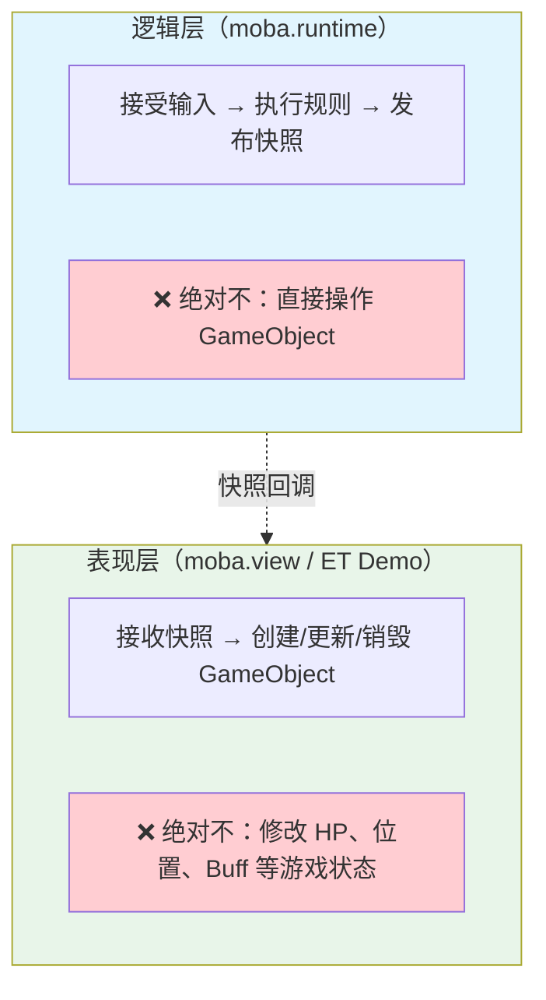
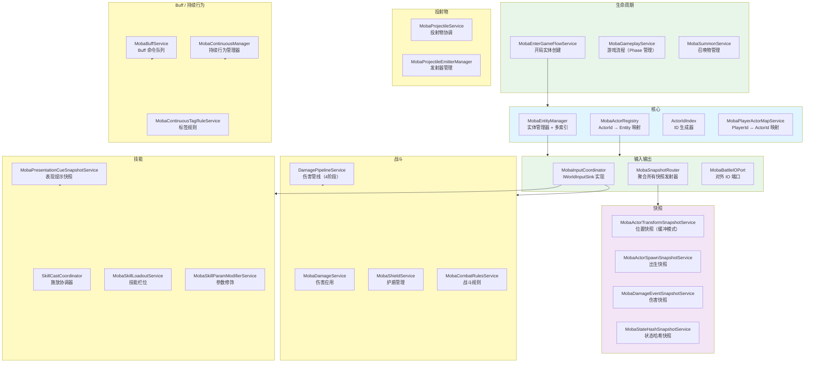
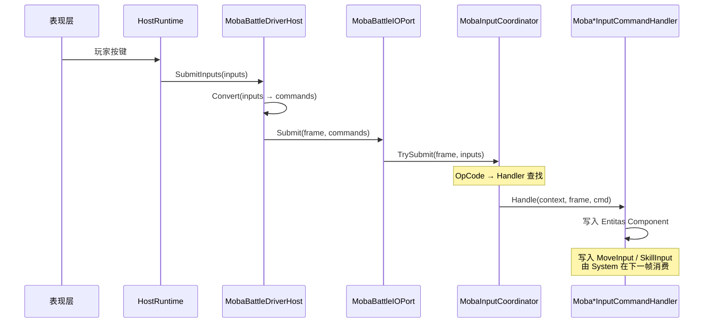
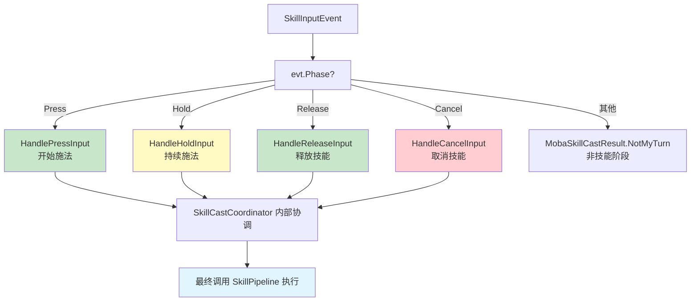
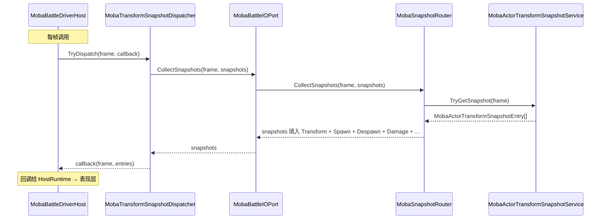
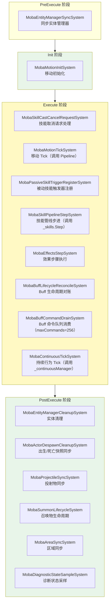
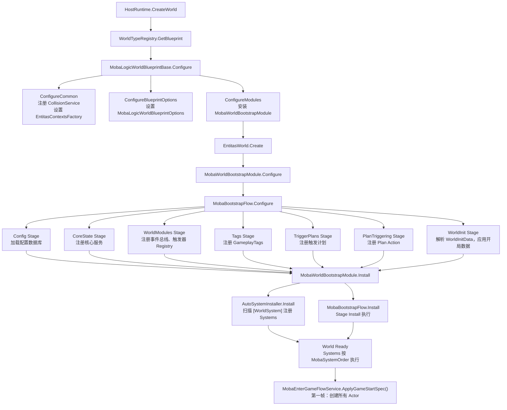
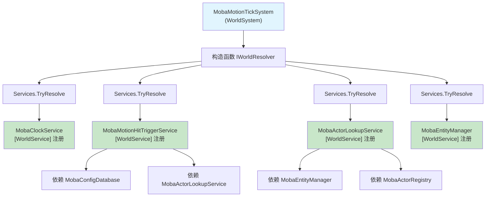
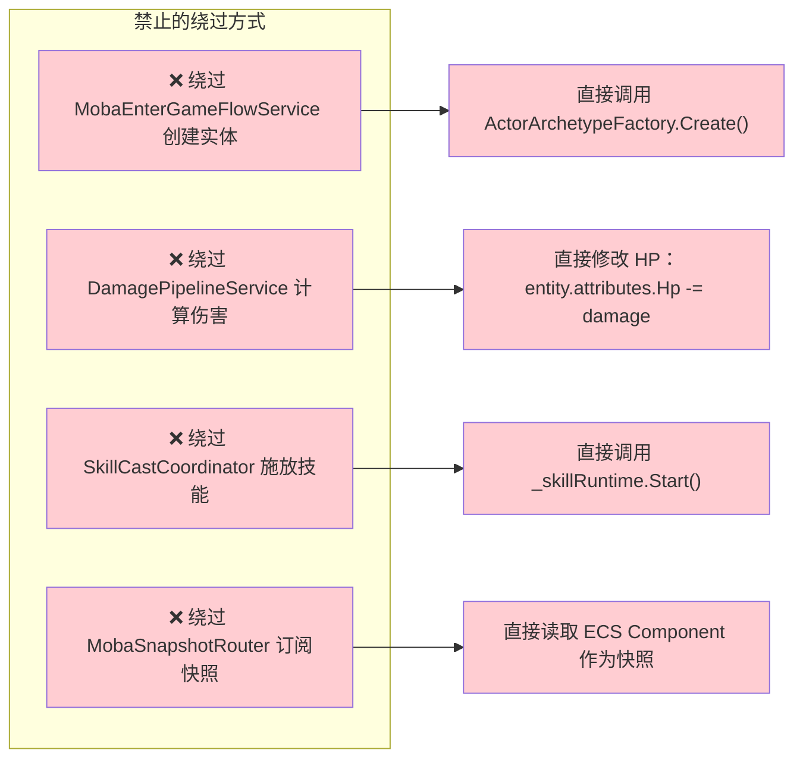

# MOBA Runtime 战斗逻辑层设计：职责边界、输入输出、System/Service 拆分与单元测试

> 文档类型：MOBA 项目应用组合深潜
> 事实基线：2026-08-16
>
> 本文以 moba.runtime 源码为准，系统性解释逻辑世界的内部结构：职责边界、输入流入 ECS Component 的路径、快照流出到表现层的方式、System 与 Service 的分工规则、世界级 DI 的注册体系，以及用轻量测试环境做单元测试的方法。阅读本文的前提是已理解 ECS 基本概念（Entity、Component、System）和 World 是什么。如果只关心"怎么用"，可以直接跳到第五节和第六节。
>
> 关联文档：本文与 [12-DI 与 System/Service 协作深潜](./12-DIAndSystemServiceCollaborationDeepDive.md) 是互补关系——后者侧重 DI 机制和协作模式，本文侧重逻辑层的职责边界、输入输出链路和测试策略。

---

## 1. 设计目标与能力定位

moba.runtime 包是 AbilityKit 中游戏逻辑最集中的层。接入方看到的只是一个 World 实例：调用 `Submit` 提交输入，通过快照回调接收结果——但 World 内部由几十个 Service 和 System 组成，它们之间有明确的分工规则和依赖关系。

**moba.runtime 解决的六个核心问题：**

| 维度 | 核心问题 | moba.runtime 的答案 |
|---|---|---|
| **L1 职责边界** | 逻辑层和表现层的边界在哪里 | 逻辑层执行当前示例已接入的游戏规则，表现层消费逻辑事实并负责渲染和反馈 |
| **L2 输入管理** | 玩家输入怎么流入 ECS 世界 | `IWorldInputSink` → `MobaInputCoordinator` → Entitas Component |
| **L3 输出管理** | 游戏状态怎么流出到表现层 | `MobaSnapshotRouter` → 多个 `MobaSnapshotEmitter` → 回调 |
| **L4 System vs Service** | 哪些逻辑放 System，哪些放 Service | System 管帧驱动（Tick），Service 管跨帧状态和单次操作 |
| **L5 DI 体系** | 依赖注入在这里怎么用 | `[WorldService]` 特性 + 扫描注册，三种生命周期 |
| **L6 单元测试** | 怎么测试逻辑层代码 | `MobaRuntimeTestEnvironment` + `BattleTestScript` |

---

## 2. 解决的问题与非目标

### 2.1 moba.runtime 负责什么

moba.runtime 是当前 MOBA 示例的规则执行层。对于已经接入该 World 的 Actor、技能、Buff、Projectile、Damage、Gameplay 和 Snapshot 状态，它持有逻辑侧事实并负责：

- 接受输入，计算结果，修改逻辑状态
- 维护已接入实体的创建、移动和销毁流程
- 执行当前配置和领域服务支持的技能、Buff、投射物与伤害规则
- 发布伤害、死亡、技能开始等逻辑事件
- 推进逻辑时钟并生成快照

这里的“逻辑侧事实”不等于全局服务端权威。World 可以运行在 Console、Unity 客户端或服务端宿主中；最终 authority、输入确认、复制和故障恢复由 Host、Coordinator 与具体网络模式共同决定。新增玩法规则也不会自动进入 runtime，仍需完成配置、Service/System 装配、校验和测试。

### 2.2 moba.runtime 不负责什么

- 直接操作 GameObject（这是表现层的职责）
- 网络传输（由 Host / Coordinator 处理）
- 持久化存储（由外部系统处理）
- UI 渲染（由表现层处理）

### 2.3 边界图



---

## 3. 源码入口

| 类型 | 源码 | 说明 |
|---|---|---|
| Service 自动注册模块 | `Application/Systems/Bootstrap/MobaServicesAutoModule.cs` | 按命名空间批量注册 Service |
| 世界引导模块 | `Application/Systems/MobaWorldBootstrapModule.cs` | 进入 Flow Bootstrap 并安装 System |
| System 顺序定义 | `Application/Systems/MobaSystemOrder.cs` | 规定 System 执行顺序 |
| System 协作辅助 | `Application/Systems/MobaWorldSystemExecution.cs` | 统一 Resolve / Warn / Require / HandleException |
| 服务基类 | `Application/Services/Templates/GameServiceBase.cs` | 统一日志、生命周期、resolver 持有和事件发布 |
| 技能调度 System | `Application/Systems/Skill/MobaSkillPipelineStepSystem.cs` | 遍历实体并调用 `SkillCastCoordinator.Step()` |
| 技能协调 Service | `Application/Services/Skill/Cast/SkillCastCoordinator.cs` | 处理技能输入、释放准备、策略、runner 生命周期 |
| Buff 调度 System | `Application/Systems/Buffs/MobaBuffCommandDrainSystem.cs` | 触发 `MobaBuffService.DrainPending()` |
| Buff Service | `Application/Services/Buffs/MobaBuffService.cs` | 维护命令队列、生命周期执行器、重入保护、诊断和异常 |
| 玩法 Tick System | `Application/Gameplay/Systems/MobaGameplayTickSystem.cs` | 读取时钟和运行门禁，驱动玩法服务 Tick |
| 玩法 Service | `Application/Gameplay/Core/MobaGameplayService.cs` | 维护玩法阶段、配置解析、触发绑定和生命周期事件 |
| 进场流程 Service | `Application/Services/Lifecycle/MobaEnterGameFlowService.cs` | 处理开局校验、Actor 生成、玩家映射、索引注册和 gameplay 启动 |
| 移动 Tick System | `Application/Systems/Motion/MobaMotionTickSystem.cs` | 移动管线 Tick，含 ECS 组件写回（例外边界） |
| 快照路由 | `Application/Services/Snapshot/MobaSnapshotRouter.cs` | 聚合所有快照发射器，实现 `IWorldStateSnapshotProvider` |
| 输入协调 | `Application/Services/Input/MobaInputCoordinator.cs` | 实现 `IWorldInputSink`，OpCode → Handler 路由 |
| 伤害管线 | `Application/Services/Combat/Damage/DamagePipelineService.cs` | 4 阶段伤害计算 |
| 测试环境 | `Testing/MobaRuntimeTestEnvironment.cs` | 聚合测试所需组件 |
| 测试脚本运行器 | `Testing/BattleTestScriptRunner.cs` | 脚本化多帧测试 |

---

## 4. 总体结构图

moba.runtime 内部按功能分为八个子域：



---

## 5. 关键运行流程

### 5.1 单一入口原则

moba.runtime 有三个必须经过的单一入口：

| 入口 | 位置 | 禁止的绕过方式 |
|---|---|---|
| **实体创建** | `MobaEnterGameFlowService.ApplyGameStartSpec()` | 直接调用 `ActorArchetypeFactory.Create()` |
| **伤害计算** | `DamagePipelineService.Execute()` | 直接修改 HP 属性 |
| **技能施放** | `SkillCastCoordinator.TryCastBySlot()` | 直接调用 `MobaBuffService.ApplyBuffImmediate()` |

这个原则的验证方法是 grep 源码——如果找到了绕过这些入口的代码，就说明违反了设计。

### 5.2 输入管理：从按键到 ECS Component

#### 5.2.1 入口：IWorldInputSink

表现层调用 `IWorldInputSink.Submit()` 将玩家输入送入逻辑层。这是逻辑层唯一的输入接收口：

```csharp
public interface IWorldInputSink
{
    void Submit(FrameIndex frame, PlayerInputCommand[] commands);
}
```

在 moba.runtime 中，这个接口由 `MobaInputCoordinator` 实现：

```csharp
public sealed class MobaInputCoordinator : LogicWorldInputCoordinatorBase<MobaInputCommandContext>, IWorldInputSink
{
    public void Submit(FrameIndex frame, PlayerInputCommand[] commands)
    {
        // 不在这里处理逻辑，只路由
    }
}
```

#### 5.2.2 OpCode → Handler 路由

输入命令是扁平数组，每条命令有一个 OpCode。`MobaInputCommandContractRegistry` 维护 OpCode → Handler 的映射：

```csharp
public static MobaInputCommandContractRegistry CreateDefault()
{
    var registry = new MobaInputCommandContractRegistry();
    registry.Require(MobaOpCodes.Input.Move, typeof(MobaMoveInputCommandHandler), "Move");
    registry.Require(MobaOpCodes.Input.SkillInput, typeof(MobaSkillInputCommandHandler), "SkillInput");
    registry.Require(MobaOpCodes.Input.DebugSpawnUnit, typeof(MobaDebugSpawnUnitInputCommandHandler), "DebugSpawnUnit");
    registry.Require(MobaOpCodes.Input.DebugReplaceHero, typeof(MobaDebugReplaceHeroInputCommandHandler), "DebugReplaceHero");
    return registry;
}
```

这个注册表是**可扩展的**：新增一个命令只需要注册新的 Handler，不需要修改 `MobaInputCoordinator`。

#### 5.2.3 完整路由链路



#### 5.2.4 Move 命令：写入 Component 由 System 消费

Move Handler 不直接修改 Transform，而是写入一个 Component：

```csharp
public void Handle(LogicWorldCommandContext context, FrameIndex frame, PlayerInputCommand cmd)
{
    var move = cmd.Payload.Deserialize<MoveInputPayload>();
    if (!context.TryGetEntity(cmd.ActorId, out var entity))
        return; // 单位不存在，拒绝

    // 写入 MoveInput Component（Entitas Component）
    entity.AddMoveInput(move.TargetX, move.TargetY, frame);
}
```

写入 Component 而不是直接修改 Transform，是 ECS 的基本原则：**数据读写分离**。`MobaMotionTickSystem` 在下一帧读取 `MoveInput` Component，计算出新的 Transform 并回写：

```csharp
// MobaMotionTickSystem.OnExecute
protected override void OnExecute()
{
    var entities = _group.GetEntities(); // hasMotion + hasTransform + hasActorId
    for (int i = 0; i < entities.Length; i++)
    {
        var e = entities[i];
        var m = e.motion;
        var t = e.transform.Value;

        // 读取 MoveInput Component，计算新 Transform
        var state = m.State;
        state.Position = t.Position;
        var result = m.Pipeline.Tick(e.actorId.Value, ref state, dt, ref output);

        // 回写 Transform Component
        e.ReplaceTransform(new Transform3(state.Position, newRot, t.Scale));
    }
}
```

#### 5.2.5 Skill 命令：多阶段处理

Skill 命令比 Move 复杂，因为它有 Press / Hold / Release / Cancel 四个阶段：



### 5.3 输出管理：快照路由

#### 5.3.1 唯一的输出端口：MobaSnapshotRouter

逻辑层不主动推送数据，表现层通过轮询或回调获取快照。`MobaSnapshotRouter` 是所有快照发射器的聚合器：

```csharp
public sealed class MobaSnapshotRouter : ..., IWorldStateSnapshotProvider
{
    private readonly List<IMobaSnapshotEmitter> _emitters;

    public bool TryGetSnapshot(FrameIndex frame, out WorldStateSnapshot snapshot)
    {
        foreach (var emitter in _emitters)
        {
            if (emitter.TryGetSnapshot(frame, out snapshot))
                return true;
        }
        snapshot = default;
        return false;
    }
}
```

#### 5.3.2 快照发射器的注册

所有快照发射器通过 `[MobaSnapshotEmitter]` 特性标记，由 `MobaSnapshotEmitterRegistry` 扫描注册：

```csharp
[MobaSnapshotEmitter(opcode: 80, priority: 100)]
public sealed class MobaActorTransformSnapshotService : ..., IMobaSnapshotEmitter
{
    // 实现 TryGetSnapshot
}
```

注册表按 OpCode 和优先级组织：

| OpCode | 发射器 | 类型 |
|---|---|---|
| 80 | `MobaActorTransformSnapshotService` | 位置快照（缓冲模式） |
| ~ | `MobaActorSpawnSnapshotService` | 出生快照 |
| ~ | `MobaActorDespawnSnapshotService` | 死亡快照 |
| ~ | `MobaDamageEventSnapshotService` | 伤害事件快照 |
| ~ | `MobaSkillStateSnapshotService` | 技能状态快照 |
| ~ | `MobaStateHashSnapshotService` | 状态哈希快照 |
| ~ | `MobaPresentationCueSnapshotService` | 表现提示快照 |
| ~ | `MobaProjectileEventSnapshotService` | 投射物快照 |
| ~ | `MobaAreaEventSnapshotService` | 区域事件快照 |

#### 5.3.3 快照获取链路



#### 5.3.4 快照的两种模式

快照发射器有两种工作模式：

| 模式 | 基类 | 特点 | 用途 |
|---|---|---|---|
| **缓冲模式** | `LogicWorldSnapshotBufferEmitterBase<T>` | 按帧缓冲，`Add()` 积累，`TryGetSnapshot` 消费 | 伤害事件、技能状态（事件型快照） |
| **立即模式** | `LogicWorldSnapshotEmitterBase<T>` | 每次查询实时构建 | 位置快照（数据型快照） |

缓冲模式的典型用法：

```csharp
public void ReportDamage(FrameIndex frame, in DamageReport report)
{
    Add(new MobaDamageEventSnapshotEntry(in report));
}

// 由 MobaDamageService.ApplyDamage 内部调用
// 帧末 MobaSnapshotRouter.CollectSnapshots 时一次性取出
```

---

## 6. 生命周期或状态机

### 6.1 System 的执行顺序

所有 System 通过 `[WorldSystem(order: MobaSystemOrder.*)]` 声明执行顺序：



### 6.2 启动链路：从 World 创建到第一帧

理解完整的启动链路，有助于在调试时定位问题。



**Bootstrap Stage 顺序：**

| Stage | 时机 | 做什么 |
|---|---|---|
| **Config** | Configure | 反序列化配置 DTO，构建 `MobaConfigDatabase` |
| **CoreState** | Configure | 注册核心状态 Service，初始化确定性 RNG |
| **WorldModules** | Configure | 注册 Entitas Contexts、事件总线、触发器 Registry |
| **Tags** | Configure | 加载 GameplayTags 数据 |
| **TriggerPlans** | Configure | 加载并索引触发计划 |
| **TargetingAndSkills** | Configure | 注册技能条件 Registry、事件订阅 |
| **PlanTriggering** | Configure + Install | 注册 Plan Action 及执行相关能力 |
| **WorldInit** | Install | 从 `WorldInitData` 恢复世界状态（重连恢复） |

**第一帧的特殊性**：World 创建后不会立即有游戏实体。第一帧的实体创建由 `MobaEnterGameFlowService` 触发：

```csharp
public bool TryApplyGameStartSpec(in MobaGameStartSpec spec)
{
    // 1. 验证开局请求
    ValidateStartRequest(spec);
    // 2. 构建 Actor 列表
    var actors = BuildEnterGameActors(spec);
    // 3. 通过 ActorSpawnPipeline 创建所有实体
    ActorSpawnPipeline.BuildActorsFromEnterGameReqAndInitialize(
        actorContext, actorIds, registry, entities, effectiveReq,
        initializer: (entity, loadout) => { /* 初始化属性、技能 */ },
        onActorBuilt: (entity, loadout) => { /* 发布 Spawn 快照 */ });
    // 4. 绑定 Player 和 Actor 的关系
    BindPlayerActors(spec);
    // 5. 准备游戏流程
    PrepareGameplay(gameplayId);
    // 6. 发布 EnterGame 快照
    PublishEnterGameSnapshots();
    // 7. 切换 Phase 到 Running
    _phase.SetInGame();
}
```

---

## 7. System 和 Service 的分工

### 7.1 核心区别

这是 moba.runtime 里最重要的设计区分：

| 维度 | System | Service |
|---|---|---|
| **驱动方式** | 每帧自动执行（帧驱动） | 由 System 或外部调用（请求驱动） |
| **状态** | 无状态（只读 Component，执行计算） | 有状态（持有字典、队列、注册表等） |
| **生命周期** | 绑定 ECS 生命周期 | 独立生命周期（通过 DI 注入） |
| **典型职责** | 移动 Tick、技能管线步进、Buff 生命周期驱动 | 伤害计算、快照发射、输入路由、配置数据库 |
| **并发** | 多 System 并行遍历 Entities | 通常单例，线程安全由调用方保证 |

### 7.2 System 获取 Service 的方式

System 通过三种方式获取 Service：

```csharp
// 方式 1：构造函数注入（推荐）
public sealed class MobaMotionTickSystem : WorldSystemBase
{
    public MobaMotionTickSystem(global::Entitas.IContexts contexts, IWorldResolver services)
        : base(contexts, services)
    {
    }

    protected override void OnInit()
    {
        Services.TryResolve(out _clock);
        Services.TryResolve(out _hitTriggers);
        _group = Contexts.Actor().GetGroup(ActorMatcher.AllOf(...));
    }
}

// 方式 2：特性注入（字段注入）
public sealed class MobaBuffLifecycleReconcileSystem : WorldSystemBase
{
    [WorldInject] private MobaBuffService _buffs = null;
}

// 方式 3：在 OnInit 中 Resolve
protected override void OnInit()
{
    Services.TryResolve(out _diagnostics);
}
```

### 7.3 Service 持有状态，System 操作状态

Service 持有跨帧状态，System 驱动状态变化：

```csharp
// Service：持有状态
public sealed class MobaBuffService : ..., IWorldService
{
    private readonly Queue<PendingBuffCommand> _pendingCommands = new Queue<PendingBuffCommand>(256);
    private readonly MobaContinuousManager _continuousManager;
    // 跨帧状态：命令队列、持续行为管理器
}

// System：驱动变化
public sealed class MobaBuffCommandDrainSystem : WorldSystemBase
{
    protected override void OnExecute()
    {
        _buffs.DrainPending(maxCommands: 256); // 消费队列
    }
}
```

### 7.4 典型反模式

以下代码是反模式——Service 内部遍历实体：

```csharp
// ❌ 反模式：Service 内部遍历实体
public void Tick()
{
    var entities = _group.GetEntities();
    for (int i = 0; i < entities.Length; i++)
    {
        // Service 内部做 System 的事：遍历并修改
    }
}
```

正确做法是让 System 遍历，Service 只负责"单次操作"：

```csharp
// ✅ 正确：System 遍历，Service 只做单次操作
protected override void OnExecute()
{
    var entities = _group.GetEntities();
    for (int i = 0; i < entities.Length; i++)
    {
        _buffs.TickBuffs(entity, actorId, frame); // 单次操作
    }
}
```

### 7.5 System 不是越薄越好

"MobaRuntime + ECS System"不是要求所有 System 都只能调用一个服务方法。MOBA 里至少有两类合理例外：

- `MobaMotionTickSystem` 会在系统内读取 `motion` 和 `transform` 组件，执行 motion pipeline tick，并写回 `ReplaceTransform` / `ReplaceMotion`。这些逻辑高度贴近 Entitas group 和组件局部性，留在 System 里更直接。
- `MobaProjectileSyncSystem` 会从 `IProjectileService` drain spawn/tick/exit/hit 事件，然后分发给内部 handler，并联动 `MobaEntityManager`、`MobaActorRegistry` 等服务。它是 PostExecute 阶段的事件路由器，不是纯一行 wrapper。

判断边界可以用一个简单规则：**跨系统复用、需要配置/诊断/生命周期、需要单元测试的业务规则放进 Service**；**只服务于当前 phase/group/component 写回的局部流程可以留在 System**。

---

## 8. DI 的作用和注册体系

### 8.1 为什么需要 DI

moba.runtime 有 40+ 个 Service，如果用手动 `new` 创建：

- 依赖关系写死在代码里，无法替换（无法 mock 测试）
- 所有 Service 都要写构造逻辑，重复代码
- 修改一个 Service 的依赖要改所有构造点

DI 解决了三个问题：

| 问题 | DI 解决方案 |
|---|---|
| 依赖谁 | 构造函数声明，按类型注入 |
| 什么时候创建 | 首次解析时创建（默认），或启动时预创建 |
| 怎么管理生命周期 | 三种生命周期：`Singleton` / `Scoped` / `Transient` |

### 8.2 三种注册方式

**方式 1：特性扫描（主要方式）**

```csharp
// [WorldService] 特性标记，框架自动扫描并注册
[WorldService]
public sealed class MobaBuffService : ..., IWorldService { ... }

// [WorldService(typeof(接口))] 注册多个接口
[WorldService(typeof(IMobaBattleInputPort))]
public sealed class MobaBattleIOPort : ..., IWorldService { ... }

// [WorldService(..., Singleton|Scoped)] 指定生命周期
[WorldService(typeof(MobaGameplayService), WorldLifetime.Scoped)]
public sealed class MobaGameplayService : ..., IWorldService { ... }
```

**方式 2：特性参数（显式多接口）**

```csharp
[WorldService(typeof(IMobaGameStartPort))]
[WorldService(typeof(IMobaBattleInputPort))]
[WorldService(typeof(IMobaBattleOutputPort))]
public sealed class MobaEnterGameFlowService : ..., IWorldService { ... }
```

**方式 3：手动注册（少量特殊场景）**

```csharp
// 在 MobaLogicWorldBlueprintBase.ConfigureCommon 中
options.ServiceBuilder.Register<ICollisionService>(
    WorldLifetime.Singleton,
    _ => new CollisionService());
```

### 8.3 三种生命周期

| 生命周期 | 含义 | 典型使用 |
|---|---|---|
| `Singleton` | 在当前 World 容器中缓存一个实例，全生命周期共享 | `MobaConfigDatabase`（由 `ConfigStage` 显式注册） |
| `Scoped` | 每个 World scope 一个实例，World 销毁时释放；`WorldService` 默认即为 Scoped | `MobaGameplayService`、`MobaBuffService`、`MobaSnapshotRouter` |
| `Transient` | 每次解析创建新实例 | 极少使用 |

### 8.4 扫描命名空间

Service 的自动扫描由 `MobaServicesAutoModule` 组合三个扫描模块：

```csharp
MobaServicesAutoModule =
    MobaApplicationServicesModule      // AbilityKit.Demo.Moba.Services
  + MobaApplicationSystemsServicesModule // AbilityKit.Demo.Moba.Systems
  + MobaInfrastructureServicesModule   // AbilityKit.Demo.Moba.Util + Util.Generator
```

只要类标记了 `[WorldService]` 且在上述命名空间下，就会被自动注册。

### 8.5 System 的自动安装

System 通过 `[WorldSystem]` 特性标记：

```csharp
[WorldSystem(order: MobaSystemOrder.MotionTick, Phase = WorldSystemPhase.Execute)]
public sealed class MobaMotionTickSystem : WorldSystemBase { ... }
```

`AutoSystemInstaller.Install()` 扫描所有 `[WorldSystem]` 特性，按 `MobaSystemOrder` 排序后安装到 Systems 容器中。

### 8.6 依赖链的构建

以 `MobaMotionTickSystem` 为例，它的完整依赖链是：



DI 容器自动按依赖顺序构建这条链，不需要调用方手动指定。

---

## 9. 单元测试

### 9.1 测试挑战

逻辑层测试的挑战在于：**游戏状态复杂、外部依赖多、不确定性高**。

- ECS 世界有 40+ 个 Service，互相依赖
- 很多 Service 依赖配置数据（`MobaConfigDatabase`）
- 时间驱动系统（Tick）需要可控的时钟

moba.runtime 的解法是**轻量级测试环境 + 脚本化测试**。

### 9.2 核心测试工具：MobaRuntimeTestEnvironment

`MobaRuntimeTestEnvironment` 聚合了测试所需的所有组件：

```csharp
public sealed class MobaRuntimeTestEnvironment<TCtx>
{
    public MobaTestConfigBuilder ConfigBuilder { get; }
    public MobaConfigDatabase ConfigDatabase { get; private set; }
    public TriggeringTestHarness<TCtx> Triggering { get; }
    public BattleTestScriptRunner BattleRunner { get; }

    public MobaRuntimeTestEnvironment<TCtx> LoadConfig(bool strict = false)
    {
        ConfigDatabase = ConfigBuilder.BuildDatabase(strict);
        return this;
    }
}
```

使用方式：

```csharp
var env = new MobaRuntimeTestEnvironment<ActorContext>()
    .WithConfig(builder => builder
        .AddDtos(Heroes.All)
        .AddDtos(Skills.BattleBasic))
    .LoadConfig(strict: false);

var db = env.ConfigDatabase;
// 用 db 测试配置查询逻辑
```

### 9.3 轻量配置：MobaTestConfigBuilder

不需要真实的配置文件，`MobaTestConfigBuilder` 提供纯内存配置：

```csharp
var builder = new MobaTestConfigBuilder()
    .AddDtos(heroes)   // HeroDto[]
    .AddDtos(skills)   // SkillDto[]
    .AddDtos(buffs)    // BuffDto[]
    .AddDtos(projectiles); // ProjectileDto[]

var database = builder.BuildDatabase(strict: false);
```

内部通过 `MobaConfigDatabase.ReloadFromDtoProvider()` 加载，不需要磁盘文件。

### 9.4 脚本化测试：BattleTestScript

对于复杂的多帧交互，使用 `BattleTestScript` 脚本化测试：

```csharp
public sealed class BattleTestScript
{
    public string Name { get; }
    public List<BattleTestStep> Steps { get; }
}

public sealed class BattleTestStep
{
    public FrameIndex Frame { get; set; }
    public List<PlayerInputCommand> Inputs { get; set; }
    public Action<World, FrameIndex> Assertion { get; set; }
}
```

测试运行器按帧执行步骤，帧末执行断言：

```csharp
public BattleTestScriptRunResult Run(BattleTestScript script, IBattleTestScriptDriver driver)
{
    foreach (var step in script.Steps)
    {
        // 1. 注入输入
        driver.InjectInputs(step.Frame, step.Inputs);
        // 2. 推进一帧
        driver.StepFrame(step.Frame);
        // 3. 执行断言
        step.Assertion(driver.World, step.Frame);
    }
}
```

### 9.5 测试环境的实际边界

`MobaRuntimeTestEnvironment<TCtx>` 当前聚合四项能力：`MobaTestConfigBuilder`、`MobaConfigDatabase`、`TriggeringTestHarness<TCtx>` 和 `BattleTestScriptRunner`。它可以替换 context、构建配置数据库，并把 `BattleTestScript` 交给调用方提供的 `IBattleTestScriptDriver`；它不是通用 DI 容器，也没有 Service override 或可控时钟 API。

需要隔离时间、网络或宿主回调时，应在具体测试夹具中实现端口或 driver，并通过被测对象已有构造参数注入。若运行时 Service 只能从正式容器解析，则应使用 Console Smoke 或真实 World 测试，而不是在文档中假设存在统一 mock 注册接口。

### 9.6 典型测试场景

| 测试场景 | 当前工具或入口 | 说明 |
|---|---|---|
| 配置与 Trigger 契约 | `MobaRuntimeTestEnvironment<TCtx>` | 聚合配置构建和 `TriggeringTestHarness<TCtx>`，适合快速验证纯数据与 Trigger 行为 |
| 脚本执行器协议 | `BattleTestScriptRunnerTests` | 使用记录型和抛错型 `IBattleTestScriptDriver`，验证步骤持续时间、完成结果与异常转换 |
| Console 输入与技能链路 | `ConsoleMobaSmokeFlowTests` | 经过正式 Console bootstrap、运行时输入端口、技能与 Effect trace，不只是脚本对象测试 |
| 死亡、复活与终局 | `MobaCompleteBattleLifecycleSmokeTests` | 创建真实 `ConsoleBattleBootstrapper` 和 World，验证伤害、两轮死亡/复活与结算 |
| Unity 单局 journey acceptance | `MobaCompleteBattleJourneyAcceptanceTests` | 由 Unity 测试入口覆盖进场、移动、技能、战斗生命周期和表现事件链；不能由普通 `dotnet test` 替代，也不代表多人网络或正式表现闭环 |

### 9.7 验证层级

| 层级 | 代表入口 | 能证明什么 | 不能据此推导什么 |
|---|---|---|---|
| 纯契约测试 | `BattleTestScriptRunnerTests`、配置与 Trigger 测试 | builder、runner、driver 和纯数据协议按预期工作 | 正式 World 已装配或技能已实际生效 |
| Console World Smoke | `ConsoleMobaSmokeFlowTests`、`MobaCompleteBattleLifecycleSmokeTests` | Console bootstrap、输入、Tick、技能 trace、伤害、复活与终局链路 | Unity 表现、远端 Gateway 和多进程行为 |
| Unity Acceptance | `MobaCompleteBattleJourneyAcceptanceTests` | Unity 宿主中的单局测试旅程与表现事件侧接入 | 多客户端联机、自动复活规则、正式死亡/复活表现、服务端集群、网络故障和生产容量 |
| Orleans Smoke | `AbilityKit.Orleans.MobaSmoke` 与对应脚本 | TCP Gateway、房间和服务端权威运行链路 | Console/Unity 的全部玩法断言或生产集群 |

仓库当前没有按上述层级发布统一覆盖率报告，因此不应使用 10%、20%、70% 之类的比例描述测试分布。若后续引入覆盖率门禁，应同时记录统计工具、程序集范围、排除规则和基线日期。

---

## 10. 设计约束

### 10.1 System 的三条禁令

| 禁令 | 原因 | 正确做法 |
|---|---|---|
| System 禁止持有跨帧状态 | System 每次 Tick 都是新的实例或重置，状态会丢失 | 跨帧状态放 Service |
| System 禁止创建另一个 System | 依赖关系由 DI 管理，手动创建破坏拓扑 | 通过 DI 注入 |
| System 禁止直接修改其他 Entity 的 Component | ECS 的组件修改应在同一 System 内批量完成 | 通过 Service 方法修改 |

### 10.2 Service 的三条禁令

| 禁令 | 原因 | 正确做法 |
|---|---|---|
| Service 禁止直接遍历 Entities | 这是 System 的职责，Service 遍历会绕过 System 顺序保证 | System 遍历后调用 Service 单次操作 |
| Service 禁止持有 ECS Context 引用 | ECS Context 属于 System 层，Service 应该无感知 | 只通过 Entity ID 操作 |
| Service 禁止直接发布快照 | 快照发布应由 MobaSnapshotRouter 统一管理 | 通过快照发射器机制 |

### 10.3 禁止的绕过方式



---

## 11. 验证入口与证据状态

### 11.1 源码阅读路径

1. `MobaInputCoordinator.Submit()` → `MobaInputCommandContractRegistry` → Handler 路由
2. `MobaSkillPipelineStepSystem.OnExecute()` → `SkillCastCoordinator.Step()` → SkillPipeline
3. `MobaSnapshotRouter.CollectSnapshots()` → 各 `MobaSnapshotEmitter` → 快照输出
4. `MobaBuffService.DrainPending()` → `BuffLifecycleExecutor` → Buff 生命周期
5. `MobaEnterGameFlowService.TryApplyGameStartSpec()` → `ActorSpawnPipeline` → 实体创建
6. `MobaRuntimeTestEnvironment` → `BattleTestScriptRunner` → 测试入口

### 11.2 可执行证据与边界

| 证据类型 | 可执行入口 | 当前覆盖 | 边界 |
|---|---|---|---|
| MOBA .NET tests | `dotnet test src/AbilityKit.Demo.Moba.Tests/AbilityKit.Demo.Moba.Tests.csproj -c Release` | 2026-08-16 为 279/305；26 项共同在 World 启动前被 trigger `10060201 / action[2]` 的 SpawnArea duration/delay 严格校验阻断 | 不能写成 Runtime 整体通过；不包含 Unity Test Runner，构建仍有依赖漏洞、Entitas 兼容性、可空性等既有警告 |
| View Runtime .NET tests | `dotnet test src/AbilityKit.Demo.Moba.View.Runtime.Tests/AbilityKit.Demo.Moba.View.Runtime.Tests.csproj -c Release` | 147/147；覆盖 Room、Session、Flow、transport、输入和表现边界 | 不创建同一个完整 MOBA World，不能覆盖上述配置阻断 |
| Host / Acceptance .NET tests | `AbilityKit.Demo.Moba.Host.Tests`、`AbilityKit.Demo.Moba.Acceptance.Tests` | 6/6 与 8/8 | 独立宿主/验收契约，不等于完整 Unity 或多人 Smoke |
| Console Smoke 筛选 | 同一工程使用 `--filter FullyQualifiedName~ConsoleMobaSmokeFlowTests` 或 `FullyQualifiedName~MobaCompleteBattleLifecycleSmokeTests` | 聚焦 Console 正式 World 主链路 | 不是 Gateway、多进程或 Unity 表现验收 |
| Unity Acceptance | Unity Test Runner 中执行 `MobaCompleteBattleJourneyAcceptanceTests` | Unity 宿主中的单局 journey acceptance | 需要独立保存 Unity 测试报告；类存在不等于本轮已运行，也不能证明多人网络或正式表现闭环 |
| 测试辅助骨架 | `MobaRuntimeTestEnvironment<TCtx>`、`BattleTestScriptRunnerTests` | 配置、Trigger 和脚本 driver 契约 | 辅助类型存在不代表伤害、Buff、移动等业务场景已全部覆盖 |

文档中的类名和调用链仍应在每次源码演进后复核，不能以一次审计永久标记为“全部已验证”。Console Smoke 已提供输入、技能、Effect trace、World 生命周期等自动断言；但当前严格启动错误发生在这些场景创建 World 之前，测试数量增加也不能抵消失败基线。

## 12. 逻辑层作为项目应用组合

`moba.runtime` 是当前 MOBA 规则执行层，不是 AbilityKit 框架必须内置的统一 Battle Application。边界可按下表判断：

| 可下沉原语 | 保留在 MOBA 项目层 |
|------------|------------------|
| World/DI、ECS adapter、Pipeline、Triggering、Continuous、Trace、Snapshot、Host port | Blueprint/Bootstrap stage、`MobaSystemOrder`、输入命令目录、技能提交策略、Buff/Summon/Area 事务、玩法阶段和快照 schema |
| 通用生命周期接口和失败结果 | actor group、配置表、事件名、PlanAction DSL、diagnostics catalog 和 strict validation 规则 |

System/Service 拆分带来的低接入成本来自“稳定机制可复用、项目编排可替换”，而不是把几十个 MOBA Service 再包装成框架默认套件。只有语义跨项目稳定、依赖可反转、所有权可独立解释并被非同构玩法验证的能力，才应考虑继续下沉。

---

## 13. 关联文档

| 文档 | 关系 |
|---|---|
| [12-DI 与 System/Service 协作深潜](./12-DIAndSystemServiceCollaborationDeepDive.md) | 互补：侧重 DI 机制和协作模式 |
| [21-MOBA 战斗逻辑层实战指南](../../../../local/Docs/AbilityKit战斗逻辑层设计草稿.md) | 互补：侧重实战指南（能力组合、扩展模式、错误清单、7 步上手） |
| [01-世界启动与运行时装配](./01-WorldAndBootstrap.md) | 深入理解 World 创建和 Bootstrap Stage |
| [05-技能执行深潜](./05-SkillExecutionDeepDive.md) | 深入理解技能施放的四阶段处理 |
| [03-Buff、Projectile 与 Damage 管线](./03-BuffProjectileDamage.md) | 深入理解 Buff 命令链路和伤害计算 |
| [04-快照、表现层与预测回滚](./04-SnapshotPresentationPrediction.md) | 深入理解快照路由和表现层去重 |
| [06-配置、实体索引与生成深潜](./06-ConfigEntitySpawnDeepDive.md) | 深入理解 ActorSpawnPipeline 和实体生成 |
| [08-玩法能力地图](../../08-GameplayModules/00-GameplayCapabilityMap.md) | 横向看 Triggering、Ability、Combat 等能力组合 |

---

*文档版本：v3.0 | 最后更新：2026-08-16*
