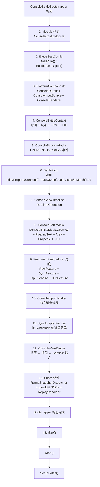
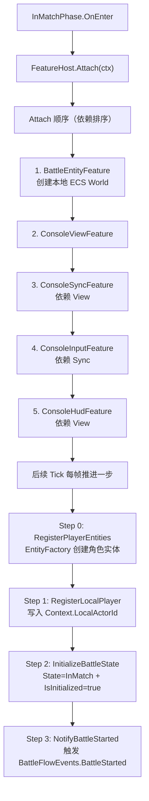
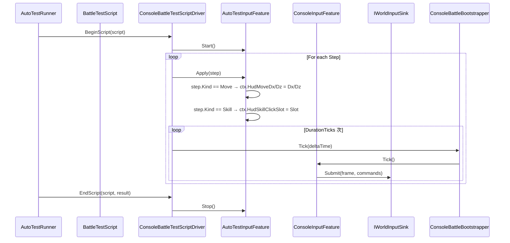

# Console Demo 源码级装配链路：Bootstrapper、FeatureHost、SyncAdapter 与自动测试

> 文档类型：MOBA 项目应用组合深潜
> 事实基线：2026-08-17
>
> 本文在 [01-ConsoleDemoAnalysis.md](../01-ConsoleDemoAnalysis.md) 的基础上，说明 Console Demo 当前的组合根、阶段内 Feature 生命周期、同步适配器、自动测试输入和录制回放入口。文中的“存在”只表示源码入口已闭合；联机、预测校正和回放能力是否可用，按各节列出的验证证据和未完成项判断。

---

## 1. 源码入口

| 入口 | 源码 | 说明 |
|---|---|---|
| CLI 入口 | `Program.cs` | 解析参数、创建 Bootstrapper、驱动模式 |
| 组合根 | `Bootstrap/ConsoleBattleBootstrapper.cs` | 全部装配的组合根 |
| 上下文 | `Battle/Context/ConsoleBattleContext.cs` | 帧号、玩家、本地 ECS、Hook |
| 阶段流 | `Battle/Flow/BattleFlow.cs` | 阶段注册、切换、FeatureHost 生命周期 |
| 特征组件 | `Battle/Flow/FeatureHost.cs` | 拓扑排序 attach/tick/detach |
| 同步适配器工厂 | `Battle/Sync/SyncAdapterFactory.cs` | 按 SyncMode 创建三种适配器 |
| 网络权威适配器 | `Battle/Sync/StateSyncAdapter.cs` | 复用双连接宿主，编排英雄选择、加载和 snapshot apply |
| 共享双连接宿主 | `Unity/Packages/com.abilitykit.network.client/Runtime/GatewayBattleClientHost.cs` | Room 控制连接与独立 battle data plane |
| 输入特征 | `Battle/Input/ConsoleInputFeature.cs` | HUD → PlayerInputCommand → IWorldInputSink |
| 自动测试 | `AutoTest/AutoTestRunner.cs`、`AutoTest/ConsoleBattleTestScriptDriver.cs` | 共享脚本调度、Console 输入映射和基础验收 |
| CLI 录制/回放 | `Replay/ConsoleRecordWriter.cs`、`Replay/ConsoleReplayDriver.cs`、`Replay/RecordTypes.cs` | `.akrec` 输入记录格式与按帧索引 |
| 共享快照录制 | `Replay/ShareReplayController.cs` | Bootstrapper 暴露的另一套共享快照录制入口 |

---

## 2. Bootstrapper 完整装配顺序

`ConsoleBattleBootstrapper` 构造函数中按以下顺序初始化所有组件：



### 2.1 `Initialize()` 做了什么

`Initialize()` 当前只有三项职责：构建运行时 World 和服务容器、注册共享快照分发订阅、输出战斗配置。运行时 World 通过 `WorldManager`、`RegistryWorldFactory` 和 `MobaWorldBootstrapModule` 创建；`IMobaBattleInputPort` 是否可解析，要到 `Start()` 中创建 Battle Session 时才能确定。

```csharp
public void Initialize()
{
    ConfigureWorld();
    InitializeShareSubscriptions();
    LogBattleConfig();
}
```

这里不会调用不存在的 Flow Configure 或 View Subscription，也不会设置初始阶段。`BattleFlow` 的上下文、InMatch Feature 和输入 Sink 都在 `Start()` 中装配。

### 2.2 `Start()` 与 `SetupBattle()` 的边界

`Start()` 负责把 `ConsoleBattleContext` 交给 `BattleFlow`，向 `InMatchPhase` 注册 View、Sync、Input、HUD 四个 SubFeature，并优先把输入 Sink 接到运行时 `IMobaBattleInputPort`。只有 `SnapshotAuthority` 模式会在这里调用 `StateSyncAdapter.Connect()`。

`SetupBattle()` 依次触发 Connect、CreateOrJoinWorld、LoadAssets 和 InMatch。当前调用是同步连续切换，主要用于 Console Demo 和测试装配；它不能单独证明这些阶段已经完成真实异步网络或资源加载。

```csharp
public void SetupBattle()
{
    TransitionTo("Connect");
    TransitionTo("CreateOrJoinWorld");
    TransitionTo("LoadAssets");
    TransitionTo("InMatch");
    _hudFeature.RenderHud();
}
```

---

## 3. FeatureHost：阶段内的能力组装

### 3.1 Feature 接口体系

当前 Feature 使用 `Id` 标识，通过 `IModuleDependencies.Dependencies` 声明依赖；逐帧更新是可选接口，不要求所有 Feature 实现。

```csharp
public interface IFeatureId
{
    string Id { get; }
}

public interface IModuleDependencies
{
    string[]? Dependencies { get; }
}

public interface IFeature : IFeatureId, IModuleDependencies
{
    void OnAttach(IFeatureContext ctx);
    void OnDetach(IFeatureContext ctx);
}

public interface IFeatureTick
{
    void Tick(IFeatureContext ctx, float deltaTime);
}
```

### 3.2 FeatureHost 生命周期

`FeatureHost` 在第一次 Attach 前按依赖深度优先排序，Attach 和 Tick 都遍历 `_sortedFeatures`，Detach 使用反向排序。重复 ID 会被忽略；缺失依赖或依赖环会让排序失败。

当前失败语义需要单独注意：单个 Feature 的 Attach、Tick 或 Detach 异常会被记录后继续处理其他 Feature；即使某个 Attach 失败，Host 最后仍会把 `_attached` 设为 `true`。因此它目前提供的是 Demo 级生命周期隔离，不是“全有或全无”的事务式装配，也不会自动回滚已经 Attach 的 Feature。

### 3.3 Console SubFeature 包装

`IConsoleSubFeature` 保留强类型的 `ConsoleBattleContext` 生命周期。`AddConsoleFeature()` 使用 `SubFeatureAdapter` 将它转换为 `IFeature` 和 `IFeatureTick`；`ConsoleSubFeatureBase` 则保存当前 Context，并通过 `GetSubFeatureId()`、`GetSubFeatureDependencies()` 让子类声明身份和依赖。

```csharp
public interface IConsoleSubFeature
{
    string Id { get; }
    string[] Dependencies { get; }
    void OnAttach(ConsoleBattleContext ctx);
    void Tick(ConsoleBattleContext ctx, float deltaTime);
    void OnDetach(ConsoleBattleContext ctx);
}
```

### 3.4 InMatch 的四步初始化

`InMatchPhase.OnEnter()` 只重置步骤状态并 Attach Feature。四个初始化步骤由后续 `OnTick()` 每帧推进一个；它们属于 `InMatchPhase`，不是由 `FeatureHost` 分派执行：



`BattleEntityFeature` 在 `InMatchPhase` 构造时最先加入且没有依赖；其余 Feature 在 `Start()` 中注册。当前依赖链为 View → Sync → Input，同时 HUD 依赖 View。`LocalActorId` 不是由 Input Feature 设置，而是第二个初始化步骤直接写入 Context。

---

## 4. 三种 SyncAdapter

### 4.1 SyncAdapterFactory

```csharp
public static IBattleSyncAdapter Create(ConsoleBattleContext ctx, BattleStartConfig config)
{
    return config.SyncMode switch
    {
        SyncMode.Lockstep => CreateFrameSyncAdapter(),
        SyncMode.SnapshotAuthority => CreateStateSyncAdapter(),
        SyncMode.Hybrid => CreateHybridSyncAdapter(),
    };
}
```

### 4.2 FrameSyncAdapter（Console 默认）

**职责：** 本地帧同步，只镜像 context 帧号，不推进帧。

```csharp
public void Tick(float deltaTime)
{
    // 1. 从 context 读取当前帧
    _currentFrame = _context.LastFrame;
    _logicTimeSeconds = _context.LogicTimeSeconds;

    // 2. render time = logic time 滞后一帧
    _renderTimeSeconds = _logicTimeSeconds - (1.0 / _tickRate);

    // 3. 广播同步状态
    OnFrameSync?.Invoke(_currentFrame, _logicTimeSeconds);

    // 4. 诊断输出
    if (ShouldDump()) Dump();
}
```

**当前边界：** `SubmitInput()` 是空操作，因为正常本地输入由 `ConsoleInputFeature` 提交到运行时输入 Sink；`GetAllActorStates()` 的 ECS 查询仍是 TODO 并返回空数组。该 Adapter 是本地时钟镜像和事件适配，不是远程 Lockstep 客户端，`Connect()` 会抛出 `NotSupportedException`。

### 4.3 StateSyncAdapter（网络权威模式）

**职责：** 使用共享 `GatewayBattleClientHost` 建立 Room 控制连接与独立 battle data-plane 连接，执行正式 staged loading，并消费状态同步 snapshot。

```csharp
Connect(host, port, roomId, playerId)
 └─ EnterHostAsync()
     ├─ GatewayBattleClientHost.EnterAsync()
     ├─ room login + join-or-create
     ├─ PickHeroForLocalPlayerAsync()
     ├─ ready + BeginLoading/ReportAssetsLoaded
     ├─ wait battle identity
     └─ attach independent battle transport

ConfigureBattle()
 ├─ UseRoomGatewayStateSyncInput(battleId, identity mapping)
 └─ WithSnapshotDeserializer(WireStateSyncSnapshotPush)

SubmitInput(input)
 └─ host.Battle.SendInput(SubmitInputRequest)

OnBattleSnapshotPushed(snapshot)
 └─ cache ActorStateSnapshot[] + OnActorStateSnapshot + OnFrameSync
```

Console battle loop 可以快于墙钟，因此 `StateSyncAdapter.Tick()` 用 `Stopwatch` 的真实 elapsed 驱动共享网络 host 的 heartbeat/reconnect，而用传入的 `deltaTime` 推进本地展示逻辑时间。把游戏加速 delta 交给网络心跳会在极短墙钟时间内误触发超时。

Room control push 与 battle snapshot push 分属两条连接：`OnServerPush` 只观察控制面；状态快照从 `host.Battle.StateSyncSnapshotPushed` 进入。断线后当前 host 按 one-shot 语义释放，并在后续 Tick 重建完整登录/房间/battle attach 流程。该适配器已经不是早期手写 `TcpClient` 包解析器，但仍只是 Console 项目对共享网络宿主的接入层。

### 4.4 HybridSyncAdapter（本地预测实验适配器）

`HybridSyncAdapter` 会按配置注册移动、冷却和生命值三个预测处理器，输入通过 `PredictionCoordinator.ProcessInput()` 进入本地预测。公开的 `OnServerSnapshot()` 可以把调用方提供的快照写入缓存，并交给 Coordinator 比较和应用。

但它当前没有网络客户端：`Connect()` 明确抛出 `NotSupportedException("Hybrid network mode not yet implemented.")`，Bootstrapper 也只会为 `SnapshotAuthority` 发起连接。`SubmitInput()` 只解析移动 payload 并进入 Coordinator，不会把输入发送给服务器；`OnServerSnapshot()` 也没有被真实服务端推送链路调用。

因此当前证据支持“本地 PredictionCoordinator 集成入口”和“手动注入服务器快照的校正路径”，不支持把 Console Hybrid 描述成已经闭合的联机预测、权威校正、回滚重演和表现层重整方案。

---

## 5. 输入链路：HUD → PlayerInputCommand → IWorldInputSink

### 5.1 双层写入模式

```
┌─────────────────────────────────────────────────────────────────────────────┐
│ 输入写入链路 │
│ │
│ ConsoleInputHandler (独立线程) │
│ └─▶ ctx.HudMoveDx / ctx.HudMoveDz ────────────────────────────▶ ConsoleInputFeature │
│ └─▶ ctx.HudSkillClickSlot ──────────────────────────────────▶ │
│ │
│ AutoTestInputFeature (可选) │ │
│ └─▶ ctx.HudMoveDx / ctx.HudMoveDz ────────────────────────────▶ │
│ └─▶ ctx.HudSkillClickSlot ──────────────────────────────────▶ │
│ │
│ ConsoleInputFeature.Tick() │ │
│ ├─ ProcessMoveInput() → MobaMoveCodec → PlayerInputCommand → _sink.Submit() │
│ └─ ProcessSkillInput() → ConsoleSkillInputCodec → PlayerInputCommand → _sink.Submit() │
│ │
│ IWorldInputSink (两个实现) │
│ ├─ RuntimePortInputSink（有 RuntimePort 时） → _inputPort.Submit() │
│ └─ DirectCallInputSink（无 RuntimePort 时） → 只记录本地命令日志 │
│ │
└─────────────────────────────────────────────────────────────────────────────┘
```

### 5.2 AutoTestInputFeature 替换链路

```csharp
// Program.StartTestMode()
var runner = new AutoTestRunner(bootstrapper, config);
runner.RunScenario(new FullBattleScenario());

// AutoTestRunner.RunScript()
_autoInput = new AutoTestInputFeature();
_autoInput.Start();

// 替换输入源
bootstrapper.SetAutoTestInput(_autoInput);

// ConsoleInputFeature 仍然工作
// 它读取的是 ctx.HudMoveDx/HudSkillClickSlot
// 这些值现在由 AutoTestInputFeature 写入

// 测试结束后恢复
_autoInput.Stop();
bootstrapper.SetAutoTestInput(null);
```

### 5.3 输入命令不要与录制 DTO 混淆

运行时输入使用 `AbilityKit.Ability.FrameSync.PlayerInputCommand`，包含 `FrameIndex`、`PlayerId`、业务 OpCode 和 payload。移动通过 `MobaMoveCodec` 编码，技能通过 `ConsoleSkillInputCodec` 编码后提交给 `IWorldInputSink`。

`Replay/RecordTypes.cs` 另有同名的只读 `PlayerInputCommand`，字段是 `ActorId`、`Frame`、`InputCommandType`、`byte OpCode` 和 `byte[] Payload`，只用于 `.akrec`。两者属于不同命名空间和协议层，不能把录制 DTO 当作运行时帧输入契约。

---

## 6. 视图链路

### 6.1 四层事件流动

```
moba.runtime 逻辑层
    │
    ▼
MobaSnapshotRouter.CollectSnapshots()
    │
    ▼
ShareFrameSnapshotDispatcher (OpCode 路由)
    │
    ├─ OpCode=ActorTransform ──▶ ConsoleBattleViewEventSink.OnActorTransform()
    ├─ OpCode=ActorSpawn ─────▶ ConsoleBattleViewEventSink.OnActorSpawn()
    ├─ OpCode=DamageEvent ─────▶ ConsoleBattleViewEventSink.OnDamageEvent()
    ├─ OpCode=ProjectileEvent ─▶ ConsoleBattleViewEventSink.OnProjectileEvent()
    ├─ OpCode=AreaEvent ───────▶ ConsoleBattleViewEventSink.OnAreaEvent()
    └─ OpCode=PresentationCue ▶ ConsoleBattleViewEventSink.OnPresentationCue()

ConsoleBattleViewEventSink
    │
    ├─ RegisterEntity() ─────────▶ ConsoleBattleView.EntityDisplay.Register()
    ├─ UpdateActorPosition() ────▶ ConsoleBattleView.EntityDisplay.UpdatePosition()
    ├─ ShowFloatingText() ───────▶ ConsoleBattleView.FloatingTextSystem.Add()
    ├─ ShowProjectileSpawn() ────▶ ConsoleBattleView.ProjectileDisplay.Add()
    └─ UpdateEntityHp() ─────────▶ ConsoleBattleView.EntityDisplay.UpdateHp()

ConsoleBattleView.Tick()
    │
    ▼
ConsoleBattleView.Render() → ASCII 打印到 Console
```

当前实现有两个视图 Tick 入口：`ConsoleViewFeature.Tick()` 经 `FeatureHost` 调用一次，`ConsoleBattleBootstrapper.Tick()` 在 `_flow.Tick()` 后又直接调用一次 `_battleView.Tick()`。因此一次 Bootstrapper Tick 可能推进两次视图更新。这是尚待收敛的重复驱动风险，不能视为预期的双阶段渲染设计；后续应保留唯一所有者，并用调用计数或渲染节流测试固定该契约。

### 6.2 插值渲染

```csharp
// Bootstrapper.Tick() 中：
var snapshots = _syncAdapter?.GetAllActorStates() ?? Array.Empty<ActorStateSnapshot>();
foreach (var snapshot in snapshots)
    _viewBinder.SyncActor(snapshot.ActorId, snapshot,
        _syncAdapter?.LogicTimeSeconds ?? _totalTime);

_viewBinder.TickRender((float)elapsed,
    _syncAdapter?.LogicTimeSeconds ?? _totalTime);

// ConsoleViewBinder.TickRender()：
// 1. 从 PositionSampleBuffer 取最近的 2 个样本
// 2. renderTime = logicTime - (1.0 / 30.0)  // 1 frame behind @ 30fps
// 3. linear interpolation between samples
// 4. ConsoleBattleView.EntityDisplay.UpdateDisplayPosition(interpolatedX, interpolatedY)
```

---

## 7. 自动测试

### 7.1 测试分层

| 层次 | 工具 | 当前覆盖范围 |
|---|---|---|
| 共享脚本契约 | `BattleTestScriptRunnerTests` | 步骤持续 tick、driver 生命周期、异常结果和场景复用 |
| Console World Smoke | `ConsoleMobaSmokeFlowTests` | 正式 Bootstrapper、运行时输入端口、移动/技能命令和 Trace |
| 战斗生命周期 Smoke | `MobaCompleteBattleLifecycleSmokeTests` | 死亡、复活、再次死亡和终局结算 |
| Runner 内置检查 | `AutoTestRunner.TestInitialization()`、`TestPhaseTransition()` | 对象存在、ECS World 已创建和阶段名；属于 Smoke 辅助断言，不是独立 E2E 套件 |

`AutoTestRunner` 在线程中切换自动输入，调用共享 `BattleTestScriptRunner`，然后执行两项基础检查。它不会自动断言任意 Buff、伤害或网络校正；这些业务结果必须由具体 xUnit Smoke 或调用方读取 Runtime/Trace 后验证。

### 7.2 BattleTestScript 结构

```csharp
public sealed class BattleTestStep
{
    public BattleTestStepKind Kind { get; }
    public int DurationTicks { get; }
    public float Dx { get; }
    public float Dz { get; }
    public int Slot { get; }

    public static BattleTestStep Move(float dx, float dz, int durationTicks);
    public static BattleTestStep Skill(int slot, int durationTicks = 1);
    public static BattleTestStep Wait(int durationTicks);
    public static BattleTestStep Idle(int durationTicks);
}

public sealed class BattleTestScript
{
    public string Name { get; }
    public IReadOnlyList<BattleTestStep> Steps { get; }
    public IReadOnlyList<string> RiskTags { get; }
    public int TotalDurationTicks { get; }
}
```

步骤模型是平台无关且不可变的；Console、Unity 或其他宿主通过 `IBattleTestScriptDriver` 解释同一份脚本。持续时间统一使用 `DurationTicks`，不是 `DurationFrames`。

### 7.3 测试运行流程



---

## 8. 录制与回放

Console 当前有两套录制入口。CLI `--record/--replay` 使用 `ReplayController` 和 `.akrec` 输入记录；`ConsoleBattleBootstrapper.StartRecording()` 使用 `ShareReplayRecorder` 记录共享快照。两者的数据模型和文件协议不同，不应合并理解。

### 8.1 CLI `.akrec` 文件格式

```
AKRC (Magic: 0x414B5243)
├─ VERSION: int
├─ RecordTime: DateTime
├─ StartFrame / EndFrame: int
├─ TotalCommands: int
├─ MapName / PlayerName / GameMode: string
├─ MetadataLength + Metadata: byte[]
├─ CommandCount
│  └─ Length + PlayerInputCommand (MemoryPack)
└─ SnapshotCount
   └─ Length + FrameSnapshot (MemoryPack)
    ├─ Frame
    ├─ ActorCount
    └─ StateHash
```

### 8.2 CLI 录制时机与快照边界

`Program.RecordingGameLoop()` 在每次 Bootstrapper Tick 后读取 HUD 状态：非零移动被编码为 `Move`，技能点击被记录为 `SkillPress`；达到配置间隔时写入 `FrameSnapshot(frame, actorCount, stateHash)`。当前 `StateHash` 只由帧号和实体数量计算，是轻量校验值，不是完整 World 确定性哈希。

Bootstrapper 内的 `ShareReplayRecorder` 是另一条路径。它按自己的间隔调用 `RecordCurrentSnapshot()`，但当前序列化内容仍是 `{ Frame, Actors = [] }` 的占位 JSON，不能据此恢复完整角色状态。文档和验收不得把这条路径描述成完整状态回放。

### 8.3 回放索引

```csharp
// ConsoleReplayDriver.IndexCommands()：
// 构建 Dictionary<int, List<PlayerInputCommand>>
// key = frame，value = 该帧所有命令
// 实现 O(1) 按帧查找

// 回放循环：
while (running) {
    var cmds = _driver.GetCommandsAtFrame(_driver.CurrentFrame);
    foreach (var cmd in cmds) {
        switch (cmd.Type) {
            case InputCommandType.Move:
                var (dx, dz) = SimpleMoveCodec.Deserialize(cmd.Payload);
                ctx.HudMoveDx = dx; ctx.HudMoveDz = dz; break;
            case InputCommandType.SkillPress:
                ctx.HudSkillClickSlot = cmd.OpCode; break;
        }
    }
    _driver.AdvanceFrame();
    _bootstrapper.Tick();
}
```

---

## 9. 当前验证证据

| 验证入口 | 2026-08-16 结果 | 能证明什么 | 不能证明什么 |
|---|---|---|---|
| `dotnet test src/AbilityKit.Demo.Moba.Tests/AbilityKit.Demo.Moba.Tests.csproj -c Release` | 279/305；26 项被同一个 SpawnArea 严格配置错误阻断，并伴随既有依赖/兼容性/可空性警告 | BootstrapStrict 确实拒绝无效项目配置 | 不能证明 Console 完整 World 当前可启动，也不是零警告 |
| `AbilityKit.Demo.Moba.View.Runtime.Tests` | 147/147 | Room、Flow、Session、transport、输入与表现适配的独立契约 | 不创建同一完整 runtime World，不覆盖 Console bootstrap 配置失败 |
| `AbilityKit.Demo.Moba.Host.Tests` / `Acceptance.Tests` | 6/6、8/8 | Host 与独立 acceptance 契约 | 不等于 Gateway/Orleans 多进程或 CLI 录制回放 |
| `ConsoleMobaSmokeFlowTests` / `BattleTestScriptRunnerTests` | 测试入口仍存在，但主工程当次运行受启动配置阻断 | 前者设计为正式 bootstrapper smoke，后者验证共享 driver 协议 | 类存在或历史通过不等于本轮场景已执行到断言阶段 |

## 10. 设计意图与约束

### 10.1 为什么用 FeatureHost

如果入口代码直接持有所有系统，阶段切换、重启、自动测试替换输入都会变得混乱。FeatureHost 让 InMatch 阶段只关心"挂哪些能力"，具体能力自己处理 attach/tick/detach。

### 10.2 为什么 SyncAdapter 有三种

| 模式 | 当前实现 | Console Demo 用途与边界 |
|---|---|---|
| `FrameSyncAdapter` | 本地镜像 Context 帧号和逻辑时间 | 默认本地测试入口；不支持远程 Lockstep，角色状态查询仍为空 |
| `StateSyncAdapter` | 复用 `GatewayBattleClientHost` 双连接宿主，执行 staged room flow、正式 input request 与 snapshot push 消费 | Gateway 状态同步联调入口；真实进程故障、重连收敛和服务部署仍需独立 Smoke 证明 |
| `HybridSyncAdapter` | 本地 PredictionCoordinator、三类 Handler、手动快照注入 | 预测组件装配实验；网络 Connect 未实现，不能视为联机回滚闭环 |

### 10.3 为什么 AutoTestInputFeature 不直接提交

AutoTestInputFeature 只写入 `ctx.HudMoveDx/HudSkillClickSlot`，不直接调用 `_sink.Submit()`。这样 ConsoleInputFeature 的编码逻辑（MoveCodec / SkillInputCodec）仍然生效，保证测试和人工输入走同一条代码路径。

---

## 11. 与其他文档的关系

| 文档 | 关系 |
|---|---|
| [01-ConsoleDemoAnalysis.md](../01-ConsoleDemoAnalysis.md) | 概览；本文补充源码级装配细节 |
| [01-世界启动与运行时装配](./01-WorldAndBootstrap.md) | 理解 MOBA runtime world 创建 |
| [04-快照、表现层与预测回滚](./04-SnapshotPresentationPrediction.md) | 理解快照路由和表现层去重 |
| [07-帧同步机制](../../07-NetworkSynchronization/01-FrameSync.md) | 理解 FrameIndex、PlayerInputCommand 和帧同步原理 |

---

## 12. 与 Unity Starter/Composition 的边界

Console 的 `Bootstrapper` 与 Unity 的 `DemoGameplayBootstrap` 不是同一个抽象的两个实现。前者是完整应用组合根，直接构造平台适配器、阶段、Feature、Host 网络、runtime World、同步适配器、View 与 replay；后者只从 package Catalog 选择一个 Root Prefab。Console 不消费 `DemoLaunchIntent`、Profile/Catalog、package scene 或 `GameEntry`。

| 能力 | Console | Unity Composition |
|------|---------|-------------------|
| 选择游戏/模式 | CLI 与 `BattleStartConfig` | Starter 写入 `DemoLaunchRequest` |
| 创建应用对象 | `ConsoleBattleBootstrapper` 构造完整对象图 | `DemoGameplayBootstrap` 只实例化 Profile 指向的 Root |
| 创建 World | Bootstrapper 内 `ConfigureWorld/CreateBattleSession` | Root 内项目入口继续创建 Session/World |
| Tick owner | Console 主循环调用 `Bootstrapper.Tick` | Unity PlayerLoop 驱动 Root 中的 MonoBehaviour/Host |
| 停止与释放 | `Stop` 只停止 Flow；`Dispose` 才释放完整对象图 | Composition `Shutdown` 销毁 Root；Root 入口负责内部 teardown |

这说明可复用边界应落在 World/Host/Input/Snapshot/Room 等工具契约，而不是再抽象一个同时理解 CLI、Unity Scene、ET Scene 与每种游戏 Flow 的“大一统 Bootstrap”。宿主组合根天然包含平台和项目策略，正式文档与示例比把它下沉到框架更能保持边界清晰。

---

## 13. 组合根边界与已知债务

Console Demo 的价值在于展示一个非 Unity 宿主如何组合 World、Feature、输入、同步和表现原语；它不是框架必须复制的应用层。`ConsoleBattleBootstrapper`、阶段名、Feature 依赖、三种 adapter、ASCII view、自动测试替换和两套 replay 都是项目选择。

当前仍需保留的实现债务：

| 债务 | 影响 |
|------|------|
| `FrameSyncAdapter.GetAllActorStates()` 仍返回空数组 | 本地 lockstep adapter 不能通过该查询驱动插值角色列表 |
| `ConsoleViewFeature.Tick()` 与 bootstrapper 直接 `_battleView.Tick()` 重复 | 一次 game tick 可能两次推进 view，需要收敛唯一所有者 |
| Hybrid `Connect()` 未实现 | 只有本地 PredictionCoordinator 与手工 snapshot 注入，不是联机 Hybrid 闭环 |
| Share replay snapshot 仍是占位 actor 数组 | 不能恢复完整 World；`.akrec` 与 Share replay 也不是同一协议 |
| `FeatureHost.Attach` 单个 Feature 失败后继续并最终标 attached | 缺少 attach transaction/rollback，不能作为生产模块宿主的默认失败语义 |
| `Program.Main` 的 `finally` 只调用 `Stop()` | `Stop` 只停止 Flow；未调用 `Dispose` 时 Host、WorldManager、adapter、dispatcher 与 view 的完整释放路径没有从 CLI 入口闭合 |

框架可复用的是 Host、Room/battle 双连接、Feature/phase、Snapshot、Replay 与输入契约；Console 的组合顺序和降级策略应继续留在示例层，用正式文档展示取舍而不是下沉为统一套件。

*文档版本：v3.1 | 最后更新：2026-08-17*
