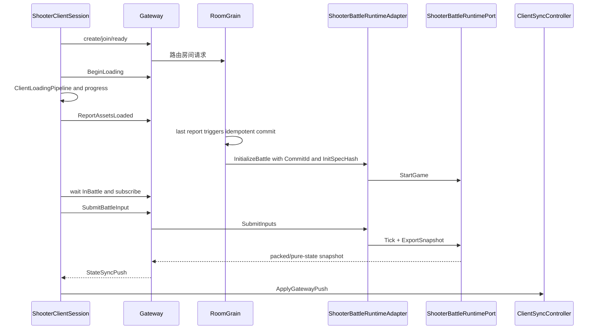

# Shooter Demo 专题总览

> 文档类型：项目级综合示例导航与能力边界
> 事实基线：2026-08-20
> Shooter 示例从单篇概览拆成多个专题。它展示 AbilityKit 机制如何被项目应用层组合为网络同步、服务端权威、Svelto 模拟、快照、Gateway/Orleans 与 Smoke 闭环；其业务编排是参考实现，不是框架默认应用套件。

## 1. 拆分理由

Shooter 示例包含多个独立设计点，并已进一步拆成客户端同步、网络模块、Svelto 性能模式、表现会话/视图管线、插值/混合预测、逻辑层流程、战斗玩法内核与服务端验收深潜：

| 专题 | 关注点 | 文档 |
|------|--------|------|
| Runtime/Svelto | WorldBlueprint、RuntimePort、Svelto EntityManager、Simulation Tick | [01-Runtime、Svelto 与战斗模拟](01-RuntimeSveltoSimulation.md) |
| Snapshot/Hash | packed snapshot、pure-state snapshot、baseline/delta、state hash | [02-Snapshot、Hash 与同步模型](02-SnapshotHashSync.md) |
| Client Sync | ClientSession、InputCoordinator、SyncControllerFactory、预测/插值/混合同步 | [04-客户端同步策略](04-ClientSyncStrategies.md) |
| 网络模块 | Gateway Flow、FrameSyncCoordinator、Snapshot Controller、Lag Compensation、Reconnect | [08-网络模块深潜](08-NetworkModulesDeepDive.md) |
| Svelto 性能模式 | struct component、ExclusiveGroup、ScenarioRunner、Benchmark、预算诊断 | [09-Svelto 性能模式深潜](09-SveltoPerformanceModeDeepDive.md) |
| 表现会话与视图管线 | PresentationFacade、Session、Stream、Projection、Binder、Reconnect 驱动 | [10-PresentationSessionAndViewDeepDive.md](10-PresentationSessionAndViewDeepDive.md) |
| 插值与混合预测 | AuthoritativeInterpolation、HybridHeroPrediction、Diagnostics、DOTS Binder、TimeAnchor | [11-InterpolationAndPredictionDeepDive.md](11-InterpolationAndPredictionDeepDive.md) |
| 逻辑层流程 | 输入、逻辑处理、输出、单机本地闭环、项目会话/服务端权威闭环 | [12-逻辑层流程与单机/多人模式](12-LogicLayerFlowSingleAndMultiplayer.md) |
| 战斗玩法内核 | 一帧管线、敌人波次、projectile 命中、空间索引、Bot AI、胜负状态 | [13-战斗玩法内核深潜](13-BattleGameplayKernelDeepDive.md) |
| 多进程故障矩阵 | recoverable retry、Gateway offline、slow consumer、周期断线、manifest、reliable/diff/replay 收敛 | [14-多进程故障矩阵与收敛证据](14-MultiprocessFaultMatrixAndConvergenceEvidence.md) |
| 千单位同步与渲染优化 | AOI 变化抑制、零分配 codec/Mapper/Projection、GPU 增量上传、端到端指标与 2K 门禁 | [15-千单位状态同步与渲染优化](15-ThousandEntitySynchronizationAndRenderingOptimization.md) |
| PureState 多帧样本块 | v2 扁平样本协议、服务端逐帧采样环、AOI 过滤、客户端时间轴播放与 A/B 模板 | [18-PureState Multi-Sample Blocks](18-PureStateMultiSampleBlocks.md) |
| PureState 样本密度与 A/B | near/mid/far 历史样本密度、近端预算优先、1K payload 门禁与 Headless 指标 | [19-PureState Sample Density and A/B Validation](19-PureStateSampleDensityAndABValidation.md) |
| 工业化流程 | runtime/acceptance/sync 测试、Orleans smoke、replay artifact、DSL/配置环境测试 | [工程质量：MOBA 与 Shooter 示例工业化流程](../../10-EngineeringQuality/03-MobaShooterIndustrializationFlow.md) |
| Gateway/Orleans/Smoke | room flow、RoomGrain、BattleRuntimeAdapter、FrameSyncGrain、SmokeRunner | [05-服务端流程与 Smoke 深潜](05-ServerFlowAndSmokeDeepDive.md) |

## 2. 总体架构

```mermaid
flowchart TB
    subgraph Runtime[com.abilitykit.demo.shooter.runtime]
        Blueprint[ShooterBattleWorldBlueprint]
        Port[ShooterBattleRuntimePort]
        Svelto[ShooterEntityManager]
        Sim[ShooterBattleSimulation]
        Packed[ShooterPackedSnapshotExporter]
        Pure[ShooterPureStateSnapshotExporter]
        Hash[ShooterStateHasher]
        Lag[ShooterLagCompensationService]
        Bench[ShooterSveltoGameplayBenchmark]
    end

    subgraph View[com.abilitykit.demo.shooter.view.runtime]
        Session[ShooterClientSession]
        Input[ShooterClientInputCoordinator]
        Factory[ShooterClientSyncControllerFactory]
        PredictCtrl[ShooterClientPredictRollbackSyncController]
        InterpCtrl[ShooterClientAuthoritativeInterpolationSyncController]
        HybridCtrl[ShooterClientHybridHeroPredictionSyncController]
        ApplyCoordinator[ShooterClientSnapshotApplyCoordinator]
        SnapshotPipeline[ShooterFrameworkSnapshotPipeline]
        PureCtrl[ShooterPureStateSnapshotSyncController]
        RoomFlow[ShooterRoomGatewayFlow]
        Net[Network / Reconnect / FrameSync]
        Presentation[ShooterPresentationFacade]
        PresentationSession[ShooterPresentationSession]
        ViewStream[ShooterSnapshotStream]
        ViewProjection[ShooterSnapshotViewProjection]
        ViewBinder[ShooterSnapshotViewBinder]
        DotsBinder[ShooterDotsSnapshotViewBinder]
    end

    subgraph Orleans[Server/Orleans]
        Gateway[GatewayRequestRouter]
        Room[RoomGrain]
        RoomAdapter[ShooterRoomGameplayAdapter]
        BattleAdapter[ShooterBattleRuntimeAdapter]
        FrameSync[BattleFrameSyncGrain]
        Smoke[ShooterSmokeRunner]
    end

    Blueprint --> Port --> Sim
    Sim --> Svelto
    Port --> Packed
    Port --> Pure
    Port --> Hash
    Port --> Lag
    Port --> Bench
    Session --> Factory
    Factory --> PredictCtrl
    Factory --> InterpCtrl
    Factory --> HybridCtrl
    PredictCtrl --> ApplyCoordinator
    InterpCtrl --> ApplyCoordinator
    HybridCtrl --> ApplyCoordinator
    ApplyCoordinator --> SnapshotPipeline
    SnapshotPipeline --> Presentation
    Presentation --> PureCtrl
    Session --> RoomFlow
    RoomFlow --> Gateway --> Room
    Room --> RoomAdapter
    Room --> BattleAdapter --> Port
    Room --> FrameSync
    Smoke --> Gateway
    Smoke --> Session
    Session --> Net
    Session --> Presentation
    Presentation --> PresentationSession
    PresentationSession --> ViewStream
    ViewStream --> ViewProjection
    ViewProjection --> ViewBinder
    InterpCtrl --> Presentation
    HybridCtrl --> Presentation
    ViewProjection --> DotsBinder
```



## 3. 主闭环



### 3.1 当前默认闭环不是所有策略的并集

总图列出了 Shooter 项目能选择的控制器和 payload，但一次 Room commit 只会解析一个服务端模板。当前默认链路为：

```text
state-sync-authority
  -> BattleWorld
  -> packed push every frame
  -> full packed snapshot every 30 frames
  -> Room declares AuthoritativeInterpolation
  -> client binds authoritative interpolation controller
```

其他模板必须显式选择：`predict-rollback-authority` 使用每帧 full packed snapshot；batch/mass/pure-state 模板使用 PureState baseline/delta；`mass-battle-lod-aoi` 还启用 observer AOI `24/30`。因此“Shooter 支持 PredictRollback”是项目能力事实，“Shooter 默认 PredictRollback”则是错误结论。

Room 启动还有独立约束：`ShooterGameplay` 默认最多 2 人、至少 2 人，`ShooterRoomGameplayAdapter.CanStart` 要求当前所有成员 ready。本地 runtime 的 `ShooterStartGamePayload` 即使包含两个模拟玩家，也不能替代第二个 Room account 的 join/ready；网络 Smoke 必须单独证明房间身份条件成立。

## 4. 示例价值

Shooter 示例适合作为以下能力的参考实现：

- 服务端权威战斗；
- 客户端预测回滚；
- 权威插值同步；
- 大规模状态同步预算裁剪；
- late join 与 reconnect；
- snapshot stale ignore；
- 状态 hash 验证；
- Gateway + Orleans 的房间/战斗生命周期；
- Svelto struct component 批处理与大规模实体预算压测；
- 延迟补偿、网络质量模拟与快速重连；
- 表现层会话、快照流、插值播放与权威对比验收；
- Authoritative Interpolation、Hybrid Hero Prediction、DOTS View Binder 与时间锚点诊断；
- 一帧战斗玩法管线、敌人波次、projectile 命中、空间索引、Bot AI 输入源和胜负状态裁决；
- recoverable retry、Gateway offline、slow consumer 与三轮周期断线的真实多进程故障恢复；
- 版本化 manifest、可靠事件 cursor、authoritative FrameRecord diff、完整/minimized replay、进程与端口组成的收敛证据链；
- 千单位 AOI 变化抑制、稳态零分配同步流水线、Projection 融合、GPU Instanced 增量上传和端到端性能定位；
- runtime/acceptance/sync 测试、Orleans smoke、replay artifact 与 DSL/配置环境测试组成的工业化验收链路。

这里的“参考实现”有明确边界：Runtime Port、snapshot pipeline、Gateway transport、Grain commit 和 adapter 契约可作为工具机制复用；房间加载编排、玩家槽位、敌人波次、同步模板选择、表现会话组合与 Smoke 场景都由 Shooter 项目持有。新游戏应复用机制并重写应用策略，而不是把 Shooter 应用层继续上提为框架默认。

## 5. 源码入口

| 主题 | 源码 |
|------|------|
| Runtime Port | `Unity/Packages/com.abilitykit.demo.shooter.runtime/Runtime/Application/Runtime/ShooterBattleRuntimePort.cs` |
| Simulation | `Unity/Packages/com.abilitykit.demo.shooter.runtime/Runtime/Domain/Battle/ShooterBattleSimulation.cs` |
| Battle Pipeline | `Unity/Packages/com.abilitykit.demo.shooter.runtime/Runtime/Domain/Battle/Factories/ShooterBattlePipelineFactory.cs` |
| Battle Systems | `Unity/Packages/com.abilitykit.demo.shooter.runtime/Runtime/Domain/Battle/Systems/ShooterBattleSystem.cs` |
| Player/Projectile Modules | `Unity/Packages/com.abilitykit.demo.shooter.runtime/Runtime/Domain/Battle/Systems/ShooterBattleSimulationModules.cs` |
| Combat Event Buffer | `Unity/Packages/com.abilitykit.demo.shooter.runtime/Runtime/Domain/Battle/Systems/ShooterCombatEventBuffer.cs` |
| Enemy Wave | `Unity/Packages/com.abilitykit.demo.shooter.runtime/Runtime/Domain/Battle/Systems/ShooterEnemyWaveBattleSystem.cs` |
| Spatial Index | `Unity/Packages/com.abilitykit.demo.shooter.runtime/Runtime/Domain/Battle/Systems/ShooterSpatialHashGrid.cs` |
| Bot AI | `Unity/Packages/com.abilitykit.demo.shooter.runtime/Runtime/Domain/Battle/AI/ShooterBotAiRuntime.cs` |
| Packed Snapshot | `Unity/Packages/com.abilitykit.demo.shooter.runtime/Runtime/Application/Synchronization/ShooterPackedSnapshotExporter.cs` |
| Pure State Snapshot | `Unity/Packages/com.abilitykit.demo.shooter.runtime/Runtime/Application/Synchronization/ShooterPureStateSnapshotExporter.cs` |
| Lag Compensation | `Unity/Packages/com.abilitykit.demo.shooter.runtime/Runtime/Application/Synchronization/ShooterLagCompensationService.cs` |
| Svelto Scenario Runner | `Unity/Packages/com.abilitykit.demo.shooter.runtime/Runtime/Domain/Gameplay/ShooterSveltoGameplayScenarioRunner.cs` |
| Svelto Benchmark | `Unity/Packages/com.abilitykit.demo.shooter.runtime/Runtime/Domain/Gameplay/ShooterSveltoGameplayBenchmark.cs` |
| Client Session | `Unity/Packages/com.abilitykit.demo.shooter.view.runtime/Runtime/Client/ShooterClientSession.cs` |
| Presentation Facade | `Unity/Packages/com.abilitykit.demo.shooter.view.runtime/Runtime/Presentation/ShooterPresentationFacade.cs` |
| Presentation Session | `Unity/Packages/com.abilitykit.demo.shooter.view.runtime/Runtime/Presentation/Session/ShooterPresentationSession.cs` |
| Session Context | `Unity/Packages/com.abilitykit.demo.shooter.view.runtime/Runtime/Presentation/ShooterPresentationSessionContext.cs` |
| Snapshot Stream | `Unity/Packages/com.abilitykit.demo.shooter.view.runtime/Runtime/Presentation/Snapshot/ShooterSnapshotStream.cs` |
| View Projection | `Unity/Packages/com.abilitykit.demo.shooter.view.runtime/Runtime/Presentation/View/ShooterSnapshotViewProjection.cs` |
| View Entity Store | `Unity/Packages/com.abilitykit.demo.shooter.view.runtime/Runtime/Presentation/View/ShooterViewEntityStore.cs` |
| View Model Mapper | `Unity/Packages/com.abilitykit.demo.shooter.view.runtime/Runtime/Presentation/ShooterSnapshotViewModelMapper.cs` |
| View Binder | `Unity/Packages/com.abilitykit.demo.shooter.view.runtime/Runtime/Presentation/View/ShooterSnapshotViewBinder.cs` |
| Battle Data Plane | `Unity/Packages/com.abilitykit.demo.shooter.view.runtime/Runtime/Client/ShooterBattleDataPlane.cs` |
| Unity View Backends | `Unity/Packages/com.abilitykit.demo.shooter.view.runtime/Runtime/Unity/PlayMode/UnityShooterViewBackends.cs` |
| Fast Reconnect Driver | `Unity/Packages/com.abilitykit.demo.shooter.view.runtime/Runtime/Client/Synchronization/ShooterFastReconnectDriver.cs` |
| Snapshot Apply Coordinator | `Unity/Packages/com.abilitykit.demo.shooter.view.runtime/Runtime/Client/Synchronization/ShooterClientSnapshotApplyCoordinator.cs` |
| Framework Snapshot Pipeline | `Unity/Packages/com.abilitykit.demo.shooter.view.runtime/Runtime/Client/Synchronization/ShooterFrameworkSnapshotPipeline.cs` |
| Pure-State Controller | `Unity/Packages/com.abilitykit.demo.shooter.view.runtime/Runtime/Client/Synchronization/ShooterPureStateSnapshotSyncController.cs` |
| Authoritative Comparison | `Unity/Packages/com.abilitykit.demo.shooter.view.runtime/Runtime/Client/Synchronization/ShooterAuthoritativeComparisonDriver.cs` |
| Authoritative Interpolation | `Unity/Packages/com.abilitykit.demo.shooter.view.runtime/Runtime/Client/Synchronization/ShooterClientAuthoritativeInterpolationSyncController.cs` |
| Hybrid Hero Prediction | `Unity/Packages/com.abilitykit.demo.shooter.view.runtime/Runtime/Client/Synchronization/ShooterClientHybridHeroPredictionSyncController.cs` |
| DOTS View Binder | `Unity/Packages/com.abilitykit.demo.shooter.view.runtime/Runtime/Presentation/View/ShooterDotsSnapshotViewBinder.cs` |
| Time Anchor Coordinator | `Unity/Packages/com.abilitykit.demo.shooter.view.runtime/Runtime/Client/Synchronization/ShooterTimeAnchorCoordinator.cs` |
| Room Flow | `Unity/Packages/com.abilitykit.demo.shooter.view.runtime/Runtime/Client/Gateway/ShooterRoomGatewayFlow.cs` |
| RoomGrain | `Server/Orleans/src/AbilityKit.Orleans.Grains/Rooms/RoomGrain.cs` |
| Battle Adapter | `Server/Orleans/src/AbilityKit.Orleans.Grains/Gameplays/Shooter/Battle/ShooterBattleRuntimeAdapter.cs` |
| Smoke Runner | `Server/Orleans/src/AbilityKit.Orleans.ShooterSmoke/Runner/ShooterSmokeRunner.cs` |
| Multiprocess Client Runner | `Server/Orleans/src/AbilityKit.Orleans.ShooterSmoke/Runner/ShooterSmokeClientProcessRunner.cs` |
| Multiprocess Matrix | `Server/Orleans/tools/run_shooter_multiprocess_smoke.ps1` |
| Unity Multiplayer Performance Runner | `tools/run_shooter_unity_headless_multiplayer.ps1` |
| Sync Performance Matrix | `tools/run_shooter_sync_performance_matrix.ps1` |
| Sync Allocation Gate | `tools/run_shooter_sync_allocation_gate.ps1` |
| Multiprocess Script Contracts | `Server/Orleans/src/AbilityKit.Orleans.ShooterSmoke.Tests/ShooterMultiprocessSmokeScriptContractTests.cs` |
| Shooter Runtime Tests | `src/AbilityKit.Demo.Shooter.Runtime.Tests/AbilityKit.Demo.Shooter.Runtime.Tests.csproj`、`src/AbilityKit.Demo.Shooter.Runtime.Tests/Client/ShooterAcceptanceSpecRunnerTests.cs` |
| Shooter Smoke Script | `Server/Orleans/tools/run_shooter_smoke.ps1` |

## 6. 当前长局与高密度完成度

Shooter PlayMode 默认战局已调整为至少 10 分钟，并将“同屏敌人预算”和“整场敌人总量”拆开：默认同屏预算为 512，整场敌人总量为同屏预算的 5 倍，每 60 秒投入一组增援。胜利目标使用实际生成的整场敌人总量，低密度自定义配置不会再因固定胜利目标而无法结束。

当前提供三档受支持的表现密度配置。千单位同步的分层瓶颈、已实施优化、测试命令与实测结果见 [15-千单位状态同步与渲染优化](15-ThousandEntitySynchronizationAndRenderingOptimization.md)：

| 档位 | 同屏敌人预算 | 定位 |
|------|--------------|------|
| Playable | 512 | 默认可玩长局与日常功能验收 |
| Medium | 2048 | Unity 高密度表现、映射和批处理验证入口 |
| High Density | 8192 | 极限配置契约与高密度同步/表现路径验证入口 |

外部传入的敌人预算会钳制到 `1..8192`，避免异常输入生成超大波次数组或触发 OOM。512、2048、8192 表示代码和测试覆盖的配置契约，不代表所有目标硬件都已满足长时帧率预算。后续应把 2K Unity 长时运行、GPU 实例残留和退出/重连清理作为正式 soak；5K 至 10K 更适合作为 headless、AOI/LOD 和网络容量验证，而不是默认客户端全量绘制承诺。

## 7. 证据等级与采用决策

| 等级 | Shooter 中的证据 | 采用时的正确结论 |
|------|------------------|------------------|
| E0 | 类型、接口、模板和配置存在 | 可以继续阅读实现，不能宣称已接入 |
| E1 | Sample、默认配置与专题文档 | 能说明组合方式，不代表通用默认 |
| E2 | Unity/Server/Smoke 的真实消费者 | 已形成项目级链路，不代表失败矩阵完整 |
| E3 | Runtime、Grain、Gateway、Smoke Harness 测试 | 对应契约有自动断言，不等于真实多进程运行 |
| E4 | 当次 Smoke 的日志、Replay、manifest、diagnostic | 只证明该 profile、拓扑和日期的运行事实 |
| E5 | CI 明确触发并阻断的命令和 artifact gate | 只有进入 gate 的预算与场景才具备持续发布保证 |

千单位优化批次已经形成 Runtime、Core、AOI benchmark、Projection 定向测试、Debug allocation gate 和 Unity generated project 编译证据，但真实双客户端 GPU headless 因工程被 Unity Editor 占用而未运行。不得用 runner 源码、生成工程编译、headless pipeline 或历史 artifact 推导 2026-08-19 的新 GPU E4 通过记录。尤其不能用单进程 runner 内的双玩家本地 payload 推导“两名 Room 成员均已 ready”。

---

> 文档版本：v3.3
> 更新日期：2026-08-20
> 更新责任：Shooter 应用编排、同步模板、服务端 adapter 或验收 gate 变化时同步复核。
