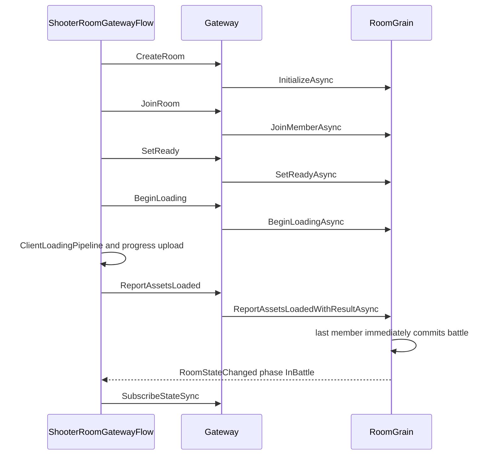
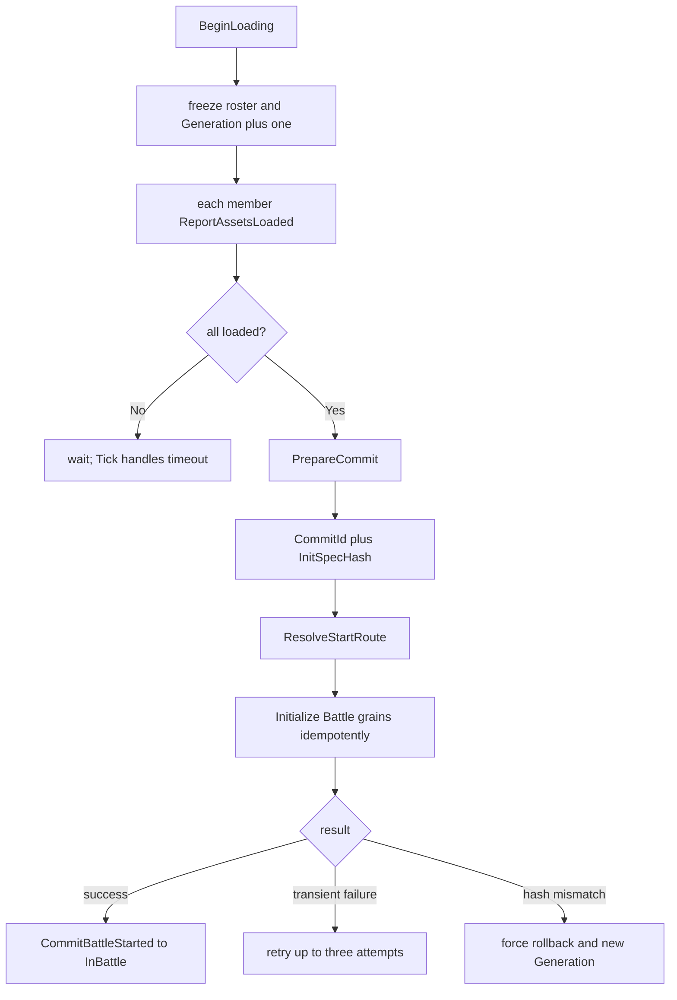
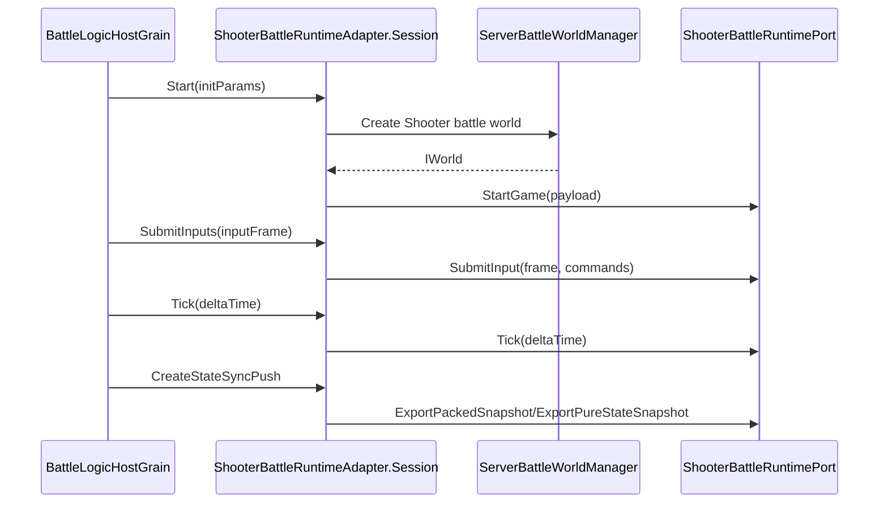
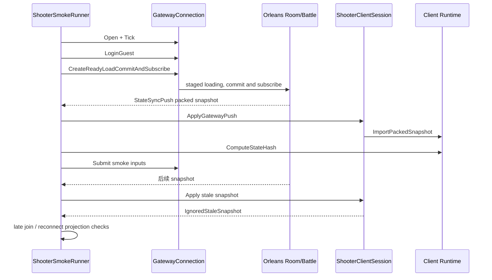

# Shooter Gateway、Orleans 与 Smoke 验收

> 文档类型：Shooter 服务端接入流程与验收概览
> 事实基线：2026-08-19
> 本文说明 Shooter 项目如何通过 Gateway 和 Orleans 把 staged loading、战斗运行时、状态同步推送和 Smoke 串成服务端权威闭环；应用编排仅供接入参考。

## 1. 设计目标

Shooter 服务端链路要解决：

- 客户端如何创建/加入/准备/开始房间；
- 房间如何转成战斗初始化参数；
- 战斗 runtime 如何被 Orleans 托管；
- 输入如何进入服务端权威模拟；
- 状态同步如何推送回客户端；
- late join、reconnect、stale snapshot 如何验证。

## 2. 客户端房间流程

`ShooterRoomGatewayFlow` 封装常见流程：

1. create room；
2. join room；
3. set ready；
4. owner begin loading；
5. 执行 `ClientLoadingPipeline` 并上传 progress；
6. report assets loaded；
7. 等待 Room 进入 InBattle 并解析 battleId；
8. subscribe state sync；
9. select world start anchor。

正式 TCP opCode 106 已固定返回 `Conflict`，不能再作为客户端主流程。HTTP/Admin/Sandbox 仍能调用兼容 `StartBattleAsync`，但该入口绕过加载屏障，不属于 `ShooterRoomGatewayFlow` 的正式协议。

## 3. Gateway 请求路由

`GatewayRequestRouter` 通过 opcode 找 handler，然后统一处理：

- 未注册 opcode；
- 请求超时；
- handler 异常；
- 外部取消。

这使 Shooter 房间流程不需要直接知道 Orleans Grain 的实现，只需要通过 Gateway 协议发送请求。

## 4. RoomGrain 状态机

`RoomGrain` 的正式生命周期由 `RoomPersistentState`、`RoomStateMachine` 与玩法 adapter 共同维护：

| 状态字段 | 作用 |
|----------|------|
| `_summary` | 房间摘要 |
| `_gameplay` | gameplay adapter |
| `_gameplayState` | Shooter 房间私有状态 |
| `_members` | 成员跟踪 |
| `Launch.Generation` | 每轮 loading 的单调代次，隔离过期上报 |
| `Launch.LoadingDeadlineUnixMs` | Loading 超时边界 |
| `BattleCommit` | CommitId、InitSpecHash、attempt、pending/committed 状态 |
| `_battleId/_worldId/_worldStartAnchor` | commit 成功后的战斗身份与时间锚点 |

正常启动时，RoomGrain 会：

最后一名成员上报时会直接执行 commit；`TickAsync` 只处理 Loading 超时、离线清理和恢复后 `Starting/Pending` 的补偿推进。`CommitId=roomId:generation` 与 `InitSpecHash` 让 Battle 初始化可重试而不重复创建世界。

## 5. ShooterRoomGameplayAdapter

`ShooterRoomGameplayAdapter` 把通用房间语义转成 Shooter 战斗语义。

它负责：

- 声明 room type；
- 创建 Shooter room state；
- 判断所有玩家是否 ready；
- 构造房间玩家快照；
- 构造 late join 玩家；
- 构造 `BattleInitParams`；
- 通过 room id 生成确定性 world id。

默认房间不是单人即开：`ShooterGameplay.DefaultMinPlayers` 和 `DefaultMaxPlayers` 都是 2，adapter 还要求当前所有玩家 ready。`minPlayers` 可由 Room tag 覆盖，但覆盖是项目场景配置，不应被文档写成服务端默认。加载阶段同样由 Room 成员身份驱动，本地 runtime payload 中预填两个玩家不会增加 Room 成员。

## 6. ShooterBattleRuntimeAdapter

`ShooterBattleRuntimeAdapter` 是 Orleans battle host 与 Shooter runtime 的桥。

其 session 负责：

| 方法 | 职责 |
|------|------|
| `Start` | 创建 Shooter battle world，解析 runtime port，调用 StartGame |
| `JoinPlayer` | late join 或补充玩家 |
| `MountBotAi` | 挂载 bot AI |
| `SubmitInputs` | 解码 Shooter input opcode 并提交 runtime |
| `Tick` | 调用 runtime.Tick |
| `GetSnapshot` | 读取 actor snapshot |
| `CreateStateSyncPush` | 导出 packed 或 pure-state payload |

输入边界是严格协议：adapter 只接受 `ShooterOpCodes.Input.PlayerCommand`，payload 必须恰好解出一个 command，playerId 必须匹配，所有浮点字段必须为有限值。未知 opcode、畸形 payload、多 command、身份不匹配和 NaN/Infinity 都被拒绝。

## 7. BattleFrameSyncGrain

`BattleFrameSyncGrain` 是独立帧同步 Grain。

它负责：

- 按 tick rate 推进 frame；
- 按 frame 缓存输入；
- timer 触发帧推送；
- catch up 时限制单次推进帧数；
- 通知 observer `FramePushedEvent`。

这层适合用于 lockstep 或需要独立帧输入同步的房间。

它不是 Shooter 默认开战路径。`ShooterServerSyncTemplateCatalog` 当前注册的 Shooter 模板全部属于 StateSync，默认 `state-sync-authority` 使用 `BattleWorld`；`RoomFrameSyncRoute` 因此不会为默认 Shooter 房间初始化 `BattleFrameSyncGrain`。该 Grain 是服务端通用能力和 MOBA 当前路线的一部分，在 Shooter 文档中保留它是为了解释可选基础设施，而不是声明默认依赖。

## 8. StateSyncPush

Shooter battle session 会根据同步配置构造 `StateSyncPush`。

packed 模式下通常包含：

- worldId；
- frame；
- timestamp；
- actor snapshots；
- full snapshot 标记；
- payload opcode；
- serialized packed payload。

pure-state 模式则会根据配置导出 full baseline 或 delta，并交由 Gateway 推送给订阅者。

当前服务端 template policy 的关键节奏如下：

| 模板 | Payload | snapshot/full interval | 额外策略 |
|------|---------|------------------------|----------|
| `state-sync-authority`（默认） | Packed | `1/30` | Room 声明 `AuthoritativeInterpolation` |
| `predict-rollback-authority` | Packed | `1/1` | 每个权威 snapshot 都是 full，供预测重演导入 |
| `batch-state-low-frequency` | PureState | `60/300` | active budget 1024 |
| `mass-battle-lod-aoi` | PureState | `3/450` | active budget 2048，observer AOI `24/30`，LOD `3/9/30`，插值延迟 3 帧 |

interval 是服务端发送政策；full interval 不能被简写成“Shooter 每帧 full”，AOI 也不能继续沿用旧的 `48/60` 数值。

## 9. SmokeRunner 验收链路

`ShooterSmokeRunner` 是端到端验收入口。它不仅验证能跑通，还验证协议语义。

主要验收项：

| 验收项 | 意义 |
|--------|------|
| Gateway 连接与 guest 登录 | 网络入口可用 |
| 创建 presentation/runtime | 客户端本地会话可运行 |
| 等待 packed snapshot push | 服务端状态同步可达 |
| ApplyGatewayPush 返回 AppliedPackedSnapshot | 客户端能应用权威快照 |
| packed frame 等于 runtime/presentation frame | 帧对齐 |
| packed hash 与 runtime hash 分别非零 | 两侧都生成有效摘要；当前总硬断言不要求逐值相等 |
| 提交输入 | 输入链路可达服务端 |
| stale snapshot 返回 IgnoredStaleSnapshot | 过期帧保护有效 |
| presentation player count | 表现投影正确 |
| late join projection | 晚加入恢复有效 |
| reconnect projection | 重连恢复有效 |

## 10. Smoke 覆盖的协议风险

Shooter smoke 不只是探活，它覆盖同步协议中最容易出问题的点：

- 服务端和客户端帧号不一致；
- hash 不一致；
- stale snapshot 被错误应用；
- 重连后 baseline 缺失；
- late join 看到的世界状态不完整；
- presentation 与 runtime 状态脱节。

证据必须分层阅读：源码与示例是 E0-E2，Gateway/Grain/Smoke Harness 自动测试是 E3，实际运行产生的日志、Replay、manifest 和 diagnostic 才是 E4，CI 明确配置触发与阻断才是 E5。默认单进程同进程托管 Silo/Gateway，但客户端仍走真实 TCP；`--server`/`--client` 和多进程脚本才形成独立进程边界。本批没有重新运行 Smoke，不新增 E4 日期。

## 11. 源码索引

| 模块 | 源码 |
|------|------|
| 房间流程 | `Unity/Packages/com.abilitykit.demo.shooter.view.runtime/Runtime/Client/Gateway/ShooterRoomGatewayFlow.cs` |
| Gateway 路由 | `Server/Orleans/src/AbilityKit.Orleans.Gateway/Gateway/Core/GatewayRequestRouter.cs` |
| RoomGrain | `Server/Orleans/src/AbilityKit.Orleans.Grains/Rooms/RoomGrain.cs` |
| Shooter 房间适配 | `Server/Orleans/src/AbilityKit.Orleans.Grains/Gameplays/Shooter/Rooms/ShooterRoomGameplayAdapter.cs` |
| Shooter 战斗适配 | `Server/Orleans/src/AbilityKit.Orleans.Grains/Gameplays/Shooter/Battle/ShooterBattleRuntimeAdapter.cs` |
| FrameSync Grain | `Server/Orleans/src/AbilityKit.Orleans.Grains/FrameSync/BattleFrameSyncGrain.cs` |
| Smoke Runner | `Server/Orleans/src/AbilityKit.Orleans.ShooterSmoke/Runner/ShooterSmokeRunner.cs` |

---

> 文档版本：v3.2
> 更新日期：2026-08-19
> 更新责任：ShooterRoomGatewayFlow、Room commit、input validation、payload 或 Smoke 断言变化时同步复核。
