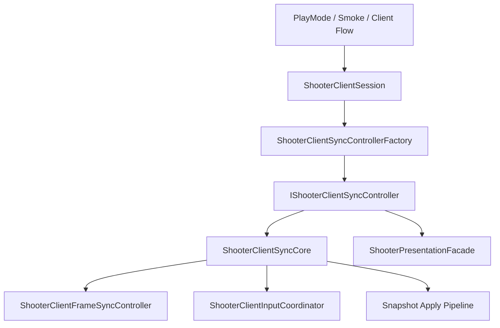
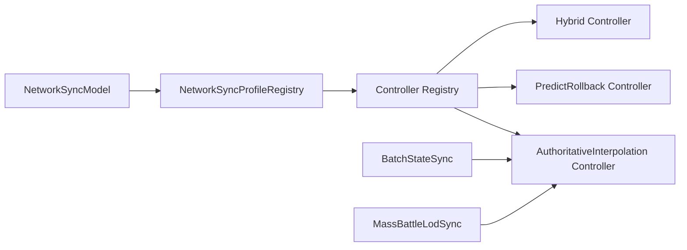
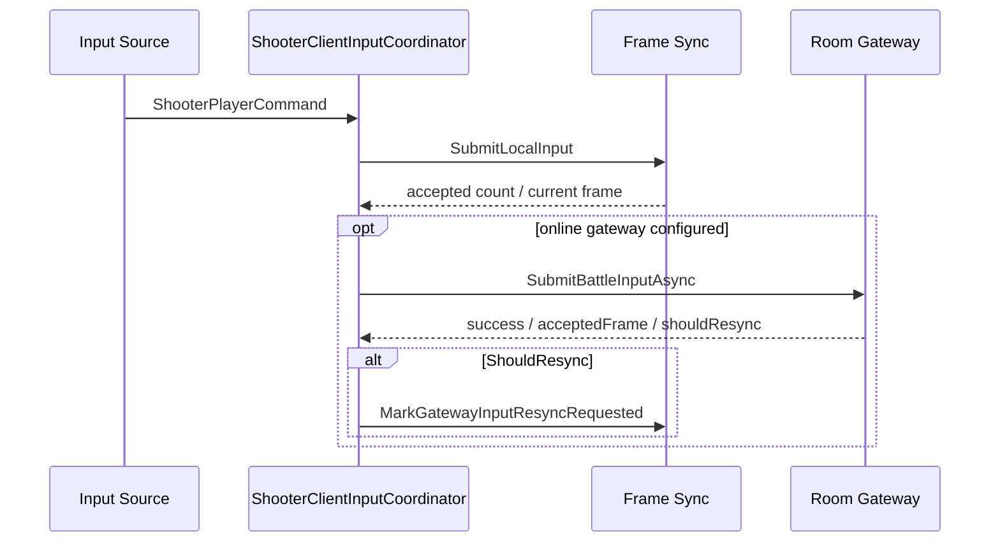
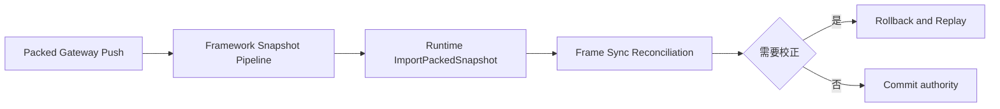
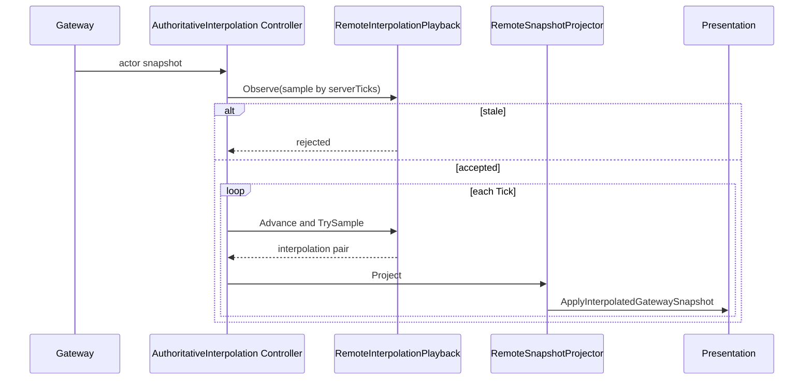
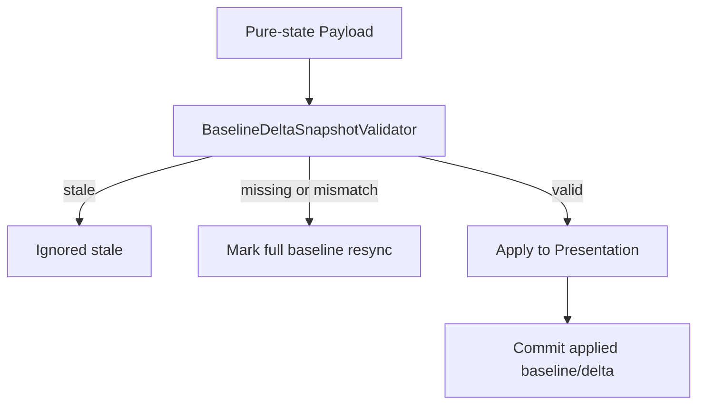

# Shooter 客户端同步策略

> 文档类型：项目示例深潜
> 事实基线：2026-08-16
>
> 本文说明 Shooter 客户端如何在统一会话门面下装配预测回滚、权威插值、批状态、MassBattle LOD 和混合英雄预测，并区分输入提交、packed 权威校正、pure-state baseline/delta 与表现插值的真实边界。

## 1. 分层结论

Shooter 客户端不是“一个模式对应一个完全独立实现”。当前结构由 profile、顶层策略控制器和可复用内部组件组成：

| 层 | 组件 | 责任 |
|----|------|------|
| 会话门面 | `ShooterClientSession` | 对调用方暴露启动、输入、Tick、追帧、网关推送、恢复与诊断 |
| 装配 | `ShooterClientSyncAssemblyOptions`、`ShooterClientSyncControllerFactory` | 把兼容 model 解析为 profile，并创建顶层控制器 |
| 顶层策略 | `IShooterClientSyncController` 实现 | 决定权威快照进入本地 runtime 校正、远端插值缓冲或混合双路径 |
| 共享核心 | `ShooterClientSyncCore` | 持有 frame sync、输入、快照应用、恢复和通用诊断 |
| 输入 | `ShooterClientInputCoordinator` | 本地预测提交、协议包构建、可选 gateway 转发与输入健康事件 |
| packed 应用 | `ShooterFrameworkSnapshotPipeline` | 按 opCode 解码 packed/pure-state，packed 导入 runtime |
| pure-state 应用 | `ShooterPureStateSnapshotSyncController` | 校验 baseline/delta、应用表现状态、维护 resync 诊断 |
| 表现 | `ShooterPresentationFacade`、插值 playback/projector | 将权威或插值状态投影到 view model |

不存在当前旧索引所称的独立 `ShooterPackedSnapshotSyncController.cs`。packed 路由与导入已收敛到 `ShooterFrameworkSnapshotPipeline` 和快照应用协调器中。

## 2. 会话门面

`ShooterClientSession` 构造时创建一个顶层 `IShooterClientSyncController`，之后绝大多数 API 都是委托：

- `StartGame()`；
- `SubmitLocalInput()` 与 gateway 异步提交；
- `Tick()`、`CatchUpToFrame()`、`TryEnterCatchUp()`；
- `ApplyGatewayPush()`；
- full snapshot resync 请求；
- recovery、fast reconnect、reconciliation、插值和 hash 诊断。

会话不根据 model 编写业务分支。新增策略应接入 factory registry 并实现统一接口，而不是扩大会话门面。

## 3. Profile 与工厂映射

工厂先通过 `NetworkSyncProfileRegistry` 解析兼容 `NetworkSyncModel`，再由 `NetworkSyncProfileControllerRegistry` 创建控制器。需要区分两种“默认”：Shooter 产品/Room 当前默认声明是 `AuthoritativeInterpolation`；只有调用 registry 时传入兼容枚举 `Unspecified`，才会落到 `PredictRollback` builder。后者是 API 兼容回退，不是当前产品默认策略。

| Profile / model | 实际顶层控制器 | 当前语义 |
|-----------------|----------------|----------|
| `Unspecified` | `ShooterClientPredictRollbackSyncController` | registry 兼容回退；不代表 Shooter 产品默认 |
| `PredictRollback` | `ShooterClientPredictRollbackSyncController` | packed 权威状态导入本地 runtime，执行校正/回放 |
| `AuthoritativeInterpolation` | `ShooterClientAuthoritativeInterpolationSyncController` | 本地主控继续预测，远端样本仅缓冲插值 |
| `BatchStateSync` | `ShooterClientAuthoritativeInterpolationSyncController` | 复用插值实现，保留 Batch model 标识 |
| `MassBattleLodSync` | `ShooterClientAuthoritativeInterpolationSyncController` | 复用插值实现；预算/AOI 主要发生在服务端 pure-state 导出 |
| `HybridHeroPrediction` | `ShooterClientHybridHeroPredictionSyncController` | 本地预测回滚与远端插值组合 |

`FastReconnect` 与 `ServerRewindLagCompensation` 没有默认顶层控制器 builder。它们是 profile 能力或会话流程，不代表工厂当前可直接创建同名客户端策略。对未注册 profile 调用 Create，应视为装配错误，而不是静默降级。

工厂支持 `Register()`、`ResetToDefaults()`，测试或扩展可替换 builder。全局静态注册会影响同进程后续创建，测试结束必须恢复默认注册。

## 4. 输入通道

输入和快照是独立通道。`ShooterClientInputCoordinator` 先把输入提交给本地 frame sync，再可选发送到 gateway：

无 gateway 时调用远程提交会抛出 `InvalidOperationException`，而不是返回“本地成功、远端忽略”。调用方可通过 `HasGateway` 预先判断。

健康事件语义：

- 普通输入生成 `InputAccepted` 或 `InputRejected`；
- fire 输入额外生成 lag compensation accepted/rejected；
- `remote.ShouldResync` 会把网关请求写入 frame sync 恢复状态。

本地 accepted 不等于服务端 accepted。在线流程必须保存 `ShooterClientGatewayInputSubmitResult.Local` 和 `Remote` 两侧证据。

## 5. 网关快照解码与路由

网关 push 先由 decoder 还原为 `ShooterGatewaySnapshot`。快照可包含：

- Actor 列表；
- `ShooterPackedSnapshotPayload`；
- `ShooterPureStateSnapshotPayload`；
- worldId、frame、serverTicks、payload opCode 和 full 标志。

共享核心使用框架快照 Pipeline 按 payload opCode 路由：

| Payload | 路由行为 |
|---------|----------|
| packed full/delta | 反序列化为 packed payload，调用 runtime `ImportPackedSnapshot()` |
| pure-state full/delta | 反序列化并交给 pure-state 应用路径 |
| 仅 Actor snapshot | 供插值策略构建远端样本；不等于 packed runtime 导入 |
| 非 snapshot opCode | 返回 `Ignored` |

因此“是否存在 pure-state baseline”不是 packed 导入的通用前置检查。baseline/delta 校验只约束 pure-state 链路。

## 6. 预测回滚路径

`ShooterClientPredictRollbackSyncController` 基本委托给 `ShooterClientSyncCore`：

1. 本地输入进入 frame sync 并预测；
2. packed 权威快照经 framework pipeline 解码；
3. runtime 导入 packed 状态；
4. frame sync 根据权威 frame/hash 进行 reconciliation；
5. 必要时回滚并重放已接受输入；
6. 更新 `LastReconciliationResult`、resync reason 和 recovery state。

该策略实现框架 `IClientSyncStrategy` 时，`ObserveRemote(ShooterRemoteSnapshotSample)` 是空操作。预测回滚不消费逐 Actor 插值样本，它消费的是 `ApplyGatewayPush()` 进入的打包权威状态。

## 7. 权威插值路径

权威插值控制器不是“客户端完全不预测”。它把本地主控校正与远端 actor 播放分开处理：

1. 本地输入仍进入 frame sync，并以有界列表保存 pending input；
2. 权威快照按 command sequence 确认输入，旧协议则以 gateway accepted frame 作为兼容确认条件；
3. 本地主控从 packed、pure-state 或 actor snapshot 提取权威 pose，裁剪已确认输入，并最多重演 `MaxReplayFrames` 个未确认输入；
4. 小误差可忽略或按 `MaxCorrectionPerSnapshot` 限幅，大误差、world change、full snapshot 或 authority override 会强制吸附；
5. 远端 actor 样本不会导入本地 runtime，也不会触发整世界回滚；
6. `RemoteInterpolationPlayback.Observe()` 拒绝过期 sample 或写入缓冲；
7. Tick 推进播放时间线，projector 对相邻样本插值，再由 presentation 发布远端 frame。

缓冲饥饿超过 `MaxExtrapolationTicks` 时保持最后权威姿态，不持续外推。可通过 buffered count、playback ticks、estimated server ticks、published flag 和 starvation 状态诊断。

## 8. Batch 与 MassBattle LOD 的客户端现实

`BatchStateSync` 和 `MassBattleLodSync` 当前没有各自的顶层控制器类，均通过权威插值控制器运行，并把请求的 model 保存在 `SyncModel` 中。

差异主要来自服务端 payload 策略：

- Batch 可降低快照频率并批量发送状态；
- MassBattle LOD 可在 pure-state 导出时使用预算、优先级和可选 AOI interest set；
- 客户端仍负责按收到的 frame/serverTicks 播放或应用状态。

不能仅根据客户端 controller 类型推断服务端已经执行 AOI，也不能把“复用同一控制器”解释为三个 profile 完全等价。profile 决定端到端策略，控制器类只是客户端实现复用。

## 9. Pure-state baseline/delta

`ShooterPureStateSnapshotSyncController` 使用 `BaselineDeltaSnapshotValidator` 检查：

- snapshot frame 是否过期；
- full baseline 是否可提交；
- delta 引用的 baseline frame/hash 是否与当前已应用 baseline 一致；
- 是否已经进入需要 full baseline resync 的状态。

成功应用后才提交 validator 状态。缺失或不匹配 baseline 时，不应把 delta 部分写入 presentation；控制器设置 `NeedsFullBaselineResync` 和具体 resync reason，等待调用方请求 full state。

pure-state 主要更新表现投影，并不等价于预测回滚使用的完整 runtime 权威导入。调用方必须分别观察 session 的 runtime resync 状态和 presentation 的 pure-state baseline resync 状态。

## 10. Hybrid 路径

`ShooterClientHybridHeroPredictionSyncController` 组合两种行为：

- 主控玩家输入、权威校正和回放沿用预测回滚核心；
- packed Gateway push 先由 rollback controller 应用，再解码同一快照并写入远端 interpolation buffer；
- pure-state snapshot 由 rollback/presentation 路径处理后直接返回，不写入 Hybrid 远端插值缓冲；
- presentation 需要区分本地预测实体与远端投影实体，避免权威远端帧覆盖本地主控姿态。

因此“同一 packed 快照双路使用”是当前 Hybrid 的真实行为：本地主控看 rollback/import 结果，远端对象看插值样本。它不表示 pure-state 也走相同双路。混合模式的风险还包括实体所有权识别、frame/serverTicks 双时间线、projectile 行为归属及远端样本过期；验收必须同时验证本地主控收敛和远端播放连续性。

## 11. 结果与诊断

`ShooterSnapshotApplyResult` 至少需要区分：

- `Ignored` 或 `IgnoredStaleSnapshot`；
- `AppliedActorSnapshot`；
- `AppliedPackedSnapshot`；
- pure-state 映射后的应用结果；
- `ImportFailed`。

不要把“push 已解码”当成“状态已应用”。排查顺序应为：

1. opCode 是否为 snapshot push；
2. wire payload 是否成功解码；
3. framework pipeline 是否命中 packed/pure route；
4. runtime import 或 pure-state validation 是否成功；
5. reconciliation/resync 是否触发；
6. presentation 是否生成目标 frame；
7. 插值缓冲是否 stale 或 starved。

可观测入口包括 framework packet/dispatch/packed/pure 计数、最后 payload opCode/frame、reconciliation result、client/authority hash、recovery state、pure-state diagnostics 和 interpolation diagnostics。

## 12. 恢复与 full state 请求

session 暴露三类相关但不同的状态：

- `NeedsReliableEventResync`：可靠事件序列存在缺口，需要通过完整 baseline 恢复 watermark；
- `NeedsFullSnapshotResync`：预测回滚/runtime 权威状态需要完整快照；
- `Presentation.NeedsPureStateFullBaselineResync`：pure-state delta 链缺少有效 baseline。

`ShooterClientBattleHandle` 只在上述任一条件成立时创建 full state 请求。请求携带 session、battle、room、world、客户端帧、最后权威帧、两侧 hash 与 reason；相同 `ShooterClientFullStateSyncRequestKey` 会去重，并发请求复用同一个 in-flight task，只有 Gateway 返回 `Accepted` 后才记录最后成功 key。

`ShooterBattleDataPlane` 在收到 push、连接建立和 reliable event ack 失败后触发恢复检查。请求成功不会在本地伪造 baseline，客户端仍需等待并应用服务端 full snapshot；应用 baseline 后再推进 reliable event watermark。`ShooterClientFrameSyncController` 的状态依次覆盖 `CatchUp`、`AwaitingFullSnapshot`、`ApplyingFullSnapshot` 和 `Recovered`，初始进入、晚加入和重连不能用无限循环请求代替状态机。

Fast reconnect phase 和相关健康事件由共享 core 暴露，但 factory 没有 `FastReconnect` 顶层 controller。恢复是会话能力，不是单独播放算法。

## 13. 失败与清理边界

| 场景 | 行为/风险 |
|------|-----------|
| 未注册 profile | factory 创建失败，应在装配阶段暴露 |
| gateway 缺失却远程提交 | 抛出 `InvalidOperationException` |
| packed runtime import 失败 | 返回 `ImportFailed`，不能更新为已收敛 |
| pure-state baseline 不匹配 | 忽略 delta 并请求 full baseline |
| 插值样本过期 | `Observe()` 拒绝，不回退本地 runtime |
| 插值缓冲饥饿 | 保持最后姿态并报告 starvation |
| 静态 factory builder 被测试替换 | 测试结束需 `ResetToDefaults()` |
| 重建 session | 旧 session 的 frame、baseline、buffer 和 recovery 状态不能隐式复用 |
| launcher teardown 时仍有 full-state recovery 在途 | battle handle 内部 runtime 缺少显式 dispose/reset owner；应阻止旧 completion 进入新 session，并补生命周期专项测试 |

控制器接口当前不以 `IDisposable` 形式统一暴露。生命周期所有者在替换 session 时应停止旧 Tick、解绑网关 observer 和表现会话，防止旧实例继续消费 push。

## 14. 验证矩阵与证据等级

| 场景 | 必验结果 |
|------|----------|
| Shooter 产品默认 | 协商得到 `AuthoritativeInterpolation`，创建权威插值控制器 |
| registry `Unspecified` | 仅兼容分支创建预测回滚控制器，不外推为产品默认 |
| PredictRollback | packed import、hash 对比、需要时 rollback/replay |
| AuthoritativeInterpolation | 本地主控 pending input 确认、局部 pose 校正和有界重演；远端状态不导入 runtime，buffer/publish/starvation 可观测 |
| BatchStateSync | 使用插值控制器但 `SyncModel` 保持 Batch |
| MassBattleLodSync | 使用插值控制器；验证服务端 budget/AOI payload 而非假定客户端裁剪 |
| HybridHeroPrediction | 本地主控预测收敛且远端实体平滑 |
| stale actor sample | 插值路径返回 ignored stale |
| pure delta 无 baseline | 不应用 delta，设置 full baseline resync |
| packed import failure | 返回 ImportFailed，不伪报 applied |
| gateway ShouldResync | frame sync 进入恢复状态并记录输入健康事件 |
| 未注册 FastReconnect model | 工厂显式失败，不静默映射 |
| factory 自定义注册 | builder 生效，测试结束恢复默认 |
| full state 请求重复触发 | 相同 key 去重、in-flight 合并，只有 Accepted 后记录成功 key |
| reconnect/reliable event gap | DataPlane 触发 full snapshot 检查，baseline 应用后恢复可靠事件 watermark |

证据应分层解释：控制器、请求状态机和 Gateway handler 属于 E0-E2；专项契约测试属于 E3；Shooter smoke 与 replay artifact 属于 E4；`shooter-fast`、`shooter-integration`、`shooter-unity-playmode` 是 PR/Push P1 gate，而 multiprocess minimal/compatibility/soak/cleanup 按 Push、Schedule 或 Manual 分层，不能统一写成每次 PR 的 E5 阻断。

## 15. 源码索引

| 模块 | 源码 |
|------|------|
| Client Session | `Unity/Packages/com.abilitykit.demo.shooter.view.runtime/Runtime/Client/ShooterClientSession.cs` |
| 装配选项 | `Unity/Packages/com.abilitykit.demo.shooter.view.runtime/Runtime/Client/ShooterClientSyncAssemblyOptions.cs` |
| 输入协调 | `Unity/Packages/com.abilitykit.demo.shooter.view.runtime/Runtime/Client/Session/ShooterClientInputCoordinator.cs` |
| 同步控制器接口 | `Unity/Packages/com.abilitykit.demo.shooter.view.runtime/Runtime/Client/Synchronization/IShooterClientSyncController.cs` |
| 同步控制器工厂 | `Unity/Packages/com.abilitykit.demo.shooter.view.runtime/Runtime/Client/Synchronization/ShooterClientSyncControllerFactory.cs` |
| 预测回滚控制器 | `Unity/Packages/com.abilitykit.demo.shooter.view.runtime/Runtime/Client/Synchronization/ShooterClientPredictRollbackSyncController.cs` |
| 权威插值控制器 | `Unity/Packages/com.abilitykit.demo.shooter.view.runtime/Runtime/Client/Synchronization/ShooterClientAuthoritativeInterpolationSyncController.cs` |
| 混合控制器 | `Unity/Packages/com.abilitykit.demo.shooter.view.runtime/Runtime/Client/Synchronization/ShooterClientHybridHeroPredictionSyncController.cs` |
| 共享同步核心 | `Unity/Packages/com.abilitykit.demo.shooter.view.runtime/Runtime/Client/Synchronization/ShooterClientSyncCore.cs` |
| 快照应用协调 | `Unity/Packages/com.abilitykit.demo.shooter.view.runtime/Runtime/Client/Synchronization/ShooterClientSnapshotApplyCoordinator.cs` |
| 框架快照 Pipeline | `Unity/Packages/com.abilitykit.demo.shooter.view.runtime/Runtime/Client/Synchronization/ShooterFrameworkSnapshotPipeline.cs` |
| pure-state 控制器 | `Unity/Packages/com.abilitykit.demo.shooter.view.runtime/Runtime/Client/Synchronization/ShooterPureStateSnapshotSyncController.cs` |
| Gateway 解码模型 | `Unity/Packages/com.abilitykit.demo.shooter.view.runtime/Runtime/Client/Gateway/ShooterGatewaySnapshotModels.cs` |
| Snapshot view mapper | `Unity/Packages/com.abilitykit.demo.shooter.view.runtime/Runtime/Presentation/ShooterSnapshotViewModelMapper.cs` |
| 通用 profile 注册表 | `Unity/Packages/com.abilitykit.network.runtime/Runtime/Network/Runtime/Sync/NetworkSyncProfileRegistry.cs` |
| Baseline/delta validator | `Unity/Packages/com.abilitykit.network.runtime/Runtime/Network/Runtime/Sync/BaselineDeltaSnapshotValidator.cs` |
| Full state 请求与去重 | `Unity/Packages/com.abilitykit.demo.shooter.view.runtime/Runtime/Client/ShooterClientBattleHandle.cs` |
| Push/reconnect 恢复触发 | `Unity/Packages/com.abilitykit.demo.shooter.view.runtime/Runtime/Client/ShooterBattleDataPlane.cs` |

## 16. 协商会话、可靠事件与项目边界

`CreateSession` 是当前正式装配入口：先由 `NetworkSyncSessionBuilder` 校验 profile、能力与 schema，再把不可变 descriptor 同控制器一起交给 `ShooterClientSession`。默认 controller 映射如下：

| Profile | 当前顶层控制器 |
|---------|----------------|
| `PredictRollback` | `ShooterClientPredictRollbackSyncController` |
| `AuthoritativeInterpolation` | `ShooterClientAuthoritativeInterpolationSyncController` |
| `BatchStateSync` / `MassBattleLodSync` | 复用 authoritative interpolation controller |
| `HybridHeroPrediction` | `ShooterClientHybridHeroPredictionSyncController` |

复用同一控制器只表示顶层应用策略共享，不表示采样频率、AOI、预算、可靠事件或服务端发送语义等价。profile 的端到端含义仍由协商 descriptor、服务端 route 与项目配置共同决定。

`ShooterClientSession` 还以该 descriptor 创建 `ShooterReliableBattleEventConsumer` 和 `NetworkSessionRecoveryCoordinator`。`ShooterClientBattleHandle` 再为该 coordinator 创建 action router 与 `NetworkSessionRecoveryRuntime`，采用 Manual 模式；`RequestFullSnapshot` 和 `RestoreReliableEventBaseline` 都路由到 Shooter full-state RPC，由 handle 保留 request key、single-flight 与 timeout。框架 runtime 负责 generation、取消和 stale completion 抑制，不决定 RPC payload 或 baseline 应用。

可靠消费者通过 `ReliableEventSessionBuilder` 建立会话，只有所有 sink 成功后才推进 checkpoint；sink 失败会保留缺口并要求 full baseline。checkpoint flush 已接入 Disconnect、ApplicationPause、ApplicationQuit 与 Dispose，PlayerPrefs store 也有项目工厂，但持久化介质和生命周期绑定仍是 Shooter/Unity 宿主责任，不是同步框架自动完成的行为。当前 handle 自身未实现 `IDisposable`，launcher teardown 也未显式 reset/dispose 其 recovery runtime，因此在途恢复的取消和代次收口仍是需要补齐的所有权契约；这不应被直接表述为已证实的内存泄漏。

Batch N 的 Shooter Runtime `489/489`、Network Client `3/3`、Network Battle `12/12` 是此前 E3 基线。Batch W 在当前工作区重跑 Shooter Runtime 得到 `481/490`：9 项失败集中于仍期待旧 PredictRollback 默认、旧矩阵数量、旧 snapshot apply 类型和 session 计数的测试；battle handle 与 controller factory 聚焦用例 `22/22` 通过。该结果说明恢复/工厂局部契约可用，但全量测试基线尚未跟随当前默认路线收口。Unity PlayMode 与真实多进程链未运行；这些应用层控制器和 facade 是高接入度参考，不是框架承诺的统一战斗客户端套件。

*文档版本：v3.2 | 最后更新：2026-08-16*
