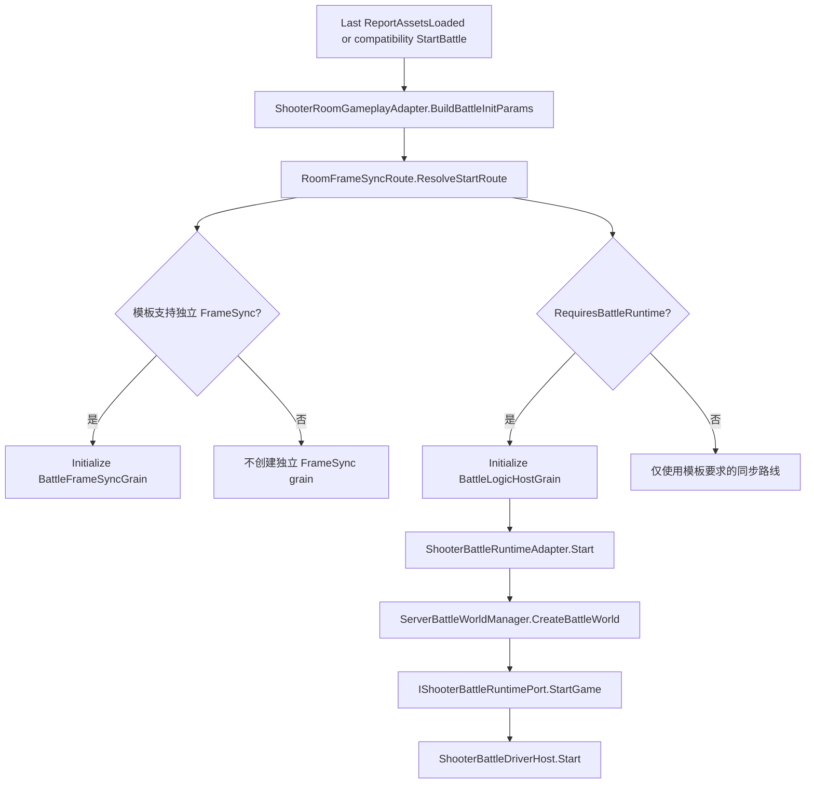
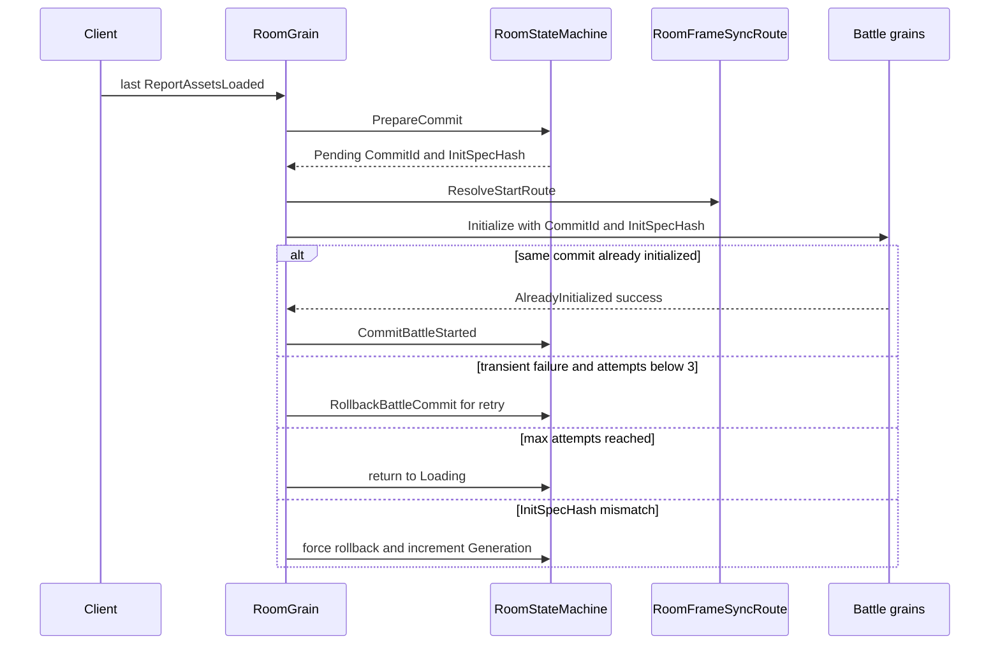

# Shooter 服务端适配与 Smoke 证据深潜

> 文档类型：Shooter 服务端应用适配与验收证据深潜
> 事实基线：2026-08-19
> 本文聚焦 Shooter 在 Orleans 服务端中的玩法特化边界：Room 如何生成稳定的战斗身份，Battle runtime adapter 如何托管权威世界与同步 payload，以及 Smoke 如何把协议、恢复、投影、玩法终局和 replay 变成可检查证据。通用 Gateway/Room/Battle 主链路见 [Gateway、Room 与 Battle 服务端链路](../../12-ServerArchitecture/02-GatewayRoomBattleFlow.md)，端到端接入概览见 [Shooter Gateway、Orleans 与 Smoke](03-GatewayOrleansSmoke.md)。

## 1. 边界与结论

Shooter 服务端不是一条由 `GatewayRequestRouter -> RoomGrain -> BattleFrameSyncGrain -> Shooter runtime` 固定串联的流水线。实际结构由三组边界组成：

| 边界 | 主要实现 | Shooter 特化职责 | 不负责 |
|------|----------|------------------|--------|
| 请求入口 | `GatewayRequestRouter` | 无；按 opcode 分派并归一化超时/异常 | 房间状态、玩法规则、客户端恢复 |
| 房间适配 | `RoomGrain`、`ShooterRoomGameplayAdapter` | 玩家槽位、ready、worldId、`BattleInitParams`、late join 参数 | 权威模拟、payload 编码 |
| 战斗适配 | `ShooterBattleRuntimeAdapter` | 创建 Shooter world、输入解码、推进、诊断与状态推送 | Room 成员关系、Gateway session |
| 可选独立帧路由 | `RoomFrameSyncRoute`、`BattleFrameSyncGrain` | 按同步模板决定是否创建独立 frame-sync grain | 默认 Shooter 权威 runtime 的必选依赖 |
| 运行证据 | `ShooterSmokeRunner`、`ShooterSmokeClientProcessRunner` | 单进程闭环、多进程恢复、网络条件与 replay | 替代单元测试或生产监控 |

核心结论：

1. Shooter 默认模板是 `state-sync-authority`：要求 Battle runtime、不创建 `BattleFrameSyncGrain`，每帧发送 packed push、每 30 帧产生 full snapshot。
2. Room 默认至少需要 2 名 ready 玩家；启动前生成稳定 worldId 和稳定玩家槽位，默认 random seed 仍来自进程时间，不具备同等级确定性。
3. 正式启动使用持久化 `BattleCommit`、稳定 CommitId/InitSpecHash、幂等初始化、有限重试和回滚；兼容 `StartBattleAsync()` 也委托该 commit，但会绕过加载屏障。
4. packed 与 pure-state 是两套 payload 契约；pure-state 还区分全局 baseline 与 observer baseline。
5. Smoke 的通过条件不是“收到一帧”，而是协议、输入、恢复、投影、玩法终局、replay 和清理共同成立。

## 2. Gateway 只定义请求失败外观

`GatewayRequestRouter.RouteAsync()` 从 registry 解析 handler。未注册 opcode 返回 `UnhandledOpCode`；注册 handler 使用 linked cancellation token，并在配置大于零时调用 `CancelAfter`。

异常映射有一个容易忽略的边界：

| 情况 | 结果 |
|------|------|
| 未找到 handler | `GatewayStatusCode.UnhandledOpCode` |
| Router 自己触发的超时 | `GatewayStatusCode.Timeout` |
| handler 普通异常 | `GatewayStatusCode.Exception` |
| 调用方 cancellation token 已取消 | 不命中超时 catch filter，取消继续传播 |

因此“Gateway 隔离异常”不等于吞掉所有取消。外部取消仍保留调用方控制语义，玩法 handler 也不能依赖 Router 回滚 Room 或 Battle 状态。

## 3. Room 到战斗的 Shooter 特化

### 3.1 玩家槽位是稳定身份，不是列表下标

`ShooterRoomGameplayAdapter` 为首次加入的账户分配递增 playerId。成员离开后，其 ID 进入 `SortedSet<int>`；新成员优先复用最小已释放 ID。构造玩家快照和 `BattleInitParams.Players` 时再按 playerId 排序。

这保证三个性质：

- 前序成员离开不会让剩余成员整体换号；
- late join 可复用明确释放的槽位；
- 战斗初始化顺序不依赖字典枚举顺序。

默认玩家参数仍是示例策略：`ActorId`、`HeroId`、`SpawnPointId` 与 playerId 对齐，所有玩家 `TeamId = 1`，出生 X 坐标为 `(playerId - 1) * 2f`。这些值适合 Smoke，不应直接当作正式匹配和队伍分配规则。

`ShooterGameplay.DefaultMinPlayers` 与共享玩法侧 `DefaultMaxPlayers` 当前均为 2。`ShooterRoomGameplayAdapter` 允许 room tag 覆盖 minPlayers，但没有显式 tag 时，一名 ready 玩家不能开战；这条默认值同时由 adapter tests 固定。HTTP `GatewayGameplayCatalog` 与 Admin Console 为演示仍给出 maxPlayers=4，Room summary 有显式容量时 adapter 会采用该值，因此“默认最大 2”和“后台默认表单 4”属于不同装配层，不能互相覆盖。Sandbox 或后台若加入 Bot 凑齐人数，证明的是项目验收组合，不代表生产匹配规则允许单人直启。

### 3.2 worldId 稳定，默认 seed 不稳定

`BuildBattleInitParams()` 从 Room tags 读取 tick rate、map、seed 和 duration。worldId 由 roomId 经过 FNV-1a 风格的 64 位哈希生成，并把零值修正为 1；同一 roomId 可跨调用得到同一 worldId。

`RandomSeed` 的默认值则是 `Environment.TickCount`。若调用方没有显式写入 `ShooterRoomTagKeys.RandomSeed`，不同进程或不同启动时刻不能保证复现同一世界。需要确定性 replay 的测试或部署必须显式传 seed。

### 3.3 同步模板决定启动路线

`RoomFrameSyncRoute.ResolveStartRoute()` 先从玩法同步 profile 解析模板，再独立给出两个结果：

- `RequiresBattleRuntime`：是否初始化 `IBattleLogicHostGrain`；
- `FrameSyncOptions`：是否初始化 `IBattleFrameSyncGrain`。

模板无法解析时，Room route 会标记 `IsUnsupportedTemplate = true`，并给出“要求 Battle runtime、没有独立 frame-sync”的兜底路线；`RoomGrain` 本身不提前读取该标记。但 `BattleLogicHostGrain.InitializeBattleCore` 会再次通过 profile 解析模板，失败时返回 `UnsupportedSyncTemplate` 并清理 runtime。最终结果仍是启动被拒绝，Room 按普通 commit 失败累计 attempt，超过阈值后回 Loading，而不是用默认模板静默启动。

当前 catalog 的默认与高成本策略必须按源码值理解：

| 模板 | payload / cadence | 设计含义 |
|------|-------------------|----------|
| `state-sync-authority` | packed；每帧 push、每 30 帧 full | Shooter 默认，不再默认 predict rollback，也不是每帧 full |
| `predict-rollback-authority` | packed；每帧 full | 预测客户端需要可直接导入的权威基线，仍是显式可选模板 |
| `batch-state-low-frequency` | pure-state；60/300 帧 | 10k entity、active budget 1024 |
| `mass-battle-lod-aoi` | pure-state；3/450 帧 | 20k entity、active budget 2048、observer AOI 24/30、LOD 3/9/30、插值延迟 3 帧 |

`RoomNetworkSyncCapabilityResolver` 把默认 state sync、authoritative interpolation、runtime interpolation 和 pure-state authority 都声明为 AuthoritativeInterpolation profile；batch、mass battle、hybrid 和 predict rollback 分别映射到独立 profile。模板控制服务端 payload/cadence，capability metadata 控制客户端兼容协商，两者不能只比较字符串。

## 4. Room 生命周期与事务边界

### 4.1 持久化幂等 commit 与有限回滚

当前正式流程不会在远端初始化前直接把 `_battleId/_worldId` 当成已提交事实。`RoomStateMachine.PrepareCommit` 先建立 `RoomBattleCommitPersistentState`，再由 Room 调用 Battle 初始化，成功后执行 `CommitBattleStarted`：

`CommitId` 固定为 `roomId:generation`，`InitSpecHash` 由初始化参数稳定计算；相同二元组可幂等返回，冲突或 hash mismatch 不允许覆盖已有 world。普通失败最多重试 3 次，超过后回到 Loading；hash mismatch 使用强制回滚并隔离到新 generation。兼容的 `StartBattleAsync()` 会写入 `PhaseReason="LegacyStartBattle"` 后委托同一 commit，所以它不再具有旧版“先写 battleId 再裸调远端”的部分提交实现，但仍绕过正式 staged loading。

正常流程由最后一次 `ReportAssetsLoadedWithResultAsync` 立即调用 `CommitBattleAsync`；`TickAsync` 只承担 Loading 超时、离线清理和 Grain 恢复后 `Starting/Pending` 的补偿推进。

### 4.2 late join 有局部补偿

运行中战斗收到新账户时，Room 先加入 member tracker 和 gameplay state，再构造 `PlayerInitInfo` 调用 Battle join。若 Battle 返回拒绝，Room 会执行：

1. 从 member tracker 删除账户和成员状态；
2. 调用 gameplay adapter 的 `Leave()` 释放 Shooter player slot；
3. 抛出异常，让 Gateway 返回失败。

这保证 Room 的成员与 gameplay state 不会因为 Battle 拒绝而永久残留。补偿只覆盖 Room 内写入；若 Battle adapter 在返回拒绝前产生外部副作用，仍需由 Battle 边界自行处理。

已有成员在运行中重入返回 `Reconnect`。`RestoreAsync()` 只恢复已知 member 的在线状态，并依据 `_battleId` 选择 TeamLobby 或 Reconnect，不会把未知账户隐式加入房间。

### 4.3 断线宽限与整房间回收

Gateway 连接关闭后只把成员标为离线，不立即 Leave 或删除 Room。账号已 rebound 到新连接、或 mapping 已指向其他 room 时，旧连接清理直接跳过；否则成员/mapping 保留，允许在 1 分钟内通过正式 Restore/Reconnect 恢复。owner 离线而 peer 在线时只转移 owner，离线成员本身仍保留。

所有非 Bot 客户端持续离线满 1 分钟后，Room 才进入遗弃清理：先销毁 `BattleLogicHostGrain`，再销毁可能存在的 `BattleFrameSyncGrain`，然后清 mapping、directory 和持久化 state。Shooter 默认没有独立 FrameSync Grain，但清理代码按通用 Room contract 检查 worldId。该过程失败后 30 秒重试且非事务；Smoke 的 reconnect 场景必须在宽限内恢复，长期断线场景则应明确断言 RoomExpired 和资源回收，而不是无限等待旧 battle。

## 5. Shooter Battle runtime session

### 5.1 启动、推进与销毁

`ShooterBattleRuntimeAdapter.CreateSession()` 为每个 battleId 创建 session。`Start()` 的顺序是：

1. 通过 `ServerBattleWorldManager.CreateBattleWorld()` 创建世界；
2. 从 world services 解析 `IShooterBattleRuntimePort`；
3. 将 `BattleInitParams` 转成 `ShooterStartGamePayload`；
4. 调用 `StartGame()`；
5. 创建并启动 `ShooterBattleDriverHost`；
6. 建立 accountId 到 playerId 的索引。

`Tick()` 调用 runtime 的 `AdvanceFrame(deltaTime)`，并以 `CurrentFrame >= frame` 判断是否追上 Battle host 要求的帧。`Dispose()` 停止 driver、销毁 battle world，并清空 runtime、observer baseline 与账户索引。

启动失败由 `BattleLogicHostGrain` 统一进入 `StopBattleRuntime()`，它会释放 timer、dispose runtime session；Shooter session 的 `Dispose()` 再调用 `DestroyBattleWorld`。因此 runtime port 缺失或 `StartGame()` 拒绝时，当前主链路会立即清理已创建 world。仍需关注的是异常清理本身失败、跨 Grain 重试和 Smoke 中途失败后的业务补偿，而不是沿用旧版 world 泄漏结论。

### 5.2 输入采用严格白名单与身份校验

`ValidateInput()` 只接受 `ShooterOpCodes.Input.PlayerCommand`。payload 必须能被 `ShooterInputCodec` 解码为恰好一个 command，command.playerId 必须与 Battle input 的 playerId 一致，移动、瞄准等浮点字段必须全部为有限值。

未知 opcode、畸形 payload、零个或多个 command、身份不匹配以及 NaN/Infinity 都会被拒绝。对应断言位于 `ShooterBattleRuntimeAdapterTests`；Gateway/Battle host 不应再为未知输入构造 fallback command。

## 6. packed 与 pure-state 推送

payload mode 的解析优先级是：构造器/测试显式 override，其次是兼容环境变量 `ABILITYKIT_SHOOTER_STATE_SYNC_PAYLOAD_MODE`，最后由 `ShooterServerSyncTemplateCatalog` 根据房间 sync template 与 network environment 决定。环境变量是显式覆盖入口，不是唯一默认权威来源。Smoke 命令行接受规范化后的 packed/pure-state，并在非 client 模式启动前设置兼容环境变量。

当前 catalog 提供 predict rollback、authoritative interpolation、batch low frequency、mass battle LOD/AOI、hybrid、runtime snapshot interpolation、state sync authority、pure state authority 八类 Shooter 模板。模板负责表达项目同步策略；框架只提供解析和运行机制，不保证这些模板适合其他游戏。

默认模板是 `state-sync-authority`，对应 packed payload、`SnapshotIntervalFrames=1`、`FullSnapshotIntervalFrames=30`。因此“默认每帧推送”只表示每帧有权威 push，不表示每帧都是 full；客户端 baseline/recovery 和带宽估算必须使用 30 帧 full 周期。

| 维度 | packed | pure-state |
|------|--------|------------|
| 主 opcode | `ShooterOpCodes.Snapshot.PackedState` | full 为 `PureState`，delta 为 `PureStateDelta` |
| baseline | payload 自包含完整 packed 数据 | delta 携带 baseline frame/hash |
| 预算 | 固定 packed 编码 | 根据网络条件解析 active、delta、低频和插值参数 |
| observer 状态 | 不维护 pure-state baseline | 全局 baseline 与 observer baseline 分离 |
| AOI | packed 全量组件块 | observer 可建立 player interest scope 与可见性提示 |

pure-state 的非 observer push 使用 session 级 `_lastPureStateBaselineFrame/_lastPureStateBaselineHash`。observer push 使用 `ShooterObserverPureStateSyncState`，按 observer key 隔离 baseline 和 `AoiInterestSet`。若 accountId 无法映射到活着的 Shooter player，adapter 无法构造 observer interest scope，会退化为非 observer-specific pure-state push。

`ShooterStateSyncPushOptions.ResolvePureStateSettings()` 会按网络条件收缩预算。例如 limited-bandwidth profile 将 active budget 降为 128，并采用 4 帧 delta、30 帧低频间隔和 6 帧插值延迟。对应单元测试同时锁定 full/delta opcode、baseline frame/hash、环境模式解析和预算参数。

## 7. `BattleFrameSyncGrain` 是可选基础设施

独立 frame-sync grain 激活时先按默认 30Hz 注册 timer；`InitializeAsync()` 可重设 tick interval。输入按 frame 缓存，timer 一次最多追赶 5 帧，然后向 observer 发送 `OnFramePushed(evt)`。

当前实现的运维边界包括：

- observer 回调没有逐个 await 或异常隔离；
- 普通 deactivate 清理 timer、输入、历史和录制缓存；显式 `DestroyAsync()` 还清空 observer、身份与计数并请求 deactivate；
- 它是否存在由同步模板决定，不能以它的 frame 作为所有 Shooter 战斗的唯一健康指标。

因此排障时应先查看 `RoomBattleStartRoute`，再决定检查 `BattleFrameSyncGrain` 还是 `BattleLogicHostGrain` 的运行状态。

## 8. 单进程 Smoke：完整闭环证据

`ShooterSmokeRunner.RunAsync()` 在同一 Host 中连接 TCP Gateway，但仍通过真实网络连接执行登录、房间和推送流程。其验收阶段为：

1. 固定账户登录并取得 session token；
2. create、ready、start、subscribe；
3. 捕获 packed snapshot，解析 wire 与 packed 字段；
4. 应用到本地 runtime 和 presentation，关闭插值以消除观察延迟；
5. 提交至少 3 组 Gateway 输入；
6. 构造旧一帧 full snapshot，确认返回 `IgnoredStaleSnapshot`；
7. 验证主客户端、late join 和 reconnect 的投影；
8. 直接驱动 Battle host 完成移动、射击、击杀和比赛终局；
9. 保存、最小化并验证 input-logic/server-frame replay；
10. 统一校验结果，取消 observer 订阅并销毁 Battle。

关键门禁不是全部采用严格相等：

| 证据 | 通过条件 |
|------|----------|
| wire/packed frame | 必须相等 |
| snapshot hash/entity | hash 非零，entity count 大于零 |
| runtime/presentation frame | 不得落后于 packed frame，可高于它 |
| 主客户端投影 | 必须至少应用一次 full sync，玩家数严格等于预期 |
| late join/reconnect 投影 | 不强制 full sync，玩家数使用下限语义 |
| reconnect | 必须重新登录、轮换 session token，并返回 `Reconnect` |
| gameplay loop | frame 前进、发生移动和射击、至少击败一个敌人、进入 Victory/Defeat/Ended |
| replay | 记录被消费，最小化结果可验证，状态回放匹配 |

清理顺序是先取消主账户和 late-join 账户对应 `IStateSyncObserverGrain` 的订阅，再调用 `IBattleLogicHostGrain.DestroyAsync()`。清理本身没有聚合容错：前一个 unsubscribe 抛错会阻止后续 destroy，因此失败报告应保留原始 battleId 供补偿清理。

## 9. 多进程 Smoke：故障矩阵与收敛证据

`ShooterSmokeClientProcessRunner` 支持 create/join 两种独立客户端进程，PowerShell orchestrator 在其上组织 `recoverable-retry`、`gateway-offline`、`slow-consumer`、`reconnect-cycles` 和 `observer-reactivation` 五类真实故障场景。完整的时序、manifest 和组合门禁见 [14-多进程故障矩阵与收敛证据](14-MultiprocessFaultMatrixAndConvergenceEvidence.md)。

客户端不仅输出 pass/fail，还输出可供脚本解析的结构化字段：

- payload kind、source/baseline frame/hash；
- pure-state full、delta 和 baseline resync 次数；
- prediction reconciliation 前后 frame/hash、replay ticks 和 pending inputs；
- input accepted/current frame、server ticks、`ShouldResync`；
- reconnect 次数、逐轮 push 进度与 entry kind；
- reliable event epoch、cursor、gap 和 `needsResync`；
- latency、jitter、packet loss 和实际 delayed/dropped 计数；
- observer queue、drop、coalesce 和 baseline invalidation；
- remote time anchor、catch-up frame 与 lag compensation；
- input-state replay、minimized replay、diagnostic 和 authoritative diff。

join 或 reconnect entry 会主动调用 `RequestFullSnapshotBaselineAsync()`，等待 accepted 后才等待可应用 snapshot。pure-state 客户端若遇到 baseline 不匹配，会累计 `PureStateBaselineResyncNeeded`；恢复完成后该状态必须清除，且 reliable cursor 不再需要 resync、authoritative FrameRecord diff 必须收敛。

多进程 reconnect 只对 join 模式执行。每轮真实关闭 connection，再使用原 session token 重新走 `JoinReadyStartAndSubscribeAsync()`；每轮都要求 entry kind 为 `Reconnect`，并收到新的可应用 snapshot push。`reconnect-cycles` 当前连续执行三轮。它验证的是连接恢复和 baseline 续接；单进程 Smoke 的“重新账户登录并轮换 token”是另一条更强的身份恢复门禁，两者不能混为同一个测试。

PureState 的合法推进可以是后续 delta、baseline resync 或重复 full baseline。重复 full baseline 不只属于 slow-consumer，但它不能替代 pending baseline、reliable cursor、同帧 hash 和 authoritative diff 等独立收敛门禁。

## 10. 失败矩阵与治理建议

| 故障点 | 当前行为 | 可见证据 | 仍需治理 |
|--------|----------|----------|----------|
| Gateway 未注册 opcode | 返回 `UnhandledOpCode` | Gateway response | registry 覆盖测试 |
| Gateway 内部超时 | 返回 `Timeout` | status code | 区分 handler 阶段指标 |
| Room commit 暂时失败 | 持久化 attempt 并有限重试，超过阈值回 Loading | BattleCommit status、attempt、last error | 增加跨进程故障与激活恢复 E4 场景 |
| unsupported sync template | Room 路由到 Battle runtime，Battle 返回 `UnsupportedSyncTemplate`，commit 最终回 Loading | route flag、Battle error、attempt/last error | 在 Room 层提前拒绝以减少无效远端重试，并增加告警 |
| late join 被 Battle 拒绝 | 回滚 Room member 和 player slot | join 失败、Room snapshot | 验证 Battle 外部副作用 |
| Shooter Start 在 world 创建后失败 | `StopBattleRuntime` dispose session 并销毁 world | world manager/session 日志与 adapter tests | 覆盖清理异常与重复销毁 |
| 未知或畸形 Battle input | adapter 严格拒绝 | validation result 与 adapter tests | 增加协议拒绝指标和滥用限流 |
| pure-state baseline 丢失 | 客户端请求 full baseline/resync | resync count、baseline 字段、pending 状态 | 告警阈值与速率限制 |
| slow consumer | queue drop/coalesce 并使 baseline 失效 | observer metrics、full baseline 恢复、diff | 多 observer 容量与公平性 |
| Gateway offline | transport 停止并清理 live delivery | fault ack、端口探测、reconnect push | 长时间离线与动态 profile |
| 周期断线 | join 客户端逐轮正式 Reconnect | cycle progress、push 前进、reliable/diff | Grain reactivation 组合矩阵 |
| observer push 异常 | frame-sync 无逐 observer 隔离 | 推送缺失/异常日志 | 隔离失败 observer |
| Smoke cleanup 中断 | 后续 destroy 可能未执行 | process timeline、端口与遗留 battleId/world | `finally` + 聚合异常/补偿任务 |

当前 Room commit 与 Battle Start 资源释放已具备主链路实现。下一步优先级应放在：把 staged loading/commit 恢复纳入真实多进程故障场景、为协议拒绝和回滚建立指标，以及把 Smoke 业务 cleanup `finally` 化；这些问题直接影响可观测恢复与共享环境污染。

## 11. 证据等级

| 等级 | 本文对应证据 | 不能外推 |
|------|--------------|----------|
| E0-E2 | adapter、catalog、Room/Battle 实现与调用链 | 所有失败路径正确或生产可用 |
| E3 | RoomBattleCommitTests、RoomStateMachineTests、RoomFaultMatrixTests、ShooterBattleRuntimeAdapterTests、Smoke Harness tests | 真实进程故障或网络条件已发生 |
| E4 | 单/多进程脚本当次生成的日志、Replay、manifest、diagnostic/diff | 未执行 profile、跨机器和生产容量 |
| E5 | CI 明确启用并阻断的命令与 artifact policy | runner 或脚本存在即自动形成发布门禁 |

本批未重新运行 Smoke，不更新既有 E4 日期；源码契约修正只提升文档准确性，不产生新的运行证据。

本批 Release E3 重新执行 Gateway `162/162`、Grains `232/232`、Shooter Smoke Harness `33/33`，覆盖默认 `state-sync-authority`、30 帧 full 周期、2 人开战、AOI 24/30、Room 断线保留与遗弃策略，以及 runner/script 契约。这里的 Harness 通过仍不是一次真实 TCP 或多进程故障运行。

## 12. 验证入口

| 验证目标 | 入口 |
|----------|------|
| Room 参数映射、稳定槽位与复用 | `ShooterRoomGameplayAdapterTests` |
| Battle world、输入、packed/pure-state、预算 | `ShooterBattleRuntimeAdapterTests` |
| battle session 销毁 world | `ShooterRoomToBattleFlowTests` |
| 单进程 TCP Gateway 闭环 | `AbilityKit.Orleans.ShooterSmoke` 默认模式 |
| 独立服务端 | `--server --tcp-port 41001` |
| 多进程创建/加入 | `--client --client-mode create|join` |
| pure-state | `--state-sync-payload-mode pure-state` |
| 网络条件 | `--condition-latency-ms`、`--condition-jitter-ms`、`--condition-packet-loss-rate` |
| 客户端恢复与终局 | `--reconnect-count`、`--wait-for-match-end` |
| 故障矩阵计划 | `run_shooter_multiprocess_smoke.ps1 -Profile full -PlanOnly` |
| 聚焦周期断线 | `run_shooter_multiprocess_smoke.ps1 -Profile custom -Scenario reconnect-cycles -PayloadMode pure-state` |
| replay | `--client-state-replay-output`、`--server-frame-replay-output` |

## 13. 源码索引

| 模块 | 源码 |
|------|------|
| Gateway 路由 | `Server/Orleans/src/AbilityKit.Orleans.Gateway/Gateway/Core/GatewayRequestRouter.cs` |
| Room 生命周期 | `Server/Orleans/src/AbilityKit.Orleans.Grains/Rooms/RoomGrain.cs` |
| 同步启动路线 | `Server/Orleans/src/AbilityKit.Orleans.Grains/Rooms/RoomFrameSyncRoute.cs` |
| Shooter Room adapter | `Server/Orleans/src/AbilityKit.Orleans.Grains/Gameplays/Shooter/Rooms/ShooterRoomGameplayAdapter.cs` |
| Shooter Battle adapter | `Server/Orleans/src/AbilityKit.Orleans.Grains/Gameplays/Shooter/Battle/ShooterBattleRuntimeAdapter.cs` |
| 同步 payload 配置 | `Server/Orleans/src/AbilityKit.Orleans.Grains/Gameplays/Shooter/Battle/ShooterStateSyncPushOptions.cs` |
| 可选 FrameSync grain | `Server/Orleans/src/AbilityKit.Orleans.Grains/FrameSync/BattleFrameSyncGrain.cs` |
| 单进程 Smoke | `Server/Orleans/src/AbilityKit.Orleans.ShooterSmoke/Runner/ShooterSmokeRunner.cs` |
| Smoke 校验与清理 | `Server/Orleans/src/AbilityKit.Orleans.ShooterSmoke/Runner/ShooterSmokeScenarioBase.cs` |
| 多进程客户端 | `Server/Orleans/src/AbilityKit.Orleans.ShooterSmoke/Runner/ShooterSmokeClientProcessRunner.cs` |
| 多进程矩阵 orchestrator | `Server/Orleans/tools/run_shooter_multiprocess_smoke.ps1` |
| 多进程脚本契约 | `Server/Orleans/src/AbilityKit.Orleans.ShooterSmoke.Tests/ShooterMultiprocessSmokeScriptContractTests.cs` |
| 命令行入口 | `Server/Orleans/src/AbilityKit.Orleans.ShooterSmoke/Program.cs` |
| Room adapter 测试 | `Server/Orleans/src/AbilityKit.Orleans.Grains.Tests/Rooms/ShooterRoomGameplayAdapterTests.cs` |
| Battle adapter 测试 | `Server/Orleans/src/AbilityKit.Orleans.Grains.Tests/Battle/ShooterBattleRuntimeAdapterTests.cs` |

---

> 文档版本：v3.2
> 更新日期：2026-08-19
> 更新责任：Room commit、Shooter adapter、sync template、Smoke 断言与 artifact gate 变化时同步复核。
