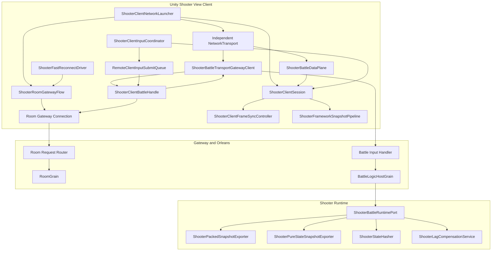
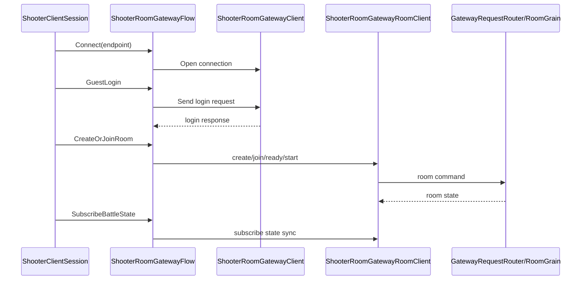
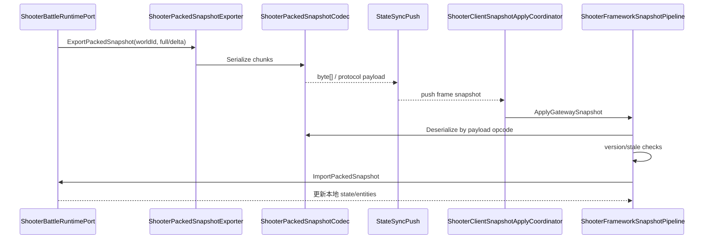
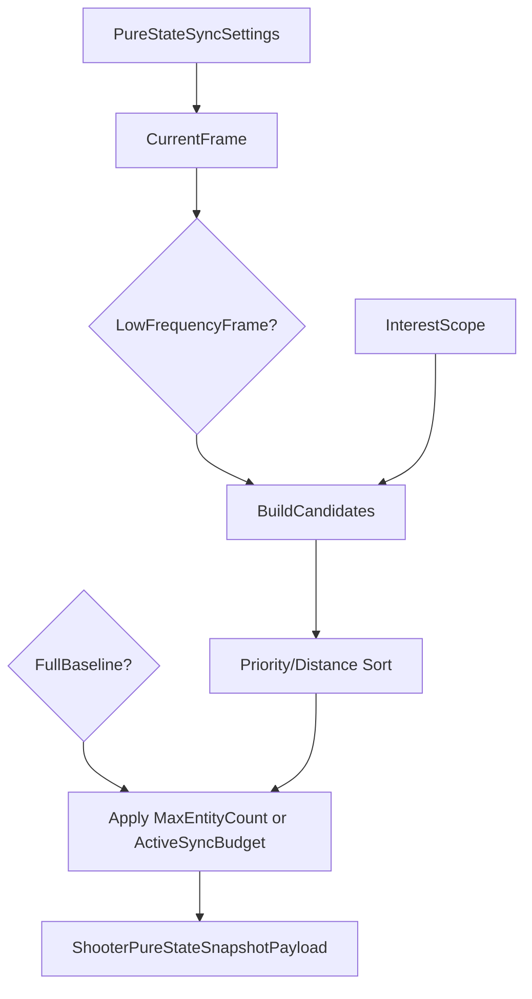
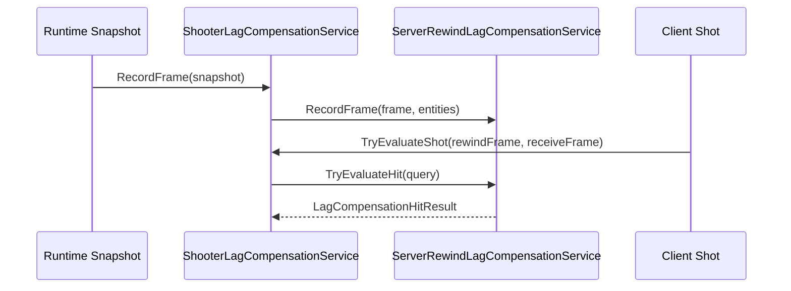

# Shooter 网络模块深潜

> 文档类型：项目示例深潜
> 事实基线：2026-08-16
>
> 本文聚焦 Shooter 示例的网络模块组合：客户端 Session、Room 控制面连接、独立 battle 数据面、同步控制器、快照编码、纯状态预算、延迟补偿与重连验收。它补充 `04-ClientSyncStrategies.md` 与 `05-ServerFlowAndSmokeDeepDive.md` 中没有展开的网络模块职责边界。

## 1. 网络模块全景

Shooter 网络链路不是单个类，而是一组可替换模块：

## 2. 客户端网络入口

| 模块 | 职责 |
|------|------|
| `ShooterClientNetworkEndpoint` | 描述服务器地址、端口、协议等连接端点 |
| `ShooterClientConnectionFactory` | 创建 Room 控制面连接对象 |
| `ShooterClientNetworkLauncher` | 完成 Room flow 后，根据 battle 身份创建独立数据面 transport |
| `ShooterClientGatewayLauncher` | 组合阶段化 Gateway flow，并通过回调构造 battle client |
| `ShooterClientSession` | 聚合本地输入、同步策略、push 应用与表现回调 |
| `ShooterClientBattleHandle` | 校验 session/battle/world/player 身份，封装输入、ack 和 full-state RPC |
| `ShooterBattleTransportGatewayClient` | 把 battle input 请求编码到独立 `NetworkTransport` |
| `ShooterBattleDataPlane` | 接收线程入队 push，主线程 `Drain` 后分发并触发 ack/resync |
| `RemoteClientInputSubmitQueue` | 一个在途请求加一个最新等待输入；提供替换和恢复诊断 |

设计上客户端不直接调用 Orleans Grain。Room 控制面请求和 battle 数据请求都先进入 Gateway 协议层，但二者不共享同一个 transport 生命周期。

## 3. Room Gateway Flow

`ShooterRoomGatewayFlow` 组合 `com.abilitykit.network.room` 的阶段化原子入口，把房间生命周期包装成客户端可调用的控制面流程：

这层的价值是把“控制面请求编排”与“战斗同步策略”隔离：房间创建失败、登录失败、ready/start 失败不会污染 packed/pure-state 同步控制器。启动结果提供 battle/world/session 身份后，launcher 才创建新的 battle `NetworkTransport`；Room connection 继续承担 reliable-event ack 与 full-state baseline/resync RPC。

## 4. 输入与 push 数据面

Shooter 正式输入链路按“本地输入采样与预测 → 背压队列 → battle transport 请求 → Battle Host 权威 Tick”组织：

| 模块 | 职责 |
|------|------|
| `ShooterClientInputCoordinator` | 将移动、瞄准、开火输入绑定本地预测帧并生成协议输入 |
| `ShooterClientFrameSyncController` | 处理本地预测、权威快照校正和 pending input replay |
| `RemoteClientInputSubmitQueue` | 保持一个在途请求和一个最新等待输入，旧等待输入可被替换 |
| `ShooterClientBattleHandle` | 提交已接受输入；根据响应或 baseline 状态请求 full snapshot |
| `ShooterBattleTransportGatewayClient` | 在独立 battle transport 上发请求并 inline 匹配响应 |
| `BattleLogicHostGrain` | 调度 accepted frame、缓冲输入并推进权威 runtime |
| `ShooterBattleDataPlane` | 网络线程只入队 push，主线程 `Drain` 后应用状态 |

```mermaid
flowchart LR
    Sample[Local Input]
    Predict[Local Prediction]
    Queue[Input Submit Queue]
    Handle[Battle Handle]
    Transport[Battle Transport]
    Battle[BattleLogicHostGrain]
    Push[StateSync Push Queue]
    Drain[Main Thread Drain]
    Session[Client Session]

    Sample --> Predict --> Queue --> Handle --> Transport --> Battle
    Battle --> Push --> Drain --> Session
```

输入请求不依赖主线程 pump 才能完成，否则 PlayMode 在等待提交结果时可能死锁。相反，异步 push 必须经队列切回主线程，避免 receive thread 上的 `ApplyGatewayPush` 与 `session.Tick` 并发修改同步状态。

## 5. 同步控制器与快照应用组件

`ShooterClientSyncControllerFactory` 的核心价值是按策略选择控制器，而不是把所有同步策略塞进一个大类。载荷解码和导入由下游快照组件承担，不是第四类策略控制器。

| 组件 | 适用范围 | 关键行为 |
|------|----------|----------|
| `ShooterClientPredictRollbackSyncController` | PredictRollback | 本地预测、权威快照对账、漂移恢复 |
| `ShooterClientAuthoritativeInterpolationSyncController` | AuthoritativeInterpolation、BatchStateSync、MassBattleLodSync | 延迟播放服务端快照；后三种模型中的批量与 LOD 差异当前由同步配置和载荷内容表达 |
| `ShooterClientHybridHeroPredictionSyncController` | HybridHeroPrediction | 主控角色预测，其他实体权威插值 |
| `ShooterClientSnapshotApplyCoordinator` | 所有策略控制器的快照应用入口 | 解码 Gateway 包装，调用框架快照管线并记录导入证据 |
| `ShooterFrameworkSnapshotPipeline` | packed 与 pure-state 协议载荷 | 聚合 FramePacket、按 opcode 解码和路由、执行对应应用 stage |
| `ShooterPureStateSnapshotSyncController` | pure-state baseline/delta | 在表现门面中校验 baseline、delta、stale 和重同步需求 |

当前不存在独立的 packed snapshot 策略控制器。packed payload 进入 `ShooterFrameworkSnapshotPipeline` 后，由应用上下文完成版本兼容检查、stale frame 判定、runtime 导入和表现投影。

## 6. Packed Snapshot 网络路径

packed 模式面向小中规模实体与高频权威同步。

packed snapshot 的特点：

- 用 chunk 表示 entity id、flags、位置、速度、血量、分数、生命周期等字段；
- `ShooterPackedSnapshotChunkCodec` 对 float 做量化与 pair packing；
- `ShooterPackedSnapshotImporter` 区分 full 与 delta；
- `ShooterPackedSnapshotBytesCodec` 为回滚和网络传输提供 byte[] 包装。

## 7. Pure-State 网络路径

pure-state 模式面向大规模实体与带预算的状态同步。`ShooterPureStateSnapshotExporter` 会在导出时执行：

1. 归一化 `ShooterPureStateSyncSettings`；
2. 判断当前帧是否是 low-frequency frame；
3. 根据 full baseline 或 delta 选择 `MaxEntityCount` / `ActiveSyncBudget`；
4. 根据 Svelto context 或普通 snapshot 构造候选实体；
5. 按 priority、距离、entity id 排序；
6. 截断到预算内；
7. 输出 entity delta 与 visibility hint；
8. 携带 baseline frame/hash 与 current state hash。

## 8. 延迟补偿模块

`ShooterLagCompensationService` 把 runtime snapshot 转换为 `LagCompensatedEntitySnapshot` 并交给 `ServerRewindLagCompensationService`。

| 能力 | 说明 |
|------|------|
| `RecordFrame(runtime)` | 从 `GetSnapshot()` 捕获玩家位置、命中半径、存活状态 |
| `TryEvaluateShot(shot, out result)` | 按客户端请求的 rewind frame 回放命中检测 |
| Telemetry | 暴露 captured frame、oldest frame、latest frame |
| LastEvaluation | 记录最近一次命中补偿评估，便于诊断 |

## 9. 网络质量、恢复与证据边界

| 模块 | 说明 |
|------|------|
| `ShooterNetworkConditionProvider` | 为演示或验收提供延迟、抖动、丢包等网络条件 |
| `ShooterCarrierNetworkLink` | Demo harness 中模拟 carrier 链路 |
| `ShooterDemoHarnessCarrier` | packed/predict 等模式的测试载体 |
| `ShooterHybridDemoHarnessCarrier` | 混合同步模式测试载体 |
| `ShooterInterpolationDemoHarnessCarrier` | 插值模式测试载体 |
| `ShooterFastReconnectDriver` | 快速重连流程驱动 |
| `ShooterTimeAnchorCoordinator` | 对齐客户端播放时间与服务端权威时间 |

这些模块共同支撑 stale snapshot、late join、reconnect 和 state hash 校验。恢复还依赖 battle handle 的 full-state single-flight：同一请求 key 的并发请求复用在途任务，并受自动 timeout 约束；可靠事件 ack 失败时请求 `ReliableEventGap` baseline，full snapshot watermark 可恢复可靠事件 cursor。

当前 handle 已正式采用 `NetworkSessionRecoveryActionRouter<TResult>` 与 `NetworkSessionRecoveryRuntime<TResult>`。runtime 使用 Manual 模式，session coordinator 先产出决策，handle 再显式执行；`RequestFullSnapshot` 和 `RestoreReliableEventBaseline` 共享 Shooter full-state handler。框架层提供的是决策/执行分离、generation、取消、陈旧完成抑制和诊断，Shooter 仍拥有 request DTO、RPC、single-flight key 与成功判定。

证据必须分层声明：

| 层级 | 当前证据 | 可证明范围 |
|------|----------|------------|
| E0 | launcher、handle、data plane、transport gateway client 源码 | 类型与结构存在 |
| E2 | `ShooterRemoteStateSyncPlayModeHost` 正式组合链 | Shooter 业务运行时采用通用 recovery coordinator/router/runtime，并保留项目 full-state handler |
| E3 | battle handle、Room flow、remote coordinator contract 等测试 | wire contract、重试、single-flight、resync、旧路径删除 |
| E4 | Shooter 多进程 Smoke 和 diagnostic/replay artifact | 真实进程故障恢复与组合收敛 |
| E5 | Shooter CI gate 配置 | main/schedule/manual 的阻断责任；完整多进程矩阵不是 PR gate |

## 10. 模块边界总结

| 层级 | 不应该做 | 应该做 |
|------|----------|--------|
| Gateway Flow | 不拥有 battle transport 或解释 snapshot | 负责登录、房间、订阅和恢复阶段顺序 |
| Battle Handle | 不驱动本地 world | 校验身份并封装输入、ack、baseline/resync RPC |
| Battle Data Plane | 不在 receive thread 应用 session 状态 | push 入队、主线程 Drain、分发与恢复触发 |
| Input Submit Queue | 不拥有连接、pause、reconnect 或 dispose | 管一个在途请求、最新等待输入和诊断 |
| ClientSession | 不创建第二套 coordinator 生命周期 | 聚合同步控制器、输入、push 应用与表现回调 |
| Strategy SyncController | 不解析每种 payload 的协议细节 | 负责预测、插值、回滚和策略级恢复 |
| Snapshot Apply/Pipeline | 不创建房间或选择同步策略 | 解码、路由、兼容性检查、stale 处理与 runtime 导入 |
| RuntimePort | 不关心网络连接 | 导出 snapshot/hash、执行 tick、导入权威状态 |
| SnapshotExporter | 不做客户端表现 | 量化、排序、预算、baseline/delta |
| LagCompensation | 不推进战斗帧 | 捕获历史帧并评估 rewind 命中 |

## 11. 源码入口

| 主题 | 源码 |
|------|------|
| 客户端 Session | `Unity/Packages/com.abilitykit.demo.shooter.view.runtime/Runtime/Client/ShooterClientSession.cs` |
| 网络启动与双连接装配 | `Unity/Packages/com.abilitykit.demo.shooter.view.runtime/Runtime/Client/ShooterClientNetworkLauncher.cs` |
| Battle handle | `Unity/Packages/com.abilitykit.demo.shooter.view.runtime/Runtime/Client/ShooterClientBattleHandle.cs` |
| Battle data plane | `Unity/Packages/com.abilitykit.demo.shooter.view.runtime/Runtime/Client/ShooterBattleDataPlane.cs` |
| Battle transport client | `Unity/Packages/com.abilitykit.demo.shooter.view.runtime/Runtime/Client/Gateway/ShooterBattleTransportGatewayClient.cs` |
| Gateway Flow | `Unity/Packages/com.abilitykit.demo.shooter.view.runtime/Runtime/Client/Gateway/ShooterRoomGatewayFlow.cs` |
| Gateway Client | `Unity/Packages/com.abilitykit.demo.shooter.view.runtime/Runtime/Client/Gateway/ShooterRoomGatewayClient.cs` |
| 框架远端输入队列 | `Unity/Packages/com.abilitykit.host.extension/Runtime/Client/StateSync/RemoteClientInputSubmitQueue.cs` |
| 输入协调 | `Unity/Packages/com.abilitykit.demo.shooter.view.runtime/Runtime/Client/Session/ShooterClientInputCoordinator.cs` |
| 帧同步控制 | `Unity/Packages/com.abilitykit.demo.shooter.view.runtime/Runtime/Client/Synchronization/ShooterClientFrameSyncController.cs` |
| 同步控制器工厂 | `Unity/Packages/com.abilitykit.demo.shooter.view.runtime/Runtime/Client/Synchronization/ShooterClientSyncControllerFactory.cs` |
| 快照应用协调 | `Unity/Packages/com.abilitykit.demo.shooter.view.runtime/Runtime/Client/Synchronization/ShooterClientSnapshotApplyCoordinator.cs` |
| packed/pure-state 路由管线 | `Unity/Packages/com.abilitykit.demo.shooter.view.runtime/Runtime/Client/Synchronization/ShooterFrameworkSnapshotPipeline.cs` |
| pure-state baseline/delta 控制器 | `Unity/Packages/com.abilitykit.demo.shooter.view.runtime/Runtime/Client/Synchronization/ShooterPureStateSnapshotSyncController.cs` |
| pure-state exporter | `Unity/Packages/com.abilitykit.demo.shooter.runtime/Runtime/Application/Synchronization/ShooterPureStateSnapshotExporter.cs` |
| packed exporter | `Unity/Packages/com.abilitykit.demo.shooter.runtime/Runtime/Application/Synchronization/ShooterPackedSnapshotExporter.cs` |
| lag compensation | `Unity/Packages/com.abilitykit.demo.shooter.runtime/Runtime/Application/Synchronization/ShooterLagCompensationService.cs` |
| RoomGrain | `Server/Orleans/src/AbilityKit.Orleans.Grains/Rooms/RoomGrain.cs` |
| BattleLogicHostGrain | `Server/Orleans/src/AbilityKit.Orleans.Grains/Battle/BattleLogicHostGrain.cs` |
| Battle handle 测试 | `src/AbilityKit.Demo.Shooter.Runtime.Tests/Client/ShooterClientBattleHandleTests.cs` |
| 正式链去 coordinator 契约测试 | `src/AbilityKit.Demo.Shooter.Runtime.Tests/Client/ShooterRemoteCoordinatorInputContractTests.cs` |
| 阶段化 Room flow 测试 | `src/AbilityKit.Demo.Shooter.Runtime.Tests/Gateway/ShooterRoomGatewayFlowTests.cs` |

## 12. 双连接所有权、会话恢复与验证边界

Shooter 当前采用两条物理连接：Room Gateway connection 承担登录、入场、能力声明与恢复控制面，独立 `NetworkTransport` 承担 battle 输入和 push 数据面。两者共享稳定身份，但不能由两个对象同时消费 battle push；双连接模式下 `ShooterBattleDataPlane` 必须保持唯一 push 订阅者，接收线程只入队，主线程 `Drain` 后才进入 Session。

`ShooterClientNetworkLauncher.Tick(float)` 的参数必须来自真实墙钟 delta，用于同时泵送 Room 与 battle transport、恢复和超时；不能用逻辑 fixed delta 代替网络时间。释放顺序先以 Dispose trigger flush 可靠事件 checkpoint，再解除 recovery binding、释放 battle data/host，最后关闭对应连接。Disconnect、ApplicationPause、ApplicationQuit 也有显式 flush 入口，调用方仍需把 Unity 生命周期事件接到 launcher。

这里仍有一个明确缺口：`ShooterClientBattleHandle` 持有 recovery runtime，但自身不实现 `IDisposable`，launcher 的释放链也没有显式 reset/dispose 它。runtime 可以处理 superseded/reset 后的 stale completion，但 teardown 若没有触发 reset，就缺少在途 full-state recovery 的统一取消边界。应由 handle 或 launcher owner 补齐该生命周期并覆盖 teardown/relaunch 测试；当前证据不足以直接断言资源泄漏。

| 归属 | 可复用内容 | 项目保留内容 |
|------|------------|--------------|
| Network/Host 公共包 | transport、请求响应、队列、同步 descriptor、恢复与可靠事件原语 | 无 Shooter opCode、Room 流程或表现策略 |
| Shooter view runtime | 双连接 launcher、battle handle/data plane、controller/facade 组合 | 身份绑定、profile 选择、checkpoint store、主线程应用与 Dispose 编排 |

2026-08-16 的 Batch N 历史 E3 为 Shooter Runtime `489/489`、Host `3/3`、Network Client `3/3`、Network Battle `12/12`。Batch W 当前重跑 Shooter Runtime 为 `481/490`，其中 recovery battle handle 与 controller factory 聚焦 `22/22` 通过，9 项失败属于默认 template/profile、矩阵数量、snapshot apply 类型和 session 旧预期漂移。没有启动 Gateway/Orleans、Unity PlayMode 或多进程 runner，因此不能把这些结果表述为真实网络 E4。

*文档版本：v3.2 | 最后更新：2026-08-16*
