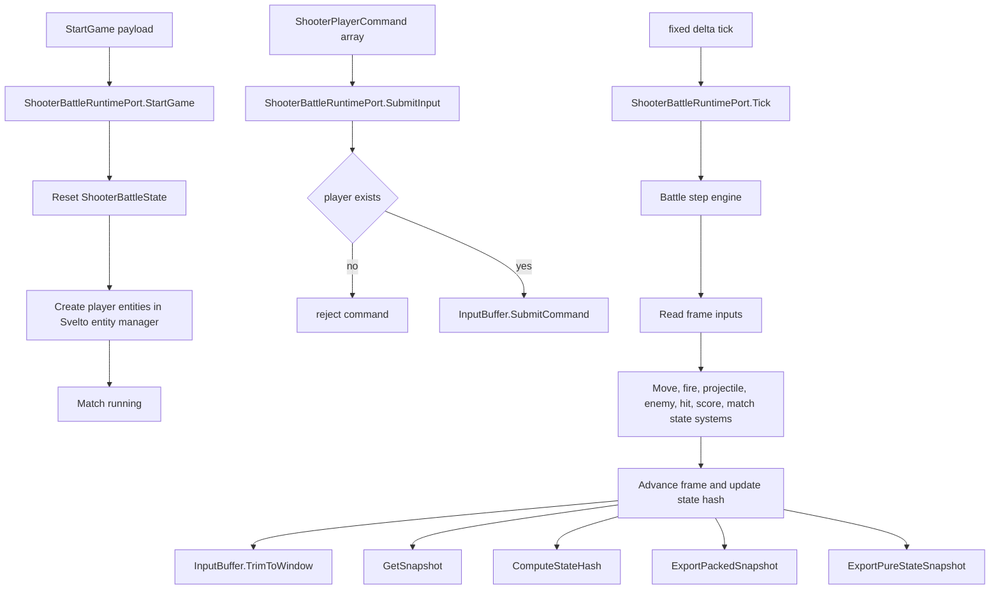
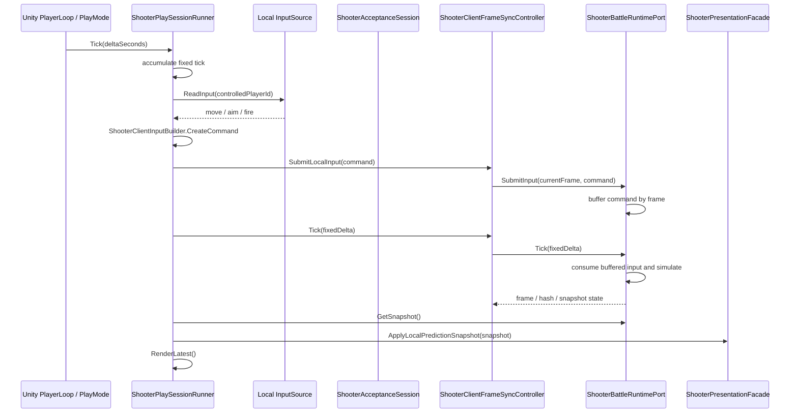
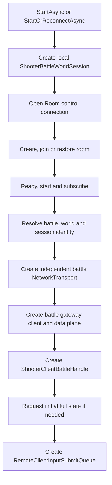
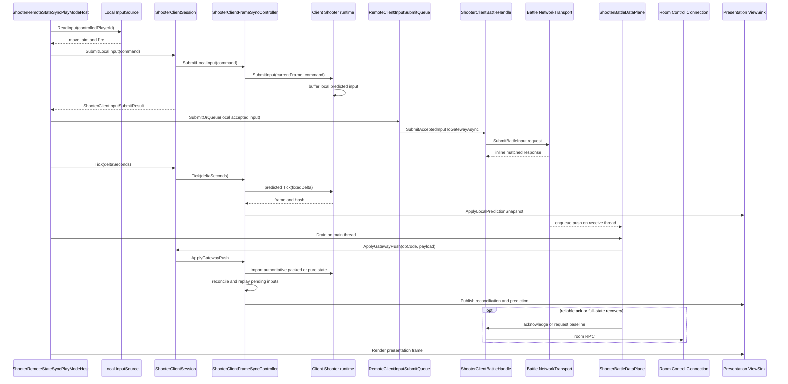
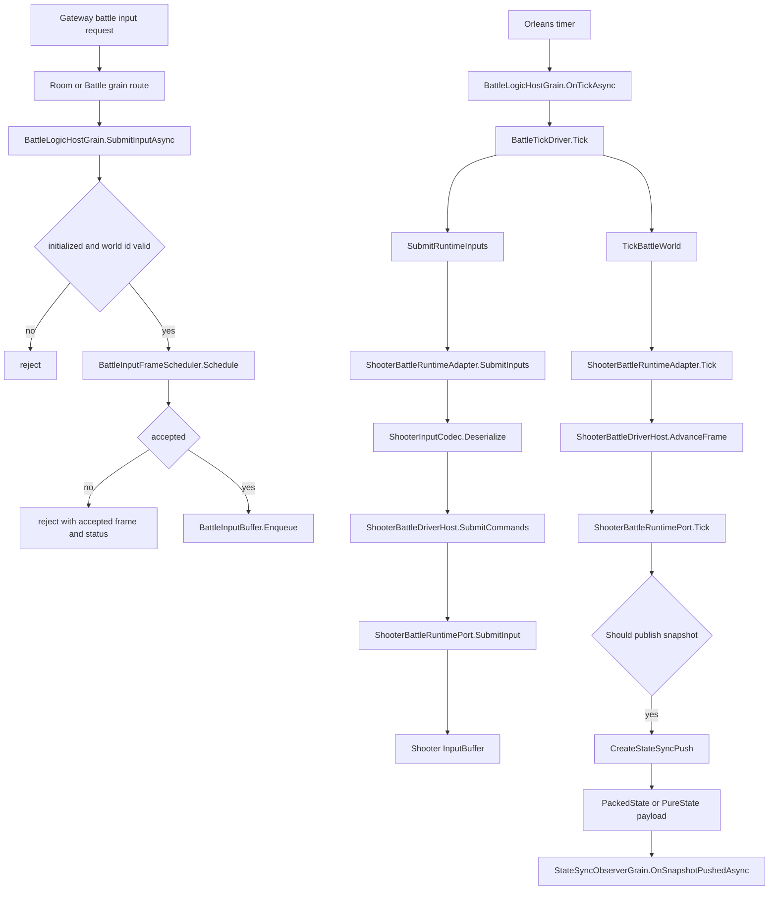
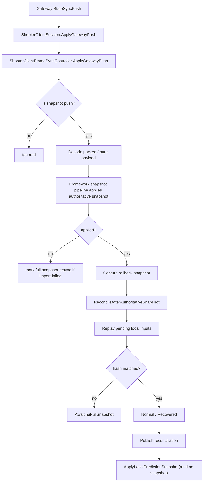

# Shooter 逻辑层流程：输入、处理、输出与单机/多人模式

> 文档类型：项目示例深潜
> 事实基线：2026-08-16
>
> 本文从逻辑层视角拆解 Shooter 示例当前实现，重点回答三件事：输入如何进入逻辑世界，逻辑世界如何处理输入并推进帧，结果如何输出到表现层或网络层。文档同时覆盖单机 PlayMode 和多人远程 PlayMode，便于对照 AbilityKit 框架的 Session / Host / Runtime 分层设计。

## 1. 结论概览

Shooter 当前不是单一同步模型，而是同一套 runtime 被不同宿主方式复用：

| 模式 | 输入入口 | 逻辑处理位置 | 输出目标 | 是否经过服务器转发输入 |
|------|----------|--------------|----------|------------------------|
| 单机 PlayMode | 本地 `InputSource` | 本地 `ShooterAcceptanceSession` / `ShooterBattleRuntimePort` | 本地 `ShooterPresentationFacade` | 否 |
| 多人远程客户端 | 本地 `InputSource` | 本地预测 runtime，同时输入经框架队列发往服务端 | 本地预测表现 + 服务端快照校正 | 是，输入经 `ShooterClientBattleHandle` 到 Gateway |
| 多人服务端权威 | Gateway / Orleans battle input | 服务端 `BattleLogicHostGrain` 内的 Shooter runtime | `StateSyncPush` 推送给 observer | 服务端是权威接收与模拟方 |

当前最关键的设计点是：Shooter runtime 本身不关心输入来自单机、客户端预测还是服务端权威。它只暴露 `StartGame`、`SubmitInput`、`Tick`、快照导出和状态哈希等端口。不同模式的差异发生在 runtime 之外的 session host、client sync controller、Gateway battle handle 和 Orleans grain 上。

## 2. 逻辑层核心边界

Shooter 逻辑层的核心端口是 `ShooterBattleRuntimePort`。它作为 world service 注册为多个接口，包括 game start、input、clock、snapshot、hash、packed snapshot 和 pure-state snapshot 端口。

核心职责分布如下：

| 职责 | 实现点 | 说明 |
|------|--------|------|
| 初始化比赛 | `ShooterBattleRuntimePort.StartGame` | 重置战斗状态，创建玩家实体，设置胜利目标和时间限制 |
| 输入接收 | `ShooterBattleRuntimePort.SubmitInput` | 校验玩家存在后，把命令写入 `ShooterBattleState.InputBuffer` |
| 帧推进 | `ShooterBattleRuntimePort.Tick` | 调用 battle step engine 推进模拟，并裁剪过期输入 |
| 普通快照 | `ShooterBattleRuntimePort.GetSnapshot` | 输出表现和诊断使用的 `ShooterStateSnapshotPayload` |
| 状态哈希 | `ShooterBattleRuntimePort.ComputeStateHash` | 用于客户端预测校正、烟测、服务端校验 |
| 网络快照 | `ExportPackedSnapshot` / `ExportPureStateSnapshot` | 输出 packed state 或 pure state，用于 Gateway/Orleans state sync |
| Bot AI | `MountBotAi` / `ClearBotAi` | 在同一逻辑世界内挂载 AI 输入来源 |

逻辑层整体流程：

这个图里，`SubmitInput` 只负责把命令放入逻辑层输入缓冲，并不直接改变表现层。真正的状态变化发生在后续 `Tick` 的固定步进中。

## 3. 输入数据结构

Shooter 逻辑输入的领域结构是 `ShooterPlayerCommand`，包含玩家 id、移动方向、瞄准方向和开火标记。网络传输时会被包装成 `ShooterInputPacket` 或框架通用 `PlayerInput`。

输入在不同层的形态如下：

| 层级 | 输入形态 | 作用 |
|------|----------|------|
| Unity / PlayMode | move / aim / fire | 从本地输入源读取的原始操作 |
| Shooter view client | `ShooterPlayerCommand` | Shooter 领域命令 |
| Shooter protocol | `ShooterInputPacket` + `ShooterInputCodec` payload | Gateway 提交使用的 Shooter 协议包 |
| 框架远程提交队列 | `ShooterClientInputSubmitResult` | 保存已被本地预测接受且等待提交到 Gateway 的输入 |
| Orleans battle | `BattleInputItem` | 服务端 battle host 缓冲和调度的输入单元 |
| Shooter runtime | `ShooterPlayerCommand[]` | 最终写入 `InputBuffer` 的逻辑命令 |

多人远程路径包含两次关键转换：

1. 客户端本地提交时，`ShooterClientInputCoordinator.SubmitLocalInput` 把命令序列化为 packet，同时提交给本地预测 frame sync。
2. `RemoteClientInputSubmitQueue` 把已接受的本地输入交给 `ShooterClientBattleHandle.SubmitAcceptedInputToGatewayAsync`，最终落到 Gateway battle input；队列负责单请求在途、最新输入替换、完成与重同步统计。

## 4. 单机 PlayMode 流程

单机入口是 `ShooterPlaySessionRunner`。它创建本地 `ShooterAcceptanceSession`，每个固定步读取本地输入，提交到本地 controller，然后推进本地 runtime，最后把快照送给表现层。

单机模式的要点：

| 阶段 | 行为 | 说明 |
|------|------|------|
| 启动 | `ShooterAcceptanceLab.Create` | 在本地创建 runtime、controller、presentation，可选创建本地 authority comparison world |
| 输入 | `InputSource.ReadInput` -> `ShooterClientInputBuilder.CreateCommand` | 输入只来自本机 |
| 提交 | `Session.Controller.SubmitLocalInput` | 写入本地 runtime 的输入缓冲 |
| 推进 | `Session.Controller.Tick` | 本地 frame sync controller 推进 runtime |
| 输出 | `Runtime.GetSnapshot` -> `Presentation.ApplyLocalPredictionSnapshot` | 直接用于本地表现 |
| 可选权威比较 | `AuthoritativeWorld` | 仅用于本地验证，不等同于服务器转发 |

因此，单机帧同步模式是在本地运行的。它不通过 Gateway，也不把输入送到 Orleans。即使启用了 authoritative comparison world，也是在本地 session 内部做对照验证。

## 5. 多人远程客户端流程

多人远程入口是 `ShooterRemoteStateSyncPlayModeHost`。它先通过 Room 控制面连接完成 create/join/restore、ready、start、subscribe，再由 `ShooterClientNetworkLauncher` 根据 battle 身份创建独立 `NetworkTransport`、`ShooterBattleTransportGatewayClient` 和 `ShooterBattleDataPlane`，最后基于 `ShooterClientBattleHandle` 创建框架 `RemoteClientInputSubmitQueue`。运行时每 tick 推进本地预测、排队提交已接受输入，并在主线程调用 data plane `Drain` 应用已入队的 battle push。

多人客户端每帧运行流程：

这里有两个容易误判的点。第一，客户端先 `SubmitLocalInput` 到本地 runtime 是预测和立即反馈需要的本地路径，不代表绕过服务器权威；真正发往服务端的路径是 `RemoteClientInputSubmitQueue` -> `ShooterClientBattleHandle` -> 独立 battle transport。第二，battle push 不是在 receive thread 直接调用 session，而是入队后由主线程 `Drain`；这样既避免网络线程与本地 Tick 竞争，也不让 awaited 输入 response 依赖主线程 pump。Shooter 的目标所有权图由业务 host、session 与 launcher 分工，不能再叠加当前源码中并不存在的 `SessionCoordinator` 实现链；但当前 remote teardown 还没有显式释放 `ShooterClientSession` 所引用的 presentation context、sync controller、reliable consumer 与 recovery coordinator，不能把“目标唯一 owner”写成已完全闭环。

## 6. 多人服务端权威流程

服务端权威入口由 Gateway 和 Orleans 房间流程驱动。Room 开战后创建 `BattleLogicHostGrain`，再由 `ShooterBattleRuntimeAdapter` 创建 Shooter logic world 和 runtime session。

服务端关键阶段：

| 阶段 | 实现点 | 说明 |
|------|--------|------|
| 初始化 | `BattleLogicHostGrain.InitializeBattleAsync` | 创建 runtime session，发布初始快照，启动 timer |
| 输入调度 | `BattleInputFrameScheduler.Schedule` | 根据当前帧和 input delay 接受、延后或拒绝输入 |
| 输入缓冲 | `BattleInputBuffer.Enqueue` | 按 accepted frame 保存 `BattleInputItem` |
| 输入转换 | `ShooterBattleRuntimeAdapter.SubmitInputs` | 将 `BattleInputItem` 解码为 `ShooterPlayerCommand` |
| 框架桥接 | `ShooterBattleDriverHost.SubmitCommands` | 统一把命令写入 Shooter runtime |
| 帧推进 | `BattleTickDriver.Tick` -> `TickBattleWorld` | 服务端固定 tick 驱动 runtime |
| 快照输出 | `CreateStateSyncPush` | 导出 packed state 或 pure-state payload |
| 推送 | `StateSyncObserverGrain.OnSnapshotPushedAsync` | 推送给已订阅客户端 |

服务端输出分两类：

| 输出 | 来源 | 用途 |
|------|------|------|
| `BattleSnapshot` | `ShooterBattleRuntimeAdapter.GetSnapshot` | 管理后台、诊断、烟测读取 actor 状态 |
| `StateSyncPush` | `ShooterBattleRuntimeAdapter.CreateStateSyncPush` | 多人客户端状态同步、全量恢复、增量更新 |

`StateSyncPush` 支持两种 payload mode：

| Payload | OpCode | 说明 |
|---------|--------|------|
| packed state | `PackedState` / `PackedStateDelta` | 基于 packed snapshot 的同步负载 |
| pure state | `PureState` / `PureStateDelta` | 支持 AOI 和预算控制的纯状态同步负载 |

## 7. 客户端接收服务端输出后的处理

客户端收到 Gateway 推送后，不直接把网络 payload 给表现层，而是先进入 frame sync controller：

这个输出处理体现了 Shooter 多人客户端的设计选择：表现层看到的是“权威校正后的本地预测 runtime 快照”，而不是原始服务端 snapshot。这样可以保留客户端输入即时反馈，同时由服务端快照负责纠偏。

## 8. 与框架设计的符合性

从当前代码看，Shooter 逻辑层符合 AbilityKit 框架的组合边界。远程 PlayMode 复用框架的带背压输入队列、阶段化 Gateway room flow、快照管线和预测回滚组件；Shooter 专用 battle handle 校验会话身份并封装输入、ack 和 full-state RPC，data plane 负责 battle push 的线程切换。

符合点：

| 框架期望 | 当前 Shooter 实现 | 结论 |
|----------|-------------------|------|
| 逻辑世界只处理领域输入和 tick | `ShooterBattleRuntimePort.SubmitInput` / `Tick` | 符合 |
| session/host 决定运行模式 | 单机 `ShooterPlaySessionRunner`，多人 `ShooterRemoteStateSyncPlayModeHost`，服务端 `BattleLogicHostGrain` | 符合 |
| 输入提交具备统一背压和诊断 | `RemoteClientInputSubmitQueue` 组合提交委托并统计 queued/replaced/failed/resync | 符合 |
| 已存在完整客户端 session 时不重复装配生命周期 | `ShooterRemoteStateSyncPlayModeHost` 持有 runtime world、launcher、launch result 和输入策略 | 符合 |
| Room 控制面与 battle 数据面分离 | launcher 在 flow 完成后创建独立 `NetworkTransport` 和 data plane | 符合 |
| Gateway 请求封装在客户端 battle handle | 输入、可靠事件 ack 和 full-state 请求均经 handle | 符合 |
| push 跨线程有明确边界 | receive thread 入队，主线程 `Drain` 后应用 session | 符合 |
| 服务端通过 driver host 适配 runtime | `ShooterBattleDriverHost` 实现 `ILogicWorldDriverBridge` | 符合 |
| 输出通过 snapshot/hash/state sync 表达 | `GetSnapshot`、`ComputeStateHash`、packed/pure state exporters | 符合 |

需要明确的边界：

| 点位 | 当前状态 | 影响 |
|------|----------|------|
| 客户端 remote 最终调用 Gateway 提交 API | 调用封装在 `ShooterClientBattleHandle`，PlayMode 只提供已接受的本地输入 | 协议细节不进入输入泵和本地预测控制器 |
| 输入队列不拥有网络生命周期 | 队列只组合异步提交委托并管理背压 | pause/reconnect/dispose 仍由唯一的 launcher/session 生命周期负责 |
| 本地预测世界 tick 独立于网络请求 | 本地预测由 Shooter client frame sync controller 驱动 | 网络延迟不会阻塞本地固定步进，权威快照负责后续纠偏 |
| 服务端 Orleans 不由客户端会话装配器创建 | 服务端由 Room/Battle grain 管理 runtime lifecycle | 符合服务器侧 Orleans 架构；当前 coordinator Package 也没有会话总装器实现 |

## 9. 流程分层判断点

评审当前流程是否符合框架设计时，核心判断点包括：

1. 逻辑层是否保持纯粹：`ShooterBattleRuntimePort` 不依赖 Gateway、Unity 输入或 Orleans observer，只接受领域命令并输出 snapshot/hash。
2. 单机是否本地闭环：`ShooterPlaySessionRunner` 的输入、tick、snapshot、render 都在本地完成，没有网络提交。
3. 多人客户端是否只有一套生命周期：远程输入通过框架队列进入现有 battle handle，没有为输入转发创建第二套 world、session 或 tick。
4. 双连接所有权是否明确：Room connection 负责控制与恢复 RPC，battle transport 负责输入和 push，二者绑定同一组身份。
5. 线程边界是否明确：输入 response inline 匹配，push 接收线程只入队，主线程 Drain 后应用。
6. 服务端是否权威：Orleans `BattleLogicHostGrain` 负责输入调度、权威 tick 和状态推送，客户端只做预测和校正。

按这些点看，当前 Shooter 示例的主流程已经符合框架分层：runtime 是领域逻辑核心，PlayMode/session 决定运行方式，框架队列、battle handle 与 data plane 负责远程数据面，Orleans battle host 负责服务端权威模拟与状态输出。当前 coordinator Package 不包含 `SessionCoordinator` 或 `ExistingWorldSessionCoordinatorHost`，因此旧接法既不是 Shooter 的采用路径，也不是可直接调用的现役扩展点。

## 10. 源码索引

| 模块 | 源码 |
|------|------|
| Shooter runtime port | [ShooterBattleRuntimePort.cs](../../../../Unity/Packages/com.abilitykit.demo.shooter.runtime/Runtime/Application/Runtime/ShooterBattleRuntimePort.cs) |
| Shooter driver host | [ShooterBattleDriverHost.cs](../../../../Unity/Packages/com.abilitykit.demo.shooter.runtime/Runtime/Application/Session/ShooterBattleDriverHost.cs) |
| 单机 PlayMode runner | [ShooterPlaySessionRunner.cs](../../../../Unity/Packages/com.abilitykit.demo.shooter.view.runtime/Runtime/PlayMode/ShooterPlaySessionRunner.cs) |
| 客户端 session facade | [ShooterClientSession.cs](../../../../Unity/Packages/com.abilitykit.demo.shooter.view.runtime/Runtime/Client/ShooterClientSession.cs) |
| 客户端 frame sync controller | [ShooterClientFrameSyncController.cs](../../../../Unity/Packages/com.abilitykit.demo.shooter.view.runtime/Runtime/Client/Synchronization/ShooterClientFrameSyncController.cs) |
| 客户端 input coordinator | [ShooterClientInputCoordinator.cs](../../../../Unity/Packages/com.abilitykit.demo.shooter.view.runtime/Runtime/Client/Session/ShooterClientInputCoordinator.cs) |
| 多人远程 PlayMode host | [ShooterRemoteStateSyncPlayModeHost.cs](../../../../Unity/Packages/com.abilitykit.demo.shooter.view.runtime/Runtime/Unity/PlayMode/ShooterRemoteStateSyncPlayModeHost.cs) |
| 远程输入提交策略 | [ShooterRemoteInputSubmitStrategy.cs](../../../../Unity/Packages/com.abilitykit.demo.shooter.view.runtime/Runtime/Unity/PlayMode/ShooterRemoteInputSubmitStrategy.cs) |
| 客户端 battle handle | [ShooterClientBattleHandle.cs](../../../../Unity/Packages/com.abilitykit.demo.shooter.view.runtime/Runtime/Client/ShooterClientBattleHandle.cs) |
| 客户端 battle data plane | [ShooterBattleDataPlane.cs](../../../../Unity/Packages/com.abilitykit.demo.shooter.view.runtime/Runtime/Client/ShooterBattleDataPlane.cs) |
| Battle transport Gateway client | [ShooterBattleTransportGatewayClient.cs](../../../../Unity/Packages/com.abilitykit.demo.shooter.view.runtime/Runtime/Client/Gateway/ShooterBattleTransportGatewayClient.cs) |
| 框架远端输入队列 | [RemoteClientInputSubmitQueue.cs](../../../../Unity/Packages/com.abilitykit.host.extension/Runtime/Client/StateSync/RemoteClientInputSubmitQueue.cs) |
| 服务端 battle host grain | [BattleLogicHostGrain.cs](../../../../Server/Orleans/src/AbilityKit.Orleans.Grains/Battle/BattleLogicHostGrain.cs) |
| 服务端 Shooter runtime adapter | [ShooterBattleRuntimeAdapter.cs](../../../../Server/Orleans/src/AbilityKit.Orleans.Grains/Gameplays/Shooter/Battle/ShooterBattleRuntimeAdapter.cs) |

## 11. 复用结论、项目边界与证据

单机、客户端预测和服务端权威共享同一个 `ShooterBattleRuntimePort`，证明 runtime 领域核心可以与宿主解耦；三种模式的 Session、输入源、网络连接、同步控制器、表现投影和恢复策略并不相同。共享 runtime 不能反推存在一套适合所有游戏的统一 Battle Application 层。

| 适合框架稳定化 | 应由项目保留 |
|----------------|--------------|
| World/Host 生命周期、输入队列、snapshot/rollback 原语、transport、同步协商与恢复契约 | 模式选择、Room 入场、双连接身份、Shooter 命令、controller/facade、表现和玩法阶段编排 |

客户端远程链必须保持 Room 控制面和独立 battle 数据面的所有权分离，并在主线程应用 push；服务端 adapter 只把协议和 Host 对接到 Shooter runtime，不把 Orleans 生命周期带入领域核心。应用层组合可作为高接入度参考，但框架层只有在语义、所有权和多个项目消费者都稳定后才适合下沉。

### 11.1 三种模式的停止责任

| 模式 | 停止 owner | 当前边界 |
|------|------------|----------|
| 单机 PlayMode | `ShooterPlaySessionRunner.Stop/Dispose` | Dispose acceptance session、清 view sink、重置计数与采样状态；静态 Host Uninstall 另行拆 PlayerLoop 与网络 hook |
| 多人远程客户端 | `ShooterRemoteStateSyncPlayModeHost` runtime state + launcher | transport/data plane/control connection 有清理；client session/presentation 依赖图仍有显式 teardown 缺口 |
| Orleans 权威服务端 | Battle/Room grain 与 runtime adapter | 生命周期由服务端 activation/timer/room 规则拥有，不能由客户端 session 推导 |

Batch N 曾记录 Shooter Runtime `489/489`、Host `3/3`、Network Client `3/3`、Network Battle `12/12`，是当时的 E3 历史基线。Batch W 后续 Shooter 全量为 `481/490`，9 项属于默认模型、acceptance 数量和 snapshot/session 旧预期漂移；聚焦 battle handle/controller factory `22/22` 通过。Batch X 的 projection/PlaySessionRunner 聚焦测试 `66/66` 通过，只直接覆盖本地 runner 与投影契约。没有运行单机/远程 Unity PlayMode 或真实 Orleans 多进程链。

*文档版本：v3.2 | 最后更新：2026-08-16*
