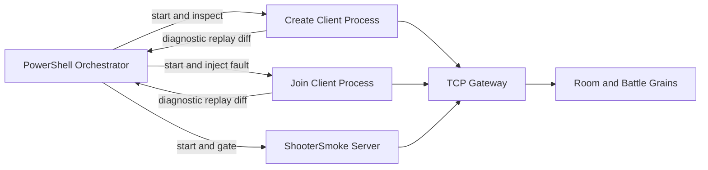
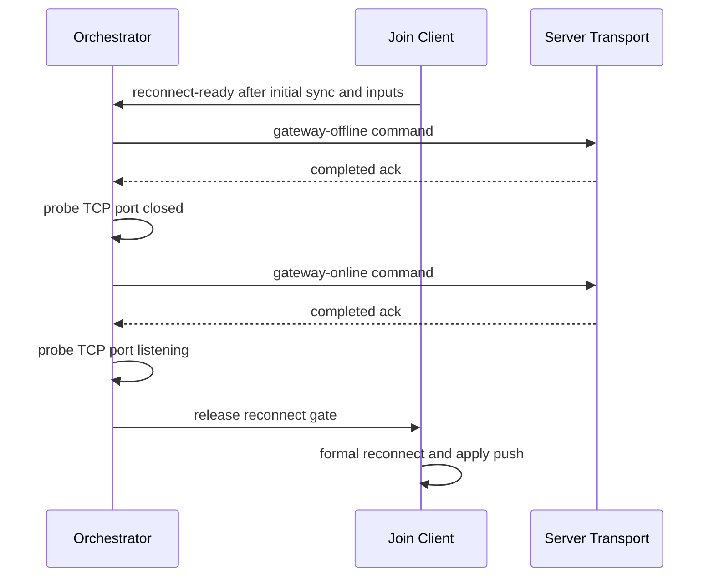

# Shooter 多进程故障矩阵与收敛证据设计

> 文档类型：项目示例深潜
> 事实基线：2026-08-16
>
> 状态：已落地并完成真实进程验证
>
> 最近验证日期：2026-07-19
>
> 事实源：`Server/Orleans/tools/run_shooter_multiprocess_smoke.ps1`、`ShooterSmokeClientProcessRunner`、版本化 run manifest 与诊断 artifact。本文的源码入口复用了 Shooter client session/data-plane 契约；源码契约测试不等于一次真实双连接故障运行。

## 1. 文档定位

本文描述 Shooter 多进程 Smoke 如何验证真实服务进程、独立客户端进程、故障注入、恢复收敛和可复现证据。它不重复 PureState 编码、客户端同步控制器或 FrameRecord 容器的内部设计；这些内容分别见：

- [PureState 预算与兴趣范围](06-PureStateBudgetAndInterest.md)
- [客户端同步策略](04-ClientSyncStrategies.md)
- [服务端流程与 Smoke](05-ServerFlowAndSmokeDeepDive.md)
- [回放系统](../../07-NetworkSynchronization/04-ReplaySystem.md)

多进程矩阵的目标不是证明“进程启动后返回零”，而是同时回答：

1. 故障是否在预定阶段真实发生。
2. 客户端是否通过正式业务入口恢复。
3. 状态流、可靠事件流和权威记录是否最终收敛。
4. 失败后是否留下足够 artifact 定位首个分歧。
5. 所有子进程和专用端口是否有界退出与释放。

## 2. 拓扑与所有权

一次场景至少包含四个角色：



Orchestrator 持有场景计划、端口、进程、超时、fault command、assertion 和 manifest。客户端只负责执行正式 create/join/input/reconnect 路径并输出结构化结果，不自行宣布整个矩阵通过。最终判定由 orchestrator 聚合完成。

Smoke runner 的客户端路径应与正式 Shooter 组合保持一致：Room 控制面完成登录、入场、订阅和恢复；独立 battle 数据面处理输入请求与 push；客户端 session/data plane 的源码契约由 `ShooterSmokeClientProcessRunnerContractTests` 锁定。该测试证明 runner 仍引用正式入口和收敛字段，但不产生 E4 运行证据。

Create 与 Join 是两个独立账号和两个真实 Room 成员，二者都走 join/ready/loading/start，因此这条多进程拓扑能够满足 Shooter 默认 `MinPlayers=2` 与全员 ready 的开战前置。默认单进程 runner 只有一个登录账号；它在本地 runtime 创建两个模拟玩家并不能替代第二名 Room 成员，也不能单独证明默认 Room 能开战。两类 runner 的人数证据不能互换。

每个场景使用独立的 TCP Gateway、Silo 和 Orleans Gateway 端口。`full` 与 `compatibility` profile 中相邻 case 的三个端口均按固定偏移隔离，避免前一场景残留污染后一场景。

## 3. 场景计划

当前 fault matrix 支持以下 profile：

| Profile | 场景集合 | 用途 |
|---|---|---|
| `minimal` | `recoverable-retry` | 快速验证重试和基本恢复链路；保持主分支反馈时延 |
| `full` | 五种故障均使用同一组顶层 payload、join 数量和网络参数 | 在固定配置下遍历完整故障集合，保持既有调用语义 |
| `compatibility` | 五个带独立 payload、join 数量和网络条件的正交 case | 定时或手动验证协议、客户端扇出、故障和弱网组合 |
| `custom` | 由 `-Scenario` 指定单场景 | 聚焦复现与开发调试 |

五类故障的设计边界如下：

| 场景 | 故障注入 | 必须观察到的恢复证据 |
|---|---|---|
| `recoverable-retry` | 第一轮 reconnect 注入 3 次可恢复 IOException/Timeout 类失败 | retry 次数与注入次数匹配，随后正式 reconnect 成功并收到新 push |
| `gateway-offline` | join 客户端完成输入后，通过 fault control command 停止 TCP transport，再恢复监听 | offline/online command 都有 ack；离线阶段端口不可达；释放 gate 后正式 reconnect |
| `slow-consumer` | PureState observer 使用 256 B/s、32768 burst、queue length 1、queue age 100 ms、drain 250 ms | 服务端出现 drop 或 coalesce；每个客户端恢复 full baseline；最终队列、baseline 与 diff 收敛 |
| `reconnect-cycles` | join 客户端连续 3 次真实关闭 connection | 每轮都重新走 join/ready/start/subscribe，入口为 `Reconnect`，每轮都有新的成功应用 snapshot push |
| `observer-reactivation` | 对正式订阅 key 请求 `DeactivateOnIdle`，等待 activation token 变化后释放 reconnect gate | token before/after 证明新 activation；客户端正式重连和重订阅后重新建立 baseline、可靠游标并收敛 |

`compatibility` 不生成 payload、客户端数量、故障和网络条件的完整笛卡尔积。它按风险正交选择以下 case，控制运行成本同时覆盖不同协议和运行压力：

| Case ID | 场景 | Payload | Join clients | 网络条件 |
|---|---|---|---:|---|
| `packed-recoverable-single` | `recoverable-retry` | Packed | 1 | 无注入 |
| `pure-state-slow-consumer-fanout` | `slow-consumer` | PureState | 2 | 无注入；服务端发送预算制造慢消费者压力 |
| `packed-gateway-offline-fanout` | `gateway-offline` | Packed | 2 | TCP Gateway 受控离线/恢复 |
| `pure-state-reconnect-cycles-fanout` | `reconnect-cycles` | PureState | 2 | 20 ms latency、5 ms jitter、0 packet loss |
| `pure-state-observer-reactivation` | `observer-reactivation` | PureState | 1 | 无注入 |

`slow-consumer` 强制使用 `pure-state`。`full` 和 `custom` 继续接受顶层 `-PayloadMode`、`-JoinClients` 与网络参数，避免改变既有脚本调用；`compatibility` 则由每个 case 独立携带这些参数。

## 4. 故障时序不能依赖猜测

故障必须发生在可证明的业务阶段。runner 使用进度行、文件 gate、fault command ack 和端口探测建立时序，不以增加固定 sleep 代替状态确认。

### 4.1 Gateway offline



离线 ack 和 TCP 端口不可达必须同时成立。仅收到控制命令返回不等于网络故障已经生效。

### 4.2 周期断线

join 客户端每轮执行以下顺序：

1. 记录当前 runtime frame 与 push count。
2. 调用真实 connection close。
3. 通过当前阶段化 Room flow 重新进入房间、ready、start 和 subscribe 流程；不依赖已删除的聚合入口。
4. 要求 entry kind 为 `Reconnect`。
5. 等待一个新的可应用 push，并要求 push count 严格前进。

三轮检查逐轮执行，不能只比较第一轮前和最后一轮后的总 push 数。这样可以阻止“第一轮恢复成功、后两轮没有真正恢复”被聚合结果掩盖。

### 4.3 Room 离线宽限是故障场景的前置契约

当前 Gateway 在真实 connection close 后不会执行 Leave，而是解除旧连接 push、异步校验 rebound/mapping，再调用 `MarkOfflineWithResultAsync()`。成员和 account-room mapping 会保留；owner 有在线 peer 时只转移 owner。runner 因此必须用 `Reconnect` 证明恢复到原 Room，不能用“重新创建一个同配置房间”冒充重连成功。

`AbandonedRoomCleanupPolicy` 从最后一名非 Bot 客户端离线起计时 1 分钟。所有真实客户端持续离线到期后，Room 会依次销毁 Battle、可能存在的 FrameSync、mapping、directory 和 room state，并进入 `Expired/AllClientsDisconnectedTimeout`。当前 scenario timeout 默认 45 秒，周期断线设计上应在该宽限内完成；如果未来扩大故障窗口超过 1 分钟，测试预期必须改为“旧 Room 被回收后重新入场”，不能仍要求原 battleId 恢复。

清理 timer 失败后至少 30 秒重试，但跨 Grain/store 非事务。故障矩阵若专门验证长期离线，应同时收集 Battle Destroy、Room directory 消失、mapping 清空和端口/进程清理证据，单一 `RoomExpired` 响应不足以证明所有运行资源已经收敛。

## 5. 分层超时

runner 将时间预算拆成不同所有权：

| 预算 | 默认值 | 约束对象 |
|---|---:|---|
| operation timeout | 30 秒 | 单次客户端/Gateway 操作 |
| startup timeout | 60 秒 | server 进程和监听启动 |
| setup timeout | 60 秒 | create/join 初始业务建立 |
| scenario timeout | 45 秒 | 故障注入与恢复阶段 |
| convergence timeout | 最多 20 秒 | 诊断 artifact 与最终收敛检查 |
| execution timeout | startup + setup + scenario + 15 秒 | 单个子场景完整生命周期 |
| global timeout | 各场景 execution timeout 之和，或显式覆盖 | 整个 matrix |

失败后不应优先增加 timeout。应先依据 manifest 的 failure stage、process timeline、fault timeline 和 first divergence 判断卡在启动、setup、故障注入还是收敛阶段。

## 6. 客户端状态推进门禁

客户端结果首先证明状态流确实发生了有效推进。

### 6.1 Packed

非终局场景要求 snapshot hash 校验成功，runtime 与 view frame 均大于零且最终字段一致。输入响应必须成功，accepted frame 不得落后于 requested frame，并包含有效 server ticks。

### 6.2 PureState

PureState 至少应用一个 full baseline。在此之后，以下任一项都可证明状态流继续推进：

- 应用一个或多个 delta。
- 报告 baseline resync request，并由后续 full baseline 恢复。
- 应用重复 full baseline。

重复 full baseline 是协议允许的推进形式，不只属于 slow-consumer。服务端可能因 reconnect、observer baseline invalidation、AOI 或发布策略重新发送 full baseline。

但“有重复 full baseline”只证明状态流推进，不等于最终收敛。最终仍必须单独满足 hash、pending baseline、reliable event 和 authoritative diff 门禁。runner 不应以场景名称决定协议结果是否合法。

如果客户端最终仍报告 PureState resync needed，而整个过程中没有 resync request，则结果自相矛盾并立即失败。

## 7. 最终收敛是组合证据

单个布尔值不能证明跨层恢复。`Assert-BoundedConvergence` 对每个客户端读取结构化 diagnostic artifact，并组合以下证据：

| 证据层 | 通过条件 | 证明范围 |
|---|---|---|
| 状态推进 | full baseline 加后续 delta、resync 或重复 full baseline | 客户端确实持续消费状态流 |
| comparable hash | 同帧、双方非零且来源明确 | 当前应用证据可比较，不误用 stale/ignored push |
| pending baseline | `pureStateLastResyncNeeded=false` | 恢复结束后没有悬挂 baseline 请求 |
| reliable events | epoch 有效、cursor 可读取、`needsResync=false` | 不可替换事件流没有 retention gap 悬挂 |
| authoritative diff | diagnostic `diff.matched=true`，通常状态为 `Identical` | 客户端 FrameRecord 与权威记录最终一致 |
| observer pressure | slow-consumer 存在 drop/coalesce，且每客户端恢复 full baseline | 压力真实发生且恢复不是空跑 |
| health | 汇总 warning/critical/highest severity | 保留质量和故障上下文，不替代正确性断言 |

这些证据互相补充：

- hash 匹配不能证明可靠事件 cursor 已恢复。
- `needsResync=false` 不能证明客户端状态与权威记录一致。
- diff 一致不能证明故障阶段真实发生。
- 进程退出码为零不能证明 replay 文件可消费。

## 8. FrameRecord 与 replay 证据链

默认情况下，每个 create/join 客户端都必须生成：

1. 完整 input-state replay。
2. minimized input-state replay。
3. diagnostic JSON。
4. authoritative diff 报告或其结构化摘要。
5. stdout/stderr 日志。

完整和 minimized replay 必须存在、非空并被验证器消费。replay 必须包含 snapshot；minimized input-state replay 不要求保留 state hash track，因为 authoritative diff 使用独立的权威/客户端记录投影完成。

manifest 在终态扫描 run 根目录下的 artifact，记录相对路径、字节数和 SHA-256。artifact 不能逃逸 run 根目录，避免并行运行之间互相引用或覆盖。

`firstDivergence` 记录第一个失败 assertion 的名称、时间和详情。它是场景级首失败锚点，不等价于 FrameRecord 内首个 divergent frame；后者由 diff artifact 提供。

## 9. Manifest 契约

每个子场景写入 schema version 2 的 `manifest.json`，状态为 `running`、`passed` 或 `failed`。plan-only 与 matrix manifest 使用 schema version 3，为每个计划项和结果增加稳定 `caseId`、payload mode、join clients 与网络条件；单场景 manifest 的既有 schema 2 契约保持不变。子场景终态至少包含：

- run id、配置、机器、起止时间。
- profile、scenario、payload mode、随机种子和全部 timeout。
- TCP/Silo/Orleans Gateway 端口组。
- server/client PID、correlation id 和日志路径。
- process timeline 与 exit code。
- fault timeline 与 command ack。
- assertion timeline 与 first divergence。
- client replay、diagnostic、diff 路径和摘要。
- reliable、observer、health 与 bounded convergence summary。
- artifact 相对路径、bytes 和 SHA-256。

manifest 使用临时文件写入后原子替换。场景运行中也持续更新 `running` manifest，使父级 global timeout 或外部强杀后仍能定位已启动进程和当前阶段。

### 9.1 TEST-01C 进程所有权与动态强杀契约（已完成）

父级 matrix timeout 不能只依赖子 PowerShell 的 `finally`。子进程被强制终止时，非监听 TCP 端口的 create/join 客户端可能仍然存活，因此实现已从 running manifest 恢复进程所有权并执行二次清理。

TEST-01C 的 running manifest 为每个已启动角色记录：

- `role`、PID、run id/correlation id。
- 进程启动时间或等价的稳定身份指纹。
- 可复核的 executable/command identity；不能只保存进程名 `dotnet.exe` 或 `powershell.exe`。
- 启动阶段和日志路径。

父级清理状态机固定为：

1. 读取目标子 run 的 running manifest，并冻结其中的 PID 候选集。
2. 先终止子 orchestrator，等待一个很短的有界窗口。
3. 对每个 manifest PID 重新读取进程身份；只有 PID、启动时间和命令身份均匹配时才允许强制终止。
4. 在所有 manifest candidate 都未出现 `identity-mismatch` 或 `termination-failed` 时，对 server/Silo/Gateway 执行专用端口探测和端口 owner 清理；身份不安全时跳过该步骤，避免第二道防护绕过所有权检查。
5. 等待所有候选 PID 退出，并记录 `terminated`、`already-exited`、`identity-mismatch`、`termination-failed` 或 `not-observed`。
6. 独立确认三个专用端口不可达且没有监听 owner，再原子收口子 manifest 和 matrix manifest。

清理证据不能覆盖原始场景失败。场景业务失败、timeout、清理失败必须分别记录；其中任一 cleanup candidate 仍存活或端口仍被占用，父级结果必须为非零。PID 复用或身份不匹配时宁可留下 `identity-mismatch` 证据并失败，也不能按宽泛命令行或进程名误杀无关任务。

真实动态强杀使用专用挂起探针：探针在 running manifest 已写入 server/create/join 后保持存活，父级用短 global timeout 触发 matrix-timeout。该测试预期 matrix 非零退出，但要求 orphan-free、port-free、manifest failed 收口和无关保护进程存活；外层 harness 将预期 matrix failure 转换为自己的验收结果。它不是业务收敛成功场景，也不纳入正常 compatibility case 数量。

## 10. 失败分类

当前分类保持简单且可执行：

| Category | Stage | 含义 |
|---|---|---|
| `PreconditionFailed` | `setup` | 场景尚未建立，或出现 409/conflict、端口占用、监听失败等前置问题 |
| `FaultRecoveryFailed` | `fault-recovery` | 场景已建立，但故障注入、恢复、收敛、replay 或清理门禁失败 |

分类的目的不是替代原始异常，而是让 CI 和矩阵汇总先区分环境/前置失败与真实恢复失败。manifest 必须同时保留原始 error message 和 first divergence。

## 11. 进程与端口治理

多进程 runner 直接执行已构建的 framework-dependent DLL。`-NoBuild` 表示场景不会再触发项目求值或隐式构建；matrix 非 `-NoBuild` 时只在父级构建一次。

清理遵循以下原则：

- 只清理本轮记录的 PID 和端口组。
- 不通过宽泛进程名杀死其他开发任务。
- server/create/join 都必须进入 process timeline 并记录 exit code。
- 场景结束后确认 TCP Gateway、Silo 和 Orleans Gateway 端口释放。
- cleanup 异常不能静默覆盖原始场景失败。

## 12. 最近真实验证快照

2026-07-19 的 TEST-01C 运行 `test-01c-20260719-172207-902-41692` 已通过专用动态强杀验收：

- running manifest 在挂起前记录 orchestrator、server、create、join 四个角色及其 PID、创建时间、可执行路径、完整命令行和 correlation id。
- 34 秒 matrix timeout 后，orchestrator 与 server 记录为 `terminated`，create 与 join 记录为 `already-exited`；独立复核没有存活的 owned PID。
- 子 manifest 使用 schema 2 并收口为 `failed/matrix-timeout`；matrix manifest 使用 schema 3、exit code `-1`，两者记录相同 cleanup evidence，原始 timeout 原因未被覆盖。
- TCP 44301、Silo 15311、Orleans Gateway 34301 均释放；独立监听检查为空。
- 无关保护 PowerShell PID 44448 在验收断言时仍存活，证明没有按进程名或宽泛命令行误杀。
- acceptance artifact 状态为 `passed`；该通过表示预期 timeout 后的所有权清理正确，不表示故障场景业务收敛成功。

同日的代表性兼容组合 `compatibility-pure-state-reconnect-fanout-20260719` 已通过。该运行使用 Debug、PureState、create 加两个 join 客户端、三轮正式 reconnect，以及 20 ms latency 与 5 ms jitter：

- join-1 每轮关闭真实连接，并重新执行 join/ready/start/subscribe；最终入口为 `Reconnect`。
- join-2 在同一战斗中并发订阅，证明多 observer/client fanout 下的状态发布与收敛。
- create、join-1、join-2 三份 authoritative diff 均为 `Identical`。
- 三个客户端均已应用 PureState full baseline，可靠事件 `needsResync=false`。
- 完整和 minimized replay 均生成、被消费并在 manifest 中记录 SHA-256。
- server 与三个客户端进程 exit code 均为 0，TCP/Silo/Orleans Gateway 端口全部释放。

同日较早的 `reconnect-cycles + pure-state + replay` 单 join 验证使用三轮真实关闭与恢复：

- join 每轮都返回 `Reconnect`。
- 每轮都有 launch returned 和 first push applied 证据。
- 总 push 从 5 前进到 9。
- create/join authoritative diff 均为 `Identical`。
- reliable epoch 一致，cursor 有效，`needsResync=false`。
- PureState pending baseline 已清除。
- 两客户端的完整和 minimized replay 共四个文件均存在、非空且已消费。
- server/create/join 均以 exit code 0 结束，三个专用端口释放。

该验证同时修正了一处 runner 断言：重复 full baseline 原先只在 slow-consumer 场景被视为合法推进，导致 reconnect 场景在 hash、diff 和 baseline 都已收敛时被误拒绝。修正后协议判定不再依赖场景名称，独立收敛门禁保持不变，也没有增加 timeout、sleep 或降低压力。

具体 run id、端口和逐次指标属于验证快照，记录在路线图和 artifact manifest，不作为长期固定值。

## 13. CI 分层与验证入口

CI 按运行成本和证据强度分层。源码契约测试、PR 快速测试、真实多进程 Smoke、兼容性矩阵、soak 与 ownership cleanup 的职责不能互相替代：

| 层级 | 入口 | 触发条件 | 证明范围 |
|------|------|----------|----------|
| E3 | `AbilityKit.Orleans.ShooterSmoke.Tests`、`shooter-fast`/`shooter-integration` | PR 与 main 的快速 workflow | 契约、集成与有限业务路径；不证明完整多进程故障收敛 |
| E5 编排入口 | workflow 中的 `shooter-multiprocess` 及 compatibility/soak/ownership-cleanup jobs | main push、schedule、manual 分层 | 证明 job、触发、failure policy 与 artifact upload 已接线；不证明某次场景实际通过 |
| E4 运行结果 | `run_shooter_multiprocess_smoke.ps1` 生成的版本化 manifest、diagnostic、replay/diff 和 cleanup evidence | 仅在对应 job/本地命令真实执行后产生 | 证明该次配置下的真实进程、故障注入和 bounded convergence |
| E4 扩展结果 | compatibility、soak 或 ownership cleanup 的当次 artifact | 对应 schedule/manual 执行 | 只覆盖该次 Packed/PureState、扇出、长稳或清理配置，不由 job 名自动获得 |

`tools/test-gates.json` 是 gate owner、scope、failure policy 与脚本入口的配置事实源；`.github/workflows/abilitykit-test-gates.yml` 是触发条件和 job 分层事实源。多进程 job 使用 `windows-latest` 和 non-cancelling concurrency group，并要求 always-upload artifact。它们构成 E5 编排证据；只有某次执行留下可回读的 manifest/replay/diff 才构成 E4 场景证据。main 上运行不等于 PR gate，schedule/manual 运行也不应写成每次提交都会执行。

```powershell
# 查看 compatibility 正交计划，不启动进程
.\Server\Orleans\tools\run_shooter_multiprocess_smoke.ps1 -Profile compatibility -PlanOnly

# 执行正交兼容矩阵
.\Server\Orleans\tools\run_shooter_multiprocess_smoke.ps1 -Configuration Release -Profile compatibility

# 使用同一组参数执行五故障 full profile
.\Server\Orleans\tools\run_shooter_multiprocess_smoke.ps1 -Configuration Debug -Profile full -PayloadMode pure-state

# 聚焦三轮周期断线
.\Server\Orleans\tools\run_shooter_multiprocess_smoke.ps1 -Configuration Debug -Profile custom -Scenario reconnect-cycles -PayloadMode pure-state
```

聚焦源码契约测试位于 `AbilityKit.Orleans.ShooterSmoke.Tests`，用于锁定 profile 计划、逐 case 参数、DLL 直启、timeout 分层、fault gate、PureState 推进、reliable/diff/replay 和 manifest 字段。它属于 E3 结构证据；只有真实运行生成的 manifest、diagnostic、FrameRecord/replay、diff 和端口清理结果才属于 E4。两者应同时保留。

## 14. 环境与后续边界

当前多进程 CI 支持边界是 `windows-latest`。orchestrator 与 gate runner 仍以 `powershell.exe` 启动子脚本，并依赖当前 Windows 进程、路径和端口清理行为；因此正交矩阵证明的是 Windows 下 Debug/Release、Packed/PureState、单/双 join 和所列网络条件兼容性，不等价于 Linux 多进程支持。增加 Linux job 前必须先完成 `pwsh` runner 选择、路径处理、进程启动、信号与端口清理的跨平台改造和真实验证。

下一批实施顺序固定为：

1. [x] 实现 TEST-01C 进程身份 helper、running manifest 字段和 cleanup evidence，不改变正常通过场景的业务断言。
2. [x] 接入父级 matrix timeout 的 manifest 驱动清理，并补充契约测试和保护进程测试。
3. [x] 运行 Windows 动态强杀探针，确认所有权清理真实生效，并接入 scheduled/manual 门禁。
4. 下一批推进多 observer 长稳、容量矩阵、长时间网络 profile 动态切换、恢复时延分布，以及超过 Room 1 分钟宽限后的整房间回收场景。
5. 非 Windows runner 和 Unity Editor 双记录时间线继续作为独立工作包，不与强杀清理混合验收。

TEST-01C 不修改单场景 manifest schema 2 的既有字段语义；新增身份和 cleanup evidence 应保持向后兼容，matrix timeout 仍使用 schema 3。所有工作复用当前 artifact、timeout、replay、diff 和 convergence 契约，不新建平行 runner。

这些工作应复用当前 manifest、artifact、timeout 和 convergence 契约，不新建平行 runner 或以更多同步模式枚举表达故障组合。当前文档不因本轮源码审计更新最近验证日期；新增日期必须来自新的真实 Smoke artifact。

## 15. 当前 gate 矩阵与本批证据声明

| Gate / Job | 当前触发 | 证据定位 |
|------------|----------|----------|
| `shooter-fast` | Pull Request、main Push | Runtime、Network Runtime、Demo Common、Record、AOI 等快速 E3/E5 编排 |
| `shooter-integration` | Pull Request、main Push | Gateway、Grains 与 Shooter Smoke 契约测试 |
| `shooter-multiprocess` | main Push、Schedule、Manual | TEST-01B minimal 真实多进程 |
| compatibility / soak / ownership cleanup | Schedule、Manual | 高成本矩阵、长稳和进程清理 |
| `shooter-performance` smoke | Pull Request、main Push | 低成本阈值回归 |
| `shooter-performance` full | Schedule、Manual | 完整性能 profile |
| regression | Schedule | 更宽回归集合 |

2026-08-16 的 Batch N 曾运行五个聚焦工程共 515 项通过，Batch U 又执行 Gateway `162/162`、Grains `232/232`、Shooter Smoke Harness `33/33`。Batch W 当前重跑 Shooter Runtime 为 `481/490`，并以 battle handle/controller factory 聚焦 `22/22` 确认本页引用的恢复与工厂局部契约；9 项失败是默认 template/profile、矩阵数量、snapshot apply 类型与 session 旧预期漂移。以上都仍是 E3 源码契约与局部行为证据，不是本篇多进程矩阵的一次新运行。Batch W 未执行 multiprocess、compatibility、soak、ownership cleanup 或 Unity PlayMode；因此“最近真实验证快照”仍严格保留 2026-07-19，不把测试日期改写为 E4 artifact 日期。

上表记录的是 workflow/gate 的 E5 编排入口，不表示 2026-08-16 已产生对应 E4。本文第 12 节保留的 2026-07-19 manifest/replay/diff 才是最近一次真实 E4；后续更新必须同时给出 run id、配置和可回读 artifact。

Shooter 的 runner、故障计划、收敛字段和双连接组合属于项目级验收套件。框架可复用的是 transport、同步/恢复原语和证据分层方法，不应把 Shooter 场景矩阵当作所有战斗项目的开箱即用应用层。

*文档版本：v3.2 | 最后更新：2026-08-16*
