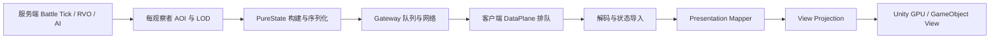

# Shooter 千单位状态同步与渲染优化

> **文档类型：项目级性能设计与验证记录**
> **事实基线：2026-08-19**
> **适用范围：Shooter 的 1000 至 2000+ 单位服务端模拟、AOI/PureState 分发、客户端状态投影和 Unity 表现；不代表所有目标硬件已经稳定达到 2K 60 FPS。**

## 一、目标与结论

Shooter 单局可能出现一千以上单位。这个规模下，性能问题不是单一算法问题，而是服务端模拟、按观察者快照构建、序列化、网络排队、客户端解码、状态投影和 Unity 渲染共同形成的端到端预算问题。

本轮优化形成了以下主路径：

1. AOI Delta 从“可见实体近似全量发送”改为按观察者抑制未变化状态，并保留周期刷新和生命周期事件。
2. Mapper、变长 payload codec 和 Projection 的稳态托管分配降为 `0 B`。
3. Projection 融合同实体的 Entity/Transform 变更，减少重复 Dictionary 查找。
4. GPU Instanced View 改为 stable slot、增量矩阵更新和局部 ComputeBuffer 上传。
5. headless、多网络环境矩阵和 allocation gate 增加阶段直方图、后端诊断和明确预算门禁。
6. RVO 保持 Managed 语义基线，仅用 Jobs/Burst 加速邻居收集，并复用 Persistent Native 缓冲区。

当前证据已经证明 2000 实体同步流水线可在预热后保持零分配，5% 变化场景的 payload 相对旧伪全量夹具下降约 `94.9%`。它还不能替代真实目标机器上的双客户端 GPU 长时 PlayMode 数据；2K 稳定帧率仍需结合 GPU、主线程其他系统和网络环境逐场验收。

## 二、必须分层看待性能预算



这条链路至少包含四类不同所有权：

| 层 | 主要成本 | 不能由什么结果替代 |
|---|---|---|
| 服务端模拟 | RVO、AI、战斗系统、Tick 漂移 | 客户端帧率不能证明服务端 Tick 稳定 |
| 状态分发 | AOI、LOD、Delta 构建、序列化、观察者扇出 | 单观察者 codec benchmark 不能证明 64 observer 成本 |
| 客户端投影 | 排队、decode、import、Mapper、Projection | headless pipeline 的低耗时不能证明 Unity 渲染性能 |
| Unity 表现 | Matrix 构建、ComputeBuffer 上传、DrawCall 或 GameObject 更新 | generated csproj 编译通过不能证明画面、GPU 时序或 soak |

因此“2K 单位同步通过”必须说明具体通过的是哪一层、哪个后端、哪种网络条件和什么统计窗口。不能把某一层的平均值扩张为整个单局的 P99 或帧率承诺。

## 三、优化前的主要瓶颈

### 3.1 RVO2 Job 耗时和 GC

2K 模式下 Unity Profiler 首先暴露出 RVO 邻居收集 Job 的长耗时和较多 GC。根因不仅是 Job 调度，还包括大规模邻居候选、稳定排序、Native/Managed 数据搬运和缓冲区生命周期。若每帧重建 Native 容器，Jobs 的并行收益会被分配、清理和同步点抵消。

当前方案不把整个 ORCA 求解迁移到 Job。Managed 求解器仍定义语义，Jobs/Burst 只负责空间哈希和邻居收集；Native buffer 使用 Persistent 生命周期复用，输出在托管侧校验，异常或无效结果同帧回退 Managed。完整设计见 [Shooter RVO 与 Jobs 邻居加速](../../13-FrameworkCore/06-ShooterRvoAndJobsAcceleration.md)。

### 3.2 AOI 按观察者重复构建

服务端 `BattleLogicHostGrain` 推进世界后，AOI 模式会为每个观察者同步构建和序列化状态。观察者数和可见实体数同时增长时，成本近似按二者乘积放大。异步投递只能减少 Gateway 下游等待，不能消除 Grain Tick 内已经发生的候选选择、排序和序列化。

旧路径还会把大量静止实体作为普通 Update 重复发送。即使只有 5% 实体变化，CPU、payload 和客户端 Projection 仍可能按全部可见实体付费。

### 3.3 固定和变长数据分配

已定位的分配源包括：

- `ShooterSnapshotViewModelMapper` 每批固定分配 `1,708 B`。根因是 7 个池化 List 每次 `Get` 都在 `ConditionalWeakTable` 重建归还句柄和闭包，不是 List 容量不足。
- encode 为精确 payload 长度创建副本；decode 通过 MemoryPack 数组反序列化创建变长数组。
- Projection 使用“现有实体数 + EntityChange 数”预扩容。2000 个已存在实体的全量 Update 被误判为 2000 个新增实体，导致 5 个 Dictionary 和稠密数组向约 4000 容量扩张，单次产生约 `122 KB` 分配。

### 3.4 Projection 重复查找

同一批次中 EntityChange 和 TransformChange 通常索引对齐且 Key 相同。旧实现分别遍历两组变更，对同一实体执行重复的 Dictionary 定位和实例更新。全量刷新时，这个常数成本会被实体数放大。

### 3.5 GPU 后端仍按全量付费

旧 GPU Instanced 后端每收到 Batch 都会：

1. 清空 Player、Bullet、Enemy 三类 Matrix List；
2. 扫描完整 DenseStore；
3. 重建所有 Matrix；
4. 对 ComputeBuffer 执行全量 `SetData`。

因此 2000 实体中仅 100 个变化时，CPU Matrix 构建和 GPU 上传仍按 2000 个实体计费。GameObject 后端还会叠加对象生命周期、Transform、Renderer 和层级管理成本，不适合作为高密度目标后端。

## 四、服务端 AOI 与 Delta 优化

### 4.1 按观察者保存最后发送状态

服务端为每个 AOI 观察者保存最后一次已发送的量化实体状态。状态比较使用网络真正传输的量化结果，避免浮点细微变化造成无意义 Delta。

发送规则如下：

| 变更类型 | 发送策略 |
|---|---|
| Spawn / Enter | 始终发送，建立观察者可见状态 |
| Leave / Despawn | 始终发送，保证客户端删除 |
| 普通 Update | 量化位置、速度、HP、Score、Lifetime、Owner 或 Flags 变化后才进入发送候选 |
| 长时间静止实体 | 周期刷新，避免旧 Delta 被背压淘汰后永久不自愈 |

变化实体仍受 Near/Mid/Far LOD 最小发送间隔约束。静止实体的周期刷新间隔使用：

```text
min(BaselineIntervalFrames, LowFrequencyIntervalFrames)
```

这不是可靠传输的替代品，而是在当前 Delta/背压契约下提供有界自愈机会。

### 4.2 游标和排序成本

预算游标按“实际扫描实体数”推进，不按“成功发送实体数”推进。否则大量静止或尚未达到 LOD 间隔的实体会让扫描起点长期停留，后部实体可能饥饿。

只有候选超过预算、确实需要裁剪时才进行优先级排序。候选未超预算时跳过每观察者 `O(N log N)` 排序，直接保留稳定扫描结果。

### 4.3 DataPlane 安全追帧

Delta 依赖 baseline，不能像独立帧一样任意丢弃。`ShooterBattleDataPlane` 仅在完整 baseline 到达时安全淘汰队列中更旧的 Full/Delta，使客户端在主线程暂时落后后可以追到最新完整状态。没有新 baseline 时，仍必须保留 Delta 依赖关系或触发 resync。

## 五、可见延迟与输入背压

### 5.1 插值缓冲不是网络 RTT

`mass-battle-lod-aoi` 原插值延迟为 90 帧。在 60 Hz 下，仅播放缓冲就引入约 `1.5 s` 的固定可见延迟，即使网络 RTT 很低，玩家仍会观察到远端单位明显滞后。

当前该 profile 使用 3 帧插值延迟，并每 3 帧发布一次 observer AOI 快照。在 30 Hz 逻辑频率下，基础播放缓冲从约 `333 ms` 降到约 `100 ms`。近/中/远 LOD 分别为 `3/9/30` 帧：只把玩家附近单位提升到 10 Hz，中远距离仍由分层频率和 2048 active budget 控制。长期方案仍应根据 snapshot arrival jitter 自适应维持约 1 至 2 个可用样本。

诊断时必须区分：

- input RTT 是输入请求往返耗时；
- snapshot source age 是服务端打戳到客户端应用的端到端状态年龄；
- interpolation delay 是客户端为了平滑播放主动落后的时间；
- frame age 是客户端当前帧与最后收到权威帧的差值。

只测 RTT 无法解释插值缓冲造成的可见延迟。

### 5.2 远程输入有限并发窗口

旧远程输入队列只允许一个 RPC 在途，有效提交频率上限近似 `1 / RTT`。例如 RTT 为 `100 ms` 时，即使客户端 60 Hz 采样，也只能完成约 10 次提交/秒。

Shooter 当前使用 4 请求有限窗口，100 ms RTT 下理论吞吐上限提高到约 40 次/秒。窗口满时不无限堆积历史移动输入，而是保留并合并最新输入；Fire 边沿必须独立保留，不能被后续移动状态覆盖。这一策略限制内存和陈旧输入，同时避免无界并发压垮 Gateway。

## 六、零分配数据路径

### 6.1 Mapper 对象首次注册

池化 List 的归还句柄改为对象首次使用时注册。后续 `Get/Return` 只复用已建立的对象和句柄，不再为每批重建闭包。预热并稳定容量后，Mapper 固定 `1,708 B` 分配被消除。

### 6.2 可复用 codec backing buffer

encode 使用可复用 backing buffer，并以 `ArraySegment<byte>` 暴露有效区间，不再复制出精确长度数组。decode 使用倍增容量数组和有效前缀计数，`0 -> N -> 0` 的实体数量变化不会在每次解码时创建新数组。

这里的 `0 B` 是稳态定义：首次初始化、容量增长、异常诊断和测试框架自身分配不属于预热后的热路径结论。

### 6.3 Projection 按真实新增数扩容

Projection 先判断理论容量是否不足，只有需要增长时才统计真正新增且存活的实体。已存在实体的 Update 不再推动 Store 扩容，避免 2000 实体周期全刷触发约 `122 KB` 的错误增长。

## 七、Projection 融合

`ShooterViewEntityStore.UpsertEntityAndTransform` 将索引对齐、Key 相同且存活的 EntityChange/TransformChange 合并为一次 Store 定位和一次实例更新。

融合只是 fast path，不能改变输入容错语义：

- EntityChange 与 TransformChange 错序时走原有 fallback；
- 变更集合稀疏时分别应用存在的组件；
- 死亡 Player 同批仍有 Transform 时保留现有恢复行为；
- Key 或索引不匹配时不能错误融合或丢弃更新。

定向回归位于 `src/AbilityKit.Demo.Shooter.Runtime.Tests/Presentation/ShooterProjectionFusionTests.cs`，覆盖对齐融合、错序回退和死亡玩家恢复。

## 八、GPU Instanced View 增量设计

### 8.1 Stable slot

Player、Bullet、Enemy 分别维护 `EntityKey -> slot` 映射。新增实体追加 slot；Transform Delta 只重算对应 Matrix；删除使用 swap-remove，并同步修正被搬移实体的 slot。这样 slot 数组保持稠密，绘制不需要扫描空洞。

### 8.2 局部上传与退化策略

脏 slot 排序合并为连续区间，Indirect 路径对每个区间调用局部 `ComputeBuffer.SetData`。每批最多使用 16 个局部区间；超过阈值后退化为一次全量上传，避免大量细碎驱动调用反而增加 CPU 成本。

以下变化仍要求全量重建：

- Full replace 或重连后的完整视图替换；
- `WorldScale` 改变；
- `ControlledPlayer` 改变；
- buffer 容量变化或渲染资源重建。

`DrawAuthorityOverlay=false` 时仍保留 authority projection 诊断，但不再构建 authority Matrix、上传 authority ComputeBuffer 或发出无效 DrawCall。

### 8.3 可观测性

GPU View diagnostics 记录：

| 指标 | 用途 |
|---|---|
| backend / indirect | 确认实际选择的后端和 Indirect 能力 |
| full rebuild count | 确认 baseline、参数变化或资源重建路径被覆盖 |
| incremental batch count | 确认普通 Delta 走增量路径 |
| indirect upload pass count | 统计发生实际上传的批次 |
| upload call / uploaded matrix count | 区分驱动调用次数和数据规模 |
| full buffer upload count | 识别局部更新退化为全量的频率 |
| partial upload range count | 观察脏区离散程度 |
| entity count | 将上传成本与当前表现实体规模关联 |

Profiler marker 包括：

- `AbilityKit.Shooter.View.GpuInstanced.ApplyInstanceDelta`
- `AbilityKit.Shooter.View.GpuInstanced.RebuildInstanceBuffer`
- `AbilityKit.Shooter.View.GpuInstanced.UploadIndirectBuffer`
- `AbilityKit.Shooter.View.GpuInstanced.DrawBuffer`

2048 slot、每轮约 5% 更新的 64 轮定向测试在预热后为 `0 B`，并有 swap-remove 与脏 slot 正确性回归。该结果证明数据结构热路径，不等于真实 GPU 渲染帧率。

## 九、端到端指标与定位方法

热路径使用固定桶直方图，记录时不创建 List、字符串或 LINQ 枚举。结果写入 owner/member 的 headless JSON。

| 指标组 | 关键指标 |
|---|---|
| 调度与网络 | Editor update gap、snapshot arrival gap、input RTT 的 P50/P95/P99/max |
| DataPlane 队列 | depth、peak depth、oldest age、queue wait P95/P99 |
| 应用成本 | push decode/apply P95/P99、payload bytes、source age P95/P99 |
| Unity 帧阶段 | frame、Launcher、Session Tick、Presentation Build、View Render 的 P50/P95/P99 |
| 稳定性 | 每帧 GC 平均/最大、超过 33.333 ms 的 hitch 数与比率 |
| 新鲜度 | 当前客户端帧与最后收到快照帧的 frame age |

source age 使用服务端 UTC 打戳到客户端应用完成的时间，只在两端时钟已同步时具有端到端延迟意义。

诊断优先级：

| 现象 | 优先排查 |
|---|---|
| `Launcher P95` 与 `PushApply P99` 同时高 | codec、状态导入、Mapper、Projection |
| `QueueWait P99` 高而 `PushApply P99` 低 | 主线程消费不足或同一 PlayerLoop 中其他系统长期占帧 |
| `ViewRender P95` 高 | Matrix/ComputeBuffer 上传、GameObject、Transform、Renderer |
| `SnapshotArrivalGap P99` 高 | 服务端 Tick、按观察者构建、序列化、Gateway 队列、网络抖动 |
| Frame P95 高而上述阶段都低 | RVO、AI、物理或其他未分段系统 |
| frame age 持续增长 | 客户端消费速率低于推送速率，需要降频、预解码或在 full baseline 追帧 |

## 十、测试体系

### 10.1 同步流水线 allocation gate

```powershell
.\tools\run_shooter_sync_allocation_gate.ps1 `
  -Entities 2000 `
  -MaxP99Milliseconds 16.7
```

门禁包含空 Delta、每帧 5% 实体变化和周期刷新三类场景，并输出 `MeanEntityDeltas`、`PayloadBytesPerEntityDelta`、`UnchangedSuppressionRatio` 与 `ObservedMaxEntityAgeFrames`。这组指标用于区分真实变化成本、伪全量 Delta 和周期自愈成本。

### 10.2 多网络环境矩阵

```powershell
.\tools\run_shooter_sync_performance_matrix.ps1 `
  -ViewBackend gpu
```

矩阵覆盖不同实体预算和 Ideal、Mobile 4G、Poor WiFi、Limited Bandwidth 等网络环境。`-ViewBackend` 会透传到每个多人场景，使 GameObject 与 GPU 结果不能被混记。

### 10.3 双客户端 Unity headless

```powershell
.\tools\run_shooter_unity_headless_multiplayer.ps1 `
  -EnemyBudget 2000 `
  -NetworkEnvironmentId mobile4g `
  -ViewBackend gpu
```

GPU 模式不能传 `-nographics`，否则无法验证真实图形设备和上传路径。AOI 视图生命周期从 View diagnostics 读取，不再通过查找 GameObject 推断。

GPU gate 至少要求：

1. owner/member 实际 backend 与请求一致；
2. full rebuild count 至少为 1；
3. incremental batch count 至少为 1；
4. Indirect 可用时，upload pass、upload call 和 uploaded matrix 均大于 0。

### 10.4 回归测试和证据边界

Shooter Runtime、AOI benchmark、Projection 定向测试与 Unity generated projects 分别验证纯托管语义、容量/零分配、融合回退和 Unity 编译契约。它们不能互相替代：

- headless pipeline benchmark 不包含 Unity rendering；
- Unity generated csproj `0 error` 只证明当前编译契约；
- 真实双客户端 GPU E2E 需要 Unity Editor 未占用工程时独立运行；
- 历史 artifact 只能证明生成它时的代码、机器和 profile，不能当作本次新 E4 结果。

## 十一、当前性能结果

### 11.1 2000 实体 Debug allocation gate

本批三场景均为预热后稳态 `0 B`：

| 场景 | P99 | 稳态分配 |
|---|---:|---:|
| 空 Delta | `6.338 ms` | `0 B` |
| 每帧 5% 实体变化 | `6.151 ms` | `0 B` |
| 每 8 帧周期刷新 | `8.306 ms` | `0 B` |

这组结果包含 Debug 构建和门禁脚本自身定义的完整流水线阶段，应与更窄的 AOI 或 Projection microbenchmark 分开比较。

### 11.2 Delta payload

2000 实体中每帧约 5% 即 100 个实体变化时，平均 payload 从旧伪全量夹具约 `144,089 B` 降至 `7,289 B`，下降约：

```text
(144089 - 7289) / 144089 = 94.9%
```

空 Delta、5% 变化和周期刷新的 exporter、encode、decode、Mapper、Projection、release 阶段均达到稳态 `0 B`。

### 11.3 Projection 融合复测

2000 实体、每 8 帧刷新、512 测量样本：

| 阶段 | 优化前 Mean / P95 / P99 | 优化后 Mean / P95 / P99 | 分配 |
|---|---:|---:|---:|
| Projection | `0.190 / 1.440 / 2.293 ms` | `0.152 / 0.753 / 3.005 ms` | `0 B` |
| Total | `1.565 / 3.743 / 20.144 ms` | `2.725 / 5.206 / 8.752 ms` | `0 B` |

Mean 和 Total P99 改善，但 Projection P99 并非单调下降。这说明尾部仍受到机器调度、GC 之外的系统噪声或少量全刷样本影响，不能只看单个分位点决定再次重构 Store。

此前一次 `Projection P99 = 9.451 ms` 仅来自 8 个全刷样本，样本量不足以支持结构性结论。扩展到 512 样本后，Projection P95 低于 `1 ms`，总 P99 低于 `16.7 ms`；后续应保留原始分布和全刷样本标签，而不是只比较一行 P99。

### 11.4 AOI 扇出历史基准

10000 实体、64 observer 的 steady AOI 历史结果约为 `9.013 ms/tick`、`0 B/tick`。它证明特定 benchmark 下的构建热路径，不包含完整 Orleans 调度、Gateway 网络、客户端应用和 Unity 渲染。

## 十二、本批验证状态

截至事实基线日期，已完成：

| 验证 | 结果 |
|---|---:|
| Shooter Runtime | `522/522` |
| Core | `126/126` |
| AOI benchmark | `14/14` |
| Projection 定向测试 | `44/44` |
| Unity Shooter View Runtime generated project | `0 error` |
| Unity Shooter View Editor generated project | `0 error` |
| Debug 三场景 allocation gate | 全部 `0 B` 且 P99 低于 `16.7 ms` |

Release allocation gate 尚未形成有效结果：构建在 Shooter benchmark 启动前被当前工作区中 `AbilityKit.Core` 的 Public API analyzer 错误 `RS0016/RS0017` 阻塞，涉及 `ObjectPoolOptions` 和 `PoolKey`。这属于测试前置构建失败，不能记录为 Shooter 性能失败，也不能记录为 Release gate 通过。

真实双客户端 GPU headless 本批未运行，因为 `Unity` 与 `Unity-Instance2` 工程当时被 Unity Editor 占用。未强制关闭用户 Editor，因此当前只具备 runner 契约和生成工程编译证据，不具备新的 GPU E4 artifact。

## 十三、源码与脚本入口

| 主题 | 入口 |
|---|---|
| PureState 导出与 AOI Delta | `Unity/Packages/com.abilitykit.demo.shooter.runtime/Runtime/Application/Synchronization/ShooterPureStateSnapshotExporter.cs` |
| PureState codec | `Unity/Packages/com.abilitykit.protocol.shooter/Runtime/PureStateSync/ShooterPureStateSyncCodec.cs` |
| 客户端 DataPlane | `Unity/Packages/com.abilitykit.demo.shooter.view.runtime/Runtime/Client/ShooterBattleDataPlane.cs` |
| ViewModel Mapper | `Unity/Packages/com.abilitykit.demo.shooter.view.runtime/Runtime/Presentation/ShooterSnapshotViewModelMapper.cs` |
| Projection | `Unity/Packages/com.abilitykit.demo.shooter.view.runtime/Runtime/Presentation/View/ShooterSnapshotViewProjection.cs` |
| View Store | `Unity/Packages/com.abilitykit.demo.shooter.view.runtime/Runtime/Presentation/View/ShooterViewEntityStore.cs` |
| Unity View 后端 | `Unity/Packages/com.abilitykit.demo.shooter.view.runtime/Runtime/Unity/PlayMode/UnityShooterViewBackends.cs` |
| Projection 融合测试 | `src/AbilityKit.Demo.Shooter.Runtime.Tests/Presentation/ShooterProjectionFusionTests.cs` |
| Unity 多人 runner | `tools/run_shooter_unity_headless_multiplayer.ps1` |
| 同步性能矩阵 | `tools/run_shooter_sync_performance_matrix.ps1` |
| allocation gate | `tools/run_shooter_sync_allocation_gate.ps1` |

## 十四、采用边界与下一步

### 14.1 当前可采用结论

- PureState 热路径应默认抑制观察者未变化实体，并保留生命周期事件和周期刷新。
- 2000 实体同步流水线可以把 steady-state GC 作为硬门禁，而不是只监控平均分配。
- 高密度 Unity 表现应使用 GPU Instanced 后端；GameObject 用于功能调试和兼容回退。
- Projection 和 GPU View 必须消费真实 Delta，不能在客户端重新退化为全量扫描和上传。
- 平均值、P95、P99、样本数、构建配置、后端和网络 profile 必须一起保存。

### 14.2 后续优先级

1. 在目标机器运行 2K 双客户端 GPU PlayMode soak，采集四个 GPU marker、Frame P95/P99、GC/frame、上传范围、画面正确性、重连和退出清理。
2. 若 `PushApply P99` 主导，评估在后台线程预解码 wire/payload，只在主线程提交不可并行状态变更；必须先定义 buffer 所有权和取消语义。
3. 若 `SnapshotArrivalGap P99` 主导，采集服务端 `ServerPerformance` 窗口中的 achieved tick rate 与 Tick/build+serialize/delivery histogram，区分模拟、观察者构建、序列化和投递。固定内存统计与结构化日志已于 2026-08-21 落地，仍需在新服务进程上完成 1K/2K 实测。
4. observer 数继续增长时，缓存观察者间可共享的分层快照或候选结果，减少重复扫描；不能共享带观察者私有 baseline 的最终 Delta。
5. 插值延迟根据 arrival jitter 自适应维持约 2 至 3 个快照样本，避免再次使用固定的大帧数掩盖抖动。
6. 为 RVO 建立 64/128/512/2048 agent 的正式性能曲线，分别记录 Managed、Jobs 邻居收集、完整 Solve、GC 和主线程同步点。

## 2026-08-21 follow-up: 1,000-unit E4 evidence and hot-path fixes

The authoritative tick no longer calls the full `GetWorldDiagnostics()` path to
produce its per-frame state hash. Shooter sessions implement a small
`ComputeStateHash()` fast path; the diagnostic dictionary/entity lists remain
available only through the explicit diagnostics API. This keeps inspection
objects and formatted strings out of the 30 Hz hot path.

Shooter stage timing is installed once after runtime startup. The cached delegate
and idempotent sink setter avoid per-tick delegate churn. The server window reports
`WorldTick`, `EnemyMovementIntent`, `RvoSolve`, snapshot build/delivery, and the
fixed 150-tick percentile summaries. A focused test verifies named stage mapping
and the zero-allocation recording gate.

Two fresh ideal-network, 1,000-enemy observer runs are recorded below:

```text
artifacts/shooter-worldtick-hash-stage-e4-1000-ideal/20260821-074940-426
artifacts/shooter-worldtick-hash-stage-e4-1000-ideal-repeat/20260821-080113-258
```

The first run is a failed acceptance artifact: member input was delayed during
cold startup and the member left before the requested frame was accepted. It is
useful failure evidence, not a performance pass. The repeat passed the structural
AOI/LOD acceptance. Its stable server window reached `28.77 Hz` (the other
window reached `29.52 Hz`), with `RvoSolve` about `2.21-3.00 ms` and
`EnemyMovementIntent` about `1.62-1.87 ms`. Both clients reported `0 B/frame`
GC, zero unexplained backward movement, and no resync request. P95/P99 snapshot
gaps were approximately `220-245/374 ms`; playback starvation remained about
`23-25%`. This validates bounded correction and continuity, but does not claim a
stable 30 Hz authority or solved starvation.

The transport adapter now forwards caller timeout/cancellation to
`NetworkTransport.SendInputAsync`. Non-cancellation failures return a typed
`TransportError` result with the exception message instead of an indistinguishable
empty response. This makes cold-start authentication and disconnected-input cases
visible in headless artifacts and avoids treating them as authoritative rejections.

The next gate is a repeated pre-warmed run, followed by sample-block playback
tuning. Compare starvation against arrival-gap and server-window fields; do not
increase interpolation delay solely to make a single run pass.

Additional repeats exposed the difference between structural acceptance and a
strict client performance gate:

```text
artifacts/shooter-worldtick-hash-stage-e4-1000-ideal-r3/20260821-082518-175
artifacts/shooter-worldtick-hash-stage-e4-1000-ideal-r3-tuned/20260821-082737-192
```

Both completed the AOI lifecycle and accepted all 18/18 inputs. The first had
`0.24-0.55%` playback starvation but a single `39.5 ms` P99 apply spike. The
second had `0.73-1.30%` starvation, up to `49 ms` P99 apply, and a queue peak
of `18`; it failed
the default peak-depth gate while still reporting `0 B/frame` GC and no resync.
Those are intermittent client scheduling/queue outliers, not evidence that the
multi-sample stream is continuously starving. Keep the default gates strict and
report these artifacts as diagnostic failures until repeated runs establish the
cause.

## 2026-08-21 follow-up: push decode and reliable-event allocation path

The live client push path now decodes a state snapshot exactly once. `ShooterClientSession`
maps the wire envelope to `ShooterGatewaySnapshot`, including `EventWatermark`, then passes
the decoded value to the selected synchronization controller. The controller retains its
payload-based API for compatibility, but the session no longer deserializes the same full or
delta snapshot once for recovery metadata and again for state application. The payload bytes
are retained only for diagnostics that need to reproduce an import mismatch.

Reliable-event delivery has a matching fast path. The production session uses
`ConsumeAndDispatch`, which invokes the event sink without allocating a
`CommittedEvents` list for every push. The existing `Consume` API still collects and returns
the committed list for tests, replay, and tooling, so the observable contract for those
callers is unchanged. Headless artifacts now expose reliable-event apply `P50/P95/P99/max`
alongside the existing count, allowing a one-off JIT or scheduling spike to be distinguished
from a persistent per-batch cost.

Focused regression coverage verifies event dispatch without list materialization and preserves
the snapshot event watermark. The next 1,000-unit run should compare the new reliable-event
percentiles with `FullBaseline` and `Delta` apply histograms; a lower aggregate P99 with
unchanged delta P99 indicates that the removed duplicate decode/allocation was the source of
the discrete client spikes.

The first post-change 1,000-unit ideal-network run completed the AOI lifecycle and accepted
all inputs:

```text
artifacts/shooter-push-kind-diagnostics-e5-single-decode/20260821-093120-978
```

Both observers remained at `0 B/frame` GC and reported no unexplained backward movement or
resync at completion. Continuous delta apply remained low (`P95=3.5 ms`, `P99=5.0-7.0 ms`,
max `6.8-7.7 ms`), while the aggregate apply P99 was `50.5-55.5 ms` because of discrete
full-baseline/reliable-event samples and queue wait (`P99=148.0-251.5 ms`). The new reliable
event histogram was `P50=1.0-1.5 ms`, `P95/P99=50.5-55.5 ms`, max `50.2-55.0 ms`; this
shows that removing the per-batch committed-list allocation is correct but does not eliminate
the remaining cold-start/event decode scheduling spike. Server window `150-299` achieved
`29.60 Hz`; `WorldTick` averaged `3.93 ms` and `RvoSolve` `1.88 ms` (max `4.47 ms`).
The next investigation is therefore the reliable-event decode/dispatch sample itself and the
main-thread queue wait, rather than the steady-state delta decoder.

After adding the reusable reliable-event envelope decoder, the repeat artifact was:

```text
artifacts/shooter-push-kind-diagnostics-e6-reusable-event-decode/20260821-093722-787
```

The run passed the same two-observer AOI lifecycle with `0 B/frame` GC and no resync. Owner
aggregate apply P99/max improved to `34.5/34.1 ms` and reliable-event P95/P99 to
`31.5/34.5 ms`; member measured `50.5/50.1 ms`, so the member-side scheduling outlier is
still present. Delta remained bounded (`P95/P99=2.5/4.0 ms` owner and `4.0/7.5 ms` member),
confirming that ordinary state delta decode is not the source of the spike. The server stayed
near target in both windows (`29.79 Hz` and `29.75 Hz`, second-window `WorldTick` mean
`4.07 ms`). Keep the reusable decoder and continue profiling the remaining reliable-event
payload decode plus client queue wait separately.

The final post-ordering-fix verification artifact is:

```text
artifacts/shooter-push-kind-diagnostics-e7-final/20260821-094541-304
```

It again passed AOI lifecycle, `18/18` inputs per observer, zero resync, and `0 B/frame` GC.
Owner reliable-event P50/P95/P99 was `1.0/34.0/34.0 ms` with aggregate apply P99 `34.0 ms`;
member ordinary Delta P99 was only `4.5 ms`, but a member-side reliable-event scheduling
sample reached `96.0 ms` (aggregate apply P99 `44.0 ms`, queue-wait P99 `212.0 ms`). The
service windows remained close to 30 Hz (`29.14` and `29.67 Hz`) with second-window
`WorldTick` mean `4.01 ms`. This confirms the hot path changes are stable and narrows the
remaining intermittent hitch to client-side reliable-event/push scheduling, not the 1,000-unit
state delta decoder or server RVO cost.

---

> 文档版本：v1.0
> 更新日期：2026-08-21
> 更新责任：Shooter AOI/PureState 策略、输入/插值策略、Projection、Unity View 后端、RVO 或性能 gate 变化时同步复核。
