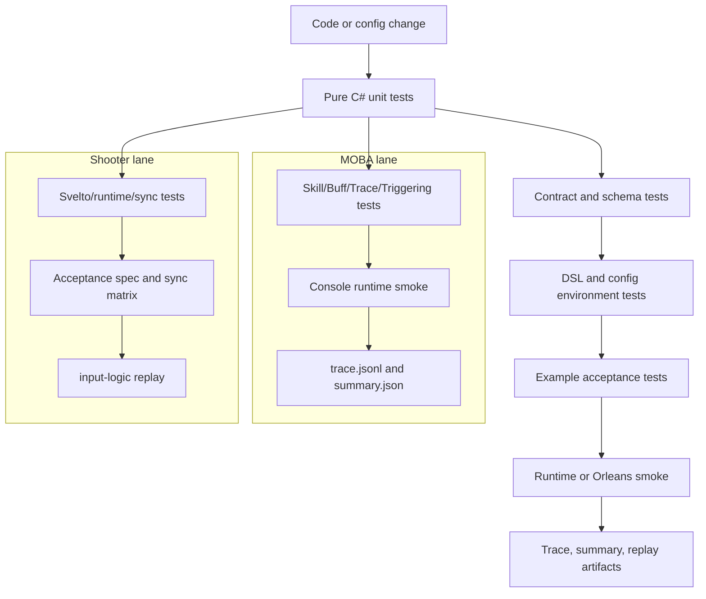
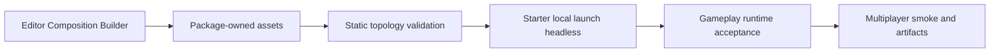

# MOBA 与 Shooter 示例工业化流程设计

> 本文聚焦 MOBA 与 Shooter 两个示例的工业化验证链路：单元测试如何覆盖领域规则，DSL/配置环境测试如何冻结可执行契约，冒烟测试如何证明示例按正式运行路径闭环，并通过 artifact/replay 为回归定位提供证据。全仓测试门禁总览见 [01-正式测试流程、单元测试与冒烟测试](01-TestingWorkflow.md)。

> 文档类型：Canonical 示例验证设计
>
> 事实基线：2026-08-17
>
> 适用范围：MOBA/Shooter 示例的领域测试、运行时验收、网络 smoke、artifact 与 CI 接线；不把示例应用层提升为框架通用 API

---

## 1. 能力定位

MOBA 与 Shooter 的工业化流程不是简单把测试工程列出来，而是把示例从“源码可编译”提升为“玩法流程、配置 DSL、同步边界、服务端 smoke 和诊断 artifact 都可重复验证”。

| 示例 | 工业化目标 | 主要证据 |
|------|------------|----------|
| MOBA | 验证 Skill/Buff/Projectile/Damage/Trace/Triggering/Continuous Runtime 能在正式 runtime、配置和输入链路下闭环 | xUnit 领域测试、Console smoke、trace jsonl、summary json、runtime input port 断言 |
| Shooter | 验证 Svelto 战斗内核、snapshot/hash、客户端同步、Gateway/Orleans、late join/reconnect 和 replay artifact 能闭环 | runtime tests、acceptance spec、sync smoke、Orleans smoke、input-logic replay |
| DSL/环境 | 验证 TriggerPlan、ExecutionRoot、PlanAction、JSON 配置和兼容性约束在包内与示例内保持一致 | Unity Editor NUnit、Triggering validator、稳定错误码、MOBA PlanActions 测试 |

工业化流程遵循三条边界：

1. 纯领域规则优先放在纯 C# xUnit，避免 Unity/Orleans 启动成本影响快速反馈。
2. 配置、DSL、稳定错误码、artifact schema 必须通过机器可读字段断言，而不是只看日志文本。
3. 端到端 smoke 只承担跨进程、跨网络、真实 runtime 装配的验收职责，失败后应能用 trace/replay 缩小问题。

示例中的房间流程、技能编排、英雄规则、客户端会话和运营参数属于参考应用层。它们的价值是证明底层 package 可以低成本组合成复杂战斗，而不是形成跨游戏统一的应用套件。框架层稳定的是生命周期、上下文、执行管线、同步、记录和诊断等工具契约；项目应在这些扩展点上保留自己的应用编排。

---

## 2. 分层流水线

这条流水线的核心是“逐级扩大运行面”：先验证纯逻辑，再验证契约和 DSL，再验证示例 runtime，最后验证真实服务端或 smoke 脚本。这样可以让大多数错误停在低成本层级，同时保留端到端证据。

---

## 3. MOBA 工业化流程

### 3.1 测试入口

MOBA 的主测试工程是 `src/AbilityKit.Demo.Moba.Tests/AbilityKit.Demo.Moba.Tests.csproj`。它引用 MOBA Core、Share、Infrastructure、Console、AI、Context、Trace 等项目，并把 Console 配置目录复制到测试输出目录，因此测试不是孤立验证函数，而是在接近正式 Console runtime 的环境中读取同一批配置。

| 层级 | 代表目录/文件 | 验证内容 |
|------|---------------|----------|
| Buff/Skill/Passive | `Buff/`、`Skill/`、`Passive/` | 叠层策略、技能输入结果、技能释放 runtime、被动生命周期 |
| Context/Trace | `Context/`、`Trace/` | `MobaCombatExecutionContext`、lineage、trace registry、root/parent/source 字段 |
| Continuous Runtime | `Continuous/` | 持续行为生命周期、上下文绑定、运行时查询 |
| Triggering | `Triggering/` | `MobaTriggerExecutionGateway`、Owner-bound gate、Projectile/Area trigger、PresentationCue |
| AI | `AI/` | 训练环境、runner 输出、AI 与示例 runtime 的边界 |
| Smoke | `Smoke/` | Console 场景、runtime input port、首帧 snapshot、trace artifact、validation report |

### 3.2 单元测试到 runtime smoke 的放大路径

MOBA 领域测试先验证单个服务的确定性行为，再通过 smoke 证明它们按正式装配协作：

1. Skill/Buff/Projectile/Damage 改动先跑对应 `src/AbilityKit.Demo.Moba.Tests` targeted case。
2. Trigger/PlanAction/Continuous Runtime 改动需要同时覆盖 `Triggering/`、`Continuous/` 和配置加载相关测试。
3. 涉及 Console 入口、runtime port、输入绑定、trace 输出时，需要跑 `Smoke/ConsoleMobaSmokeFlowTests.cs`。
4. 涉及 artifact schema 或前端诊断消费时，需要检查 trace jsonl、summary json、batch summary 的字段稳定性。

### 3.3 Console smoke 验收点

`ConsoleMobaSmokeFlowTests` 固化了两类关键场景：

| 场景 | 稳定断言 | 价值 |
|------|----------|------|
| FullBattleScenario | script name、step count、tick count、smoke passed | 证明完整战斗脚本可通过共享 smoke 环境执行 |
| SkillCastScenario | skill slot、runtime input port、accepted command、actor/skill mapping、SkillCast/EffectExecution trace | 证明技能输入走正式 runtime 端口，效果执行进入 trace 链路 |

这些断言避免 smoke 退化成“启动成功”。例如技能 smoke 必须证明：

- `RuntimeInputPortReady` 为真，说明输入进入 `IMobaBattleInputPort`，不是测试直接调用 sink。
- `SubmitCount`、`AcceptedCount`、`AcceptedCommandCount` 大于零，说明输入被 runtime 接受。
- 本地 player 能映射到 runtime actor，技能槽能映射到 runtime skill id。
- trace 中存在 `SkillCast` 和 `EffectExecution`，并能按 config id 定位技能。

### 3.4 MOBA artifact 契约

MOBA Console smoke 通过 `ConsoleSmokeTraceArtifactExporter` 导出三类 artifact：

| artifact | 路径模式 | 用途 |
|----------|----------|------|
| trace jsonl | `<caseId>_trace.jsonl` | 每条 trace node 的帧、来源、目标、config、root/parent 关系 |
| case summary | `<caseId>_summary.json` | 单个 smoke case 的 scenario、result、traceCounts、retention |
| batch summary | `batch_summary.json` | 多 case 汇总与外部诊断入口 |

artifact 保留策略由环境变量控制：

| 环境变量 | 含义 |
|----------|------|
| `ABILITYKIT_MOBA_CONSOLE_SMOKE_ARTIFACTS` | 控制 artifact 导出策略 |
| `ABILITYKIT_MOBA_CONSOLE_SMOKE_ARTIFACT_DIR` | 指定 artifact 输出目录，默认 `artifacts/moba-console-smoke` |

summary 的稳定字段包括 `caseId`、`worldId`、`tickRate`、`scenario.name`、`scenario.stepCount`、`scenario.tickCount`、`result.passed`、`result.skillCastTraceFound`、`result.effectExecutionTraceFound`、`result.projectileLaunched`、`result.traceNodeCount`、`traceCounts`、`retention.policy`、`traceJsonlPath` 和 `summaryJsonPath`。这些字段是前端诊断、CI 汇总和失败复盘的契约。

### 3.5 MOBA 网络 Smoke 与进程边界

Console smoke 和完整战局 acceptance 仍不等于真实多人网络闭环。当前网络层有两个独立 gate：

| Gate | gate 配置声明 | workflow 实际接线（2026-08-16） | 当前能证明什么 |
|---|---|---|---|
| P1 `moba-smoke` | pull request、push、schedule；要求 artifact | 有 `moba-smoke` job | owner/member 两客户端经 TCP Gateway 完成登录、房间阶段、战斗启动和输入提交，权威聚合帧包含双方输入 |
| P2 `moba-multiprocess` | schedule-only；要求 artifact | 未发现对应 job | 本地脚本可验证 host-only silo 与 client-only 场景进程隔离、双方收敛、全量恢复及可靠事件 ACK；不能宣称当前 schedule 已自动执行 |

`moba-multiprocess` 当前不是“一客户端一进程”。拓扑是一个 host-only silo 进程加一个 client-only 场景进程，owner/member 两条 TCP 连接仍由后者共同持有。场景已覆盖双方快照/移动收敛、显式全量恢复，以及可靠事件 epoch/watermark ACK；gate 描述仍把 client-only 写成未来扩展，已经落后于 runner。文档和发布证据必须按实际脚本表述，既不能缩减为普通 smoke，也不能扩张成多客户端进程隔离。

MOBA gameplay module 当前只声明 `frame-sync-authority`，runtime mode 为 `BattleWorldWithFrameSync`；Room 对外能力固定为 `Lockstep`、schema `0..1`。MobaSmoke Program 支持 `--sync-template`，默认值也已经是 `frame-sync-authority`，所以两个脚本即使不透传参数，实际仍走 FrameSync。`moba-smoke` 有覆盖 pull request、main push、schedule 和 manual 的 workflow job，可作为该场景的 E5 编排入口；本批未真实运行，不能据静态接线新增 E4 PASS。`moba-multiprocess` 仍只有 gate catalog 的 schedule 声明，workflow 未发现对应 job。

### 3.6 完整战局生命周期门禁

`FullBattleScenario` 只证明输入脚本可以运行，不能单独证明技能、Projectile、Buff、死亡、复活和终局通过正式服务协作。完整战局因此使用两个互补入口：

| 层级 | 测试 | 关键断言 |
|------|------|----------|
| Console World smoke | `MobaCompleteBattleLifecycleSmokeTests` | 正式 DI 装配、死亡、复活、再次死亡、再次复活、终局 |
| Unity EditMode acceptance | `MobaCompleteBattleJourneyAcceptanceTests` | EnterGame、移动、技能 2、Effect trace、Projectile 命中、Buff、伤害、死亡、异地半血复活、再次战斗和结算 |

两者由 P1 `moba-complete-battle-journey` gate 配置统一描述，但当前 workflow 未发现对应 job；只有手动或本地执行结果时，应按实际命令和 artifact 记录证据，不能宣称已经形成自动 CI 门禁。`MobaUnitLifecycleService` 只负责已批准复活的状态转换；自动复活倒计时、出生点策略和次数限制属于玩法规则。当前 Unity acceptance 验证逻辑层和技能表现事件链，不应据此声称多人网络死亡/复活表现已经闭环；独立网络表现事件和 View handler 正式接线仍是后续验收项。

---

## 4. Shooter 工业化流程

### 4.1 测试入口

Shooter 的主测试工程是 `src/AbilityKit.Demo.Shooter.Runtime.Tests/AbilityKit.Demo.Shooter.Runtime.Tests.csproj`。它引用 Shooter AI、Runtime、View Runtime、Network Runtime、GameFramework、Host Extension、FrameSync 和 StateSync，因此同一个测试工程覆盖纯战斗内核、客户端同步、网关流程和表现投影边界。

| 层级 | 代表目录/文件 | 验证内容 |
|------|---------------|----------|
| Application/Runtime | `ShooterWorldModuleTests.cs`、runtime snapshot tests、bot AI tests | DI 注册、规则注入、movement/projectile、enemy wave、snapshot/hash、AI runtime |
| Client | `ShooterAcceptanceSpecRunnerTests.cs`、`ShooterSyncModeSmokeTests.cs`、Acceptance matrix | 确定性帧结果、packed snapshot、事件序列、同步模式组合 |
| Gateway | `ShooterRoomGatewayFlowTests.cs`、launcher tests | room create/join/ready/start、client gateway flow |
| Networking | network conditioning、input scheduler、prediction history/reconciliation | 网络抖动、输入帧调度、客户端预测恢复 |
| Presentation | `ShooterSnapshotViewProjectionTests.cs` | snapshot 到 view projection 的表现层投影 |
| Rollback/Synchronization | state recovery、frame sync controller、fast reconnect、pure-state controller | 回滚恢复、重连、状态同步控制器 |
| Orleans smoke | `Server/Orleans/tools/run_shooter_smoke.ps1` | Gateway/Room/Battle/StateSync/replay artifact 端到端验收 |

默认 Shooter policy 是 `state-sync-authority`、packed 每帧推送且每 30 帧 full，Room 至少需要 2 名成员并要求全部 ready。当前单进程 `ShooterSmokeRunner` 只登录一个网络账号，却给本地 `ShooterStartGamePayload` 放入两个模拟玩家；这两种身份不能互相替代。在真实脚本复跑前，Harness E3 只能证明 runner/adapter 契约，不能证明单进程默认场景已满足当前 Room 启动条件。

### 4.2 纯战斗内核与 acceptance

Shooter 单元测试把战斗内核当作可确定性运行的纯逻辑模块验证。`ShooterWorldModuleTests` 先证明 `ShooterWorldModule` 能注册 `IShooterBattleRuntimePort`、`IShooterBattleSimulation`、`IShooterEntityManager`、`IShooterSveltoWorld` 等核心服务，再验证移动、开火、projectile 参数、命中事件、敌人波次、胜负状态和 Svelto component 写入。

`ShooterAcceptanceSpecRunnerTests` 则把一个 acceptance spec 固化成稳定结果：

| 字段 | 验证点 |
|------|--------|
| `SpecId`、`Frame` | 场景身份与最终帧固定 |
| `Snapshot.Players`、`Snapshot.Bullets` | 逻辑实体状态符合预期 |
| `PackedSnapshot.EntityCount`、`PackedSnapshot.StateHash` | packed snapshot 与 runtime state hash 对齐 |
| `Events` | Fire/Hit 事件顺序、source/target、bullet id、value 稳定 |
| repeated run result | 两次运行 frame/hash/player/events 一致 |

这层测试的职责是把 Shooter 战斗玩法内核固定为可重复计算的规格，避免端到端 smoke 失败时无法判断是玩法逻辑、同步层还是网络/服务端装配问题。

### 4.3 同步模式与客户端边界

Shooter 的同步测试不只验证 snapshot codec，还验证客户端如何消费服务端权威状态：

- packed snapshot 和 pure-state snapshot 的 wire compatibility；
- frame sync controller 对输入帧、确认帧和本地状态推进的处理；
- stale snapshot ignore，避免旧权威状态覆盖新状态；
- late join/reconnect 下的 projection 和 full sync；
- authoritative interpolation、hybrid hero prediction 与 diagnostics；
- presentation projection 的实体数、玩家数、最终状态。

这些测试把“网络同步策略”从视觉表现中拆出来，让 snapshot/hash/prediction/reconnect 的错误可以在纯 C# 层定位。

### 4.4 Orleans smoke、Multiprocess 与 replay artifact

Shooter 端到端 smoke 由 `Server/Orleans/tools/run_shooter_smoke.ps1` 启动。脚本定位 `AbilityKit.Orleans.ShooterSmoke.csproj`，输出目录为 `artifacts/shooter_smoke`，并强制检查 replay 文件存在且非空：

| artifact | 默认路径 | 断言 |
|----------|----------|------|
| input-logic replay | `artifacts/shooter_smoke/records/input-logic.record.bin` | 文件存在且长度大于 0 |
| minimized input-logic replay | `artifacts/shooter_smoke/records/input-logic.min.record.bin` | 文件存在且长度大于 0 |

smoke 结果应至少覆盖以下机器可读字段：

| 分类 | 字段 | 验收含义 |
|------|------|----------|
| 房间与战斗身份 | `RoomId`、`BattleId`、`WorldId` | 定位服务端实体和逻辑世界 |
| 输入推进 | `InputCount`、`LastAcceptedFrame`、`LastCurrentFrame`、`LastInputStatus` | 输入提交和帧推进有效 |
| 客户端状态 | `Frame`、`ActorCount`、`StateHash` | 客户端 runtime 产生有效状态 |
| snapshot 应用 | `SnapshotApplyResult`、`SnapshotFrame`、`SnapshotStateHash`、`SnapshotEntityCount` | 服务端推送被客户端应用 |
| stale 保护 | `StaleSnapshotResult` | 旧 snapshot 不覆盖新状态 |
| projection | `ProjectionApplyCount`、`ProjectionFullSyncApplyCount`、`ProjectionFinalEntityCount` | 表现投影可恢复最终状态 |
| late join/reconnect | `LateJoinEntryKind`、`ReconnectEntryKind`、`LateJoinProjectionFinalPlayerCount` | 晚加入和重连可获得有效投影 |
| gameplay loop | `GameplayMoved`、`GameplayFired`、`GameplayDefeatedEnemy`、`GameplayFinalMatchState` | smoke 跑过真实战斗行为 |
| replay artifact | `InputLogicReplayPath`、`MinimizedInputLogicReplayPath`、`InputLogicReplayValidation` | 输入逻辑可录制、可回放、可最小化 |

单进程 smoke 之外，Shooter gate 继续按风险放大：

| Gate | 触发策略 | 证据边界 |
|---|---|---|
| `shooter-multiprocess` | push + schedule | 独立进程、故障恢复、完整 run root |
| `shooter-multiprocess-compatibility` | schedule-only | Packed/PureState、客户端数量、重连与确定性网络条件矩阵 |
| `shooter-multiprocess-soak` | schedule-only | 16/64 observer、动态网络阶段、恢复分位数、公平性和资源趋势 |
| `shooter-multiprocess-ownership-cleanup` | 以 gate policy 为准 | 超时后只清理 manifest 所有进程、释放端口并保护无关进程 |

这些 gate 都要求 artifact。Replay 文件存在只是结构证据；只有完成 FrameRecord 回读、领域 payload 消费、同帧 hash 比较及 gate 场景断言后，才能形成更高层运行证据。具体 FrameRecord 轨道、v4 codec 和最小记录边界见 [FrameRecord 编码与 Smoke 证据链](../07-NetworkSynchronization/06-FrameRecordCodecAndSmokeEvidence.md)。

### 4.5 PlayMode 长局与密度契约

PlayMode 默认战局至少运行 10 分钟，默认同屏敌人预算为 512，整场敌人总量为同屏预算的 5 倍，并以 60 秒为间隔投入增援。胜利目标必须和实际波次敌人总量一致。密度输入统一钳制到 `1..8192`，防止异常配置扩大数组和内存占用。

512、2048、8192 是受支持的表现密度配置档，不是同一等级的性能承诺。512 用于默认可玩长局；2048 用于 Unity 高密度表现与映射 soak；8192 用于极限配置和同步路径验证。2K Unity 长时运行、GPU 实例残留、停止/重连后的清理必须继续作为后续 soak gate；5K 至 10K 的容量结论应主要来自 headless、AOI/LOD 与网络基准，不能用配置可创建替代实测结果。

---

## 5. DSL 与配置环境测试

MOBA 与 Shooter 的工业化流程都依赖 Triggering、PlanAction、JSON 配置和稳定错误码。DSL/配置测试的职责是提前拦截“配置能加载但运行时语义不合法”的问题。

| 测试入口 | 验证内容 | 对示例的价值 |
|----------|----------|--------------|
| `Unity/Packages/com.abilitykit.triggering/Tests/Editor/TriggerPlanExecutableTests.cs` | Sequence、Repeat、Until、Duration、Continuous metadata、执行计数、validator | 保证可执行 TriggerPlan 组合语义稳定 |
| `Unity/Packages/com.abilitykit.triggering/Tests/Editor/ValidatingTriggerPlanJsonDatabaseExecutionRootTests.cs` | JSON ExecutionRoot、Timeline action 限制、empty composite warning | 保证配置库导入时能发现不合法执行树 |
| `ActionCallPlanValidatorTests.cs` | action call plan 参数、schedule、validation issue | 保证 ActionCall DSL 的错误码和结构稳定 |
| `TriggeringProductAcceptanceChecklistTests.cs` | 产品化 checklist | 保证 Triggering 包能力不是只覆盖局部单测 |
| MOBA `Triggering/` tests | `MobaTriggerExecutionGateway`、ProjectileArea trigger、PresentationCue、Owner-bound gate | 保证通用 Triggering 能接到 MOBA runtime 上下文 |

工业化文档和测试应优先引用稳定错误码而不是错误文本，例如 `UNSUPPORTED_ACTION_SCHEDULE`、`INVALID_EXECUTION_NODE`、`EMPTY_EXECUTION_NODE`。错误文本可以优化，但错误码和 issue 分类是配置流水线、编辑器提示和 CI 断言的契约。

---

## 6. 示例宿主与 Composition 验收层

Unity 示例入口本身也需要一条独立工业化链。它验证的是 Starter、package scene、Profile/Catalog、Root 与真实入口组件之间的组合，不替代 MOBA/Shooter 玩法、网络或长稳测试。

### 6.1 生成、构建与运行证据分层

| 验收入口 | 直接检查 | 证据边界 |
|----------|----------|----------|
| `DemoGameplayCompositionBuilder.GenerateAll` | 迁移旧 `Assets/DemoComposition`，创建/更新两游戏 Profile、Catalog、Bootstrap Prefab、package scene、Starter 配置与 Build Settings | E1 工具行为；生成成功不证明 Player 能加载或 Root 能启动，而且生成器会改写/删除资产，只应在受控 Editor 流程运行 |
| `MobaDemoBuild.ValidateMultiplayerSceneTopology` | Build Settings 恰好为 Starter、MOBA、Shooter 三个 enabled scene 且顺序固定；每个 package scene 只有一个 Root/Bootstrap；Catalog 恰好含 Local/Multiplayer；Root 中 Camera、AudioListener 和入口类型符合预期 | E2 静态装配契约；不执行 Scene load、Root `Awake`、登录或战斗循环 |
| Local 独立 build | 只包含本游戏 package scene，并注入 `ABILITYKIT_DEMO_MOBA_LOCAL` 或 `ABILITYKIT_DEMO_SHOOTER_LOCAL` | 构建拓扑隔离；不证明产物已在目标机运行 |
| Multiplayer build | 场景顺序为 Starter → MOBA → Shooter，不注入 Local define | 入口和两游戏 scene 被打入同一 Player；不证明两条多人会话都能完成 |
| `DemoGameplayCompositionTests` | Intent 只消费一次、Catalog 无 id 解析、Root 实例化/Shutdown、多人 gameplay mismatch 清理 | E3 组件契约；使用测试对象，不读取真实 package scene/prefab |
| `StarterLocalLaunchHeadlessCommand` | 打开真实 Starter，通过公开 Local API 切换到对应 package scene，等待 ActiveProfile/Root，并断言 scene/profile/root 均归本游戏 package | 执行型 Unity 验收入口；只覆盖 Local，且一次结果必须由当次 JSON/退出码形成 E4，源码存在不是 PASS |

### 6.2 双 Intent 与失败矩阵

| 场景 | Composition intent | Multiplayer intent | 预期 |
|------|--------------------|--------------------|------|
| Local | 对应 gameplay + Local | 必须为空 | Bootstrap 选择 Local Profile |
| Multiplayer | 对应 gameplay + Multiplayer | 必须存在且 gameplay 相同 | Root 继续消费认证/房间请求 |
| Local 携带多人请求 | Local | 存在 | 拒绝并清空两类 intent |
| Multiplayer 缺少或 gameplay 不同 | Multiplayer | 缺失或不一致 | 拒绝并清空两类 intent |
| Catalog 无匹配或重复匹配 | 任意 | 任意 | 拒绝；不得任意选择第一个 Profile |
| Root 实例化失败 | 已消费 | 已校验 | 销毁局部实例并清空 intent；外部登录/Room 补偿仍归项目入口 |

Starter 当前通过 `SceneManager.LoadSceneAsync` 发起切换，但不保留或观测 `AsyncOperation`；`_loadingScene` 在加载失败时不会复位。`DemoLaunchIntent` 是无 generation 的进程静态单槽，重复 `Request` 会覆盖 pending 请求。`DemoGameplayBootstrap.ReturnToStarter` 同样不观察加载结果。因此这套入口适合受控 Demo 和 headless 验收，产品化时还需 request generation、取消/超时、加载失败恢复、重复点击抑制和会话补偿测试。

### 6.3 资产所有权与变更证据

MOBA 与 Shooter 的 scene、Profile、Catalog、Bootstrap Prefab 和 Root 必须由各自 View package 拥有；公共 package 只拥有协议和 Bootstrap 组件类型。这样一个游戏可以复用同一个 Root 区分 Local/Multiplayer，另一个游戏可以使用两个 Root，而无需扩张公共应用层。

当前 package-owned Composition 是工作区中的未提交实现面。文档可以按 E0 源码与序列化资产描述它，但在形成提交、构建产物和日期化运行 artifact 前，不应把它宣布为已发布 package 能力。历史优化记录或手工计划属于辅助材料，不能替代 canonical 测试结果、JSON 结果文件和进程退出码。

---

## 7. 推荐执行层级

| 改动面 | 最小入口 | 放大入口 |
|------|----------|-----------|
| 单个领域服务、DTO、validator、codec | MOBA 或 Shooter targeted xUnit | 对应 `runtime-contracts`、`shooter-fast` 或完整工程测试 |
| MOBA 技能/Trigger/Trace/死亡复活 | 领域测试与 Console smoke | `moba-complete-battle-journey` |
| MOBA Gateway/Room/BattleAdapter | Gateway/Grains focused tests | P1 `moba-smoke`；发布前再看 P2 `moba-multiprocess` |
| Shooter snapshot/sync/client | acceptance/spec/sync tests | `shooter-integration`、`shooter-unity-playmode`、`shooter-multiprocess` |
| TriggerPlan、ActionCall、ExecutionRoot、PlanAction schema | Unity Triggering Editor NUnit | 受影响示例的完整配置与 acceptance gate |
| artifact/replay/trace 消费 | codec、schema 和字段级测试 | 对应 smoke/multiprocess gate，并保留完整 artifact |
| 长稳、兼容和性能 | targeted benchmark 或故障场景 | schedule-only compatibility/soak/performance gate |
| Starter、scene、Profile、Root 变更 | Composition tests + topology validator | 两游戏 Starter Local headless；多人入口再分别进入 MOBA/Shooter network smoke |

P0/P1/P2 是 `tools/test-gates.json` 的 gate level，不应直接等同于本地、PR 或 nightly。实际准入以每个 gate 的 `requiredBefore`、`failurePolicy` 和 `ciPolicy` 为准；artifact 存在也不能替代场景断言和领域回读。

还必须继续核对 workflow：`ciPolicy` 表示期望触发策略，手写 job 才表示当前自动编排。MOBA 的 network options、多个英雄 Unity fixture、完整战局和 multiprocess gate 当前存在接线缺口；Shooter fast、integration、PlayMode、multiprocess、compatibility、soak、ownership cleanup 和 performance 则已有对应 job。任何发布说明都应引用实际执行的 job/命令，而不是只引用 gate 名称。

---

## 8. 工业化维护约束

1. 新增 MOBA 技能、Buff、Projectile、Summon、Motion 行为时，至少补齐领域单测和一条 trace/context 断言；如果配置通过 TriggerPlan 或 PlanAction 表达，还要覆盖 DSL/配置校验。
2. 新增 Shooter 战斗规则、敌人波次、Bot AI 或 projectile 行为时，先补 runtime/acceptance 测试，再按是否影响同步决定是否补 sync smoke。
3. 改动 snapshot/hash/replay/artifact schema 时，必须使用字段级断言，不能只依赖人工日志检查。
4. 改动 Gateway/Room/Grain 或端侧同步控制器时，应按玩法运行 MOBA 或 Shooter Orleans smoke，并保留 replay、summary 和进程日志作为失败复盘入口。
5. 改动 Triggering validator、ExecutionRoot 或 ActionCall DSL 时，应保证稳定错误码不被无意修改，并同步检查 MOBA 示例是否仍能通过 PlanAction/Triggering 测试。
6. 文档更新后必须运行 Mermaid 校验和 `git diff --check`，防止流程图或 Markdown 空白破坏后续同步。
7. 改动 MOBA 死亡、复活或结算状态时，必须运行 `moba-complete-battle-journey`；在网络事件和 View handler 接线完成前，不得把逻辑 acceptance 作为多人复活表现完成的证据。
8. 改动 Shooter PlayMode 波次、胜利目标或密度预算时，必须验证同屏预算与整场总量分离、输入钳制和低密度可结束；2K 以上表现能力必须附带对应硬件上的长时 soak 结果。
9. 改动 Starter、`DemoLaunchIntent`、Profile/Catalog、Gameplay Bootstrap、package scene 或 Root Prefab 时，先跑静态拓扑，再分别跑 MOBA/Shooter Local headless；涉及 Multiplayer intent 或入口组件时继续跑对应网络 smoke，不能用 Local 切场景替代多人证据。
10. Editor Composition 生成器包含资产迁移、Build Settings 重写和旧资产删除，只能在明确的生成/迁移任务中运行；普通文档或验证任务不得为了“刷新”而隐式执行。

---

## 9. 源码阅读路径

1. `Docs/design/10-EngineeringQuality/01-TestingWorkflow.md`：全仓测试分层、P0/P1/P2 门禁与 smoke 字段总览。
2. `src/AbilityKit.Demo.Moba.Tests/AbilityKit.Demo.Moba.Tests.csproj`：MOBA 测试工程依赖和配置复制边界。
3. `src/AbilityKit.Demo.Moba.Tests/Smoke/ConsoleMobaSmokeFlowTests.cs`：MOBA Console smoke 场景、runtime input port 和 trace artifact 断言。
4. `src/AbilityKit.Demo.Moba.Tests/Smoke/ConsoleSmokeTraceArtifactExporter.cs`：MOBA trace jsonl、summary json、batch summary 字段契约。
5. `src/AbilityKit.Demo.Moba.Tests/Smoke/MobaCompleteBattleLifecycleSmokeTests.cs`：MOBA 正式 World 死亡、复活、再次死亡和终局生命周期断言。
6. `Unity/Packages/com.abilitykit.demo.moba.view.runtime/Runtime/Game/Test/UnitTest/Acceptance/MobaCompleteBattleJourneyAcceptanceTests.cs`：MOBA 技能到终局的 Unity 完整战局验收。
7. `src/AbilityKit.Demo.Shooter.Runtime.Tests/AbilityKit.Demo.Shooter.Runtime.Tests.csproj`：Shooter runtime/sync/view/network 测试工程依赖。
8. `src/AbilityKit.Demo.Shooter.Runtime.Tests/Worlds/ShooterWorldModuleTests.cs`：Shooter runtime DI、Svelto、movement/projectile、enemy wave 和事件断言。
9. `src/AbilityKit.Demo.Shooter.Runtime.Tests/Client/ShooterAcceptanceSpecRunnerTests.cs`：Shooter acceptance spec 的 deterministic frame/hash/events 断言。
10. `Unity/Packages/com.abilitykit.demo.shooter.view.runtime/Runtime/PlayMode/ShooterPlayModeSessionOptions.cs`：Shooter 长局、增援和密度配置契约。
11. `Server/Orleans/tools/run_moba_smoke.ps1` 与 `run_moba_multiprocess_smoke.ps1`：MOBA 两客户端 Gateway smoke 和当前进程隔离拓扑。
12. `Server/Orleans/tools/run_shooter_smoke.ps1` 与 `run_shooter_multiprocess_smoke.ps1`：Shooter Orleans smoke、multiprocess profile 和 artifact 入口。
13. `tools/test-gates.json`：MOBA/Shooter gate level、触发策略、失败策略和 artifact 要求。
14. `Unity/Packages/com.abilitykit.triggering/Tests/Editor/TriggerPlanExecutableTests.cs`：TriggerPlan 可执行 DSL 与 metadata validator。
15. `Unity/Packages/com.abilitykit.triggering/Tests/Editor/ValidatingTriggerPlanJsonDatabaseExecutionRootTests.cs`：JSON ExecutionRoot 校验和稳定错误码。
16. `Unity/Packages/com.abilitykit.demo.common/Runtime/Composition/DemoGameplayBootstrap.cs` 与 `Runtime/Gameplay/DemoLaunchIntent.cs`：公共选择协议、双 intent 校验、Root 实例化和失败清理。
17. `Unity/Packages/com.abilitykit.demo.moba.editor/Editor/Composition/DemoGameplayCompositionBuilder.cs`：package-owned 资产生成、旧资产迁移与 Build Settings 改写。
18. `Unity/Packages/com.abilitykit.demo.moba.editor/Editor/Build/MobaDemoBuild.cs`：本地/多人构建拓扑和 Profile/Root/入口组件静态校验。
19. `Unity/Packages/com.abilitykit.demo.moba.editor/Editor/Automation/StarterLocalLaunchHeadlessCommand.cs`：真实 Starter Local 切场景与 package ownership 验收。

---

## 10. 当前证据结论

| 能力面 | 当前最高可复用证据 | 仍然缺少 |
|---|---|---|
| MOBA 领域与 Console | 多个 E3 契约及 Console 场景 E4 入口 | 所有入口的统一 CI 接线和版本发布责任 |
| MOBA Gateway FrameSync smoke | `moba-smoke` workflow 的 E5 编排入口；Program 和脚本默认实际走 FrameSync | 当前提交的新 E4 PASS，以及 multiprocess workflow 接线 |
| MOBA 完整战局/英雄 fixture | 源码与局部测试入口 | 对应 workflow job，且网络表现链仍需独立验收 |
| Shooter 领域、同步与服务端 | E3 测试、E4 smoke/回读以及多类 E5 job | 不同 job 的最近通过记录仍需随发布候选归档 |
| 示例应用层 | 在指定 Demo 中证明组合方式 | 跨游戏稳定语义；默认不晋升为框架层能力 |
| Unity Starter/Composition | E0 当前源码与 package 资产、E3 组件测试入口、可执行 Local headless 命令 | 本批未重跑 Unity；未提交工作区实现不等于已发布 package 能力，Local 也不证明 Multiplayer |

2026-08-16 的静态 gate 复核为 `166/168`，两个失败均来自 `moba-codegen` 的缺失工程路径；该 validator 不会自动发现所有 `ciPolicy` 与 workflow job 的缺口。本轮没有重跑 MOBA Gateway、Shooter 默认 Smoke、multiprocess 或 Unity 场景，因此这里对网络和 Unity 的 E4 结论沿用既有源码、脚本与已归档证据，不把静态检查计为新的场景通过。E5 只按 workflow 实际 job 和触发条件声明。2026-08-17 对 Starter/Composition 的结论来自当前工作区源码和序列化资产审计，仍是 E0；本批不把历史计划中记载的退出码提升为新 E4。

这组示例应被视为“高接入度参考实现 + 正式验证资产”。它们降低项目理解和接入成本，但项目仍拥有应用编排、玩法规则和产品策略；只有在多个项目出现稳定同构需求并能定义不含玩法假设的契约时，才评估将局部能力上移为可选 package。

---

*文档版本：v3.2 | 最后更新：2026-08-17*
