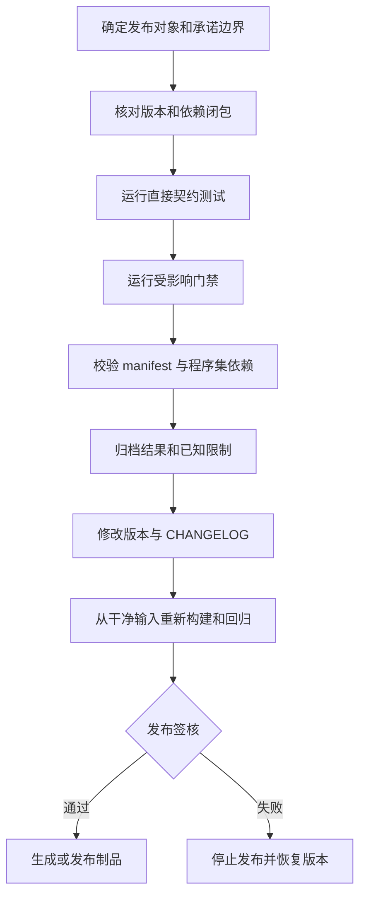

# 10.6 Beta 稳定化与发布检查清单

> 本文定义 AbilityKit 单个 Unity package 从开发版本进入 `0.1.x` Beta 的发布边界、证据要求和执行顺序。公司级成熟度、试点和弃用规则见 [公司级采用与模块治理规范](04-CompanyAdoptionAndModuleGovernance.md)；本文只回答一次 Beta 发布怎样准备、怎样验证、怎样失败退出，以及发布记录必须留下什么。

> 文档类型：Canonical Beta 发布规范
>
> 事实基线：2026-08-16
>
> 当前状态：仓库已有 cohort 对齐、版本审计、候选批次和本地 tag 工具，但尚无统一 package 发布 E5 gate

---

## 1. Beta 版本表达什么

`0.1.x` 表示包的公开边界已经可以被指定项目试用，并且仓库能够重复构建、验证和回退该版本。它不是 Supported 或 Recommended 的同义词，也不证明所有运行场景、平台和性能规模均已覆盖。

一个包进入 Beta 前，至少要能回答以下问题：

1. 包负责什么，不负责什么，哪些类型属于公开契约。
2. 创建、运行、停止和释放路径由谁拥有。
3. 哪些测试直接覆盖该包，哪些结论只来自 Demo 或 Smoke。
4. 已知限制、废弃入口和未覆盖场景是什么。
5. 版本、依赖和序列化格式发生变化后怎样升级或回退。
6. 发布失败时由谁处理，采用方怎样恢复到上一版本。

版本号只是一项发布结果。缺少上述证据时，即使 `package.json` 已写为 `0.1.0`，成熟度仍应按 Experimental 或 Pilot 记录。

---

## 2. 当前仓库基线

仓库现有发布策略把可发布 Framework package 统一到单一 cohort，当前为 `0.1.0`；`com.abilitykit.thirdparty.*` 与 `com.abilitykit.demo.*` 明确列入 never-released 范围。2026-08-16 执行 `audit-versions.js` 的结果为 version mismatch、BOM remaining、framework off cohort 均为 `0`。这只能证明当前版本声明一致，不等于每个 Framework package 都已进入发布批次或达到 Beta 准入。

`release-manifest.json` 当前只定义 `batch-1-leaves`，状态为 `candidate`，包含 Core、Deterministic、GameplayTags、Threading、Diagnostics、AI Abstractions、Protocol 和 Network Runtime 共 8 个 package。`release.js --include-candidate` dry-run 能列出这 8 个候选；只有批次改为 `ready` 才允许 `--tag`，且工具只创建本地 git tag，不 push、不等待 OpenUPM 发布结果。Demo、Editor、ThirdParty、Runtime 和协议的资产分类仍需逐项评审，不能因 cohort 一致就一起承诺成熟度。

当前还应注意以下仓库事实：

- 多个 `src/AbilityKit.*/*.csproj` 已声明 `AbilityKitStable=true`，但仓库根目录当前没有统一的 `Directory.Build.props` 定义该属性的具体警告策略。不能仅凭属性存在就写成“稳定构建零警告”。
- `tools/test-gates.json` 定义 P0、P1、P2 门禁，`regression` 是发布候选的回归基线；门禁覆盖范围不等于全部 package 的发布验证。
- `.github/workflows/abilitykit-test-gates.yml` 会运行主要测试门禁，但当前没有统一的 package 发布、CHANGELOG 完整性和全部 manifest 依赖闭包工作流。
- `world.framesync` 中 `ClientPredictionRunner` 与 `ClientPredictionReconciler` 曾标记废弃，现已恢复为活跃类型（Shooter demo、MOBA test harness、`ClientPredictionDriverModule` 均依赖它们）。规范预测驱动仍以 `host.extension/ClientPredictionDriverModule` 为主。
- `coordinator` 的 Beta 范围只承诺 Local/Remote；`HybridSyncAdapter` 被禁止创建且保留未完成实现，不属于 `0.1.0` 承诺面。

以上状态应在每次发布前重新从源码和 manifest 生成，不复制历史测试数量或阶段性 Batch 描述作为长期事实。

---

## 3. 发布对象与版本边界

### 3.1 先确定发布单元

一次发布记录必须指定一个或一组明确的 package，不能使用“核心包”“同步层”代替清单。每个发布对象至少记录：

| 字段 | 说明 |
|---|---|
| Package Name | `package.json` 中的稳定包名 |
| Current Version | 发布前版本 |
| Target Version | 本次目标版本 |
| Asset Type | Foundation、Domain Module、Adapter、Demo、Editor、Validation 或 Experimental |
| Owner | 契约和缺陷负责人 |
| Public Boundary | 本次承诺的 API、配置和行为 |
| Exclusions | 明确不承诺的能力 |
| Direct Dependencies | 直接依赖及其最低版本 |
| Validation Gates | 本次必须运行的门禁和测试 |
| Rollback Version | 验证失败或上线异常时的恢复版本 |

### 3.2 依赖版本必须闭合

目标包升级时，需要同时检查三处依赖：

1. 目标包 `package.json` 的直接依赖版本。
2. Unity `Packages/manifest.json` 与 `packages-lock.json` 的实际解析版本。
3. 对应纯 .NET 镜像工程的 `ProjectReference` 和包引用。

只修改目标包自身版本会留下版本漂移。依赖仍是 `0.0.x` 并不自动阻止上层进入 Beta，但必须在 CHANGELOG 中说明该依赖是否属于承诺边界、为何允许，以及升级后如何验证。

### 3.3 不使用全局升版代替评审

[`tools/update_abilitykit_package_versions.ps1`](../../../tools/update_abilitykit_package_versions.ps1) 当前会把匹配的 `1.0.0` 或 `0.1.0` 改回 `0.0.1`，同时改写 lock file。它不是 Beta 升版工具，发布时不得按旧文档描述用它批量推进到 `0.1.0`。

在提供参数化、可预览且有测试的升版工具之前，版本修改应保持在已评审的 package 集合内，并在修改后检查 diff，防止无关 package 或 lock entry 被改写。

---

## 4. Beta 准入证据

### 4.1 边界和生命周期

- [ ] Canonical 设计文档说明当前实现、设计目的、负责与不负责的范围。
- [ ] 公开入口、扩展点和源码路径真实存在。
- [ ] 创建、Tick/Execute、完成、取消、中断和释放语义已说明。
- [ ] 事件订阅、静态缓存、对象池、Native 容器或后台任务的所有权已闭合。
- [ ] 已废弃 API 有替代入口、迁移说明和预计移除版本。
- [ ] 文档没有把目标设计、示例伪代码或未接线类型写成已交付能力。

### 4.2 正确性测试

- [ ] 存在脱离 Demo 的直接契约测试，或明确记录暂时只能由集成场景覆盖的原因。
- [ ] 至少覆盖一个正常路径、一个失败路径和一个生命周期边界。
- [ ] 涉及顺序、稳定 ID、随机数、快照或 hash 时，有确定性测试。
- [ ] 涉及配置和序列化时，有未知字段、缺失字段、版本不匹配或损坏输入测试。
- [ ] 涉及网络和恢复时，有迟到、重复、断线、基线缺失或回放失败测试。
- [ ] 测试结论引用工程、过滤条件或门禁名称，不只记录“已通过”。

直接测试数量不是统一门槛。少量高价值契约测试可以支持边界清晰的小包；共享生命周期、同步协议和跨模块格式需要更广的矩阵。

### 4.3 构建与兼容性

- [ ] 目标纯 .NET 工程能够在 `global.json` 指定的 SDK 下恢复和构建。
- [ ] Unity Runtime 与纯 .NET 镜像编译的源码集合一致，或差异有明确原因。
- [ ] 新增警告已完成归因；既有警告不被误写成“零警告”。
- [ ] 支持的 Unity、.NET 和 Server 版本有证据，不从单一开发环境外推。
- [ ] Runtime asmdef 没有意外引用 Editor、Tests、Samples 或 Demo-only 程序集。
- [ ] package 的直接依赖与生产 asmdef 引用一致。

`AbilityKitStable=true` 只有在构建系统实际定义了对应属性行为时才构成证据。当前发布记录应附真实构建命令和结果，不依赖该属性名称作结论。

### 4.4 配置、协议和持久化

- [ ] 配置或线协议有版本字段、兼容策略和失败行为。
- [ ] 稳定 ID、排序规则、默认值和 hash 输入变化已标记为行为变更。
- [ ] 存档、回放、快照或网络 payload 变化有旧数据读取或明确拒绝测试。
- [ ] 生成器输出可重复，生成失败不会静默留下可编译的空实现。
- [ ] 缓存有失效边界；没有失效 API 时不得宣称支持热重载。

### 4.5 性能与运行证据

- [ ] 已识别该包是否处于每帧、每实体、每包或每事件热路径。
- [ ] 性能结论包含场景、规模、运行环境、采样方式和 artifact。
- [ ] 没有把 Stopwatch 示例、单次本机结果或 Smoke 总耗时写成正式预算。
- [ ] 涉及池化、批处理、Jobs 或 Native 容器时，同时验证正确性和资源释放。
- [ ] 没有性能基线时，CHANGELOG 明确写为未覆盖，不使用“高性能”或“零分配”承诺。

---

## 5. 发布执行顺序



推荐顺序如下：

1. 冻结发布对象和目标版本，列出允许进入本次 diff 的 package。
2. 检查公开 API、生命周期、配置和协议变化，确定版本类型。
3. 运行目标包直接测试以及 `tools/test-gates.json` 中受影响的 P0/P1 门禁。
4. 发布候选至少运行 `regression`，无法运行的步骤必须作为未覆盖项记录并由 Release Owner 接受。
5. 校验 package JSON 和生产 asmdef 依赖。
6. 写 CHANGELOG，列出承诺边界、行为变化、已知限制、迁移和回滚版本。
7. 修改 package 与直接依赖版本，复核 Unity manifest/lock 和 .NET 镜像。
8. 从修改后的版本状态重新构建和回归，避免用升版前结果替代候选结果。
9. 归档 commit、环境、命令、结果和 artifact，由 Module Owner 与 Release Owner 签核。

---

## 6. 工具的真实覆盖范围

| 工具或门禁 | 当前能证明什么 | 不能证明什么 |
|---|---|---|
| `tools/validate_abilitykit_package_json.ps1` | 所有 `com.abilitykit*` 目录下的 `package.json` 可被 JSON 解析 | 字段完整、版本合法、依赖存在或版本闭合 |
| `tools/publish/align-versions.js` | 默认 dry-run 展示 Framework cohort 与内部引用对齐；`--apply` 才写入 | package 成熟度、CHANGELOG、测试和发布签核 |
| `tools/publish/audit-versions.js` | 检查 Framework cohort、内部引用版本和 BOM，失败时返回非零 | 依赖 package 已发布、候选已验收或 registry 可用 |
| `tools/publish/release.js` | 按 manifest 检查 batch、依赖闭包和 never-released 依赖；默认 dry-run，`--tag` 只建本地 tag | CI 重建、签核、tag push、registry 发布完成和撤回 |
| `tools/publish/release-manifest.json` | 明确允许发布的批次、状态和 package 白名单 | `candidate` 已达到 `ready`，或未列出的 Framework package 自动可发布 |
| `tools/audit_unity_package_dependencies.ps1` | 指定 package 的生产 asmdef 引用具有直接 manifest 依赖 | 默认只审计四个 Demo package；未知程序集只警告，不必然失败 |
| `tools/run_test_gate.ps1 -Gate <name>` | `tools/test-gates.json` 中该 gate 的步骤在本次环境执行 | gate 未列出的 package、平台和场景也通过 |
| `regression` gate | 主要纯 C# 回归和列出的 Unity 验收路径 | 全部 package 的发布兼容性与全部生产拓扑 |
| package CHANGELOG | 维护者声明的版本边界和已知限制 | 声明已经被运行证据验证 |
| `AbilityKitStable=true` | 工程选择加入名为 Stable 的构建策略 | 当前仓库中该策略具体包含哪些警告规则 |

### 6.1 Gate 配置也必须校验可执行性

发布候选不能因为 `tools/test-gates.json` 存在 gate 条目或 workflow 存在同名 job 就默认通过。2026-08-16 复核发现 `moba-codegen` 引用以下不存在路径：

- `Unity/Packages/com.abilitykit.codegen/DotNet~/AbilityKit.SourceGenerator/AbilityKit.SourceGenerator.csproj`
- `src/AbilityKit.CodeGen.Tests/AbilityKit.CodeGen.Tests.csproj`

同时，多个在 JSON 中声明 PR/schedule 策略的 MOBA 与 Network gate 没有对应 workflow job。发布签核必须先验证项目、脚本和 fixture 路径存在，再记录实际运行的命令、退出码和 artifact；失效路径或未接线配置只能记为未执行风险。

发布记录应同时引用工具结果和覆盖缺口。工具名称不能替代对其实现的理解。

---

## 7. CHANGELOG 最低内容

每个 Beta package 应有独立 `CHANGELOG.md`。一次发布至少包括：

```md
## [0.1.0] - YYYY-MM-DD - Beta

### 承诺边界
- 本版本稳定提供的公开能力。

### 行为与 API 变化
- 生命周期、默认值、顺序、格式或公开 API 的变化。

### 已知限制
- 未覆盖平台、场景、性能、兼容性和实验入口。

### 验证证据
- 直接测试工程、门禁名称、运行环境和 artifact。

### 升级与回滚
- 依赖版本、迁移步骤、上一可用版本和数据恢复要求。
```

测试数量、环境和性能数据会变化，不应长期复制在多篇设计文档中。CHANGELOG 可以记录发布时证据，Canonical 文档负责解释长期边界，artifact 负责保存可复核结果。

### 当前复核风险（2026-08-09）

下表是发布时必须重新评估的当前实现风险，不表示它们默认允许随任意 Beta 发布。严重度、接受人和目标版本应在具体候选版本的签核记录中确定。

| 风险 | 当前事实 | 发布检查 |
|---|---|---|
| 浮点状态 hash 只检测分歧 | 尚未建立全框架定点数学与自动修正策略 | 声明 hash 算法、Version 和分歧后的停止或恢复动作 |
| 预测 stall 时的 snapshot capture 边界 | `OnPostTick` 的 stall 行为仍需按目标同步模式验证 | 覆盖 stall、恢复和首个可用快照 |
| MOBA bot 实体创建未闭环 | `TrySpawnBotPlayer` 仍未通过实体工厂真正创建 bot entity | 不得把 server bot 能力声明为完整采用 |
| CatchUp reconnect 未接线 | `WorldCatchUpDriver` 有消费者，但 `FrameSyncCatchUpClientModule` 尚未安装到客户端 reconnect 主链 | 区分 CatchUp 算法存在与断线恢复 E2 采用 |
| LZ4/Zstd 不可用 | `DeltaCompressor` 的 Light/Heavy 路径明确抛出 `NotSupportedException` | 配置只能选择已实现压缩方式，失败必须可诊断 |
| 三套客户端预测栈并存 | 通用 FrameSync、Host extension 与 Shooter adapter 尚未统一 | 分别锁定所有权、对账语义和适用模板 |
| 同步模型存在预留值 | 枚举声明不等于实现、测试或发布支持 | 只发布 catalog、消费者和 gate 均有证据的模板 |
| 分配与构造器复杂度 | `PlayerInputCommand` payload 分配和部分 runtime port 构造复杂度仍是性能/维护风险 | 以目标负载数据决定是否阻断，不使用静态条目替代测量 |

2026-08-03 的完整发现、当时计划版本和已完成项保存在 [帧同步与状态同步审计记录](09-FrameSyncStateSyncAuditRecord-20260803.md)。其中 `FrameCommandBuffer._latestFrame` 并发保护和 `SessionLifecycleHostOptions` 重构已完成，不再作为当前 Known Issue；历史“已完成”也不自动构成当前发布证据。

---


## 8. 失败、停止与回滚

以下任一情况应停止发布：

- 目标 package 或依赖版本超出已评审集合。
- 直接测试、必跑 gate 或候选版本重建失败。
- 配置、协议、回放或持久化格式变化没有兼容或拒绝策略。
- 生命周期存在已知资源泄漏、重复释放或无法终止路径。
- CHANGELOG 声明与当前源码、测试或实际消费者不一致。
- 发布制品无法回到上一已知版本，且未经过不可逆变更评审。

停止发布后应恢复版本修改和候选制品，不删除失败日志。失败记录至少保留 commit、命令、环境、失败步骤、负责人和下一次重试条件。已经被项目引用的错误版本不得静默覆盖，应发布修复版本或明确撤回并通知采用方。

---

## 9. 发布签核记录

一次 Beta 发布建议使用以下记录：

```md
# AbilityKit Package Beta Release

- Package / Target Version:
- Commit / Branch:
- Asset Type / Maturity:
- Module Owner / Release Owner:
- Public Boundary:
- Explicit Exclusions:
- Direct Dependency Versions:
- Direct Test Projects:
- Required Gates / Results:
- Unity / .NET / OS Environment:
- Manifest and Dependency Audit Results:
- Artifact Locations:
- Known Limitations:
- Migration Steps:
- Rollback Version / Procedure:
- Unexecuted Checks and Accepted Risk:
- Decision: Publish / Abort
```

未执行项必须写明原因和接受人。空白字段不构成默认通过。

---

## 10. 当前治理缺口

| 优先级 | 缺口 | 影响 | 建议动作 |
|---|---|---|---|
| P0 | 旧版本重置脚本仍与新发布工具并存 | 误用 `update_abilitykit_package_versions.ps1` 仍可能把已发布 package 和 lock 依赖降回 `0.0.1` | 将旧脚本明确标为 reset/legacy，并让发布入口只引用带 dry-run 的 `tools/publish` |
| P0 | 缺少统一 package 发布门禁 | JSON 语法、依赖、CHANGELOG、版本闭包和测试证据彼此分散 | 新增 package release gate，输出机器可读 artifact |
| P1 | `AbilityKitStable` 缺少仓库级可核对定义 | 文档和 csproj 无法共同证明“零警告”策略 | 在共享构建配置中定义并测试，或移除无法生效的成熟度声明 |
| P1 | 依赖审计默认范围有限 | 非四个 Demo package 的缺失依赖可能不在默认命令中暴露 | 支持 `-All` 或从变更 package 集合自动推导范围 |
| P1 | 部分历史 CHANGELOG 保留已过时依赖状态 | 发布后的当前依赖关系与发布时说明可能混淆 | 保留历史原文，同时在新版本条目或勘误中说明当前状态 |
| P2 | 缺少统一制品发布和撤回流程 | 测试通过后仍需人工拼接版本、制品和回滚证据 | 在现有 workflow 上增加候选、签核、发布和撤回阶段 |

### 10.1 Beta 证据等级

| 等级 | 发布语义 |
|---|---|
| E1/E2 | manifest、版本或构建存在，只能形成候选制品 |
| E3 | package 直接契约和静态依赖校验通过，证明局部边界 |
| E4 | 候选版本在目标 Unity/.NET/Server 场景重建并完成项目验收 |
| E5 | 版本闭包、CHANGELOG、候选重建、门禁、artifact、签核和撤回策略均由实际发布 workflow 阻断 |

AbilityKit 当前可以按清单人工组合 E3/E4 证据，但尚不能宣称 package 发布链达到 E5。任何 Beta 发布都必须把未执行项和人工步骤写入签核记录。

---

## 11. 与成熟度治理的关系

Beta 是版本阶段，Pilot、Supported、Recommended 是采用成熟度，两者不能互相替代：

- `0.1.x + Experimental`：包可构建，但关键能力仍未闭环，只允许受控研发使用。
- `0.1.x + Pilot`：边界和证据足以支持指定项目试点，有明确回滚方式。
- `0.1.x + Supported`：还需要所有权、兼容性、诊断、维护和生产采用证据，不能仅由本清单授予。
- `0.1.x + Deprecated`：仍可维护迁移期，但禁止新增依赖。

每次发布结束后，应同步 package CHANGELOG、Canonical 设计文档中的当前边界，以及公司级模块成熟度记录。阶段计划可以归档，但不应继续作为当前发布规范。

---

## 12. 源码与工具入口

- 门禁清单：[`tools/test-gates.json`](../../../tools/test-gates.json)
- 门禁执行器：[`tools/run_test_gate.ps1`](../../../tools/run_test_gate.ps1)
- CI 工作流：[`.github/workflows/abilitykit-test-gates.yml`](../../../.github/workflows/abilitykit-test-gates.yml)
- package JSON 语法校验：[`tools/validate_abilitykit_package_json.ps1`](../../../tools/validate_abilitykit_package_json.ps1)
- Unity package 依赖审计：[`tools/audit_unity_package_dependencies.ps1`](../../../tools/audit_unity_package_dependencies.ps1)
- 当前版本重置脚本：[`tools/update_abilitykit_package_versions.ps1`](../../../tools/update_abilitykit_package_versions.ps1)
- 发布工具说明：[`tools/publish/README.md`](../../../tools/publish/README.md)
- cohort 对齐与审计：[`tools/publish/align-versions.js`](../../../tools/publish/align-versions.js)、[`tools/publish/audit-versions.js`](../../../tools/publish/audit-versions.js)
- 候选批次与本地 tag：[`tools/publish/release-manifest.json`](../../../tools/publish/release-manifest.json)、[`tools/publish/release.js`](../../../tools/publish/release.js)
- 公司级成熟度与采用治理：[公司级采用与模块治理规范](04-CompanyAdoptionAndModuleGovernance.md)
- 测试与 Smoke 入口：[正式测试流程、单元测试与冒烟测试](01-TestingWorkflow.md)
- 性能证据规则：[跨模块性能与热路径治理](05-CrossModulePerformanceAndHotPathGovernance.md)
- 运行证据规则：[Analysis Artifact 与运行证据](07-AnalysisArtifactAndRuntimeEvidence.md)

---

*文档版本：v3.1 | 最后更新：2026-08-16*
