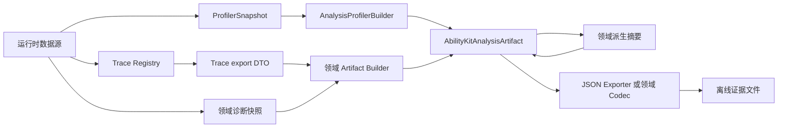
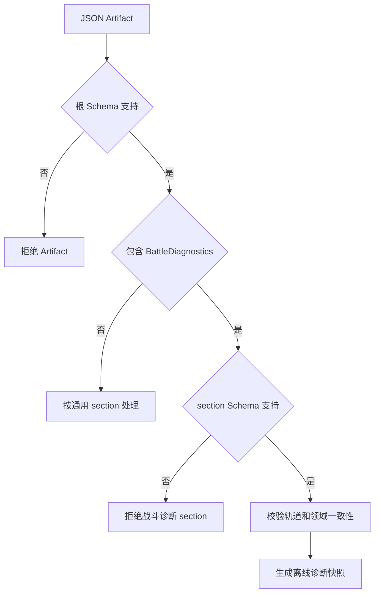
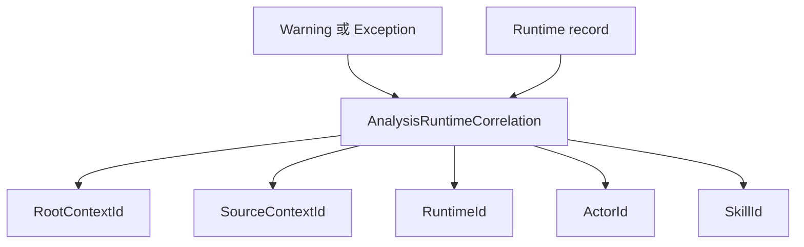
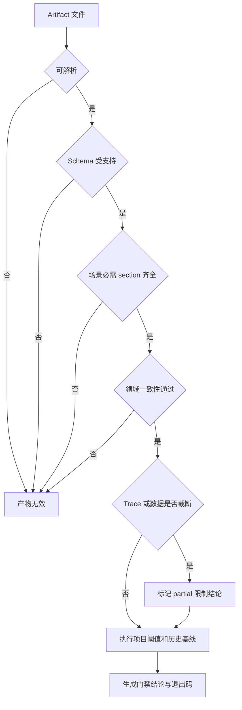

# Analysis Artifact 与运行时证据

> 文档类型：Canonical 运行证据契约
>
> 事实基线：2026-08-16
>
> 当前证据：根 DTO、Exporter、MOBA Builder 与 BattleDiagnostics codec 已实现；尚无统一根 validator 或 Analysis 专项 E5 gate

## 一、文档定位

Analysis Artifact 是 AbilityKit 诊断数据的版本化聚合容器。它把一次运行中的 Profiler 指标、Trace 因果链、警告与异常、运行时对象状态、派生结论、阈值评估和基线比较组织到同一份离线产物中，供编辑器、Web 分析页、回归脚本或人工排障使用。

本文描述当前源码已经实现的契约与 MOBA 生产投影，不把展示样例、Demo 阈值或未来通用评估器写成既有保证。Trace 注册表自身的生命周期、清理和原始导出语义见 `13-FrameworkCore/03-TraceLifecycleAndExportProtocol.md`。

当前根 Schema 版本为 `abilitykit-analysis.v1`。版本号表示根 DTO 的协议身份，不代表每个 section 都由通用框架自动采集，也不代表任意生产者填出的内容具有相同完整度。

## 二、Artifact 的职责边界

### 2.1 它是证据容器，不是运行时状态源

`AbilityKitAnalysisArtifact` 包含以下 section：

| Section | 当前职责 | 数据来源 |
|---|---|---|
| `Session` | 会话、场景、生产者、平台和生成时间 | Artifact Builder |
| `Time` | 起止时间、帧区间、持续时间和时钟说明 | Artifact Builder |
| `Dictionaries` | Trace Kind、结束原因、指标和诊断分类字典 | 通用或领域 Builder |
| `Profiler` | 指标定义、计数器、Gauge、采样摘要、速率、耗时、事件和 Flame tree | `ProfilerSnapshot` |
| `Trace` | 稳定字段组成的根、节点、边和领域元数据投影 | Trace export DTO |
| `BattleDiagnostics` | 战斗事件、状态、Trace、属性、Buff、Tag 和 Effect 轨道 | MOBA 战斗诊断会话 |
| `Diagnostics` | 警告、异常和聚合统计 | 领域诊断快照 |
| `Runtime` | 生命周期记录及 Trace/Actor/Skill 关联 | 领域诊断快照 |
| `Insights` | 结论、风险和排名 | 领域派生 Builder |
| `ThresholdProfile` | 阈值规则及本次评估结果 | 领域策略 |
| `Baseline` | 当前值与指定基线的比较 | 领域策略或外部系统 |
| `Metadata` | 不适合固定为强类型字段的补充信息 | Artifact Builder |

Artifact 是一次观察结果。它不负责恢复游戏世界，不替代 FrameRecord、Snapshot 或存档协议，也不应成为战斗逻辑的读取来源。

Analysis Artifact 与 FrameRecord 是互补证据：前者聚合指标、Trace、诊断、阈值和基线，后者保存 Inputs、Snapshots、StateHashes 三条可回读轨道。Shooter Smoke 可以同时引用二者，但 Analysis JSON 可解析不证明 FrameRecord 可重放，FrameRecord 可加载也不证明阈值、业务场景或 CI gate 已通过。FrameRecord 当前 codec 与回读边界见 [FrameRecord 编码与 Smoke 证据链](../07-NetworkSynchronization/06-FrameRecordCodecAndSmokeEvidence.md)。

### 2.2 数据形成流程

通用包定义 DTO 和 Profiler 投影。哪些运行时数据进入 Artifact、如何映射 Trace metadata、哪些现象算风险，仍由具体生产者决定。当前最完整的生产者是 MOBA 的 `MobaAnalysisArtifactBuilder`。

## 三、稳定根契约

### 3.1 Schema 与 section 版本

根对象默认写入 `AbilityKitAnalysisSchema.Version`，当前值为 `abilitykit-analysis.v1`。通用 JSON Exporter 在导出前发现根版本为空时也会补上该值。

`BattleDiagnostics` 是可选 section，并有独立版本 `abilitykit-battle-diagnostics.v1`。独立版本允许战斗诊断轨道在不改变所有通用 section 的情况下演进，但导入方必须同时校验根版本和 section 版本。

根 Schema 当前只有版本常量和 DTO 定义，没有通用 JSON Schema 文件、迁移器或兼容版本表。新增、删除或改变字段语义时，不能只依赖 Newtonsoft.Json 的宽松反序列化行为判断兼容性。

### 3.2 KeyValue 是扩展槽，不是类型系统

多个 section 使用 `AnalysisKeyValue` 保存补充字段。它适合低频、展示型或尚未稳定的维度，但所有值都以字符串保存，因此：

- 门禁依赖的字段应优先进入强类型 DTO。
- Key 命名需要由生产者保持稳定，不能依赖显示文本。
- 数值解析必须固定 Culture 和单位。
- 同名 Key 是否允许重复，当前 DTO 没有全局约束。

## 四、事实数据投影

### 4.1 Profiler Snapshot

`AnalysisProfilerBuilder.FromSnapshot()` 是通用包内已实现的投影入口。它复制指标定义，并将不同采样模型转换为适合离线读取的记录：

- Counter 保留当前值、Delta 和采样数。
- Gauge 保留值和时间戳。
- Sample 计算 Count、Sum、Mean、Min 和 Max。
- Rate 保留总量、1/5/60 秒窗口和每秒峰值。
- Duration 输出次数、总耗时、平均值、最小值和最大值。
- Event 保留严重级别、分类、消息、值和阈值。
- Flame tree 递归复制 Total、Self、Hits 和子节点。

该过程是内存快照到 DTO 的机械投影，不执行项目性能预算、趋势分析或门禁判定。指标是否齐全仍取决于运行时埋点和 Snapshot 采集时机。

### 4.2 Trace 稳定投影

通用 Trace export DTO 的 metadata 类型是 `object`，不适合长期存档。MOBA Builder 会把它转换为 `AnalysisTraceMetadata`，只保留配置 ID、Actor、Source/Target、原始来源、显示名和字符串属性，并另外生成 parent-child edge。

MOBA 当前使用树前序导出，并允许配置最大节点数、最大深度和是否只选择活动根。Artifact 同时保留根级和 section 级 `Truncated`，后续分析必须先检查截断状态，再判断父节点缺失或链路完整性。

Trace 的稳定性来自投影后的强类型字段，不表示根 DTO 能解释所有领域 metadata。其他项目接入时应定义自己的可持久化映射，不应序列化任意运行时对象。

### 4.3 Diagnostics 与 Runtime

MOBA Builder 将警告和异常记录投影到 `Diagnostics`，并附带 RootContextId、SourceContextId、RuntimeId、ActorId 和 SkillId 等关联字段。输入与 Snapshot Router 的聚合统计进入 `Aggregates`。

`Runtime` 保存技能运行时和临时实体生命周期记录。它的作用是把“发现异常”与“哪个运行时对象、Actor、Skill 或 Trace 链相关”连接起来，而不是复制完整战斗世界。

## 五、MOBA 派生分析

### 5.1 当前规则不是通用策略

`MobaAnalysisDerivedSummaryBuilder` 基于已经投影的数据追加四类摘要：

| 摘要 | 主要输入 | 当前判断 |
|---|---|---|
| Trace health | 根、节点、父节点、活动状态、截断状态 | 活动节点比例、缺失父节点和截断风险 |
| Skill chain | SkillCast 根及其子节点 Kind | 完整根比例、Effect、Damage、Projectile、Buff 和表现节点数量 |
| Runtime leak | 临时实体生命周期计数 | active 是否在终态计数追平后仍非零 |
| Snapshot contract | emitter、请求、命中和空结果 | 必需 emitter 是否齐全、输出契约是否满足、空结果率 |

规则输出 `Insights.Records`、`Risks` 和 `Rankings`。这些 ID 以 `moba.*` 开头，语义和阈值都属于 `AbilityKit.Demo.Moba`，不能直接作为其他游戏或生产环境的默认门禁。

### 5.2 内置阈值

当前 profile 名为 `moba-demo-default`，版本为 `1.0.0`，包含三条规则：

| Rule | 条件 | 严重级别 |
|---|---|---|
| `moba.trace.active-nodes.critical` | 活动节点达到 `max(8, ceil(nodeCount * 0.5))` | critical |
| `moba.snapshot.empty-rate.warning` | 空结果率大于 `0.2` | warning |
| `moba.runtime.active.warning` | 临时运行时 active 总量大于 `0` | warning |

Trace profile 中声明的规则值是 `8`，实际评估会根据节点总量把 expected 提高到 50% 对应值。因此消费方应读取 `Evaluations.Expected` 理解本次判定，不能只读取静态 `Rules.Value` 重放结论。

阈值评估目前只用 `info` 表示 pass，其他严重级别表示 fail。通用 DTO 没有限定 severity、status 或 operator 的枚举，也没有通用规则执行器验证 `Rules` 与 `Evaluations` 一致。

### 5.3 Demo baseline

内置 baseline 标识为 `moba-demo-baseline`，比较三项数据：

- 活动运行时总量相对 `0`。
- Snapshot 空结果率相对 `0.05`。
- rejected 总量相对 `0`。

所有方向均为 `higher-is-worse`。`Delta = Current - Baseline`；基线为零且当前非零时，`DeltaPercent` 固定为 `1`，它不是数学意义上的无穷百分比，也不应显示成“增长 100%”后直接参与跨指标排名。

源码 metadata 已注明该 baseline 应在 CI 或生产分析中替换为历史项目基线。当前值用于 Demo 演示和数据结构验证，不构成正式性能预算。

## 六、BattleDiagnostics 离线证据

### 6.1 可往返的领域 section

`MobaBattleDiagnosticArtifactCodec` 为 BattleDiagnostics 提供了比通用 Exporter 更完整的协议闭环：

1. 将战斗诊断 Snapshot 转换为独立 section 并挂到根 Artifact。
2. 导出 JSON。
3. 导入时校验 JSON、根 Schema 和 section Schema。
4. 检查必需轨道和列表。
5. 校验 event metrics revision/count、事件序列严格递增，以及 world actor count 与 actor list 一致。
6. 重建可供离线查询的 `BattleDiagnosticSessionSnapshot`。

该 section 覆盖事件、状态、Trace、属性、Modifier、Buff、Tag 和 Effect 轨道，因此可以在不启动战斗运行时的情况下进行过滤、分页和最近状态读取。

### 6.2 已有自动化证据

`MobaBattleDiagnosticArtifactCodecTests` 当前覆盖：

- 完整轨道和结构化 payload 往返。
- camelCase `battleDiagnostics` 属性读取。
- 根和 section Schema 错误拒绝。
- 空内容、坏 JSON 和缺失战斗 section。
- event metrics、event sequence 与 actor count 一致性。
- Offline session 的过滤、分页、revision、trigger analysis 和 latest tracks。
- Trace stable 与 partial 状态。

这些测试锁定的是 BattleDiagnostics codec 与离线查询行为。没有发现专项测试直接锁定 `MobaAnalysisDerivedSummaryBuilder` 的阈值、severity、risk、ranking 和 baseline 计算；也没有通用 Artifact 全 section 导入器的对称往返测试。

## 七、导出器与消费方责任

### 7.1 通用 JSON Exporter

`AnalysisArtifactJsonExporter` 使用 Newtonsoft.Json 缩进输出，忽略 null，保留默认值。它负责序列化和写文件，但不负责：

- 对所有 section 做必填校验。
- 校验时间轴、Trace edge 或 correlation 的一致性。
- 拒绝未知 Schema。
- 导入或迁移旧版本。
- 根据 ThresholdProfile 自动决定进程退出码。

因此“成功写出 JSON”只证明序列化完成，不等于产物可作为 CI 门禁证据。

MOBA/Shooter smoke 的 artifact 要求也遵循同一原则。`tools/test-gates.json` 中 `artifactRequired: true` 表示该 gate 必须保留可追溯输出，不表示任意 JSON、Replay 或日志文件存在即可通过。E4 需要场景断言、领域回读和产物一致性；E5 还需要 CI 触发策略、失败阻断、预算或发布责任。当前 `moba-smoke` 有 PR/push/schedule 的 P1 workflow job；`moba-multiprocess` 只在 gate 配置中声明 schedule-only，workflow 未发现对应 job。Shooter 另有 multiprocess、compatibility、soak、ownership cleanup 与 performance 分层，不能用单次 smoke artifact 代替这些策略。

Orleans Gateway 的 `GatewaySkillAnalysisArtifacts` 是展示型消费者：它接受 camelCase/PascalCase 根字段，提取 session、time 和 trace 摘要；遇到非 `abilitykit-analysis.v1` 只追加 warning，仍可返回列表项。Admin Console 的详情 DTO 也保留为 `Record<string, unknown>`。这条链路适合浏览和诊断，不是严格导入器；成功出现在后台列表中不能证明根 Schema、必需 section 或领域一致性有效。

### 7.2 建议的门禁顺序

生产门禁应由独立消费方执行，并固定场景所需 section、Schema 白名单、完整性策略、阈值 profile 和 baseline 来源。Artifact DTO 本身不应隐式决定构建成功或失败。

## 八、展示样例与当前 DTO

`sample-web-output-analysis/moba-complete-flow.analysis.json` 使用 `run`、`summary`、`trace` 和旧式 insight sections，形态与当前根 DTO 的 `session`、`time`、`dictionaries`、`profiler`、`insights`、`thresholdProfile` 和 `baseline` 不一致。

该文件应视为历史或 Web 展示投影样例，不能作为 `abilitykit-analysis.v1` 当前 C# DTO 的完整规范。它与当前 DTO 共用版本字符串会造成消费方误判，后续应选择以下一种处理方式：

1. 将样例迁移为当前 DTO，并用真实 Exporter 生成。
2. 为 Web view model 使用独立版本和转换器。
3. 在样例 metadata 或文件说明中明确 legacy 状态，并从 Schema 验收样本中排除。

在完成处理前，不能仅凭根版本字符串认为该样例可由当前 codec 无损读取。

## 九、成熟度与待补验证

| 能力 | 当前状态 | 结论 |
|---|---|---|
| 根 DTO 与版本常量 | 已实现 | 可作为版本化容器，但缺少正式 JSON Schema 和迁移策略 |
| Profiler 投影 | 已实现 | 可输出事实数据，尚不执行通用预算门禁 |
| MOBA Trace/Diagnostics/Runtime 投影 | 已实现 | 已有生产 Builder，字段完整度受采集选项影响 |
| MOBA Insights/Threshold/Baseline | 已实现 Demo 策略 | 不能直接提升为通用或生产默认策略 |
| BattleDiagnostics 导入导出 | 已实现并有 NUnit 测试 | 当前最完整的 Analysis section 离线往返证据 |
| FrameRecord smoke evidence | Shooter 已有实际记录、回读和 diff 链 | 属于独立记录协议，不能由 Analysis 根 Schema 替代 |
| CI artifact retention | MOBA/Shooter 多个 gate 要求 artifact | 证明产物被保留；是否通过仍由场景断言和 gate policy 决定 |
| 通用 Artifact 导入与校验 | 未实现 | 不能宣称根 Artifact 全量往返 |
| CI 门禁评估器 | 未发现统一实现 | 需要消费方定义失败策略和退出码 |
| Web 样例兼容 | 存在格式漂移 | 需要迁移或独立版本 |

2026-08-16 本地 `AbilityKit.Diagnostics.Tests` 为 `3/3` 通过，只覆盖通用 Diagnostics 包现有局部契约。本轮未运行 Unity `MobaBattleDiagnosticArtifactCodecTests`，因此 BattleDiagnostics 往返证据继续引用既有测试资产与历史运行记录，不把 .NET Diagnostics 测试外推为 MOBA section 已重跑。

建议补测顺序：

| 优先级 | 测试或治理项 |
|---|---|
| P0 | 为当前根 DTO 建立 canonical JSON fixture，并验证 Exporter 输出字段形态 |
| P0 | 为 MOBA 派生 Builder 锁定阈值边界、severity、risk 和 baseline delta |
| P0 | 解决 Web 样例与当前 DTO 共用版本但结构不同的问题 |
| P1 | 增加通用 Artifact validator，校验 Schema、必需 section、时间轴和 Trace 结构 |
| P1 | 定义 CI threshold/baseline 输入和稳定退出码 |
| P1 | 增加跨版本兼容测试和明确的迁移/拒绝矩阵 |
| P2 | 对大 Trace、Flame tree 和 BattleDiagnostics 轨道执行文件尺寸与解析成本测试 |

## 十、源码入口

| 职责 | 文件 |
|---|---|
| 根 Schema 与所有通用 DTO | `Unity/Packages/com.abilitykit.diagnostics/Runtime/Analysis/AnalysisArtifact.cs` |
| Profiler Snapshot 投影 | `Unity/Packages/com.abilitykit.diagnostics/Runtime/Analysis/AnalysisProfilerBuilder.cs` |
| BattleDiagnostics section DTO | `Unity/Packages/com.abilitykit.diagnostics/Runtime/Analysis/AnalysisBattleDiagnosticSection.cs` |
| 通用 JSON 导出 | `Unity/Packages/com.abilitykit.diagnostics/Editor/Exporters/AnalysisArtifactJsonExporter.cs` |
| MOBA Artifact 组装 | `Unity/Packages/com.abilitykit.demo.moba.runtime/Runtime/Application/Services/Diagnostics/MobaAnalysisArtifactBuilder.cs` |
| MOBA 派生摘要、阈值和 baseline | `Unity/Packages/com.abilitykit.demo.moba.runtime/Runtime/Application/Services/Diagnostics/MobaAnalysisDerivedSummaryBuilder.cs` |
| BattleDiagnostics codec | `Unity/Packages/com.abilitykit.demo.moba.runtime/Runtime/Application/Services/Diagnostics/MobaBattleDiagnosticArtifactCodec.cs` |
| BattleDiagnostics codec 测试 | `Unity/Packages/com.abilitykit.demo.moba.editor/Tests/MobaBattleDiagnosticArtifactCodecTests.cs` |
| FrameRecord evidence canonical | `Docs/design/07-NetworkSynchronization/06-FrameRecordCodecAndSmokeEvidence.md` |
| Gate 与 artifact policy | `tools/test-gates.json`、`.github/workflows/abilitykit-test-gates.yml` |
| 历史/Web 展示样例 | `sample-web-output-analysis/moba-complete-flow.analysis.json` |

## 十一、证据等级与已知限制

| 能力 | 当前事实 | 证据等级上限 |
|---|---|---|
| 根容器与 `abilitykit-analysis.v1` 常量 | DTO 和通用 JSON Exporter 已实现 | E2/E3：可序列化及局部契约，不等于语义有效 |
| MOBA Diagnostics/Runtime/Insights 投影 | Builder 和 Demo 策略已实现 | E3：项目投影；阈值与 baseline 不是框架通用预算 |
| BattleDiagnostics section | 有专用 codec 与往返 NUnit | E3：该 section 的离线往返 |
| Smoke artifact retention | 多个 MOBA/Shooter job 保留产物 | E4/E5 取决于具体场景断言和 workflow，不由 Analysis 文件存在自动获得 |
| 根级验证与迁移 | 未发现统一 validator、正式 JSON Schema、迁移器或专项 gate | E0/E1：仍是治理目标 |

仓库的 Web 展示样例与当前 C# 根 DTO 至少有一份结构不一致，却复用了 `abilitykit-analysis.v1`。在迁移样例、拆分 Web view schema 或明确 legacy 标记之前，消费端不能只检查版本字符串。任何自动门禁都应进一步验证必需 section、字段语义、时间轴/Trace 一致性、完整性标记、阈值来源和 baseline 身份。

当前 `tools/test-gates.json` 与 workflow 没有 Analysis Artifact 专项 gate。因此本文定义的推荐消费顺序是规范目标，不是已接线发布链。项目可以基于现有 DTO 建立自己的 E4 场景证据，但若要形成 E5，必须增加独立 validator、canonical fixture、稳定退出码、实际 workflow job 和失败责任。

## 十二、结论

Analysis Artifact 已具备版本化根容器、通用 Profiler 投影、MOBA 运行时证据组装和 BattleDiagnostics 离线往返能力。当前可以把它用于诊断留档、离线查询和项目侧门禁输入，但不能把 JSON 导出成功等同于证据有效，也不能把 MOBA Demo 阈值和嵌入 baseline 当作通用生产标准。

FrameRecord、Smoke 输出和 CI artifact retention 提供相邻但不同的证据层。正式门禁还需要补齐根级 validator、canonical fixture、派生规则测试、项目历史 baseline 和确定的退出码策略，并由 gate 固定场景断言、触发策略与失败责任。展示样例与当前 DTO 的格式漂移也应在继续扩展消费端前处理，否则相同版本字符串会掩盖实际协议差异。

---

*文档版本：v3.1 | 最后更新：2026-08-16*
