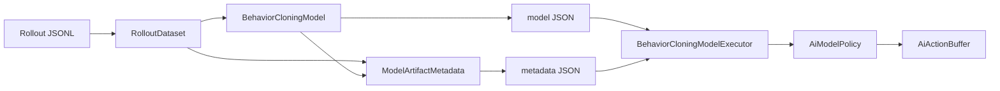
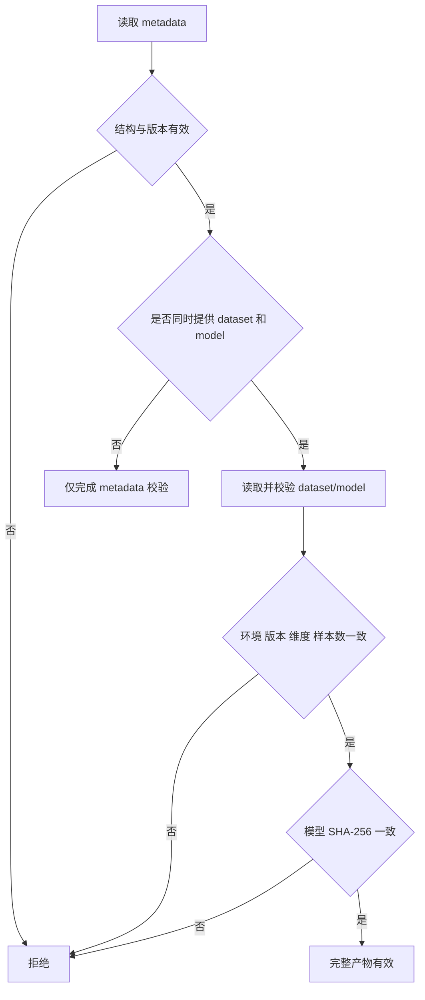
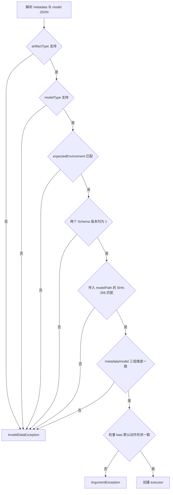
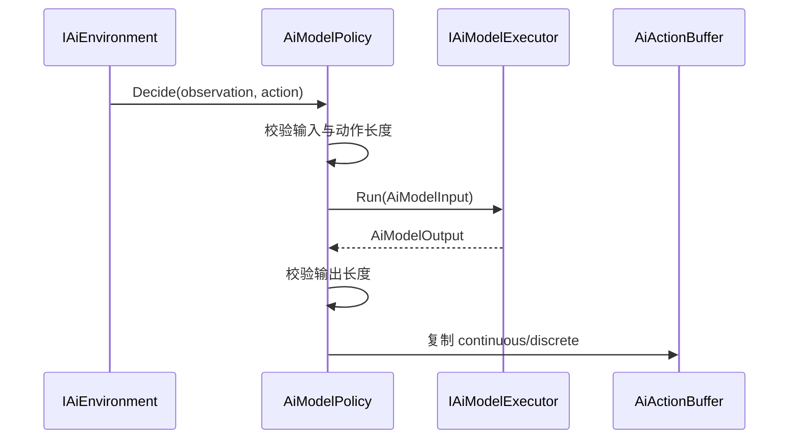
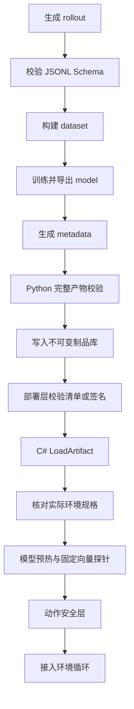

# AbilityKit AI 模型产物与运行时策略契约

> 本文整理 AbilityKit 当前已经实现的离线训练产物链路，说明 rollout、dataset、model、metadata、模型执行器和运行时策略之间的职责。本文描述的是第一版线性行为克隆 JSON 模型，不把 ONNX、神经网络推理、模型热更新或在线训练视为现有能力。

> 文档类型：Canonical AI 产物与运行时策略契约
>
> 事实基线：2026-08-16
>
> 当前证据：Python 与 C# 各自具备局部 E3；尚无跨进程 canonical fixture、真实场景 E4 或 AI 专项 E5 gate

---

## 1. 文档定位

[02-AiTrainingDataContract.md](02-AiTrainingDataContract.md) 定义训练 runner 输出的 JSONL 数据外壳。本文从 JSONL 之后继续，覆盖训练产物如何形成、如何校验，以及 C# 运行时如何把模型输出接入 `IAiPolicy`。

当前闭环由六层组成：

| 层级 | 主要类型或入口 | 职责 |
| --- | --- | --- |
| 训练轨迹 | `AiTrainingRolloutJsonLinesWriter` | 输出逐 step 的 observation、action、reward 和 state hash。 |
| Dataset | `RolloutDataset` | 收集 step 行并固定环境名、样本数和输入输出维度。 |
| Model | `BehaviorCloningModel` | 保存线性权重、bias、离散默认动作和训练指标。 |
| Metadata | `ModelArtifactMetadata` | 记录产物类型、版本、环境、维度、来源和模型 SHA-256。 |
| Executor | `BehaviorCloningModelExecutor` | 加载 metadata/model，执行线性推理。 |
| Policy | `AiModelPolicy` | 将 executor 适配为运行时 `IAiPolicy`，复制输出到动作缓冲。 |



这条链路把训练工具与运行时隔离在文件契约两侧。运行时不读取 rollout 或 dataset，也不根据训练参数重新构造模型。

---

## 2. 训练数据与模型产物不是同一个契约

当前实现中存在三个版本概念：

| 字段或常量 | 当前值 | 约束对象 |
| --- | --- | --- |
| rollout/dataset `schemaVersion` | `1` | 训练数据行和 dataset JSON。 |
| metadata `schemaVersion` | `1` | 模型产物清单自身。 |
| metadata `artifactType` | `abilitykit.ai.model-artifact.v1` | 模型产物清单类别。 |
| metadata/model `modelType` | `abilitykit.behavior_cloning.linear.v1` | 模型内容和执行算法。 |

`dataSchemaVersion` 记录训练该模型时使用的数据版本，但不能替代模型格式版本。模型算法、产物清单和训练数据应分别演进；任意一项出现不兼容变化，都不应仅靠修改另一个版本字段表达。

### 2.1 Dataset JSON

`build-dataset` 只消费 rollout 中的 `step` 行，忽略 `run` 和 `episode` 行。它从第一条样本确定 observation、continuous action 和 discrete action 的长度，并要求后续所有样本保持一致。

Dataset 保存：

- 数据 Schema 版本与环境名。
- rollout 来源路径。
- 完整训练样本。
- observation 和 action 维度。
- reward 汇总、episode 数和 seed 数。

环境名来自 `build-dataset --environment` 参数，不是从 rollout step 行推导。当前公共 step 契约本身没有环境字段，因此调用方需要保证参数与数据来源一致。

### 2.2 Model JSON

当前模型类型为 `abilitykit.behavior_cloning.linear.v1`，主要字段如下：

| 字段 | 含义 |
| --- | --- |
| `observationLength` | 扁平输入向量长度。 |
| `continuousActionLength` | 连续动作输出长度。 |
| `discreteActionLength` | 离散动作输出长度。 |
| `continuousWeights` | 形状为 continuous action 长度乘 observation 长度的权重矩阵。 |
| `continuousBias` | 每个连续动作对应的 bias。 |
| `discreteDefaults` | 每个离散动作槽位的默认值。 |
| `sampleCount` | 训练样本数。 |
| `meanSquaredError` | 当前训练工具计算的连续动作误差指标。 |

连续动作使用逐样本梯度下降拟合。训练前会用全数据集 observation 的最大绝对值做缩放，导出时再把权重还原到原始输入尺度，因此运行时可以直接使用原始 observation。

离散动作没有分类器。每个离散槽位取训练集中出现次数最多的值；次数相同时选择数值更小的动作。它是静态默认值，不随 observation 改变。

运行时公式为：

```text
continuous[o] = bias[o] + sum(weights[o][i] * observation[i])
discrete[d] = discreteDefaults[d]
```

因此该模型适合作为文件契约和推理链路的 baseline，不代表已经具备通用决策模型能力。

### 2.3 Metadata JSON

Metadata 是模型文件的清单，不包含权重。当前必填字段包括：

| 分类 | 字段 |
| --- | --- |
| 类型与版本 | `schemaVersion`、`artifactType`、`modelType`、`dataSchemaVersion` |
| 环境与形状 | `environment`、`observationLength`、`continuousActionLength`、`discreteActionLength` |
| 来源 | `sampleCount`、`sourceDatasetPath`、`modelPath`、`createdUtc` |
| 完整性 | `modelSha256` |
| 训练信息 | `training`、`metrics` |

`sourceDatasetPath` 和 `modelPath` 当前是溯源字符串，不是跨机器可移植的资源标识。是否使用相对路径、制品库 URI 或发布目录路径，尚未形成公共规范。

---

## 3. Python 训练端门禁

训练工具提供两级 metadata 校验。

### 3.1 Metadata 结构校验

只传 `--metadata` 时，工具校验：

- 所有必填字段的 JSON 类型。
- `schemaVersion == 1`。
- `artifactType == abilitykit.ai.model-artifact.v1`。
- `dataSchemaVersion == 1`。
- `sampleCount > 0`。
- `environment` 和 `modelType` 非空。

这一层不读取 dataset 和 model，不能证明维度、样本数或模型哈希与外部文件一致。

### 3.2 完整产物校验

同时传入 dataset 和 model 时，工具进一步比较：

| 校验项 | 比较范围 |
| --- | --- |
| environment | metadata 与 dataset。 |
| model type | metadata 与 model。 |
| data schema | metadata 与 dataset。 |
| observation 维度 | metadata、dataset、model。 |
| continuous action 维度 | metadata、dataset、model。 |
| discrete action 维度 | metadata、dataset、model。 |
| sample count | metadata、dataset、model。 |
| SHA-256 | metadata 与模型文件。 |



### 3.3 路径语义

`validate-metadata --model` 会读取命令行指定的模型并参与类型、维度和样本数比较，但 SHA-256 校验实际读取的是 metadata 内的 `modelPath`。当两个路径指向不同文件时，结构校验与哈希校验可能作用于不同对象。

发布流水线不应依赖这一行为推断模型身份。进入制品库前应统一模型路径，并补充测试保证完整校验始终对同一文件执行。

---

## 4. C# 模型加载门禁

`BehaviorCloningModelExecutor.LoadArtifact(metadataPath, modelPath, expectedEnvironment)` 只消费 metadata 和 model。它不读取 dataset，也不执行训练端的样本级校验。

加载顺序如下：



C# 与 Python 的主要差异如下：

| 能力 | Python 完整校验 | C# 加载器 |
| --- | --- | --- |
| metadata 类型和版本 | 校验 | 校验 |
| model type | 校验 | 校验且仅接受线性 v1 |
| environment | 与 dataset 比较 | 仅在传入 `expectedEnvironment` 时比较 |
| model SHA-256 | 校验 metadata `modelPath` | 校验调用方传入的 `modelPath` |
| 三组输入输出维度 | 校验 | 校验 |
| 权重矩阵和输出向量形状 | model reader 校验 | executor 构造时校验 |
| sample count | metadata/dataset/model 三方校验 | 不读取、不比较 |
| training/metrics | 要求为 object | 不读取 |
| source/model provenance | 保存但不验证来源 | 不读取 metadata 路径字段 |

这两级门禁承担不同职责。Python 完整校验面向训练制品形成，C# 加载器面向部署后最低限度的执行安全。不能用 C# 成功加载反推 dataset、样本数或训练指标真实可信。

C# 加载器也不核对 metadata 中的 `sourceDatasetPath`、`modelPath` 或 dataset hash；当前 metadata 本身没有 dataset hash 字段。它只对调用方传入的 model 文件计算 SHA-256，并与 metadata 声明比较。因此 metadata/model 自洽不等于训练数据来源可追溯，dataset 身份应由外层发布清单固定。

### 4.1 完整性边界

`modelSha256` 可以检测 model 文件被修改，但 metadata 自身没有签名或独立哈希。攻击者或错误发布流程若同时替换 model 与 metadata，加载器无法识别来源变化。

生产发布至少需要在外层增加以下一种机制：

- 对 metadata 清单签名，并由运行时校验可信签名。
- 由制品库提供不可变版本和可信摘要。
- 在应用发布清单中固定 metadata 与 model 的双重 hash。

这是部署完整性要求，不应塞入线性模型算法实现。

---

## 5. 运行时规格与策略适配

### 5.1 `AiModelPolicySpec`

模型规格同时保存环境规格与张量规格：

- `ObservationSpec` 与 `ActionSpec` 描述 AbilityKit 环境边界。
- `InputTensor`、`ContinuousOutputTensor` 和 `DiscreteOutputTensor` 描述模型侧名称、长度和值类型。

`FromEnvironment()` 使用环境长度生成默认张量名：

- `observation`
- `continuous_action`
- `discrete_action`

当前线性 JSON 模型不存储张量名称和值类型。加载器直接构造上述默认名称，并将 observation/continuous 视为 `Float32`，discrete 视为 `Int32`。

### 5.2 `AiModelPolicy.Decide()`

策略执行分为四步：

1. 检查 observation 长度是否等于 executor 的环境 observation 长度。
2. 检查目标 action buffer 的 continuous/discrete 长度。
3. 构造 `AiModelInput` 并调用 executor。
4. 检查输出长度并复制到 `AiActionBuffer`。



策略只负责适配和复制，不解释动作语义。连续值裁剪、离散动作合法范围、动作 mask 和玩法约束仍由环境或 action mapper 负责。例如 MOBA 的 action mapper 会裁剪移动输入和技能槽位，但这不是 `AiModelPolicy` 的通用行为。

当前线性 executor 每次 `Run()` 都新建 continuous 与 discrete 输出数组，随后 `AiModelPolicy` 再把它们复制到调用方动作缓冲。该路径尚未提供调用方缓冲写入或池化协议，不能声明稳态零分配；进入每帧或多 Agent 热路径前，需要建立目标硬件上的分配与推理耗时预算。

### 5.3 当前匹配规则

运行时主要按长度判断兼容性，尚未比较：

- observation/action 的 `Id`。
- 张量名称。
- observation 的值类型。
- executor 与目标环境的显式环境身份。

`expectedEnvironment` 只在加载阶段与 metadata 比较，而且是可选参数。部署代码应始终传入目标环境名，并在构建 policy 后与实际环境规格做显式校验。

### 5.4 输出安全

当前策略不检查：

- `NaN` 或正负无穷。
- 连续动作允许范围。
- 离散动作分支数量和单槽取值范围。
- 动作 mask。
- 推理超时或取消。

长度正确不等于动作可执行。生产环境需要在 policy 输出与环境 `Step()` 之间设置动作验证或规范化层，并记录拒绝原因。

### 5.5 生命周期

`IAiModelExecutor` 继承 `IDisposable`，但 `AiModelPolicy` 本身不实现 `IDisposable`，也不会释放传入的 executor。创建方拥有 executor 生命周期；带原生资源的后续执行器不能只保存为 policy 后放弃引用。

第一版 `BehaviorCloningModelExecutor.Dispose()` 为空，因此现有线性模型不会暴露资源泄漏，但这个事实不应扩展为所有执行器都无需释放。

---

## 6. 现有测试证据

### 6.1 Python 侧

`test_offline_training.py` 已覆盖：

- 从 rollout JSONL 构建 dataset。
- 拒绝未知数据 Schema。
- 训练模型并检查动作形状。
- 拒绝错误的权重矩阵和离散默认值形状。
- metadata、dataset、model 和文件 hash 的完整校验。
- `build-dataset -> train-bc -> validate-metadata` CLI 闭环。

### 6.2 C# 侧

`AiModelPolicyTests` 已覆盖：

- executor 输出复制到动作缓冲。
- observation 长度不匹配时拒绝执行。
- model 输出长度不匹配时拒绝执行。
- 线性权重计算结果。
- 手工构造的 Python 格式 JSON 可以加载并执行。
- model hash 不匹配时拒绝加载。
- model policy 可以驱动 Shooter 训练环境完成 episode。

MOBA 测试还证明共享 `AiModelPolicy` 边界可以驱动 MOBA 环境执行一步，但使用的是 delegate executor，不是磁盘模型产物。

### 6.3 证据边界

现有 C# “Python model JSON”测试直接在测试代码中拼接 JSON，没有在同一测试中调用 Python 训练工具。Python CLI 闭环与 C# 加载闭环分别成立，但仓库当前没有一份提交的 canonical artifact fixture，也没有一项测试串联：

```text
C# rollout -> Python dataset/model/metadata -> C# LoadArtifact -> environment episode
```

因此当前证据可以证明格式字段兼容，尚不能证明跨进程完整流水线在每次变更后自动回归。

2026-08-16 本地复核中，Python 离线训练测试 `6/6`、C# 推理测试 `7/7` 通过。它们没有改变上述边界：两侧仍各自构造测试数据，本轮没有生成并提交 canonical fixture，也没有执行跨进程完整训练后加载的 CI 链。

---

## 7. 当前风险与建议门禁

### 7.1 P0：进入发布前应补齐

| 项目 | 当前风险 | 建议 |
| --- | --- | --- |
| 跨语言 canonical fixture | 两侧测试各自构造数据，格式可能独立漂移。 | 提交最小 rollout/dataset/model/metadata fixture，并由 Python 与 C# 同时验证。 |
| 跨进程端到端测试 | 没有自动串联完整训练与运行时加载。 | 在 CI 中执行最小训练，再由 C# 加载并核对固定 observation 的输出。 |
| 模型路径一致性 | Python 结构校验与 hash 可能读取不同模型路径。 | 完整校验显式对命令行 `--model` 计算 hash，并核对 metadata 路径。 |
| 环境门禁 | C# 的 expected environment 可省略。 | 生产 bootstrap 强制提供环境名，并与实际 environment spec 比较。 |
| 动作安全 | 只检查输出长度。 | 增加有限值、范围、离散分支和 mask 校验层。 |
| 推理热路径分配 | 线性 executor 每次创建两组输出数组，policy 再复制一次。 | 增加写入调用方缓冲的执行协议，并建立分配/耗时 benchmark。 |

### 7.2 P1：模型类型扩展前应确定

| 项目 | 说明 |
| --- | --- |
| 执行器选择 | 当前调用方直接选择 `BehaviorCloningModelExecutor`，没有按 `modelType` 分派的注册表。 |
| 张量契约 | metadata 只保存长度，不保存张量名称、shape 维度、dtype、布局或动态轴。 |
| 产物签名 | SHA-256 只保护 model 内容与 metadata 声明的一致性，不证明发布来源。 |
| 生命周期 | policy 与 executor 的所有权没有类型化表达。 |
| 运行诊断 | 没有推理耗时、失败计数、模型版本和动作拒绝的统一 telemetry。 |
| 热更新 | 没有原子切换、旧模型回收、回滚或并发读取协议。 |

在引入 ONNX 或原生推理后端前，应先扩展 metadata 的张量和后端信息，再新增独立 executor。不要让新版执行器猜测线性 v1 字段，也不要复用同一 `modelType` 表达不兼容模型。

---

## 8. 推荐生产接入顺序



固定向量探针应至少保存一组 observation 和预期输出，用于检测不同语言的浮点解析、模型格式和执行器实现漂移。它不是模型质量评估，只是部署前的可执行性检查。

---

## 9. 源码入口

| 主题 | 入口 |
| --- | --- |
| AI 环境、规格和缓冲 | `Unity/Packages/com.abilitykit.ai.abstractions/Runtime/AiEnvironment.cs` |
| 模型规格和 policy 适配 | `src/AbilityKit.AI.Inference/AiModelPolicy.cs` |
| 线性模型加载与执行 | `src/AbilityKit.AI.Inference/BehaviorCloningModelExecutor.cs` |
| Rollout 到 dataset | `tools/ai_training/dataset.py` |
| 行为克隆训练与模型 JSON | `tools/ai_training/behavior_cloning.py` |
| Metadata 创建与校验 | `tools/ai_training/metadata.py` |
| Python CLI | `tools/ai_training/cli.py` |
| Python 训练测试 | `tools/ai_training/tests/test_offline_training.py` |
| C# 推理测试 | `src/AbilityKit.AI.Inference.Tests/AiModelPolicyTests.cs` |
| MOBA 共享边界测试 | `src/AbilityKit.Demo.Moba.Tests/AI/MobaAiTrainingEnvironmentTests.cs` |

---

## 10. 当前证据结论

| 证据项 | 当前状态 | 可以声明 | 不能声明 |
|---|---|---|---|
| Python CLI 与测试 | `build-dataset`、`train-bc`、`validate-metadata` 有专项测试 | schema、维度、hash 与 baseline 训练局部契约达到 E3 | 训练质量、生产数据治理或发布链完成 |
| C# Executor/Policy 与测试 | `BehaviorCloningModelExecutor`、`AiModelPolicySpec` 和策略测试存在 | 模型加载、规格匹配和确定性线性执行达到 E3 | 任意模型后端、热更新、动作安全或目标硬件预算 |
| 跨语言闭环 | 两侧格式可由手工 JSON 对齐 | 具备闭环设计基础 | 每次变更自动执行 C# -> Python -> C# |
| CI gate | gate 配置和 workflow 均无 AI 专项入口 | 无 | PR、nightly 或发布 E5 覆盖 |

要形成 E4，需要提交或可重复生成 canonical artifact fixture，固定训练输入、环境 spec、种子和探针输出，并让真实 Shooter/MOBA 环境执行验收。要形成 E5，需要把完整性校验、跨进程探针、动作安全、artifact retention 和失败策略接入实际 workflow；仅增加 `ciPolicy` 条目仍不够。

## 11. 结论

AbilityKit 已有一条可以执行的最小训练产物闭环：训练轨迹进入 Python dataset，线性行为克隆导出 model 与 metadata，C# 校验类型、版本、环境、hash 和维度后执行模型，再通过 `AiModelPolicy` 写入统一动作缓冲。

这条闭环当前解决的是格式互通和运行时接入，不是模型平台。线性模型只学习连续动作，离散动作仍是静态默认值；运行时只按长度保护缓冲，不负责动作合法性、模型来源、资源热切换或推理质量。后续扩展应保留 metadata 门禁与 policy/executor 分层，同时先补齐 canonical fixture、跨进程测试、路径一致性和动作安全检查。

---

*文档版本：v3.1 | 最后更新：2026-08-16*
