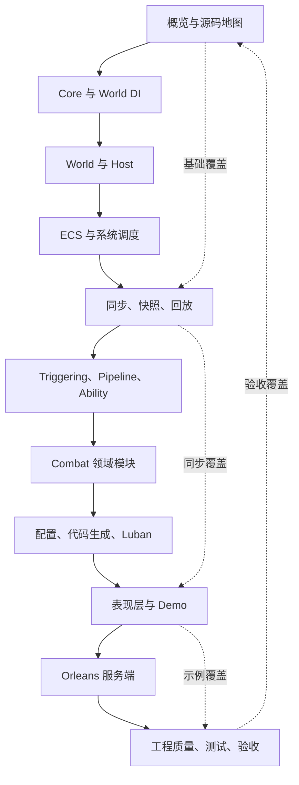
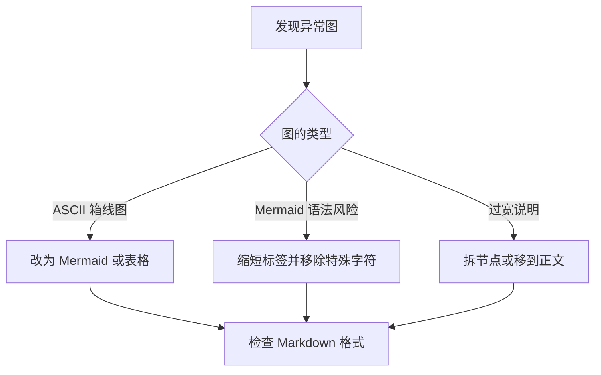
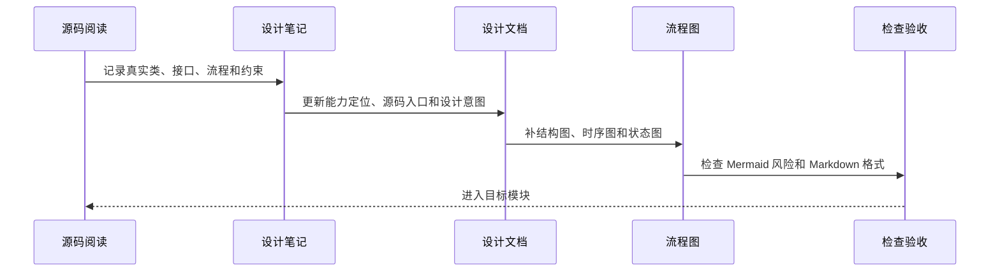

# 11.1 文档治理路线图：源码覆盖、设计意图与流程图规范

> 本文定义 `Docs/design` 的长期治理规则。目标是让设计文档持续对应真实源码、运行流程和验收入口，并为专题扩展、结构调整、流程图维护和版本记录提供统一标准。

---

## 1. 总目标

`Docs/design` 不只追求“有文档”，而是要求每篇设计文档都能回答读者最关心的五个问题：

| 问题 | 文档必须给出的答案 |
|------|--------------------|
| 这个模块解决什么问题 | 描述业务痛点、工程痛点和框架边界 |
| 为什么这样设计 | 说明核心抽象、生命周期、依赖方向和取舍 |
| 源码从哪里进入 | 列出 Unity package、.NET project、Demo、测试或 Server 入口 |
| 运行时怎么流动 | 至少提供结构图、时序图、状态图或数据流图之一 |
| 理解如何被验证 | 给出源码阅读路径、运行命令、测试入口或调试观察点 |

---

## 2. 文档完成标准

每个模块完成时，至少满足以下标准：

| 标准 | 要求 |
|------|------|
| 源码驱动 | 以真实类、接口、方法和目录为依据，不保留过期伪 API |
| 设计意图 | 解释模块要解决的问题、为什么拆这些对象、为什么保持这些约束 |
| 生命周期 | 说明创建、注册、运行、销毁、回收、取消或清理流程 |
| 流程图 | 至少提供覆盖结构、关键运行流程和生命周期的图；简单模块可用表格替代低价值图 |
| 源码路径 | 标明核心源码、相关 Demo、验证测试或运行命令 |
| 可执行入口 | 至少提供最小接入示例、模式决策表、验证命令或可复制模板之一，并写清所有权与失败路径 |
| 风险边界 | 写清线程、确定性、GC、跨端、回滚、热更新或服务端边界 |
| 证据状态 | 区分源码事实、示例验证、测试覆盖、场景基线、批准预算和强制门禁 |
| 索引接入 | 更新 `00-index.md` 的文档定位、说明和版本记录 |
| 讲解接入 | 能从 `00-PresentationAndFeishuNavigation.md` 路由到高频主题；PPT 只引用飞书页面 URL，不依赖本地路径 |

### 2.1 文档类型与权威边界

正式化不等于把所有材料改写成同一种文章。`Docs/design` 中的文档必须先声明或能够明确判断自己的类型，不同类型承担不同责任：

| 类型 | 主要责任 | 可以包含 | 不应承担 |
|------|----------|----------|----------|
| 能力地图 | 建立跨包能力、依赖方向和选型入口 | 分层、组合关系、源码地图、成熟度摘要 | 展开单个实现类的全部细节 |
| Canonical 设计 | 作为某个稳定能力或跨模块契约的权威说明 | 设计动机、对象职责、生命周期、失败语义、扩展点、证据 | 记录每日开发过程或未确认猜测 |
| 接入指南 | 给出完成一个明确接入目标的操作路径 | 前置条件、装配步骤、最小代码、验证命令、故障定位 | 替代设计文档解释全部内部原理 |
| 示例分析 | 解释某个 Demo 如何选择并组合框架能力 | 项目策略、应用层编排、取舍、可复制模式、示例证据 | 把示例策略声明为框架默认契约 |
| 历史审计 | 保留某一日期的事实快照、问题和决策依据 | 日期、源码基线、当时结论、后续处置 | 作为当前 API 和成熟度的唯一依据 |
| 演进计划 | 描述尚未完成的目标、依赖和验收条件 | 目标设计、里程碑、风险、退出条件 | 使用现在时把计划描述成已实现能力 |

同一主题只能有一个稳定 canonical。接入指南和示例分析应链接到 canonical；历史审计和演进计划必须标明日期或状态，并在开头指向当前 canonical。若 package 内已经有更贴近源码所有权的权威设计，`Docs/design` 只建立跨模块导航和能力摘要，不复制出第二份容易漂移的正文。

### 2.2 设计陈述的状态语言

设计文档必须区分“应该如此”“当前如此”和“未来希望如此”。下列状态可以作为小节标题、表格列或段落前缀使用：

| 状态 | 含义 | 推荐表达 |
|------|------|----------|
| 规范约束 | 已决定并要求调用方遵守的契约 | “必须”“不得”“由……拥有” |
| 当前实现 | 已由当前源码直接证明的行为 | “当前实现为”“源码中由……完成” |
| 示例策略 | 某个 Demo 或项目为了自身需求做出的选择 | “MOBA 示例选择”“Shooter 当前采用” |
| 目标设计 | 尚未完全实现、等待验证或计划迁移的方向 | “目标是”“计划引入”“尚未闭环” |
| 已知限制 | 已确认存在的缺口、风险或非事务行为 | “当前不保证”“失败后可能”“尚无证据” |
| 历史结论 | 只对指定日期或版本有效的审计结果 | “截至 YYYY-MM-DD”“当时基线为” |

禁止只使用“支持”“完成”“可用”“生产级”等没有范围的词。此类结论至少要同时写清对象、运行环境和证据，例如“Shooter TCP 主链已有 E2 调用和 E4 Smoke”，而不是“网络模块已生产可用”。

### 2.3 单篇文档的最小结构

复杂专题不要求机械套用固定标题，但正文必须能回答以下结构问题：

1. **定位**：能力解决什么问题，谁是调用方。
2. **边界**：负责什么、不负责什么，依赖方向和所有权在哪里。
3. **模型**：关键对象、状态和数据契约是什么。
4. **流程**：创建、运行、失败、取消、恢复和销毁如何发生。
5. **扩展**：项目应实现哪些端口，哪些行为不得绕过。
6. **证据**：源码入口、消费者、测试、Smoke、artifact 和门禁分别达到什么层级。
7. **限制**：当前缺口、性能条件、线程/确定性约束和未来演进是什么。

建议在文档开头或结尾保留下面的元信息。无法确认的字段应省略，不得编造 owner、版本或成熟度：

```text
文档类型：Canonical 设计 / 接入指南 / 示例分析 / 历史审计 / 演进计划
事实基线：YYYY-MM-DD 或具体 tag/commit
主要源码：Unity/Packages/...；src/...；Server/...
证据等级：E0-E5，并注明适用范围
当前限制：链接到本文限制章节或外部治理项
```

### 2.4 战斗工具集文档的特殊边界

战斗领域的价值来自多变性，文档不能因为多个示例具有相似代码形状，就默认存在一个应被抽取的通用应用层。正式设计应把内容分为三类：

| 复用性质 | 推荐归属 | 文档应说明的内容 |
|----------|----------|------------------|
| 行为语义稳定，可被不同玩法共同遵守 | Framework package | 稳定契约、生命周期、扩展点和失败语义 |
| 结构相似，但控制流和策略必然由项目修改 | Starter、Recipe 或示例源码 | 可复制的组织方式、替换点、项目接管后的所有权 |
| 依赖英雄、阵营、资源、结算、配置或表现规则 | 项目应用层 | 示例为何这样选择，以及其他项目不应照搬的部分 |

网络传输、序列化、连接和请求生命周期通常具有较强的协议稳定性，可以提供较完整的默认运行时；技能提交、Buff 调和、死亡复活、资源消耗、临时实体和战斗结算则经常是项目策略。后者只有在语义稳定、依赖可反转，并至少被第二类非同构玩法验证后，才适合晋升为框架能力。文档不得把“缺少统一 MOBA 应用层包”记录为天然缺口，也不得以减少接入代码为理由制造无法裁剪的公共编排器。

---

## 3. 总体治理顺序与覆盖矩阵



这组治理顺序遵循依赖方向：底座文档定义术语和生命周期，运行时文档解释装配与 Tick，玩法文档解释可组合能力，示例与服务端文档验证跨端落地。新文档可以引用前置概念，避免每篇都重复解释基础设施。

### 3.1 当前审计口径

本轮对 `Docs/design` 的 118 篇 Markdown 做结构盘点，并反向核对 `Unity/Packages`、`src`、`Server/Orleans`、测试工程和实际调用。篇幅、标题数量和 Mermaid 数量只用于发现候选，不直接决定文档质量；最终结论以源码契约、生产采用、生命周期、失败路径和验证证据为准。

缺口统一分为六类，避免把“未出现 package 名称”误判为“没有设计”：

| 缺口类型 | 判定方式 | 处置原则 |
|----------|----------|----------|
| canonical 缺失 | 能力有源码和采用入口，但 `Docs/design` 没有稳定专题 | 新建或并入最接近的能力地图 |
| 导航缺失 | package 内已有较完整设计，但总索引和阅读路径不可达 | 保留权威正文，补 canonical 导航和证据摘要 |
| 证据缺失 | 文档有设计说明，但没有测试、Smoke、生产调用或成熟度声明 | 补证据状态，不把“实现存在”写成“生产成熟” |
| 事实漂移 | 文档中的类型、流程、默认实现或失败语义与源码不一致 | 优先修正文档；若源码本身有缺陷，明确记录而不虚构能力 |
| 主题重叠 | 稳定设计、阶段计划和复盘材料描述同一主题 | 稳定契约留 canonical，阶段材料归档或降级为历史记录 |
| 索引治理 | 漏收录、重复编号、源码入口缺项或说明过期 | 限定修改索引，避免借机重排无关文档 |

### 3.2 证据成熟度

每个能力域按下列层级声明当前事实。高层级必须包含低层级的可追溯入口，但不能用单元测试替代生产采用，也不能用 Demo 运行替代发布门禁。

| 等级 | 可声明事实 | 不可外推的结论 |
|------|------------|----------------|
| E0 源码 | 类型和实现存在，可定位构建入口 | 已被采用、已稳定 |
| E1 示例 | Samples、Editor 或 Demo 有真实调用 | 生产默认、跨端可用 |
| E2 生产接入 | 业务运行时或服务端主链路采用 | 已覆盖失败和回归 |
| E3 自动测试 | 单元、契约或本地回环测试可执行 | 已通过真实部署和弱网验证 |
| E4 场景验收 | Smoke、Acceptance 或可复现 artifact 覆盖链路 | 已建立预算或发布阻断 |
| E5 发布门禁 | 基线、预算、CI 阻断和回滚责任明确 | 不代表未来版本无需复核 |

文档治理按覆盖范围记录，不以对话阶段或临时任务状态作为长期索引：

| 覆盖域 | 代表文档 | 源码验证重点 |
|------|------------|--------------|
| 入门与结构 | `01-OverviewAndGettingStarted/00-AbilityKitCapabilityMap.md`、`03-QuickStart.md`、`04-ProjectStructure.md` | Unity package、`src` 工程、Server/Orleans、Console Demo、构建与测试入口 |
| 网络同步 | `07-NetworkSynchronization` 全部 10 篇 | 同步 Profile 与远端能力、帧/状态同步、Q32.32 FrameTime、预测/回滚/表现重整、FrameRecord/Smoke/CI、线性 facade 与阶段化 Flow、可靠事件 checkpoint/baseline、双连接所有权和 transport 边界 |
| 玩法运行时 | `08-GameplayModules/06-DamageCalculation.md`、`07-TargetingSystem.md`、`08-PipelineAndAbilityRuntime.md` | Dataflow 与 Damage 的异形输入输出、Targeting 稳定排序、Pipeline run 隔离、Ability/MOBA 特化边界 |
| 独立基础设施 | package 内 Dataflow、HotReload、Network SDK、Threading 设计文档；前三者已作为包内 canonical 接入总索引 | package 文档与源码一致性、外部消费者、世界状态所有权、并发/确定性、测试成熟度 |
| Editor 可解释化与质量工具 | package 内 Ability Explain、Ability TestKit、Analyzer、BaseEditor、ActionEditorImpl canonical 与 Ability Explain Mock Sample | 静态注册和窗口生命周期、测试 Harness 所有权、Unity/Roslyn 诊断分工、Builder/legacy 边界、authoring-to-runtime 支持矩阵与 E0-E5 证据 |
| 配置与数据工具 | `05-CommonModules/04-ConfigurationSystem.md`、`07-CodeGenAndLubanProductionPipeline.md`、`08-ActionTimelineDataAndPlayback.md`、`09-ExcelScriptableObjectSync.md` | 运行时配置、生成发布、时间线协议和 Editor 双向同步的职责隔离、失败传播与验证门禁 |
| 示例体系 | `09-ImplementationExamples/02-ET Demo Analysis.md`、`03-MOBA Demo Analysis.md`、`04-Shooter Demo 与 Orleans Smoke.md` | ET Scene/Component/System、MOBA Blueprint/Bootstrap、Shooter Svelto runtime、Orleans smoke |
| 质量、采用与性能 | `10-EngineeringQuality/01-TestingWorkflow.md`、`04-CompanyAdoptionAndModuleGovernance.md`、`05-CrossModulePerformanceAndHotPathGovernance.md`、本文 | 测试门禁、成熟度证据、owner/rollback、benchmark artifact、预算与门禁晋升、阶段计划归档 |
| 内训与发布 | `00-PresentationAndFeishuNavigation.md`、`FeishuOfflineExportGuide.md` | PPT 阶段路由、示例展示定位、图片选择、飞书 URL 映射与点击验收 |


---

## 4. 模块批次计划

以下 Batch 0-12 是按依赖域组织的长期覆盖基线，不表示当前仍需从 Batch 0 顺序重做。当前增量工作以第 5 节的 P0-P2 审计矩阵为准；完成后回填对应能力域、索引和版本记录。

### 4.1 Batch 0：流程图健康检查与文档规范

| 项目 | 内容 |
|------|------|
| 目标 | 修复明显显示异常的流程图和旧 ASCII 图，建立统一写法 |
| 源码目录 | 不读源码，优先扫描 `Docs/design` |
| 目标文档 | `00-index.md`、本文、已有旧文档中的 Mermaid 和 ASCII 图 |
| 必画图 | 文档补全总路线图、流程图修复流程图、文档验收流程图 |
| 重点问题 | Mermaid 是否含未转义泛型、裸反斜杠换行、过宽节点、ASCII 箱线图 |
| 验收方式 | `git diff --check`，抽样阅读 Mermaid 语法，确认链接入口存在 |


### 4.2 Batch 1：概览、项目结构与源码入口

| 项目 | 内容 |
|------|------|
| 目标 | 说明 AbilityKit 是什么、源码在哪里、怎么运行、源码入口在哪里 |
| 源码目录 | `Unity/Packages`、`src`、`Server/Orleans`、`LubanConfig` |
| 目标文档 | `01-OverviewAndGettingStarted`、`00-Prologue.md`、`00-index.md` |
| 必画图 | 仓库结构图、包依赖图、Demo 启动路径图、源码路径图 |
| 设计意图 | 为什么源码集中在 Unity package，为什么保留 .NET project，为什么 Demo 和 Server 分层 |
| 验收方式 | 文档能支撑 build、Console Demo、至少一个测试入口的独立验证 |

### 4.3 Batch 2：Core 与通用基础设施

| 项目 | 内容 |
|------|------|
| 目标 | 覆盖事件、对象池、日志、标识、数值、配置基础能力 |
| 源码目录 | `Unity/Packages/com.abilitykit.core/Runtime` |
| 目标文档 | `05-CommonModules/01-EventSystem.md`、`02-ObjectPool.md`、`04-ConfigurationSystem.md`、Core 数值专题 |
| 必画图 | 事件派发时序图、对象池生命周期图、配置 provider 仲裁图、标识映射图 |
| 设计意图 | 降低 GC、统一事件解耦、稳定字符串 ID、支持配置覆盖和调试统计 |
| 验收方式 | 文档中的 API 与源码签名一致，移除 `Rent/Return`、`ITimerHandle` 等过期伪接口 |

### 4.4 Batch 3：World DI 与逻辑世界

| 项目 | 内容 |
|------|------|
| 目标 | 解释世界级依赖注入、世界生命周期、服务作用域和系统协作 |
| 源码目录 | `Unity/Packages/com.abilitykit.world.di/Runtime`、`Unity/Packages/com.abilitykit.world.ecs/Runtime` |
| 目标文档 | `02-LogicalWorldDesign/01-WorldOverview.md` 到 `05-ServiceContainer.md` |
| 必画图 | World 创建流程、Container/Scope 解析链路、System Tick 顺序、服务生命周期状态图 |
| 设计意图 | 为什么按 World 隔离服务，为什么需要 Scoped，如何避免跨战斗污染 |
| 验收方式 | 能从文档追到 `WorldContainer`、`WorldScope`、`WorldClock` 和系统注册入口 |

### 4.5 Batch 4：Host 运行时与扩展模块

| 项目 | 内容 |
|------|------|
| 目标 | 解释 HostRuntime 如何管理多世界、连接、广播、Tick 和扩展模块 |
| 源码目录 | `Unity/Packages/com.abilitykit.host/Runtime`、`Unity/Packages/com.abilitykit.host.extension/Runtime` |
| 目标文档 | `03-LogicalWorldHostDesign/01-HostRuntime.md` 到 `03-WorldManager.md` |
| 必画图 | HostRuntime Tick 时序图、World 创建销毁图、连接广播图、Blueprint/Module 装配图 |
| 设计意图 | 为什么 Host 不直接承载具体玩法，为什么通过 Hook/Feature/Module 扩展 |
| 验收方式 | 文档能解释 Demo 和 Orleans 如何复用同一 Host 抽象 |

### 4.6 Batch 5：ECS 适配与查询模型

| 项目 | 内容 |
|------|------|
| 目标 | 解释 AbilityKit 自有 ECS、Entitas、Svelto 三种模型的定位和取舍 |
| 源码目录 | `Unity/Packages/com.abilitykit.world.ecs/Runtime`、`com.abilitykit.world.entitas`、`com.abilitykit.world.svelto` |
| 目标文档 | `06-ECSArchitecture` 全目录 |
| 必画图 | EntityWorld 存储结构图、QueryImpl 流程图、Entitas 生命周期图、Svelto 提交流程图 |
| 设计意图 | 为什么保留多 ECS 适配，何时用轻量世界，何时接 Entitas 或 Svelto |
| 验收方式 | 文档能支撑查询模型选择，并解释 snapshot 遍历和版本校验 |

### 4.7 Batch 6：同步、快照、回滚与回放

| 项目 | 内容 |
|------|------|
| 目标 | 把多人同步链路拆成输入帧、快照、状态同步、预测回滚、录制回放 |
| 源码目录 | `com.abilitykit.world.framesync`、`com.abilitykit.world.snapshot`、`com.abilitykit.world.statesync`、`com.abilitykit.record`、`com.abilitykit.protocol` |
| 目标文档 | `07-NetworkSynchronization` 全目录 |
| 必画图 | 输入帧聚合图、快照封包图、预测回滚状态图、回放轨道图、重连恢复图 |
| 设计意图 | 为什么把输入、状态、表现分开，如何兼顾确定性、弱网、重连和验收 |
| 验收方式 | 能追踪一次客户端输入从采集到服务端推进再到表现层应用的完整链路 |

### 4.8 Batch 7：Triggering、Pipeline 与 Ability 核心玩法

| 项目 | 内容 |
|------|------|
| 目标 | 解释事件触发、条件判断、动作计划、技能阶段和运行上下文 |
| 源码目录 | `com.abilitykit.triggering`、`com.abilitykit.pipeline`、`com.abilitykit.ability`、`src/AbilityKit.Triggering` |
| 目标文档 | `08-GameplayModules/00-GameplayCapabilityMap.md` 到 `03-BuffSystem.md`、`08-PipelineAndAbilityRuntime.md` |
| 当前状态 | canonical Pipeline/Ability 深潜已建立；后续按测试、API 和示例变化持续校验 |
| 必画图 | TriggerPlan 执行图、条件表达式图、Pipeline 阶段图、Buff 生命周期图 |
| 设计意图 | 为什么用数据化 Plan，为什么用阶段管线，如何支持热更新、回放和测试 |
| 验收方式 | 文档能解释一个技能输入如何变成触发计划、效果执行和表现提示，并区分通用 Pipeline、Ability 服务与 MOBA runner |

### 4.9 Batch 8：Combat 领域模块

| 项目 | 内容 |
|------|------|
| 目标 | 覆盖目标搜索、投射物、伤害、实体索引、技能库、移动等战斗领域模块 |
| 源码目录 | `com.abilitykit.combat.*` |
| 目标文档 | `08-GameplayModules/04-ProjectileSystem.md` 到 `10-MotionPipeline.md` |
| 当前状态 | 12 篇玩法专题已正式化；Batch S 再复核 Targeting、Pipeline/Ability、Entity/Skill 索引、Motion 与 GameplayTags，校正融合路径、事件/清理、非事务索引、固定步长和目录协议边界；6 个聚焦工程当次共 `87/87`，Unity Editor 未重跑 |
| 必画图 | Targeting 管线图、Projectile 命中图、Damage Pipeline 图、实体索引更新图、移动来源合成图 |
| 设计意图 | 为什么把领域能力拆小包，如何组合成 MOBA/Shooter 不同战斗模型 |
| 验收方式 | 能通过文档追踪一次命中：搜索目标、生成投射物、命中判定、伤害结算、快照输出 |

### 4.10 Batch 9：配置、代码生成与数据链路

| 项目 | 内容 |
|------|------|
| 目标 | 区分运行时配置、CodeGen/Luban 生产链、ActionTimeline 协议与 Excel-ScriptableObject 编辑器同步 |
| 源码目录 | `Unity/Packages/com.abilitykit.ability`、`com.abilitykit.demo.moba.codegen`、`com.abilitykit.actionschema`、`com.abilitykit.excel-sync`、`LubanConfig`、Demo Configs |
| 目标文档 | `05-CommonModules/04-ConfigurationSystem.md`、`07-CodeGenAndLubanProductionPipeline.md`、`08-ActionTimelineDataAndPlayback.md`、`09-ExcelScriptableObjectSync.md` |
| 当前状态 | 四条 canonical 已于 2026-08-15 正式化：ConfigDatabase 明确 factory-first/反射 fallback 和批次提交；MOBA CodeGen 被定性为项目应用层资产并记录 gate 失效引用；ActionTimeline 与 Excel Sync 均保留无专项自动测试的成熟度边界 |
| 必画图 | 配置生成/加载图、时间线导出播放图、Excel 导入和三方冲突图 |
| 设计意图 | 避免把同名 Schema 或 Editor 工具误认为运行时配置能力，明确各数据资产的权威源、提交边界和失败传播 |
| 验收方式 | 能分别追踪运行时配置发布、logic JSON 导出播放和 Excel 双向同步，并定位每条链的测试与成熟度缺口 |

### 4.11 Batch 10：表现层、Demo 与工程示例

| 项目 | 内容 |
|------|------|
| 目标 | 解释逻辑表现分离、ViewEvent、Snapshot Dispatch、Console/MOBA/Shooter/ET Demo |
| 源码目录 | `com.abilitykit.demo.*`、`src/AbilityKit.Demo.*`、`Docs/design/09-ImplementationExamples` |
| 目标文档 | `04-PresentationLayerDesign`、`09-ImplementationExamples` |
| 当前状态 | 表现层 4 篇与顶层示例 4 篇已于 2026-08-15 正式化：公共路由、客户端宿主、项目表现/同步策略和示例验收分层；Console、ET、MOBA、Shooter 的现行源码入口与 E0-E5 证据边界已校正 |
| 必画图 | ViewEvent 转译图、Snapshot 分发图、Demo 启动图、跨平台适配图 |
| 设计意图 | 为什么表现层只消费事件和快照，如何支持 Unity、Console、ET、Server smoke 共用逻辑 |
| 验收方式 | 文档能解释同一个逻辑结果如何在不同端表现，并指出各端适配代码入口 |

### 4.12 Batch 11：Orleans 服务端与 Smoke 验收

| 项目 | 内容 |
|------|------|
| 目标 | 解释 Gateway、RoomGrain、BattleHost、FrameSyncGrain、Shooter Smoke 验收 |
| 源码目录 | `Server/Orleans/src`、`Server/Orleans/tools` |
| 目标文档 | Shooter/Orleans 示例文档、`12-ServerArchitecture` 服务端架构专题 |
| 当前状态 | 2026-08-15 已正式化 8 篇主体：修正 staged loading 最后上报即时 commit 与 Tick 补偿、MOBA 默认双运行路线、Room 持久化幂等/回滚、Shooter 严格输入与 payload 模板优先级；补齐 WebSocket、storage fallback、placement、Admin 安全/运维和 E0-E5 证据边界 |
| 必画图 | 网关请求图、房间生命周期图、战斗宿主推进图、Smoke 验收图 |
| 设计意图 | 为什么服务端只通过协议和 Host 组合接入，如何保证可测和可恢复 |
| 验收方式 | 能根据文档跑 smoke 或理解 smoke 输出中的帧、hash、reconnect、late join 结果 |

### 4.13 Batch 12：工程质量、测试与发布验收

| 项目 | 内容 |
|------|------|
| 目标 | 统一测试、采用治理、性能证据、DemoHarness、Unity 自动化、Smoke 和文档检查 |
| 源码目录 | `src/*Tests`、`Server/Orleans/src/*Tests`、`tools`、`.github` |
| 目标文档 | `10-EngineeringQuality/01-TestingWorkflow.md`、`04-CompanyAdoptionAndModuleGovernance.md`、`05-CrossModulePerformanceAndHotPathGovernance.md`，文档检查和发布验收专题 |
| 当前状态 | 2026-08-15 已正式化 `10-EngineeringQuality` 全部 9 篇：统一 E0-E5、配置/runner/workflow 三层 gate 口径，校正 AI/Analysis、性能、Beta 发布和历史审计边界；通用性能预算、AI/Analysis 和 package 发布 E5 仍未落地 |
| 必画图 | 测试金字塔图、CI 验收图、成熟度状态图、性能门禁晋升图、文档检查图 |
| 设计意图 | 为什么把纯逻辑测试、场景证据、成熟度、预算和发布阻断分层，如何降低回归与采用风险 |
| 验收方式 | 文档列出每类变更应运行的门禁、采用证据和性能声明边界 |

### 4.14 持续复核批次：既有 canonical 与最新源码对齐

| 项目 | 内容 |
|------|------|
| 目标 | 周期性选择 1 到 2 篇既有 canonical，按最新源码、生产调用和测试证据修正契约漂移，而不是只做措辞润色 |
| 本轮源码目录 | `com.abilitykit.core/Runtime/Event`、`Runtime/Generic/StableStringIdRegistry.cs`、`Runtime/Pooling`、Ability Triggering 生产适配与 Foundation 样例 |
| 本轮目标文档 | `05-CommonModules/01-EventSystem.md`、`05-CommonModules/02-ObjectPool.md` |
| 当前状态 | 2026-08-15 已再次对齐源码：字符串 Publish 只释放一次；Event 有优先级/once/异常/释放 E3；ObjectPool 的 collection check 在所有构建生效，并有生命周期、引用身份、重复归还和 overflow E3 |
| 剩余缺口 | Event 仍缺 once 递归、snapshot 内退订、null 字符串所有权与线程边界；ObjectPool 仍缺回调异常、manager/scope/config、旧 release handle、PooledObject 副本与并发专项测试 |
| 验收方式 | Core 与引用样例工程构建、可用测试入口、Markdown/Mermaid/链接/fence 检查与限定路径 diff 审阅 |

持续复核不覆盖原有专题批次的历史状态。候选优先级由源码变更频率、生产调用深度、文档最后更新时间和独立测试缺口共同决定；发现状态传播、所有权、确定性或失败边界漂移时，应优先更新现有 canonical，不重复创建同主题文档。

Batch 12 的工程质量文档应覆盖测试流程与发布验收。可拆分的专题边界如下：

| 专题 | 内容边界 | 源码与脚本入口 |
|------|----------|----------------|
| 文档检查与发布验收 | Markdown fence、Mermaid 风险、索引定位、链接扫描、版本记录规范 | `Docs/design`、`.github`、现有验证脚本 |
| CI 分层 Job 设计 | fast/unit、matrix、smoke、nightly、artifact retention 的 job 拆分 | `.github/workflows`、`tools`、`Server/Orleans/tools` |

---

## 5. 当前优化矩阵与优先级

优先级由事实错误风险、生命周期/所有权风险、生产调用深度和读者阻塞程度共同决定。P0 修复会直接误导接入或掩盖失败边界的内容；P1 补 canonical、关键设计和证据；P2 处理实验性能力、历史材料和长期治理。

| 优先级 | 能力或文档 | 当前证据与发现 | 处置 | 单篇验收重点 |
|--------|------------|----------------|------|--------------|
| P1 | 战斗工具集定位与应用层边界 | Batch F/Q/R/S/Z 已覆盖顶层定位、能力地图、MOBA 导航和 12 篇玩法专题；Batch Z 进一步按源码闭合 Targeting Builder 租约、Pipeline 失败清理、索引部分提交、Motion 外部副作用、Continuous Clear、GameplayTags 目录代际与 Behavior 重入边界，统一 Battle Application 仍不作为默认目标 | 文档正式化基线已完成；下一步把已记录的失败矩阵转成契约测试，并补 GameplayTags 原子目录、Motion 外部碰撞/回滚与跨原语关闭协议的集成验证 | 不把示例类型写成框架公共 DTO，不因代码形状相似而假设通用应用层；能力下沉必须说明语义、依赖、所有权和第二类非同构玩法验证 |
| P1 | CommonModules 与配置生产链 | 9 篇 canonical 已正式化：Event/ObjectPool/Flow 旧测试事实已纠正，Timer/HFSM 明确宿主与项目责任，ConfigDatabase 修正为 factory-first，CodeGen 按现存 MOBA 专用包重写，ActionTimeline/Excel Sync 保留 Editor/最小协议边界 | 文档基线已完成；下一步修复 `moba-codegen` 的缺失目标与 Luban 退出码/staging，按风险补 Core/Flow/Config/Timeline/Excel 契约测试 | 不把 MOBA manifest、Luban 表目录或 handler/phase 下沉为框架默认；实现、消费者、契约测试、运行验收和持续门禁分级声明 |
| P1 | 表现层与顶层示例 | Batch H/X 已复核表现 canonical 与项目深潜：通用 Snapshot routing 的空 Dispose、回调重入、非事务 Build，MOBA adapter/Binder ownership 与 emitter 门禁，Shooter full/delta 投影和静态/PlayMode/remote 宿主差异已按源码记录 | 优先补 dispatcher decoder/异常/同 order/回调退订/部分构建测试、MOBA Router manifest/空构建/buffer drain 测试，并闭环 Shooter remote client session/presentation teardown；ET 独立 E3 与新 Unity artifact 另行推进 | 不把 MOBA/Shooter 策略外推为框架应用套件，不把 GameObject/DOTS 切换写成跨平台完成，不把 `IDisposable` 类型存在写成整图自动回收；E0-E5 按对象和宿主声明 |
| P1 | Orleans 服务端与 Shooter Smoke | Batch U/V 已复核服务端、Session、MOBA 联机及 Shooter 服务端/Smoke：规范身份为 `battle`、MOBA 唯一 FrameSync，Shooter 默认 StateSync/2 人/30 帧 full；默认单进程 runner 仅登录一个账号，双本地模拟玩家不能替代第二名 Room 成员 | 下一步实现外部 store 与 placement、Admin 鉴权和真实运维执行器；为跨 Grain/store 遗弃清理补 attempt/死信/人工补偿；修复或显式配置 Shooter 单进程 Smoke 的两人开战前置，并以新 artifact 更新 E4 | 不把路径/catalog 身份当持久化身份，不把 timer 重试写成事务，不把断线写成 Leave，不把模板/Profile/controller 合并，不把 E3 harness 或本地 payload 写成 E4/E5 |
| P0 | Network SDK 与 transport | package canonical 与接入指南已修正并进入总索引；SDK 有 E2 消费者和 E3 契约测试，TCP 是 E2/E4 主链，InMemory/LiteNet/WebSocket 仅有 E0 实现与 E3 局部回环 | 文档基线已完成；下一步补 WebSocket Gateway 启动注册、LiteNet 服务端、transport 专项矩阵、真实弱网/跨平台与 E5 门禁 | Builder/Client 所有权、延迟 transport、Tick/Dispose、dispatcher/payload、TCP 默认、扩展 transport 的服务端与采用边界 |
| P1 | HotReload | Batch AD 已完成 Runtime P0 收敛：候选 Install/Initialize 失败不提交，生命周期异常可观测；world 按实例弱键隔离，支持显式/自动释放；overlay 每版本隔离，static callback 按 id 管理；专项测试 `13/13` | 下一步补稳定阶段结果 DTO、Entry 补偿/重建策略、overlay 实例释放协议、world safe-point 调度与 Unity/程序集卸载场景验证 | 不把候选提交隔离写成任意业务副作用事务，不把全局单飞门禁写成 Tick 并发安全，不把 Runtime E3 外推为 Editor/联机/发布 E4 |
| P1 | Dataflow | Batch AE 已收敛末阶段 Abort、部分输出/失败阶段身份、执行快照、批量原子校验、Builder 结构快照、typed slot、Clear/Reset、Composite 回灌与 Damage `_result` 数据竞争；Dataflow `20/20`、Damage `5/5` | 下一步补 Unity package/场景验证、null output 与 Damage 普通 Context 误用，明确列表冻结/并发修改策略，并建立 trace、性能预算和持续门禁 | 不把执行快照写成集合线程安全，不把 Processor 浅共享写成深克隆，不把 Runtime 局部 E3 外推为 Unity/生产 E4/E5 |
| P1 | Behavior 与 GameplayTags | Batch Z 已复核 Manager 反向 live-list 重入、创建/释放回调异常、Paused 批量关闭和直接 Pipeline Phase 所有权；GameplayTags 的越界正 Id、Reset 静默别名、JSON parent 字段不对称、byte 计数尾数据及四类反序列化部分提交已按源码记录；BTCore `3/3`、Behavior lifecycle `2/2`、GameplayTags `2/2` 均只覆盖局部契约 | 固化 Behavior 重入与 Shutdown；优先修复 GameplayTags JSON 往返和网络容量格式，补 Query/Requirements、引用计数、目录 merge/replace、事件与序列化专项测试，再建立性能和 E5 门禁 | 包、.NET 镜像、Demo/生产调用、生命周期/所有权、契约测试和成熟度声明一致 |
| P1 | 同步 Profile、能力协商、可靠事件与会话恢复 | Batch M/V/W 已正式化同步专题；Batch AC 进一步关闭 `PredictionCoordinator` 同帧重演、时间线残留和可变引用浅复制，公共接口收敛为单命令/帧批次处理、服务器快照和 Reset | 补服务端声明到客户端 controller 的版本兼容 E2E；闭环 checkpoint store/flush/circuit/baseline/reconnect 所有权，建立完整战斗确定性矩阵与非 TCP E2E | 不把能力协商或恢复 runtime 写成统一业务算法，不从模板名猜客户端算法，不把 facade 强推给复杂房间状态机，不把帧时钟定点化外推为全战斗逐位确定，不把 E3 当 E4/E5 |
| P1 | Shooter 项目级战斗应用组合 | Batch N/V/W 已正式化并复核 Shooter：runtime、快照、同步、双连接、表现、玩法和多进程证据已闭环；产品默认 AuthoritativeInterpolation 与 registry `Unspecified` 兼容分支已分离，默认要求两名 Room 成员全员 ready | 补 battle handle recovery runtime 的显式 teardown/reset、容量静默截断诊断、observer state 主动逐出、表现/SessionHost 生命周期与跨平台确定性矩阵；先关闭默认单进程 Smoke 一账号与两人 Room 前置不一致，再以新 artifact 更新 E4 | 不把 Shooter facade/controller/Room flow/full-state handler/玩法 step order 下沉为框架统一应用层，不把本地模拟玩家写成 Room 成员，不把 workflow 入口写成当次 E4，不把局部 E3 写成多进程 E4 |
| P1 | MOBA 项目应用组合与运行时所有权 | Batch O/P 已正式化 19 篇深潜：World/Input/Skill/Config/Entity/Buff/Projectile/Damage/Snapshot/Trigger/Continuous、DI、六英雄、Room/Session、Motion/Summon、SkillFlow、Runtime 和 Console 的项目边界、retain/transaction/teardown 与 Strict validation 已按当前工作区校正 | 修复 trigger `10060201` 的 SpawnArea duration/delay 配置阻断；补 Buff 行为绑定恢复、Actor 外部副作用事务、Projectile 端到端退出、Feature attach transaction、Console 唯一 view tick、PlanAction/Phase 全矩阵与真实 World/Unity/Smoke 回归 | 不把 MOBA Blueprint/facade/DSL/system order/英雄 schema 当框架默认，不恢复 Assets/package 双资源根，不把 ownership fixture 当完整玩法 E3，不把独立工程通过合并成主 World 通过，不绕过 BootstrapStrict 配置错误 |
| P1 | 工程质量目录治理 | Batch T/V 已复核工程质量与示例工业化；MOBA Program 和脚本默认均为 `frame-sync-authority`，`moba-smoke` 有真实 workflow job，`moba-multiprocess` 只有 gate catalog 声明；Shooter Smoke 继续按 runner、artifact 与 job 分层 | 修复 CodeGen 两个失效路径与 gate 描述；决定 multiprocess 的 E5 预算并补 workflow；关闭 Shooter 单进程默认开战前置；补 AI canonical fixture、Analysis validator、通用性能 budget 和 package 发布/撤回 workflow | 不把 `ciPolicy`、默认参数、宽松展示消费、measurement、candidate dry-run 或局部 E3 外推为 E5；不把 host/client 进程隔离写成双客户端进程 |
| P1 | 逻辑世界、基础 ECS、World DI 与 Host 生命周期 | 8 篇 canonical 已按 2026-08-16 源码正式化：最小 IWorld、多 ECS 适配、容器、Host/Module 所有权和 WorldManager 失败矩阵已分层；ECS/Entitas 仅 E2，World DI 31 项局部 E3 未接 E5，Host 8 项由 core-stability 编排 | Batch K 文档基线已完成；下一步修复 Invalid/Has/容量/child id 一致性，补 WorldManager 与 Host 生命周期矩阵、模块安装事务和统一关闭所有权测试 | 不把可选 Entitas、MOBA order 或 Shooter 模块组合写成框架统一应用层；不把构建、相邻集成测试或局部 workflow 外推为全部生命周期契约 |
| P1 | ECS 适配、查询与空间模拟基础设施 | Batch L 已正式化 8 篇 canonical：基础 ECS/Entitas/Svelto 与查询分工、Collision/Grid Navigation/Shooter RVO 的实现、消费者和证据边界已闭环；Collision 13/13 具 core-stability 接线，Navigation 5/5 为局部 E3，Runtime RVO 12/12 由 shooter-fast/regression 编排，Jobs Editor 测试未运行且未接 gate | 修复 ECS Invalid/Has/容量/层级一致性、Entitas/Svelto 失败释放；优先关闭 Grid 静默漏检/负坐标 key/层掩码冲突，再补导航半径与失败协议、Jobs 释放/诊断和真实性能预算 | 不把三种 ECS 写成透明后端，不把池化/Native/Strict float 写成零分配或跨平台逐位确定，不把项目消费者、未运行测试资产或局部 E5 外推为公共能力成熟度 |
| P2 | Threading | 包内 canonical 已增量补齐并纳入总索引；确认 `ThreadWorker` 空闲轮询、shutdown 可能遗留 pending task、优先级同毫秒不保证 FIFO，Fiber 的完成与等待语义存在实现风险；当前为 E0 独立/实验性基础设施 | 文档基线已完成；生产采用前修复唤醒、缩容、shutdown 与 Fiber 契约，补稳定消费者、并发/压力测试、性能预算和发布门禁 | 线程所有权、唤醒模型、队列语义、任务丢弃、Fiber 定义、Unity 主线程边界 |
| P2 | 包内设计与 canonical 关系 | Dataflow、HotReload、Network SDK、Threading、Behavior、GameplayTags、Ability Explain、Ability TestKit、Analyzer、BaseEditor 与 ActionEditorImpl 已建立 package canonical 或快速入口导航，并与跨模块专题分工 | Batch E1 导航基线已完成；后续按源码变化修正既有 canonical，只有跨域决策稳定后才新建专题 | 单一权威源、相对链接、更新责任、消费者证据和版本策略 |
| P2 | 其余 118 篇周期复核 | 词法扫描会误判简称、表格、CLI 和 schema 丰富文档 | 按源码变更、调用深度和证据缺口轮换复核，不按行数批量扩写 | 每轮 1-2 个能力域，限定 diff，保留审计记录 |


### 5.1 分批执行计划

| 批次 | 范围 | 预期产物 | 完成条件 |
|------|------|----------|----------|
| A | Network SDK、transport、总索引 | 已重写 SDK package canonical，修正三个扩展 transport README，并在现有多人指南上增量补齐服务端、平台与证据边界 | 文档基线已完成；Builder/Client 生命周期可追溯，链接可达，实现、局部测试、生产采用和服务端配套已分层 |
| B | HotReload | 已重写运行流程、生命周期、失败矩阵和源码阅读路径，并以包内 canonical 接入索引；后续转实现与测试治理 | 所有状态变化和异常吞掉位置可追溯；未实现回滚明确标缺口 |
| C | Dataflow | 已修正回灌语义，补齐 Damage/Samples、所有权、失败矩阵和 E1 成熟度，并以包内 canonical 接入总索引 | 文档基线已完成；异形管线与当前 `Execute` 一致，测试工程与专项覆盖范围已分层说明 |
| D | Threading、Behavior、GameplayTags、包内文档导航 | 文档基线已完成：8 篇包内/跨模块/索引/路线图文档已补生命周期、所有权、失败边界、消费者、源码入口与 E0-E5 证据分层 | package 与跨模块 canonical 导航可达；成熟度结论有源码/调用/测试入口支撑，且未把实现、专项测试、性能预算或发布门禁缺口描述为已完成 |
| E1 | Ability Explain、Ability TestKit、Analyzer、BaseEditor、ActionEditorImpl | 文档基线已完成：7 篇包内 README/Design/Sample 与索引、路线图共 9 篇文档完成源码、消费者、测试和跨包执行链比对 | canonical 导航和源码入口可达；静态生命周期、失败边界、局部 E2/E3 与未完成实现/门禁分层明确，不修改或回滚用户源码 |
| E2 | 工程质量、同步证据与历史材料 | 已完成 8 篇主体 Markdown 加总索引和路线图的事实复核：FrameSync Host/Relay 与 CatchUp 接线、Session 原子阶段、FrameRecord v4、MOBA/Shooter Smoke 拓扑与 CI policy、StateSyncPush 归属、Beta 当前风险、Analysis Artifact/FrameRecord/Smoke/CI 证据分层；阶段计划已改名为日期化历史审计并纳入索引 | Batch E2 已完成；Markdown-only 限定 diff、历史材料与稳定契约分离，最终执行链接、fence、Mermaid、源码入口、旧引用和 Git 格式校验 |
| E3 | StateSync、预测回滚、Replay 与 Shooter 客户端同步 | 已完成 6 篇主体 canonical 加总索引和路线图共 8 篇 Markdown 的源码、消费者、测试、Smoke/artifact 与 CI gate 复核；补齐双轨状态、hash/diff/压缩边界、三层预测、FrameRecord 版本兼容、本地校正、Hybrid 路由、full snapshot/reconnect/reliable event 与 E0-E5 证据 | Batch E3 文档修订完成；仅修改 Markdown，不恢复 `StateSlots.ComputeHash()`，不改源码、测试、脚本、CI 或 artifact；通用 replay/Reset、hash/diff 协议和占位压缩策略仍作为实现治理缺口保留 |
| E4 | 会话协调、同步 Adapter 边界与 Shooter 双连接网络链 | 已完成网络同步能力地图、会话协调、Shooter 网络模块、单机/多人逻辑流程、多进程故障矩阵 5 篇主体 canonical，加总索引和路线图共 7 篇 Markdown；修正 coordinator 实现面删除、Console Demo 自有 adapter、阶段化 Room flow、Room 控制连接与独立 battle transport、输入队列和 push 主线程应用，并分离 E3/E4/E5 证据 | Batch E4 文档修订完成；仅修改 Markdown，不触碰受保护的多人 SDK 指南，不改源码、测试、脚本、CI、日志、artifact 或二进制；旧实现路径和聚合 Room API 已清理，双连接身份/线程/所有权与真实 Smoke 日期边界明确 |
| F | 玩法模块与应用层边界 | 已完成 `08-GameplayModules` 的 12 篇主体专题，加总索引和路线图共 14 篇 Markdown；补齐公共契约/项目策略/MOBA 参考三层归属、E0-E5 证据和已知限制，修正 Continuous 包归属与三类测试事实 | Batch F 文档修订完成；Buff/技能应用层未被误提为框架默认，Continuous 默认管理器职责与 MOBA runtime 分层，E4/E5 未覆盖范围保留 |
| G | CommonModules 与配置生产链 | 已完成 `05-CommonModules` 全部 9 篇主体，加总索引和路线图共 11 篇 Markdown；统一机制/宿主/项目/示例分层，纠正 Event/ObjectPool/Flow/Config 事实，并重写 MOBA CodeGen/Luban 供应链 | Batch G 文档修订完成；不存在的通用 CodeGen 路径不再被写成能力，生成清单和应用行为保持项目所有，E0-E5 与未覆盖范围可追溯 |
| H | 表现层与顶层示例 | 已完成 `04-PresentationLayerDesign` 4 篇与 Console/ET/MOBA/Shooter 顶层 4 篇，加总索引和路线图共 10 篇 Markdown；补齐框架/宿主/项目/示例责任、生命周期、源码入口、E0-E5 和已知限制 | Batch H 文档修订完成；Console 输入走正式 Host request/response，MOBA 使用通用 SnapshotPipeline 加项目 registry，Shooter runner 能力与 E4 artifact/E5 gate 分离，ET 未被误写为具备独立 E3-E5 |
| I | Orleans 服务端与 Shooter Smoke | 已完成 `12-ServerArchitecture` 4 篇与 Shooter Overview/Gateway/Server/Smoke 4 篇，加总索引和路线图共 10 篇 Markdown；复核 Host/Gateway/Room/Battle/Adapter/Admin/Smoke 源码并修正关键事实漂移 | Batch I 文档修订完成；正式 TCP 与兼容直启分离，正常 commit 与 Tick 补偿分离，MOBA 双运行路线、Room commit、严格输入、模板 payload、world 清理、storage/placement/Admin/E0-E5 边界可追溯 |
| J | 工程质量、AI/Analysis 证据与发布治理 | 已完成 `10-EngineeringQuality` 全部 9 篇，加总索引和路线图共 11 篇 Markdown；复核 28 项 gate 配置、workflow 手写 job、Smoke 模板、性能 runner、AI 工具链、Analysis DTO/样例和 package 脚本 | Batch J 文档修订完成；配置意图、实际执行和最近运行证据分离，Runtime informational 与 Shooter 阈值阻断分离，AI/Analysis 最高局部 E3、Beta 无统一 E5、历史审计不替代 canonical |
| K | 逻辑世界、基础 ECS、World DI 与 Host 生命周期 | 已完成 `02-LogicalWorldDesign` 5 篇与 `03-LogicalWorldHostDesign` 3 篇，加总索引和路线图共 10 篇 Markdown；复核 World/ECS/Entitas/DI/Host 源码、消费者、测试工程与 gate 接线 | Batch K 文档修订完成；当前实现、规范目标和示例策略分离，生命周期/所有权/失败矩阵与 E0-E5 边界可追溯，未修改源码、测试、workflow 或 artifact |
| L | ECS 适配、查询与空间模拟基础设施 | 已完成 `06-ECSArchitecture` 5 篇与 FrameworkCore 的 Collision/Grid Navigation/Shooter RVO 3 篇，加总索引和路线图共 10 篇 Markdown；复核 ECS/Entitas/Svelto、查询、碰撞、寻路、RVO/Jobs 源码、消费者、测试和 workflow 接线 | Batch L 文档修订完成；当前实现/规范目标/示例策略与 E0-E5 分层可追溯，6.3 实现深潜和 6.5 选型总览职责分离，未修改源码、测试、workflow 或 artifact |
| M | 同步 Profile、能力协商、可靠事件与会话恢复 | 已完成 `07-NetworkSynchronization` 全部 10 篇，加总索引和路线图共 12 篇 Markdown；复核同步/快照/回滚/记录、Network SDK/Room、Room 服务端声明、Shooter/MOBA/Console 消费者和 workflow 接线 | Batch M 文档修订完成；当前实现/规范目标/项目策略、E0-E5、facade/Flow、checkpoint/baseline 与确定性范围可追溯；本轮 192 项聚焦 E3 通过，未修改源码、测试、workflow 或 artifact |
| N | Shooter runtime、同步、表现、玩法与多进程证据闭环 | 已完成 Shooter 剩余 11 篇深潜，加总索引和路线图共 13 篇 Markdown；复核 runtime/view/protocol/Orleans Smoke、测试工程和 workflow，统一项目示例定位、事实基线与 v3.0 | Batch N 文档修订完成；AOI 当前轮转、session descriptor、reliable checkpoint、双连接/pooled ownership、float/分配与 E3-E5 边界可追溯；本轮 515 项聚焦 E3 通过，未运行 multiprocess 或 Unity PlayMode，未修改源码、测试、workflow 或 artifact |
| O | MOBA 应用组合前半闭环与所有权 | 已完成 MOBA `01-08`、`10-11` 共 10 篇深潜，加总索引和路线图共 12 篇 Markdown；复核当前 dirty runtime/view 源码、四个 .NET 工程、Unity ownership artifact 与 gate 接线 | Batch O 文档修订完成；Buff/Projectile/Summon/Skill runtime ownership、Strict validation、GiveDamage/SpawnArea DSL 和框架/项目边界可追溯；主工程 279/305 并明确记录 26 项同源配置阻断，独立 .NET 161/161、ownership artifact 9/9，未修改源码/配置/测试/workflow |
| P | MOBA 应用组合后半闭环 | 已完成 MOBA `12-20` 共 9 篇深潜，加总索引和路线图共 11 篇 Markdown；复核 DI/Continuous、六英雄资源、Room/Session、Motion/Summon、触发链、SkillFlow、Runtime 与 Console 当前源码 | Batch P 文档修订完成；package 权威资源、墨子强化近战、完整 Room push/即时 commit、transport/teardown generation、Summon post-spawn transaction、共享双连接 StateSync 与应用层边界可追溯；保持主工程 279/305、独立 .NET 161/161 和 Unity ownership 9/9 分层，不修改源码/配置/测试/workflow |
| Q | 跨域导航、Continuous 与 FrameworkCore 旧基线复核 | 已完成能力地图、QuickStart、项目结构、玩法地图、Continuous、MOBA 总览/Trace、Behavior/Trace/Context 共 10 篇正文，加总索引和路线图共 12 篇 Markdown；复核公共包、MOBA 应用组合、Console 配置、独立测试工程和 Unity 历史 artifact | Batch Q 文档修订完成；六英雄、Console 279/305 与 Strict 配置阻断、Behavior 反向注册序/Q32.32/重入缺口、Continuous 注册补偿、Context 5/5 及 Trace/Unity 历史证据边界可追溯；本轮 Continuous 2/2、Context 5/5、BTCore 3/3、Behavior lifecycle 2/2，未重跑 Unity，不修改源码/配置/测试/workflow/artifact |
| R | 顶层定位与核心玩法旧基线复核 | 已完成序章、演示导航、框架定位、核心概念及 Skill/Triggering/Buff/Projectile/Attribute/Damage 共 10 篇正文，加总索引和路线图共 12 篇 Markdown；复核 Pipeline、Ability、Triggering、Attributes、Modifiers、Projectile、Damage 与 MOBA 应用源码 | Batch R 文档修订完成；阶段复用和 Shutdown、Observer 异常、Buff 提交后不回滚、Projectile 局部 rollback、AttributeId 注册表范围、通用 float 与 MOBA Fixed64 双伤害链均可追溯；本轮 7 个工程共 37/37，MOBA 主工程保持 279/305，Unity 9/9 仅引用 2026-08-15 artifact，未重跑 Unity，不修改源码/配置/测试/workflow/artifact |
| S | 玩法基础设施、同步历史与飞书发布复核 | 已完成 Targeting、Pipeline/Ability、Entity/Skill 索引、Motion、GameplayTags、同步历史审计和飞书指南 7 篇正文，加总索引与路线图共 9 篇 Markdown；逐项复核 Runtime、MOBA 消费者、测试、runner/gate/workflow 与发布脚本 | Batch S 文档修订完成；6 个 .NET 工程共 `87/87`，保留 warning；Unity 未重跑，MOBA 主工程保持 `279/305` 分层；Mermaid 和 Board 均 `630/630`，未修改源码、配置、测试或 workflow，飞书远端能力不外推为 E5 |
| T | 工程质量、AI/Analysis、性能与 package 发布复核 | 已完成 `10-EngineeringQuality/01-08` 共 8 篇 canonical，加总索引与路线图共 10 篇 Markdown；复核 gate runner/workflow、MOBA multiprocess、AI JSONL/模型执行、Benchmark、Analysis DTO/消费者和 `tools/publish` | Batch T 文档修订完成；Python `6/6`、AI C# `7/7`、Diagnostics `3/3`、Benchmark `24/24`；package JSON/cohort audit/8 包 candidate dry-run 通过；gate validator `166/168`，失败仅为两个 CodeGen 缺失路径；Unity、MOBA Smoke 与真实 benchmark 未重跑，不修改源码、配置、测试或 workflow |
| U | 服务端 Room 生命周期、同步默认与控制面复核 | 已完成 `12-ServerArchitecture/00-03`、Session、MOBA 联机、Shooter 服务端/多进程共 8 篇正文，加总索引与路线图共 10 篇 Markdown；复核 Room/Gateway/Battle/FrameSync、玩法 catalog、Smoke 脚本、Admin store 和新增契约测试 | Batch U 文档修订完成；`battle`/`moba` 身份、MOBA 唯一 FrameSync、Shooter 默认 StateSync/2 人/30 帧 full、断线非 Leave、owner 转移和 1 分钟遗弃清理可追溯；Gateway `162/162`、Grains `232/232`、Shooter Harness `33/33`、`vue-tsc --noEmit` 通过，Mermaid/Board `631/631`、链接/围栏 0；真实 Smoke、浏览器、Unity 未运行，不修改源码、配置、测试、workflow 或 artifact |
| V | 同步能力、MOBA/Shooter 默认路线与 Smoke 证据复核 | 已完成同步地图、FrameSync、多人 SDK 指南、测试流程、Shooter 顶层/总览/Gateway/Smoke 与示例工业化共 9 篇正文，加总索引与路线图共 11 篇 Markdown；复核 template catalog、Room capability resolver、客户端 controller、Room flow、Smoke runner/脚本、gate catalog 与 workflow | Batch V 文档修订完成；template/Profile/controller 三层、MOBA 默认 FrameSync 与 `moba-smoke` workflow、Shooter 默认 StateSync/2 人/30 帧 full 可追溯；记录默认单进程一账号无法由双本地玩家证明两名 Room 成员的 E4 风险；Network SDK `96/96`、Network Room `36/36` 与 Markdown 验收通过，真实 MOBA/Shooter Smoke、浏览器、Unity 未运行，不修改源码、配置、测试、workflow 或 artifact |
| W | 客户端同步、恢复 runtime 与记录证据闭环 | 已完成 StateSync、Rollback/Reconciliation、Replay/FrameRecord、Session 与 Shooter client/network/interpolation/multiprocess 共 10 篇正文，加总索引和路线图共 12 篇 Markdown；复核通用预测/状态槽位/快照消息、recovery coordinator/router/runtime、Shooter/MOBA 消费者、FrameRecord codec/tests/writer 与 workflow/artifact | Batch W 文档修订完成；同帧多命令 P0、浅复制、压缩标志断层、v1-v4 实现/v3-v4 E3、Manual/Automatic 采用矩阵、Shooter 默认/Unspecified、handle teardown 和 E4/E5 分层可追溯；StateSync `12/12`、FrameSync `18/18`、Network SDK `96/96`、Record `23/23`、Shooter 聚焦 `22/22` 通过，Shooter 全量 `481/490` 保留 9 项旧预期漂移；仅修改 Markdown，真实 Smoke、浏览器和 Unity 未运行，不新增 E4 |
| X | 表现投影与客户端宿主生命周期 | 已完成 `04-PresentationLayerDesign` 4 篇、Shooter runtime/snapshot/presentation/flow 4 篇与 MOBA Snapshot 共 9 篇正文，加总索引和路线图共 11 篇 Markdown；复核通用 routing、MOBA emitter/adapter、Shooter projection/binder/context/session/static host/remote launcher 当前源码 | Batch X 文档修订完成；dispatcher/pipeline 空或局部 Dispose、回调重入、Builder 部分装配、adapter/Binder owner、Shooter full/delta/Player 恢复、三条宿主 teardown 和 MOBA 成功后门禁/buffer drain 可追溯；Snapshot `7/7`、Shooter projection/runner `66/66`，历史 `489/489` 与 Batch W `481/490` 分层，真实 Smoke、浏览器和 Unity 未运行，不新增 E4 |
| Y | 通用运行时生命周期与重入边界 | 已完成 Common Event/ObjectPool/Timer/Flow/HFSM 5 篇与 HostRuntime/HostModules/WorldManager/ServiceContainer 4 篇正文，加总索引和路线图共 11 篇 Markdown；复核单池/调度/流程/状态机/Host/DI 的状态写入点、回调重入和异常后所有权 | Batch Y 文档修订完成；确认 null 事件 ID 不接管载荷并纠正 World 返回 ID 入表事实，补 once 单监听者重入、池与 DI 半完成对象、Timer 取消引用、Flow/HFSM 退出恢复、Hook live-list、模块装配/卸载失败域；Core `79/79`、Flow `2/2`、Host `8/8`、World DI `31/31`，HFSM Core 0 警告、Timer 0 错误/52 个既有警告；Unity 未运行，不修改源码、测试、配置、workflow 或 artifact，不新增 E4 |
| Z | 可组合战斗执行基础设施的生命周期与确定性 | 已完成玩法能力地图及 Targeting、Pipeline/Ability、Entity/Skill 索引、Motion、Continuous、GameplayTags、Behavior Tree 共 8 篇正文，加总索引和路线图共 10 篇 Markdown；复核池化 Builder、阶段列表、注册表、索引 bucket、运动 source、continuous runtime、标签句柄与行为 runtime 的提交点、所有权、live view、回调重入和清理责任 | Batch Z 文档修订完成；补 Targeting 值复制失权、Pipeline 清理泄漏窗口、索引部分回填与 stale bucket、Motion 回调失败、Continuous Clear 不终止、GameplayTags 代际别名和 Behavior 反向遍历重入/直接 Phase 清理边界；9 组聚焦测试共 `94/94`，SkillLibrary 构建 0 错误；Unity、浏览器和真实 Smoke 未运行，仅修改 Markdown，不修改源码、测试、配置、workflow 或 artifact，不新增 E4 |
| AA | 配置创作到运行时发布链 | 已完成 `05-CommonModules/04/07/08/09`、`08-GameplayModules/02` 与 MOBA `02/06/18` 共 8 篇正文，加总索引和路线图共 10 篇 Markdown；复核 ConfigDatabase/MobaConfigDatabase、Luban 导出与 Console 同步脚本、MOBA CodeGen/Analyzer、TriggerPlan JSON、ActionTimeline、Excel Sync、输入/生成门面和 SkillFlow builder/validator | Batch AA 文档修订完成；补全量与增量 reload 的提交/身份/通知异常、双 ConfigReloadBus 与 strict 参数漂移、SkillFlow 缓存不随 Version 失效、Timeline Q32.32/数组顺序/Clip identity、TriggerPlan `_recordsByTriggerId` 装载缺口与 RegisterAll handle 所有权、CodeGen gate 缺失路径及 validator 提前中止、Luban 原生退出码/staging、Excel baseline 元数据/批量非事务；Triggering `10/10` 等既有局部证据保持原等级，未运行 Unity、浏览器、真实 Smoke 或有效 `moba-codegen` E5，不新增 E4 |
| AB | 示例宿主与统一装配边界 | 已完成 Console、ET、MOBA、Shooter 顶层 4 篇，MOBA Overview/World/Console 深潜 3 篇与示例工业化 1 篇共 8 篇正文，加总索引和路线图共 10 篇 Markdown；复核 Unity Starter、launch intent、Profile/Catalog、Gameplay Bootstrap、package scene/root、Composition Builder、Build topology、Local headless、Console Bootstrapper 与 ET Driver 当前源码 | Batch AB 文档修订完成；公共选择协议与游戏专用 Root/入口分层，MOBA 单 Root 与 Shooter 双 Root 差异、双 intent 清理、无 generation 单槽、异步 scene load 未观测、Bootstrap/Root/Session/World teardown 责任、Console CLI 仅 Stop、ET Driver 清引用未显式销毁 World/Host 均可追溯；当前 Composition 属未提交工作区 E0，本批仅做静态文档/结构验证，未运行 Unity、浏览器、真实 Smoke，不新增 E4 |
| AC | StateSync 预测历史与快照所有权修复 | `PredictionCoordinator` 增加同帧 `ProcessInputs`，输入历史按原 Frame 批量重演并保留空输入帧；snapshot store 的 Record/Get 均返回隔离副本，引用槽位通过 `IStateSlotValueCloner` 显式复制；Reset/Dispose 清理完整时间线，旧 `RecordInput/AdvancePrediction/ExecuteRollback` 接口删除，补齐 `OnPredictionApplied` 帧级通知 | StateSync `20/20` 通过；覆盖同帧两命令、帧级通知、空输入帧、store Clear、读写隔离、未知引用失败和 OverwriteFrom 事务性。仅证明通用状态槽位协调器局部 E3，不替代 Host/业务 Provider、表现重整、跨端确定性或真实 Smoke |
| AD | HotReload 运行时所有权与失败收敛 | `HotReloadRuntime` 改为 staged candidate、实例弱键 WorldState、全局单飞与重入拒绝门禁；新增 `ReleaseWorld` 并由 proxy 在 world TearDown 自动触发；每版本独立 overlay，static registry 按 id 替换/移除并聚合失败；删除无扫描器的 `HotReloadStaticAttribute` 和 proxy 未消费 helper | 新增 `AbilityKit.HotReload.Tests` 并纳入解决方案，`13/13` 通过；覆盖成功替换、Install/Initialize/Uninstall/TearDown/reset 失败、相同 WorldId 隔离、显式/自动释放与聚合失败、overlay 移除、重复 static id 和重入。仅证明 Runtime 局部 E3；Entitas 包版本回退警告、Unity Editor 装载、Tick safe-point、程序集卸载和真实 Smoke 未解决 |
| AE | Dataflow 与 Damage 执行语义收敛 | Pipeline 修复末阶段 Abort，Abort/Failure 保留最后完成输出并记录失败阶段，执行使用 Processor 快照；批量追加先校验后提交，Builder 返回结构快照；Context 按 `(name,type)` 保存槽位且 Clear 动态派发 Reset；Composite 兼容回灌并复制数组；删除无消费者的通用领域槽位，Damage Processor 改用调用局部结果 | 新增 `AbilityKit.Dataflow.Tests` 并纳入解决方案，Dataflow `20/20`、Damage `5/5` 通过；覆盖同形/异形、Abort/Failure、执行快照、Builder/Clone/Composite、typed slot/Clear、Damage 八阶段/中止/并发隔离。删除 `DataflowSlots.Damage/Heal/Common` 是破坏性源码迁移；仅证明 Runtime 局部 E3，未运行 Unity、真实 Smoke 或性能门禁，Pipeline 列表与有状态 Processor 仍无并发安全承诺 |

历史 P4-P9 候选已并入上述持续复核机制：Core、Pipeline/Ability、配置工具链、Orleans 和发布治理均保留 canonical，后续按源码变化和证据缺口进入 P1 或 P2，不再使用只反映旧批次顺序的固定优先级。

---

## 6. 每篇设计文档模板

设计文档采用以下基础结构。章节可按模块复杂度合并，但“如何决策、如何接入、如何验证”不能只隐藏在结论中：

```md
# 模块编号 标题：能力、边界与源码入口

> 概述模块能力定位、源码入口、运行流程、设计取舍与边界判断。

## 1. 能力定位与选型速查
## 2. 解决的问题与非目标
## 3. 源码入口与生产消费者
## 4. 核心抽象与总体结构图
## 5. 关键运行流程
## 6. 生命周期、所有权或状态机
## 7. 最小接入示例或操作模板
## 8. 设计意图、替代方案与取舍
## 9. 失败矩阵与风险边界
## 10. 验证入口、证据等级与未覆盖范围
## 11. 源码阅读路径
## 12. 关联模块与版本责任
```

---

## 7. 流程图修复规范

`Docs/design` 中有两类高风险图：旧 ASCII 箱线图，以及 Mermaid 节点标签中包含裸泛型、反斜杠换行或过长文字的图。流程图按以下规则处理。

| 风险 | 处理方式 |
|------|----------|
| ASCII 箱线图过宽或错位 | 优先改成 Mermaid `flowchart`、`sequenceDiagram`、`stateDiagram-v2` 或表格 |
| 节点标签包含泛型尖括号 | 用文字替代泛型，或写成 `EventKey of Args`，避免裸 `<T>` |
| 节点标签包含反斜杠换行 | 改成短标签，详细解释放到图下正文 |
| 单个节点文字太长 | 拆成多个节点，或把说明移到表格 |
| Mermaid 方向不清 | 结构图用 `TB`，数据流和调用链用 `LR`，状态流转用 `stateDiagram-v2` |
| 时序涉及多个参与者 | 使用 `sequenceDiagram`，参与者命名保持短句 |



---

## 8. 设计意图检查清单

文档治理前先对源码提出这些问题：

| 维度 | 需要回答的问题 |
|------|----------------|
| 边界 | 这个模块负责什么，不负责什么 |
| 抽象 | 核心接口为什么是这个粒度，是否隐藏了可替换实现 |
| 生命周期 | 谁创建，谁持有，谁 Tick，谁 Dispose 或 Release |
| 数据流 | 数据从哪里进入，经过哪些对象，最终产生什么输出 |
| 扩展点 | 业务项目可以在哪里接入，哪些点不建议扩展 |
| 确定性 | 是否影响帧同步、回放、预测、回滚或 hash |
| 性能 | 是否涉及对象池、索引、snapshot、批处理或 GC 约束 |
| 跨端 | 是否同时服务 Unity、Console、ET、Server 或纯 .NET 测试 |
| 调试 | 出问题时看哪个日志、测试、快照、trace 或 smoke 输出 |

---

## 9. 执行节奏

文档治理按固定节奏推进：



单次治理聚焦 1 到 2 个能力域，控制文档变更范围，避免源码依据变弱。治理结束时更新 `00-index.md` 的文档定位和版本记录。涉及已有未提交修改时，只做不冲突的索引接入；无法确认正文所有权时，不覆盖正文。

验收顺序固定为：


这条验收线本身也要保持源码驱动：如果某个文档新增了测试命令、smoke 字段或类名，必须能在真实工程、测试或脚本中找到对应入口。
