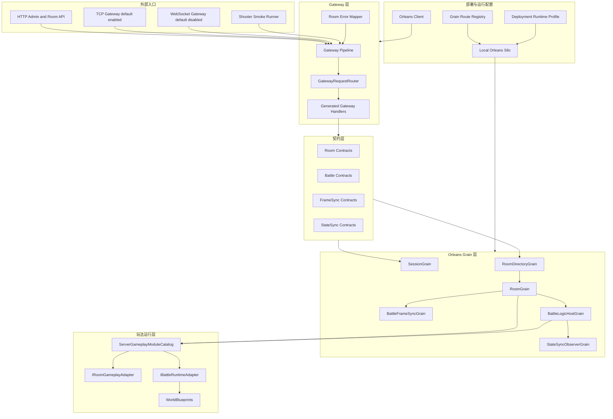

# 12.0 服务端能力地图：把 Orleans 从演示支撑提升为正式运行面

> 文档类型：服务端运行面能力地图与责任边界
> 事实基线：2026-08-16
> 适用范围：`Server/Orleans` 当前源码、仓库内测试与 Smoke；不构成生产部署承诺

## 1. 能力定位

`Server/Orleans` 不是 Shooter 示例附带的临时启动器，而是 AbilityKit 的服务器运行面。它把客户端/本地逻辑世界中已经存在的 Host、World、FrameSync、StateSync、Room、Battle、Gameplay Adapter 等概念搬到 Orleans 集群模型下，让演示、验收和未来真实服务部署使用同一套边界。

服务端专题需要回答四个问题：

| 问题 | 服务端设计回答 |
|------|----------------|
| 客户端请求从哪里进入 | Gateway 提供 HTTP、TCP 和 WebSocket 入口；TCP 默认启用，WebSocket 默认关闭，再按 opCode/endpoint 映射到 Orleans Grain |
| 房间和战斗谁负责 | RoomGrain 负责大厅、成员、准备、启动路线；BattleLogicHostGrain 负责权威战斗世界、输入缓冲、Tick 和状态推送 |
| 多玩法怎么接入 | ServerGameplayModuleCatalog 统一注册 RoomAdapter、BattleRuntimeAdapter、WorldBlueprint 和同步模板 |
| 演示与正式部署如何统一 | Host/Gateway/ShooterSmoke 共用 Hosting 配置、部署角色、运行 profile、存储和日志约定 |

该专题不替代网络同步专题。网络同步文档解释 FrameSync、StateSync、Rollback、Replay 的技术能力；服务端专题解释这些能力如何被放进可运行、可部署、可观察、可扩展的服务器架构中。

## 2. 源码入口

| 层级 | 源码入口 | 说明 |
|------|----------|------|
| 服务端契约 | `Server/Orleans/src/AbilityKit.Orleans.Contracts` | Grain 接口、DTO、状态码、房间/战斗/同步模型 |
| Gateway | `Server/Orleans/src/AbilityKit.Orleans.Gateway` | HTTP API、TCP Gateway、opCode Handler、请求路由、错误映射 |
| Grain 运行时 | `Server/Orleans/src/AbilityKit.Orleans.Grains` | Session、Room、Battle、FrameSync、StateSync、Automation Grain |
| Hosting 抽象 | `Server/Orleans/src/AbilityKit.Orleans.Hosting` | Orleans client/silo 装配、部署角色、运行 profile、日志和配置 |
| Standalone Host | `Server/Orleans/src/AbilityKit.Orleans.Host` | 本地 silo 进程入口 |
| MOBA Smoke | `Server/Orleans/src/AbilityKit.Orleans.MobaSmoke` | 两条 TCP 连接的房间、权威实体、状态恢复和可靠事件验收 |
| Shooter Smoke | `Server/Orleans/src/AbilityKit.Orleans.ShooterSmoke` | Gateway、权威世界、状态推送、故障场景和 Replay 验收 |
| Gateway 测试 | `Server/Orleans/src/AbilityKit.Orleans.Gateway.Tests` | 路由、协议、Handler、房间成员关系、后台与部署配置测试 |
| Grain 测试 | `Server/Orleans/src/AbilityKit.Orleans.Grains.Tests` | Room 状态机、Battle commit、玩法适配器、同步和持久化测试 |
| Shooter Smoke 测试 | `Server/Orleans/src/AbilityKit.Orleans.ShooterSmoke.Tests` | Smoke 重试、脚本契约、Replay summary、诊断 artifact 和 soak telemetry 测试 |
| 运行脚本 | `Server/Orleans/tools` | 单进程/多进程 Smoke、Gateway E2E、启动、停止和端口清理 |
| 服务器分析器 | `Server/Orleans/src/AbilityKit.Server.Analyzers` | Gateway Handler、Endpoint、Gameplay Manifest 的生成与约束 |
| 房间遗弃策略 | `Server/Orleans/src/AbilityKit.Orleans.Grains/Rooms/AbandonedRoomCleanupPolicy.cs` | 全部真实客户端离线后的宽限期与清理截止时间 |
| 同步能力声明 | `Server/Orleans/src/AbilityKit.Orleans.Grains/Rooms/RoomNetworkSyncCapabilityResolver.cs` | 把最终玩法/template 投影为客户端可协商的 metadata v1 |

## 3. 总体分层

## 4. 设计原则

### 4.1 服务端是运行面，不是示例外壳

Shooter Smoke 只是验收形态之一。服务端代码已经包含独立的 Contract、Gateway、Grain、Hosting、Analyzer 和 Smoke 工程，因此设计上应该把 `Server/Orleans` 看作 AbilityKit 的运行面：

1. Gateway 负责接入协议，不直接承载战斗逻辑。
2. Grain 负责状态归属、生命周期和集群内寻址。
3. Gameplay Adapter 负责把玩法差异收敛成房间与战斗运行接口。
4. Host/Hosting 负责让本地演示、Smoke 和未来多进程部署共用配置模型。

### 4.2 房间与战斗分离

RoomGrain 管理大厅语义：成员、准备、选择英雄、玩法命令、开始战斗、重连和 late join。BattleLogicHostGrain 管理权威战斗语义：战斗初始化、输入帧调度、Tick、运行时快照、状态推送和销毁。

这种拆分让房间可以在 Battle 启动前承载不同玩法的准备阶段，也让 Battle 可以只关注确定性模拟与同步输出。

### 4.3 同步模板决定运行路线

服务端不把 MOBA、Shooter 强行塞进一个同步模型。`ServerGameplayModuleCatalog` 为每个 RoomType 注册同步模板：

| 玩法 | 默认模板 | 默认路线 | 额外模板 |
|------|----------|----------|----------|
| MOBA | `frame-sync-authority` | `BattleWorldWithFrameSync`：同时初始化 FrameSync Grain 与 Battle Runtime，由帧同步 Grain 驱动 runtime | 无；`state-sync-authority` 已不是 MOBA 可选模板 |
| Shooter | `state-sync-authority` | `BattleWorld`：每帧 packed 推送、每 30 帧 full snapshot | predict rollback、authoritative interpolation、batch、mass battle、hybrid、runtime interpolation 与 pure-state 等项目模板 |

Room 启动战斗时通过 RoomFrameSyncRoute 判断是否需要 BattleFrameSyncGrain、是否需要 BattleLogicHostGrain。这样 FrameSync 演示、纯状态同步、权威世界推送可以共存。

这里的 catalog 和 route 是稳定机制，具体模板组合、Room tag、玩家槽位、出生规则和 payload 预算仍属于玩法项目。MOBA、Shooter 的 adapter 是高接入度参考实现，不应被理解为所有游戏都必须复用的应用套件。

还要区分两套标识边界：Grain/持久化运行时以 `GameplayRoomTypes.Moba = "battle"` 为 MOBA 规范值，`"moba"` 只是 `Normalize()` 接受的历史别名；HTTP `GatewayGameplayCatalog` 为兼容页面和 API 仍暴露 `roomType="moba"`。目录创建、筛选和玩法 registry 会先正规化，因此新服务端状态应落为 `battle`，但不能据此要求现有 HTTP 消费者立即改名。

同步能力声明也不等同于模板字符串回显。MOBA 无论收到规范值还是历史别名，`RoomNetworkSyncCapabilityResolver` 都声明 `Lockstep`、schema `0..1`；Shooter 才按最终模板映射到 PredictRollback、AuthoritativeInterpolation、BatchStateSync、MassBattleLodSync 或 HybridHeroPrediction，并区分 packed 与 pure-state schema 范围。

### 4.4 源码生成用于减少运行时反射边界

Gateway Handler 和服务端 Gameplay Manifest 有 Analyzer/Generator 支撑。它们不是为了炫技，而是为了把这些隐式约束前移：

| 生成/分析能力 | 作用 |
|---------------|------|
| Gateway Handler Registration | 通过 GatewayHandlerAttribute 生成 handler 注册，减少手写漏配 |
| Gateway Endpoint Manifest | 汇总 HTTP/Gateway 端点，便于后台和验收工具理解服务能力 |
| Server Gameplay Manifest | 汇总 RoomType、同步模板、Adapter、WorldBlueprint，避免玩法注册散落 |
| Server Project Boundary Analyzer | 防止服务器工程跨越不该依赖的客户端/表现层边界 |
| Server Magic String Analyzer | 将关键字符串约束从运行期错误前移到构建期 |

## 5. 能力边界

| 能力 | 服务端负责 | 服务端不负责 |
|------|------------|--------------|
| 账号/会话 | SessionGrain、Guest/Login、Token 续期 | 完整商业账号体系、支付、实名、安全审计 |
| 房间 | 创建、列表、加入、准备、离线、重连、关闭 | 大厅推荐算法、跨区匹配策略 |
| 战斗 | 权威世界启动、输入缓冲、Tick、快照、诊断 | 客户端表现、镜头、动画、UI |
| 同步 | FrameSync relay、StateSync push、full snapshot request | 网络运营商级 QoS、全球加速 |
| 部署 | 本地 silo/client、角色/profile 配置、route registry | 生产 Kubernetes、数据库 HA、灰度发布全流程 |
| 验收 | MOBA/Shooter Smoke、Replay validation、Gateway/Grain tests | 压测平台、生产可观测闭环 |

房间生命周期当前把“传输断开”和“业务离场”明确分开：显式 Leave 才移除成员；TCP/WebSocket 连接关闭只异步执行 `MarkOfflineWithResultAsync`。若账号已经绑定到新连接，或 account-room mapping 已变化，旧连接清理会跳过，避免旧会话污染新归属。房间至少有一个真实客户端且所有真实客户端都离线后，从最后一名客户端离线时刻起保留 1 分钟；重连会取消清理条件，Bot 不阻止遗弃判定。

宽限到期后 `RoomGrain` 依次销毁 Battle runtime、销毁 FrameSync runtime、清账号映射、移除目录项和持久化状态，再把本地状态收口为 `Expired/AllClientsDisconnectedTimeout` 并释放 push binding。该链路通过一次性 timer、`TickAsync` 和失败后 30 秒重试获得最终收敛机会，但跨多个 Grain/store 的步骤不是数据库事务，不能宣称一次调用具备原子回滚。

服务端能力按责任归属再分为四层：

| 层级 | 可复用内容 | 项目需要决定的内容 |
|------|------------|--------------------|
| 框架契约 | Grain 接口、DTO、结果码、Gateway envelope | 业务 opcode、权限语义、兼容窗口 |
| 宿主机制 | Gateway/Hosting/Grain 生命周期、route 与 adapter 扩展点 | 集群、存储、placement、容量与发布策略 |
| 玩法应用 | Room/Battle adapter 接口、同步 profile 描述能力 | 房间规则、战斗初始化、实体语义、同步模板与预算 |
| 验收证据 | Smoke runner、artifact 与测试入口 | 目标拓扑、失败矩阵、性能预算和发布 gate |

## 6. 当前验证层级

| 证据等级 | 可执行入口 | 当前能证明什么 | 不能据此推导什么 |
|------|------------|----------------|--------------------|
| E0：实现存在 | Contracts、Gateway、Grains、Hosting 与 adapter 源码 | 类型、扩展点和默认配置存在 | 可运行、正确或被业务消费 |
| E1：示例接入 | MOBA/Shooter adapter 与客户端流程 | 两个示例如何组合机制 | 组合可直接复制到其他游戏 |
| E2：消费闭环 | Host、Gateway、Admin Console、Smoke runner | 仓库内存在真实消费者 | 失败路径和目标环境都已覆盖 |
| E3：自动契约 | Gateway、Grain、Shooter Smoke Harness 测试工程 | 状态机、commit、adapter、脚本和报告契约 | 真实 TCP、多进程或生产基础设施已经运行 |
| E4：运行证据 | 单进程/多进程 Smoke 的当次日志、Replay、manifest、diagnostic | 对应 profile 和拓扑在当次运行成立 | placement、跨机器、外部存储和商业容量目标 |
| E5：发布门禁 | CI 中明确触发并阻断的测试/Smoke/artifact policy | 指定分支和触发条件受持续保护 | 未进入 gate 的 profile 自动获得同等保证 |

MOBA 多进程脚本当前是一个 host-only Silo 进程加一个 client-only 场景进程；owner/member 是场景进程内的两条 TCP 连接，不是两个独立客户端进程。Shooter 多进程脚本的覆盖更广，但各 profile 仍是仓库验收场景，不代表已完成跨机器集群认证。

### 6.1 2026-08-02 本地验证基线

在 Windows 11、.NET 10 Release 配置下执行上述三个测试工程，结果分别为 Gateway 151/151、Grains 218/218、Shooter Smoke Harness 33/33；在 `Server/AdminConsole` 执行 `npm run build`，`vue-tsc --noEmit` 与 Vite 生产构建通过。该记录证明当前工作区在这四个入口上可执行，不代表 Smoke 场景或生产部署已经运行。

构建输出仍包含 Entitas 依赖版本回退与旧目标框架兼容性警告、C# 可空性警告，以及服务端 `AKS0001`/`AKS0002` Analyzer 警告。因此本次基线应表述为“测试和构建通过但存在警告”，不能表述为零警告构建。

该历史运行记录保留为 E3 构建证据；本文 2026-08-16 的事实基线来自源码复核，本批没有重新执行 Smoke，因此不更新任何 E4 通过日期。

### 6.2 2026-08-16 本批复核

本批在 Release、`--no-restore` 下重新执行 Gateway、Grains、Shooter Smoke Harness 三个工程，分别 `162/162`、`232/232`、`33/33`，合计 `427/427`；Admin Console 执行 `vue-tsc --noEmit` 通过。结果覆盖本批新增的断线保留、遗弃清理、RoomType 正规化、同步能力声明、Shooter 默认模板/人数和脚本契约，但仍属于 E3。运行输出保留 NU1603/NU1701、可空性和 AKS0001/AKS0002 等既存警告；本批未运行真实 TCP Smoke、多进程矩阵或浏览器 E2E。

## 7. 源码阅读路径

1. `00-ServerCapabilityMap.md`：建立 Server Runtime 的总体能力地图。
2. `01-OrleansRuntimeAndDeployment.md`：理解 Host、Gateway、Hosting、部署角色和存储配置。
3. `02-GatewayRoomBattleFlow.md`：理解请求如何从 Gateway 进入 RoomGrain，再启动 FrameSync 或 BattleLogicHost。
4. `07-NetworkSynchronization` 专题：深入 FrameSync、StateSync、Rollback、Replay 的同步机制。
5. `09-ImplementationExamples` 专题：观察 Shooter/MOBA 玩法如何通过 ServerGameplayModuleCatalog 接入。

## 8. 和其他文档的关系

| 文档 | 关系 |
|------|------|
| `07-NetworkSynchronization/00-SynchronizationCapabilityMap.md` | 同步技术能力总览，服务端专题解释这些能力如何部署到 Orleans |
| `07-NetworkSynchronization/05-SessionCoordination.md` | 端侧会话协调视角，服务端专题补齐 Gateway/Room/Battle 归属 |
| `09-ImplementationExamples/Shooter/05-ServerFlowAndSmokeDeepDive.md` | Shooter 示例深潜，服务端专题抽出通用服务器设计理念 |
| `10-EngineeringQuality/01-TestingWorkflow.md` | 测试门禁，服务端专题提供被测试对象和验收链路 |

---

> 文档版本：v3.1
> 更新日期：2026-08-16
> 更新责任：服务端机制变化时同步复核 Catalog、Room/Battle 路线、部署边界与 E0-E5 证据。
