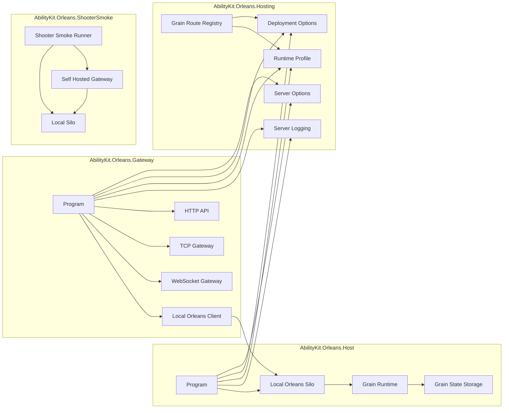
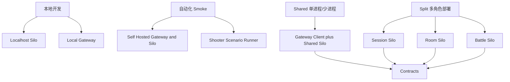

# 12.1 Orleans 运行时与部署设计

> 文档类型：运行时装配、部署配置与生产边界设计
> 事实基线：2026-08-16
> 结论口径：当前配置模型可用于本地与验收拓扑，不代表角色 placement 或外部存储已经闭环

## 1. 能力定位

Orleans 服务端的运行时设计目标是：用同一套工程支撑本地演示、自动化 Smoke、后台调试和未来多进程部署。当前源码没有把部署能力做成完整生产平台，但已经建立了可扩展的边界：

1. Host 进程负责启动 Orleans Silo 和 Grain 运行时。
2. Gateway 进程负责 HTTP/TCP 接入，并作为 Orleans Client 调用 Grain。
3. Hosting 工程沉淀配置、日志、部署角色、运行 profile 和本地 Orleans 装配。
4. Storage provider plan 能识别目标 provider 名称；当前仓库实际注册的是 Session/Room 自定义内存 store，允许不支持 provider 回退到内存。
5. Deployment profile 描述 Session、Room、Battle 等 Grain 的目标角色和容量提示，但尚未驱动 Orleans placement。

## 2. 源码入口

| 主题 | 源码入口 | 说明 |
|------|----------|------|
| Host 启动 | `Server/Orleans/src/AbilityKit.Orleans.Host/Program.cs` | Standalone Silo 入口 |
| Gateway 启动 | `Server/Orleans/src/AbilityKit.Orleans.Gateway/Program.cs` | HTTP/TCP Gateway 入口 |
| Local Silo 装配 | `Server/Orleans/src/AbilityKit.Orleans.Hosting/AbilityKitOrleansHostingExtensions.cs` | UseAbilityKitLocalOrleansSilo |
| Local Client 装配 | `Server/Orleans/src/AbilityKit.Orleans.Hosting/AbilityKitOrleansHostingExtensions.cs` | UseAbilityKitLocalOrleansClient |
| 部署配置 | `Server/Orleans/src/AbilityKit.Orleans.Hosting/AbilityKitDeploymentOptions.cs` | TargetSiloCount、容量、角色 |
| 运行 Profile | `Server/Orleans/src/AbilityKit.Orleans.Hosting/AbilityKitSiloRuntimeProfileOptions.cs` | 运行角色与 max room/battle/session |
| Grain 路由 | `Server/Orleans/src/AbilityKit.Orleans.Hosting/AbilityKitGrainRouteRegistry.cs` | Session/Room/Battle 逻辑分组 |
| 状态存储 | `Server/Orleans/src/AbilityKit.Orleans.Grains/Persistence` | Grain state provider 统一注册 |
| 房间遗弃清理 | `Server/Orleans/src/AbilityKit.Orleans.Grains/Rooms/RoomGrain.cs`、`AbandonedRoomCleanupPolicy.cs` | activation 恢复、一次性 timer、跨资源清理与重试 |
| FrameSync 销毁 | `Server/Orleans/src/AbilityKit.Orleans.Grains/FrameSync/BattleFrameSyncGrain.cs` | 显式停止 timer、清 observer/input/history 并请求 deactivate |

## 3. 进程拓扑

## 4. Host 启动职责

Standalone Host 的入口很短，但它表达了服务端运行时的核心装配顺序：

| 步骤 | 职责 |
|------|------|
| AddAbilityKitServerOptions | 读取 Orleans cluster、端口、服务端基础配置 |
| AddAbilityKitDeploymentOptions | 读取部署角色、目标 Silo 数、容量限制 |
| AddAbilityKitSiloRoleOptions | 读取当前 Silo 的逻辑角色 |
| AddAbilityKitSiloRuntimeProfileOptions | 读取 room/battle/session 的运行 profile |
| AddAbilityKitDeploymentModeOptions | 读取 shared/split 等部署模式 |
| AddAbilityKitServerLogging | 统一服务端日志分类与输出 |
| AddAbilityKitGrainStateStorage | 注册 Session/Room 状态 provider，允许开发环境 fallback |
| AddSingleton ServerBattleWorldManager | 为 BattleRuntimeAdapter 提供服务端战斗世界管理器 |
| UseAbilityKitLocalOrleansSilo | 启动本地 Orleans Silo |

这个设计使 Host 不是“大 main 函数”，而是配置、存储、运行角色、世界管理器和 Orleans 装配的组合点。

## 5. Gateway 启动职责

Gateway 入口同样很薄，核心是把 HTTP/TCP 接入与 Orleans Client 连接起来：

| 步骤 | 职责 |
|------|------|
| AddAbilityKitGatewayModule | 注册 Gateway pipeline、handlers、HTTP/TCP/WebSocket transport 与 endpoints；TCP 默认启用，WebSocket 默认关闭 |
| UseAbilityKitLocalOrleansClient | 建立到 Orleans Silo 的 client 连接 |
| MapAbilityKitGatewayPipeline | 映射 HTTP API、健康检查、后台接口和 TCP Gateway 管线 |
| app.Run(Http.Url) | 用配置中的 URL 启动 WebApplication |

Gateway 不应持有房间/战斗状态。它可以做协议解析、会话上下文、请求路由、错误映射和后台聚合，但状态归属应落到 Grain。

## 6. 部署角色与运行 profile

当前源码已经为多角色部署留出模型。下表描述的是逻辑意图，不是 Orleans 运行时已经执行的放置规则：

| 角色 | RouteGroup | 典型 Grain | PreferredSiloRoles | 说明 |
|------|------------|------------|--------------------|------|
| Session | session | SessionGrain | Session | 账号会话、Token、连接恢复基础 |
| Room | room | RoomGrain、RoomDirectoryGrain | Room | 大厅、房间、成员、准备、战斗启动 |
| Battle | battle | BattleLogicHostGrain、BattleFrameSyncGrain | Battle | 权威战斗世界、FrameSync、StateSync |

容量参数目前是部署约束模型，不等于完整调度器：

| 参数 | 含义 |
|------|------|
| TargetSiloCount | 目标 Silo 数 |
| MaxRoomsPerSilo | 单 Silo 房间容量提示 |
| MaxBattlesPerSilo | 单 Silo 战斗容量提示 |
| MaxSessionsPerGateway | 单 Gateway 会话容量提示 |

这些配置的价值是把后续生产部署要表达的概念提前固化：即使本地只跑一个 Silo，代码和文档仍按 session/room/battle 的逻辑分组理解。

`PreferredSiloRoles`、RouteGroup、容量字段和 launch profile 当前用于配置绑定、诊断、脚本参数与逻辑分组；源码尚未把它们接到 Orleans placement director/strategy。`dev-scaled` 能启动多个 Silo，只能证明多进程启动参数存在，不能证明 Room 或 Battle activation 按角色落位。

## 7. 存储策略

服务端状态当前分为两类：

| 状态 | 推荐归属 | 说明 |
|------|----------|------|
| Session State | SessionGrain state provider | 账号、Token、连接恢复索引 |
| Room State | RoomDirectory/RoomGrain state provider | 房间摘要、房间列表、成员变化 |
| Battle Runtime State | BattleLogicHostGrain 内存运行时 | 高频 Tick、输入缓冲、快照，不应走普通持久化路径 |
| Smoke/Replay Artifact | Smoke runner 输出目录 | 验收证据，不是在线服务状态 |

Battle 状态不应默认持久化为普通 Grain state。原因是战斗 Tick 高频、快照体积可变、恢复语义复杂。更合理的方向是通过 Record/Replay 或专门的战斗检查点机制做验收与恢复设计。

`AbilityKitStateStorageProviderPlan` 对 Redis、PostgreSQL、SQL Server 等名称的识别只表达扩展计划。仓库内没有这些数据库 provider 的实现；当 `AllowInMemoryFallbackForUnsupportedProviders=true` 时，即便配置了外部 provider 名称，运行时仍会注册 `InMemorySessionStateStore` 与 `InMemoryRoomStateStore`。生产接入必须提供真实实现、迁移、并发、故障恢复和数据保留验证，不能仅凭配置名称判定已使用外部存储。

Room activation 的恢复还有一条独立生命周期：`OnActivateAsync` 从 room store 恢复状态后重新计算遗弃清理截止时间，并注册一次性 Orleans timer；每次持久化和恢复也会刷新 timer。存在清理截止时间时，Grain 用 `DelayDeactivation(due + 1 minute)` 保持 activation 足够久，正常重连或状态变化则取消并重算。`TickAsync` 同步检查相同策略，因此显式房间时钟和后台 timer 是同一规则的两个触发入口，不是两套清理语义。

遗弃清理是有序补偿流程，不是事务：先调用 `IBattleLogicHostGrain.DestroyAsync()`，再调用 `IBattleFrameSyncGrain.DestroyAsync()`，随后清 account-room mapping、目录和 room store，最后把 activation 内状态标为 `Expired` 并 `DeactivateOnIdle()`。任一步骤抛出时 timer 会在至少 30 秒后重试，但已经完成的远端副作用不会回滚。外部 store/集群部署必须让各步骤保持幂等，并为部分完成、重复 Destroy 和长期重试建立指标与人工补偿入口。

## 8. 运行模式

当前成熟度最高的是本地开发与仓库内 Smoke。Shared/Split 目前主要体现为配置模型、启动脚本参数和 route registry 边界；`PreferredSiloRoles`、容量参数与逻辑 RouteGroup 不等于 Orleans 已按这些字段完成 placement。真实部署还需要覆盖：

1. 外部存储 provider 和迁移策略。
2. Silo membership 后端。
3. Gateway 水平扩展和会话粘性策略。
4. Room/Battle placement policy 及跨角色故障转移。
5. 指标、追踪、告警和压测门禁。
6. 遗弃房间跨 Grain/store 清理的幂等性、部分失败诊断和积压监控。

## 9. 可执行验证与证据边界

| 证据等级 | 入口 | 当前覆盖 | 证据边界 |
|----------|------|----------|----------|
| E0/E1：模型与示例 | Hosting 配置、route registry、launch profiles | 配置字段、默认值与本地组合存在 | placement、容量控制和生产实现存在 |
| E3：配置契约 | Gateway tests 中的 deployment/route/health tests | 默认值、逻辑分组和报告模型 | 真实多角色集群已启动 |
| E3：存储契约 | Grains tests 中的 provider plan 与内存 store tests | provider 选择、fallback 与生命周期 | 外部数据库、迁移或高可用 |
| E4：本地运行 | 单进程/多进程 MOBA、Shooter Smoke artifact | 当次 localhost 拓扑、TCP 链路与场景行为 | 跨机器、外部 membership/storage 或 placement |
| E5：发布门禁 | CI 对上述命令和 artifact 的明确触发/阻断规则 | 被配置的 profile 持续受保护 | 仅存在脚本或静态契约就自动形成 gate |

仓库当前没有一条命令能够证明 Split 多角色生产拓扑已经闭合。发布说明应写明实际执行的 profile、进程拓扑和 artifact 路径，不能只记录“Orleans Smoke 通过”。

## 10. 设计约束

| 约束 | 说明 |
|------|------|
| Gateway 不写战斗状态 | Gateway 可持有连接上下文，但不能成为权威战斗状态源 |
| Contract 先于实现 | 客户端、Gateway、Grain 之间只通过 Contracts 传递 DTO 和 Grain 接口 |
| 高频状态留在 Battle Runtime | Tick、输入缓冲、状态推送由 BattleLogicHost 管理 |
| 部署角色先逻辑化 | 即使本地单 Silo，也按 Session/Room/Battle 分组理解 |
| Smoke 使用同构链路 | Smoke 应尽量走真实 Gateway/Grain/Runtime，而不是绕开服务器主链路 |

## 11. 演进边界

1. 将 deployment profile 与 Orleans placement policy 更紧密绑定。
2. 为 Room/Battle 增加更明确的容量指标和健康诊断。
3. 把 Gateway endpoint manifest 暴露给 AdminConsole，减少前后端接口漂移。
4. 将 Smoke 结果与工程质量文档中的测试门禁统一成可机器读取的报告。
5. 为 Battle Runtime 增加检查点、回放对账和状态 hash 诊断的统一接口。
6. 为遗弃房间清理增加结构化 attempt/result、死信或人工补偿能力，避免仅依赖 timer 异常日志判断跨资源收敛。

---

> 文档版本：v3.1
> 更新日期：2026-08-16
> 更新责任：Hosting、storage provider、placement 或 launch profile 变化时同步复核。
