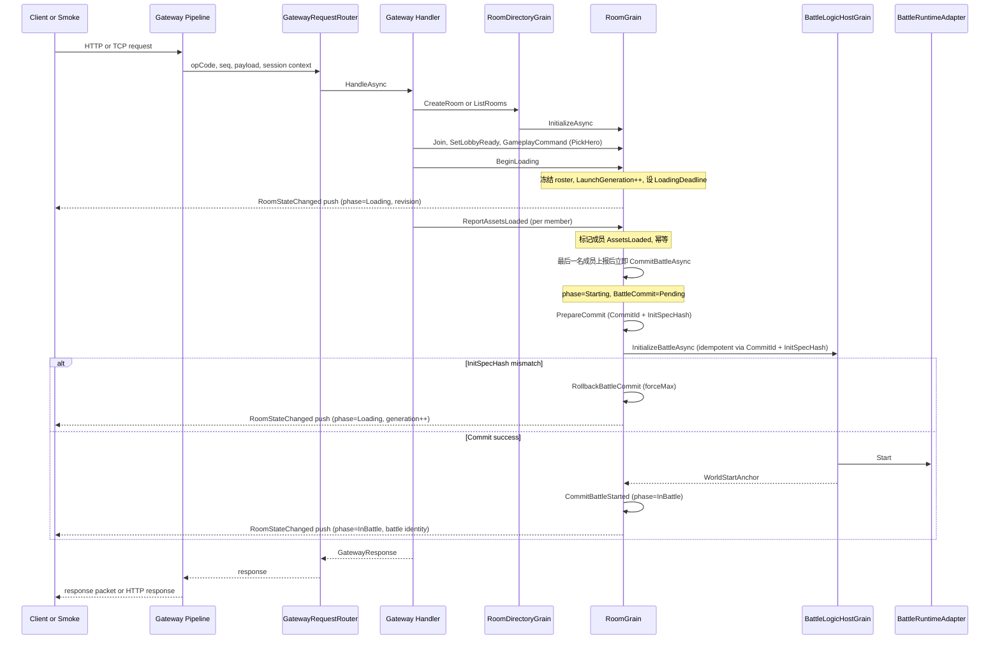
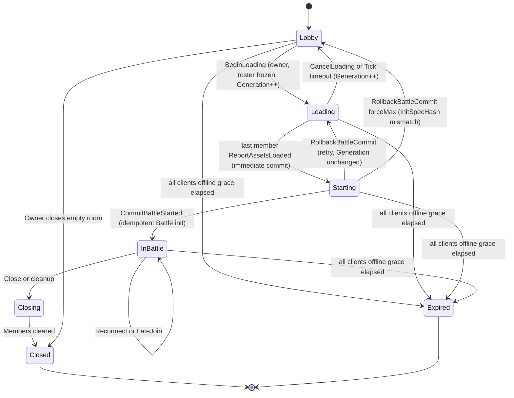
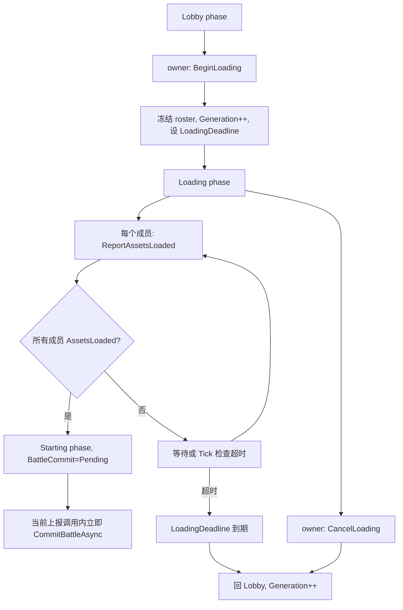
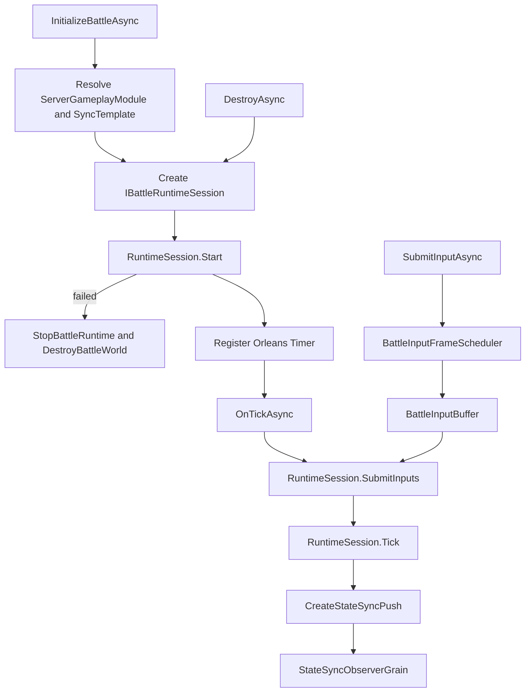
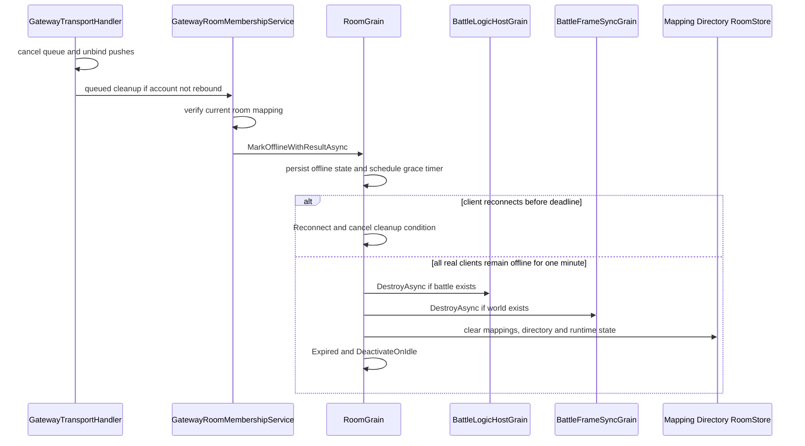

# 12.2 Gateway、Room 与 Battle 主链路设计

> 文档类型：服务端请求编排、房间状态机与战斗提交设计
> 事实基线：2026-08-16
> 协议口径：正式 TCP 客户端走 staged loading；HTTP/Admin/Sandbox 直启属于兼容或受控入口

## 1. 能力定位

本篇解释一次服务器玩法流程如何从 Gateway 进入 Orleans，再落到 RoomGrain 和 BattleLogicHostGrain。重点不是协议字段罗列，而是状态归属和职责分界：

1. Gateway 负责接入、路由、会话上下文和错误映射。
2. RoomDirectoryGrain 负责房间目录和房间摘要。
3. RoomGrain 负责成员、准备、玩法房间状态、战斗启动、late join 和关闭。
4. BattleFrameSyncGrain 负责帧同步 relay 型战斗的时钟与 observer。
5. BattleLogicHostGrain 负责权威 BattleWorld、输入缓冲、Tick、状态同步推送和诊断。
6. ServerGameplayModuleCatalog 决定不同 RoomType 走哪种同步模板和运行时。

## 2. 源码入口

| 主题 | 源码入口 | 说明 |
|------|----------|------|
| Gateway 路由 | `Server/Orleans/src/AbilityKit.Orleans.Gateway/Gateway/Core/GatewayRequestRouter.cs` | opCode 到 handler，超时和异常映射 |
| Handler 注册 | `Server/Orleans/src/AbilityKit.Server.Analyzers/Generators/Gateway/GatewayHandlerRegistrationGenerator.cs` | GatewayHandlerAttribute 生成注册代码 |
| 房间目录 | `Server/Orleans/src/AbilityKit.Orleans.Grains/Rooms/RoomDirectoryGrain.cs` | Create/List/Notify/Remove Room |
| 房间 Grain | `Server/Orleans/src/AbilityKit.Orleans.Grains/Rooms/RoomGrain.cs` | Join/Ready/Command/BeginLoading/ReportAssetsLoaded/CancelLoading/Tick/LateJoin/Close |
| 房间状态机 | `Server/Orleans/src/AbilityKit.Orleans.Grains/Rooms/RoomStateMachine.cs` | BeginLoading/ReportAssetsLoaded/CancelLoading/PrepareCommit/CommitBattleStarted/RollbackBattleCommit 纯函数转换 |
| 房间生命周期 | `Server/Orleans/src/AbilityKit.Orleans.Grains/Rooms/RoomLifecyclePolicy.cs` | Lobby/Loading/Starting/InBattle/Closing/Closed/Expired |
| 房间线协议模型 | `Server/Orleans/src/AbilityKit.Orleans.Contracts/Rooms/RoomModels.cs` | RoomSummary、RoomSnapshot、RoomMemberState、RoomPhase 与请求/响应模型 |
| 房间持久状态 | `Server/Orleans/src/AbilityKit.Orleans.Grains/Persistence/RoomPersistentState.cs` | Grain 内部持久化成员、玩法状态、启动代次、Battle commit 与命令去重记录 |
| 加载请求模型 | `Server/Orleans/src/AbilityKit.Orleans.Contracts/Rooms/RoomLoadingModels.cs` | BeginLoadingRequest、ReportAssetsLoadedRequest、CancelLoadingRequest |
| InitSpec 哈希 | `Server/Orleans/src/AbilityKit.Orleans.Grains/Rooms/RoomBattleInitSpecHasher.cs` | BattleInitParams 稳定哈希计算 |
| RoomStateChanged 推送 | `Server/Orleans/src/AbilityKit.Orleans.Grains/Rooms/RoomStatePushBuilder.cs` | 构建 RoomStateChanged push payload（Grains 内联映射，不依赖 Gateway mapper） |
| 战斗路线 | `Server/Orleans/src/AbilityKit.Orleans.Grains/Rooms/RoomFrameSyncRoute.cs` | FrameSync 与 BattleRuntime 启动决策 |
| 战斗主机 | `Server/Orleans/src/AbilityKit.Orleans.Grains/Battle/BattleLogicHostGrain.cs` | 权威战斗世界和状态推送 |
| 玩法模块 | `Server/Orleans/src/AbilityKit.Orleans.Grains/Gameplay/ServerGameplayModuleCatalog.cs` | RoomAdapter、BattleRuntimeAdapter、WorldBlueprint 注册 |
| Gateway 加载 Handler | `Server/Orleans/src/AbilityKit.Orleans.Gateway/Gateway/Handlers/BeginLoadingHandler.cs`、`ReportAssetsLoadedHandler.cs`、`CancelLoadingHandler.cs`、`GetSnapshotHandler.cs` | opCode 112-115 请求处理 |
| StartBattle 废弃 Handler | `Server/Orleans/src/AbilityKit.Orleans.Gateway/Gateway/Handlers/StartRoomBattleHandler.cs` | opCode 106 固定返回 Conflict |
| Wire 映射 | `Server/Orleans/src/AbilityKit.Orleans.Gateway/Gateway/Handlers/RoomGatewayWireMapper.cs` | wire DTO ↔ Grain 请求映射（含 BeginLoading/ReportAssetsLoaded/CancelLoading） |

## 3. 请求主链路

正式多人模式启动流程采用分阶段协议，取代旧的直接 `StartBattle`。主链路覆盖 Lobby 准备、加载屏障、最后上报即时 commit 与状态推送：

> TCP `StartBattle`（opCode 106）入口已废弃，`StartRoomBattleHandler` 固定返回 `Conflict`，提示客户端改用 `BeginLoading` + `ReportAssetsLoaded`。HTTP room API、Admin Console 和 `ShooterSandboxGrain` 仍可调用兼容的 `RoomGrain.StartBattleAsync`，它们不是正式多人加载协议的证明。详见 [5.1 加载屏障与即时提交](#51-加载屏障与即时提交) 与 [5.2 幂等 Battle commit](#52-幂等-battle-commit)。

## 4. Gateway 路由设计

GatewayRequestRouter 的职责很克制：

| 行为 | 说明 |
|------|------|
| 根据 opCode 取 handler | 未注册返回 UnhandledOpCode |
| 为请求创建 timeout token | RequestTimeoutMs 大于 0 时自动 CancelAfter |
| 调用 handler.HandleAsync | 传入 GatewayRequest 和 GatewaySessionContext |
| 捕获超时 | 转换为 GatewayStatusCode.Timeout |
| 捕获异常 | 转换为 GatewayStatusCode.Exception |

这意味着业务错误不应依赖异常穿透到 transport 层。Room/Gateway 层需要把可预期失败映射成明确状态码或 HTTP error response。

## 5. RoomGrain 状态机

RoomGrain 内部状态由几个关键字段构成：

| 字段 | 含义 |
|------|------|
| `_summary` | 房间摘要，包含 RoomId、RoomType、Owner、MaxPlayers 等 |
| `_directoryKey` | RoomDirectoryGrain 的 key，用于通知房间列表变化 |
| `_gameplay` | 当前 RoomType 对应的 IRoomGameplayAdapter |
| `_gameplayState` | 玩法房间阶段状态，例如英雄选择、准备、loadout |
| `_members` | 房间成员、在线状态、bot 状态、AssetsLoaded 标记 |
| `_closed` | 房间是否对大厅动作关闭 |
| `_battleId` | 已启动战斗 ID，当前用 RoomId 作为 battleId |
| `_worldId` | 战斗世界 ID |
| `_worldStartAnchor` | 客户端对齐服务器世界时间的锚点 |
| `Launch` (`RoomLaunchPersistentState`) | 启动代际：`Generation`（只增不减）、`ManifestVersion`、`LoadingDeadlineUnixMs`、`LaunchManifestHash` |
| `BattleCommit` (`RoomBattleCommitPersistentState`) | 战斗提交状态：`CommitId`、`InitSpecHash`、`Status`、`BattleId`、`WorldId`、`WorldStartAnchor`、`AttemptCount`、`LastError`、`Generation` |
| `Revision` | 房间状态单调递增版本号，每次状态变更 +1，用于乐观并发与 push 排序 |
| `LastEventSequence` | 事件序列号，用于客户端检测 push 缺口（gap） |
| `_abandonedRoomCleanupTimer` | 全部真实客户端离线后的单次宽限 timer；状态持久化/恢复后重算 |

生命周期由 RoomLifecyclePolicy 计算，而不是散落在各个方法中。正式多人模式状态机包含六个阶段：

各阶段语义：

| 阶段 | 允许的动作 | 不变量 |
|------|-----------|--------|
| Lobby | Join、SetLobbyReady、PickHero、BeginLoading（owner） | roster 可变；`IsOpenForLobbyActions=true` |
| Loading | ReportAssetsLoaded、CancelLoading（owner） | roster 冻结；`LaunchGeneration` 已递增；`LoadingDeadlineUnixMs` 已设置 |
| Starting | `ReportAssetsLoadedWithResultAsync` 直接提交，或 Tick 在恢复后补偿提交；CancelLoading 不允许 | `BattleCommit.Status=Pending`；CommitId/InitSpecHash 首次写入后不可变 |
| InBattle | SubmitBattleInput、LateJoin、Reconnect | `BattleCommit.Status=Committed`；battleId/worldId 已确定 |
| Closing | 等待成员清理 | 不再接受新成员 |
| Closed | 无 | `ShouldRemoveFromDirectory=true` |
| Expired | 无 | `AllClientsDisconnectedTimeout`；Battle/FrameSync、mapping、directory 和 store 已按顺序清理 |

### 5.1 加载屏障与即时提交

正式流程用加载屏障取代直接 `StartBattle`，确保所有成员在进入战斗前完成资源加载：

关键设计点：

| 机制 | 语义 |
|------|------|
| LaunchGeneration 隔离 | 每次 BeginLoading/CancelLoading/超时回滚都递增 `Generation`，且只增不减。客户端 `ReportAssetsLoaded` 必须携带匹配的 `LaunchGeneration`，过期 report 被幂等忽略（`LaunchGenerationMismatch`） |
| roster 冻结 | 进入 Loading 后成员集合冻结，不允许 Join/Leave 改变参战名单，保证"所有成员 loaded"判定稳定 |
| 超时回 Lobby | `LoadingDeadlineUnixMs` 到期后 Tick 将房间回退到 Lobby 并递增 `Generation`，避免永久卡在 Loading |
| owner 迁移 | owner 离线且仍有在线成员时，按 `JoinOrdinal` 选择最早在线成员；若所有成员都离线则保留原 owner，等待其重连或遗弃清理。显式 Leave 则从剩余在线成员中选择 owner |
| RoomStateChanged push | 每次 phase 变更后向所有在线成员推送 `RoomStateChanged`（opCode 9004），携带 phase、revision、LaunchGeneration、battle identity |

这里必须区分正常推进与补偿推进：最后一个成员的 `ReportAssetsLoadedWithResultAsync` 完成状态转换后会在同一次调用中直接执行 `CommitBattleAsync(next)`。`TickAsync` 的主要职责是遗弃房间清理、Loading 超时、仍有在线成员时的过期离线成员清理，以及 Grain 恢复后发现 `Starting/Pending` 时补偿未完成的 commit；它不是正常开战必须等待的调度器。

### 5.2 幂等 Battle commit

Starting 阶段的 Battle 初始化采用幂等 commit，避免重复创建战斗世界：

| 概念 | 说明 |
|------|------|
| CommitId 格式 | `roomId:LaunchGeneration`（首次 commit 时确定，后续不可变） |
| InitSpecHash | 由 `RoomBattleInitSpecHasher.Compute(BattleInitParams)` 计算，对战斗初始化参数做稳定哈希 |
| AlreadyInitialized 幂等 | 若 `BattleLogicHostGrain` 已用相同 CommitId + InitSpecHash 初始化，直接返回成功，不重复创建世界 |
| CommitId 冲突 | 若已存在 CommitId 但与新值不同，返回 `InvalidOperation`，拒绝覆盖 |
| HashMismatch rollback | 若 Battle 返回 `InitSpecHashMismatch`，调用 `RollbackBattleCommit(forceMax: true)`，清空 CommitId/InitSpecHash/BattleId，回退到 Loading 并递增 `Generation` |
| AttemptCount 重试 | 普通 commit 失败时 `AttemptCount++`，未超过 `DefaultBattleCommitMaxAttempts`（3）时保持在 Starting 重试；超过后回退 Loading |

commit 流程源码入口：`RoomGrain.PrepareCommitAsync` / `RoomGrain.CommitBattleStartedAsync` / `RoomGrain.RollbackCommitAsync`，状态转换由 `RoomStateMachine.PrepareCommit` / `RoomStateMachine.CommitBattleStarted` / `RoomStateMachine.RollbackBattleCommit` 计算。

## 6. 房间启动战斗路线

正式流程中，战斗启动由 Starting 阶段的幂等 commit 触发（见 [5.2 幂等 Battle commit](#52-幂等-battle-commit)），而非客户端直接调用 `StartBattle`。`RoomGrain.CommitBattleStartedAsync` 的核心决策是：当前 RoomType 和 SyncTemplate 到底需要启动什么。

| 路线 | 条件 | 启动对象 | 说明 |
|------|------|----------|------|
| Frame relay only | runtime mode 是 `FrameRelayOnly` | BattleFrameSyncGrain | 只负责帧时钟与帧包 relay，不创建权威 BattleWorld |
| Battle world | profile 要求 Battle runtime | BattleLogicHostGrain | 创建权威世界，接收输入，Tick 后推送状态 |
| Battle world + frame sync | runtime mode 是 `BattleWorldWithFrameSync` | BattleFrameSyncGrain + BattleLogicHostGrain | FrameSync Grain 通过 `TickFrameAsync` 驱动 runtime；MOBA 默认模板属于该路线 |
| Unsupported template | 模板不在 profile 中 | Room 先路由到 Battle runtime，Battle 初始化明确拒绝 | route 标记 `IsUnsupportedTemplate`，Room 未提前消费该标记；`BattleLogicHostGrain` 返回 `UnsupportedSyncTemplate`，Room 按普通 commit 失败重试并最终回 Loading |

路线由 RoomFrameSyncRoute 计算，输入来自 ServerGameplayModuleCatalog 的 sync profile。

> **双轨边界**：TCP opCode 106 已不再驱动战斗启动，保留 handler 只为让旧客户端收到明确 `Conflict`。`RoomGrain.StartBattleAsync` 本身仍被 HTTP、Admin 与 Sandbox 使用，并写入 `PhaseReason="LegacyStartBattle"` 后进入当前幂等 commit。该受控兼容路径绕过 roster loading barrier，不能作为正式客户端协议继续扩散。

## 7. BattleLogicHostGrain 运行流程

BattleLogicHostGrain 是权威战斗主机。它包含四个关键子系统：

| 子系统 | 职责 |
|--------|------|
| BattleHostState | 当前 worldId、battleId、frame、tickRate |
| BattleInputBuffer | 按 accepted frame 缓冲输入 |
| BattleTickDriver | 每 Tick 提交输入并推进运行时世界 |
| BattleSnapshotPublisher | 给 StateSync observer 推送 full/delta snapshot |

## 8. Late Join 与 Reconnect

RoomGrain 对进行中战斗的 Join 做了专门处理：

1. 如果玩家已经在房间里，返回 Reconnect。
2. 如果战斗已经开始且不是成员，先检查容量，再加入房间成员集合。
3. 通过 IRoomGameplayAdapter.BuildLateJoinPlayer 创建 PlayerInitInfo。
4. 调用 BattleLogicHostGrain.JoinPlayerAsync 增量加入运行中的 BattleWorld。
5. 如果 Battle 拒绝加入，则回滚 Room 成员和玩法状态。

这个设计避免了 Room 与 Battle 状态单边成功导致的幽灵成员。

### 8.1 连接关闭、离线宽限与遗弃清理

连接关闭不等价于业务 Leave。`GatewayTransportHandler.OnClosed()` 先取消该连接的串行请求队列并移除 FrameSync、StateSync、Room push binding，再把房间清理投递到 `GatewayBackgroundTaskQueue`。异步任务执行前后都会检查账号是否已经 rebound 到另一 connection；`GatewayRoomMembershipService` 还会比较 account 当前 mapping 与旧连接记录的 roomId。任一身份已经变化都会跳过旧连接清理。

身份仍匹配时，Gateway 只调用 `MarkOfflineWithResultAsync()`：

1. 成员和 account-room mapping 在宽限期内保留，允许 `RestoreAsync`/Join 以 `Reconnect` 恢复。
2. 离线 owner 若还有在线 peer，owner 立即转移给最早加入的在线成员，但原 owner 仍是离线成员。
3. `NotMember` 表示 mapping 已陈旧，Gateway 才清除这条 mapping。
4. 显式 Leave 仍走独立命令，立即改变成员关系，不能用断线处理替代。

`AbandonedRoomCleanupPolicy` 只在房间非 Closing/Closed/Expired、至少存在一个非 Bot 客户端、且所有非 Bot 客户端都有离线时间时生效。截止时间是最后一名真实客户端离线时间加 1 分钟；在线 Bot 不会阻止清理。任一客户端重连会清除其 `OfflineSinceTicks`，timer 随持久化状态刷新而取消或重算。

清理顺序跨越多个 Grain 与 store，不具备原子提交。timer 失败后至少 30 秒再重试，`TickAsync` 也会检查同一条件；这提供幂等重试机会，但不能保证观察者不会看到部分资源已经销毁、部分索引尚未清除的中间状态。

## 9. StateSync Observer

StateSync 的订阅目标是 IStateSyncObserverGrain。BattleLogicHostGrain 订阅 observer 后会：

| 场景 | 行为 |
|------|------|
| Subscribe | 保存 observer context，必要时推 full snapshot |
| RequestFullSnapshot | 针对指定 observer 生成 full snapshot |
| Tick publish | 根据 BattleSnapshotSyncPolicy 判断是否推送 |
| Observer-aware runtime | 允许 runtime 按 observer context 生成兴趣范围或个性化快照 |
| Unsubscribe/Destroy | 清理 observer registry 和 context |

这为 Shooter 这类纯状态同步玩法提供了兴趣范围、重连补帧、full snapshot 恢复的扩展点。

## 10. 多玩法接入模型

ServerGameplayModuleCatalog 让 MOBA 和 Shooter 共享服务器主链路，但保留玩法差异：

| 模块字段 | MOBA | Shooter |
|----------|------|---------|
| Grain 规范 RoomType | `battle` | `shooter` |
| 兼容/HTTP 展示 RoomType | `moba`，进入 directory/registry 前正规化为 `battle` | `shooter` |
| RoomAdapter | MobaRoomGameplayAdapter | ShooterRoomGameplayAdapter |
| BattleRuntimeAdapter | MobaBattleRuntimeAdapter | ShooterBattleRuntimeAdapter |
| WorldBlueprint | MobaLobbyWorldBlueprint、MobaBattleWorldBlueprint | ShooterBattleWorldBlueprint |
| 默认同步 | `frame-sync-authority`，Lockstep capability，BattleWorldWithFrameSync | `state-sync-authority`，每帧 packed、每 30 帧 full |
| 可选同步 | 无其他模板 | predict rollback、interpolation、batch、mass battle、hybrid、pure-state 等 |
| 默认开战人数 | 由 MOBA tags/adapter 约束 | 2 名 ready 玩家 |

新增玩法不应该复制 Gateway/Room/Battle 主链路，而应该新增：

1. GameplayRoomDescriptor。
2. IRoomGameplayAdapter。
3. IBattleRuntimeAdapter。
4. IWorldBlueprint。
5. SyncProfile 模板。
6. 对应 Gateway/Admin/Snapshot 验收用例。

## 11. 失败处理原则

| 层级 | 失败处理 |
|------|----------|
| Gateway Router | 未注册 opCode、超时、异常转为统一 GatewayStatusCode |
| Gateway Handler | 业务失败转为协议响应或 HTTP error mapper |
| RoomGrain | 校验 owner/member/phase/capacity；断线只标离线，遗弃清理按宽限策略执行 |
| Room to Battle | Late join 失败时回滚 Room 成员状态 |
| BattleLogicHost | 未初始化、world mismatch、input frame invalid、runtime start fail 都返回明确 result |
| Runtime Adapter | Start/Join/MountBotAI 失败通过 Result 返回，不让异常成为常规控制流 |

Battle runtime 启动失败时，`BattleLogicHostGrain` 会调用 `StopBattleRuntime()`：释放 timer 和 runtime session；Shooter session 的 `Dispose()` 最终调用 `DestroyBattleWorld`。因此当前风险重点是跨 Grain commit 的重试与业务清理，而不是“Start 失败后 world 必然泄漏”。

仍有一项跨 Grain 边界：需要 FrameSync 的路线先初始化 `BattleFrameSyncGrain`，再初始化 Battle runtime；后者失败时 Room commit 会回滚，但当前方法没有在同一失败分支显式销毁已初始化的 FrameSync Grain。初始化本身应保持幂等，生产化仍需要为这类前置副作用增加补偿或孤儿资源回收证据。

遗弃房间路径现在会显式调用 Battle 与 FrameSync 的 `DestroyAsync()`，可回收最终无人重连的孤儿运行时；它不是启动失败分支的同步事务补偿，也不能替代对 commit 部分失败的即时诊断。

## 12. 验收路径

| 证据等级 | 可执行入口 | 覆盖内容 | 粒度限制 |
|------|------------|----------|----------|
| E0-E2 | Contracts、handlers、Room/Battle/adapters 与真实消费者 | 机制存在且被示例接入 | 行为正确或失败路径完整 |
| E3 | Gateway、Grains、Shooter Smoke Harness tests | 状态机、commit、故障矩阵、协议与 harness 契约 | 大部分不经过真实 TCP；测试名含 E2E 不等于多进程 |
| E4 | MOBA/Shooter 单进程与多进程 Smoke artifact | 对应 TCP、拓扑、恢复和 replay 场景在当次运行成立 | localhost 不等于跨机器生产集群 |
| E5 | CI 中实际启用的命令与 artifact gate | 明确触发条件下阻断回归 | runner、脚本或契约测试存在本身不构成门禁 |

服务端运行面的验收治理要求是：Smoke 输出、Gateway/Grain/Smoke Harness 测试和回放校验进入同一组门禁，并在报告中记录实际 profile、拓扑与 artifact。单项构建成功或某个测试类名包含 `E2E`，都不能替代端到端运行证据。

2026-08-16 本批 Release E3 结果为 Gateway `162/162`、Grains `232/232`、Shooter Smoke Harness `33/33`。其中 Gateway/Grains 覆盖断线离线保留、rebound 防护、1 分钟遗弃策略、RoomType/能力声明和 Shooter adapter/catalog；Harness 只验证 Smoke runner/script 契约。本批没有运行真实 MOBA/Shooter Smoke，因此不产生新的 TCP 或多进程 E4 artifact。

---

> 文档版本：v3.1
> 更新日期：2026-08-16
> 更新责任：Room phase、loading opCode、commit 或 runtime route 变化时同步复核。
