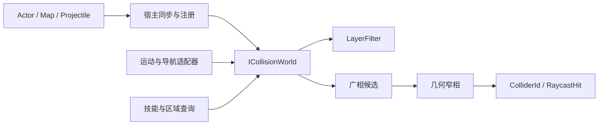
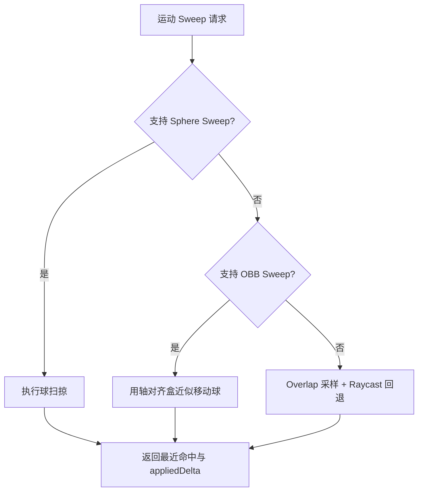
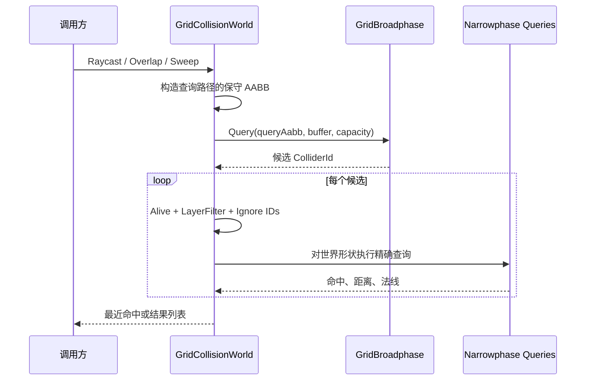

# 碰撞查询系统设计

本文说明 AbilityKit 当前碰撞包的代码结构、设计目的和使用边界。文中的“当前实现”以仓库中的接口、实现和测试为准；尚未接入运行时的能力单独列在演进章节，不作为现有契约。

> **文档类型：Canonical 设计**
> **事实基线：2026-08-16**
> **适用范围：`com.abilitykit.combat.collision.abstractions` 公共查询原语；MOBA Actor 同步、Motion、Projectile、Area 与 Navigation 适配属于消费者策略。**

## 一、系统定位

| 层次 | 本文结论 |
|------|----------|
| 当前实现 | 公共包提供 Collider 生命周期、几何窄相、Naive/Grid 世界和层过滤；Dynamic Tree 尚未成为可选世界后端 |
| 规范目标 | 所有广相必须候选完整、容量可诊断、层协议一致，并由同一契约测试矩阵约束 |
| 示例策略 | MOBA 负责把 Actor/Projectile/Area/Navigation/Motion 语义映射为 ColliderId 与查询参数，不反向进入公共碰撞实体模型 |

`com.abilitykit.combat.collision.abstractions` 提供一套与 Unity Physics 解耦的几何查询能力。它管理碰撞体的几何状态，执行射线、重叠和扫掠查询，但不拥有 Actor、移动规则、技能目标选择或表现对象。

这层拆分主要解决三个问题：

1. 战斗逻辑可以在纯 .NET 测试、控制台示例和服务端进程中复用同一套查询语义。
2. 碰撞体数据与业务实体解耦，ECS 或其他宿主只需维护 `ColliderId` 映射。
3. 广相筛选和窄相计算可以分别演进，不要求上层调用方感知具体空间索引。

当前模块不是通用物理引擎。它不负责刚体积分、碰撞约束求解、反弹、摩擦或 Unity Collider 同步，也没有完整的连续碰撞检测框架。

## 二、职责与所有权

碰撞系统的调用关系如下。



各层所有权需要保持清晰：

| 层级 | 拥有内容 | 不拥有内容 |
| --- | --- | --- |
| 业务宿主 | Actor 与 `ColliderId` 的映射、注册时机、销毁清理、层定义 | 几何相交算法 |
| `ICollisionWorld` | 碰撞体局部形状、世界变换、层 ID、查询入口 | Actor 生命周期和阵营规则 |
| 广相 | 世界 AABB 和候选 ID | 精确命中结论 |
| 窄相 | 形状相交、命中距离、法线 | 空间索引和业务过滤 |
| 运动适配器 | 移动体半径、障碍掩码、能力回退 | 碰撞体数据源 |

MOBA 示例中的 `CollisionWorldSyncSystem` 每帧把 Entitas Actor 的 Transform、Collider 和 CollisionLayer 同步到碰撞世界。它只回收自己创建的 Actor Collider，地图服务注册的静态 Collider 由地图服务管理。该规则避免某个同步系统通过全局扫描误删其他模块拥有的碰撞体。

## 三、公共契约

### 3.1 碰撞体生命周期

`ICollisionWorld` 的当前管理接口是：

```csharp
ColliderId Add(in Transform3 transform, in ColliderShape localShape, int layerId);
bool Remove(ColliderId id);
bool UpdateTransform(ColliderId id, in Transform3 transform);
bool UpdateShape(ColliderId id, in ColliderShape localShape);
bool UpdateLayer(ColliderId id, int layerId);
bool Update(ColliderId id, in Transform3 transform, in ColliderShape localShape);
```

`Add` 接收局部形状和世界变换。世界实现负责在查询时构造世界形状，并在需要广相时生成保守世界 AABB。上层不应提前把形状烘焙成世界坐标后又传入非单位 Transform，否则会重复变换。

`ColliderId` 当前从 1 单调递增。Naive 和 Grid 后端在 `Remove` 时都只标记失效，不复用 ID。这个行为便于在单局运行时保持引用稳定，但不等于 ID 可以跨世界、跨战局或跨存档使用。

更新方法在 ID 无效或碰撞体已移除时返回 `false`。调用方应把返回值视为同步状态异常信号，而不是默认忽略。

### 3.2 基础查询

基础接口提供两类查询：

```csharp
bool Raycast(
    in Ray3 ray,
    float maxDistance,
    in LayerFilter filter,
    out RaycastHit hit);

int OverlapSphere(
    in Sphere sphere,
    in LayerFilter filter,
    List<ColliderId> results);
```

`Raycast` 返回最近命中的 Collider、距离、命中点和法线。`OverlapSphere` 把结果追加到调用方传入的列表，不会主动清空列表；调用方需要在复用列表时自行 `Clear()`。

基础接口没有 Box Overlap、Capsule Overlap、批量 Raycast 或 `Span<T>` 版本。文档和业务代码不能把这些候选能力当成当前 API。

### 3.3 可选扫掠能力

扫掠没有继续扩大 `ICollisionWorld`，而是通过能力接口表达：

```csharp
public interface IOrientedBoxSweepCollisionWorld
{
    bool SweepOrientedBox(
        in OrientedBoxSweep box,
        in Vec3 direction,
        float maxDistance,
        in LayerFilter filter,
        out RaycastHit hit);
}

public interface ISphereSweepCollisionWorld
{
    bool SweepSphere(
        in Vec3 start,
        in Vec3 direction,
        float maxDistance,
        float radius,
        in LayerFilter filter,
        out RaycastHit hit);
}
```

Naive 和 Grid 当前都实现这两个接口。能力接口的目的不是表示实现可有可无，而是允许业务适配器在面对第三方或精简世界实现时显式降级。

MOBA 运动适配器的顺序是：



该回退属于 MOBA 领域适配策略，不是碰撞包的公共协议。球扫掠对 Sphere、AABB 和 OBB 使用 Minkowski 膨胀后的查询；Capsule 沿用现有近似，不能扩写为对所有形状都精确的通用 CCD。

## 四、形状和空间变换

当前 `ColliderShape` 支持：

- Sphere
- AABB
- Capsule
- OBB

碰撞体保存局部形状。查询前按 Transform 转换为世界形状：

- Sphere 中心使用 `TransformPoint`，半径使用缩放绝对值的最大分量。
- Capsule 两端点使用 `TransformPoint`，半径使用最大缩放分量。
- AABB 的八个角点变换到世界空间，再重建保守世界 AABB。
- OBB 合并实体旋转与局部旋转，HalfExtents 使用最大缩放分量。

最大分量缩放对非均匀缩放是保守处理。它避免缩小半径造成漏检，但会牺牲一部分精度。若业务需要非均匀缩放后的精确椭球或胶囊查询，应新增明确形状语义，而不是在现有 Sphere/Capsule 名义下改变结果。

Grid 广相中的 OBB 必须转换成世界 AABB。当前实现通过三个旋转轴在世界 XYZ 轴上的绝对投影之和计算包围范围。相关回归测试用于防止旋转 OBB 因错误的零尺寸 AABB 从广相中消失。

## 五、查询流水线

Grid 后端的典型查询分为四步。



广相返回的是候选集，不是命中集。即使候选 AABB 与查询 AABB 位于同一个 Cell，也仍需窄相确认。这个边界使 `IBroadphase` 可以只维护 AABB，不依赖 `ColliderShape`。

查询过滤顺序为：

1. Collider 存活且 ID 有效。
2. `LayerFilter.IsLayerIncluded` 通过。
3. `LayerFilter.ShouldIgnore` 不命中。
4. 窄相几何查询通过。
5. 单命中查询选择距离最小的结果。

同距离命中只在新距离严格小于当前最佳距离时替换。Naive 的平局顺序通常由 Collider 注册顺序决定；Grid 的平局顺序来自 Cell 遍历与 Cell 内插入顺序。当前契约没有声明跨后端一致的同距离 tie-break。依赖确定结果的调用方应避免构造完全等距的歧义场景，或在未来协议中增加显式 ColliderId 次级排序。

## 六、层过滤与层关系

### 6.1 LayerFilter 是查询过滤器

`LayerFilter` 包含：

- `IncludeMask`：非零时只包含命中的层。
- `ExcludeMask`：优先排除命中的层。
- `IgnoredColliders`：按 Collider ID 排除具体对象。

`IncludeMask == 0` 表示不限制层，不表示空集合。`LayerFilter.None` 才表示排除全部层。

当前掩码字段是 32 位 `int`，但代码接受 0 到 63 的 layer ID，并通过 `1 << layer` 计算位。C# 对 `int` 位移会截取低 5 位，因此 32 到 63 会与 0 到 31 发生位冲突。层矩阵虽然是 64×64，查询掩码实际不能无歧义表示 64 层。现阶段项目应把可查询层限制在 0 到 31；若确需 64 层，应把过滤掩码升级为 `ulong` 并补兼容迁移和测试。

`IgnoredColliders` 使用数组线性搜索，且结构体相等比较比较的是数组引用，不是内容。它适合忽略自身或少量对象，不适合作为大型排除集合或稳定值键。

### 6.2 CollisionLayerMatrix 是独立关系表

`CollisionLayerMatrix` 保存 64×64 对称关系，关系值包括 Ignore、Block 和 Overlap。默认同层 Ignore、异层 Block，并对 Layer 2 同层设置 Overlap。

`ShouldCollide`、`ShouldDetect` 和 `ICollisionLayerRelation` 可以查询或配置这张表，但当前 Raycast、OverlapSphere 和两个 Sweep 实现不会自动读取矩阵。查询是否包含某个目标层只由 `LayerFilter` 决定。

因此，下面两种概念不能混写：

- “本次查询想检测哪些层”使用 `LayerFilter`。
- “两个业务层之间的默认响应关系”使用 `CollisionLayerMatrix`。

如果未来要让查询自动应用 source layer 与矩阵，接口必须显式携带 source layer 或 query context，并定义 Block/Overlap 对每类查询的影响。不能在现有签名下隐式推断。

## 七、后端设计

### 7.1 NaiveCollisionWorld

Naive 后端线性遍历全部 Entry，然后执行过滤和窄相。

它的价值不只是在少量对象时省去索引开销，还包括：

- 结构简单，适合作为几何正确性的参考实现。
- 候选不会因广相容量截断而丢失。
- 测试可以将 Grid 结果与 Naive 结果对照。
- 调试时更容易定位问题属于空间索引还是窄相数学。

它的查询复杂度随存活与历史 Entry 数量线性增长。由于移除后槽位不回收，长生命周期世界中即使活跃 Collider 不多，历史注册量仍会增加遍历成本。

### 7.2 GridCollisionWorld

Grid 后端使用 `GridBroadphase` 将世界 AABB 登记到覆盖的所有 Cell。Collider 移动到不同 Cell 范围时，会先从旧范围移除，再写入新范围；跨多个 Cell 的对象会出现在多个列表中，查询时执行去重。

适用场景是对象空间分布相对均匀、查询范围相对局部，并且 Cell Size 能与对象和查询尺度匹配。Cell 太小会让大对象写入大量 Cell；Cell 太大会让候选集退化为接近全量扫描。

当前实现有几项需要明确的容量和复杂度边界：

- `_entries` 会按需扩容，但 `_queryResults` 只按构造时的 `initialCapacity` 分配，之后不会随 Entry 扩容。
- 候选数超过缓冲区时，`IBroadphase.Query` 只返回前 `maxResults` 个，世界查询没有溢出标志，因此可能静默漏检。
- Grid 去重使用 `List<int>.Contains`，候选较多时去重成本会接近平方级。
- 构造参数 `cellSize` 没有显式校验。零或负值不属于有效配置，调用方当前必须自行保证大于零。
- Cell Key 使用 `((long)cx << 42) | ((long)cy << 21) | (long)cz`，没有掩码或范围校验。负 `cz` 会先符号扩展为高位全 1，再覆盖 `cx/cy` 位段，因此普通负 Z 坐标就可能产生大量键冲突；这不只是极端坐标溢出风险。

在这些问题修复前，`initialCapacity` 不只是预分配提示，也决定单次查询候选上限。生产配置必须按最坏局部密度留出余量，并用压力测试验证没有候选截断。

### 7.3 DynamicAabbTree 的当前状态

仓库中已有实现 `IBroadphase` 的 `DynamicAabbTree` 数据结构，包含 Fat AABB、基于表面积代价的兄弟节点选择和树查询。但目前没有使用它的 `ICollisionWorld`：

- `BroadphaseType.DynamicAabbTree` 在工厂中返回 `GridCollisionWorld`。
- `CreateWithDynamicTree` 同样返回 Grid。
- 名为 Dynamic Tree 的示例实际创建的也是 Grid。
- 当前测试目录没有发现动态树的专项正确性测试。

因此，动态树只能视为未完成接入的数据结构，不能作为已交付后端。其现实现还需要处理或验证：

- 查询遍历栈固定为 64，超深节点会被静默跳过。
- Node 只增加不复用，频繁 Remove/Update 会持续扩容。
- `Clear` 固定重置为 64，而不是恢复构造容量。
- Fat AABB 更新的位移判断基于旧 `OriginalAabb`，轻微连续移动的累计语义需要专项测试。
- 树没有旋转或平衡步骤，长期更新后的高度和最坏查询成本未验证。

接入顺序应是先补 `IBroadphase` 契约测试和动态树压力测试，再让世界实现注入任意 Broadphase，最后修改工厂。只改变枚举分支会把未验证的数据结构直接带入所有窄相查询。

## 八、业务接入

### 8.1 服务注册

`CollisionService` 只负责按 `CollisionWorldOptions` 创建并暴露一个 `ICollisionWorld`。它不驱动更新，也不在 `Dispose` 中清理外部业务对象。

默认配置选择 Naive。需要 Grid 时应显式配置 BroadphaseType、Cell Size 和 Initial Capacity。当前 DynamicAabbTree 配置等价 Grid，调用方不应根据枚举名推断实际类型。

### 8.2 Actor 同步

MOBA Actor 同步链路是：

```text
Entitas Transform + Collider + CollisionLayer
-> CollisionWorldSyncSystem
-> Add / Update / UpdateLayer / Remove
-> Actor CollisionId Component
```

CollisionLayer Component 使用单 bit mask。同步系统会把该 bit 转换成 layer ID；多 bit mask 会抛出异常。这里的单层归属与查询时可组合的 LayerFilter 是两种不同数据。

### 8.3 Projectile、Area、Navigation 和 Motion

ProjectileWorld 与 AreaWorld 直接依赖 `ICollisionWorld` 执行命中和范围查询。Navigation Bake 使用 OverlapSphere 复用窄相，形成地图可走性条件的一部分。Motion 使用领域适配器把 ColliderId 转换为 mover/actor 语义，并负责忽略自身、障碍掩码和无 Sweep 能力时的回退。

这些模块都不应反向修改碰撞包的实体模型。需要阵营、技能来源或运动状态时，应在查询结果返回后通过业务注册表解析 ColliderId。

## 九、确定性与性能边界

当前查询不使用 Unity Physics，也没有内部随机数；在相同注册、更新和查询顺序下，Naive 与 Grid 的几何结果具备可重复基础。但“可重复”仍受以下条件约束：

- 浮点运算平台和编译环境一致。
- Collider 注册与更新顺序一致。
- 不依赖未定义的同距离命中顺序。
- Grid 候选没有被容量截断。
- 业务层不会用 Dictionary 枚举顺序生成注册顺序。

仓库中的示例包含简单 Stopwatch 对比，但它不是正式 Benchmark，也没有稳定硬件、预热、GC 和分布模型控制。设计文档不承诺固定实体数下的毫秒指标，也不宣称 Grid 在所有规模下必然快于 Naive。

性能验收应至少记录：

- 活跃 Collider 数和历史注册数。
- 形状占比与平均覆盖 Cell 数。
- 查询类型、范围和每帧次数。
- 候选数、窄相次数和候选截断次数。
- Update/Remove 频率。
- 分配量与 GC。

## 十、测试证据

当前测试已覆盖以下行为：

| 能力 | 已有证据 |
| --- | --- |
| 基础原语 | AABB Contains/Intersects、OBB 轴、Sphere 半径钳制、ColliderShape 构造 |
| Naive/Grid 等价 | Raycast、OverlapSphere、OBB Sweep、Sphere Sweep |
| 查询过滤 | LayerFilter 和 ignored collider |
| 旋转形状 | 旋转 OBB 世界 AABB与 Sweep 回归 |
| Grid 更新 | 多 Cell 对象移动与移除后无旧 ID 残留 |
| 业务适配 | MOBA Motion Adapter 的扫掠与忽略逻辑 |

本次验证中，公共碰撞测试工程 `AbilityKit.Combat.Collision.Abstractions.Tests` 为 13/13 通过；`core-stability` workflow 的实际 gate 配置包含该工程，因此这 13 项同时具备局部 E3 和对应 E5 编排证据。MOBA 过滤运行中的 16 项碰撞消费者测试也通过，但它们证明的是业务适配，不覆盖底层所有容量、坐标和 Dynamic Tree 契约，且未发现同等专项 gate 接线。

| 等级 | 当前证据 | 可得结论 |
|------|----------|----------|
| E0 | 公共契约、Naive/Grid/Tree 和工厂源码 | 可确认后端选择、层协议和静默截断风险 |
| E1 | MOBA Collision/Motion/Projectile/Area/Navigation 消费 | 证明多种战斗工具复用公共查询原语 |
| E2 | 测试工程构建并执行成功 | 当前公共包与测试可编译 |
| E3 | 公共包直属测试 13/13；MOBA 碰撞消费者 16 项通过 | 仅覆盖已有 fixture，不含高密度、负坐标键和动态树完整矩阵 |
| E4 | 无正式碰撞性能 artifact | 不承诺固定规模耗时、GC 或 Grid 收益 |
| E5 | `core-stability` 实际编排公共包 13 项测试 | E5 只覆盖该工程当前测试面，不代表缺失契约已被保护 |

仍缺少的关键门禁：

1. Grid 候选数超过 Initial Capacity 时必须报告或扩容，不能静默漏检。
2. 0、负数和极端 Cell Size 的配置校验。
3. 32 到 63 层的掩码冲突测试与协议修正。
4. 同距离命中的稳定 tie-break。
5. DynamicAabbTree 的插入、移动、移除、深树、节点复用和平衡测试。
6. 长时间 Add/Remove 后 Naive 与 Grid 的内存和查询退化测试。
7. 不同形状和非均匀缩放组合的查询矩阵。

## 十一、演进顺序

后续优化应按正确性优先于后端扩展的顺序推进。

### P0：关闭静默漏检

- 让 Grid 查询缓冲区随 Entry 容量扩展，或改为可检测溢出的池化结果容器。
- 为 Broadphase Query 增加溢出语义，调用方能区分“没有更多候选”和“缓冲区已满”。
- 校验 Cell Size、Initial Capacity 和坐标范围。
- 统一查询同距离时按 ColliderId 排序。

### P1：统一层协议

- 在 32 层与 64 层中选择一套真实协议。
- 若保留 64 层，将 Include/Exclude Mask 升级为 `ulong`。
- 决定 CollisionLayerMatrix 是只供业务查询，还是进入带 source layer 的查询上下文。
- 补全 Block、Overlap 和 Ignore 对各类调用方的解释。

### P2：广相可替换化

- 建立所有 `IBroadphase` 必须通过的候选完整性契约测试。
- 让 GridCollisionWorld 的查询与存储逻辑依赖可注入 Broadphase，而不是具体 Grid 类型。
- 修复并验证 DynamicAabbTree 的节点复用、遍历栈、平衡和更新策略。
- 接入工厂后再修正示例名称和运行输出。

### P3：性能工程

- 建立 BenchmarkDotNet 或等价稳定基准。
- 记录候选数、窄相数、Cell 覆盖和溢出指标。
- 根据真实场景决定是否需要池化缓冲区、无分配查询、批量 API 或 Jobs/Burst 后端。

## 十二、源码入口

- 公共世界契约：`Unity/Packages/com.abilitykit.combat.collision.abstractions/Runtime/Math/CollisionWorld.cs`
- 查询过滤：`Unity/Packages/com.abilitykit.combat.collision.abstractions/Runtime/Collision/LayerFilter.cs`
- 广相契约：`Unity/Packages/com.abilitykit.combat.collision.abstractions/Runtime/Collision/IBroadphase.cs`
- Grid 广相：`Unity/Packages/com.abilitykit.combat.collision.abstractions/Runtime/Collision/GridBroadphase.cs`
- Grid 世界：`Unity/Packages/com.abilitykit.combat.collision.abstractions/Runtime/Collision/GridCollisionWorld.cs`
- 动态树数据结构：`Unity/Packages/com.abilitykit.combat.collision.abstractions/Runtime/Collision/DynamicAabbTree.cs`
- 世界工厂：`Unity/Packages/com.abilitykit.combat.collision.abstractions/Runtime/Collision/CollisionWorldFactory.cs`
- 层关系矩阵：`Unity/Packages/com.abilitykit.combat.collision.abstractions/Runtime/Collision/CollisionLayerMatrix.cs`
- MOBA Actor 同步：`Unity/Packages/com.abilitykit.demo.moba.runtime/Runtime/Application/Systems/Collision/CollisionWorldSyncSystem.cs`
- MOBA 运动适配：`Unity/Packages/com.abilitykit.demo.moba.runtime/Runtime/Application/Services/Motion/MobaMotionHitTriggerRuntime.cs`
- Grid 正确性测试：`src/AbilityKit.Demo.Moba.Tests/Collision/GridCollisionWorldTests.cs`
- 碰撞修复回归：`src/AbilityKit.Demo.Moba.Tests/Collision/CollisionCorrectnessFixTests.cs`

---

*文档版本：v3.0 | 最后更新：2026-08-16*
