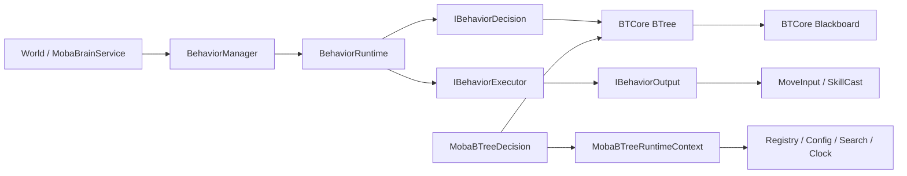
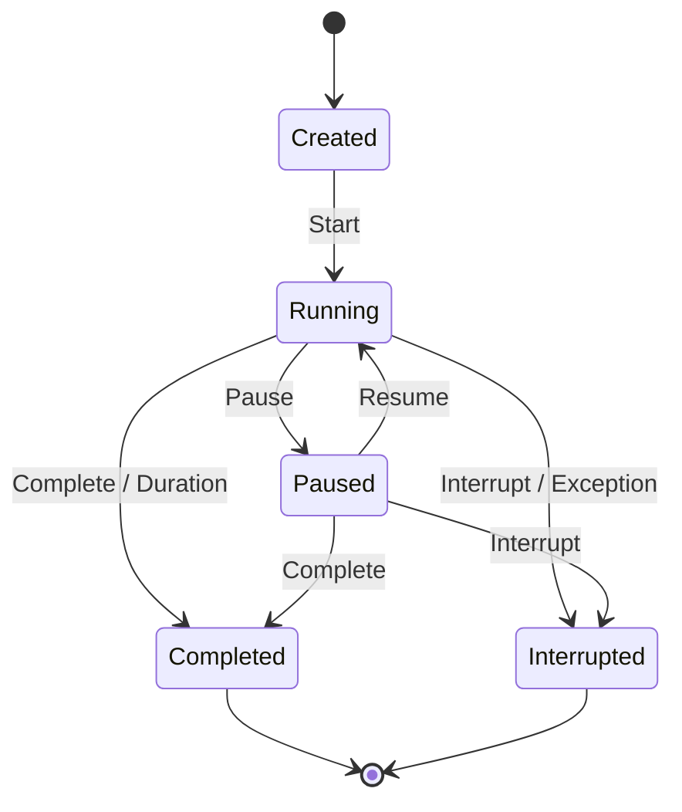
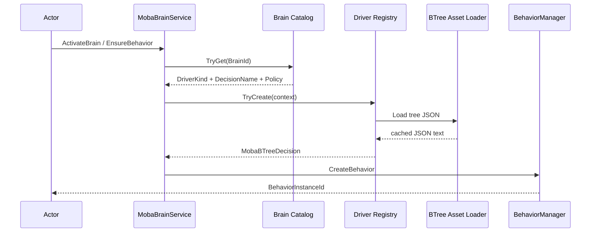
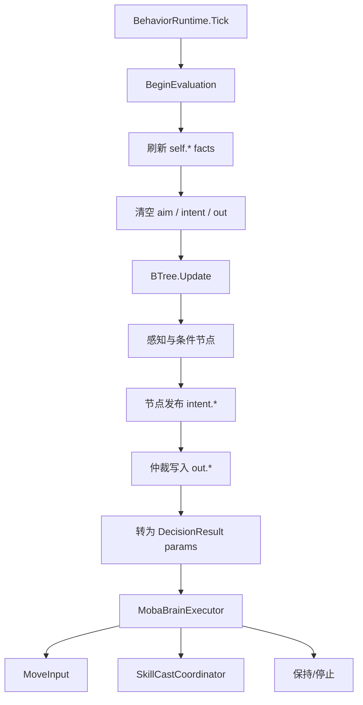

# 行为树集成设计

> 文档类型：FrameworkCore canonical
> 事实基线：2026-08-16
> 文档版本：v3.3（已归档）
>
**归档说明（2026-08-20）**：BTCore（`com.abilitykit.thirdparty.behaviortreeeditor`）已随自研行为树包 [`07-BehaviorTreePackageDesign.md`](07-BehaviorTreePackageDesign.md) 的 P4 退役整体删除；MOBA Brain 已切换到 `com.abilitykit.behaviortree` 运行时。本文保留为 BTCore 时代的集成决策记录，"当前实现"描述不再对应仓库现状，现行架构以 07 文档为准。文中关于 BehaviorManager 生命周期、Tick 重入边界、暂停语义的风险描述仍适用于 `com.abilitykit.behavior` 本身，尚未全部关闭。

本文说明 AbilityKit 当前行为运行时、BTCore 树执行器与 MOBA 领域接入之间的关系。文中的“当前实现”以仓库中的代码和测试为准；未接入业务链路的适配器、尚未关闭的生命周期风险和后续优化分别说明，不作为已经交付的统一方案。

## 一、系统定位

AbilityKit 没有把行为树直接做成战斗世界的主循环。当前实现由三层组成：

1. `com.abilitykit.behavior` 提供持续行为的生命周期、决策接口、执行接口、状态和输出。
2. BTCore 提供树拓扑、节点生命周期、组合节点、条件重评估和黑板。
3. MOBA 运行时负责加载树配置、绑定领域服务、刷新每帧事实，并把树输出转换成移动、施法或保持意图。



这三层解决的是不同问题：

| 层级 | 主要职责 | 不负责的内容 |
| --- | --- | --- |
| `BehaviorRuntime` | 行为启动、暂停、恢复、完成、中断、持续时间和每帧输出 | 树拓扑和领域感知 |
| BTCore | 节点执行、父子关系、运行栈、条件中断和树黑板 | Actor 生命周期和技能规则 |
| MOBA 接入 | Brain 配置、树资源、领域节点、事实刷新和意图落地 | 通用行为生命周期 |

行为树只是 `IBehaviorDecision` 的一种实现。代码决策或其他状态机只要遵守相同 Decision/Executor 契约，也可以由 `BehaviorRuntime` 驱动。MOBA 的 HFSM 当前走独立状态机所有权分支，不是通过通用行为树桥接器运行。

## 二、通用行为运行时

### 2.1 Decision 与 Executor 分离

`BehaviorRuntime` 的每帧主链路是：

```text
Tick
-> Decision.Decide(context, world)
-> Executor.Execute(result, context, output)
-> Complete / Interrupt / Duration check
```

`IBehaviorDecision` 负责判断本帧要做什么，`IBehaviorExecutor` 负责把 `DecisionResult` 写入 `IBehaviorOutput`。这种拆分让决策实现不必直接依赖移动输入、技能协调器或表现对象。

运行时向 Decision 暴露的上下文包括：

- Behavior Instance、Kind、Source Context、Owner 和可选 Target。
- 当前 Frame、累计 ElapsedSeconds 和可选 Duration。
- 可持久保存的 `IBehaviorState`。
- 创建时传入的只读 Config。
- `IWorldQuery` 领域查询入口。

`BehaviorOutput` 是帧级输出。每次 Tick 开始时会清空完成请求、中断请求、事件、效果和移动信息，因此 Decision 必须在需要持续输出时每帧重新发布，而不能依赖上帧值继续生效。

### 2.2 生命周期



`BehaviorRuntime` 同时实现 `IContinuous`，并按以下方式映射状态：

| Behavior Phase | Continuous State |
| --- | --- |
| Created | Inactive |
| Running | Active |
| Paused | Paused |
| Completed | Expired |
| Interrupted | Aborted |

它还通过内部配置暴露 Mutex Group、Priority 和 Duration。Mutex Group 当前直接使用 `BehaviorKind`，但 `BehaviorManager` 本身没有执行互斥仲裁；是否交给 `ContinuousManager` 管理以及如何处理同组优先级，需要由宿主明确选择。

Duration 在每帧 Decision 和 Executor 执行之后检查。因此某个 Tick 即使已经达到时限，仍会先产生一次本帧决策，再完成行为。需要严格截止时间的业务不能假设超时帧完全不执行。

`ElapsedSeconds` 当前不是逐帧 float 累加。`BehaviorRuntime` 通过 `DeterministicMathBridge` 把 `deltaTime` 转成 Q32.32 raw 值并使用整数累加，公开 float 只在属性边界换算。这降低了同一输入序列的累计漂移，但不自动保证树随机节点、领域查询或外部时钟也具有跨平台确定性。

### 2.3 完成、中断与异常

Decision 可以通过以下方式结束行为：

- 返回 Complete 或 Interrupt，并由 Executor 写入 Output。
- 通过 Context 请求完成或中断。
- 达到 Duration。
- 在 Decision 或 Executor 中抛出异常。

运行时捕获 Decision/Executor 的异常并转成 `Interrupt("Exception: " + ex.Message)`。这能阻止异常穿透主循环，但公开的中断状态只保留消息，不保留异常类型、堆栈和结构化上下文。生产诊断不能只依赖该字符串，宿主应在异常边界记录完整异常和 Behavior 身份。

这个 catch 不等于完整异常隔离。`Tick` 在进入 Decision 前已经写入 CurrentFrame、累计 ElapsedSeconds 并清空上一帧 Output；Decision 或 Executor 失败后这些状态不会回滚。随后调用 `Interrupt` 时会先写 Phase，再同步执行公开中断回调和 `IContinuous.OnEnded`；任一回调再次抛错都会从 catch 内向外传播。Complete 路径也先写终态再通知，观察者异常不会恢复 Phase。

## 三、BehaviorManager 的所有权

`BehaviorManager` 为每个行为分配单调递增的 InstanceId，并维护四类索引或调度结构：

- 全局 InstanceId 到 Runtime。
- 反向注册序 Tick 使用的 `_orderedBehaviors` 列表。
- OwnerId 到 Runtime 列表。
- InstanceId 到可选 `BehaviorBinding`。

创建时，Manager 注册完成和中断事件、启动 Runtime，再发布创建事件。结束时执行以下清理：

1. 解除 Runtime 事件订阅。
2. 若 Decision 实现 `IDisposable`，调用一次 `Dispose()`。
3. 从 Binding、Owner 列表和全局表移除。
4. 发布 `OnBehaviorEnded`。

这两条路径都不是事务。`OnBehaviorCreated` 抛错时行为已经进入 Running 并存在所有索引中，但 `CreateBehavior` 不会正常返回句柄。结束时 Manager 在移除索引前先 Dispose Decision；Dispose 抛错会中断清理，使终态 Runtime 继续残留在 Manager，后续再次 Complete/Interrupt 又因 Phase 已终止而不会重触发清理。`OnBehaviorEnded` 抛错则发生在索引已移除之后，不会回滚。宿主应让 lifecycle observer 与 Decision Dispose 幂等且不抛异常，并为创建失败后按 InstanceId 扫描残留提供诊断。

`InterruptAll` 和 Binding 的 `EndAllBehaviors` 都先复制 ID 或 Runtime 列表，避免在批量中断过程中修改正在遍历的集合。

### 3.1 Tick 顺序与重入边界

当前 `BehaviorManager.Tick` 不再枚举 `_behaviors.Values`，而是从 `_orderedBehaviors.Count - 1` 到 `0` 反向遍历。Runtime 同步完成或中断时，`Cleanup()` 会同时从字典、owner 列表和 ordered list 移除对象。普通“当前项在自己的 Tick 中结束”不会触发 Dictionary 枚举失效，旧版风险描述已经不适用。

这同时形成一个必须显式记录的模拟契约：Tick 顺序是**反向注册序**，而不是源码注释所称的注册序。若后注册行为会读写前一行为同帧可见的状态，改变注册顺序就可能改变结果。

当前仍缺少 Tick 内结构变更的专项测试，而且 live-list 行为可以从源码精确推导：当前项自结束通常安全；当前项若同步结束一个更早注册、尚未执行的行为，自身会因列表左移而可能在下一次循环索引再次被 Tick；新建行为追加在列表尾，本轮通常不可见；结束已经执行过的更晚注册行为则不会让新对象补跑。也就是说，交叉结束不只是“顺序未定义”，还可能造成同一 Runtime 单帧重复执行。

生产接入应在测试固化前避免从 Decision、Executor 或 `OnBehaviorEnded` 直接修改其他行为，优先使用 Tick 快照或延迟变更队列，并补“自结束、结束早注册项、结束晚注册项、新建项、同帧重复执行”的矩阵。

### 3.2 Manager 释放边界

`BehaviorManager` 当前没有实现 `IDisposable`，也没有批量关闭所有存量行为的统一方法。`InterruptAll(owner)` 只处理中断时仍为 Running 的 Runtime，Paused 行为会保留。MOBA 的 `MobaBrainService.Dispose()` 只清空失败创建缓存，不会中断 `_behaviors` 中仍然存活的 Runtime。

现有战局销毁顺序可能通过 Actor/World 生命周期提前释放行为，但该假设没有固化在 Manager 契约中。后续应提供明确的 Shutdown/Dispose，并定义结束原因、Decision Dispose 和结束事件是否仍需发布。

Pipeline 内嵌行为还有另一条独立所有权路径：`AbilityBehaviorPhase` 直接 `new BehaviorRuntime`，不注册到 `BehaviorManager`。其 Cleanup/Reset 只解绑事件并清空引用，不 Interrupt Runtime，也不 Dispose Decision；外部中断只会处理 Running 行为，Paused 行为同样可能被直接遗忘。Behavior 自然完成或异常中断时，Phase 的两个 Runtime 回调当前为空，领域 `OnBehaviorInterrupt` 不会从这里被调用；阶段通常要到输出请求或下一 Tick 才完成。不能把 Manager 的 Decision 清理保证外推到这个 Phase。自定义阶段采用前必须补终态、Reset、外部中断、暂停和 Decision Dispose 的专门所有权测试。

## 四、BTCore 树执行器

### 4.1 树构建

BTCore 的树配置由 `BTData`、Node 列表、Entry Node、Blackboard 和 Settings 组成。运行前需要执行：

```text
RebuildTree
-> 重建 GUID 索引
-> 清空并重新绑定父子关系
-> 把 Blackboard 注入节点
-> Node.Init

Enable
-> 清空运行时索引和栈
-> 构建执行拓扑
-> 将根节点压入主运行栈
```

`RebuildTree()` 可以重复调用。现有测试验证重复重建不会把同一 Child 重复加入 Parent，也验证连续两次 Enable 后只运行一套拓扑。

节点生命周期是 `Init -> Start -> Update -> Stop`。SharedValue 属性由节点初始化阶段通过反射绑定到 Blackboard，因此序列化键名、值类型和运行前的 Blackboard 完整性会直接影响节点执行。

### 4.2 执行与条件重评估

BTCore 使用运行栈推进节点。节点结束时先 Stop，再把 Success 或 Failure 传播给父 ParentNode；Decorator 可以转换子节点结果，Composite 根据 AbortType 管理条件重评估。

`RestartWhenComplete` 可以在主栈清空时自动 Restart。MOBA 接入没有依赖这个设置，而是在读取根节点状态后对 Success 或 Failure 显式调用 `Restart()`。这样每个 Brain 实例都按 MOBA 的响应式帧语义重新进入下一轮决策。

MOBA 还对根节点长期返回 Running 给出一次警告。Running 节点不会天然刷新它使用的事实，也不会天然重新发布意图，因此领域节点必须明确实现每帧更新语义。

### 4.3 随机节点与确定性

BTCore 的 RandomSelector 和 RandomSequence 提供 `UseSeed` 与 `Seed`：

- `UseSeed == true` 时创建 `new Random(Seed)`。
- 未启用 Seed 时创建 `new Random()`。

RandomProbability 每次 Start 都创建 `new Random()`，目前没有 Seed 注入入口。由此可见，BTCore 默认不是确定性执行器。要用于帧同步、回放或跨端复现，至少需要：

- 禁止未注入随机源的随机节点，或在装载校验时拒绝它们。
- 由战局 Seed、Actor ID 和节点 GUID 派生稳定子流。
- 把随机调用次数和节点重启语义纳入回放协议。
- 增加相同输入和 Seed 下的逐帧状态/意图一致性测试。

只给部分 Composite 配置 Seed 不能解决 RandomProbability，也不能保证新增领域节点不私自使用系统时间随机数。

## 五、通用 BTCore 适配能力

`com.abilitykit.behavior` 中存在一组通用桥接器，但当前 MOBA BTree 没有引用它们。文档必须把“可复用能力”和“业务实际链路”分开。

### 5.1 节点与 Decision 的结果转换

`BTreeResultConverter` 的映射是：

| BTCore NodeState | DecisionKind |
| --- | --- |
| Success | Complete |
| Failure | Interrupt |
| Running | Continue |
| Inactive 或其他值 | Continue |

反向映射把 Complete 变为 Success、Interrupt 变为 Failure，ChangeState 和 Continue 都变为 Running。

`BTreeActionAdapter` 和 `BTreeConditionAdapter` 同时继承 BTCore Node 并实现 `IBehaviorDecision`。它们适合把单个节点当成一个 Behavior Decision，而不是把完整 BTree 自动嵌入 BehaviorRuntime。

Action Adapter 的 `Decide` 直接调用节点的 OnUpdate 路径；Condition Adapter 直接调用 Validate。它们没有驱动完整树的运行栈，也没有替代 `BTree.Update()`。

### 5.2 Executor Adapter

`BTreeExecutorAdapter` 在处理 DecisionResult 前，先把 `IBehaviorState` 同步到 Blackboard，再把 Complete、Interrupt 或移动参数写入 `IBehaviorOutput`。

当前实现只调用 `SyncStateToBlackboard`，不会在执行后自动调用 `SyncBlackboardToState`。需要双向同步的调用方必须自行安排时机，否则“已注册双向映射”不代表每帧会自动双向复制。

### 5.3 Blackboard Bridge

`BTreeBlackboardBridge` 通过显式映射连接 `IBehaviorState` 与通用 `IBlackboard`：

```csharp
bridge.RegisterMapping<float>("move.speed", "self.speed");
bridge.SyncStateToBlackboard(state);
bridge.SyncBlackboardToState(state);
```

这是一套数据复制协议，不是零拷贝共享状态。它的当前边界包括：

- 未设置 Blackboard 时，多数读写和同步方法静默返回；直接读取 `Blackboard` 属性则抛异常。
- 运行时 Type 访问通过反射调用泛型方法。
- 反射异常被捕获后退回 object 读写，原始类型错误和调用异常不会保留诊断信息。
- `BTCoreBlackboardAdapter.HasKey` 使用 `Find<object>` 判断，具体行为依赖 BTCore Blackboard 的泛型查找语义。
- 当前没有发现通用 Bridge、Action Adapter 或 Executor Adapter 的专项测试，也没有发现 MOBA 对它们的引用。

因此，通用桥接器可以作为后续统一适配的基础，但不能描述成已经支撑 MOBA 行为树的运行主链路。

## 六、MOBA Brain 接入

### 6.1 Brain 配置与 Driver

MOBA Actor 的 Brain Component 保存 BrainId、来源和 Behavior InstanceId。`MobaBrainService` 只通过战斗模板中的 Brain Catalog 解析定义，不会按 BrainId 隐式回退到硬编码决策。



默认 Driver Registry 只注册 BTree Driver。注册表允许项目增加新的 `IMobaBrainDecisionDriver`，同一 Kind 的后注册实例会覆盖前一个实例。

HFSM 类型在 `MobaBrainService` 中走独立分支：激活时校验 State Machine Profile、清理旧 Behavior，并由 Actor State Machine 系统拥有运行时。`MobaHfsmBrainDecisionDriver` 虽然存在，但默认注册表没有注册它，当前 Brain Service 的 HFSM 分支也不会通过它创建 `IBehaviorDecision`。

### 6.2 创建失败和替换

树资源缺失、JSON 反序列化失败、结构校验失败或 Driver 返回 null 时，不创建 BehaviorRuntime。Brain Service 记录失败身份，并对相同 Actor、Brain 来源和定义的重复失败进行抑制，避免每帧重复创建与刷日志。

Brain 定义或来源变化后，失败身份变化，可以重新尝试创建。新 Runtime 创建成功后，Actor 先绑定新 InstanceId，再中断旧 Runtime，避免替换过程留下无绑定的新决策。

关闭 Brain 时会：

- 移除 ActorBrain。
- 中断对应 BehaviorRuntime。
- 清除失败创建记录。
- 把已有 MoveInput 归零。

现有冒烟测试覆盖关闭 AI 后角色不再继续移动。

## 七、树资源和结构校验

### 7.1 加载顺序与缓存

`MobaBTreeAssetLoader` 按树名加载 JSON，当前顺序是：

1. 已注入的 `ITextAssetLoader`，路径为 `moba/bt/<treeName>`。
2. Unity Resources 中的 `moba/bt/<treeName>`。
3. 当前工作目录的 `Configs/moba/bt/<treeName>.json`。

JSON 文本按 treeName 存入进程内静态 Dictionary。每棵树只加载一次文本，但每个 Brain 实例会独立反序列化，因此节点状态和 Blackboard 不在 Actor 间共享。

缓存没有版本、时间戳、容量限制或清空接口。进程内修改资源后，已有缓存不会自动失效；当前能力不能描述为热重载。需要热重载时应先定义版本身份、原子替换、旧 Runtime 迁移或重建策略，再增加缓存失效入口。

### 7.2 类型归一化

MOBA 导出 JSON 中的类型会在反序列化前归一化：

- `BTEXT:<NodeName>` 按 MOBA BTree 命名空间中发现的非抽象 BTNode 类型解析。
- 序列化中的 `BTRuntime` 程序集名替换为当前 BTCore 程序集名。
- 未知 `BTEXT` 节点抛出 JsonSerializationException。

节点类型表由反射发现并按类型名建立 Dictionary。当前协议要求同一命名空间中的节点类名唯一；若出现重名，类型表初始化会失败。

### 7.3 结构与黑板门禁

反序列化后会检查：

- BTData 和 Blackboard 不为空。
- Node 列表非空且不存在 null Node。
- 每个 Node GUID 非空且唯一。
- 恰好存在一个 Entry Node。
- Entry Child 和所有 Child GUID 都能解析。
- Blackboard 已声明 Key 名非空且不重复。
- MOBA 标准 Key 的已有类型与协议一致。

缺失的标准 Blackboard Key 会按目标类型补齐。该校验能阻止常见的序列化结构错误进入运行时，但当前没有检查不可达节点、父子环、多个父节点、装饰器子节点数量、领域节点参数范围或随机节点的确定性约束。

## 八、MOBA 每帧数据协议

MOBA 没有使用通用 `BTreeBlackboardBridge`。`MobaBTreeDecision` 直接维护 BTCore Blackboard，并通过 `MobaBTreeRuntimeContext` 向领域节点注入 Registry、Config、SearchTargetService、时间源、Behavior Context 和 World Query。

### 8.1 Key 命名空间

当前 Key 按职责分组：

| 前缀 | 含义 | 生命周期 |
| --- | --- | --- |
| `self.*` | Owner 身份、位置、速度、能力和评估帧 | 每帧刷新 |
| `target.*` | 当前目标事实 | 感知节点更新 |
| `candidateSkill.*` | 当前候选技能 | 技能选择节点更新 |
| `aim.*` | 本帧瞄准结果 | 每帧清空后重建 |
| `intent.*` | 节点发布的候选意图和优先级 | 每帧清空后重建 |
| `out.*` | 仲裁后的 Move/Cast/Hold | 每帧清空后重建 |
| `memory.*` | 约定的持久节点状态 | 不由帧清理逻辑清除 |

`memory.*` 是设计约定，不是由独立类型系统或访问控制强制执行。领域节点仍可能误把跨帧状态写入 transient key，因此新增节点需要代码评审和测试。

### 8.2 单帧评估顺序



每帧先刷新 Owner Facts，再清空瞬时意图，然后执行树。Move 输出转成 `MoveTarget` 和当前移动速度；Cast 输出转成 SkillId、Slot、Target、Aim Position 和 Aim Direction；没有有效输出时状态为 Holding。

`MobaBTreeDecision` 始终返回 Continue，并把树的 Success/Failure 解释为“本轮决策完成，重启后继续下一帧”，而不是结束整个 BehaviorRuntime。这与通用 `BTreeResultConverter` 把 Success 映射为 Complete 的语义不同，两者不能混用。

### 8.3 响应式节点约束

MOBA 树按响应式决策循环使用。节点若返回 Running，必须遵守两条规则：

1. 每帧重新读取会变化的事实，不能永久缓存 Target、技能可用性或位置。
2. 每帧重新发布需要维持的意图，因为 transient intent 在树执行前已清空。

持久记忆应写入 `memory.*`，并明确重置时机。把 Move 或 Cast 请求留在 `intent.*` 中等待下一帧不会生效。

## 九、测试证据

当前测试能证明的范围如下。2026-08-16 当次 `AbilityKit.BTCore.Tests` 为 `3/3`，`BehaviorManagerLifecycleTests` 聚焦筛选为 `2/2`；后者构建仍有既有依赖漏洞、Entitas 兼容性和可空性警告。

| 能力 | 已有证据 |
| --- | --- |
| Behavior 清理 | 外部 Interrupt 和直接 Complete 后，Disposable Decision 只释放一次并从 Manager 移除 |
| BTCore 重建 | 无序列化回调时可重建 Node 索引；重复 Rebuild 不重复挂 Child |
| BTCore 启用 | 连续 Enable 两次后只执行一套拓扑 |
| 技能选择 | FirstReady 和 HighestRange 的稳定排序与 Slot tie-break |
| Blackboard 事实 | 选择策略结果写入 candidateSkill Keys |
| Hero AI | Brain 创建、追击、施法、冷却约束和关闭后停止移动 |
| Summon AI | 召唤物按 Brain Catalog 创建 BTree Runtime，并通过树追击目标 |

仍缺少的关键门禁：

1. Behavior 在 Manager Tick 中自结束、结束其他行为或创建新行为时，反向注册序和同帧可见性必须稳定。
2. Manager/Brain Service Shutdown 后所有 Decision 必须释放，索引和 Binding 必须清空。
3. Behavior Pause/Resume 对 BTCore Running Node 的 Start/Stop 与时间语义。
4. 通用 Action、Condition、Executor 和 Blackboard Bridge 的专项测试。
5. JSON 的重复 GUID、缺失 Child、未知 BTEXT、Blackboard 类型冲突等负向测试。
6. 树环、不可达节点、非法父子数量和重复父节点的结构测试。
7. 相同输入与 Seed 下 Random 节点和 MOBA Intent 的逐帧一致性测试。
8. 资产缓存失效、版本替换和多战局进程复用测试。
9. Running 节点是否每帧刷新事实和重发意图的契约测试。
10. `OnBehaviorCreated`、Decision Dispose、结束观察者抛错后的索引与终态残留。
11. `AbilityBehaviorPhase` 在完成、中断、暂停、Reset 与 Pipeline 失败路径中的 Runtime/Decision 释放。

## 十、已知边界

### 10.1 两套状态存储没有统一所有权

Behavior Runtime 有 `IBehaviorState`，BTCore 有 Blackboard，MOBA 又在 Blackboard 中定义 facts、intent 和 memory。当前通用 Bridge 只在调用方显式执行时复制，MOBA 则完全绕过 Bridge。

项目应先决定哪一类数据由哪一层拥有：

- Behavior 生命周期数据放在 Runtime/Context。
- 树节点共享数据放在 Blackboard。
- 帧事实由宿主刷新。
- 持久业务记忆需有明确清理和序列化协议。

不应把相同可变值同时长期保存在 State 和 Blackboard，再依赖不明确的同步顺序解决冲突。

### 10.2 暂停不会通知树节点

`BehaviorRuntime.Pause()` 只改变 Phase，暂停期间不调用 Decision。它不会对 BTCore 当前 Running Node 调用 Stop，也不会冻结节点内部使用的外部时钟。

恢复后树从原运行栈继续。若节点根据 Behavior ElapsedSeconds 计时，该时间在暂停期间不会增加；若节点读取注入的战局绝对时间，暂停期间的时间可能继续流逝。领域节点必须选择一种时间来源，文档不能笼统宣称暂停会冻结所有行为时间。

### 10.3 配置安全边界

MOBA 使用 Json.NET 的 TypeNameHandling 相关序列化设置，并在归一化阶段写入程序集限定类型。虽然 `BTEXT` 节点受白名单式发现约束，普通 `$type` 的允许范围仍取决于 BTCore Serializer Settings。

行为树 JSON 应视为可信构建产物，不应直接接受不受信任的远程输入。若未来需要在线下发，应增加严格 SerializationBinder、Schema 校验、签名和版本门禁。

### 10.4 诊断能力不完整

当前可以读取 DecisionType、CurrentState 和 MOBA Blackboard，也有部分警告和异常日志，但还缺少统一的：

- 当前运行节点路径。
- 本帧读取的事实和发布的意图。
- 条件中断原因。
- 树版本和资源哈希。
- Decision/Executor 耗时与节点调用计数。
- Runtime 结束时的完整异常结构。

没有这些信息时，复杂 AI 问题仍需要人工拼接 Brain、Behavior、树和技能日志。

## 十一、演进顺序

后续工作应先关闭生命周期和确定性风险，再扩大编辑器与热重载能力。

### P0：关闭生命周期缺口

- 固化反向注册序是否为预期契约，并用 Tick 内自结束/交叉结束/创建测试关闭重入缺口。
- 为 Manager 和 Brain Service 增加明确 Shutdown/Dispose。
- 定义 Pause/Resume 对 Running Node 和时间源的语义。
- 增加完成、中断、异常、替换和战局销毁的生命周期测试矩阵。

### P1：收紧配置和确定性协议

- 补全树环、不可达节点、父子约束和领域参数校验。
- 给全部随机节点注入可追踪 Seed/Random Source，禁止隐式 `new Random()`。
- 记录 Tree Version、资源哈希和随机流身份。
- 使用严格 SerializationBinder 限制可反序列化类型。

### P2：统一适配边界

- 决定通用 Blackboard Bridge 是否保留；若保留，明确双向同步时机和错误策略。
- 为通用 Adapter 建立契约测试，避免把单节点 Adapter 误当完整树 Driver。
- 抽取可复用的 Tree Decision Driver 生命周期，同时保留 MOBA facts/intent 协议在领域包内。
- 明确 HFSM 是独立 Runtime，还是也通过 `IBehaviorDecision` 接入同一 Manager。

### P3：可观测性与配置演进

- 输出运行节点路径、条件结果、事实快照和最终意图。
- 建立按节点和树版本统计的耗时、分配和异常指标。
- 为资源缓存增加显式版本与失效 API。
- 定义树热替换时重建、状态迁移和失败回滚策略。

## 十二、源码入口

- 行为运行时：`Unity/Packages/com.abilitykit.behavior/Runtime/Runtime/BehaviorRuntime.cs`
- 行为管理器：`Unity/Packages/com.abilitykit.behavior/Runtime/Runtime/BehaviorManager.cs`
- 行为 Decision 接口：`Unity/Packages/com.abilitykit.behavior/Runtime/Interface/IBehaviorDecision.cs`
- 行为 Executor 与 Output 接口：`Unity/Packages/com.abilitykit.behavior/Runtime/Interface/IBehaviorExecutor.cs`
- 通用 BTCore Decision 适配：`Unity/Packages/com.abilitykit.behavior/Runtime/BTree/BTreeDecisionAdapter.cs`
- 通用 Blackboard Bridge：`Unity/Packages/com.abilitykit.behavior/Runtime/BTree/BTreeBlackboardBridge.cs`
- 通用 Blackboard 接口：`Unity/Packages/com.abilitykit.behavior/Runtime/BTree/IBlackboard.cs`
- BTCore 树执行器：`Unity/Packages/com.abilitykit.thirdparty.behaviortreeeditor/BehaviorTreeEditor/BTCore/Runtime/BTree.cs`
- BTCore 节点基类：`Unity/Packages/com.abilitykit.thirdparty.behaviortreeeditor/BehaviorTreeEditor/BTCore/Runtime/BTNode.cs`

- BTCore 随机 Selector：`Unity/Packages/com.abilitykit.thirdparty.behaviortreeeditor/BehaviorTreeEditor/BTCore/Runtime/Composites/RandomSelector.cs`
- BTCore 随机 Sequence：`Unity/Packages/com.abilitykit.thirdparty.behaviortreeeditor/BehaviorTreeEditor/BTCore/Runtime/Composites/RandomSequence.cs`
- BTCore 随机条件：`Unity/Packages/com.abilitykit.thirdparty.behaviortreeeditor/BehaviorTreeEditor/BTCore/Runtime/Conditions/RandomProbability.cs`
- MOBA Brain 服务：`Unity/Packages/com.abilitykit.demo.moba.runtime/Runtime/Application/Services/Behavior/MobaBrainService.cs`
- MOBA Driver Registry：`Unity/Packages/com.abilitykit.demo.moba.runtime/Runtime/Application/Services/Behavior/MobaBrainDecisionDrivers.cs`
- MOBA 树资源加载：`Unity/Packages/com.abilitykit.demo.moba.runtime/Runtime/Application/Services/Behavior/BTree/MobaBTreeAssetLoader.cs`
- MOBA 树 Decision：`Unity/Packages/com.abilitykit.demo.moba.runtime/Runtime/Application/Services/Behavior/BTree/MobaBTreeDecision.cs`
- MOBA Blackboard 协议：`Unity/Packages/com.abilitykit.demo.moba.runtime/Runtime/Application/Services/Behavior/BTree/MobaBTreeRuntimeContext.cs`
- Behavior 生命周期测试：`src/AbilityKit.Demo.Moba.Tests/Behavior/BehaviorManagerLifecycleTests.cs`
- BTCore 生命周期测试：`src/AbilityKit.BTCore.Tests/BTreeLifecycleTests.cs`
- MOBA 技能选择测试：`src/AbilityKit.Demo.Moba.Tests/Behavior/MobaBrainSkillSelectionPolicyTests.cs`
- MOBA Hero AI 冒烟：`src/AbilityKit.Demo.Moba.Tests/Smoke/MobaGenericHeroAiSmokeTests.cs`
- MOBA Summon BTree 冒烟：`src/AbilityKit.Demo.Moba.Tests/Smoke/MobaSummonBTreeSkillSmokeTests.cs`

包内运行语义以 [`Behavior行为执行模块开发设计文档.md`](../../../Unity/Packages/com.abilitykit.behavior/Document/Behavior行为执行模块开发设计文档.md) 为准；本文只维护 Behavior、BTCore 与 MOBA 三层之间的集成决策。

### 12.1 构建与证据边界

包内 Behavior Runtime 的 .NET 镜像工程应从 `src/` 目录中确认后执行对应 `dotnet build`；该命令只证明编译闭合，不证明 Unity 生命周期、Manager Tick 重入语义或行为树确定性已经正确。当前仓库可见消费者为 BTCore/MOBA 集成路径，E0 源码和 E1/E2 调用证据较明确；E3 仅覆盖部分生命周期与领域行为，E4/E5 的专项 Smoke、性能预算、CI 阻断和发布回滚证据尚未形成。

---

*文档版本：v3.2 | 最后更新：2026-08-16 | 验证基线：BTCore 3/3、Behavior lifecycle 2/2*
