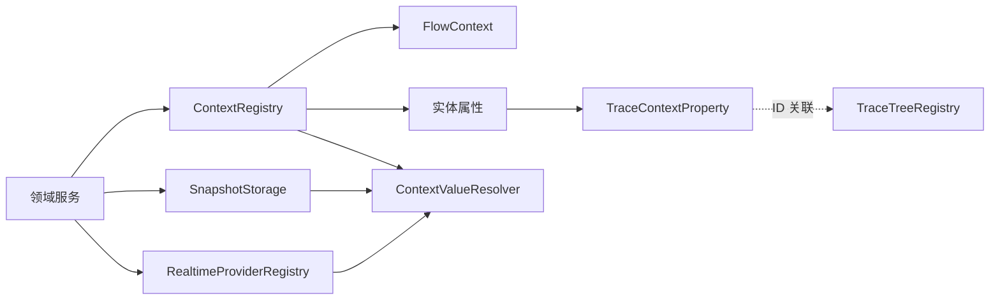
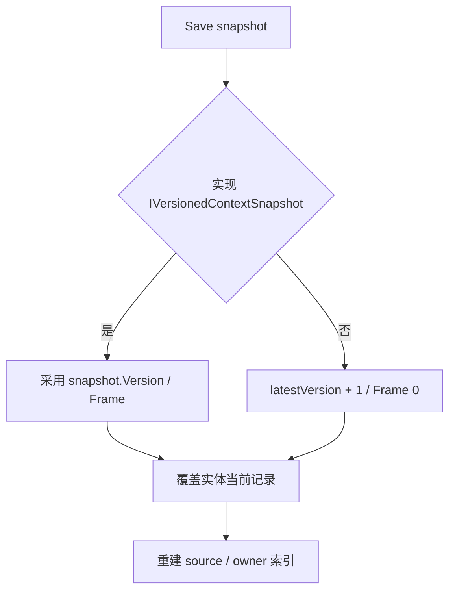
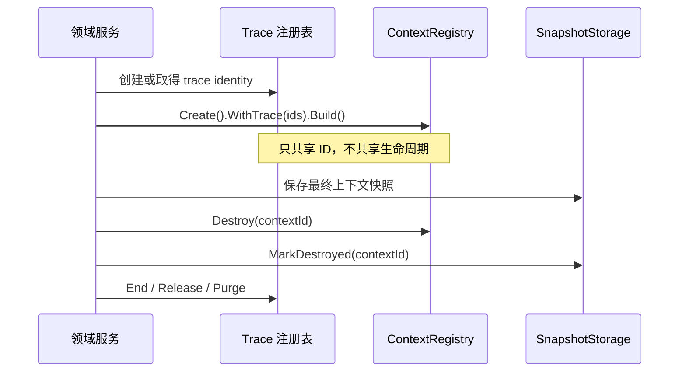

# Context Flow、Snapshot 与 Trace 桥接

> 文档类型：FrameworkCore canonical
> 事实基线：2026-08-16
> 文档版本：v3.0
>
## 一、文档定位

`com.abilitykit.context` 提供一组轻量运行时关联工具：用实体 ID 关联属性，用 Flow 记录一批实体所属的执行阶段，用 Snapshot 保留每个实体的最新状态，再通过统一读取器在实时数据和快照之间选择来源。

该包采用 ECS 风格的实体、属性和查询接口，但它不是完整 ECS World：没有 System 调度、结构变更队列、Chunk 存储、帧历史或自动资源回收。它更适合承载 Buff、技能阶段、触发输入和诊断上下文等跨模块关联数据。

本文中的通用 Context 包与 MOBA 的 `MobaCombatExecutionContext` 是不同层次。前者管理轻量实体、Flow、Snapshot 和值解析；后者是项目应用层的战斗执行读模型，负责 source/target/root/parent/owner、skill runtime handle、frame 等 provenance 的确定性传播。MOBA canonical provenance 的字段合并和冲突策略不属于 `com.abilitykit.context` 的公共契约。

Trace 桥接只把 Trace 标识附着到 Context 实体上。Trace 树的创建、结束、引用计数和清理仍由 `com.abilitykit.trace` 负责，详见 `03-TraceLifecycleAndExportProtocol.md`。

## 二、组成与职责

当前实现由五个相互独立的部分组成：

| 部分 | 核心类型 | 当前职责 | 不负责 |
|---|---|---|---|
| 实体注册 | `ContextRegistry` | 分配实体 ID，保存属性和反向索引，发布变更事件 | System 调度、持久化、自动快照 |
| 流程组织 | `FlowContext` | 记录父子 Flow、Owner、阶段和所属实体 | 状态迁移校验、级联销毁 |
| 最新快照 | `SnapshotStorage` | 每个实体保存一份当前快照，按 source/owner 查询 | 历史帧、增量日志、版本冲突处理 |
| 统一读取 | `ContextValueResolver` | 按模式读取实时 provider、实体属性或快照 | 缓存一致性、自动迁移、值域校验 |
| Trace 关联 | `TraceContextProperty` | 保存 root/context/kind 并支持反向查询 | Trace 节点生命周期、retain/release |



图中的虚线表示标识关联，不表示包之间存在自动生命周期调用。

## 三、ContextRegistry 的实体模型

### 3.1 实体与属性

实体是注册表内的 `long` ID。`Create()` 先建立实体并发布 `Created`，然后返回 `EntityBuilder`；后续 `With()` 逐项调用 `Add()`，因此观察者可能先看到尚未附着属性的实体。

每种属性类型在 `PropertyTypeRegistry.Instance` 中按首次注册顺序取得整数 ID。注册表以该 ID 保存属性并维护反向索引。这个 ID 适合当前进程内查询，不是稳定的网络或存档标识：

- 注册表是进程级单例，不属于某个 `ContextRegistry` 实例；
- ID 由首次访问顺序决定；
- 没有固定清单、显式编号或 Schema 版本；
- `PropertyTypeRegistry` 自身没有并发保护。

需要序列化属性类型时，应使用稳定名称或由领域层维护的显式协议 ID，不应直接持久化运行时 `TypeId`。

### 3.2 查询语义

`Query` 支持 `With<T>()`、`Without<T>()`、按实体 ID 的谓词，以及读取属性的类型化谓词。`Execute()` 最后调用 `ToList()`，返回的是本次执行结果快照，不会在调用方枚举期间继续追踪注册表变化。

查询过程会多次调用注册表并分别获取实体或属性索引快照。注册表每个调用受锁保护，但整条 Query 不是一个事务。如果其他线程在执行期间修改实体，候选集合与谓词读取可能来自不同时间点。当前更合适的约束是：在逻辑线程执行查询和结构变更，或由上层建立只读阶段。

### 3.3 事件与异常边界

事件包括实体创建、属性更新、销毁前、销毁后、Flow 创建和 Flow 阶段变化。`ContextRegistry` 在锁内复制订阅者列表，在锁外同步调用 handler，因此回调不会持有 registry 锁。

多个 handler 抛出的异常会汇总为 `AggregateException`。这一行为对销毁流程有两个不同影响：

1. `Destroying` 在删除实体前发布。该事件抛错会中断 `Destroy()`，实体仍然存在。
2. `Destroyed` 在删除实体后发布。该事件抛错时实体已经删除，但 `Destroy()` 仍以异常结束。

因此不能仅凭“调用抛错”判断实体是否仍存在。生产接入应让清理订阅者保持幂等，并在异常恢复时通过 `Exists()` 核对实际状态。需要强事务语义时，应由上层包装状态提交和事件投递；当前同步事件不是事务总线。

## 四、Flow 是组织记录，不是资源所有权

### 4.1 阶段与父子关系

Flow 阶段包括：

- `Created`
- `Running`
- `Completed`
- `Cancelled`
- `Failed`

`BeginFlow()` 创建 Flow，将其切换到 `Running`，并返回 `FlowContextScope`。Scope 可以创建归属该 Flow 的实体，也可以通过 `Complete()`、`Cancel()` 或 `Fail()`设置终态；未显式结束时，`Dispose()` 使用创建 Scope 时指定的终态。

子 Flow 记录 `ParentFlowId`，父 Flow 保存 child ID；Flow 还可记录 `OwnerEntityId`。这些字段用于关联和查询，不构成所有权协议。

### 4.2 终态不会清理资源

当前 `SetFlowPhase()` 只更新阶段和时间并发布事件，不会：

- 销毁 Flow 内实体；
- 结束或删除子 Flow；
- 删除 Flow 本身；
- 标记或移除 Snapshot；
- 结束关联 Trace；
- 注销实时 provider。

注册表也没有 Flow 删除 API。终态 Flow 会一直保存在 registry 中，直到 `Clear()`。长生命周期 World 若持续创建短 Flow，需要监控 `FlowCount`，并在框架补充清理策略前控制创建规模。

### 4.3 状态迁移没有约束矩阵

`SetFlowPhase()` 允许任意不同阶段之间切换，包括从 `Completed`、`Cancelled` 或 `Failed` 回到 `Running`。`FlowContextScope` 能防止同一个 Scope 重复结束，但无法阻止其他调用方直接修改阶段。

若业务要求严格状态机，应在领域服务中限制迁移，例如只允许：

```text
Created -> Running
Running -> Completed | Cancelled | Failed
```

这属于建议约束，不是当前包级保证。

## 五、SnapshotStorage 的数据边界

### 5.1 每个实体只有最新快照

`Save()` 以 `EntityId` 为键覆盖旧记录，并同步更新 source 和 owner 反向索引。它不是帧历史存储：旧版本对象不会保留，也不能按版本回读。

若快照实现 `IVersionedContextSnapshot`，storage 直接采用对象给出的 `Version` 和 `Frame`；否则由 storage 为该实体自动递增版本，帧固定为 `0`。



### 5.2 版本不是并发控制协议

对显式版本，`Save()` 不检查版本或帧是否单调。因此版本较旧的快照也能覆盖较新的记录。`Remove()` 会同时删除最新版本和帧；之后保存非版本快照会重新从版本 `1` 开始。

当前 `Version` 更接近记录元数据，而不是 compare-and-swap、乐观锁或回放序号。生产使用需要由领域层在保存前比较版本，或者为 storage 增加拒绝回退的明确策略。

### 5.3 Destroy 标记与删除不同

`MarkDestroyed(entityId)` 只在当前快照实现 `IDestroyableSnapshot` 时调用其 `MarkDestroyed()`；记录仍留在 storage，source/owner 索引也仍可查询到它。`Remove()` 才会删除记录和索引。

`ContextRegistry.Destroy()` 不会自动调用 `SnapshotStorage.MarkDestroyed()`。这使得“实时实体已经销毁，但最终快照仍可读取”成为可实现的模式，同时也要求业务明确维护两者顺序。

## 六、实时值与快照值的统一读取

### 6.1 四种读取模式

| 模式 | 顺序 |
|---|---|
| `RealtimeThenSnapshot` | 实时 provider / registry 属性，失败后读快照 |
| `RealtimeOnly` | 只读实时来源 |
| `SnapshotOnly` | 只读快照 |
| `SnapshotThenRealtime` | 先读快照，失败后读实时来源 |

实时来源内部还有固定顺序：先读 `ContextRealtimeProviderRegistry`，再读 `ContextRegistry` 中已保存的属性。每个 property type 只能注册一个实时 provider，后注册会覆盖前一个。

值读取需要属性或快照实现 `IContextValueProvider`，通过 `TryGetValue()` 区分“命中默认值”和“没有该 key”。读取整个属性对象时则使用 `GetProperty<TProperty>()`。

### 6.2 Result 与 TryGet 的缺失语义

`GetValue()` 在所有来源都未命中时返回：

```text
Found = true
Source = DefaultValue
Value = 调用方给定默认值
```

`TryGetValue()` 会额外排除 `DefaultValue` 来源，因此这时返回 `false`。调用方若使用 `GetValue()`，应同时检查 `Source`，不能只看 `Found` 判断数据是否来自 Context。

`GetProperty()` 的缺失结果不同：`Found = false`、`Source = None`。对象读取和值读取的默认语义并不完全对称。

### 6.3 ISnapshotAccessor 的兼容风险

Snapshot 读取顺序为：

1. `IContextValueProvider.TryGetValue()`；
2. `ISnapshotAccessor.GetValue()`；
3. key 为空时按对象类型返回快照自身。

`ISnapshotAccessor` 只有 `GetValue()`，不能表达 key 缺失。Resolver 调用它后无条件把结果视为 Snapshot 命中。因此一个未知 key 返回的 `default(T)` 也会阻止 `SnapshotThenRealtime` 继续回退到实时来源。

此外，`ISnapshotAccessor.IsRealtimeAvailable` 没有被 Resolver 用于选择来源。接口注释中的“优先实时值”需要由具体 accessor 自己实现，Resolver 不会依据该标志自动访问实时 provider。

新的业务快照应优先实现 `IContextValueProvider`。P0 修正方案是为 accessor 增加可表达 missing 的接口，或让 Resolver 只在明确命中时返回 Snapshot 来源。

## 七、Trace 桥接的准确边界

`TraceContextProperty` 保存三个整数：

| 字段 | 含义 |
|---|---|
| `RootTraceId` | Trace 根标识 |
| `TraceContextId` | 关联节点标识 |
| `TraceKind` | 领域定义的节点类型 |

`WithTrace()` 将该属性附着到 Context 实体。扩展方法可以按 root、context 或 kind 查询实体。桥接没有引用 Trace 包中的注册表类型，因此也不会验证这些 ID 是否存在。



Trace 节点何时结束、根何时 release、Context 实体何时销毁以及快照保留多久，均由领域服务分别决定。不要通过销毁 Context 推断 Trace 已结束，也不要通过 Trace purge 推断 Context 或快照已经清理。

## 八、MOBA 的领域接入

### 8.1 通用 Context 包的组合使用

`MobaRuntimeContextService` 是当前较完整的组合示例。它为 Buff 维护一个实时 provider，并在终止路径显式执行：

1. 从实时 Buff 创建最终 `MobaBuffContextSnapshot`；
2. 将快照保存到 `SnapshotStorage`；
3. 从实时 provider 解绑 context ID；
4. 销毁 `ContextRegistry` 中的实体；
5. 对快照调用 `MarkDestroyed()`；
6. 清空 BuffRuntime 上的 context ID 与版本。

这套顺序保证终止后实时读取失败，而快照仍可作为后备。它是 MOBA 领域服务的编排，不是 `com.abilitykit.context` 自动提供的生命周期。

MOBA 快照同时实现 `IContextValueProvider` 和 `ISnapshotAccessor`。Resolver 会优先使用前者，因此其未知 key 能正确返回 missing，不会触发 accessor 的无条件命中问题。其他只实现 `ISnapshotAccessor` 的业务快照仍受该风险影响。

### 8.2 战斗执行 Context 与 canonical provenance

MOBA Trigger/Effect 链没有直接复用 `ContextRegistry` 实体作为执行参数，而是使用不可变投影：

| 投影 | 职责 |
|---|---|
| `MobaCombatContextSource` | 表达一次执行来源，不携带领域服务所有权 |
| `MobaTriggerExecutionSnapshot` | 固化触发瞬间的来源、目标、Trace 与帧 |
| `MobaPersistentContextSourceSnapshot` | 跨帧 runtime 可持久保留的来源投影 |
| `MobaCombatExecutionContext` | Effect/Action 运行时统一只读上下文 |
| `MobaCanonicalProvenance` | 多种 provider 之间逐字段归一化 identity，并记录字段来源状态 |

canonical 字段包含 source/target actor、source/parent/root/owner context 和 skill runtime handle。每个字段记录 `Missing`、`Synthesized`、`Inherited` 或 `Explicit` 状态：缺失字段允许由后续正式来源补齐；双方非缺失且值不同则 fail-fast。Context kind、trigger、frame 等执行 metadata 也使用确定性合并并拒绝冲突，配置来源 ID 与当前执行配置 ID 因语义不同，不合并为同一 canonical 字段。

Effect 创建或挂接正式 `EffectExecution` 节点后，`MobaCombatExecutionContext.WithEffectExecutionNode()` 会把 `SourceContextId`、`ParentContextId` 和 root identity 推进到真实执行节点。后续 Action、Damage、Buff、Projectile 和 Summon 继承该投影，不再把 actor ID 伪装成 Trace ID，也不从 `OwnerContextId` 推导生命周期权限。

完整字段矩阵、冲突规则和 Action lifecycle 见 [MOBA Trace、Context 与 Effect 执行深潜](../09-ImplementationExamples/MOBA/09-TraceContextEffectDeepDive.md)。

## 九、线程与一致性

`ContextRegistry`、`SnapshotStorage` 和 `ContextRealtimeProviderRegistry` 分别使用自己的锁。provider 和事件 handler 都在持有内部锁之外执行，可降低回调重入造成的锁死风险。

这些锁不提供跨组件事务：

- 保存快照与销毁实体之间，其他线程可能看到两者都存在；
- 解绑 provider 与标记快照销毁之间，也可能存在短暂中间状态；
- Query 的候选集合和属性谓词读取可能跨越结构变化；
- `PropertyTypeRegistry` 没有锁，首次并发注册同一类型没有明确保证。

推荐在单逻辑线程完成一组 Context 生命周期操作。确需并发读取时，由领域服务定义可观察顺序，并使重复保存、解绑、销毁和标记操作幂等。

## 十、验证现状

`src/AbilityKit.Context.Tests` 已是独立 `.NET` 测试工程。2026-08-16 当次结果为 `5/5`：其中 3 项覆盖 Registry 观察者异常隔离、Clear 和 Destroy，2 项固定枚举默认值。该工程证明事件异常不会改变已提交的 create/destroy/clear 结果，但尚未形成 Snapshot/Resolver/Flow 的完整包级矩阵。

`src/AbilityKit.Demo.Moba.Tests/Context/MobaContextBridgeTests.cs` 另提供以下寄宿式证据：

- Flow 内创建实体并记录归属；
- `TraceContextProperty` 的附着和三种反向查询；
- `With`、`Without`、普通谓词和类型化属性谓词；
- Flow 创建和实体创建事件可被观察；
- 显式 `Execute(registry)` 使用执行时传入的注册表。

独立工程已经覆盖销毁事件异常，但仍没有覆盖 Snapshot、Resolver 和 Flow 终态，所以下述测试缺口仍成立。MOBA 项目层另有 `MobaCanonicalProvenanceTests` 14/14 和 ownership fixture 9/9 的 2026-08-15 聚焦结果，覆盖多来源 enrichment、identity/metadata 冲突、Effect execution node 推进以及 Buff/Projectile/Summon/Skill runtime 清理；这些是战斗执行 Context 的寄宿式 E3，不应表述为通用 Context 包专项覆盖。

### 10.1 P0 测试

| 测试 | 目标 |
|---|---|
| Flow 终态与实体存续 | 固化“只改阶段、不级联销毁”的当前契约 |
| Flow 终态事件与异常 | 明确阶段迁移观察者失败后的 Flow 实际状态和事件顺序 |
| 四种 `ContextValueReadMode` | 覆盖 provider、registry 属性、snapshot 和 default 来源 |
| accessor 未知 key | 暴露并修复 `SnapshotThenRealtime` 被默认值截断的问题 |
| 显式版本回退 | 明确选择允许覆盖还是拒绝旧版本 |

### 10.2 P1 测试

| 测试 | 目标 |
|---|---|
| Snapshot source/owner 重建 | 覆盖保存替换、Remove 和 Clear 的索引完整性 |
| MarkDestroyed | 验证只标记当前记录且不删除索引 |
| Flow 父子和 owner | 覆盖创建、阶段变化及终态查询 |
| 查询与结构变化 | 明确快照结果和并发修改边界 |
| MOBA 最终快照 | 验证解绑、销毁、标记后只从 Snapshot 读取 |

## 十一、生产接入清单

1. 为 Context ID 绑定 session 或 world 边界，不把实例内 ID 当作全局永久标识。
2. 不序列化运行时 `PropertyTypeId`；协议层使用稳定业务 ID。
3. 由领域服务显式编排 snapshot、provider、registry 和 Trace 生命周期。
4. 区分路由 identity 与 lifecycle ownership；owner/source/root ID 本身不代表持有或释放权限。
5. 跨 provider 传播正式 identity 时使用字段级状态和显式冲突策略，不依赖隐式优先级覆盖非零值。
6. 明确 Flow 终态后实体及子 Flow 的清理策略，并监控长期增长。
7. 对显式 Snapshot 版本执行单调性检查，决定重复版本是否允许覆盖。
8. 新快照优先实现 `IContextValueProvider`，调用 `GetValue()` 时检查 `Source`。
9. 事件订阅者保持短小、幂等；异常后依据 registry 实际状态恢复。
10. 把多组件生命周期操作放在同一逻辑线程，避免把独立锁误认为事务保证。

## 十二、当前边界

- Context Registry 是轻量关联索引，不是完整 ECS World。
- Flow 是阶段和归属记录，不是资源所有权或级联清理协议。
- SnapshotStorage 每实体只保存最新记录，不是历史帧仓库。
- 显式版本和帧由 storage 信任，当前没有冲突或回退门禁。
- Registry 销毁与 Snapshot、provider、Trace 没有自动联动。
- Trace bridge 只保存 ID，不验证 Trace 节点，也不管理其生命周期。
- MOBA combat execution context 与 canonical provenance 属于项目应用层，不是通用 Context 包内置能力。
- Resolver 的默认结果与 missing 结果不同；只看 `Found` 可能误判来源。
- 仅实现 `ISnapshotAccessor` 的快照无法可靠表达 key 缺失。
- 通用包已有最小 `5/5`，但 Snapshot、Resolver、Flow 和跨组件事务专项覆盖仍不足；MOBA 查询桥接、canonical provenance 和 ownership 测试只提供寄宿式证据。

---

*文档版本：v3.0 | 最后更新：2026-08-16 | 验证基线：Context 5/5；MOBA canonical provenance 14/14、ownership 9/9（后两者为 2026-08-15 artifact）*
