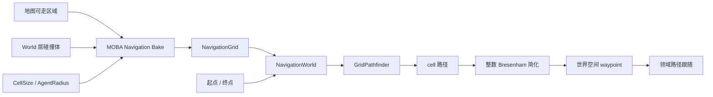
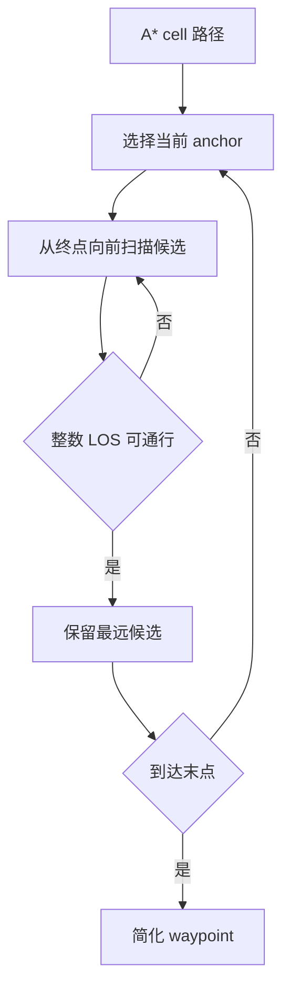

# 确定性网格导航

> **文档类型：Canonical 设计**
> **事实基线：2026-08-16**
> **适用范围：`com.abilitykit.combat.navigation` 的整数 cell 搜索；MOBA 烘焙、路径跟随和浮点运动是项目消费者。**

## 一、文档定位

`com.abilitykit.combat.navigation` 提供均匀方格导航数据、整数格 A*、路径简化和导航世界接口。实现不依赖 UnityEngine，核心搜索在整数 cell 空间完成，适合逻辑服、回放和需要稳定路径选择的战斗运行时。

这里的“确定性”有明确范围：给定相同 `NavigationGrid`、起终点映射结果和 `NavigationWorldOptions`，A* 的候选展开与 tie-break 可重复。它不自动保证不同机器独立烘焙出的网格一定相同，也不等于整个角色移动过程已经采用定点数学。

## 二、能力分层

| 层 | 核心类型 | 职责 |
|---|---|---|
| 数据 | `NavigationGrid` | 网格原点、格距、宽高和 blocked 位图 |
| 搜索 | `GridPathfinder` | 整数代价 A*、目标投影、路径重建和 LOS 简化 |
| 接口 | `INavigationWorld` | 寻路、可行走查询和位置投影 |
| 组装 | `NavigationWorld` | 绑定一份只读网格、一组查询选项和 pathfinder |
| 服务 | `INavigationService` | 通过 World DI 暴露当前导航世界 |
| 领域烘焙 | `MobaNavigationBake` | 从 MOBA 地图和碰撞世界生成 blocked 位图 |
| 领域跟随 | `MobaPathFollowingSystem` | 周期重寻路并把 waypoint 转换为运动源 |



## 三、网格数据契约

### 3.1 坐标与存储

`NavigationGrid` 使用 XZ 平面：

- `Origin` 是 cell `(0, 0)` 的最小 X/Z 角；
- `CellSize` 是统一格距；
- 行主序索引为 `cz * Width + cx`；
- cell 中心的 Y 固定取 `Origin.Y`；
- blocked 数据是长度严格等于 `Width * Height` 的 `bool[]`。

构造函数会拒绝非正格距、非正宽高以及长度错误的 blocked 数组。数组引用不会复制，虽然类注释称烘焙后只读，但调用方若继续持有原数组，仍能修改网格内容。生产侧应在构造后放弃写引用，或者在未来实现中复制或只读封装位图。

### 3.2 世界坐标映射

世界坐标通过以下公式映射到 cell：

```text
cx = floor((world.X - Origin.X) / CellSize)
cz = floor((world.Z - Origin.Z) / CellSize)
```

`WorldToCell()` 可能返回越界坐标；`WorldToCellClamped()` 则将结果限制到网格边界。当前寻路、可行走查询和投影都使用 clamped 版本，因此网格外请求不会直接失败，而会被映射到边缘 cell。

这项行为适合“把输入约束到地图”的 Demo 策略，但公共契约需要谨慎：一个远离地图的目标也可能得到通向边缘的 `Found` 路径，而不是 `Partial` 或 `Failed`。若业务需要识别越界，应在调用前使用 `WorldToCell()` 和 `IsInBounds()`，或为接口增加显式投影状态。

## 四、A* 的确定性约束

### 4.1 整数代价

搜索阶段只使用整数：

| 移动 | 代价 |
|---|---:|
| 正交 | 10 |
| 对角 | 14 |

启发式使用 octile 距离：

```text
h = 10 * max(dx, dz) + 4 * min(dx, dz)
```

它与 10/14 移动代价一致，不需要平方根、三角函数或随机数。关闭对角移动时仍使用 octile 启发式，而不是 Manhattan 距离；该启发式会低估四邻接真实代价，因此仍可接受，但语义和效率应补专项验证。

### 4.2 固定邻接顺序

邻居按固定顺序展开：

```text
东、北、西、南、东北、西北、西南、东南
```

允许对角移动时，两个相邻正交 cell 都必须可走，避免从 blocked 角之间穿过。相同代价的候选因此不会依赖哈希集合迭代顺序。

### 4.3 Open heap 的 tie-break

Open 集使用自维护二叉堆，排序键为：

```text
(f 升序, 插入序升序)
```

当两个节点的 `f = g + h` 相同，先插入的节点优先。插入顺序又来自固定邻接顺序，因此对称地图上也能稳定选择同一侧路径。

同一 cell 发现更小的 g 时会再次入堆，旧条目不会主动删除；弹出后以 closed stamp 跳过重复项。只接受 `tentativeG < oldG`，相同 g 不会改写 parent，这也固定了等价路径的首选父节点。

### 4.4 查询状态复用

`GridPathfinder` 为 g-cost 和 closed 集使用 search stamp，避免每次清空整张数组。网格 cell 数变化时才重建这些数组。

pathfinder 同时持有 heap、parent、g-cost、stamp 和临时路径缓冲的可变状态，单个实例不支持并发查询或重入调用。`NavigationWorld` 将其作为内部长期对象复用时，应由同一战斗执行线程顺序调用。

`_search` 溢出时被改回 `1`，但 stamp 数组不会同步清零。经过约 21 亿次查询后，旧搜索留下的 stamp `1` 可能被误认为本次状态。该边界在常规会话中很远，但严格长期服务应在回绕时清空 stamp 数组。

## 五、起点、目标与返回状态

### 5.1 起点可以 blocked

实现允许起点位于 blocked cell，目的是让已经与障碍重叠的对象仍有机会走出。起点会直接进入 Open 集；后续邻居仍按正常 blocked 和切角规则检查。

该策略不保证任意 blocked 起点都能离开。例如对角出口仍受两侧正交 blocked 检查限制。业务应区分“容忍轻微重叠”和“从完全封闭障碍内部脱困”。

### 5.2 blocked 目标投影

目标 cell blocked 时，pathfinder 按 Chebyshev 半径逐圈扫描；每一圈内部按 `dz` 从小到大、再按 `dx` 从小到大返回第一个 free cell。该选择是稳定的，但它是“固定扫描顺序下最近”，不是按世界欧氏距离或可达路径代价选择最佳候选。

找到替代 cell 后返回 `Partial`；全图没有 free cell 时返回 `Failed`。替代点可能与起点之间不可达，此时 A* 仍返回 `Failed`，不会继续寻找第二个可达的 free 候选。

### 5.3 MaxIterations

`MaxIterations` 限制 while 循环弹堆次数。达到限制且尚未到达目标时直接返回 `Failed`，不会返回朝目标推进的最佳部分路径，也没有暴露“限耗终止”和“拓扑不可达”的区别。

调用方若需要诊断或降级，应记录查询规模和迭代上限。建议未来将失败原因扩展为独立枚举，并返回实际展开数。

### 5.4 状态矩阵

| 条件 | 状态 | 末点 |
|---|---|---|
| 原目标 cell 可走且可达 | `Found` | 精确 `targetWorld` |
| 原目标 blocked，首个投影 cell 可达 | `Partial` | 投影 cell 中心 |
| 投影失败、目标不可达或迭代耗尽 | `Failed` | 无 waypoint |
| 目标在网格外但边缘 cell 可走且可达 | `Found` | 精确的网格外 `targetWorld` |

最后一行是 clamped 映射与 Found 末点替换共同造成的现有行为。路径的倒数第二段可能从边缘 cell 指向网格外精确目标，绕过 blocked 网格判断。生产接入应在寻路前明确拒绝或投影越界目标。

## 六、路径重建与简化

A* 到达目标后按 parent 链回溯，并转换为 cell 中心点。`Found` 状态会把最后一个中心点替换成调用方传入的精确目标；`Partial` 保持投影 cell 中心。

启用 `SimplifyPath` 时，算法从当前 anchor 开始，逆序寻找最远的可直达路径 cell。直线判断使用整数 Bresenham 变体，并检查中间 blocked cell 和对角切角。这个过程同样不使用浮点几何判定。



当前 LOS 只判断 cell blocked，不考虑 agent 的连续半径、坡度、高度差或动态对象。安全距离必须已经编码进 blocked 位图。

## 七、Agent 半径的实际语义

公共接口的 `FindPath(..., agentRadius, ...)`、`IsWalkable(..., radius)` 和 `TryProjectToWalkable(..., radius)` 都接收半径，但 `NavigationWorld` 当前没有使用这些调用参数。

MOBA 接入只在烘焙时使用 `NavigationWorldOptions.AgentRadius`：对每个 cell 中心执行一个半径为全局 AgentRadius 的 World 层球体重叠查询，并将有重叠的 cell 标为 blocked。因此现状是：

- 一张网格只对应一个烘焙半径；
- 所有查询共享该安全间距；
- 调用时传入不同半径不会改变路径、可行走结果或投影；
- 不支持同一网格上大小不同的角色；
- `NavigationWorldOptions.AgentRadius` 的注释提到终点投影，但通用 world 的投影没有按半径额外计算。

在支持多尺寸 Agent 前，接口参数应视为尚未兑现的扩展位。可选演进方案是按半径档位烘焙多张网格，或保存障碍距离场并在查询时按半径判断。

## 八、MOBA 烘焙与运行接入

### 8.1 网格烘焙

`MobaNavigationBake` 从地图 Bounds 计算 origin、width 和 height，再按固定 `cz/cx` 顺序采样 cell 中心。cell 同时满足以下条件才可走：

1. 中心点位于至少一个 `WalkableArea` 的轴对齐矩形内；
2. 以中心点和全局 AgentRadius 查询时，没有 World 层碰撞体重叠。

这是一种中心采样网格，不保证整个 cell 面积都位于可走区域。边界精度取决于 CellSize、AgentRadius 和碰撞查询实现。

烘焙包含浮点 Bounds、Ceiling、中心点计算和 `OverlapSphere`。固定采样顺序能稳定 blocked 数组写入顺序，但跨平台确定性还取决于地图浮点数据和碰撞世界是否给出一致结果。当前没有网格 hash 或跨运行时 golden fixture 证明独立烘焙位图一致。

### 8.2 路径跟随

`MobaPathFollowingSystem` 按目标变化阈值或固定帧间隔重新寻路，取得 waypoint 后创建 `PathFollowerMotionSource`。这一层使用浮点距离、速度和运动管线，不属于整数 A* 的确定性保证。

系统在没有导航世界时回退到 Brain 输出的直线移动；寻路失败时清空路径源。它接受 `Partial`，因为判断条件是 `path.HasPath`，没有按状态区分完整路径与投影路径。业务若需提示“目标不可精确到达”，应显式检查 `PathStatus`。

## 九、验证现状

`GridPathfinderTests` 当前覆盖：

- 绕过一面带缺口的墙；
- 完全隔断时返回 `Failed`；
- 同一 world 连续两次查询得到相同 waypoint；
- 无障碍直线路径简化为两个点；
- blocked cell 的可行走查询和投影。

现有“确定性”测试只验证同一进程、同一实例、连续两次调用，不覆盖不同实例、不同运行时、烘焙结果 hash 或大量对称路径。

本次聚焦运行中 `GridPathfinderTests` 为 5/5 通过。它们位于 MOBA 消费者测试工程，未发现导航专项 E5 gate；因此测试结果只能作为局部 E3，不能外推为跨平台确定性或完整公共包契约。

| 等级 | 当前证据 | 可得结论 |
|------|----------|----------|
| E0 | NavigationGrid、GridPathfinder、NavigationWorld 源码 | 可确认整数搜索、固定邻接、投影和失败语义 |
| E1 | MOBA Bake 与 PathFollowing 消费 | 证明公共导航原语可接入项目运动链 |
| E2 | MOBA 聚焦测试工程成功编译执行 | 当前消费者组合可编译 |
| E3 | `GridPathfinderTests` 5/5 通过 | 只覆盖基本路径、失败、简化和同实例复现 |
| E4 | 无网格 golden artifact 或跨平台运行记录 | 不证明独立烘焙和运动链一致 |
| E5 | 未发现导航专项持续门禁 | 不把相邻 workflow 或碰撞 gate 外推为导航 gate |

### 9.1 P0 测试

| 测试 | 目的 |
|---|---|
| 对称地图 tie-break golden path | 固化固定邻接顺序和 heap 插入序契约 |
| blocked goal 的投影顺序与 `Partial` | 固化逐圈扫描选择 |
| 越界起终点 | 暴露 clamped 与精确末点组合行为 |
| `MaxIterations` 耗尽 | 区分限耗失败与拓扑失败的当前缺口 |
| query radius 不同但结果相同 | 固化并公开当前半径参数未生效的事实 |
| 对角切角和 LOS 简化 | 确保搜索路径与简化路径使用一致安全规则 |

### 9.2 P1 测试

| 测试 | 目的 |
|---|---|
| 不同 `GridPathfinder` 实例 golden path | 排除实例状态影响 |
| `AllowDiagonal=false` | 验证路径最优性和启发式行为 |
| search stamp 回绕 | 修复后验证数组清零 |
| MOBA 烘焙 blocked 位图 hash | 固化地图、碰撞体和配置输入的产物 |
| 多平台烘焙 fixture | 检查浮点边界和碰撞查询一致性 |
| blocked 起点脱困 | 明确允许重叠起步的范围 |

## 十、生产接入清单

1. 将 `NavigationGrid` 作为版本化战斗输入；同步或回放时记录网格版本及内容 hash。
2. 在进入导航 world 前处理越界起终点，不依赖 clamped 隐式改变请求。
3. 一张网格只服务与烘焙 AgentRadius 匹配的角色尺寸。
4. 明确是否接受 `Partial`；路径跟随、施法和交互逻辑不要只判断 `HasPath`。
5. 根据地图规模设置 `MaxIterations`，并记录限耗失败指标。
6. 动态障碍不应直接修改共享 blocked 数组；需要重烘焙、局部更新或独立避障层。
7. 将 A* 路径选择确定性与浮点运动确定性分开验收。
8. 对生产地图保存 blocked 位图 golden hash，避免碰撞配置变化静默改变路径。

## 十一、当前边界

- 核心 A* 在整数 cell 空间确定排序，但 world-to-cell 和烘焙仍使用浮点。
- 查询半径参数当前未生效；安全距离来自网格烘焙时的单一 AgentRadius。
- 网格外坐标会 clamp，Found 路径还会恢复精确网格外目标。
- blocked 目标只尝试固定扫描顺序中的第一个 free cell，不寻找最近可达候选。
- `MaxIterations` 耗尽与真正不可达都返回 `Failed`。
- blocked 位图由调用方数组直接持有，没有不可变复制。
- 每次成功寻路会为 cell 路径、waypoint 和可选简化结果创建数组；当前没有无分配查询承诺。
- `GridPathfinder` 复用可变搜索状态，不可重入且不保证线程安全；`_search` 回绕时也未清空旧 stamp。
- 没有动态障碍更新、多半径网格、地形代价、坡度、高度层或 NavMesh 多边形能力。
- MOBA 路径跟随和运动仍使用浮点，不属于整数 A* 的确定性范围。
- 当前测试证明基本行为和单实例复现，尚未形成跨平台确定性证据。

---

*文档版本：v3.0 | 最后更新：2026-08-16*
