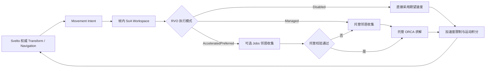
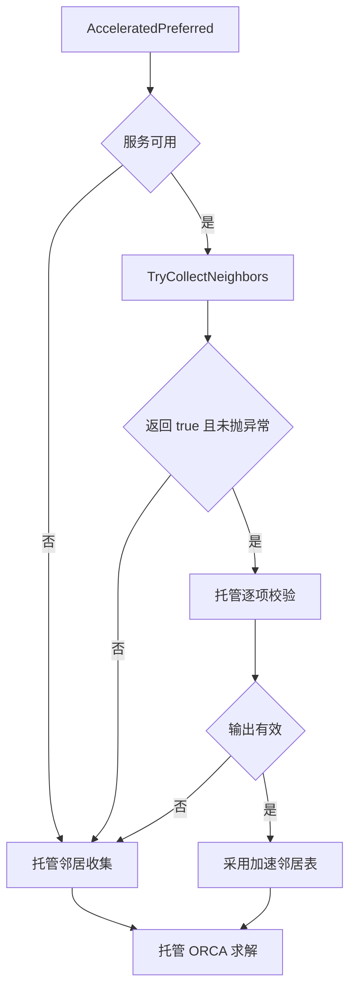

# Shooter RVO 与 Jobs 邻居加速

> **文档类型：Canonical 设计**
> **事实基线：2026-08-16**
> **适用范围：Shooter 项目应用层的局部避障与可选 Unity Jobs 后端；不是公共 Navigation 包能力。**

## 一、文档定位

Shooter Demo 使用 Svelto ECS 保存敌人的权威位置和导航速度，以托管 RVO 求解器完成局部避障，并允许 Unity Jobs/Burst 后端替换邻居收集阶段。当前实现不是一套通用导航包，也不是把完整 ORCA 求解迁移到 Job；它是 Shooter 领域运行时中的局部避障链路。

旧实施计划曾把 Jobs/Burst 列为后续优化方向。当前仓库已经包含 `com.abilitykit.demo.shooter.jobs`，因此本文以现有源码和测试为准，不再把 Jobs 后端描述为未实现能力。

| 层次 | 本文结论 |
|------|----------|
| 当前实现 | Shooter 以 Managed RVO 定义语义，Jobs 仅替换邻居收集；失败或无效输出在同帧回退 Managed |
| 规范目标 | 加速后端不改变排序与战斗结果，资源随 World 释放，回退可观测，并由性能预算决定启用阈值 |
| 示例策略 | 这套 group、workspace、敌人目标选择和同步字段服务 Shooter；其他游戏应复用设计原则或抽取稳定原语，而不是直接采用整套应用运行时 |

## 二、运行时分层

| 层 | 核心类型 | 职责 |
|---|---|---|
| 权威状态 | `ShooterSveltoTransformComponent`、`ShooterSveltoNavigationComponent` | 保存位置、朝向、当前速度、半径和最大速度 |
| 帧内工作区 | `ShooterRvoWorldWorkspace` | 复用 SoA 数组、空间索引、邻居表和线性规划缓存 |
| 邻居契约 | `IShooterRvoNeighborAccelerationService` | 可选地填充稳定排序的邻居索引与距离 |
| 托管基线 | `ShooterManagedRvoSolver` | 邻居校验、托管收集、ORCA 约束和速度求解 |
| Jobs 后端 | `ShooterUnityJobsRvoNeighborAccelerationService` | 用 Unity Jobs/Burst 构建空间哈希并并行收集邻居 |
| 领域系统 | Intent / RvoSolve / Integration 三个 BattleSystem | 装填输入、求解、限制加速度并写回 Svelto |
| 同步证据 | StateHasher / PackedSnapshot Exporter / Importer | 将敌人导航速度纳入状态核验和 Packed Snapshot 恢复 |



## 三、帧内数据流

### 3.1 Intent 阶段

`ShooterEnemyMovementIntentBattleSystem` 只收集存活敌人。系统先把 EntityId 和原 Svelto 索引写入 workspace，再按 EntityId 排序。后续位置、当前速度、半径、最大速度和期望速度都按这个稳定顺序装填。

稳定排序有两个作用：

- RVO 求解不依赖 Svelto 当前存储顺序；
- 完全重叠、等距离邻居等退化场景可以使用 EntityId 做稳定 tie-break。

敌人期望速度指向最近存活玩家，进入停止距离后为零。该阶段包含浮点距离和平方根运算。

### 3.2 Solve 阶段

`ShooterRvoExecutionMode` 有三种模式：

| 模式 | 邻居收集 | RVO 求解 | 加速度限制 |
|---|---|---|---|
| `Disabled` | 不执行 | 不执行，直接输出期望速度 | 不执行 |
| `Managed` | 托管空间网格 | 托管 ORCA | 执行 |
| `AcceleratedPreferred` | 优先调用加速服务，失败后托管回退 | 托管 ORCA | 执行 |

默认配置是 `AcceleratedPreferred`，但 `ShooterWorldModule` 默认注册不可用的空服务。因此没有附加 Jobs module 时，默认行为仍是托管邻居收集，不会因缺少 Unity Jobs 依赖而失效。

### 3.3 Integration 阶段

求解结果不会直接写入位置。`ShooterEnemyMovementIntegrationBattleSystem` 先按 `MaxAcceleration * deltaTime` 限制当前速度到目标速度的变化量，再写回 Navigation，更新朝向并积分位置，最后应用圆形竞技场边界。

Svelto 组件是跨帧权威状态，workspace 只是单帧派生缓存。不能把 workspace 当作快照、回滚状态或跨 World 共享对象。

## 四、托管邻居收集与稳定顺序

托管实现以 `NeighborDistance` 作为空间网格 cell size，将 Agent 映射到 cell 后按固定 3x3 邻域扫描候选。每个 Agent 最多保留 `MaxNeighbors` 个邻居，排序键为：

```text
(distanceSquared 升序, EntityId 升序)
```

内部数据允许在 EntityId 相同的异常输入下继续按 Agent 索引区分。正常 Shooter 实体身份应唯一，因此 EntityId 是主要 tie-break。

workspace 使用托管数组并按 2 倍容量增长。容量足够时每帧复用数组，只清理当前 Count 范围内的输出和计数。修改 `MaxNeighbors` 可能触发邻居表、约束线和投影线数组扩容；稳定态零分配只能在容量预热且实体数、MaxNeighbors 不继续增长时讨论。

## 五、ORCA 求解语义

`ShooterManagedRvoSolver` 根据邻居位置、当前速度和双方半径构建速度障碍约束，再通过线性规划选择接近期望速度且不超过 MaxSpeed 的结果。

实现包含几个明确的退化规则：

- 完全重叠或归一化向量过小时，按 EntityId 大小选择正 X 或负 X，避免两个 Agent 得到相同逃逸方向；
- 已经重叠时使用当前 `deltaTime` 的倒数计算紧急修正；
- 未重叠时使用 `TimeHorizon` 预测碰撞；
- 求解结果出现 NaN 或 Infinity 时，回退到限速后的期望速度；
- RVO 结果之后仍受最大加速度约束，不保证一帧内立即达到无碰撞速度。

这是一套基于浮点数和 `MathF.Sqrt` 的实现。稳定 EntityId 顺序能消除集合遍历和等价候选造成的不稳定，但不能单独证明不同 CPU、Burst 版本或运行时之间逐位一致。

## 六、加速服务契约

`ShooterRvoNeighborBatch` 把输入和输出都暴露为托管数组：

- 输入：Count、MaxNeighbors、NeighborDistance、EntityIds、PositionX、PositionY；
- 输出：NeighborCounts、NeighborIndices、NeighborDistanceSquared。

加速服务只负责邻居收集，不读取速度、半径或期望速度，也不执行 ORCA 线性规划和位置积分。

返回 `true` 不等于结果会被直接信任。托管求解器会逐 Agent 校验：

1. 邻居数量位于 `[0, MaxNeighbors]`；
2. 索引有效、不是自身且不重复；
3. 距离是有限非负值且不超过查询范围；
4. 距离与当前坐标重新计算的平方距离完全相等；
5. 结果按距离、EntityId 和必要时的索引稳定排序。

服务不可用、返回 `false`、抛出异常或输出校验失败时，本帧都会重新执行托管邻居收集。异常不会传播到战斗 Tick。该回退保证功能连续性，也意味着加速故障目前没有通过返回值暴露给上层；生产监控需要额外的命中、拒绝、异常和校验失败指标。



## 七、Unity Jobs/Burst 后端

### 7.1 接入方式

`ShooterUnityJobsWorldModule` 依赖 `ShooterWorldModule`，并用 singleton Jobs 服务覆盖默认空实现。服务默认只在 Agent 数量达到 64 时接管；较小群体返回 `false`，由托管路径处理。这个阈值是调度和拷贝成本的策略参数，不属于 RVO 语义。

### 7.2 执行过程

Jobs 服务每次调用依次完成：

1. 校验数组长度、有限坐标、距离派生值和 cell 坐标范围；
2. 扩容并复用 Persistent NativeArray 与 NativeParallelMultiHashMap；
3. 从托管数组复制 EntityId 和位置；
4. 并行构建空间 MultiHashMap；
5. 并行为每个 Agent 扫描固定 3x3 cell；
6. 在每个 Agent 自己的输出区间内按稳定键插入 Top-N；
7. 当前线程 `Complete()`；
8. 将计数、索引和距离复制回托管数组。

两个 Job 使用 Burst Strict FloatMode 和 Standard FloatPrecision。空间哈希的同 cell 枚举顺序不稳定，但每个 Agent 在本地有序插入候选，最终输出不依赖 MultiHashMap 枚举顺序。

Jobs 目前是同步加速：调用方在同一 Tick 内等待 Job 完成，然后继续托管 ORCA 求解。它没有与其他系统重叠执行，也没有把整个求解链路留在 Native 内存中，因此性能收益需要覆盖两次托管/Native 拷贝和调度成本。

### 7.3 资源生命周期

Native 缓冲使用 `Allocator.Persistent`，按 2 的幂增长并跨帧复用。服务实现 `IDisposable`，Dispose 后 `IsAvailable=false`，后续请求会回退托管路径。

当前专项测试验证显式 Dispose 后不可用，但没有测试 World module 创建的 singleton 是否随 World/Container 销毁而释放。生产接入必须确认 DI 容器会 Dispose singleton；否则 Persistent Native 容器会泄漏。还应覆盖 World 重建、异常期间完成 pending Job 以及重复 Dispose。

## 八、状态哈希与同步边界

敌人的 Navigation Velocity 是权威状态的一部分：

- `ShooterStateHasher` 按 EntityId 排序后，将量化的位置、朝向和 Navigation Velocity 纳入 hash；
- Packed Snapshot 的敌人 Transform chunk 保存 Navigation Velocity；
- Packed Snapshot Importer 恢复该速度；
- 现有 round-trip 测试验证速度恢复、旧 payload 缺失速度时归零，以及恢复后的状态 hash 一致。

因此 RVO 速度不能只作为表现缓存。遗漏它会改变下一帧相对速度、加速度限制和避障结果。

Pure State Snapshot 当前代码明确量化投射物速度，但没有与 Packed Snapshot 同等清晰的敌人 Navigation Velocity round-trip 证据。使用 Pure State 同步承载权威 Shooter 战斗前，应把敌人速度的协议字段、兼容默认值和恢复测试单独验收。

## 九、验证现状

本次使用 `FullyQualifiedName~Rvo` 运行 Shooter Runtime 聚焦测试，结果为 12/12 通过。其测试资产覆盖：

- Managed 模式能把完全重叠的敌人分开；
- Disabled 模式保留直接追踪行为；
- 两个独立 Managed World 在同输入下得到相同位置、速度和状态 hash；
- AcceleratedPreferred 在服务成功、拒绝、异常、不可用及多种伪造输出下都与 Managed hash 一致；
- Managed 模式从不调用已注册的加速服务。

Unity Editor Jobs 包存在 3 项直接测试，源码覆盖：

- 跨正负 cell 边界时与全量参考收集一致；
- buffer 扩容和跨帧复用不会保留旧结果；
- NaN、派生值溢出和 cell 坐标越界会被拒绝；
- Dispose 后服务不可用。

这 3 项 Unity Editor 测试本轮未运行，也未发现对应 workflow gate 接线，因此只能记录为测试资产存在，不能写成本次已通过或持续门禁证据。

这些测试证明同一运行环境中的行为一致性和回退协议。它们没有提供 2,048 Agent RVO 帧耗、稳态分配、Managed/Jobs 性能交叉点、跨平台 hash 或不同 Burst 配置下的一致性证据。仓库中的 2,048 实体表现/同步测试不能替代 RVO 性能验收。

### 9.1 E0-E5 证据

| 等级 | 当前证据 | 可得结论 |
|------|----------|----------|
| E0 | Shooter Managed solver、workspace、acceleration contract 与 Jobs service 源码 | 可确认语义分层、同步等待和回退路径 |
| E1 | Shooter Intent/Solve/Integration、snapshot/hash 消费 | 证明领域链路实际接入，不能外推为公共导航能力 |
| E2 | Shooter Runtime 测试工程成功构建 | 当前纯 .NET RVO 组合可编译；Unity Jobs 另属 Editor 环境 |
| E3 | Runtime RVO 聚焦测试 12/12 通过 | 验证 Managed、Disabled、确定性和伪造加速输出回退 |
| E3 资产 | Unity Jobs Editor 3 项测试存在但本轮未运行 | 不能声明 Jobs 后端当前测试通过 |
| E4 | 无 64/128/512/2048 Agent 正式性能 artifact | 不证明默认 64 阈值或帧预算合理 |
| E5 | `shooter-fast` workflow 与夜间 `regression` 编排完整 Shooter Runtime Tests | Runtime 契约有持续接线；Jobs Editor 3 项未发现同等 gate |

### 9.2 P0 测试

| 测试 | 目的 |
|---|---|
| Jobs module 的 World 集成测试 | 证明 module 覆盖空服务并实际进入加速路径 |
| World 销毁释放 Native 容器 | 闭合 Persistent 分配生命周期 |
| 64 阈值两侧的 Managed/Jobs hash | 固化后端切换不改变战斗结果 |
| 等距离、完全重叠和 Top-N 截断 fixture | 固化 `(distanceSquared, EntityId)` 顺序 |
| Packed Snapshot 连续恢复后多帧 hash | 证明 Navigation Velocity 恢复足以延续 RVO |
| Pure State 敌人速度 round-trip | 补齐该同步模式的权威状态协议 |

### 9.3 P1 测试与证据

| 测试或指标 | 目的 |
|---|---|
| 64/128/512/2048 Agent 帧耗曲线 | 确定 Jobs 实际收益区间和默认阈值 |
| 预热后每帧托管与 Native 分配 | 验证稳定态分配预算 |
| 高密度与稀疏分布基准 | 避免只在单一空间分布下调优 |
| Windows/macOS/Linux 或不同 CPU hash fixture | 界定浮点跨平台确定性 |
| 不同 Burst 版本与编译配置 fixture | 检查 Strict 模式之外的工具链影响 |
| 加速回退诊断指标测试 | 保证故障不会长期静默退回 Managed |
| 长时间创建和销毁 World | 检查 Native 泄漏及容器释放顺序 |

## 十、生产接入清单

1. 把 Managed 路径保留为语义基线和故障回退，不让 Jobs 后端定义另一套邻居排序。
2. 只有在目标平台基准证明收益后才调整 MinimumAgentCount。
3. 确认 World/Container 销毁会 Dispose Jobs singleton，并在生命周期测试中观察 Native 泄漏。
4. 对加速调用记录成功、不可用、拒绝、异常和输出无效次数。
5. 把 RVO 参数作为版本化战斗配置；AgentRadius、NeighborDistance、MaxNeighbors、TimeHorizon 和 MaxAcceleration 都会改变结果。
6. 固定 Tick deltaTime。重叠处理、期望速度和最大加速度都直接依赖 deltaTime。
7. 同步或回滚必须保存敌人 Navigation Velocity，不能只恢复位置和朝向。
8. 分别验收同平台可复现、跨平台一致性和网络协议恢复，不用单一 state hash 测试替代全部结论。
9. 以真实高密度场景测量 Jobs 调度、拷贝、邻居收集和托管 ORCA 各自耗时。
10. 扩展到静态障碍、不同 Agent 半径或完整导航前，先明确它们不在当前局部避障契约内。

## 十一、当前边界

- RVO 是 Shooter Demo 领域实现，不是 `com.abilitykit.combat.navigation` 的公共能力。
- Jobs/Burst 只加速邻居收集；ORCA 约束、线性规划、加速度限制和运动积分仍在托管主线程执行。
- 加速失败会静默回退，当前没有内建诊断计数或熔断策略。
- Jobs 服务同步等待完成，没有跨系统 Job 依赖链或异步流水线。
- Native 缓冲会复用和扩容，但 module singleton 的自动 Dispose 尚缺集成测试证据。
- 算法使用浮点和平方根；稳定顺序不等于跨平台逐位确定。
- 当前只处理动态 Agent 间避障，没有静态障碍约束、不同形状、优先级、单向通道或 NavMesh 边界。
- Agent 输入按 EntityId 排序，依赖 EntityId 在当前 World 中唯一。
- Packed Snapshot 已覆盖敌人 Navigation Velocity；Pure State 路径仍需专项协议证据。
- 现有测试没有证明 2,048 Agent RVO 的帧预算或稳态零分配目标。

---

*文档版本：v3.0 | 最后更新：2026-08-16*
