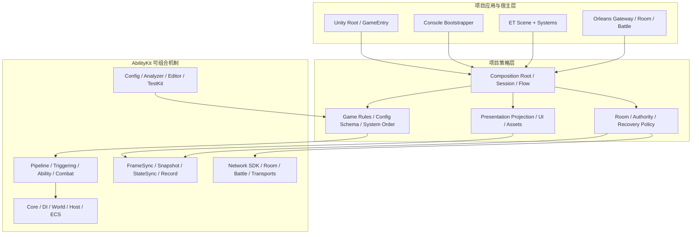
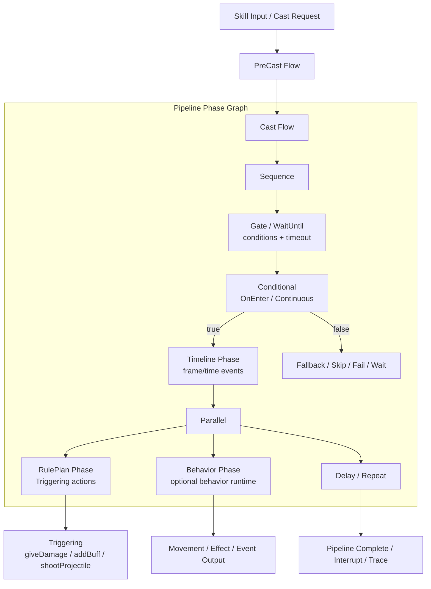
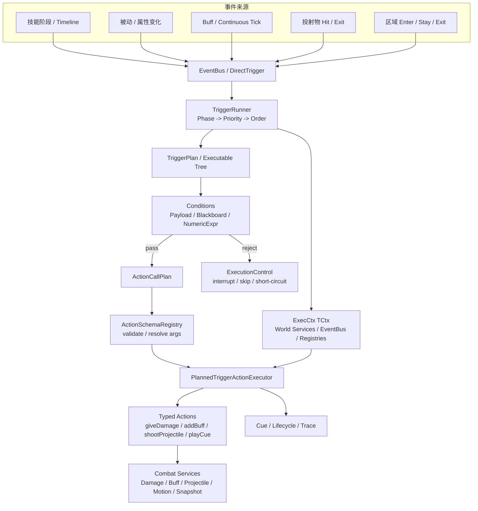
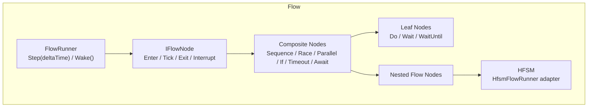
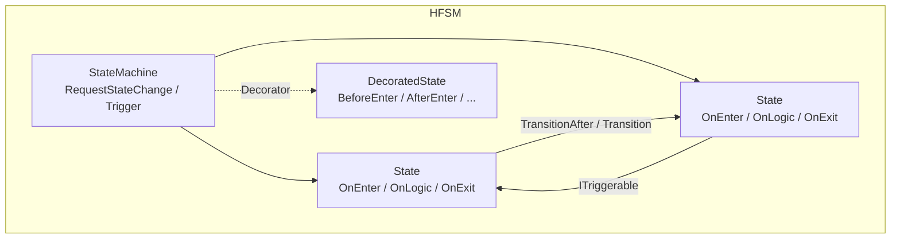
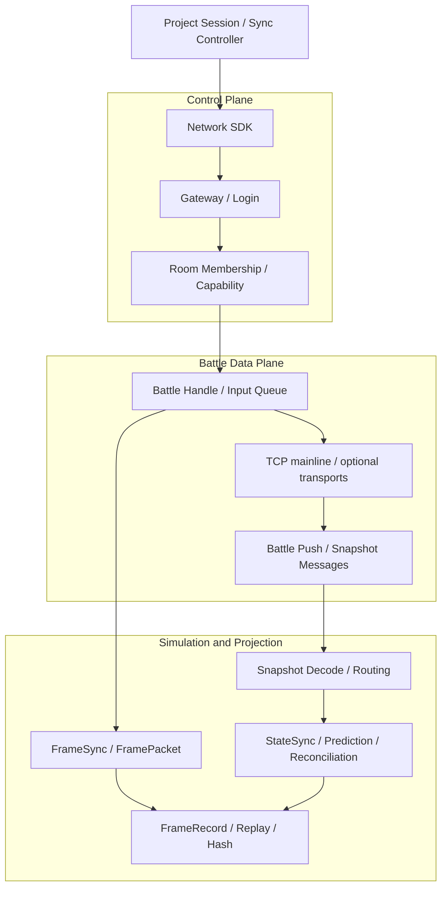

# Ability-Kit

> 可组合的游戏战斗工具集 | Pure C# Runtime | Logic-Presentation Separation | Unity + .NET

**Ability-Kit** 是一个面向复杂战斗项目的可组合工具集。它以 Unity UPM Package 组织源码，同时提供大量 .NET 工程用于脱离 Unity 的编译、测试、Console 宿主和 Orleans 服务端接入。项目关注的不是替项目预制一套固定 MOBA、ARPG 或 Shooter 应用层，而是提供技能编排、规则触发、战斗原子能力、逻辑世界、同步、回放、网络和表现解耦等可复用机制。

核心战斗模块尽量保持为纯 C# runtime；Unity 相关代码主要承担场景入口、资源与配置创作、表现投影和编辑器工具。游戏规则、房间流程、账号接入、技能配置规范、会话组合根和表现策略仍由具体项目决定。MOBA、Shooter、Console、ET 与 Orleans 代码用于展示这些机制如何落地，不是所有项目必须继承的统一应用套件。

Ability-Kit 目前处于**开发期**。这个仓库保存的是 AbilityKit 相关模块包、示例工程、工具链和第三方适配的**完整源码集合**，方便统一开发、编译验证、示例演示和设计文档维护。

真实项目使用时不需要，也不建议把仓库内所有包一次性整体引入。更推荐按项目需求选择组合：

- 只做技能/触发：组合 `core`、`pipeline`、`triggering`、`ability` 等包。
- 只做逻辑流程：组合 `flow`、`hfsm`、`timer`、`context` 等包。
- 做帧同步/状态同步：组合 `world.framesync`、`world.snapshot`、`world.statesync`、`record` 与所需的 `network.*` 包。
- 做 Unity 表现和编辑器工具：按需加入 `unity.pool`、`base.editor`、`demo.moba.editor` 等包。
- 参考完整落地方式：阅读 `demo.moba.*`、`demo.shooter.*` 及 Console/ET/Orleans 接入，但不要把示例策略误认为框架默认策略。

---

## 仓库定位

这个仓库是 AbilityKit 的完整工具集源码仓库，而不是单一产品包，也不是安装一个 Package 就能获得完整游戏规则的应用模板。

| 目录 | 定位 |
|------|------|
| `Unity/Packages/` | Unity UPM 包源码。各 `com.abilitykit.*` 包是主要模块边界。 |
| `src/` | .NET 解决方案和样例工程，复用 `Unity/Packages/` 中的源码，用于纯 C# 编译、控制台运行和示例验证。 |
| `Server/` | Orleans Host、Gateway、Room、Battle Grain、Smoke 与运维接入代码。 |
| `Docs/design/` | 当前跨模块设计的 canonical 入口，记录能力边界、源码落点、生命周期、限制和证据等级。 |
| `LubanConfig/` | 配置表与生成相关素材。 |
| `tools/` | 本地开发、验证、smoke test 辅助脚本。 |

`Unity/Packages/` 中包目录较多，是因为这里集中存放了工具集合的全部源码，包括一个较完整的 MOBA 最佳实践示例。后续给其他项目使用时，应按需获取和组合，而不是默认全量使用。

---

## 当前状态

- 项目仍在开发期，部分包的 API、目录结构和依赖声明还会继续收敛。
- 许多模块已经具备独立包边界，但 `package.json`、`asmdef`、示例工程和服务端工程之间仍有一些历史依赖需要持续整理。
- `demo.moba` 与 `demo.shooter` 是项目级参考实现，用来展示战斗表达、同步、网络、表现、配置和验收的不同组合方式。
- 当前源码、已被示例采用、自动测试通过、真实 Smoke 通过和进入发布门禁是不同成熟度；README 不用“存在实现”代替“生产就绪”。
- 第三方包位于 `com.abilitykit.thirdparty.*`，主要作为源码/依赖承载，不建议直接放入 AbilityKit 业务扩展。

---

## 核心特性


| 特性          | 说明                                        |
| ----------- | ----------------------------------------- |
| **逻辑与表现分离** | 纯 C# 逻辑层可在服务器、客户端、编辑器环境下运行，通过事件与表现层解耦     |
| **同步与恢复机制**  | 提供帧同步、快照、状态同步、预测校正、记录回放和恢复相关组件；项目仍需定义权威模型与确定性边界 |
| **数据驱动链路**    | Trigger Plan、Action Schema、Timeline 与项目配置工具可把规则落到强类型运行时；具体配置规范由项目拥有 |
| **高度可扩展**   | 模块化设计，支持 Hook/Feature/Blueprint 扩展机制，按需裁剪 |
| **性能基础设施**     | 提供索引、对象池、空间分桶、批处理和低分配 API；是否达到零分配与性能预算必须按具体链路验证 |

---

## 适用边界

Ability-Kit 更适合技能、Buff、投射物、被动、装备/天赋联动、多人同步和自动化验证会持续增长的中大型战斗项目；如果项目只是少量固定技能、单机轻量玩法或快速原型，直接使用简单的 `SkillManager` / `BuffManager` / MonoBehaviour 脚本通常更划算。

| 更适合 | 不建议优先使用 |
| ------ | -------------- |
| MOBA、ARPG、MMO、RTS、多人动作、带复杂技能的 Shooter | 技能数量少、生命周期短、同步要求低的小型项目 |
| 需要服务端/客户端复用纯 C# 战斗逻辑 | 所有逻辑都可以安全写在 Unity 场景脚本里的项目 |
| 需要长期维护大量配置化技能、Buff、触发器和投射物 | 以一次性硬编码交付为主、缺少配置和测试治理的项目 |
| 需要战斗日志、回放、自动化测试、预测回滚或状态同步 | 不需要解释战斗来源、也不需要网络同步的项目 |

---

## 框架价值

Ability-Kit 的目标不是替代所有项目中的 `SkillManager`、`BuffManager` 或 Unity 表现脚本，而是为**中大型战斗项目**提供一套可持续演进的底层拆分方案。当技能数量、Buff/被动/装备/天赋联动、投射物与区域效果、多人同步、战斗回放和自动化验证开始增长时，简单管理器式写法往往会因为互相调用、生命周期不清和调试困难而失控。

框架将战斗能力拆成几个稳定维度：

| 维度            | 解决的问题                                       | 代表模块                                     |
| ------------- | ------------------------------------------- | ---------------------------------------- |
| **输入与施法流程**   | Press/Hold/Release/Cancel、吟唱、引导、多阶段、取消与并行策略 | `pipeline`、`ability`、`demo.moba.runtime` |
| **事件触发与规则执行** | 主动、被动、命中、受击、Buff Tick、区域进入/离开等统一进入规则系统      | `triggering`、`ability`                   |
| **效果与战斗能力**   | 伤害、治疗、Buff、护盾、投射物、位移、召唤、目标选择等原子能力复用         | `combat.*`、`modifiers`、`gameplaytags`    |
| **运行实例与溯源**   | 追踪一次技能释放产生的子弹、区域、Buff、伤害来源和 Action 链路       | `trace`、`record`、`demo.moba.runtime`     |
| **同步与验证**     | 纯 C# 逻辑复用、客户端预测、回滚、快照、状态哈希、重连和验收矩阵          | `world.*`、`protocol.*`、`demo.shooter.*`  |

这种拆分的收益主要体现在长期维护：同一个 `giveDamage`、`addBuff`、`shootProjectile` 或 `playCue` 动作可以被主动技能、被动触发、投射物命中、区域效果和 Buff 周期事件复用；一次战斗结果也可以通过运行实例、来源上下文和 trace 链路反查到“哪个技能、哪个触发器、哪个 Action、哪个目标”。

### 端到端能力管线

Ability-Kit 的高价值点不只在于模块数量，而在于这些模块可以串成一条可调试、可验证、可同步的战斗能力管线：

```text
可读配置 / Trigger Plan
  -> 强类型 Action Schema
  -> ExecCtx / World Service 上下文解析
  -> 技能、投射物、召唤等参数 Modifier
  -> 技能 Runtime / Origin / Trace 血缘
  -> 投射物、区域、Buff、Continuous 生命周期
  -> 业务事件处理与 Snapshot 输出
  -> 纯 C# 验收、回放、同步或 Unity 表现消费
```

这意味着框架不是单独提供“一个技能触发器”或“一个投射物服务”，而是把内容生产、运行时执行、来源追踪和网络同步放在同一套边界里治理。典型例子包括：

| 能力                    | 价值                                                                 |
| --------------------- | ------------------------------------------------------------------ |
| **可读配置与反向导出**         | Trigger Plan 可以在运行时执行，也可以转换回更适合审查和维护的 Source 配置，降低配置黑盒化风险。         |
| **强类型 Action 执行**     | 配置化动作最终落到带参数 schema、服务解析、失败原因和日志的运行时代码，而不是散落的字符串脚本。                |
| **来源血缘追踪**            | 技能释放产生的投射物、区域、Buff 和后续伤害保留 root/parent/owner context，方便战斗归因、调试和回放。 |
| **运行时参数修正**           | Buff、装备、天赋或场景状态可以动态改变技能、投射物、召唤物参数，避免复制大量相似技能配置。                    |
| **Continuous 生命周期治理** | 持续效果不仅是 Tick 计时器，还能通过 Tag 规则控制激活、阻止、暂停、恢复、移除，并保留 explain 结果。       |
| **同步友好的事件模型**         | 投射物 spawn/hit/exit 等事件既能被业务系统消费，也能被 snapshot 服务读取，避免网络同步逻辑侵入模拟核心。  |

---

## 示例定位

仓库中的示例不是必选依赖，而是用来展示框架能力边界的参考工程：

| 示例/宿主 | 主要展示能力 | 应当复用什么 |
| --- | --- | --- |
| `demo.moba.*` | 技能输入、Pipeline、Trigger Plan、Buff/Continuous、投射物、区域、伤害、位移、召唤、寻路、碰撞、BT AI、表现 Cue、配置加载与 Entitas 集成 | 复用公共接口、战斗机制和分层思路；英雄规则、Blueprint、服务门面、System 顺序和配置 schema 属于 MOBA 项目策略 |
| `demo.shooter.*` | 权威插值、预测校正、快照投影、可靠事件、重连恢复、Svelto ECS、双连接网络链和多进程验收 | 复用同步、快照、网络与记录组件；Room flow、客户端 controller、表现 step order 和容量策略属于 Shooter 项目策略 |
| Unity Starter/Composition | 用统一的 launch request、Profile/Catalog 查询和 Gameplay Root 实例化入口启动 MOBA 或 Shooter | 公共层只解决“选择并启动哪个 Root”；scene、profile、root、session 和玩法流程继续由游戏 Package 或项目拥有 |
| MOBA Console | 在纯 .NET 进程中组合 World、Host、同步适配、输入、表现投影和回放 | 用于理解完整组合根与无 Unity 验证；它自己的 Local/Hybrid adapter 不是 coordinator 包的公共实现 |
| ET Demo | 把 ET Scene、Component/System、房间玩家和表现对象接到 MOBA runtime | 参考第三方宿主适配方法，不要求真实项目采用 ET 的对象模型 |
| Orleans Server/Smoke | Gateway、Room、Battle Host、协议路由、状态存储边界和多进程验收 | 参考服务端权威链和验收方法；源码或 workflow 入口存在不等于本次构建已经通过真实 Smoke |

这些示例刻意保留不同的应用组合方式。战斗应用层变化通常大于网络连接、序列化或基础容器，因此框架只稳定可复用机制和接入协议，不强行抽象一套所有游戏都要实现的 `BattleApplication`。

---

## 架构总览



### 三层责任边界

| 层次 | 稳定内容 | 不应由这一层决定 |
| --- | --- | --- |
| 框架机制层 | Phase/Trigger/Action 契约，World/Host 生命周期接口，ECS 适配，同步、快照、记录、网络和诊断基础设施 | 英雄规则、房间阶段、账号登录、UI 流程、具体配置表结构 |
| 项目应用层 | 组合根、会话、配置发布、权威模型、系统顺序、失败补偿、表现投影和资源所有权 | 把本项目策略包装成所有游戏必须使用的框架默认 |
| 示例宿主层 | MOBA、Shooter、Console、ET、Unity Starter 和 Orleans 的可运行或可审计参考 | 证明另一种宿主、同步模式或项目规则也已自动适用 |

这种边界是工具集的核心取舍：框架提供足够细且可以组合的积木，示例提供高接入度的完整对象图，但真实项目可以替换应用层而不需要 fork 基础机制。

### 多宿主装配

- Unity Starter 只统一启动请求、Profile/Catalog 查询和 Gameplay Root 实例化；MOBA/Shooter 的 scene、root、entry、session 与 teardown 仍由各自 Package 拥有。
- MOBA Console 由 `Program` 与 `ConsoleBattleBootstrapper` 直接构造完整对象图，不消费 Unity Profile/Catalog，也不依赖一个公共 `SessionCoordinator`。
- ET 由 ET Scene、Component/System 和 `ETBattleWorldFactory` 适配 MOBA runtime；Orleans 则由 Gateway、Room 和 Battle Host 组织服务端权威链。
- `com.abilitykit.coordinator` 当前是收缩后的契约包，只保留 `SessionConfig`、host/policy 接口、drive gate、DTO 与 codec。仓库当前没有历史文档中的 `SessionCoordinator`、Local/Remote/Hybrid adapter 或统一远端 transport 实现。

---

## 模块速览

### 核心基础设施


| 模块                          | 说明                                                          |
| --------------------------- | ----------------------------------------------------------- |
| `com.abilitykit.core`       | 数学库（Vec2/Vec3/Quat/Transform3）、对象池、日志、事件系统、序列化和通用工具 |
| `com.abilitykit.gameplaytags` | Gameplay Tag 状态标识系统，支持按标签组织 Buff、状态、规则和配置引用 |
| `com.abilitykit.modifiers`  | 通用参数/属性修正器，用于 Buff、装备、天赋或场景状态动态改写技能、投射物、召唤等参数 |
| `com.abilitykit.attributes` | 属性系统，支持 Buff/Debuff、自定义公式、脏标记优化                             |
| `com.abilitykit.trace`      | 溯源树运行时，用于追踪技能、效果、Action、投射物、Buff 等来源上下文和父子关系 |
| `com.abilitykit.diagnostics` | 开发期诊断与性能分析工具，支持 profiler、诊断窗口、导出和运行时观测 |


### 世界管理层


| 模块                                      | 说明                                                       |
| --------------------------------------- | -------------------------------------------------------- |
| `com.abilitykit.world.di`               | 依赖注入容器，支持 Singleton/Scoped/Transient 三种生命周期              |
| `com.abilitykit.world.ecs`              | 轻量级 ECS 框架：Entity、EntityWorld、ComponentTypeId            |
| `com.abilitykit.world.framesync`        | 帧同步：FrameSync、Rollback、ClientPrediction、输入历史             |
| `com.abilitykit.world.snapshot`         | 快照路由：按 opCode 解码并分发到处理器（与网络解耦）                           |
| `com.abilitykit.world.networkfragments` | 帧数据包：FramePacket、RemoteFrameBuffer、RemoteFrameAggregator |
| `com.abilitykit.world.statesync`        | 状态同步与客户端预测：Rollback、Per-Entity/ECSPrediction、StateHash   |
| `com.abilitykit.record`                 | 录像回放：Session、Container、Track，支持输入录制、状态哈希采样               |
| `com.abilitykit.deterministic`          | 定点时间与确定性基础类型；它帮助约束时间表达，但不自动保证整个战斗逐位确定 |
| `com.abilitykit.world.entitas` / `world.svelto` | 可选 ECS 适配层；不同 ECS 不是透明可互换后端，项目需要显式选择并装配 |


### 技能与战斗层


| 模块                               | 说明                                                                           |
| -------------------------------- | ---------------------------------------------------------------------------- |
| `com.abilitykit.pipeline`        | **技能流程编排**：Phase 图模型，支持 Sequence/Parallel/Conditional/Repeat/Delay/WaitUntil/Timeline、暂停/中断/Trace |
| `com.abilitykit.triggering`      | **事件触发与规则执行引擎**：EventBus、TriggerRunner、TriggerPlan、强类型 Action Schema、ExecCtx、黑板/表达式/执行控制 |
| `com.abilitykit.actionschema`    | Action/Timeline 数据结构与运行时辅助，用于把时序动作、技能事件和编辑器数据表达为稳定 DTO |
| `com.abilitykit.ability`         | 技能聚合运行时：Ability、Effect、Triggering、EffectSource、配置加载、热重载和编辑器工具 |
| `com.abilitykit.ability.explain` | 技能解释/调试框架：Forest、Tree + Navigation Protocol                                  |
| `com.abilitykit.continuous`      | 持续效果运行时：条件驱动的激活、阻止、暂停、恢复与移除；具体 Buff/玩法绑定由项目实现 |
| `com.abilitykit.behavior`        | 行为运行时与 Pipeline 行为阶段：可将行为决策/执行器嵌入技能流程，适合复杂 AI、引导、锁定和持续决策 |
| `com.abilitykit.combat.motion`   | 移动系统：MotionPipeline、来源组合(dash/jump/path)、碰撞求解(墙滑/穿墙/终点投影)、per-skill CollisionPolicy 透传 |
| `com.abilitykit.combat.navigation`  | 导航系统：NavigationGrid + 确定性 A\* 寻路(无定点数学)、GridPathfinder、INavigationWorld/INavigationService |
| `com.abilitykit.combat.collision.abstractions` | 碰撞：ICollisionWorld Naive/Grid 双实现 + OBB sweep 窄相 + GridBroadphase + LayerFilter |
| `com.abilitykit.combat.entitymanager` | 实体管理器：索引表实现高效查询 |
| `com.abilitykit.combat.skilllibrary`  | 技能库：索引表实现高效技能查询 |
| `com.abilitykit.combat.targeting`     | 目标查找：候选提供、筛选、评分、选择、流式处理和可池化的低分配执行路径 |
| `com.abilitykit.combat.projectile`    | 投射物系统：对象池、帧同步、命中策略、范围效果 |
| `com.abilitykit.combat.damage`        | 伤害系统：DamagePipeline、自定义伤害公式 |


### 运行时与流程层


| 模块                              | 说明                                                                                                 |
| ------------------------------- | -------------------------------------------------------------------------------------------------- |
| `com.abilitykit.host`           | 服务器端抽象：World 管理、客户端连接、消息广播                                                                         |
| `com.abilitykit.host.extension` | Host 扩展：Session（FramePacketNetAdapter）、FrameSync、Rollback、Hook、Feature、Blueprint                   |
| `com.abilitykit.coordinator`    | 会话配置、host/policy 契约、逻辑世界 drive gate、跨层 DTO 与 codec；当前不包含统一 Session 实现或 Sync Adapter |
| `com.abilitykit.flow`           | **流程编排引擎**：IFlowNode 节点树（Sequence/Race/Parallel/If/Timeout/Await），FlowContext 作用域注入，WAKE/PUMP 事件驱动 |
| `com.abilitykit.hfsm`           | **分层状态机**：基于 UnityHFSM，ITriggerable 事件转换、IAction 行为层（BehaviorStatus）、Decorator AOP 包装              |


### 战斗传输层


| 模块 | 说明 |
| --- | --- |
| `com.abilitykit.game.battle.runtime` | 面向战斗逻辑的 transport contract、请求/响应和值对象 |
| `com.abilitykit.network.battle` | Battle data plane 客户端、handle、push 与输入提交基础设施 |
| `com.abilitykit.network.battle.config` | Battle 网络配置与绑定数据 |


### 网络层


| 模块 | 说明 |
| --- | --- |
| `com.abilitykit.network.runtime` / `network.client` / `network.host` | 连接、收发、dispatcher 和 client/host 运行时基础设施 |
| `com.abilitykit.network.sdk` | 登录、Gateway、Room 等客户端 facade 与阶段化接入能力；复杂项目可以直接使用较细接口 |
| `com.abilitykit.network.room` | Room metadata、能力声明、成员状态与客户端 Room 流程组件 |
| `com.abilitykit.network.transport.inmemory` | 测试与进程内回环 transport |
| `com.abilitykit.network.transport.litenet` / `transport.websocket` | 可选 transport 实现；当前采用面和服务端闭环不同，不能视为与 TCP 主链等价 |
| `com.abilitykit.protocol` / `protocol.room` | 公共协议与 Room 协议 |
| `com.abilitykit.protocol.moba` / `protocol.shooter` | 示例项目协议，不是通用玩法 schema |

### 创作、分析与编辑器工具

| 模块 | 说明 |
| --- | --- |
| `com.abilitykit.ability.testkit` / `ability.explain` | 技能测试支架、解释树和调试导航协议 |
| `com.abilitykit.analyzer` | Roslyn 静态分析与项目约束检查 |
| `com.abilitykit.base.editor` / `actioneditor.impl` | Unity Editor 基础设施与 Action/Timeline 创作工具 |
| `com.abilitykit.excel-sync` / `demo.moba.codegen` | Excel 同步、MOBA 配置生成和项目校验链；这些是项目生产工具，不是通用运行时必选依赖 |
| `com.abilitykit.diagnostics` | runtime/editor 诊断、Profiler 和结构化证据导出入口 |


---

## 核心模块设计理念

### Pipeline（技能管线）

Pipeline 回答“技能流程如何被编排、等待、分支、并行和嵌套”。它不是只能表达“冷却 -> 吟唱 -> 施法 -> 后摇”的线性序列，而是把技能流程建模为 Phase 图：基础阶段负责动作、延迟、等待和时间轴；组合阶段负责顺序、并行、重复和条件分支；业务扩展阶段可以桥接 TriggerPlan、Timeline、Behavior/HFSM/Flow 等更复杂执行器。Pipeline 本身保持对战斗业务的低耦合，复杂规则和效果执行通常通过 Triggering 或业务 Phase 接入。



**核心抽象**：`IAbilityPipelinePhase<TCtx>` 是最小执行单元，负责 `Execute()`、`OnUpdate(deltaTime)`、`IsComplete`、`Reset()` 等生命周期；`AbilityCompositePhase<TCtx>` 让 `Sequence`、`Parallel`、`Conditional` 等复合阶段可以继续持有子阶段并递归嵌套；`IInterruptiblePhase<TCtx>`、`IDurationalPhase<TCtx>`、`IAbilityPipelinePhaseInstanceFactory<TCtx>` 则解决中断、持续时间、运行实例克隆等真实运行问题。Pipeline 还提供 `PipelineGraph` 作为代码侧图构建入口，并通过 `IPipelineTraceRecorder`/DebugHooks 输出执行轨迹。

**条件与等待能力**：`AbilityConditionalPhase` 支持多分支、`OnEnter`/`Continuous` 条件检查和无命中时的 `Wait/Complete/Fail/Skip` 行为；`AbilityGatePhase` 适合做入口门控；`AbilityWaitUntilPhase` 支持等待条件满足、超时完成或继续等待；`AbilityRepeatPhase` 可以围绕子阶段或动作重复执行并设置间隔。

**与 Triggering/Behavior 的关系**：Pipeline 负责“流程什么时候推进”，Triggering 负责“事件发生后执行哪些规则和动作”。MOBA 示例中 `TableDrivenMobaSkillPipelineLibrary` 已经把配置表中的 `Timeline`、`RulePlan`、`Sequence`、`Parallel`、`Repeat`、`Delay`、`WaitUntil` 转成运行时 Phase；复杂行为可通过 `com.abilitykit.behavior` 的 `AbilityBehaviorPhase` 嵌入 Pipeline，让行为决策、移动输出、待触发效果和事件输出作为技能流程的一部分运行。

**适用场景**：技能释放流程（预施法、吟唱、引导、施法、后摇）、条件化连招、多段技能、蓄力/松手释放、等待外部信号、并行表现与逻辑、重复波次、Timeline 事件、复杂 AI/行为树阶段、与 TriggerPlan 组合的配置化技能流程。

---

### Triggering（触发器系统）

Triggering 回答“当战斗事件发生时，应该按什么规则执行什么动作”。它不是单纯的事件总线，而是 AbilityKit 中承接主动技能、被动技能、Buff Tick、投射物命中、区域进入/离开、属性变化等事件的规则执行层。事件进入后，Triggering 负责筛选触发器、按 Phase/Priority/Order 排序、构建 `ExecCtx`、解析 Payload/Blackboard/NumericExpr、执行 TriggerPlan 或强类型 Action，并通过 ExecutionControl、Cue、Lifecycle、Tracer 把中断、表现回调、诊断和确定性约束纳入同一条链路。



**核心职责**：`TriggerRunner<TCtx>` 负责事件订阅、触发器排序、条件评估、执行控制、生命周期通知和 ActionScheduler 推进；`TriggerPlan` 负责把配置化规则表达成可执行节点树；`ActionSchemaRegistry` 与 `PlannedTriggerActionExecutor` 负责把配置化 Action 落到强类型参数、服务解析和运行时代码；`ExecCtx<TCtx>` 将 `EventBus`、`FunctionRegistry`、`ActionRegistry`、`BlackboardResolver`、`PayloadAccessorRegistry`、`NumericDomains`、`ExecutionControl` 传入条件与动作执行边界。

**框架价值**：Triggering 让主动技能、被动技能、Buff、投射物、区域和表现 Cue 共享同一套“事件 -> 条件 -> Action -> 服务”的执行模型。这样新增一个 `giveDamage`、`addBuff`、`shootProjectile` 或 `playPresentation` Action 后，可以被多个玩法来源复用；同时 Trace、Cue、执行控制和确定性策略也不需要在每个业务系统里重复实现。

**适用场景**：伤害事件触发 Buff、属性变化监听、被动技能生效、投射物命中后继续触发效果、区域进入/停留/离开触发规则、技能 Timeline 节点触发配置化 Action、帧同步/回放要求下的确定性规则执行。

---

### Flow（流程引擎）

Flow 回答"如何组织异步/时间驱动的复杂逻辑"。基于 IFlowNode 节点树，支持事件驱动的 WAKE/PUMP 机制。




**核心特性**：FlowContext 作为作用域 Type→object 字典，在节点树间传递数据（RAII 风格的 UsingResource）。WAKE/PUMP 机制让 Flow 节点可以等待外部信号（异步完成、事件）再继续执行。AwaitCompletionNode 支持外部 `FlowCompletion.Set()` 信号，RunUntilCompletionNode 在 Flow 内部调度异步任务。**与 HFSM 的集成**：`HfsmFlowRunner` 将 HFSM 作为 Flow 节点嵌入，使状态机可以被 Flow 的 Sequence/Parallel/Timeout 等组合器管理。

**适用场景**：异步技能演出序列、UI 动画编排、跨系统协调流程（等待多个异步操作全部完成）。

---

### HFSM（分层状态机）

HFSM 回答"实体的状态是什么，以及如何在不同状态间切换"。基于 UnityHFSM，提供 ITriggerable 事件驱动转换和 IAction 行为层。




**状态转换**：Transition 支持条件谓词（ShouldTransition） + BeforeTransition/AfterTransition 钩子。TransitionAfter 支持时间延迟转换（可选）。**Trigger 系统**：ITriggerable 接口让状态可以订阅事件并触发转换，实现事件驱动的状态切换（如"受到伤害时切换到受击状态"）。**Action 层**：IAction 接口返回 `BehaviorStatus { Running, Success, Failure }`，支持行为树风格的动作（与 HFSM 正交）。**Decorator 模式**：DecoratedState 包装器为状态提供 AOP 钩子（BeforeEnter/AfterEnter/BeforeExit/AfterExit），用于日志、统计、横切逻辑。

**适用场景**：NPC AI（巡逻→追击→攻击→撤退）、角色状态机（站立/移动/跳跃/受击）、Boss 阶段切换。

---

### 战斗基础设施（Motion + Collision + Navigation）

战斗基础设施回答"实体如何移动、如何感知空间、如何找到路径"。三者都是纯 math/logic 包（不依赖 Entitas/Unity Physics），互相解耦但通过共享接口协作：

- **Motion**（`com.abilitykit.combat.motion`）：MotionPipeline 负责多源（locomotion/dash/jump/path）按 group 优先级和叠加策略求和，`ConfigurableMotionSolver` 负责碰撞约束（墙滑切向迭代、穿墙跳过 sweep、终点按 `EndOverlapPolicy` 处理）。`MotionOutput.DominantCollisionPolicy` 把主导源（dash/blink 等）的 per-skill 墙体策略透传到 solver，无需改 `IMotionSource` 实现者。
- **Collision**（`com.abilitykit.combat.collision.abstractions`）：`ICollisionWorld` 定义碰撞体生命周期（Add/Update/Remove）和查询（Raycast/OverlapSphere/SweepOrientedBox）。`NaiveCollisionWorld` 是参考实现；`GridCollisionWorld` 用 `GridBroadphase` 空间哈希分桶，现在完整实现 `IOrientedBoxSweepCollisionWorld`（含 OBB sweep 窄相），demo 生产已翻转至 Grid。
- **Navigation**（`com.abilitykit.combat.navigation`）：`NavigationGrid` 均匀方格存储 blocked 标记，`GridPathfinder` 用整数格 A\*（cell 坐标 + 代价 10/14 + 固定邻居序 + searchId 计数器）在确定性前提下找到路径，`INavigationWorld` 提供 `FindPath/IsWalkable/TryProjectToWalkable`。demo 的 `MobaNavigationBake` 从 `BattleMapMO` + `ICollisionWorld.OverlapSphere` 采样烘焙 grid。

**设计原则**：三者的约束是"不依赖 Unity、不依赖 ECS、不依赖帧同步"——可在服务器/客户端/编辑器/控制台任何环境复用。运动管线消费导航输出；导航烘焙复用碰撞世界；碰撞广相支撑运动求解和导航烘焙的查询效率。MOBA 示例中 `MobaMotionInitSystem` 装配 `ConfigurableMotionSolver`，`MapRuntimeStage` 调 `nav.Build()`，`MobaPathFollowingSystem` 读 BT 决策目标调 `FindPath` 驱动 `PathFollowerMotionSource`。

---

## src/ 源码结构

`src/` 包含多个 .NET SDK 项目，通过 `<Compile Include>` 引用 `Unity/Packages/` 中的唯一源码。同一套源码既用于 Unity 编译，也用于 `dotnet build` 纯 C# 测试。

### 编译模式


| 模式       | 说明                           | 示例项目                                         |
| -------- | ---------------------------- | -------------------------------------------- |
| **纯引用**  | 直接引用 Unity/Packages 源码，无本地覆盖 | AbilityKit.Core, AbilityKit.Host             |
| **局部覆盖** | 引用源码时排除某些文件，本地提供 .NET 专用实现   | AbilityKit.World.ECS (`Impl/EntityWorld.cs`) |
| **聚合入口** | 不含源码，仅引用其他项目作为依赖             | AbilityKit.Demo.Moba.Infrastructure          |


### 目录树

```
src/
├── AbilityKit.Core/                          # 数学库、日志、事件、GameplayTag、数值系统
├── AbilityKit.GameplayTags/                  # 标签系统
├── AbilityKit.Modifiers/                    # 属性修改器
├── AbilityKit.Diagnostics/                   # 诊断工具
├── AbilityKit.GameFramework/                # 游戏框架基础
│
├── AbilityKit.World.DI/                     # 依赖注入容器
├── AbilityKit.World.ECS/                    # ECS 框架（含 Impl/EntityWorld.cs）
├── AbilityKit.World.Entitas/                 # Entitas ECS 适配
├── AbilityKit.World.FrameSync/              # 帧同步运行时
├── AbilityKit.World.NetworkFragments/       # 帧数据包
├── AbilityKit.World.Snapshot/               # 快照路由
├── AbilityKit.World.StateSync/              # 状态同步与预测
│
├── AbilityKit.Behavior/                     # Behavior 行为系统
├── AbilityKit.BTCore/                      # Behavior Tree 核心
├── AbilityKit.Context/                      # 上下文抽象
├── AbilityKit.Dataflow/                    # 数据流处理
├── AbilityKit.Timer/                       # 定时器
├── AbilityKit.Trace/                       # 追踪系统
│
├── AbilityKit.Pipeline/                     # 技能管线编排
├── AbilityKit.Triggering/                   # 事件触发引擎
├── AbilityKit.Triggering.Abstractions/       # 触发器抽象
├── AbilityKit.Ability/                     # 技能系统聚合入口（引用多个子项目）
├── AbilityKit.Ability.Config/              # 技能配置数据模型
├── AbilityKit.Ability.Explain/             # 技能解释框架
│
├── AbilityKit.Flow/                        # 流程引擎
├── AbilityKit.HFSM.Core/                   # 分层状态机
├── AbilityKit.ActionSchema/               # 时序数据格式（DTO + TimelinePlayer）
│
├── AbilityKit.Host/                         # 服务器端抽象
├── AbilityKit.HotReload/                  # 热重载支持
├── AbilityKit.Record/                      # 录像系统
├── AbilityKit.Record.MemoryPack/           # MemoryPack 序列化
│
├── AbilityKit.Network.Runtime/              # 网络运行时
├── AbilityKit.Protocol/                     # 协议定义
├── AbilityKit.Protocol.Moba/               # MOBA 协议
│
├── AbilityKit.Combat.EntityManager/         # 实体管理器
├── AbilityKit.Combat.SkillLibrary/         # 技能库
├── AbilityKit.Combat.Targeting/            # 目标查找
├── AbilityKit.Combat.Motion/               # 移动系统
├── AbilityKit.Combat.Projectile/           # 投射物
├── AbilityKit.Combat.Damage/              # 伤害系统
├── AbilityKit.Combat.Collision.Abstractions/ # 碰撞抽象
├── AbilityKit.Combat.Navigation/          # 导航网格 + 确定性 A\*
│
├── AbilityKit.Game.Battle.Runtime/          # 战斗传输契约
├── AbilityKit.Network.SDK/                  # 登录/Gateway/Room 客户端接入
├── AbilityKit.Network.Room/                 # Room 能力与流程组件
├── AbilityKit.Network.Battle/               # Battle data plane
│
├── AbilityKit.Samples/                      # 示例聚合入口
├── AbilityKit.Samples.Abstractions/         # 示例抽象
├── AbilityKit.Samples.Logic/                # 示例逻辑代码
├── AbilityKit.Demo.Moba.Core/              # MOBA 示例核心
├── AbilityKit.Demo.Moba.Infrastructure/    # MOBA 示例基础设施
├── AbilityKit.Demo.Moba.Console/           # MOBA Console Demo（可执行）
├── AbilityKit.Demo.ET.*/                   # ET 宿主接入
├── AbilityKit.Demo.Shooter.*/              # Shooter 逻辑、Host、Console 与测试
│
├── AbilityKit.Analyzer/                    # Roslyn 分析器
├── AbilityKit.ThirdParty.Luban.Runtime/    # Luban 配置热更
```

该目录树只展示能力分组，不是完整工程清单。仓库还包含协议、transport、AI、Editor、Smoke、benchmark 和大量聚焦测试工程；实际依赖以对应 `.csproj`、`package.json`、`asmdef` 和设计文档为准。

---

## 快速开始

### 环境要求

- Unity `2022.3.62f1`（工程记录版本；Package 基线为 Unity 2022.3）
- .NET SDK `10.0.300`（由根目录 `global.json` 固定）
- Windows/PowerShell 是仓库现有构建、Unity batchmode 和 Smoke 脚本覆盖最完整的开发环境

### 在当前仓库开发

1. 安装 `global.json` 指定的 .NET SDK。
2. 用 Unity Hub 打开 `Unity/`；不要在同一工程已被 Editor 占用时再启动 batchmode 测试实例。
3. 按目标选择入口：纯 C# 从 `src/` 开始，Unity 可玩入口从 Starter 或游戏 Package scene 开始，服务端从 `Server/Orleans/` 开始。

### 接入其他项目

仓库尚未把所有 Package 发布为可直接引用的独立 Git URL。接入真实项目时，应从 `Unity/Packages/` 复制需要的 `com.abilitykit.*` 包及其传递依赖，并同时检查 `package.json`、asmdef、第三方包和项目配置。不要只复制某个 Demo Root，也不要默认复制仓库中的全部 Package。

推荐从能力最小集开始：

| 目标 | 起始组合 | 项目仍需实现 |
| --- | --- | --- |
| 技能流程与规则 | `core`、`pipeline`、`triggering`，按需加入 `ability`、`actionschema` | 技能输入、配置发布、Action 服务和玩法生命周期 |
| 战斗原子能力 | Targeting、Damage、Projectile、Motion、Collision、Navigation 等所需 `combat.*` 包 | 实体存储、World 服务注册、系统顺序和表现反馈 |
| 逻辑世界与宿主 | `world.di`、所选 ECS、`host`/`host.extension` | World 创建策略、模块组合、Tick 与 teardown owner |
| 联机同步 | FrameSync/Snapshot/StateSync/Record 与所需 `network.*` 包 | 权威模型、Room 能力、连接恢复、协议版本和场景验收 |

### 运行 Console Demo

```powershell
dotnet run --project src/AbilityKit.Demo.Moba.Console/AbilityKit.Demo.Moba.Console.csproj
```

Console Demo 是独立组合根。它适合验证纯 C# World、输入、战斗运行时、同步适配和表现投影，但其 CLI 正常退出路径当前只调用 `Stop()`，不能据此假定对象图已经完整 `Dispose()`。

### 运行 Unity 示例

- `Unity/Assets/Scenes/StarterScene.unity`：统一 Starter，可选择 MOBA/Shooter 与 Local/Multiplayer Profile。
- `Unity/Packages/com.abilitykit.demo.moba.view.runtime/Scenes/MobaDemoGameplayScene.unity`：MOBA Package 自有 Gameplay scene。
- `Unity/Packages/com.abilitykit.demo.shooter.view.runtime/Scenes/ShooterDemoGameplayScene.unity`：Shooter Package 自有 Gameplay scene。

Starter 的公共 Composition 只负责选择 Profile 并实例化 Root。多人服务、账号、Room、session 和玩法 teardown 由对应 Root 内的项目组件继续处理；当前工作区 Composition 应按源码实现面理解，不等于已经发布的稳定 Package API。

### 触发器与流程

| 模块 | 核心概念 | 入口 |
|---|---|---|
| **Triggering** | EventBus + TriggerRunner，按 phase/priority 调度触发器 | `com.abilitykit.triggering/Samples/` |
| **Flow** | FlowSession + IFlowNode，支持异步/时间驱动的流程编排 | `com.abilitykit.flow/Samples~/` |

> 示例目录名可能是 `Samples/` 或 Unity UPM 约定的 `Samples~/`。完整运行链优先从下方设计文档索引进入。

---

## 推荐阅读路径

不同读者可以按目标选择入口，避免一开始陷入所有包和示例细节：

| 目标 | 建议入口 |
| ---- | -------- |
| 快速判断框架是否适合项目 | 先读 `框架价值`、`适用边界`、`示例定位` |
| 理解技能系统主线 | 先读玩法能力地图，再看 Pipeline、Triggering、Ability 与 `demo.moba.*` 的技能运行链路 |
| 理解复杂战斗落地 | 从 MOBA Overview 和专题文档入手，重点看输入、SkillFlow、Trigger Plan、Buff/Continuous、Projectile、Trace 与配置发布 |
| 理解网络同步能力 | 先读同步能力地图，再按 FrameSync、StateSync、Snapshot、Record、Network SDK 与 Shooter 示例深入 |
| 理解战斗基础设施 | 读 Collision、Navigation、Motion、Projectile、Damage、Targeting 的 canonical 设计与对应 Package 文档 |
| 只想复用基础模块 | 按 `模块速览` 选择 `core`、`flow`、`hfsm`、`timer`、`context` 等轻量包 |
| 准备接入真实项目 | 先按需裁剪包，再建立配置规范、Trace/诊断入口和自动化回归门禁 |

根 README 提供足够完整的能力认知和接入起点；涉及精确 API、所有权、失败恢复、测试覆盖或成熟度时，以对应 canonical 设计、Package 文档和当前源码为准。

---

## 文档导航

跨模块设计的首要入口是 [Docs/design/00-index.md](./Docs/design/00-index.md)。该目录已经按当前源码整理能力边界、应用层归属、生命周期、已知限制和 E0-E5 证据；Package 内的 `Document/` 或 `Documentation~/` 继续承担局部 API 与实现说明。

| 主题 | Canonical 入口 |
| --- | --- |
| 总体能力与阅读路径 | [设计文档总索引](./Docs/design/00-index.md) |
| 玩法机制与应用层边界 | [玩法能力地图](./Docs/design/08-GameplayModules/00-GameplayCapabilityMap.md) |
| 同步、恢复与网络能力 | [同步能力地图](./Docs/design/07-NetworkSynchronization/00-SynchronizationCapabilityMap.md) |
| MOBA 参考实现 | [MOBA Overview](./Docs/design/09-ImplementationExamples/MOBA/00-Overview.md) |
| Console、ET、MOBA、Shooter 顶层分析 | [实现示例目录](./Docs/design/09-ImplementationExamples/) |
| 测试、Smoke、性能与发布证据 | [工程质量目录](./Docs/design/10-EngineeringQuality/) |
| 文档覆盖与后续治理 | [文档完善路线图](./Docs/design/11-DocumentationCompletionPlan.md) |

常用 Package 文档入口：


| 模块                                                                                                | 文档                                         |
| ------------------------------------------------------------------------------------------------- | ------------------------------------------ |
| [技术选型](./Unity/Packages/技术选型文档.md)                                                                | 从零开发战斗框架的技术选型                              |
| [Host 模块](./Unity/Packages/com.abilitykit.host.extension/Document/)                               | 游戏服务器运行时框架                                 |
| [状态同步与预测](./Unity/Packages/com.abilitykit.world.statesync/Document/StateSyncDesign.md)            | 客户端预测、Rollback、StateHash 校验                |
| [快照路由](./Unity/Packages/com.abilitykit.world.snapshot/Document/SnapshotRoutingBoundary.md)        | 快照路由与解码层边界                                 |
| [帧数据层](./Unity/Packages/com.abilitykit.world.networkfragments/Document/NetworkFragmentsDesign.md) | FramePacket、RemoteFrameBuffer 帧数据结构        |
| [World DI](./Unity/Packages/com.abilitykit.world.di/Document/)                                    | 依赖注入与组合系统                                  |
| [Flow 模块](./Unity/Packages/com.abilitykit.flow/)                                                  | 流程编排引擎（参考 Samples~/FlowExamples/README.md） |
| [Pipeline](./Unity/Packages/com.abilitykit.pipeline/Document/)                                    | 技能管线编排                                     |
| [Triggering](./Unity/Packages/com.abilitykit.triggering/Document/)                                | 事件触发器系统                                    |
| [ActionSchema](./Unity/Packages/com.abilitykit.actionschema/Document/ActionSchema动作时间线数据模块开发设计文档.md) | 动作时间线 DTO 与运行时数据结构                        |
| [GameplayTags](./Unity/Packages/com.abilitykit.gameplaytags/Document/GameplayTags标签系统模块开发设计文档.md) | 标签系统与状态标识                                  |
| [Modifiers](./Unity/Packages/com.abilitykit.modifiers/Document/ModifiersDesign.md)                 | 通用修正器与参数计算                                 |
| [Trace](./Unity/Packages/com.abilitykit.trace/Document/Trace溯源树模块开发设计文档.md)               | 溯源树、上下文和父子链路追踪                            |
| [Diagnostics](./Unity/Packages/com.abilitykit.diagnostics/Document/Diagnostics诊断与性能分析模块开发设计文档.md) | 诊断、Profiler 与可观测性工具                         |
| [Behavior](./Unity/Packages/com.abilitykit.behavior/Document/Behavior行为执行模块开发设计文档.md)     | 行为运行时与 Pipeline 行为阶段                         |
| [帧同步](./Unity/Packages/com.abilitykit.world.framesync/Document/)                                  | 帧同步与回滚                                     |
| [Targeting](./Unity/Packages/com.abilitykit.combat.targeting/Documentation~/)                     | 目标查找框架                                     |
| [Projectile](./Unity/Packages/com.abilitykit.combat.projectile/Document/)                         | 投射物系统                                      |
| [Motion](./Unity/Packages/com.abilitykit.combat.motion/Document/)                                  | 战斗移动、轨迹和碰撞求解                               |
| [战斗传输层](./Unity/Packages/com.abilitykit.game.battle.runtime/Document/BattleTransportDesign.md)    | 战斗传输层架构、NetworkTransport                   |


---

## 网络同步架构

### 分层模型



Network SDK 负责登录、Gateway 和 Room 等控制面阶段；真正的战斗输入与 push 可以使用独立 battle connection/data plane。快照包负责解码和路由，StateSync/Prediction 负责项目选择的校正算法，Record 保存输入、状态哈希或快照证据。复杂项目可以使用 facade 快速接入，也可以直接组合阶段化 Flow、Room 客户端、battle handle 和恢复组件。

### 同步模式不是单一预设

| 机制 | 框架提供 | 项目必须决定 |
| --- | --- | --- |
| FrameSync | 帧时钟、输入历史、FramePacket、回滚和相关 Host 组件 | 输入排序、权威提交、确定性约束、追帧策略和断线恢复 |
| Snapshot/StateSync | 快照消息、解码路由、状态槽位、预测与校正组件 | full/delta schema、实体恢复、插值策略、容量和基线切换 |
| Record/Replay | FrameRecord codec、输入/哈希/快照轨道与回放组件 | 版本兼容、深复制、压缩、持久化、审计和发布证据 |
| Network/Room | SDK、Room metadata/capability、battle data plane 与多种 transport 基础设施 | 登录体系、房间规则、协议版本、重连补偿、服务端部署和安全策略 |

当前示例也没有采用同一个默认：MOBA 的服务端模板和 Smoke 主链以 FrameSync 为主；Shooter 产品路径以权威状态同步和表现插值为主，并保留预测/混合实验能力。同步能力必须按具体 Profile、宿主、测试和 artifact 声明，不能从枚举或类名推导为完整生产能力。

### 能力证据等级

| 等级 | README 中的含义 |
| --- | --- |
| E0 | 源码、接口或配置存在，可以定位实现 |
| E1-E2 | 有示例消费者，或已经进入某个项目/服务端主链 |
| E3 | 有可执行的单元、契约或本地回环测试 |
| E4 | 有指定环境、配置和日期的 Smoke/Acceptance artifact |
| E5 | 有实际 CI/发布门禁、预算和失败阻断责任 |

AbilityKit 各模块成熟度并不相同。例如 TCP 是当前多人主链，InMemory/LiteNet/WebSocket 的实现、测试和服务端采用面不同；局部 E3 通过不能外推为跨平台 E4，也不能用 workflow 文件存在替代本次 E5 运行结果。


---

## License

MIT License
