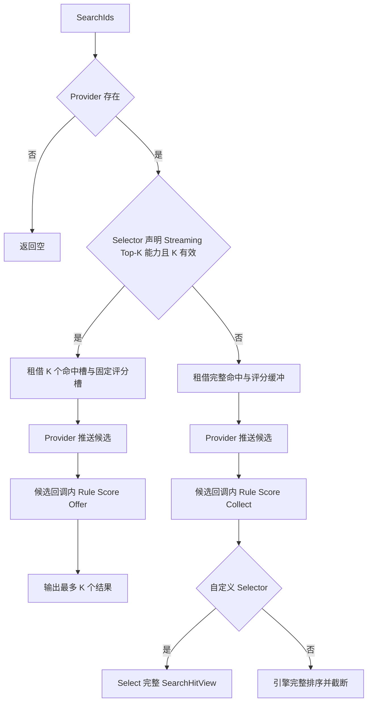

# Ability-Kit 目标查找模块开发设计文档

> **文档状态**：历史设计材料。文中的部分形状解析器、Provider 组合器和示例类型尚未进入当前运行时，不能直接作为可编译 API 清单。
>
> **实现依据**：接入时以 [运行时手册](../Manual.md)、仓库 canonical Targeting 文档和可编译源码为准。
>
> **阅读对象**：希望理解早期架构目标与演进思路的开发者。

---

## 一、设计理念：为什么要做目标查找模块？

### 1.1 传统做法的问题

```
❌ 传统做法的问题：

1. 目标查找逻辑散落各处
   ┌─────────────────────────────────────────────────────────┐
   │ // 技能A：查找范围内敌人                               │
   │ List<Entity> FindTargetsInRange(Vector3 pos, float r) {│
   │     var result = new List<Entity>();                   │
   │     foreach (var e in allEntities) {                   │
   │         if (e.HasComponent<EnemyTag>()                 │
   │             && Distance(e.Pos, pos) < r)               │
   │             result.Add(e);                             │
   │     }                                                   │
   │     return result;                                      │
   │ }                                                       │
   │                                                          │
   │ // 技能B：查找扇形敌人                                  │
   │ List<Entity> FindTargetsInSector(...) { ... }          │
   │                                                          │
   │ // 技能C：查找最近敌人                                  │
   │ Entity FindNearestEnemy(...) { ... }                    │
   │                                                          │
   │ // 改一个地方要改N处，逻辑重复                          │
   └─────────────────────────────────────────────────────────┘

2. 查找条件难以组合
   ┌─────────────────────────────────────────────────────────┐
   │ // "查找范围内 + 友方 + 非沉默 + 血量最低"             │
   │ // 要写很长一串 if                                    │
   │ foreach (var e in candidates) {                         │
   │     if (!InRange(e)) continue;                         │
   │     if (!IsAlly(e)) continue;                          │
   │     if (IsSilenced(e)) continue;                       │
   │     // ... 更多条件                                     │
   │ }                                                       │
   │                                                          │
   │ // 新增条件要改代码                                    │
   └─────────────────────────────────────────────────────────┘

3. 性能问题
   ┌─────────────────────────────────────────────────────────┐
   │ // 每帧查找目标，遍历所有实体                          │
   │ void Update() {                                        │
   │     foreach (var e in allEntities) {  // O(N)         │
   │         // 检查条件...                                 │
   │     }                                                   │
   │ }                                                       │
   │                                                          │
   │ // 100个实体 × 10种技能 × 每帧 = 大量遍历             │
   └─────────────────────────────────────────────────────────┘

4. 复用性差
   ┌─────────────────────────────────────────────────────────┐
   │ // 技能A的查找逻辑不能给技能B用                        │
   │ // 写了很多重复代码                                    │
   └─────────────────────────────────────────────────────────┘
```

### 1.2 目标查找模块的解决方案

```
✅ 目标查找的设计思路：

┌─────────────────────────────────────────────────────────────┐
│                       核心思想                              │
│                                                             │
│   把目标查找拆成"乐高积木"，自由组合                       │
│                                                             │
│   ┌─────────────────────────────────────────────────────┐  │
│   │                                                       │  │
│   │   目标查找 = 候选源 + 过滤器 + 评分器 + 选择器      │  │
│   │                                                       │  │
│   │   ┌───────────────────────────────────────────┐    │  │
│   │   │  SearchQuery                              │    │  │
│   │   │                                           │    │  │
│   │   │  ┌─────────────────────────────────────┐  │    │  │
│   │   │  │ Provider: 从哪里找候选目标          │  │    │  │
│   │   │  └─────────────────────────────────────┘  │    │  │
│   │   │                    │                     │    │  │
│   │   │                    ▼                     │    │  │
│   │   │  ┌─────────────────────────────────────┐  │    │  │
│   │   │  │ Rules: 哪些可以通过                 │  │    │  │
│   │   │  │ ├─► 范围过滤 (Circle)              │  │    │  │
│   │   │  │ ├─► 阵营过滤 (Ally/Enemy)          │  │    │  │
│   │   │  │ └─► 形状过滤 (Sector/Rect)         │  │    │  │
│   │   │  └─────────────────────────────────────┘  │    │  │
│   │   │                    │                     │    │  │
│   │   │                    ▼                     │    │  │
│   │   │  ┌─────────────────────────────────────┐  │    │  │
│   │   │  │ Scorer: 目标优先级评分              │  │    │  │
│   │   │  │ ├─► 距离评分 (近者优先)            │  │    │  │
│   │   │  │ └─► 随机评分 (随机选择)            │  │    │  │
│   │   │  └─────────────────────────────────────┘  │    │  │
│   │   │                    │                     │    │  │
│   │   │                    ▼                     │    │  │
│   │   │  ┌─────────────────────────────────────┐  │    │  │
│   │   │  │ Selector: 如何选择最终结果          │  │    │  │
│   │   │  │ └─► TopK: 取评分最高的K个         │  │    │  │
│   │   │  └─────────────────────────────────────┘  │    │  │
│   │   │                                           │    │  │
│   │   └───────────────────────────────────────────┘    │  │
│   │                                                       │  │
│   └─────────────────────────────────────────────────────┘  │
│                                                             │
│   好处：                                                    │
│   - 逻辑可复用，组件可替换                                  │
│   - 条件可组合，用配置代替代码                              │
│   - 性能优化，流式处理避免分配                              │
│                                                             │
└─────────────────────────────────────────────────────────────┘
```

### 1.3 核心理念

```
┌─────────────────────────────────────────────────────────────┐
│                    目标查找模块的三大承诺                      │
│                                                             │
│   1️⃣ 组合                                              │
│      用配置组合查找逻辑，无需写重复代码                      │
│                                                             │
│   2️⃣ 高效                                              │
│      流式处理、零GC、确定性结果                             │
│                                                             │
│   3️⃣ 通用                                              │
│      支持任意形状、任意候选源、ECS无关                       │
│                                                             │
└─────────────────────────────────────────────────────────────┘
```

---

## 二、核心概念：从零理解目标查找

### 2.1 什么是"目标查找（TargetSearch）"？

**通俗解释**：TargetSearch 是"目标筛选器"，从候选目标中按条件筛选并评分。

```
┌─────────────────────────────────────────────────────────────┐
│                    目标查找 = 目标筛选器                      │
│                                                             │
│   ┌─────────────────────────────────────────────────────┐  │
│   │                                                       │  │
│   │   技能释放请求                                        │  │
│   │   ┌───────────────────────────────────────────┐    │  │
│   │   │  目标：范围内最近的3个敌人                │    │  │
│   │   └───────────────────────────────────────────┘    │  │
│   │                    │                                │  │
│   │                    ▼                                │  │
│   │   ┌───────────────────────────────────────────┐    │  │
│   │   │  TargetSearchEngine                       │    │  │
│   │   │                                           │    │  │
│   │   │  输入: 技能请求                           │    │  │
│   │   │  输出: 目标列表                           │    │  │
│   │   │                                           │    │  │
│   │   └───────────────────────────────────────────┘    │  │
│   │                                                       │  │
│   └─────────────────────────────────────────────────────┘  │
│                                                             │
│   ┌─────────────────────────────────────────────────────┐  │
│   │                                                       │  │
│   │   内部流程：                                          │  │
│   │   ┌───────────────────────────────────────────┐    │  │
│   │   │  1. Provider: 获取候选目标                 │    │  │
│   │   │     所有敌人单位                           │    │  │
│   │   │       ↓                                    │    │  │
│   │   │  2. Rules: 过滤不符合条件的               │    │  │
│   │   │     范围外、友方单位被排除                 │    │  │
│   │   │       ↓                                    │    │  │
│   │   │  3. Scorer: 给每个目标评分                 │    │  │
│   │   │     距离越近分数越高                       │    │  │
│   │   │       ↓                                    │    │  │
│   │   │  4. Selector: 选择最终结果                 │    │  │
│   │   │     取评分最高的3个                        │    │  │
│   │   │                                           │    │  │
│   │   └───────────────────────────────────────────┘    │  │
│   │                                                       │  │
│   └─────────────────────────────────────────────────────┘  │
│                                                             │
└─────────────────────────────────────────────────────────────┘
```

### 2.2 关键名词解释

| 名词 | 通俗解释 | 类比 |
|------|----------|------|
| **SearchQuery** | 查找配置单 | 筛选条件表 |
| **SearchContext** | 查找上下文 | 工作台 |
| **ICandidateProvider** | 候选源提供者 | 候选人名单来源 |
| **ITargetRule** | 目标过滤规则 | 入职条件筛选 |
| **ITargetScorer** | 目标评分器 | 面试评分 |
| **ITargetSelector** | 目标选择器 | 录用决策 |
| **ShapeFrame2D** | 形状参考系 | 形状的位置和方向 |

---

## 三、核心架构：用图说话

### 3.1 整体架构图

```
┌─────────────────────────────────────────────────────────────────────────┐
│                          目标查找模块架构                                │
│                                                                         │
│   ┌─────────────────────────────────────────────────────────────────┐   │
│   │                     TargetSearchEngine                           │   │
│   │                        (查找引擎)                                  │   │
│   └─────────────────────────────┬───────────────────────────────────┘   │
│                                 │                                       │
│   ┌─────────────────────────────┴───────────────────────────────────┐   │
│   │                     SearchQuery (查询配置)                        │   │
│   │                                                                 │   │
│   │  ┌─────────────┐  ┌─────────────┐  ┌─────────────┐  ┌─────────┐ │   │
│   │  │  Provider   │→ │    Rules    │→ │   Scorer    │→ │ Selector│ │   │
│   │  │  (候选源)    │  │  (过滤器)    │  │  (评分器)    │  │ (选择器) │ │   │
│   │  └─────────────┘  └─────────────┘  └─────────────┘  └─────────┘ │   │
│   │                                                                 │   │
│   └─────────────────────────────────────────────────────────────────┘   │
│                               │                                         │
│                               ▼                                         │
│   ┌─────────────────────────────────────────────────────────────────┐   │
│   │                     SearchContext (上下文)                        │   │
│   │                                                                 │   │
│   │  ┌─────────────────────────────────────────────────────────┐   │   │
│   │  │  Framework Capabilities:                               │   │   │
│   │  │  ├─► PositionProvider      位置能力属性                  │   │   │
│   │  │  ├─► EntityKeyProvider     稳定键能力属性                │   │   │
│   │  │  └─► SearchStats           统计能力属性                  │   │   │
│   │  │                                                         │   │   │
│   │  │  Typed Extension Data:                                 │   │   │
│   │  │  └─► SearchContextKey<T>   包外强类型查询数据            │   │   │
│   │  └─────────────────────────────────────────────────────────┘   │   │
│   │                                                                 │   │
│   └─────────────────────────────────────────────────────────────────┘   │
│                                                                         │
└─────────────────────────────────────────────────────────────────────────┘
```

### 3.2 查找流程图



当前公开 `IStreamingTopKByScoreSelector` 无成员能力接口，但不公开 `Begin`、`Offer`、`End` 等执行态协议。Selector 声明该能力且 `MaxCount > 0` 时，引擎启用统一融合路径并负责严格字典序、统计、去重提交、NaN 排除、结果预算和缓冲区租约；需要完整命中后处理的 Selector 不实现该接口。两条路径都只消费一次 Provider 最终推送的候选流，但完整路径会在候选遍历后继续选择或排序命中集合。复合 Provider 为实现并、交、差语义，仍可能读取多个来源。

### 3.3 候选源提供者流程

```
┌─────────────────────────────────────────────────────────────────────┐
│                      候选源提供者流程                                 │
│                                                                     │
│   Provider.ForEachCandidate(query, context, ref consumer)          │
│                                                                     │
│   ┌─────────────────────────────────────────────────────────────┐  │
│   │                                                             │  │
│   │   ICandidateProvider                                       │  │
│   │   ──────────────────                                       │  │
│   │                                                             │  │
│   │   ┌───────────────────────────────────────────────────┐   │  │
│   │   │  ExplicitListCandidateProvider                    │   │  │
│   │   │  ───────────────────────────────                    │   │  │
│   │   │  直接遍历传入的实体列表                            │   │  │
│   │   │  consumer.Consume(entity);                        │   │  │
│   │   └───────────────────────────────────────────────────┘   │  │
│   │                         │                                │  │
│   │   ┌─────────────────────┴─────────────────────┐           │  │
│   │   ▼                                             ▼           │  │
│   │   ┌───────────────────┐         ┌───────────────────┐     │  │
│   │   │ IndexedList       │         │ IndexedCollection  │     │  │
│   │   │ ─────────────────  │         │ ─────────────────  │     │  │
│   │   │ 按索引获取列表     │         │ 按索引获取集合     │     │  │
│   │   └───────────────────┘         └───────────────────┘     │  │
│   │                                                             │  │
│   │   ┌───────────────────┐ ┌───────────────────┐             │  │
│   │   │ UnionDistinct      │ │ Intersect          │             │  │
│   │   │ ─────────────────  │ │ ─────────────────  │             │  │
│   │   │ 取并集去重         │ │ 取交集             │             │  │
│   │   └───────────────────┘ └───────────────────┘             │  │
│   │                                                             │  │
│   │   ┌───────────────────┐ ┌───────────────────┐             │  │
│   │   │ Except            │ │ Concat             │             │  │
│   │   │ ─────────────────  │ │ ─────────────────  │             │  │
│   │   │ 取差集             │ │ 拼接列表           │             │  │
│   │   └───────────────────┘ └───────────────────┘             │  │
│   │                                                             │  │
│   └─────────────────────────────────────────────────────────────┘  │
│                                                                     │
└─────────────────────────────────────────────────────────────────────┘
```

### 3.4 形状系统流程

```
┌─────────────────────────────────────────────────────────────────────┐
│                      形状系统流程                                     │
│                                                                     │
│   形状 = 参考系 + 参数                                               │
│                                                                     │
│   ┌─────────────────────────────────────────────────────────────┐  │
│   │                                                             │  │
│   │   ShapeFrame2D (参考系)                                    │  │
│   │   ──────────────────────                                    │  │
│   │   ┌───────────────────────────────────────────────────┐   │  │
│   │   │                                                   │   │  │
│   │   │   Origin   ───► Forward                          │   │  │
│   │   │     │             ↑                            │   │  │
│   │   │     │             │                            │   │  │
│   │   │     ▼             │                            │   │  │
│   │   │   Right    (自动计算)                           │   │  │
│   │   │                                                   │   │  │
│   │   └───────────────────────────────────────────────────┘   │  │
│   │                                                             │  │
│   └─────────────────────────────────────────────────────────────┘  │
│                               │                                   │
│                               ▼                                   │
│   ┌─────────────────────────────────────────────────────────────┐  │
│   │                                                             │  │
│   │   FrameResolver (参考系解析器)                              │  │
│   │   ──────────────────────────                                │  │
│   │                                                             │  │
│   │   ┌───────────────────────────────────────────────────┐   │  │
│   │   │  DataFrameResolver2D                              │   │  │
│   │   │  从上下文数据获取位置                             │   │  │
│   │   └───────────────────────────────────────────────────┘   │  │
│   │                                                             │  │
│   │   ┌───────────────────────────────────────────────────┐   │  │
│   │   │  EntityToEntityFrameResolver2D                     │   │  │
│   │   │  以两实体连线为参考系                             │   │  │
│   │   └───────────────────────────────────────────────────┘   │  │
│   │                                                             │  │
│   │   ┌───────────────────────────────────────────────────┐   │  │
│   │   │  OffsetFrameResolver2D                            │   │  │
│   │   │  在另一个参考系上偏移                             │   │  │
│   │   └───────────────────────────────────────────────────┘   │  │
│   │                                                             │  │
│   └─────────────────────────────────────────────────────────────┘  │
│                               │                                   │
│                               ▼                                   │
│   ┌─────────────────────────────────────────────────────────────┐  │
│   │                                                             │  │
│   │   ParamResolver (参数解析器)                                │  │
│   │   ────────────────────────                                  │  │
│   │                                                             │  │
│   │   ┌─────────────────┐ ┌─────────────────┐ ┌─────────────┐  │  │
│   │   │ CircleParams    │ │ RectParams      │ │ SectorParams│  │  │
│   │   │ ───────────────  │ │ ───────────────  │ │ ────────────│  │  │
│   │   │ radius          │ │ width, length   │ │ radius,angle│  │  │
│   │   └─────────────────┘ └─────────────────┘ └─────────────┘  │  │
│   │                                                             │  │
│   │   参数来源：                                                 │  │
│   │   - Constant: 常量值                                        │  │
│   │   - Data: 从上下文数据获取                                  │  │
│   │   - Distance: 根据实体距离计算                              │  │
│   │                                                             │  │
│   └─────────────────────────────────────────────────────────────┘  │
│                                                                     │
└─────────────────────────────────────────────────────────────────────┘
```

---

## 四、核心组件详解

### 4.1 TargetSearchEngine - 查找引擎

**通俗解释**：Engine 是"查找指挥中心"，协调整个查找流程。

```
┌─────────────────────────────────────────────────────────────┐
│                    TargetSearchEngine 结构                    │
│                                                             │
│   ┌─────────────────────────────────────────────────────┐  │
│   │                                                       │  │
│   │   public sealed class TargetSearchEngine               │  │
│   │   {                                                  │  │
│   │       public void SearchIds(                         │  │
│   │           in SearchQuery query,                      │  │
│   │           SearchContext context,                     │  │
│   │           List<EntityId> results);                   │  │
│   │                                                       │  │
│   │       public void Search<T>(                          │  │
│   │           in SearchQuery query,                      │  │
│   │           SearchContext context,                     │  │
│   │           List<T> results,                           │  │
│   │           ITargetMapper<T> mapper);                  │  │
│   │   }                                                  │  │
│   │                                                       │  │
│   └─────────────────────────────────────────────────────┘  │
│                                                             │
│   ┌─────────────────────────────────────────────────────┐  │
│   │                                                       │  │
│   │   使用示例：                                          │  │
│   │   ─────────────────────────────────────────────     │  │
│   │                                                       │  │
│   │   var engine = new TargetSearchEngine();             │  │
│   │   var results = new List<EntityId>();                │  │
│   │                                                       │  │
│   │   engine.SearchIds(in query, context, results);       │  │
│   │   // results 中就是找到的目标                          │  │
│   │                                                       │  │
│   └─────────────────────────────────────────────────────┘  │
│                                                             │
└─────────────────────────────────────────────────────────────┘
```

### 4.2 SearchQuery - 查询配置

**通俗解释**：Query 是"筛选条件表"，定义如何查找目标。

```
┌─────────────────────────────────────────────────────────────┐
│                    SearchQuery 结构                          │
│                                                             │
│   ┌─────────────────────────────────────────────────────┐  │
│   │                                                       │  │
│   │   public readonly struct SearchQuery                  │  │
│   │   {                                                  │  │
│   │       public ICandidateProvider Provider;              │  │
│   │       public IReadOnlyList<ITargetRule> Rules;        │  │
│   │       public IReadOnlyList<SearchOrder> Orders;       │  │
│   │       public ITargetSelector Selector;                │  │
│   │       public int MaxCount;                            │  │
│   │   }                                                  │  │
│   │                                                       │  │
│   └─────────────────────────────────────────────────────┘  │
│                                                             │
│   ┌─────────────────────────────────────────────────────┐  │
│   │                                                       │  │
│   │   完整查询示例：                                      │  │
│   │   ─────────────────────────────────────────────     │  │
│   │                                                       │  │
│   │   new SearchQuery(                                    │  │
│   │       provider: enemyCampProvider,  // 敌人候选源    │  │
│   │       rules: new[] {                                  │  │
│   │           new CircleShapeRule(origin, radius),         │  │
│   │           new ExcludeEntityRule(self)                 │  │
│   │       },                                              │  │
│   │       orders: new[] {                                 │  │
│   │           new SearchOrder(distanceScorer, Ascending)  │  │
│   │       },                                              │  │
│   │       selector: new StreamingTopKByScoreSelector(),   │  │
│   │       maxCount: 3  // 取最近3个                       │  │
│   │   );                                                  │  │
│   │                                                       │  │
│   └─────────────────────────────────────────────────────┘  │
│                                                             │
└─────────────────────────────────────────────────────────────┘
```

### 4.3 SearchContext - 查找上下文

**通俗解释**：Context 是一次搜索的“工作台租约”，直接提供框架已知能力，并允许包外用强类型键携带本次查询数据；它不是通用服务定位器或任意业务黑板。

```
┌─────────────────────────────────────────────────────────────┐
│                    SearchContext 结构                         │
│                                                             │
│   ┌─────────────────────────────────────────────────────┐  │
│   │                                                       │  │
│   │   public sealed class SearchContext                   │  │
│   │   {                                                  │  │
│   │       public IPositionProvider PositionProvider;     │  │
│   │       public IEntityKeyProvider EntityKeyProvider;   │  │
│   │       public ISearchStats SearchStats;               │  │
│   │                                                       │  │
│   │       public void SetData<T>(                        │  │
│   │           SearchContextKey<T> key, T value);         │  │
│   │       public bool TryGetData<T>(                     │  │
│   │           SearchContextKey<T> key, out T value);     │  │
│   │   }                                                  │  │
│   │                                                       │  │
│   └─────────────────────────────────────────────────────┘  │
│                                                             │
│   ┌─────────────────────────────────────────────────────┐  │
│   │                                                       │  │
│   │   框架能力属性：                                      │  │
│   │   ─────────────────────────────────────────────     │  │
│   │                                                       │  │
│   │   IPositionProvider                                   │  │
│   │   ├─► 获取实体位置                                   │  │
│   │   ├─► TargetSearch 需要知道目标在哪里                 │  │
│   │   └─► 形状过滤、距离评分都需要位置                    │  │
│   │                                                       │  │
│   │   IEntityKeyProvider                                  │  │
│   │   ├─► 获取排序键                                     │  │
│   │   ├─► 用于结果的稳定排序                             │  │
│   │   └─► 例如：实体ID作为键                             │  │
│   │                                                       │  │
│   │   ISearchStats                                         │  │
│   │   ├─► 统计查找过程                                   │  │
│   │   └─► 调试和优化使用                                 │  │
│   │                                                       │  │
│   └─────────────────────────────────────────────────────┘  │
│                                                             │
│   ┌─────────────────────────────────────────────────────┐  │
│   │                                                       │  │
│   │   使用示例：                                          │  │
│   │   ─────────────────────────────────────────────     │  │
│   │                                                       │  │
│   │   var context = new SearchContext                    │  │
│   │   {                                                  │  │
│   │       PositionProvider = posProvider,                │  │
│   │       EntityKeyProvider = keyProvider                │  │
│   │   };                                                 │  │
│   │                                                       │  │
│   │   // ShapeKeys.Radius 是包外静态 SearchContextKey<float> │  │
│   │   context.SetData(ShapeKeys.Radius, 5f);             │  │
│   │                                                       │  │
│   └─────────────────────────────────────────────────────┘  │
│                                                             │
└─────────────────────────────────────────────────────────────┘
```

### 4.4 ICandidateProvider - 候选源

**通俗解释**：Provider 是"候选人名单来源"，决定从哪里获取候选目标。

```
┌─────────────────────────────────────────────────────────────┐
│                    ICandidateProvider 接口                    │
│                                                             │
│   ┌─────────────────────────────────────────────────────┐  │
│   │                                                       │  │
│   │   public interface ICandidateProvider                │  │
│   │   {                                                  │  │
│   │       void ForEachCandidate<TConsumer>(             │  │
│   │           in SearchQuery query,                      │  │
│   │           SearchContext context,                     │  │
│   │           ref TConsumer consumer);                   │  │
│   │   }                                                  │  │
│   │                                                       │  │
│   └─────────────────────────────────────────────────────┘  │
│                                                             │
│   ┌─────────────────────────────────────────────────────┐  │
│   │                                                       │  │
│   │   内置实现：                                          │  │
│   │   ─────────────────────────────────────────────     │  │
│   │                                                       │  │
│   │   ExplicitListCandidateProvider                      │  │
│   │   ───────────────────────────────                    │  │
│   │   直接遍历传入的实体列表                              │  │
│   │                                                       │  │
│   │   IndexedListCandidateProvider                        │  │
│   │   ──────────────────────────────                      │  │
│   │   从索引列表获取候选                                  │  │
│   │                                                       │  │
│   │   IndexedCollectionCandidateProvider                  │  │
│   │   ──────────────────────────────────                  │  │
│   │   从索引集合获取候选                                  │  │
│   │                                                       │  │
│   │   ┌─────────────────────────────────────────────┐   │  │
│   │   │ 组合提供者：                                  │   │  │
│   │   ├─► UnionDistinct      并集去重               │   │  │
│   │   ├─► Intersect          交集                   │   │  │
│   │   ├─► Except             差集                   │   │  │
│   │   └─► Concat             拼接                    │   │  │
│   │   └─────────────────────────────────────────────┘   │  │
│   │                                                       │  │
│   └─────────────────────────────────────────────────────┘  │
│                                                             │
└─────────────────────────────────────────────────────────────┘
```

### 4.5 ITargetRule - 过滤规则

**通俗解释**：Rule 是"入职条件"，过滤掉不符合条件的候选目标。

```
┌─────────────────────────────────────────────────────────────┐
│                    ITargetRule 接口                          │
│                                                             │
│   ┌─────────────────────────────────────────────────────┐  │
│   │                                                       │  │
│   │   public interface ITargetRule                       │  │
│   │   {                                                  │  │
│   │       bool IsMatch(in SearchQuery query,             │  │
│   │           SearchContext context,                      │  │
│   │           EntityId candidate);                        │  │
│   │   }                                                  │  │
│   │                                                       │  │
│   └─────────────────────────────────────────────────────┘  │
│                                                             │
│   ┌─────────────────────────────────────────────────────┐  │
│   │                                                       │  │
│   │   内置规则：                                          │  │
│   │   ─────────────────────────────────────────────     │  │
│   │                                                       │  │
│   │   形状规则：                                          │  │
│   │   ├─► CircleShapeRule        圆形区域               │  │
│   │   ├─► OrientedRectShapeRule 定向矩形               │  │
│   │   └─► SectorShapeRule       扇形区域               │  │
│   │                                                       │  │
│   │   集合规则：                                          │  │
│   │   ├─► WhitelistRule         白名单                 │  │
│   │   ├─► BlacklistRule         黑名单                 │  │
│   │   └─► ExcludeEntityRule     排除单个实体          │  │
│   │                                                       │  │
│   │   验证规则：                                          │  │
│   │   ├─► RequireValidIdRule    有效ID                 │  │
│   │   └─► RequireHasPositionRule 有位置                │  │
│   │                                                       │  │
│   └─────────────────────────────────────────────────────┘  │
│                                                             │
│   ┌─────────────────────────────────────────────────────┐  │
│   │                                                       │  │
│   │   形状规则详解：                                      │  │
│   │   ─────────────────────────────────────────────     │  │
│   │                                                       │  │
│   │   CircleShapeRule                                    │  │
│   │   ─────────────────                                   │  │
│   │   ┌─────────────────────────────────────────────┐   │  │
│   │   │              ● 目标                         │   │  │
│   │   │                                              │   │  │
│   │   │           ● (在范围内)                       │   │  │
│   │   │     ●                                         │   │  │
│   │   │  ═══════════════════════════════════         │   │  │
│   │   │        (中心点)     ○ (在范围外)             │   │  │
│   │   └─────────────────────────────────────────────┘   │  │
│   │                                                       │  │
│   │   SectorShapeRule (扇形)                             │  │
│   │   ────────────────────                               │  │
│   │   ┌─────────────────────────────────────────────┐   │  │
│   │   │                    ╱  (扇形)                  │   │  │
│   │   │                   ╱                          │   │  │
│   │   │        ●         ╱         ●               │   │  │
│   │   │                  ▲                          │   │  │
│   │   │             (中心点)                        │   │  │
│   │   │         ●                            ○    │   │  │
│   │   └─────────────────────────────────────────────┘   │  │
│   │                                                       │  │
│   │   OrientedRectShapeRule (定向矩形)                    │  │
│   │   ─────────────────────────────                       │  │
│   │   ┌─────────────────────────────────────────────┐   │  │
│   │   │                   ↑                          │   │  │
│   │   │                   │ (Forward)               │   │  │
│   │   │  ┌────────────────┼──────────────┐         │   │  │
│   │   │  │                ●               │         │   │  │
│   │   │  │  ●                               │         │   │  │
│   │   │  │                                 │ (Right) │   │  │
│   │   │  └─────────────────────────────────┘         │   │  │
│   │   │             ●                               │   │  │
│   │   └─────────────────────────────────────────────┘   │  │
│   │                                                       │  │
│   └─────────────────────────────────────────────────────┘  │
│                                                             │
└─────────────────────────────────────────────────────────────┘
```

### 4.6 ITargetScorer - 评分器

**通俗解释**：Scorer 是"面试官"，给每个候选目标打分。

```
┌─────────────────────────────────────────────────────────────┐
│                    ITargetScorer 接口                        │
│                                                             │
│   ┌─────────────────────────────────────────────────────┐  │
│   │                                                       │  │
│   │   public interface ITargetScorer                    │  │
│   │   {                                                  │  │
│   │       float Score(in SearchQuery query,              │  │
│   │           SearchContext context,                      │  │
│   │           EntityId candidate);                       │  │
│   │   }                                                  │  │
│   │                                                       │  │
│   └─────────────────────────────────────────────────────┘  │
│                                                             │
│   ┌─────────────────────────────────────────────────────┐  │
│   │                                                       │  │
│   │   内置评分器：                                        │  │
│   │   ─────────────────────────────────────────────     │  │
│   │                                                       │  │
│   │   ZeroScorer                                          │  │
│   │   ──────────                                          │  │
│   │   所有目标分数都是0，按稳定键排序                     │  │
│   │                                                       │  │
│   │   DistanceToEntityScorer2D                           │  │
│   │   ─────────────────────────                          │  │
│   │   以某实体为参考点，计算距离分数                      │  │
│   │   分数 = -距离² (距离越近分数越高)                   │  │
│   │                                                       │  │
│   │   DistanceToFrameOriginScorer2D                      │  │
│   │   ──────────────────────────────                      │  │
│   │   以形状参考系原点为参考点                           │  │
│   │                                                       │  │
│   │   SeededHashRandomScorer                             │  │
│   │   ───────────────────────                            │  │
│   │   确定性随机评分，种子来自上下文                     │  │
│   │   用于"随机选择"功能                                 │  │
│   │                                                       │  │
│   └─────────────────────────────────────────────────────┘  │
│                                                             │
│   ┌─────────────────────────────────────────────────────┐  │
│   │                                                       │  │
│   │   评分器组合示例：                                    │  │
│   │   ─────────────────────────────────────────────     │  │
│   │                                                       │  │
│   │   // 优先选择血量低的                                │  │
│   │   var hpScorer = new PropertyScorer(entity =>       │  │
│   │       -entity.GetComponent<HealthComponent>().HP);  │  │
│   │                                                       │  │
│   │   // 组合：距离优先，血量次之                        │  │
│   │   var combinedScorer = new CombinedScorer(           │  │
│   │       distanceScorer, 0.7f,                          │  │
│   │       hpScorer, 0.3f);                              │  │
│   │                                                       │  │
│   └─────────────────────────────────────────────────────┘  │
│                                                             │
└─────────────────────────────────────────────────────────────┘
```

### 4.7 ITargetSelector - 选择器

**通俗解释**：Selector 是"录用决策者"，从通过筛选的目标中选择最终结果。引擎保持命中与结果容器的所有权，Selector 只能读取命中并追加结果。

```
┌─────────────────────────────────────────────────────────────┐
│                    ITargetSelector 接口                      │
│                                                             │
│   ┌─────────────────────────────────────────────────────┐  │
│   │                                                       │  │
│   │   public interface ITargetSelector                   │  │
│   │   {                                                  │  │
│   │       void Select(in SearchQuery query,              │  │
│   │           SearchContext context,                      │  │
│   │           SearchHitView hits,                        │  │
│   │           SearchResultWriter results);               │  │
│   │   }                                                  │  │
│   │                                                       │  │
│   └─────────────────────────────────────────────────────┘  │
│                                                             │
│   ┌─────────────────────────────────────────────────────┐  │
│   │                                                       │  │
│   │   内置选择器：                                        │  │
│   │   ─────────────────────────────────────────────     │  │
│   │                                                       │  │
│   │   TopKByScoreSelector                                │  │
│   │   ────────────────────                               │  │
│   │   保存 H 个命中及 H×M 个评分后排序                   │  │
│   │   时间复杂度：O(H log H × M)                         │  │
│   │   空间复杂度：O(H × M)                               │  │
│   │                                                       │  │
│   │   StreamingTopKByScoreSelector                       │  │
│   │   ──────────────────────────────                      │  │
│   │   内置类型且 K 有效时，在候选回调内维护有序小数组    │  │
│   │   时间复杂度：最坏 O(H × K × M)，不是堆式 O(H log K)│  │
│   │   空间复杂度：O((K + 1) × M)                         │  │
│   │                                                       │  │
│   └─────────────────────────────────────────────────────┘  │
│                                                             │
│   ┌─────────────────────────────────────────────────────┐  │
│   │                                                       │  │
│   │   选择器选择建议：                                    │  │
│   │   ─────────────────────────────────────────────     │  │
│   │                                                       │  │
│   │   ┌───────────────────┬─────────────────────────┐   │  │
│   │   │ 场景               │ 推荐选择器                │   │  │
│   │   ├───────────────────┼─────────────────────────┤   │  │
│   │   │ 需要完整排序      │ TopKByScoreSelector          │   │  │
│   │   │ 小K、只需TopK     │ StreamingTopKByScoreSelector │   │  │
│   │   │ 自定义全局后处理  │ 自定义 ITargetSelector       │   │  │
│   │   └───────────────────┴─────────────────────────┘   │  │
│   │                                                       │  │
│   └─────────────────────────────────────────────────────┘  │
│                                                             │
└─────────────────────────────────────────────────────────────┘
```

---

## 五、设计模式总结

### 5.1 模块使用的设计模式

```
┌─────────────────────────────────────────────────────────────┐
│                    设计模式应用                              │
│                                                             │
│   1️⃣ Pipeline Pattern（管线模式）                          │
│      ─────────────────────────────────────                  │
│      查找流程分为多个阶段，顺序执行                          │
│      Provider → Rules → Scorer → Selector                  │
│                                                             │
│      ┌─────────────────────────────────────────────────┐   │
│      │                                                   │   │
│      │   候选人  →  筛选  →  评分  →  选择  →  结果    │   │
│      │     │          │        │        │              │   │
│      │     ▼          ▼        ▼        ▼              │   │
│      │   Provider   Rules    Scorer  Selector           │   │
│      │                                                   │   │
│      └─────────────────────────────────────────────────┘   │
│                                                             │
│   2️⃣ Strategy Pattern（策略模式）                          │
│      ─────────────────────────────────────                  │
│      每个阶段都可以替换为不同策略                          │
│                                                             │
│      ┌─────────────────────────────────────────────────┐   │
│      │                                                   │   │
│      │   Provider: IndexedList / IndexedCollection     │   │
│      │   Rule:      Circle / Sector / Rect              │   │
│      │   Scorer:    Distance / Random / Zero            │   │
│      │   Selector:  TopK / Online / Streaming            │   │
│      │                                                   │   │
│      └─────────────────────────────────────────────────┘   │
│                                                             │
│   3️⃣ Composite Pattern（组合模式）                          │
│      ─────────────────────────────────────                  │
│      Provider 可以组合：Union / Intersect / Except          │
│                                                             │
│      ┌─────────────────────────────────────────────────┐   │
│      │                                                   │   │
│      │   ┌─────────────────────────────────────────┐  │   │
│      │   │  UnionDistinct                           │  │   │
│      │   │  ┌─────────┐         ┌─────────┐        │  │   │
│      │   │  │ List A  │  ∪       │ List B  │        │  │   │
│      │   │  └─────────┘         └─────────┘        │  │   │
│      │   └─────────────────────────────────────────┘  │   │
│      │                                                   │   │
│      └─────────────────────────────────────────────────┘   │
│                                                             │
│   4️⃣ Resolver Pattern（解析器模式）                          │
│      ─────────────────────────────────────                  │
│      形状参考系和参数分离，可自由组合                        │
│                                                             │
│      ┌─────────────────────────────────────────────────┐   │
│      │                                                   │   │
│      │   FrameResolver      +   ParamResolver          │   │
│      │   ├─► Origin        ×   ├─► Circle(r)         │   │
│      │   └─► Forward       ×   ├─► Rect(w,l)         │   │
│      │                           └─► Sector(r,angle) │   │
│      │                                                   │   │
│      └─────────────────────────────────────────────────┘   │
│                                                             │
│   5️⃣ Explicit Context Pattern（显式上下文模式）              │
│      ────────────────────────────────────────────────────  │
│      核心能力使用强类型属性，包外数据使用静态强类型键          │
│      长期业务依赖通过构造注入，不把 Context 当服务容器          │
│                                                             │
└─────────────────────────────────────────────────────────────┘
```

### 5.2 各模式解决的问题

| 模式 | 解决的问题 |
|------|------------|
| Pipeline | 流程清晰，各阶段独立 |
| Strategy | 灵活替换实现 |
| Composite | 组合多个提供者 |
| Resolver | 形状组成灵活 |
| Explicit Context | 核心依赖可见，包外扩展键类型安全且可池化清理 |

---

## 六、使用指南

### 6.1 基础使用示例

```csharp
// 场景：MOBA 技能"范围内最近的敌人"

public class SkillTargetFinder
{
    private readonly TargetSearchEngine _engine = new();
    private readonly SearchContext _context = new();

    // 查找目标
    public List<EntityId> FindNearestEnemies(
        Vector2 origin,
        Vector2 forward,
        EntityId self,
        float radius,
        int count)
    {
        // 创建形状参考系
        var frame = new ShapeFrame2D(origin, forward);

        // 创建查询
        var query = new SearchQuery(
            Provider: new IndexedListCandidateProvider(
                EntityIndexKeys.EnemyCamp),  // 敌人候选源
            Rules: new ITargetRule[]
            {
                new ResolvedCircleRule2D(  // 圆形过滤
                    frame,
                    CircleParamsConstantResolver2D.Default),
                new ExcludeEntityRule(self)  // 排除自己
            },
            Scorer: new DistanceToFrameOriginScorer2D(frame),  // 距离评分
            Selector: new StreamingTopKByScoreSelector(),
            MaxCount: count
        );

        // 注入上下文数据
        _context.SetData(ShapeKeys.Radius, radius);

        // 执行查找
        var results = new List<EntityId>();
        _engine.SearchIds(in query, _context, results);

        return results;
    }
}
```

### 6.2 复杂形状示例

```csharp
// 场景：指向性矩形（从施法者到目标）

public List<EntityId> FindTargetsInLine(
    EntityId caster,
    EntityId target,
    float width)
{
    // 参考系：两实体连线
    var frameResolver = new EntityToEntityFrameResolver2D(
        caster, target, useMidPointAsOrigin: true);

    // 参数：宽度固定，长度=距离
    var paramResolver = new RectLengthFromEntityDistanceResolver2D(
        caster, target, width, 1f, 0f);

    // 获取参考系
    frameResolver.ResolveFrame(_context, out var frame);

    var query = new SearchQuery(
        Provider: indexedProvider,
        Rules: new ITargetRule[]
        {
            new ResolvedOrientedRectRule2D(
                frame,
                paramResolver,
                pivot: RectPivot.Center)
        },
        Scorer: null,  // 不评分
        Selector: new TopKByScoreSelector(),
        MaxCount: 10
    );

    var results = new List<EntityId>();
    _engine.SearchIds(in query, _context, results);
    return results;
}
```

### 6.3 条件与候选源组合边界

当前运行时的多条顶层 Rule 按顺序组成 AND，并在首个失败处短路；`AndRule`、`OrRule`、`NotRule` 可显式构造嵌套表达式。例如 `A AND (B OR C) AND NOT D` 可以直接表示为 `new AndRule(A, new OrRule(B, C), new NotRule(D))`。空 AND 为真，空 OR 为假，NOT 拒绝空操作数；AND 和 OR 都按声明顺序短路。

Provider 组合属于另一层候选序列与集合语义：`ConcatCandidateProvider` 按来源顺序拼接并保留重复；`UnionDistinctCandidateProvider`、`IntersectCandidateProvider`、`ExceptCandidateProvider` 分别提供并集、交集和差集。集合成员按 Context 中的 `IEntityKeyProvider` 判断，缺失时使用 `EntityId.Value`。并集保留全局首次代表项，交集保留第一来源中的首次代表项，差集保留主来源中的首次代表项，结果顺序都由这些代表项的首次出现顺序确定。

生产接入应优先：

1. 让项目 Provider 直接遍历复合索引或空间索引；
2. 用顶层 Rule 或 `AndRule`、`OrRule`、`NotRule` 完成逐候选资格判断；
3. 只有确实需要多来源集合运算时才使用组合 Provider，因为并、交、差需要填充池化稳定键集合，交集还会暂存第一来源中的唯一候选。

`BlacklistRule` 与 `ExcludeEntityRule` 是逐候选 NOT，查询级 `DistinctByEntityKey` 是最终候选去重；它们都不等同于 Provider 集合差集。组合 Provider 的临时列表和键集合由 `TargetingPool` 租借，并在异常路径通过 `finally` 归还。

### 6.4 确定性随机选择示例

```csharp
// 场景：从范围内随机选择3个目标
private static readonly SearchContextKey<int> RandomSeedKey =
    new SearchContextKey<int>("Skill.RandomSeed");

public List<EntityId> FindRandomTargets(
    Vector2 origin,
    float radius,
    int count,
    int seed)
{
    // 业务项目通常通过 facade 隐藏静态键
    _context.SetData(RandomSeedKey, seed);

    var frame = new ShapeFrame2D(origin, Vector2.right);

    var query = new SearchQuery(
        Provider: provider,
        Rules: new ITargetRule[]
        {
            new ResolvedCircleRule2D(frame, CircleParamsConstantResolver2D.Default)
        },
        Scorer: new SeededHashRandomScorer(RandomSeedKey),  // 确定性随机
        Selector: new StreamingTopKByScoreSelector(),
        MaxCount: count
    );

    _context.SetData(ShapeKeys.Radius, radius);

    var results = new List<EntityId>();
    _engine.SearchIds(in query, _context, results);
    return results;
}
```

---

## 七、解决的问题与适用场景

### 7.1 目标查找模块解决什么问题

```
┌─────────────────────────────────────────────────────────────┐
│                    目标查找模块解决的问题                     │
│                                                             │
│   1️⃣ 逻辑复用                                            │
│      ─────────────────────────────────────                  │
│      组件化设计，查找逻辑可复用                            │
│      新技能只需要组合现有组件                             │
│                                                             │
│   2️⃣ 条件组合                                            │
│      ─────────────────────────────────────                  │
│      支持任意形状、任意候选源                             │
│      条件可叠加，无需写重复代码                            │
│                                                             │
│   3️⃣ 性能优化                                            │
│      ─────────────────────────────────────                  │
│      Provider 推送式候选消费                              │
│      小 K 可融合 Rule、Score 与有序 TopK                 │
│      完整命中路径保留自定义全局后处理能力                 │
│                                                             │
│   4️⃣ 确定性结果                                          │
│      ─────────────────────────────────────                  │
│      支持稳定排序                                        │
│      确定性随机用于录像回放                               │
│                                                             │
└─────────────────────────────────────────────────────────────┘
```

### 7.2 适用场景

```
┌─────────────────────────────────────────────────────────────┐
│                    适用场景                                  │
│                                                             │
│   ✅ 非常适合：                                             │
│   ──────────────────────────────────────────────────────── │
│   - MOBA 技能目标查找：圆形、扇形、定向矩形              │
│   - RPG 范围攻击：AOE 技能的目标选择                      │
│   - AI 视野检测：扇形视野内的敌人                        │
│   - 锁定系统：优先选择最近/血量最低的目标                │
│                                                             │
│   ❌ 不太适合：                                             │
│   ──────────────────────────────────────────────────────── │
│   - 复杂条件：需要多轮计算的复杂判定                      │
│   - 路径相关：需要 A* 等路径搜索的目标选择               │
│                                                             │
└─────────────────────────────────────────────────────────────┘
```

---

## 八、快速参考

### 8.1 常用类速查表

```
┌─────────────────────────────────────────────────────────────┐
│                    常用类速查                                │
│                                                             │
│   核心：                                                    │
│   ┌─────────────────────────────────────────────────────┐  │
│   │ TargetSearchEngine   查找引擎                      │  │
│   │ SearchQuery          查询配置                      │  │
│   │ SearchContext        查找上下文                    │  │
│   │ SearchHit            命中结果                      │  │
│   └─────────────────────────────────────────────────────┘  │
│                                                             │
│   候选源：                                                  │
│   ┌─────────────────────────────────────────────────────┐  │
│   │ ICandidateProvider        候选源接口               │  │
│   │ ConcatCandidateProvider   顺序拼接                 │  │
│   │ UnionDistinctCandidateProvider 并集去重           │  │
│   │ IntersectCandidateProvider 交集                    │  │
│   │ ExceptCandidateProvider   差集                     │  │
│   └─────────────────────────────────────────────────────┘  │
│                                                             │
│   规则：                                                    │
│   ┌─────────────────────────────────────────────────────┐  │
│   │ ITargetRule                 规则接口               │  │
│   │ AndRule / OrRule / NotRule  布尔组合              │  │
│   │ CircleShapeRule             圆形区域              │  │
│   │ SectorShapeRule             扇形区域              │  │
│   │ OrientedRectShapeRule       定向矩形              │  │
│   │ ExcludeEntityRule           排除实体              │  │
│   └─────────────────────────────────────────────────────┘  │
│                                                             │
│   评分器：                                                  │
│   ┌─────────────────────────────────────────────────────┐  │
│   │ ITargetScorer               评分器接口            │  │
│   │ ZeroScorer                  零分                  │  │
│   │ DistanceToEntityScorer2D   距离评分              │  │
│   │ SeededHashRandomScorer     随机评分              │  │
│   └─────────────────────────────────────────────────────┘  │
│                                                             │
│   选择器：                                                  │
│   ┌─────────────────────────────────────────────────────┐  │
│   │ ITargetSelector                   选择器接口      │  │
│   │ TopKByScoreSelector              完整排序取TopK │  │
│   │ StreamingTopKByScoreSelector     融合有序TopK   │  │
│   └─────────────────────────────────────────────────────┘  │
│                                                             │
└─────────────────────────────────────────────────────────────┘
```

### 8.2 形状速查

```
┌─────────────────────────────────────────────────────────────┐
│                    形状速查                                  │
│                                                             │
│   ┌─────────────────────────────────────────────────────┐  │
│   │  CircleShapeRule (圆形)                             │  │
│   │  ─────────────────                                  │  │
│   │  在以某点为圆心、半径为r的圆内                      │  │
│   │                                                       │  │
│   │         ○                                           │  │
│   │       ╱   ╲                                         │  │
│   │      ○     ○                                        │  │
│   │       ╲   ╱                                         │  │
│   │         ●  (圆心)                                    │  │
│   │                                                       │  │
│   └─────────────────────────────────────────────────────┘  │
│                                                             │
│   ┌─────────────────────────────────────────────────────┐  │
│   │  SectorShapeRule (扇形)                             │  │
│   │  ─────────────────                                  │  │
│   │  以某点为圆心，半径r，角度θ的扇形区域              │  │
│   │                                                       │  │
│   │              ╱  ╲                                   │  │
│   │             ╱    ╲                                  │  │
│   │            ○      ○                                  │  │
│   │             ╲    ╱                                   │  │
│   │              ╲  ╱                                    │  │
│   │                ● (圆心)                              │  │
│   │                                                       │  │
│   └─────────────────────────────────────────────────────┘  │
│                                                             │
│   ┌─────────────────────────────────────────────────────┐  │
│   │  OrientedRectShapeRule (定向矩形)                    │  │
│   │  ──────────────────────────                          │  │
│   │  以某方向为前向，宽w长l的矩形区域                   │  │
│   │                                                       │  │
│   │  ┌─────────────────┐                                 │  │
│   │  │                 │ ↑                              │  │
│   │  │       ●         │ (Forward)                      │  │
│   │  │                 │                                 │  │
│   │  └─────────────────┘                                 │  │
│   │                                                       │  │
│   └─────────────────────────────────────────────────────┘  │
│                                                             │
└─────────────────────────────────────────────────────────────┘
```

---

*文档版本：1.0*
*最后更新：2026-03-19*
